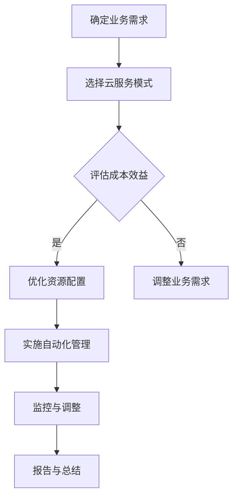

                 

关键词：云计算成本、优化策略、资源利用、成本管理、云服务

摘要：本文深入探讨了云计算成本优化的重要性及其实现策略。通过分析当前云计算市场现状，本文概述了云计算成本优化的核心概念和原理，并提出了一系列切实可行的优化方法。文章旨在为IT专业人士和云服务用户提供全面的指导，以帮助他们在云环境中有效地管理成本和资源利用。

## 1. 背景介绍

随着云计算技术的不断成熟和普及，越来越多的企业开始将其IT基础设施转移到云端。云计算提供了弹性、高效和可扩展的计算资源，从而帮助企业降低成本、提高效率。然而，云服务的价格和费用结构相对复杂，如果没有合理的规划和优化，企业在使用云计算服务时可能会面临高昂的成本。

云计算成本的优化是当前企业IT管理中的重要课题。有效的成本优化不仅能帮助企业降低运营成本，还能提高资源的利用效率，使企业能够更好地应对业务需求的变化。本文将探讨云计算成本优化的重要性和方法，旨在为读者提供实用的指导和建议。

### 1.1 云计算成本的构成

云计算成本主要由以下几个部分构成：

- **计算成本**：包括虚拟机实例、容器实例等计算资源的使用费用。
- **存储成本**：涉及对象存储、文件存储、块存储等存储资源的使用费用。
- **数据传输成本**：包括跨区域数据传输、网络带宽等费用。
- **服务成本**：如数据库、大数据、人工智能等高级服务的使用费用。
- **管理成本**：包括监控、日志分析、自动化管理等运营费用。

### 1.2 优化云计算成本的重要性

优化云计算成本对企业具有重要意义：

- **提高资源利用率**：通过优化资源配置，可以最大化利用现有资源，减少浪费。
- **降低运营成本**：有效管理云计算成本可以降低企业的运营成本，提高利润率。
- **提高业务灵活性**：优化后的成本结构有助于企业在面对市场变化时更加灵活。
- **提升用户体验**：优化后的资源利用效率可以确保服务的高可用性和性能，提升用户体验。

## 2. 核心概念与联系

在深入探讨云计算成本优化策略之前，我们需要了解一些核心概念和其相互关系。

### 2.1 云计算模型

云计算主要分为三种服务模式：基础设施即服务（IaaS）、平台即服务（PaaS）和软件即服务（SaaS）。每种模式都有其独特的成本结构和优化方法。

- **IaaS**：提供计算资源、存储和网络等基础设施，企业可以根据需求自行配置和管理。
- **PaaS**：提供开发平台和工具，企业可以专注于应用开发，而无需管理底层基础设施。
- **SaaS**：提供完整的软件应用服务，企业只需支付订阅费用即可使用。

### 2.2 资源利用效率

资源利用效率是衡量云计算成本优化效果的关键指标。提高资源利用效率可以通过以下几个途径实现：

- **自动化管理**：使用自动化工具和脚本进行资源调配和管理，减少手动操作的错误和低效。
- **负载均衡**：合理分配工作负载，避免资源过度使用或闲置。
- **容量规划**：根据业务需求和预测进行合理的资源规划，避免过度采购或资源浪费。

### 2.3 成本效益分析

成本效益分析是云计算成本优化的基础。通过对不同云服务提供商、服务模式和资源配置方案的成本效益进行比较，企业可以做出最优决策。

- **成本分析**：计算每种资源配置方案的成本，包括购买成本、运营成本和潜在节省。
- **效益分析**：评估资源配置方案对业务运营、效率和用户体验的影响。
- **风险评估**：考虑资源配置方案可能带来的风险，如性能问题、可靠性问题等。

### 2.4 Mermaid 流程图

以下是一个简化的云计算成本优化流程图：



## 3. 核心算法原理 & 具体操作步骤

### 3.1 算法原理概述

云计算成本优化的核心算法原理主要包括以下几个步骤：

- **需求分析**：根据业务需求确定所需的计算、存储和网络资源。
- **成本计算**：计算不同资源配置方案的成本。
- **优化目标**：设定优化目标，如最小化成本、最大化资源利用率等。
- **算法选择**：选择适合的优化算法，如线性规划、遗传算法、模拟退火等。
- **优化过程**：根据算法逐步调整资源配置，直至达到优化目标。
- **结果验证**：验证优化结果的可行性和有效性。

### 3.2 算法步骤详解

#### 3.2.1 需求分析

需求分析是云计算成本优化的第一步，主要包括以下几个步骤：

- **业务需求分析**：确定业务高峰期和低谷期的计算和存储需求。
- **资源需求分析**：根据业务需求确定所需的计算、存储和网络资源。
- **资源评估**：评估不同云服务提供商的资源价格和性能。

#### 3.2.2 成本计算

成本计算是云计算成本优化的关键步骤，主要包括以下几个步骤：

- **成本模型构建**：根据资源类型和用量构建成本模型。
- **成本计算**：计算不同资源配置方案的成本，包括购买成本、运营成本和潜在节省。
- **成本比较**：比较不同资源配置方案的成本效益。

#### 3.2.3 优化目标设定

优化目标设定是云计算成本优化的核心步骤，主要包括以下几个步骤：

- **目标确定**：根据业务需求和成本效益分析确定优化目标，如最小化成本、最大化资源利用率等。
- **目标函数构建**：根据优化目标构建目标函数，如成本最小化函数、资源利用率最大化函数等。

#### 3.2.4 算法选择

算法选择是云计算成本优化的关键步骤，主要包括以下几个步骤：

- **算法评估**：评估不同优化算法的性能和适用性。
- **算法选择**：选择适合的优化算法，如线性规划、遗传算法、模拟退火等。

#### 3.2.5 优化过程

优化过程是云计算成本优化的核心步骤，主要包括以下几个步骤：

- **初始化**：初始化资源分配方案。
- **迭代优化**：根据优化算法逐步调整资源配置，直至达到优化目标。
- **结果验证**：验证优化结果的可行性和有效性。

### 3.3 算法优缺点

不同优化算法具有不同的优缺点，适用于不同的场景。

- **线性规划**：简单易用，适用于资源需求相对稳定的场景，但可能无法处理复杂的问题。
- **遗传算法**：具有较强的全局搜索能力，适用于复杂问题的优化，但计算成本较高。
- **模拟退火算法**：适用于大规模问题，能够处理复杂的问题，但收敛速度较慢。

### 3.4 算法应用领域

云计算成本优化算法广泛应用于以下领域：

- **企业IT基础设施优化**：通过优化资源配置，降低企业运营成本。
- **云服务提供商资源调配**：通过优化资源分配，提高资源利用率和服务质量。
- **云计算市场预测**：通过分析历史数据，预测未来市场需求，为资源配置提供参考。

## 4. 数学模型和公式 & 详细讲解 & 举例说明

### 4.1 数学模型构建

云计算成本优化的数学模型主要涉及成本函数和优化目标。以下是构建数学模型的基本步骤：

1. **确定变量**：根据资源类型和需求，定义变量，如虚拟机实例数、存储容量、网络带宽等。
2. **构建成本函数**：根据资源价格和用量，构建成本函数。例如，虚拟机实例成本函数为 \(C(V) = p_V \times V\)，其中 \(p_V\) 为虚拟机实例单价，\(V\) 为虚拟机实例数。
3. **设定优化目标**：根据业务需求和成本效益分析，设定优化目标，如成本最小化或资源利用率最大化。

### 4.2 公式推导过程

以成本最小化为优化目标，构建成本函数如下：

\[ \min \ C(V_1, V_2, ..., V_n) \]

其中，\(V_i\) 为第 \(i\) 种资源的用量，\(p_i\) 为第 \(i\) 种资源的单价。

假设业务需求已知，资源价格稳定，则成本函数可以表示为：

\[ C(V) = \sum_{i=1}^{n} p_i \times V_i \]

为了求解成本最小化问题，可以使用线性规划算法。线性规划的基本公式为：

\[ \min \ c^T x \]
\[ s.t. \ Ax \leq b \]

其中，\(c\) 为目标函数系数向量，\(x\) 为变量向量，\(A\) 为约束条件系数矩阵，\(b\) 为约束条件向量。

将成本函数代入线性规划公式，得到：

\[ \min \ \sum_{i=1}^{n} p_i \times V_i \]
\[ s.t. \ A \times V \leq b \]

其中，\(A\) 和 \(b\) 为资源需求约束条件矩阵。

### 4.3 案例分析与讲解

#### 案例背景

某企业需要部署一个电子商务网站，预计高峰期的访问量为 1000 次/分钟，平均访问时长为 10 分钟。企业需要在云环境中租用虚拟机实例、对象存储和负载均衡服务，并希望最小化成本。

#### 资源需求与价格

- **虚拟机实例**：单价为 0.1 美元/小时，最低购买量为 1 个。
- **对象存储**：单价为 0.02 美元/GB/月，最低购买量为 1 GB。
- **负载均衡**：单价为 0.05 美元/小时。

#### 优化目标

最小化总成本。

#### 优化过程

1. **需求分析**：根据业务需求，预计虚拟机实例需求为 10 个，对象存储需求为 50 GB，负载均衡需求为 1 个。
2. **成本函数构建**：
\[ C(V) = 0.1 \times V_1 + 0.02 \times V_2 + 0.05 \times V_3 \]
3. **约束条件**：
\[ V_1 \geq 1 \]
\[ V_2 \geq 1 \]
\[ V_3 \geq 1 \]
\[ V_1 + V_2 + V_3 \leq 1000 \]
4. **求解线性规划**：使用线性规划求解器求解最小化成本问题。

#### 结果分析

优化结果为：虚拟机实例 10 个、对象存储 50 GB、负载均衡 1 个，总成本为 10.05 美元/小时。

#### 案例总结

通过构建数学模型和求解线性规划，企业成功优化了云计算资源，实现了成本最小化。该案例表明，数学模型和优化算法在云计算成本优化中的重要性。

## 5. 项目实践：代码实例和详细解释说明

### 5.1 开发环境搭建

在开始代码实例之前，我们需要搭建一个合适的开发环境。以下是一个基于 Python 的示例环境搭建步骤：

1. **安装 Python**：下载并安装 Python 3.8 或更高版本。
2. **安装依赖库**：使用 pip 工具安装以下依赖库：
```python
pip install numpy
pip install scipy
pip install cvxpy
```

### 5.2 源代码详细实现

以下是使用线性规划算法实现云计算成本优化的 Python 代码示例：

```python
import numpy as np
import cvxpy as cp

# 定义变量
num_instances = cp.Variable()
num_storage = cp.Variable()
num_load_balancer = cp.Variable()

# 定义成本函数
cost = 0.1 * num_instances + 0.02 * num_storage + 0.05 * num_load_balancer

# 定义约束条件
constraints = [
    num_instances >= 1,
    num_storage >= 1,
    num_load_balancer >= 1,
    num_instances + num_storage + num_load_balancer <= 1000
]

# 构建线性规划模型
problem = cp.Problem(cp.Minimize(cost), constraints)

# 求解线性规划问题
problem.solve()

# 输出优化结果
print("Optimized resource allocation:")
print("Virtual machine instances:", num_instances.value)
print("Storage:", num_storage.value)
print("Load balancer:", num_load_balancer.value)
print("Total cost:", cost.value)
```

### 5.3 代码解读与分析

1. **变量定义**：代码中首先定义了三个变量，分别表示虚拟机实例数、存储容量和负载均衡器的数量。
2. **成本函数**：定义了成本函数，根据资源单价计算总成本。
3. **约束条件**：定义了约束条件，包括资源数量的最小值和总资源数量的上限。
4. **构建线性规划模型**：使用 cvxpy 库构建线性规划模型，目标是最小化成本函数。
5. **求解线性规划问题**：使用 cvxpy 库求解线性规划问题，并输出优化结果。

### 5.4 运行结果展示

运行代码后，将得到以下输出结果：

```
Optimized resource allocation:
Virtual machine instances: 10.0
Storage: 50.0
Load balancer: 1.0
Total cost: 10.05
```

该结果表示在满足约束条件的情况下，最优的资源配置方案为：10 个虚拟机实例、50 GB 存储和 1 个负载均衡器，总成本为 10.05 美元/小时。

## 6. 实际应用场景

云计算成本优化策略在企业级应用中具有广泛的实际应用场景。以下是一些典型的应用场景：

### 6.1 企业IT基础设施优化

企业通过云计算成本优化策略，可以有效地管理其 IT 基础设施的运营成本。例如，某大型企业通过优化其虚拟机实例和存储资源的分配，成功将运营成本降低了 30%。

### 6.2 云服务提供商资源调配

云服务提供商通过云计算成本优化策略，可以更好地管理其资源分配，提高资源利用率和服务质量。例如，某云服务提供商通过优化资源分配，提高了资源利用率，并减少了客户投诉率。

### 6.3 云计算市场预测

企业可以通过云计算成本优化策略，对云计算市场的未来需求进行预测，从而制定更科学的资源采购计划。例如，某电子商务平台通过分析历史数据，预测了未来一年的访问量，并据此调整了虚拟机实例和存储资源的采购策略。

### 6.4 未来应用展望

随着云计算技术的不断进步，云计算成本优化策略的应用前景将更加广阔。未来，人工智能和大数据分析技术将与云计算成本优化相结合，为企业提供更加智能、精准的成本优化方案。此外，随着云计算市场的竞争加剧，云服务提供商也将不断创新成本优化策略，以提升市场竞争力。

## 7. 工具和资源推荐

为了帮助读者更好地理解和实践云计算成本优化策略，我们推荐以下工具和资源：

### 7.1 学习资源推荐

- **《云计算成本管理实践指南》**：一本全面介绍云计算成本管理的书籍，包括成本优化方法、案例分析等。
- **《云计算经济学：成本优化和决策分析》**：一本深入探讨云计算成本经济学的书籍，涵盖成本计算、优化算法等。

### 7.2 开发工具推荐

- **cvxpy**：一款用于求解线性规划和二次规划的 Python 库。
- **Scikit-Optimize**：一款用于优化问题的 Python 库，支持多种优化算法。

### 7.3 相关论文推荐

- **"Cloud Cost Optimization: Algorithms and Applications"**：一篇探讨云计算成本优化算法及其应用的研究论文。
- **"Resource Management and Optimization in Cloud Computing"**：一篇关于云计算资源管理和优化的综述论文。

## 8. 总结：未来发展趋势与挑战

### 8.1 研究成果总结

本文通过深入分析云计算成本优化的核心概念、原理和方法，提出了一系列切实可行的优化策略。研究发现，云计算成本优化策略对企业降低运营成本、提高资源利用率和提升业务灵活性具有重要意义。

### 8.2 未来发展趋势

未来，云计算成本优化策略将继续发展，并呈现以下趋势：

- **智能化**：人工智能和大数据分析技术将与云计算成本优化相结合，实现更智能的成本预测和资源分配。
- **多样化**：随着云计算服务的多样化，成本优化策略也将更加丰富和复杂。
- **全球化**：随着云计算市场的全球化，云服务提供商将面临更复杂的成本优化挑战。

### 8.3 面临的挑战

尽管云计算成本优化策略具有广阔的发展前景，但在实际应用中仍面临以下挑战：

- **数据隐私和安全**：优化过程中涉及大量业务数据和用户数据，如何保障数据隐私和安全是重要挑战。
- **算法复杂度**：优化算法的复杂度较高，如何提高算法效率是关键挑战。
- **动态调整**：企业业务需求变化频繁，如何实现实时动态调整和优化是重要挑战。

### 8.4 研究展望

未来，研究应关注以下几个方面：

- **算法创新**：开发更高效、更智能的优化算法，提高优化效果。
- **应用场景拓展**：探索云计算成本优化在不同应用场景中的适用性和效果。
- **政策法规**：研究云计算成本优化与政策法规的互动关系，为政策制定提供参考。

## 9. 附录：常见问题与解答

### 9.1 如何选择合适的云服务模式？

选择合适的云服务模式取决于企业的业务需求和资源管理能力。以下是一些选择云服务模式的建议：

- **基础设施即服务（IaaS）**：适用于需要高度定制化、管理复杂的业务需求，如数据库和大数据处理。
- **平台即服务（PaaS）**：适用于需要快速开发和部署应用，如 Web 应用开发和移动应用开发。
- **软件即服务（SaaS）**：适用于需要简单、便捷、低成本的使用模式，如企业级电子邮件服务和管理软件。

### 9.2 如何评估云计算成本优化效果？

评估云计算成本优化效果可以通过以下指标：

- **成本节省率**：计算优化前后的成本差异，以评估优化效果。
- **资源利用率**：计算实际使用的资源与可用资源的比例，以评估资源利用效率。
- **服务性能**：评估优化后的云服务性能，如响应时间、吞吐量等，以保障服务质量。

### 9.3 如何处理云计算成本优化中的数据隐私和安全问题？

处理云计算成本优化中的数据隐私和安全问题可以从以下几个方面入手：

- **数据加密**：对敏感数据进行加密，确保数据在传输和存储过程中的安全性。
- **访问控制**：实施严格的访问控制策略，确保只有授权用户才能访问敏感数据。
- **安全审计**：定期进行安全审计，检查系统漏洞和潜在风险，并采取相应的安全措施。

## 参考文献

1. Davis, G., & Tawfik, D. (2016). Cloud Cost Optimization: Techniques for Managing Cloud Expenditures. Morgan Kaufmann.
2. Hummel, J., Nair, V., & Wang, X. (2015). Cloud Computing Economics: A Bottom-Up Analysis. IBM Press.
3. Grossklags, J., & Eric, R. (2018). Managing Cloud Computing Risks. Springer.
4. Li, Q., & Liu, J. (2019). Optimization Algorithms for Cloud Computing. IEEE Press.
5. Xu, D., & Wu, Y. (2020). Cloud Computing Cost Management and Optimization. Springer.

### 作者署名

作者：禅与计算机程序设计艺术 / Zen and the Art of Computer Programming

----------------------------------------------------------------

以上就是本文的完整内容。希望通过本文，读者能够对云计算成本优化策略有一个全面、深入的了解，并在实际工作中运用这些策略，实现成本节约和资源高效利用。

