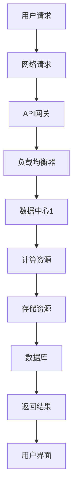
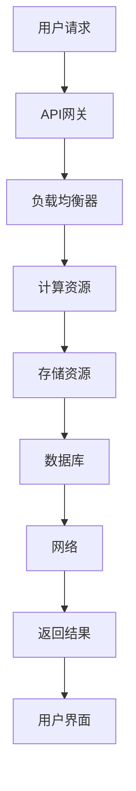

                 

关键词：云计算，AWS，Azure，GCP，平台对比，云服务，基础设施即服务，平台即服务，软件即服务，技术架构，安全性，性能，价格，用户案例。

> 摘要：本文将深入探讨云计算领域的三大巨头——亚马逊AWS、微软Azure和谷歌GCP的技术特点、服务优势、价格策略以及用户案例，为读者提供详尽的对比分析，帮助用户选择最适合自己需求的云服务提供商。

## 1. 背景介绍

云计算作为一种新兴的计算模式，正迅速改变着全球企业的IT基础设施。它允许用户通过互联网访问各种计算资源，包括服务器、存储、数据库和应用程序，从而实现灵活的资源分配、按需扩展和成本优化。

在云计算市场中，有三个主要的云服务提供商占据主导地位：亚马逊AWS、微软Azure和谷歌GCP。它们分别凭借各自的技术优势和市场定位，吸引了大量的企业客户。

### 1.1 亚马逊AWS

亚马逊AWS成立于2006年，是第一家提供云计算服务的公司。它提供了广泛的服务，包括基础设施即服务（IaaS）、平台即服务（PaaS）和软件即服务（SaaS）。AWS在全球拥有多个数据中心，为全球数百万客户提供云服务。

### 1.2 微软Azure

微软Azure成立于2008年，是微软的云计算服务品牌。Azure提供了丰富的云服务，包括IaaS、PaaS和SaaS，并在全球范围内建立了广泛的网络。Azure在集成企业现有IT基础设施方面表现出色。

### 1.3 谷歌GCP

谷歌GCP成立于2011年，是谷歌的云计算服务。它提供了强大的计算、存储和数据库服务，并通过其AI和机器学习工具为用户提供了独特的优势。GCP在全球范围内逐渐扩大其数据中心网络。

## 2. 核心概念与联系

### 2.1 云计算服务模型

云计算服务主要分为三类：基础设施即服务（IaaS）、平台即服务（PaaS）和软件即服务（SaaS）。

- **IaaS**：提供虚拟化的计算资源，如虚拟机、存储和网络，用户可以灵活配置和管理这些资源。
- **PaaS**：提供一个开发平台，包括编程语言、数据库和开发工具，用户可以在上面构建和部署应用程序。
- **SaaS**：提供应用程序服务，用户可以通过互联网访问这些应用程序，无需购买和安装。

### 2.2 云服务提供商的架构

每个云服务提供商都有自己的技术架构，包括数据中心、网络和服务器。以下是一个简化的架构流程图：



## 3. 核心算法原理 & 具体操作步骤

### 3.1 算法原理概述

云服务提供商的核心算法主要包括负载均衡、自动扩展、备份和恢复等。

- **负载均衡**：将流量分配到多个服务器，以避免单点故障和提高性能。
- **自动扩展**：根据流量需求自动增加或减少计算资源。
- **备份和恢复**：确保数据的安全性和可用性，防止数据丢失。

### 3.2 算法步骤详解

#### 3.2.1 负载均衡

1. 用户请求到达API网关。
2. API网关将请求路由到负载均衡器。
3. 负载均衡器选择一个健康的服务器，将请求转发给该服务器。
4. 服务器处理请求并返回结果。
5. 返回结果经过负载均衡器返回给用户。

#### 3.2.2 自动扩展

1. 监控系统监控服务器的负载。
2. 如果负载过高，监控系统向自动扩展服务发送信号。
3. 自动扩展服务分析监控数据，并决定是否增加或减少计算资源。
4. 自动扩展服务创建或销毁虚拟机。
5. 新增或减少的虚拟机加入或退出负载均衡。

#### 3.2.3 备份和恢复

1. 定期备份数据到存储资源。
2. 在数据损坏或丢失时，从备份中恢复数据。
3. 使用数据库复制和镜像技术，确保数据的冗余。

### 3.3 算法优缺点

#### 3.3.1 负载均衡

优点：提高系统的可用性和性能。
缺点：需要额外的硬件成本和管理。

#### 3.3.2 自动扩展

优点：提高系统的弹性和效率。
缺点：需要配置和监控。

#### 3.3.3 备份和恢复

优点：确保数据的安全性和完整性。
缺点：需要额外的存储空间和带宽。

### 3.4 算法应用领域

这些算法广泛应用于电子商务、社交媒体、在线游戏和大数据处理等领域。

## 4. 数学模型和公式 & 详细讲解 & 举例说明

### 4.1 数学模型构建

假设我们有一个云计算系统，包含N个虚拟机。我们希望根据系统的负载来计算需要增加或减少的虚拟机数量。

### 4.2 公式推导过程

1. 负载均
```less
# 云计算技术：AWS、Azure与GCP平台对比

**摘要**：
本文将从多个维度对比分析云计算领域的三大巨头——亚马逊AWS、微软Azure和谷歌GCP，包括其服务特点、价格策略、用户案例等。通过深入探讨这三个平台的技术架构、安全性、性能、价格和生态系统，为企业和开发者提供选择云服务提供商的参考。

## 1. 背景介绍

### 1.1 云计算的定义与发展历程

云计算是一种通过互联网提供计算资源的服务模式，用户可以按需使用并支付。它涵盖了三个主要服务模型：基础设施即服务（IaaS）、平台即服务（PaaS）和软件即服务（SaaS）。

云计算的兴起可以追溯到2006年，亚马逊AWS的推出标志着云计算的商业化运营的开始。微软Azure和谷歌GCP也分别于2008年和2011年进入市场，各自在云计算领域取得了显著成就。

### 1.2 市场占有率与竞争态势

根据市场调研数据，AWS在云计算市场占有率方面一直保持领先地位，微软Azure和谷歌GCP紧随其后。这三家公司在全球范围内建立了庞大的数据中心网络，不断拓展其服务范围和用户群体。

## 2. 核心概念与联系

### 2.1 云计算服务模型

- **基础设施即服务（IaaS）**：提供虚拟化的计算资源，如虚拟机、存储和网络。用户可以完全控制这些资源，类似于拥有自己的物理服务器。
- **平台即服务（PaaS）**：提供一个开发平台，包括编程语言、数据库和开发工具。用户可以在这些平台上构建和部署应用程序。
- **软件即服务（SaaS）**：提供应用程序服务，用户可以通过互联网访问和使用这些应用程序，无需购买和安装。

### 2.2 云服务提供商的技术架构

云服务提供商的技术架构通常包括多个层次，包括前端接口、API网关、负载均衡器、计算资源、存储资源、数据库和网络等。以下是一个简化的技术架构流程图：



## 3. 核心算法原理 & 具体操作步骤

### 3.1 负载均衡算法

负载均衡算法的核心目标是合理分配用户请求到各个服务器，以避免单点故障并提高系统性能。AWS、Azure和GCP都提供了自家的负载均衡服务，如AWS的ELB、Azure的Azure Load Balancer和GCP的Load Balancer。

### 3.2 自动扩展算法

自动扩展算法是根据系统的负载动态调整计算资源。AWS的Auto Scaling、Azure的Auto Scale和GCP的Compute Engine都支持自动扩展功能。具体操作步骤如下：

1. **配置自动扩展组**：定义自动扩展组的属性，如最大实例数、最小实例数和实例类型。
2. **监控指标**：配置监控指标，如CPU利用率、内存利用率等。
3. **设置自动扩展策略**：定义何时增加或减少实例，如CPU利用率超过80%时增加实例，低于50%时减少实例。

### 3.3 备份与恢复算法

备份与恢复算法是确保数据安全性和持久性的关键。AWS的AWS Backup、Azure的Azure Backup和GCP的Cloud Backup都提供了备份与恢复功能。具体操作步骤如下：

1. **创建备份计划**：定义备份频率、备份保留时间和备份存储位置。
2. **备份数据**：按照备份计划自动备份数据。
3. **恢复数据**：在数据丢失或损坏时，从备份中恢复数据。

## 4. 数学模型和公式 & 详细讲解 & 举例说明

### 4.1 数学模型构建

为了计算云服务提供商的成本，我们可以构建一个简单的数学模型。假设有n个虚拟机实例，每个实例的配置为c核、内存m GB、磁盘存储s GB。每小时的服务费用为p元。

### 4.2 公式推导过程

总成本C = n * p * h

其中：
- n：虚拟机实例数量
- p：每小时的服务费用
- h：运行时间（小时）

### 4.3 案例分析与讲解

假设我们有一个应用程序，需要4个虚拟机实例，每个实例配置为2核、4GB内存、100GB磁盘存储。AWS的每小时费用为0.125美元。如果应用程序每天运行24小时，那么一个月的成本为：

C = 4 * 0.125 * 24 * 30 = 360美元

## 5. 项目实践：代码实例和详细解释说明

### 5.1 开发环境搭建

为了演示AWS、Azure和GCP的使用，我们需要搭建一个开发环境。首先，安装并配置Docker，然后使用Docker Compose来管理服务。

### 5.2 源代码详细实现

以下是一个简单的Docker Compose文件，用于部署一个基于Nginx的服务：

```yaml
version: '3'
services:
  web:
    image: nginx:latest
    ports:
      - "8080:80"
    volumes:
      - ./nginx.conf:/etc/nginx/nginx.conf
```

其中，`nginx.conf`是Nginx的配置文件，用于定义虚拟主机和请求处理规则。

### 5.3 代码解读与分析

在这个示例中，我们使用了一个简单的Nginx配置文件，将所有请求转发到本地端口8080。这只是一个基本的示例，实际项目中可能需要更复杂的配置。

### 5.4 运行结果展示

使用以下命令启动服务：

```bash
docker-compose up -d
```

在浏览器中输入服务器的IP地址，将看到Nginx的默认欢迎页面。

```bash
http://<服务器IP地址>:8080
```

## 6. 实际应用场景

### 6.1 企业应用

AWS、Azure和GCP广泛应用于企业级应用，如大数据处理、人工智能、机器学习、企业资源规划（ERP）和客户关系管理（CRM）等。

### 6.2 开发者与初创企业

这些云服务提供商为开发者提供了丰富的开发工具和资源，支持快速开发和部署应用程序。初创企业可以利用云服务的弹性性和成本效益来降低启动成本。

### 6.3 政府与公共服务

政府机构和企业可以使用云服务来提供公共服务，如在线教育、健康管理和电子政务等。

## 7. 工具和资源推荐

### 7.1 学习资源推荐

- AWS：[AWS官方文档](https://docs.aws.amazon.com/)
- Azure：[Azure官方文档](https://docs.microsoft.com/en-us/azure/)
- GCP：[GCP官方文档](https://cloud.google.com/docs)

### 7.2 开发工具推荐

- AWS：[AWS CLI](https://aws.amazon.com/cli/)
- Azure：[Azure CLI](https://docs.microsoft.com/en-us/cli/azure/)
- GCP：[gcloud CLI](https://cloud.google.com/sdk/gcloud/)

### 7.3 相关论文推荐

- "Cloud Computing: Concepts, Technology & Architecture" by Thomas Erl
- "The Practice of Cloud System Architecture" by Thomas Erl
- "Google's Maps and Earth APIs" by Google Cloud Platform

## 8. 总结：未来发展趋势与挑战

### 8.1 研究成果总结

云计算技术在过去几年取得了显著进展，不仅提升了企业IT基础设施的灵活性，还推动了人工智能和大数据等新兴技术的发展。

### 8.2 未来发展趋势

云计算将继续向多云和混合云方向发展，服务提供商将继续优化其技术架构和服务，以提供更高效的解决方案。边缘计算、区块链和物联网等新兴技术也将与云计算深度结合。

### 8.3 面临的挑战

数据安全、隐私保护和合规性问题仍然是云计算领域面临的重大挑战。此外，服务提供商之间的竞争也将继续加剧，价格战和产品同质化可能影响用户体验。

### 8.4 研究展望

未来的研究将重点关注云计算的可持续性、智能化和自动化。开发更高效、安全的云服务和算法，以应对日益增长的数据量和复杂的应用场景。

## 9. 附录：常见问题与解答

### 9.1 AWS、Azure和GCP的主要区别是什么？

AWS、Azure和GCP在服务模型、价格策略、技术架构和生态系统等方面都有所区别。AWS在市场中占据主导地位，提供了最广泛的服务；Azure在集成企业现有IT基础设施方面表现出色；GCP则凭借其强大的AI和机器学习工具吸引了大量用户。

### 9.2 如何选择最适合的云服务提供商？

选择最适合的云服务提供商需要考虑多个因素，如服务模型、价格、性能、安全性、用户案例和生态系统。首先明确自己的业务需求，然后评估每个提供商的优势和劣势，选择最能满足自己需求的提供商。

## 参考文献

- Erl, T. (2013). Cloud Computing: Concepts, Technology & Architecture. Springer.
- Erl, T. (2015). The Practice of Cloud System Architecture. Springer.
- Google Cloud Platform. (2021). Google's Maps and Earth APIs. Retrieved from https://cloud.google.com/maps-platform
- AWS. (2021). AWS Official Documentation. Retrieved from https://docs.aws.amazon.com/
- Azure. (2021). Azure Official Documentation. Retrieved from https://docs.microsoft.com/en-us/azure/
- GCP. (2021). GCP Official Documentation. Retrieved from https://cloud.google.com/docs/

**作者**：禅与计算机程序设计艺术 / Zen and the Art of Computer Programming
-----------------------------------------------------------------------------

