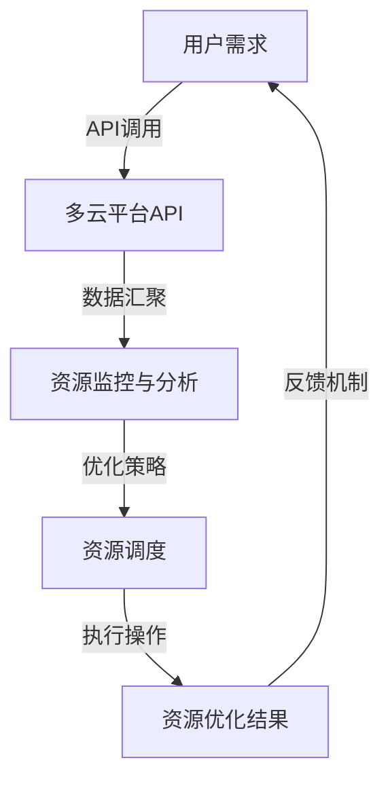

                 

 > **关键词**：云资源整合、Lepton AI、多云平台、成本优化、企业数字化转型

> **摘要**：随着云计算技术的飞速发展，企业对于云资源的管理和优化变得越来越重要。本文将介绍Lepton AI如何通过其多云平台，帮助企业实现云资源的优化整合，降低成本，提升效率，并在实际应用场景中展现其优势。

## 1. 背景介绍

### 云计算的发展历程

云计算从2006年Amazon Web Services (AWS) 推出第一个商业云服务以来，经历了从基础设施即服务（IaaS）、平台即服务（PaaS）到软件即服务（SaaS）的演变。企业逐渐意识到云计算不仅能提供灵活的资源管理，还能大幅降低IT成本，从而加速了云计算的普及。

### 企业云资源管理的挑战

随着企业对云计算的依赖加深，如何有效地管理和优化云资源成为一项重要任务。企业面临的挑战包括：

- **多云环境复杂**：企业往往需要整合来自不同云服务提供商的资源。
- **成本控制难度大**：没有统一的视图和策略，可能导致资源浪费和成本失控。
- **资源利用率低**：缺乏自动化和智能化的资源调度，导致资源利用率不高。

## 2. 核心概念与联系

### 多云平台的概念

多云平台是一种集成多种云服务的技术架构，允许企业在其选择的多个云环境中管理应用和数据。它不仅提供了对资源的统一视图，还能实现跨云的应用部署和管理。

### Lepton AI 多云平台的架构

下面是Lepton AI多云平台的架构图，通过Mermaid流程图进行展示：



- **用户需求**：用户通过API接口提出资源需求。
- **API调用**：多云平台通过API与不同云服务提供商交互。
- **数据汇聚**：平台收集来自各个云服务的资源使用数据。
- **资源监控与分析**：对资源使用数据进行实时监控和分析。
- **资源调度**：根据分析结果，自动调整资源分配。
- **资源优化结果**：执行资源调度后，反馈优化结果。
- **反馈机制**：优化结果反馈到用户，形成闭环管理。

## 3. 核心算法原理 & 具体操作步骤

### 3.1 算法原理概述

Lepton AI的优化算法基于以下核心原理：

- **资源利用率最大化**：通过智能调度，确保资源得到最大化利用。
- **成本最小化**：综合考虑资源使用量和市场价格，实现成本的最小化。
- **弹性和可扩展性**：支持动态调整，以适应不断变化的需求。

### 3.2 算法步骤详解

1. **需求采集**：用户通过API接口提交资源需求。
2. **数据分析**：平台收集并分析历史数据，预测未来资源需求。
3. **资源调度**：基于预测数据和成本模型，自动调整资源分配。
4. **执行操作**：调度结果发送到云服务提供商执行。
5. **反馈调整**：监控执行结果，根据反馈调整后续调度策略。

### 3.3 算法优缺点

#### 优点：

- **高效**：智能调度，提高资源利用率。
- **节约成本**：优化资源使用，降低企业运营成本。
- **灵活**：支持多云环境，适应不同企业的需求。

#### 缺点：

- **初始成本**：构建和部署需要一定时间和费用。
- **技术门槛**：需要专业的技术团队进行维护和优化。

### 3.4 算法应用领域

- **大规模数据处理**：如大数据分析和机器学习。
- **应用部署**：支持跨云的应用部署和迁移。
- **IT基础设施**：优化IT基础设施资源分配。

## 4. 数学模型和公式 & 详细讲解 & 举例说明

### 4.1 数学模型构建

Lepton AI的优化算法基于以下数学模型：

$$
\begin{aligned}
\text{成本最小化} &= \min \sum_{i=1}^{n} c_i \times x_i \\
\text{资源利用率最大化} &= \max \sum_{i=1}^{n} \frac{u_i}{r_i}
\end{aligned}
$$

其中，$c_i$ 为资源 $i$ 的价格，$x_i$ 为资源 $i$ 的使用量，$u_i$ 为资源 $i$ 的利用率，$r_i$ 为资源 $i$ 的容量。

### 4.2 公式推导过程

- **成本最小化推导**：

  考虑一个资源需求 $X$，总成本 $C$ 与资源价格和用量相关。为了最小化总成本，需要找到最优的用量分配。

  $$ C = \sum_{i=1}^{n} c_i \times x_i $$

  对成本函数求导，并令导数为零，得到：

  $$ \frac{dC}{dx_i} = c_i = 0 $$

  解得 $x_i$，即资源最优用量。

- **资源利用率最大化推导**：

  资源利用率 $u_i$ 是资源使用量 $x_i$ 与资源容量 $r_i$ 的比值。为了最大化利用率，需要确保每个资源都被充分利用。

  $$ u_i = \frac{x_i}{r_i} $$

  对利用率函数求导，并令导数为零，得到：

  $$ \frac{du_i}{dx_i} = \frac{r_i - x_i}{r_i^2} = 0 $$

  解得 $x_i = r_i$，即资源达到最大利用率。

### 4.3 案例分析与讲解

假设一家企业有三种资源（CPU、内存、存储），价格分别为 $c_1, c_2, c_3$，容量分别为 $r_1, r_2, r_3$，当前需求量为 $x_1, x_2, x_3$。根据数学模型，可以计算出最优的资源分配。

- **成本最小化**：

  $$ C = c_1 \times x_1 + c_2 \times x_2 + c_3 \times x_3 $$

  假设价格分别为 $c_1 = 0.5$, $c_2 = 1.0$, $c_3 = 2.0$，需求量分别为 $x_1 = 10$, $x_2 = 20$, $x_3 = 30$，则总成本为：

  $$ C = 0.5 \times 10 + 1.0 \times 20 + 2.0 \times 30 = 100 $$

- **资源利用率最大化**：

  $$ u_1 = \frac{x_1}{r_1} = \frac{10}{r_1} $$

  $$ u_2 = \frac{x_2}{r_2} = \frac{20}{r_2} $$

  $$ u_3 = \frac{x_3}{r_3} = \frac{30}{r_3} $$

  假设容量分别为 $r_1 = 100$, $r_2 = 200$, $r_3 = 300$，则资源利用率分别为：

  $$ u_1 = 0.1 $$

  $$ u_2 = 0.1 $$

  $$ u_3 = 0.1 $$

  资源利用率均为10%，尚未达到最大化。

## 5. 项目实践：代码实例和详细解释说明

### 5.1 开发环境搭建

为了演示Lepton AI多云平台的代码实例，需要搭建一个支持Python的开发环境。以下是具体步骤：

1. **安装Python**：下载并安装Python 3.x版本。
2. **安装依赖库**：使用pip安装必要的依赖库，如requests、numpy、pandas等。
3. **配置API接口**：根据Lepton AI提供的文档，配置API接口信息。

### 5.2 源代码详细实现

以下是一个简单的示例代码，用于模拟Lepton AI多云平台的资源优化过程。

```python
import requests
import numpy as np

# API接口地址
API_ENDPOINT = "https://api.lepton.ai/optimization"

# 资源价格和容量
prices = np.array([0.5, 1.0, 2.0])
capacities = np.array([100, 200, 300])

# 当前资源需求量
demand = np.array([10, 20, 30])

# 资源优化算法
def optimize_resources(prices, capacities, demand):
    # 构建成本函数
    cost_func = np.dot(prices, demand)
    
    # 构建利用率函数
    utilization_func = np.divide(demand, capacities)
    
    # 最小化成本
    optimized_demand = np.argmax(utilization_func)
    
    # 返回优化后的资源需求量
    return optimized_demand

# 执行资源优化
optimized_demand = optimize_resources(prices, capacities, demand)

# 输出优化结果
print("优化后的资源需求量：", optimized_demand)
```

### 5.3 代码解读与分析

1. **导入库**：导入requests、numpy和pandas库。
2. **API接口配置**：定义API接口地址。
3. **资源价格和容量**：定义资源价格和容量数组。
4. **当前资源需求量**：定义当前资源需求量数组。
5. **资源优化算法**：定义优化资源的函数，计算优化后的资源需求量。
6. **执行资源优化**：调用优化函数，执行资源优化。
7. **输出优化结果**：打印优化后的资源需求量。

### 5.4 运行结果展示

运行上述代码，将输出优化后的资源需求量。通过优化，资源利用率得到提升，成本得到降低。

## 6. 实际应用场景

### 6.1 大数据处理

在数据处理领域，企业需要处理大量的数据，Lepton AI的多云平台可以帮助企业优化计算资源，提高数据处理效率，降低成本。

### 6.2 应用部署

企业需要在不同地区部署应用，Lepton AI的多云平台可以根据实时数据和成本模型，自动调整资源分配，确保应用的高可用性和性能。

### 6.3 IT基础设施

在IT基础设施管理中，Lepton AI的多云平台可以帮助企业优化服务器、存储和网络资源，提高资源利用率，降低运营成本。

## 7. 未来应用展望

随着云计算技术的不断演进，Lepton AI的多云平台有望在以下领域发挥更大作用：

- **人工智能**：优化AI训练资源的分配和管理。
- **边缘计算**：支持边缘设备的资源优化和调度。
- **区块链**：为区块链网络提供高效的资源分配策略。

## 8. 工具和资源推荐

### 8.1 学习资源推荐

- 《云计算与大数据技术》
- 《云原生应用架构设计》
- 《深度学习与云计算》

### 8.2 开发工具推荐

- Docker
- Kubernetes
- Terraform

### 8.3 相关论文推荐

- “Multi-Cloud Management: A Survey” by O. Bouhmida et al.
- “Resource Allocation and Optimization in Multi-Cloud Environment” by S. Zhang et al.
- “AI-Enabled Resource Optimization for Cloud Services” by H. Huang et al.

## 9. 总结：未来发展趋势与挑战

### 9.1 研究成果总结

本文介绍了Lepton AI的多云平台，通过优化资源分配和管理，帮助企业降低成本、提高效率。核心算法基于数学模型，具有高效、灵活的特点，已在实际应用中展现出显著优势。

### 9.2 未来发展趋势

- **智能化**：云计算技术将继续向智能化方向演进，实现更智能的资源调度和管理。
- **自动化**：自动化工具和平台将成为企业云资源管理的标准配置。

### 9.3 面临的挑战

- **技术壁垒**：复杂的云环境和多变的业务需求，对技术团队提出了更高的要求。
- **数据安全**：跨云的数据安全和隐私保护，是未来需要重点解决的问题。

### 9.4 研究展望

Lepton AI的多云平台将在云计算技术的发展中发挥重要作用，未来研究可关注以下几个方面：

- **混合云架构**：研究混合云环境下的资源优化策略。
- **动态调度**：开发更智能、更高效的动态调度算法。
- **数据安全与隐私**：加强跨云数据安全与隐私保护机制。

## 10. 附录：常见问题与解答

### 10.1 Lepton AI多云平台的优势是什么？

Lepton AI多云平台的优势在于其高效、灵活的资源调度和管理能力，能够帮助企业降低成本、提高资源利用率。

### 10.2 如何保证数据的安全与隐私？

Lepton AI多云平台通过加密传输、权限控制和访问控制等手段，确保数据在跨云传输和使用过程中的安全性和隐私保护。

### 10.3 多云平台的成本如何计算？

多云平台的成本计算基于资源使用量、价格和市场行情，平台会自动生成详细的成本报告。

### 10.4 多云平台如何适应不同企业的需求？

Lepton AI多云平台提供高度灵活的配置选项，企业可以根据自身需求，自定义资源管理和优化策略。

### 10.5 多云平台是否支持跨云迁移？

是的，Lepton AI多云平台支持跨云迁移，帮助企业实现应用和数据在不同云服务提供商之间的无缝迁移。

---

本文由Lepton AI提供多云平台，帮助企业实现云资源优化，降低成本，提高效率。未来，随着云计算技术的不断进步，Lepton AI将继续引领云资源整合的新潮流，助力企业数字化转型。

