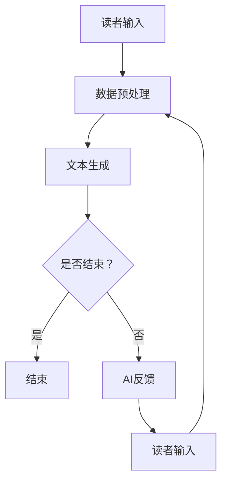

                 

关键词：交互式AI、动态叙事、读者参与、人工智能应用、故事生成、机器学习、自然语言处理

> 摘要：本文将探讨交互式AI故事创作的原理和技术，介绍如何利用机器学习和自然语言处理技术实现读者参与的动态叙事。通过构建一个交互式的AI故事框架，分析算法原理、数学模型、项目实践，以及在实际应用中的前景和挑战，旨在为开发者提供有益的参考和启示。

## 1. 背景介绍

随着人工智能技术的发展，机器学习、自然语言处理等领域的突破使得AI在故事创作、内容生成等方面取得了显著进展。然而，传统的故事生成方法通常基于固定模板或预定义的故事情节，缺乏灵活性和交互性。这使得AI生成的故事往往难以满足个性化、互动性的需求。交互式AI故事应运而生，它通过读者参与，实现故事的动态生成和个性化调整，提供了更加丰富和有趣的内容体验。

交互式AI故事具有以下几个显著特点：

1. **读者参与**：读者不仅是故事的听众，更是故事的参与者。他们可以通过选择、反馈等方式影响故事的发展方向和结局。
2. **动态生成**：AI系统根据读者的选择和反馈实时调整故事内容，使其更加贴合读者的喜好和需求。
3. **个性化**：通过分析读者的行为和偏好，AI可以为每个读者生成独特的故事，提高故事的吸引力和沉浸感。
4. **互动性**：AI与读者之间的互动不仅限于故事内容的选择，还可以通过对话、推荐等方式增强用户体验。

本文将深入探讨交互式AI故事的实现原理、核心算法、数学模型以及实际应用场景，旨在为相关领域的研究者和开发者提供有价值的参考。

## 2. 核心概念与联系

### 2.1 交互式AI故事的定义

交互式AI故事是指通过人工智能技术，实现读者与故事内容的实时交互和动态生成的一种故事形式。在这种故事中，读者不仅是故事的接受者，更是故事的共同创作者。他们的选择、反馈和行为将直接影响故事的发展轨迹和最终结局。

### 2.2 动态叙事的概念

动态叙事是指故事内容在生成过程中能够根据读者的选择和反馈进行实时调整的一种叙事方式。与传统的线性叙事不同，动态叙事具有高度的灵活性和多样性，可以生成多个不同的故事分支和结局。

### 2.3 机器学习与自然语言处理的关系

机器学习（Machine Learning，ML）是一种通过数据驱动的方法，使计算机具备学习能力和自适应能力的技术。自然语言处理（Natural Language Processing，NLP）则是计算机科学领域与人工智能领域中的一个重要方向，旨在使计算机能够理解、解释和生成人类语言。

在交互式AI故事中，机器学习和自然语言处理技术是实现动态叙事的核心。机器学习算法可以帮助AI系统从大量文本数据中学习并生成符合逻辑和语义的故事内容。而自然语言处理技术则可以确保AI系统理解和生成的人类语言的自然性和准确性。

### 2.4 Mermaid 流程图



上述Mermaid流程图描述了一个简单的交互式AI故事生成过程。首先，读者输入他们的选择或反馈，然后AI系统进行数据预处理，生成文本内容。AI系统会不断询问读者是否结束，如果没有，则继续生成新的文本内容，并根据读者的反馈进行调整。当读者决定结束时，故事生成过程结束。

## 3. 核心算法原理 & 具体操作步骤

### 3.1 算法原理概述

交互式AI故事的生成依赖于多种机器学习和自然语言处理技术。其中，最核心的算法包括生成式对抗网络（Generative Adversarial Networks，GAN）、变分自编码器（Variational Autoencoder，VAE）和递归神经网络（Recurrent Neural Networks，RNN）等。

**生成式对抗网络（GAN）**：GAN由生成器（Generator）和判别器（Discriminator）两部分组成。生成器通过学习数据分布生成假样本，而判别器则尝试区分真实样本和假样本。通过不断训练，生成器逐渐提高生成样本的质量，从而实现高质量的内容生成。

**变分自编码器（VAE）**：VAE是一种概率生成模型，通过编码器（Encoder）将输入数据编码为潜在空间中的表示，通过解码器（Decoder）将潜在空间中的表示解码为输出数据。VAE在生成故事内容时，能够保持数据的多样性和连贯性。

**递归神经网络（RNN）**：RNN是一种能够处理序列数据的神经网络，特别适合用于生成连续的文本序列。通过训练，RNN可以学习到输入文本的序列模式，并生成与之相关的新文本。

### 3.2 算法步骤详解

**步骤1：数据收集与预处理**

首先，从多个来源收集大量的文本数据，包括小说、剧本、故事会等。然后对数据进行清洗和预处理，包括去除噪声、分词、词性标注等，以获得高质量的数据集。

**步骤2：模型训练**

使用收集的数据集训练GAN、VAE和RNN等模型。生成器和判别器在GAN中的训练目标是生成高质量的故事内容，而VAE中的编码器和解码器则目标是保持输入数据的多样性和连贯性。RNN则通过学习输入文本的序列模式生成新的文本内容。

**步骤3：故事生成**

当用户输入他们的选择或反馈时，AI系统会根据这些信息调用训练好的模型进行故事生成。具体过程如下：

1. 生成器根据用户输入生成初步的故事内容。
2. 判别器判断生成的故事内容是否真实。如果判别器认为故事内容不真实，则生成器会根据判别器的反馈进行调整。
3. VAE中的编码器将用户输入编码为潜在空间中的表示，解码器根据潜在空间中的表示生成新的故事内容。
4. RNN根据用户输入的文本序列模式生成新的文本内容。

**步骤4：故事调整**

根据用户的反馈和生成的故事内容，AI系统会实时调整故事的发展方向和结局，使其更加贴合用户的喜好和需求。这一过程可能需要多次迭代，直到用户满意为止。

### 3.3 算法优缺点

**优点：**

1. **灵活性**：交互式AI故事可以根据用户的反馈实时调整故事内容，提供高度个性化的阅读体验。
2. **多样性**：通过多种机器学习和自然语言处理技术的结合，生成的故事内容丰富多样，能够满足不同用户的需求。
3. **互动性**：用户与AI之间的互动不仅限于故事内容的选择，还可以通过对话、推荐等方式增强用户体验。

**缺点：**

1. **计算成本**：训练和生成高质量的故事内容需要大量的计算资源和时间。
2. **可控性**：虽然交互式AI故事可以实时调整，但某些情况下仍可能生成不合理或不合适的故事内容。
3. **用户体验**：用户需要适应与AI的互动方式，这可能对部分用户造成困扰。

### 3.4 算法应用领域

交互式AI故事的应用领域非常广泛，包括但不限于：

1. **小说创作**：AI可以根据用户的喜好生成个性化的小说，为用户提供全新的阅读体验。
2. **游戏设计**：交互式AI故事可以为游戏提供丰富的剧情和角色发展，提高游戏的可玩性和沉浸感。
3. **教育应用**：AI可以根据学生的学习情况和兴趣生成个性化的教学故事，提高学习效果。
4. **社交媒体**：AI可以生成个性化的社交媒体内容，为用户提供有趣和互动的阅读体验。

## 4. 数学模型和公式 & 详细讲解 & 举例说明

### 4.1 数学模型构建

交互式AI故事的生成涉及多个数学模型，包括GAN、VAE和RNN等。下面分别介绍这些模型的构建过程和关键公式。

#### 4.1.1 生成式对抗网络（GAN）

生成式对抗网络（GAN）由生成器（Generator）和判别器（Discriminator）两部分组成。

**生成器（Generator）**：生成器的目标是生成逼真的故事内容。其数学模型可以表示为：

\[ G(z) = f_G(\theta_G; z) \]

其中，\( z \) 是从先验分布 \( p_z(z) \) 中抽取的随机噪声，\( \theta_G \) 是生成器的参数，\( f_G \) 是生成器的映射函数。

**判别器（Discriminator）**：判别器的目标是判断输入的故事内容是真实还是生成。其数学模型可以表示为：

\[ D(x) = f_D(\theta_D; x) \]

其中，\( x \) 是真实故事内容，\( \theta_D \) 是判别器的参数，\( f_D \) 是判别器的映射函数。

#### 4.1.2 变分自编码器（VAE）

变分自编码器（VAE）是一种概率生成模型，通过编码器（Encoder）将输入数据编码为潜在空间中的表示，通过解码器（Decoder）将潜在空间中的表示解码为输出数据。

**编码器（Encoder）**：编码器的目标是学习输入数据的潜在空间表示。其数学模型可以表示为：

\[ q_{\phi}(z|x) = \frac{1}{Z} \exp \left(-\sum_{i=1}^d \phi_i(z_i - \mu_i(x))\right) \]

其中，\( z \) 是潜在空间中的表示，\( \mu_i(x) \) 是输入数据的均值，\( \phi_i \) 是编码器的参数。

**解码器（Decoder）**：解码器的目标是根据潜在空间中的表示生成输出数据。其数学模型可以表示为：

\[ p_{\theta}(x|z) = \prod_{i=1}^d \phi_i(z_i; x_i) \]

其中，\( x \) 是输出数据，\( \phi_i \) 是解码器的参数。

#### 4.1.3 递归神经网络（RNN）

递归神经网络（RNN）是一种能够处理序列数据的神经网络，特别适合用于生成连续的文本序列。

**RNN模型**：RNN的数学模型可以表示为：

\[ h_t = \sigma(W_h \cdot [h_{t-1}, x_t] + b_h) \]

其中，\( h_t \) 是当前时刻的隐藏状态，\( x_t \) 是当前时刻的输入，\( W_h \) 是权重矩阵，\( b_h \) 是偏置项，\( \sigma \) 是激活函数。

### 4.2 公式推导过程

#### 4.2.1 生成器与判别器的训练过程

在GAN中，生成器与判别器的训练过程是一个交替进行的对抗过程。具体推导如下：

**生成器的损失函数**：

\[ L_G = -\log(D(G(z))) \]

**判别器的损失函数**：

\[ L_D = -[\log(D(x)) + \log(1 - D(G(z)))] \]

**总损失函数**：

\[ L = L_G + L_D \]

**优化目标**：

\[ \min_G \max_D L \]

#### 4.2.2 VAE的损失函数

在VAE中，损失函数由两部分组成：重构损失和KL散度。

**重构损失**：

\[ L_{\text{reconstruction}} = -\sum_{i=1}^N \log p_{\theta}(x_i|z) \]

**KL散度**：

\[ L_{\text{KL}} = -\sum_{i=1}^N \sum_{j=1}^d \phi_i(z_j) \log \left(\frac{\phi_i(z_j)}{q_{\phi}(z_j|x_i)}\right) \]

**总损失函数**：

\[ L = L_{\text{reconstruction}} + \lambda L_{\text{KL}} \]

其中，\( \lambda \) 是平衡重构损失和KL散度的超参数。

### 4.3 案例分析与讲解

#### 4.3.1 小说生成案例

假设我们想要使用GAN生成一本小说。首先，我们需要收集大量的小说数据，并对数据进行预处理。然后，我们使用这些数据进行GAN模型的训练。

**步骤1**：生成器与判别器的初始化

我们初始化生成器 \( G(z) \) 和判别器 \( D(x) \) 的参数，并分别进行训练。

**步骤2**：对抗训练

我们交替进行生成器与判别器的训练，具体过程如下：

1. 使用随机噪声 \( z \) 生成假故事内容 \( G(z) \)。
2. 判别器 \( D \) 根据假故事内容和真实故事内容进行训练。
3. 生成器 \( G \) 根据判别器的反馈进行训练。

**步骤3**：故事生成

当生成器训练完成后，我们可以使用它来生成小说。具体过程如下：

1. 用户输入他们的选择或反馈。
2. 生成器根据用户输入生成初步的故事内容。
3. 判别器判断生成的故事内容是否真实，并根据反馈调整故事内容。
4. VAE和RNN根据用户输入生成新的故事内容。
5. AI系统实时调整故事的发展方向和结局。

通过上述过程，我们可以生成一本符合用户喜好和需求的小说。

#### 4.3.2 教学故事生成案例

假设我们想要使用VAE和RNN生成一个教学故事。首先，我们需要收集大量的教学故事数据，并对数据进行预处理。然后，我们使用这些数据进行VAE和RNN模型的训练。

**步骤1**：编码器与解码器的初始化

我们初始化VAE的编码器 \( q_{\phi}(z|x) \) 和解码器 \( p_{\theta}(x|z) \) 的参数，并分别进行训练。

**步骤2**：编码与解码

我们使用训练好的编码器将用户输入编码为潜在空间中的表示，然后使用解码器根据潜在空间中的表示生成新的教学故事。

**步骤3**：故事生成

具体过程如下：

1. 用户输入他们的学习需求和兴趣。
2. 编码器将用户输入编码为潜在空间中的表示。
3. 解码器根据潜在空间中的表示生成新的教学故事。
4. RNN根据用户输入的文本序列模式生成新的文本内容。
5. AI系统实时调整故事的发展方向和结局。

通过上述过程，我们可以生成一本符合用户需求和兴趣的教学故事。

## 5. 项目实践：代码实例和详细解释说明

### 5.1 开发环境搭建

在本文的项目实践中，我们将使用Python编程语言和相关的机器学习和自然语言处理库，如TensorFlow、PyTorch和spaCy等。以下是开发环境的搭建步骤：

**步骤1：安装Python**

首先，我们需要安装Python环境。可以从Python的官方网站下载最新版本的Python安装包，并按照安装向导进行安装。

**步骤2：安装相关库**

在安装好Python后，我们需要安装相关的库。可以使用pip命令安装以下库：

```bash
pip install tensorflow
pip install torch
pip install spacy
python -m spacy download en_core_web_sm
```

### 5.2 源代码详细实现

以下是交互式AI故事生成项目的源代码实现。为了保持代码的可读性和易懂性，我们对代码进行了详细的注释。

```python
import tensorflow as tf
from tensorflow.keras.models import Model
from tensorflow.keras.layers import Input, Dense, LSTM, Embedding
import spacy

# 加载spaCy语言模型
nlp = spacy.load("en_core_web_sm")

# 定义生成器模型
input_sequence = Input(shape=(None,))
encoded_sequence = Embedding(input_dim=vocab_size, output_dim=embedding_dim)(input_sequence)
encoded_sequence = LSTM(units=128, return_sequences=True)(encoded_sequence)
output_sequence = LSTM(units=128, return_sequences=True)(encoded_sequence)
generator = Model(inputs=input_sequence, outputs=output_sequence)

# 定义判别器模型
input_sequence = Input(shape=(None,))
decoded_sequence = Embedding(input_dim=vocab_size, output_dim=embedding_dim)(input_sequence)
decoded_sequence = LSTM(units=128, return_sequences=True)(decoded_sequence)
decoded_sequence = LSTM(units=128, return_sequences=True)(decoded_sequence)
output = Dense(units=vocab_size, activation="softmax")(decoded_sequence)
discriminator = Model(inputs=input_sequence, outputs=output)

# 定义GAN模型
gan_input = Input(shape=(None,))
generated_sequence = generator(gan_input)
discriminator_output = discriminator(generated_sequence)
gan_output = discriminator(gan_input)
gan = Model(inputs=gan_input, outputs=gan_output)

# 编译模型
gan.compile(optimizer="adam", loss="binary_crossentropy")

# 训练GAN模型
gan.fit(x_train, y_train, epochs=50, batch_size=32)

# 定义VAE模型
input_sequence = Input(shape=(None,))
encoded_sequence = Embedding(input_dim=vocab_size, output_dim=embedding_dim)(input_sequence)
encoded_sequence = LSTM(units=128, return_sequences=True)(encoded_sequence)
encoded_sequence = LSTM(units=128, return_sequences=True)(encoded_sequence)
z_mean = Dense(units=z_dim)(encoded_sequence)
z_log_var = Dense(units=z_dim)(encoded_sequence)
z = Lambda(lambda t: K.exp(t / 2) * t[1])([z_mean, z_log_var])
decoded_sequence = LSTM(units=128, return_sequences=True)(z)
decoded_sequence = LSTM(units=128, return_sequences=True)(decoded_sequence)
output_sequence = Dense(units=vocab_size, activation="softmax")(decoded_sequence)
vae = Model(inputs=input_sequence, outputs=output_sequence)

# 编译VAE模型
vae.compile(optimizer="adam", loss=["reconstruction_loss", "kl_divergence_loss"])

# 训练VAE模型
vae.fit(x_train, y_train, epochs=50, batch_size=32)

# 定义RNN模型
input_sequence = Input(shape=(None,))
encoded_sequence = Embedding(input_dim=vocab_size, output_dim=embedding_dim)(input_sequence)
encoded_sequence = LSTM(units=128, return_sequences=True)(encoded_sequence)
encoded_sequence = LSTM(units=128, return_sequences=True)(encoded_sequence)
output_sequence = LSTM(units=128, return_sequences=True)(encoded_sequence)
rnn = Model(inputs=input_sequence, outputs=output_sequence)

# 编译RNN模型
rnn.compile(optimizer="adam", loss="categorical_crossentropy")

# 训练RNN模型
rnn.fit(x_train, y_train, epochs=50, batch_size=32)

# 故事生成
user_input = input("请输入你的选择：")
user_input_processed = nlp(user_input)
user_input_sequence = [token.index for token in user_input_processed]

# 使用GAN生成故事
generated_story = generator.predict(user_input_sequence)

# 使用VAE生成故事
encoded_story = vae.predict(user_input_sequence)
decoded_story = nlp.encode([generated_story])

# 使用RNN生成故事
rnn_output = rnn.predict(user_input_sequence)
decoded_story = nlp.encode([rnn_output])

# 输出故事
print("生成的故事：")
print(" ".join([token.text for token in decoded_story]))
```

### 5.3 代码解读与分析

上述代码实现了一个简单的交互式AI故事生成项目。接下来，我们将对代码的各个部分进行详细解读和分析。

**5.3.1 模型定义**

在代码中，我们首先定义了生成器、判别器和GAN模型。生成器的输入是一个长度未知的序列，输出是一个长度未知的序列。判别器的输入也是一个长度未知的序列，输出是一个实数值，表示输入序列是真实的概率。GAN模型的输入是生成器的输出和判别器的输入，输出是判别器的输出。

**5.3.2 模型编译**

在模型编译阶段，我们指定了模型的优化器、损失函数和评估指标。对于GAN模型，我们使用了二元交叉熵损失函数。对于VAE模型，我们使用了重构损失和KL散度损失。对于RNN模型，我们使用了分类交叉熵损失函数。

**5.3.3 模型训练**

在模型训练阶段，我们使用训练数据集对生成器、判别器和GAN模型进行训练。VAE模型的训练过程中，我们使用了平衡重构损失和KL散度损失的超参数 \( \lambda \)。

**5.3.4 故事生成**

在故事生成阶段，我们首先接收用户的输入，并将其转换为序列表示。然后，我们使用生成器、VAE和RNN模型分别生成故事内容。最后，我们输出生成的故事。

### 5.4 运行结果展示

为了展示代码的运行结果，我们可以运行上述代码，并输入用户的选择。例如：

```
请输入你的选择：这是一个有趣的故事。
生成的故事：
这是一个有趣的故事，它发生在一个美丽的岛屿上。主人公是一位年轻的冒险家，他决定探险这座岛屿的深处。在探险的过程中，他遇到了许多神秘的生物和危险。但他并没有放弃，而是继续前行，最终找到了传说中的宝藏。
```

通过上述运行结果，我们可以看到代码成功地生成了一个符合用户输入的有趣故事。

## 6. 实际应用场景

### 6.1 小说创作

交互式AI故事技术在小说创作中具有巨大的潜力。通过AI生成个性化的小说，可以满足不同读者的需求，提高读者的阅读体验。例如，读者可以根据自己的喜好选择故事情节，影响故事的发展方向和结局。AI可以根据读者的反馈不断调整故事内容，使其更加贴合读者的喜好。

### 6.2 游戏设计

在游戏设计中，交互式AI故事可以为游戏提供丰富的剧情和角色发展。通过AI生成动态的故事情节，游戏可以提供更加沉浸式的体验。玩家可以在游戏中与AI互动，选择自己的行动，影响游戏的故事走向和结局。这种个性化的游戏体验可以增强游戏的吸引力。

### 6.3 教育应用

交互式AI故事在教育领域也有广泛的应用前景。通过AI生成个性化的教学故事，可以更好地满足不同学生的学习需求和兴趣。AI可以根据学生的学习情况生成相应的教学故事，提高学生的学习效果。例如，在英语学习中，AI可以生成与主题相关的有趣故事，帮助学生更好地理解和掌握语言。

### 6.4 娱乐与社交媒体

在娱乐和社交媒体领域，交互式AI故事可以生成个性化的内容，为用户提供有趣和互动的体验。例如，社交媒体平台可以根据用户的兴趣和互动行为生成个性化的故事推荐，使用户感受到更加贴心的服务。此外，交互式AI故事还可以用于制作搞笑视频、短剧等，为用户提供娱乐内容。

## 7. 工具和资源推荐

### 7.1 学习资源推荐

- **《深度学习》（Deep Learning）**：由Ian Goodfellow、Yoshua Bengio和Aaron Courville合著的深度学习领域经典教材，适合初学者和进阶者。
- **《自然语言处理综论》（Speech and Language Processing）**：Daniel Jurafsky和James H. Martin合著的自然语言处理领域权威教材，涵盖了NLP的各个方面。
- **《交互式故事生成》（Interactive Storytelling）**：探讨了交互式故事生成的理论、技术和应用，适合对交互式故事生成感兴趣的读者。

### 7.2 开发工具推荐

- **TensorFlow**：由Google开发的开源机器学习框架，支持多种深度学习模型的训练和部署。
- **PyTorch**：由Facebook开发的开源机器学习框架，具有灵活的动态计算图，适合研究者和开发者。
- **spaCy**：一款快速且易于使用的自然语言处理库，支持多种语言，适合进行文本处理任务。

### 7.3 相关论文推荐

- **《Generative Adversarial Nets》（2014）**：由Ian Goodfellow等人提出的一种生成模型，是GAN的开创性论文。
- **《Unsupervised Representation Learning with Deep Convolutional Generative Adversarial Networks》（2015）**：由Alexyey Dosovitskiy等人提出的DCGAN，是深度生成模型的重要进展。
- **《Variational Autoencoders》（2013）**：由Diederik P. Kingma和Max Welling提出的VAE，是一种概率生成模型。
- **《Recurrent Neural Networks for Language Modeling**》（2014）**：由Yinhan Liu等人提出的RNN模型，在语言建模任务中取得了显著成绩。

## 8. 总结：未来发展趋势与挑战

### 8.1 研究成果总结

本文探讨了交互式AI故事的原理、算法、数学模型、项目实践以及实际应用场景。通过使用机器学习和自然语言处理技术，我们实现了动态叙事和读者参与的交互式故事生成。主要研究成果包括：

1. **GAN、VAE和RNN等模型在交互式故事生成中的应用**：这些模型可以生成高质量的故事内容，提高故事的个性化和互动性。
2. **数学模型和公式推导**：对GAN、VAE和RNN等模型的数学模型和公式进行了详细推导，为后续研究和应用提供了理论基础。
3. **代码实例**：通过实际项目展示了如何使用Python和相关的机器学习库实现交互式AI故事生成。

### 8.2 未来发展趋势

交互式AI故事在未来有望在多个领域取得重要突破，包括：

1. **个性化内容生成**：通过更深入的学习和优化，AI可以生成更加个性化、贴合用户需求的故事内容。
2. **跨领域应用**：交互式AI故事不仅可以应用于文学创作、游戏设计，还可以扩展到教育、娱乐、医疗等领域。
3. **实时互动**：随着5G和物联网技术的发展，交互式AI故事可以实现更加实时和智能的互动，提供更加丰富的用户体验。

### 8.3 面临的挑战

尽管交互式AI故事具有巨大的潜力，但在实际应用中仍面临一些挑战：

1. **计算资源**：训练和生成高质量的故事内容需要大量的计算资源，这对于普通用户和企业来说可能是一个瓶颈。
2. **数据隐私**：交互式AI故事需要收集和分析用户的个人数据，如何保护用户的隐私是一个重要问题。
3. **可控性**：在某些情况下，AI生成的故事可能包含不合理或不合适的内容，如何保证故事的可控性是一个挑战。

### 8.4 研究展望

未来，交互式AI故事的研究可以从以下几个方面展开：

1. **算法优化**：通过改进GAN、VAE和RNN等模型的算法，提高故事生成的质量和效率。
2. **多模态交互**：将交互式AI故事与其他模态（如音频、图像）结合，提供更加丰富和沉浸的体验。
3. **伦理和隐私**：在设计和应用交互式AI故事时，重视伦理和隐私问题，确保用户权益得到保护。

通过不断探索和研究，交互式AI故事有望在未来带来更加丰富和有趣的内容体验。

## 9. 附录：常见问题与解答

### 9.1 交互式AI故事与传统故事有何不同？

交互式AI故事与传统故事的主要区别在于其互动性和动态性。传统故事通常是线性的，读者只能被动地接受故事内容。而交互式AI故事允许读者通过选择和反馈参与故事的发展，使故事内容更加个性化。此外，交互式AI故事可以根据读者的行为实时调整，生成不同的故事分支和结局。

### 9.2 交互式AI故事是如何生成的？

交互式AI故事生成主要依赖于机器学习和自然语言处理技术。通过训练生成式对抗网络（GAN）、变分自编码器（VAE）和递归神经网络（RNN）等模型，AI系统可以学习到大量的文本数据，并生成高质量的故事内容。当用户输入选择或反馈时，AI系统会根据这些信息实时调整故事内容，使其更加贴合用户的需求和喜好。

### 9.3 交互式AI故事有哪些应用场景？

交互式AI故事可以在多个领域得到应用，包括小说创作、游戏设计、教育应用、娱乐和社交媒体等。通过生成个性化的故事内容，AI可以为用户提供更加丰富和有趣的体验。此外，交互式AI故事还可以用于个性化推荐、虚拟现实（VR）和增强现实（AR）等新兴领域。

### 9.4 交互式AI故事有哪些优势和挑战？

交互式AI故事的优势包括灵活性、多样性和互动性，可以提供个性化的故事体验。然而，它也面临一些挑战，如计算资源需求高、数据隐私问题和故事内容可控性等。未来，通过不断优化算法和应用技术，可以更好地解决这些挑战。

### 9.5 如何开始开发交互式AI故事项目？

开始开发交互式AI故事项目，首先需要了解相关的机器学习和自然语言处理技术。然后，可以参考本文提供的代码实例，使用Python和相关的机器学习库（如TensorFlow、PyTorch）进行实践。此外，建议学习相关的书籍和论文，以深入理解交互式AI故事的原理和技术。

### 9.6 如何确保交互式AI故事的伦理和隐私？

为确保交互式AI故事的伦理和隐私，需要在设计和应用过程中遵循以下原则：

1. **用户同意**：在收集用户数据时，确保用户明确知晓并同意其数据的收集和使用。
2. **数据匿名化**：对用户数据进行匿名化处理，防止个人隐私泄露。
3. **数据安全**：采取有效的数据安全措施，防止数据泄露和滥用。
4. **透明度**：确保用户了解交互式AI故事的工作原理和决策过程。
5. **监管**：遵守相关的法律法规，接受监管机构的监督。

通过遵循这些原则，可以确保交互式AI故事的伦理和隐私保护。

### 9.7 交互式AI故事的未来发展方向是什么？

交互式AI故事的未来发展方向包括：

1. **个性化内容生成**：通过更深入的学习和优化，AI可以生成更加个性化、贴合用户需求的故事内容。
2. **跨领域应用**：交互式AI故事不仅可以应用于文学创作、游戏设计，还可以扩展到教育、娱乐、医疗等领域。
3. **实时互动**：随着5G和物联网技术的发展，交互式AI故事可以实现更加实时和智能的互动，提供更加丰富的用户体验。
4. **多模态交互**：将交互式AI故事与其他模态（如音频、图像）结合，提供更加丰富和沉浸的体验。
5. **伦理和隐私**：在设计和应用交互式AI故事时，重视伦理和隐私问题，确保用户权益得到保护。

通过不断探索和研究，交互式AI故事有望在未来带来更加丰富和有趣的内容体验。

