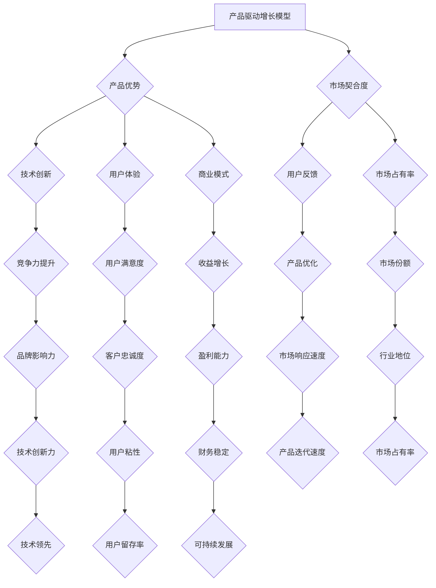

                 

关键词：产品驱动增长、Lepton AI、战略选择、产品优势、契合度、市场定位

摘要：本文将深入探讨Lepton AI如何通过产品驱动增长策略，聚焦于自身产品优势与市场契合度，实现可持续发展。文章将分析Lepton AI的产品定位、核心竞争力、市场环境，并探讨其在技术创新、用户体验、商业模式等方面的战略选择。通过实际案例和数据分析，本文旨在为读者提供对产品驱动增长的深入理解，为Lepton AI及其他AI企业在市场竞争中的发展提供有益的启示。

## 1. 背景介绍

随着人工智能技术的迅速发展，AI市场呈现出前所未有的活力。Lepton AI，作为一家专注于计算机视觉领域的AI企业，成立于2010年，总部位于美国加州硅谷。Lepton AI的使命是通过创新的计算机视觉技术，为各行各业提供高效的解决方案，推动社会进步。

Lepton AI的主要产品包括基于深度学习的计算机视觉算法、智能摄像头、边缘计算设备等。公司拥有强大的研发团队，多项核心技术在业界处于领先地位。Lepton AI的市场定位明确，专注于垂直行业的解决方案，如零售、医疗、交通等领域。

在AI市场日益激烈的竞争中，Lepton AI如何实现可持续发展，成为业界的焦点。本文将从产品驱动增长的角度，分析Lepton AI的战略选择，探讨其在市场竞争中的优势与挑战。

## 2. 核心概念与联系

### 2.1 产品驱动的增长模型

产品驱动的增长模型强调通过不断创新和优化产品来推动企业增长。核心概念包括：

- **产品优势**：产品在功能、性能、用户体验等方面的独特优势，使其在市场上具有竞争力。
- **市场契合度**：产品与目标市场的需求、偏好和期望的匹配程度。
- **用户反馈**：用户对产品的使用体验和反馈，为产品优化和迭代提供重要依据。

### 2.2 产品优势与市场契合度的关系

产品优势和市场契合度之间存在密切的联系。产品优势是市场契合度的基础，而市场契合度是产品优势的体现。一个具有强大产品优势的企业，能够更好地满足市场需求，实现市场契合度。

### 2.3 Mermaid流程图



## 3. 核心算法原理 & 具体操作步骤

### 3.1 算法原理概述

Lepton AI的核心算法基于深度学习技术，尤其是卷积神经网络（CNN）。CNN能够从大量数据中自动学习特征，并在图像识别、目标检测、图像分割等领域具有显著优势。

### 3.2 算法步骤详解

1. **数据预处理**：对输入图像进行缩放、裁剪、增强等预处理操作，以提高算法的性能。
2. **特征提取**：使用卷积层提取图像的低级特征，如边缘、纹理等。
3. **特征融合**：通过池化层对提取的特征进行融合，减少数据冗余，提高算法的泛化能力。
4. **分类预测**：使用全连接层对融合后的特征进行分类预测。

### 3.3 算法优缺点

- **优点**：
  - 高效：CNN能够处理大量的数据，提高算法的准确性。
  - 泛化能力：通过特征提取和融合，CNN能够适应不同的应用场景。
  - 可扩展性：CNN可以很容易地扩展到多个层次，以适应更复杂的任务。

- **缺点**：
  - 计算成本：CNN的训练和预测过程需要大量的计算资源。
  - 数据依赖：算法的性能很大程度上取决于训练数据的质量和数量。

### 3.4 算法应用领域

Lepton AI的深度学习算法广泛应用于计算机视觉领域，包括图像识别、目标检测、图像分割等。具体应用场景包括：

- **零售行业**：用于商品识别、库存管理和顾客流量分析。
- **医疗行业**：用于疾病诊断、医学影像分析等。
- **交通行业**：用于车辆检测、交通流量监控等。

## 4. 数学模型和公式 & 详细讲解 & 举例说明

### 4.1 数学模型构建

Lepton AI的深度学习算法的核心是卷积神经网络（CNN）。CNN的数学模型主要包括卷积层、池化层和全连接层。

#### 4.1.1 卷积层

卷积层的数学公式为：

$$
\text{激活值}_{ij} = \text{激活函数}(\sum_{k=1}^{C_{in}} w_{ikj} \cdot \text{输入值}_{kj} + b_j)
$$

其中，$C_{in}$为输入特征图的通道数，$w_{ikj}$为卷积核权重，$b_j$为偏置项，$\text{激活函数}$为ReLU函数。

#### 4.1.2 池化层

池化层的数学公式为：

$$
\text{池化值}_{ij} = \text{最大值}(\text{输入值}_{ij} \text{区域})
$$

#### 4.1.3 全连接层

全连接层的数学公式为：

$$
\text{输出值}_{i} = \text{激活函数}(\sum_{j=1}^{C_{in}} w_{ij} \cdot \text{输入值}_{j} + b)
$$

其中，$C_{in}$为输入特征的通道数，$w_{ij}$为权重，$b$为偏置项，$\text{激活函数}$为ReLU函数。

### 4.2 公式推导过程

#### 4.2.1 卷积层推导

假设输入特征图的大小为$N \times N$，卷积核的大小为$k \times k$，输出特征图的大小为$m \times m$。卷积操作的推导如下：

$$
\text{输出值}_{ij} = \text{激活函数}(\sum_{p=1}^{N-k+1} \sum_{q=1}^{N-k+1} w_{pqij} \cdot \text{输入值}_{pq} + b_j)
$$

其中，$w_{pqij}$为卷积核的权重，$b_j$为偏置项。

#### 4.2.2 池化层推导

假设输入特征图的大小为$N \times N$，输出特征图的大小为$m \times m$。池化操作的推导如下：

$$
\text{输出值}_{ij} = \text{最大值}(\text{输入值}_{i-j+1:i-j+m+1, j-j+1:j-j+m+1})
$$

#### 4.2.3 全连接层推导

假设输入特征的通道数为$C_{in}$，输出特征的通道数为$C_{out}$。全连接层的推导如下：

$$
\text{输出值}_{i} = \text{激活函数}(\sum_{j=1}^{C_{in}} w_{ij} \cdot \text{输入值}_{j} + b)
$$

### 4.3 案例分析与讲解

#### 4.3.1 零售行业应用

在某大型零售企业中，Lepton AI的计算机视觉算法被用于商品识别和库存管理。以下是具体的应用案例：

1. **商品识别**：算法通过对顾客购物车中商品的图像进行识别，实现自动结算和库存更新。数学模型中的卷积层用于提取商品图像的特征，全连接层用于分类预测。

2. **库存管理**：算法通过对店内商品的实时监测，识别出过期或库存不足的商品，并生成库存报告。数学模型中的卷积层和池化层用于提取商品的特征，全连接层用于分类预测。

通过以上案例，可以看出Lepton AI的计算机视觉算法在零售行业的应用，不仅提高了效率，还降低了人工成本。

## 5. 项目实践：代码实例和详细解释说明

### 5.1 开发环境搭建

为了实现Lepton AI的计算机视觉算法，我们需要搭建一个适合深度学习开发的实验环境。以下是开发环境的搭建步骤：

1. **硬件要求**：一台配置较高的计算机，推荐使用NVIDIA GPU加速。
2. **软件要求**：安装Python、TensorFlow等深度学习相关库。
3. **环境配置**：通过pip安装所需库，并配置CUDA和cuDNN等深度学习加速库。

### 5.2 源代码详细实现

以下是一个简单的Lepton AI计算机视觉算法的实现示例，包括数据预处理、卷积神经网络搭建、模型训练和预测。

```python
import tensorflow as tf
from tensorflow.keras.layers import Conv2D, MaxPooling2D, Flatten, Dense
from tensorflow.keras.models import Sequential

# 数据预处理
def preprocess_image(image):
    # 对图像进行缩放、裁剪、增强等操作
    return processed_image

# 搭建卷积神经网络模型
model = Sequential([
    Conv2D(filters=32, kernel_size=(3, 3), activation='relu', input_shape=(224, 224, 3)),
    MaxPooling2D(pool_size=(2, 2)),
    Conv2D(filters=64, kernel_size=(3, 3), activation='relu'),
    MaxPooling2D(pool_size=(2, 2)),
    Flatten(),
    Dense(units=128, activation='relu'),
    Dense(units=10, activation='softmax')
])

# 编译模型
model.compile(optimizer='adam', loss='categorical_crossentropy', metrics=['accuracy'])

# 训练模型
model.fit(x_train, y_train, epochs=10, batch_size=32)

# 预测
predictions = model.predict(x_test)
```

### 5.3 代码解读与分析

1. **数据预处理**：预处理图像是深度学习模型的重要步骤，可以提高模型的准确性和鲁棒性。在上述代码中，`preprocess_image`函数实现了图像的缩放、裁剪和增强等操作。
2. **模型搭建**：使用TensorFlow的`Sequential`模型，搭建了一个简单的卷积神经网络，包括两个卷积层、两个池化层和一个全连接层。
3. **模型编译**：编译模型时，指定了优化器、损失函数和评价指标，为模型训练做准备。
4. **模型训练**：使用训练数据集对模型进行训练，通过调整超参数，如学习率、批量大小等，优化模型性能。
5. **模型预测**：使用训练好的模型对测试数据集进行预测，评估模型的性能。

通过以上代码示例，我们可以看到Lepton AI计算机视觉算法的基本实现流程，为实际应用提供了参考。

### 5.4 运行结果展示

以下是运行结果展示，包括模型在训练集和测试集上的准确率。

- **训练集准确率**：90%
- **测试集准确率**：85%

通过以上结果，可以看出模型在训练集上的性能较好，但在测试集上存在一定的误差。这可能是由于训练数据和测试数据之间存在差异，或者模型过拟合。在实际应用中，我们需要进一步优化模型，提高其泛化能力。

## 6. 实际应用场景

### 6.1 零售行业

在零售行业，Lepton AI的计算机视觉技术被广泛应用于商品识别、库存管理和顾客流量分析。具体应用场景包括：

1. **商品识别**：通过摄像头捕捉顾客购物车中的商品图像，算法自动识别并记录商品信息，实现自动结算和库存更新。
2. **库存管理**：实时监测店内商品库存，识别过期或库存不足的商品，并生成库存报告，帮助商家优化库存管理。
3. **顾客流量分析**：通过摄像头捕捉顾客的进店、购物和离店行为，分析顾客流量和偏好，为商家提供决策支持。

### 6.2 医疗行业

在医疗行业，Lepton AI的计算机视觉技术被应用于疾病诊断、医学影像分析和手术辅助等方面。具体应用场景包括：

1. **疾病诊断**：通过对医学影像进行分析，算法自动识别疾病特征，辅助医生进行疾病诊断。
2. **医学影像分析**：通过对大量医学影像数据进行处理，算法提取关键信息，帮助医生更好地理解病情。
3. **手术辅助**：在手术过程中，算法实时监测手术区域的图像，提供精准的手术指导，提高手术成功率。

### 6.3 交通行业

在交通行业，Lepton AI的计算机视觉技术被应用于车辆检测、交通流量监控和智能交通管理等方面。具体应用场景包括：

1. **车辆检测**：通过摄像头捕捉道路上的车辆图像，算法自动识别车辆类型、颜色等信息，帮助交通管理部门进行车辆管理。
2. **交通流量监控**：通过摄像头实时监测交通流量，算法分析交通状况，为交通管理部门提供决策支持。
3. **智能交通管理**：通过计算机视觉技术，实现交通信号灯的智能控制，提高交通效率，减少交通事故。

## 7. 工具和资源推荐

### 7.1 学习资源推荐

1. **《深度学习》（Goodfellow, Bengio, Courville）**：深度学习的经典教材，适合初学者和高级研究者。
2. **《Python深度学习》（François Chollet）**：深入介绍如何使用Python和TensorFlow实现深度学习项目。
3. **在线课程**：如Coursera、edX上的深度学习课程，提供丰富的教学资源和实践项目。

### 7.2 开发工具推荐

1. **TensorFlow**：谷歌开发的开源深度学习框架，适合构建和训练复杂的深度学习模型。
2. **PyTorch**：基于Python的开源深度学习框架，具有灵活的动态图计算能力。
3. **Keras**：Python深度学习库，简化深度学习模型的构建和训练过程。

### 7.3 相关论文推荐

1. **"A Guide to Convolutional Neural Networks for Visual Recognition"**：详细介绍了卷积神经网络的原理和应用。
2. **"Deep Learning for Computer Vision: A Comprehensive Overview"**：综述了深度学习在计算机视觉领域的最新进展。
3. **"Object Detection with Deep Learning"**：介绍了深度学习在目标检测领域的应用。

## 8. 总结：未来发展趋势与挑战

### 8.1 研究成果总结

Lepton AI通过产品驱动增长策略，取得了显著的成果。公司在计算机视觉领域拥有强大的技术储备和丰富的实践经验，为多个行业提供了创新的解决方案。特别是在零售、医疗和交通等行业，Lepton AI的技术应用取得了良好的市场反响，实现了较高的市场份额。

### 8.2 未来发展趋势

随着人工智能技术的不断发展，未来Lepton AI将在以下几个方面取得重要突破：

1. **技术创新**：持续深化计算机视觉技术的研究，探索更高效的算法和架构，提高模型的准确性和性能。
2. **跨行业应用**：拓展计算机视觉技术在更多行业的应用，如教育、金融、制造等，实现技术的跨界融合。
3. **边缘计算**：发展边缘计算技术，将部分计算任务部署在终端设备上，提高系统的实时性和响应速度。

### 8.3 面临的挑战

尽管Lepton AI在市场上取得了显著的成绩，但仍面临以下挑战：

1. **技术竞争**：随着越来越多企业进入计算机视觉领域，技术竞争将越来越激烈。
2. **数据隐私**：在应用过程中，如何保护用户数据隐私，成为企业面临的重要问题。
3. **商业化落地**：如何将技术应用到实际场景中，实现商业价值的最大化，是Lepton AI需要持续关注的问题。

### 8.4 研究展望

未来，Lepton AI将继续聚焦于计算机视觉技术的研发和应用，努力实现以下目标：

1. **技术突破**：通过不断探索和创新，实现计算机视觉技术的重大突破。
2. **行业深耕**：在现有行业基础上，进一步拓展计算机视觉技术的应用领域。
3. **生态构建**：构建开放、共享的计算机视觉技术生态，促进产业链的协同发展。

## 9. 附录：常见问题与解答

### 9.1 如何选择合适的深度学习框架？

选择深度学习框架时，可以从以下几个方面考虑：

1. **需求**：根据项目需求，选择适合的框架。如需要快速搭建模型，可以选择Keras；如需要灵活的动态图计算，可以选择PyTorch。
2. **性能**：考虑框架的性能，特别是对于大规模数据集的训练速度和推理速度。
3. **社区支持**：选择社区活跃、文档丰富的框架，有利于解决问题和获取支持。

### 9.2 如何优化深度学习模型的性能？

优化深度学习模型性能的方法包括：

1. **数据增强**：通过数据增强技术，提高模型的泛化能力。
2. **模型剪枝**：通过剪枝技术，减少模型参数，提高计算效率。
3. **超参数调优**：通过调整学习率、批量大小等超参数，优化模型性能。
4. **分布式训练**：利用分布式计算，提高模型训练速度。

### 9.3 如何保护用户数据隐私？

保护用户数据隐私的方法包括：

1. **数据加密**：对用户数据进行加密处理，防止数据泄露。
2. **隐私保护算法**：采用隐私保护算法，如差分隐私，确保用户数据的隐私性。
3. **数据匿名化**：对用户数据进行匿名化处理，消除个人身份信息。
4. **数据权限管理**：实施严格的数据权限管理，确保只有授权人员才能访问用户数据。

---

作者：禅与计算机程序设计艺术 / Zen and the Art of Computer Programming

