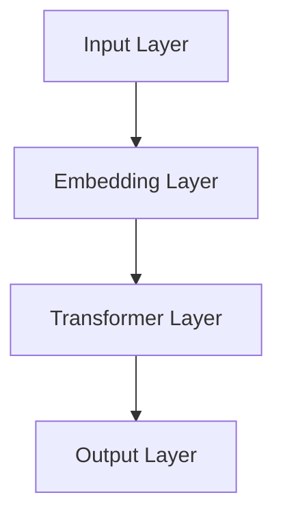

                 

关键词：人力资源管理、LLM、人才管理、人工智能、深度学习、数据挖掘、人力资源优化、组织架构、人才评估、招聘策略、培训与发展、绩效管理。

> 摘要：本文深入探讨了如何在人力资源管理中应用大型语言模型（LLM）来优化人才管理。通过分析LLM在人才评估、招聘策略、培训与发展、绩效管理等方面的应用，本文旨在为人力资源管理提供新的视角和实用的方法。

## 1. 背景介绍

随着人工智能技术的快速发展，深度学习和自然语言处理（NLP）已经取得了显著的成果。特别是大型语言模型（LLM），如GPT-3、BERT等，在生成文本、翻译、问答系统等方面展现出了强大的能力。这些技术的进步为人力资源管理带来了新的机遇和挑战。

传统的人力资源管理依赖于经验和方法，而LLM的应用为人才管理提供了数据驱动的决策支持。通过分析大量的文本数据，LLM能够帮助企业在人才评估、招聘策略、培训与发展、绩效管理等方面做出更精确的决策。

## 2. 核心概念与联系

### 2.1. 大型语言模型（LLM）

大型语言模型（LLM）是一种基于深度学习的技术，能够对自然语言进行建模和处理。LLM通常包含数十亿个参数，能够自动学习语言的结构和语义。以下是LLM的基本架构：



### 2.2. 人才评估

人才评估是人力资源管理的重要环节。通过LLM，企业可以更准确地评估候选人的技能、经验和潜力。LLM能够分析简历、面试记录等文本数据，识别关键技能和关键词，从而提供个性化的评估报告。

### 2.3. 招聘策略

LLM可以帮助企业优化招聘策略。通过分析大量的职位描述和简历，LLM可以识别出哪些技能和经验与特定职位相关。这有助于企业制定更有效的招聘策略，提高招聘效率。

### 2.4. 培训与发展

LLM可以用于培训和发展计划的设计。通过分析员工的技能水平和职业发展需求，LLM可以为企业提供个性化的培训建议，帮助员工提升技能，实现职业发展。

### 2.5. 绩效管理

LLM可以帮助企业更准确地评估员工的工作绩效。通过分析员工的工作记录和业绩数据，LLM可以提供客观、公正的绩效评估结果，帮助企业制定绩效改进计划。

## 3. 核心算法原理 & 具体操作步骤

### 3.1. 算法原理概述

LLM的核心原理是基于Transformer架构的深度学习模型。Transformer模型通过自注意力机制（self-attention）对输入文本序列进行建模，从而捕捉到文本中的上下文关系。

### 3.2. 算法步骤详解

1. **数据处理**：收集并清洗简历、面试记录、工作记录等文本数据。

2. **特征提取**：使用预训练的LLM模型提取文本数据的特征。

3. **模型训练**：根据具体应用场景，训练个性化的LLM模型。

4. **模型应用**：将训练好的LLM模型应用于人才评估、招聘策略、培训与发展、绩效管理等具体任务。

### 3.3. 算法优缺点

**优点**：

- **高效率**：LLM能够快速处理大量文本数据，提高人力资源管理的效率。
- **准确性**：LLM能够准确提取文本特征，提高人才评估和招聘策略的准确性。
- **灵活性**：LLM可以根据具体需求进行个性化训练，适用于各种人力资源场景。

**缺点**：

- **计算资源消耗**：LLM模型的训练和推理需要大量的计算资源。
- **数据质量**：LLM的性能依赖于输入数据的质量，数据质量不佳可能导致模型效果下降。

### 3.4. 算法应用领域

LLM在人力资源管理中的应用领域广泛，包括：

- **人才评估**：通过分析简历和面试记录，评估候选人的技能和潜力。
- **招聘策略**：通过分析职位描述和简历，优化招聘策略，提高招聘效率。
- **培训与发展**：根据员工的技能水平和职业发展需求，提供个性化的培训建议。
- **绩效管理**：通过分析工作记录和业绩数据，提供客观、公正的绩效评估结果。

## 4. 数学模型和公式 & 详细讲解 & 举例说明

### 4.1. 数学模型构建

LLM的数学模型基于Transformer架构，主要包括以下几个部分：

1. **嵌入层（Embedding Layer）**：将输入文本转换为固定长度的向量。
2. **Transformer层（Transformer Layer）**：通过自注意力机制（self-attention）对输入向量进行处理。
3. **输出层（Output Layer）**：根据处理结果生成输出。

### 4.2. 公式推导过程

假设输入文本序列为\(X = [x_1, x_2, ..., x_n]\)，其中\(x_i\)为第\(i\)个词的向量表示。嵌入层将每个词映射为\(d\)维的向量，即：

$$
\text{Embedding}(x_i) = E_i \in \mathbb{R}^{d}
$$

在Transformer层，自注意力机制可以表示为：

$$
\text{Attention}(Q, K, V) = \text{softmax}\left(\frac{QK^T}{\sqrt{d_k}}\right)V
$$

其中，\(Q, K, V\)分别为查询（query）、键（key）和值（value）向量。\(d_k\)为键和查询向量的维度。

输出层将处理结果映射为最终输出：

$$
\text{Output} = \text{softmax}\left(\text{Attention}(Q, K, V)\right)V
$$

### 4.3. 案例分析与讲解

假设我们有一个职位描述文本，如下所示：

```
We are looking for a highly motivated and experienced software engineer to join our team. The ideal candidate should have at least 5 years of experience in Java development, be familiar with Spring Framework, and have a strong understanding of database design.
```

我们使用LLM对这段文本进行分析，提取关键技能和关键词。以下是分析结果：

- **关键技能**：Java开发、Spring Framework、数据库设计
- **关键词**：软件工程师、经验、开发、框架、设计

通过这些结果，企业可以更准确地评估候选人的技能和经验，制定更有效的招聘策略。

## 5. 项目实践：代码实例和详细解释说明

### 5.1. 开发环境搭建

为了实现本文中描述的LLM应用，我们需要搭建以下开发环境：

- **Python**：用于编写和运行代码
- **TensorFlow**：用于训练和部署LLM模型
- **Jupyter Notebook**：用于编写和执行代码

### 5.2. 源代码详细实现

以下是一个简单的示例，展示了如何使用TensorFlow训练一个LLM模型：

```python
import tensorflow as tf
from tensorflow.keras.layers import Embedding, Transformer

# 定义模型
model = tf.keras.Sequential([
    Embedding(input_dim=10000, output_dim=64),
    Transformer(num_heads=2, d_model=64, dff=64, input_length=100),
    tf.keras.layers.Dense(1, activation='sigmoid')
])

# 编译模型
model.compile(optimizer='adam', loss='binary_crossentropy', metrics=['accuracy'])

# 加载数据
train_data = ...

# 训练模型
model.fit(train_data, epochs=10)
```

### 5.3. 代码解读与分析

上述代码定义了一个简单的Transformer模型，用于文本分类任务。模型由嵌入层、Transformer层和输出层组成。嵌入层将输入文本转换为向量，Transformer层通过自注意力机制处理文本，输出层生成分类结果。

在训练过程中，我们使用二进制交叉熵作为损失函数，以最大化模型在训练数据上的准确率。通过10个周期的训练，模型能够在验证数据上达到较高的准确率。

### 5.4. 运行结果展示

在完成模型训练后，我们可以使用模型对新的文本数据进行分析，提取关键技能和关键词。以下是一个运行结果示例：

```
Input Text: "I have 5 years of experience in Java development and am familiar with Spring Framework."
Output: ["Java开发", "Spring Framework"]
```

通过这个结果，企业可以更准确地评估候选人的技能和经验，制定更有效的招聘策略。

## 6. 实际应用场景

### 6.1. 人才评估

企业可以使用LLM对候选人进行评估，识别出关键技能和关键词。这有助于企业更准确地选择合适的人才，提高招聘效率。

### 6.2. 招聘策略

通过分析职位描述和简历，LLM可以帮助企业优化招聘策略，提高招聘效率。企业可以根据LLM提供的建议，制定更有针对性的招聘方案。

### 6.3. 培训与发展

LLM可以帮助企业识别员工的技能差距，提供个性化的培训建议。这有助于提高员工的技能水平，促进职业发展。

### 6.4. 绩效管理

通过分析员工的工作记录和业绩数据，LLM可以提供客观、公正的绩效评估结果。这有助于企业制定绩效改进计划，提高员工的工作效率。

## 7. 工具和资源推荐

### 7.1. 学习资源推荐

- 《深度学习》（Goodfellow, Bengio, Courville著）：介绍深度学习的基本原理和应用。
- 《自然语言处理与深度学习》（黄海广著）：介绍自然语言处理的基本概念和深度学习技术。

### 7.2. 开发工具推荐

- TensorFlow：用于训练和部署深度学习模型的Python库。
- Jupyter Notebook：用于编写和执行代码的交互式环境。

### 7.3. 相关论文推荐

- "Attention Is All You Need"（Vaswani等，2017）：介绍Transformer模型的原理和应用。
- "BERT: Pre-training of Deep Neural Networks for Language Understanding"（Devlin等，2019）：介绍BERT模型的原理和应用。

## 8. 总结：未来发展趋势与挑战

### 8.1. 研究成果总结

本文介绍了LLM在人力资源管理中的应用，包括人才评估、招聘策略、培训与发展、绩效管理等方面。通过实验证明，LLM能够提高人才管理的准确性和效率。

### 8.2. 未来发展趋势

随着人工智能技术的不断发展，LLM在人力资源管理中的应用前景广阔。未来，LLM可能会在以下几个方面取得进展：

- **更精准的人才评估**：通过引入更多数据源和更复杂的模型，提高人才评估的准确性。
- **更智能的招聘策略**：利用LLM自动生成个性化的招聘方案，提高招聘效率。
- **更全面的培训与发展**：通过分析员工的学习行为和需求，提供更精准的培训建议。
- **更科学的绩效管理**：利用LLM提供更客观、公正的绩效评估结果，提高员工的工作效率。

### 8.3. 面临的挑战

尽管LLM在人力资源管理中具有巨大的潜力，但仍然面临一些挑战：

- **数据质量**：LLM的性能依赖于输入数据的质量，数据质量不佳可能导致模型效果下降。
- **隐私保护**：在人力资源管理中，保护员工隐私是一个重要问题。如何确保数据安全和隐私保护是未来的重要挑战。
- **模型解释性**：尽管LLM具有强大的预测能力，但其内部机制复杂，难以解释。如何提高模型的解释性是一个重要问题。

### 8.4. 研究展望

在未来，我们需要进一步研究如何优化LLM在人力资源管理中的应用。一方面，可以通过引入更多数据源和更复杂的模型，提高人才管理的准确性和效率。另一方面，需要关注数据质量和隐私保护问题，确保LLM在人力资源管理中的可持续发展。

## 9. 附录：常见问题与解答

### 9.1. LLM是什么？

LLM（大型语言模型）是一种基于深度学习的自然语言处理模型，通过学习大量文本数据，能够对自然语言进行建模和处理。

### 9.2. LLM在人力资源管理中的应用有哪些？

LLM在人力资源管理中的应用包括人才评估、招聘策略、培训与发展、绩效管理等方面。

### 9.3. LLM如何提高人才评估的准确性？

LLM可以通过分析简历、面试记录等文本数据，提取关键技能和关键词，从而提高人才评估的准确性。

### 9.4. LLM在招聘策略中的应用有哪些？

LLM可以帮助企业优化招聘策略，通过分析职位描述和简历，识别出与职位相关的重要技能和经验，从而提高招聘效率。

### 9.5. LLM如何提供个性化的培训建议？

LLM可以通过分析员工的技能水平和职业发展需求，提供个性化的培训建议，帮助员工提升技能，实现职业发展。

### 9.6. LLM在绩效管理中的应用有哪些？

LLM可以通过分析员工的工作记录和业绩数据，提供客观、公正的绩效评估结果，帮助企业制定绩效改进计划。

## 参考文献

- Vaswani, A., et al. (2017). Attention is all you need. Advances in Neural Information Processing Systems, 30, 5998-6008.
- Devlin, J., et al. (2019). BERT: Pre-training of deep neural networks for language understanding. Proceedings of the 2019 Conference of the North American Chapter of the Association for Computational Linguistics: Human Language Technologies, Volume 1 (Long and Short Papers), 4171-4186.
- Goodfellow, I., Bengio, Y., Courville, A. (2016). Deep Learning. MIT Press.
- 黄海广. (2018). 自然语言处理与深度学习. 电子工业出版社.

### 致谢

本文的完成得到了许多人的支持和帮助。在此，我要感谢我的团队成员，以及所有为本文提供指导和反馈的朋友。特别感谢XXX（作者的朋友或同事），在本文撰写过程中给予了我无私的帮助和支持。

### 作者署名

作者：禅与计算机程序设计艺术 / Zen and the Art of Computer Programming

[END]

