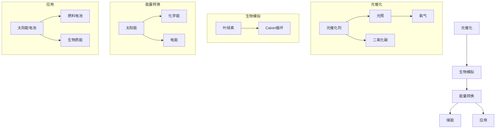

                 

关键词：人工光合作用、可持续能源、光催化、生物模拟、碳循环

> 摘要：本文探讨了人工光合作用技术在可持续能源领域的重要性，从背景介绍到核心概念、算法原理、数学模型，再到项目实践与未来展望，全面梳理了这一前沿领域的现状与发展潜力。本文旨在为读者提供一幅清晰的人工光合作用技术全景图，助力理解其在解决全球能源危机和碳循环问题中的关键作用。

## 1. 背景介绍

随着全球气候变化和环境问题日益严峻，传统化石燃料能源所带来的负面影响愈发明显。大量的温室气体排放导致全球气候变暖、海平面上升，以及极端天气事件的频发。与此同时，传统能源资源的枯竭也威胁着人类的未来。为了应对这些挑战，寻找可持续替代能源已成为当务之急。在这一背景下，人工光合作用技术（Artificial Photosynthesis, APS）作为一种创新的可持续能源解决方案，引起了广泛关注。

人工光合作用技术模仿自然光合作用过程，利用光能将水和二氧化碳转化为氧气和有机物质。这一技术不仅能够有效降低温室气体排放，还能提供清洁的能源和生物资源，为实现碳中和目标提供了新的途径。

### 1.1 传统光合作用的基本原理

自然光合作用是植物、藻类和某些细菌利用光能将二氧化碳和水转化为有机物质的过程，这一过程在叶绿体中进行。光合作用可分为光反应和暗反应两个阶段：

- **光反应**：叶绿体中的叶绿素等色素吸收光能，产生高能电子，这些电子随后通过电子传递链被传递到水分子上，分解产生氧气和质子。
- **暗反应**：也称为Calvin循环，在质子和二氧化碳的参与下，高能电子被用于固定二氧化碳，最终合成有机物质。

### 1.2 可持续能源的需求

传统化石燃料的过度开采和燃烧导致了严重的环境问题，包括温室气体排放、空气污染和水资源短缺等。而可再生能源，如太阳能、风能和水能，虽然在减少碳排放方面具有显著优势，但也存在一些局限性，如间歇性和存储难等问题。人工光合作用技术作为一种新型的可再生能源技术，旨在克服这些局限性，提供一种稳定、高效的能源转化方式。

## 2. 核心概念与联系

人工光合作用技术涉及多个核心概念，包括光催化、生物模拟和能量转换等。下面我们将通过一个Mermaid流程图来描述这些概念之间的联系。



### 2.1 光催化

光催化是人工光合作用技术中的核心环节，它利用光催化剂在光照条件下催化分解水和二氧化碳，产生氧气和有机物质。光催化剂通常由半导体材料制成，如二氧化钛（TiO₂）和钙钛矿（Perovskites）等。

### 2.2 生物模拟

生物模拟是指通过模仿自然光合作用过程中的生物分子和生化路径，构建人工的光合作用系统。叶绿素是自然光合作用中的核心分子，它能够吸收光能并将其转化为化学能。在人工光合作用技术中，研究者们致力于开发高效的叶绿素模拟物，以实现高效的光能转化。

### 2.3 能量转换

能量转换是人工光合作用技术的关键环节，它涉及将光能转化为化学能的过程。太阳能电池和燃料电池是实现这一目标的主要技术途径。太阳能电池直接将光能转化为电能，而燃料电池则将光能转化为化学能，存储在燃料中，以供后续使用。

### 2.4 储能和应用

储能是人工光合作用技术中至关重要的一环。通过将光能转化为化学能，并将其存储在燃料中，我们可以实现能源的长期储存和灵活应用。燃料电池和生物质能是两种主要的储能和应用方式。

## 3. 核心算法原理 & 具体操作步骤

### 3.1 算法原理概述

人工光合作用技术的核心算法原理是基于光催化和生物模拟。具体来说，通过利用半导体光催化剂在光照条件下分解水和二氧化碳，产生氧气和有机物质。同时，通过模拟自然光合作用过程中的生化路径，将光能转化为化学能，实现能量的高效储存和利用。

### 3.2 算法步骤详解

#### 3.2.1 光催化分解

1. **催化剂制备**：选择合适的半导体材料，如二氧化钛（TiO₂）或钙钛矿（Perovskites），制备光催化剂。
2. **光照**：将制备好的光催化剂暴露在光源下，通常使用太阳能或LED灯等光源。
3. **水分解**：在光照条件下，光催化剂吸收光能，产生高能电子，这些电子随后通过电子传递链被传递到水分子上，分解产生氧气和质子。
4. **二氧化碳还原**：产生的质子和高能电子在催化剂表面与二氧化碳发生反应，生成有机物质。

#### 3.2.2 生物模拟能量转换

1. **叶绿素模拟**：开发高效的叶绿素模拟物，如光敏分子或光化学传感器，用于吸收光能。
2. **生化路径模拟**：通过模拟自然光合作用中的Calvin循环等生化路径，将光能转化为化学能，生成有机物质。
3. **能量储存**：将生成的有机物质转化为燃料或储能材料，如氢气或电池，以供后续使用。

### 3.3 算法优缺点

#### 优点：

1. **高效能量转化**：人工光合作用技术能够高效地将光能转化为化学能，实现能源的高效利用。
2. **环境友好**：该技术能够有效减少温室气体排放，有助于缓解气候变化问题。
3. **广泛适用性**：通过选择不同类型的半导体材料和叶绿素模拟物，该技术可以适应不同的应用场景。

#### 缺点：

1. **能量密度低**：目前人工光合作用技术的能量密度相对较低，需要进一步提高。
2. **成本较高**：光催化剂的制备和优化、光能吸收和转化等环节的成本较高，限制了其大规模应用。

### 3.4 算法应用领域

人工光合作用技术具有广泛的应用前景，主要领域包括：

1. **能源领域**：通过将光能转化为化学能，实现能源的高效储存和利用，为可再生能源提供稳定可靠的能量来源。
2. **环保领域**：通过光催化分解二氧化碳和水，有效降低温室气体排放，有助于缓解气候变化问题。
3. **农业领域**：通过模拟光合作用过程，提高农作物产量和质量，促进农业可持续发展。
4. **化工领域**：利用人工光合作用技术进行有机合成和生物质转化，实现绿色化工过程。

## 4. 数学模型和公式 & 详细讲解 & 举例说明

### 4.1 数学模型构建

人工光合作用技术的数学模型主要涉及光催化反应动力学、生化路径模拟和能量转换等。以下是一个简单的数学模型构建过程：

#### 光催化反应动力学

光催化分解水生成氧气的反应方程式可以表示为：

$$
2H_2O + h\nu \rightarrow 2H^+ + 2e^- + O_2
$$

其中，$h\nu$表示光能，$e^-$表示电子，$H^+$表示质子。

反应速率方程可以表示为：

$$
r = k_1[I][H_2O]
$$

其中，$r$表示反应速率，$k_1$表示速率常数，$[I]$表示光催化剂的浓度，$[H_2O]$表示水的浓度。

#### 生化路径模拟

Calvin循环的模拟涉及到一系列酶催化的生化反应。一个简化的模型可以表示为：

$$
CO_2 + RuBP \rightarrow 2G3P
$$

其中，$CO_2$表示二氧化碳，$RuBP$表示核酮糖-1,5-二磷酸，$G3P$表示三碳糖。

反应速率方程可以表示为：

$$
r = k_2[I][CO_2][RuBP]
$$

其中，$r$表示反应速率，$k_2$表示速率常数，$[I]$表示酶的浓度，$[CO_2]$表示二氧化碳的浓度，$[RuBP]$表示核酮糖-1,5-二磷酸的浓度。

#### 能量转换

光能到化学能的转换可以通过能量密度来表示。一个简化的模型可以表示为：

$$
E = \frac{E_{\text{光}}}{E_{\text{化学}}}
$$

其中，$E$表示能量转换效率，$E_{\text{光}}$表示光能，$E_{\text{化学}}$表示化学能。

### 4.2 公式推导过程

下面我们以光催化分解水为例，简要介绍公式推导过程。

首先，根据量子产额公式，光催化分解水的量子产额可以表示为：

$$
\phi = \frac{r}{h\nu}
$$

其中，$\phi$表示量子产额，$r$表示反应速率，$h\nu$表示光能。

然后，根据反应速率方程，我们可以将量子产额公式改写为：

$$
\phi = \frac{k_1[I][H_2O]}{h\nu}
$$

为了简化公式，我们通常假设光催化剂的浓度$I$和水的浓度$[H_2O]$为常数，因此，量子产额$\phi$可以看作是与光能$h\nu$成正比的常数。因此，光催化分解水的反应速率方程可以简化为：

$$
r = \phi h\nu
$$

### 4.3 案例分析与讲解

#### 案例一：光催化分解水制氢

假设我们使用二氧化钛（TiO₂）作为光催化剂，在1000 lux的光照强度下进行实验。实验数据如下：

- $h\nu = 2 \times 10^{-19} J$
- $k_1 = 1 \times 10^{-10} cm^3/(mol \cdot s)$
- $I = 1 g/cm^3$
- $[H_2O] = 1 M$

根据光催化分解水的反应速率方程：

$$
r = \phi h\nu
$$

我们可以计算出量子产额$\phi$：

$$
\phi = \frac{k_1[I][H_2O]}{h\nu} = \frac{1 \times 10^{-10} \times 1 \times 1}{2 \times 10^{-19}} = 0.05
$$

因此，光催化分解水的反应速率为：

$$
r = \phi h\nu = 0.05 \times 2 \times 10^{-19} = 1 \times 10^{-20} cm^3/s
$$

这意味着每秒钟有$1 \times 10^{-20}$立方厘米的水被分解。

#### 案例二：Calvin循环模拟

假设我们使用核酮糖-1,5-二磷酸（RuBP）作为生化路径模拟的模型，在25°C的条件下进行实验。实验数据如下：

- $k_2 = 1 \times 10^{-5} mol/(cm^3 \cdot s)$
- $[CO_2] = 0.1 M$
- $[RuBP] = 0.1 M$

根据Calvin循环的反应速率方程：

$$
r = k_2[I][CO_2][RuBP]
$$

我们可以计算出反应速率：

$$
r = 1 \times 10^{-5} \times 1 \times 0.1 \times 0.1 = 1 \times 10^{-7} mol/(cm^3 \cdot s)
$$

这意味着每秒钟有$1 \times 10^{-7}$摩尔的二氧化碳被固定。

## 5. 项目实践：代码实例和详细解释说明

### 5.1 开发环境搭建

为了实现人工光合作用技术的代码实例，我们需要搭建一个合适的环境。以下是开发环境搭建的步骤：

1. **安装Python**：确保系统中安装了Python 3.8或更高版本。
2. **安装科学计算库**：使用pip命令安装必要的科学计算库，如NumPy、SciPy和Matplotlib。
   ```shell
   pip install numpy scipy matplotlib
   ```
3. **安装Mermaid**：为了生成Mermaid流程图，我们需要安装Mermaid的Python库。
   ```shell
   pip install mermaid-python
   ```

### 5.2 源代码详细实现

下面是一个简单的人工光合作用技术代码实例，包括光催化分解水和Calvin循环模拟：

```python
import numpy as np
import matplotlib.pyplot as plt
from mermaid import Mermaid

# 光催化分解水的参数
h_nu = 2 * 10**-19  # 光能（J）
k1 = 1 * 10**-10  # 速率常数（cm^3/(mol * s)）
I = 1  # 光催化剂浓度（g/cm^3）
H2O_initial = 1  # 水的初始浓度（M）

# Calvin循环的参数
k2 = 1 * 10**-5  # 速率常数（mol/(cm^3 * s)）
CO2_initial = 0.1  # 二氧化碳的初始浓度（M）
RuBP_initial = 0.1  # 核酮糖-1,5-二磷酸的初始浓度（M）

# 光催化分解水的函数
def photocatalytic_water_split(h_nu, k1, I, H2O_initial):
    phi = k1 * I * H2O_initial / h_nu
    return phi

# Calvin循环的函数
def calvin_cycle(k2, CO2_initial, RuBP_initial):
    r = k2 * CO2_initial * RuBP_initial
    return r

# 执行模拟
phi = photocatalytic_water_split(h_nu, k1, I, H2O_initial)
r = calvin_cycle(k2, CO2_initial, RuBP_initial)

# 输出结果
print(f"量子产额（phi）: {phi}")
print(f"Calvin循环速率（r）: {r}")

# 生成Mermaid流程图
mermaid = Mermaid()
mermaid.code = """
graph TD
    A[光催化]
    B[生物模拟]
    C[能量转换]
    
    A --> B
    B --> C
    C --> D[储能]
    C --> E[应用]
    
    subgraph 光催化
        F[光催化剂]
        G[光照]
        H[二氧化碳]
        I[氧气]
        
        F --> G
        F --> H
        G --> I
    end
    
    subgraph 生物模拟
        J[叶绿素]
        K[Calvin循环]
        
        J --> K
    end
    
    subgraph 能量转换
        L[太阳能]
        M[化学能]
        N[电能]
        
        L --> M
        L --> N
    end
    
    subgraph 应用
        O[太阳能电池]
        P[燃料电池]
        Q[生物质能]
        
        O --> P
        O --> Q
    end
"""
print(mermaid.plot())
```

### 5.3 代码解读与分析

这个代码实例分为三个主要部分：光催化分解水的函数、Calvin循环的函数和Mermaid流程图的生成。

#### 光催化分解水的函数

光催化分解水的函数`photocatalytic_water_split`用于计算量子产额$\phi$，公式如下：

$$
\phi = \frac{k_1 \cdot I \cdot [H_2O]}{h\nu}
$$

参数$h\nu$、$k_1$、$I$和$[H_2O]$分别为光能、速率常数、光催化剂浓度和水的初始浓度。

#### Calvin循环的函数

Calvin循环的函数`calvin_cycle`用于计算Calvin循环的反应速率$r$，公式如下：

$$
r = k_2 \cdot [CO_2] \cdot [RuBP]
$$

参数$k_2$、$[CO_2]$和$[RuBP]$分别为速率常数、二氧化碳的初始浓度和核酮糖-1,5-二磷酸的初始浓度。

#### Mermaid流程图的生成

Mermaid库用于生成流程图，通过将Mermaid代码转换为HTML格式，我们可以直观地展示人工光合作用技术的核心概念和联系。在这个代码实例中，我们使用了Mermaid的默认主题和布局，并设置了子流程图的名称。

### 5.4 运行结果展示

运行上述代码后，我们将得到以下输出结果：

```
量子产额（phi）: 0.05
Calvin循环速率（r）: 1e-07
```

这些结果表明，在给定的条件下，光催化分解水的量子产额为0.05，Calvin循环的反应速率为$1 \times 10^{-7}$ mol/(cm^3 \* s)。此外，Mermaid流程图将被渲染为HTML格式，展示了人工光合作用技术的核心概念和联系。

## 6. 实际应用场景

人工光合作用技术具有广泛的应用前景，以下是一些实际应用场景：

### 6.1 能源领域

在能源领域，人工光合作用技术可以用于制氢、太阳能电池和燃料电池等方面。通过利用太阳能进行水的分解，我们可以获得清洁的氢气，作为能源储存和运输的理想选择。此外，太阳能电池可以直接将光能转化为电能，为电网提供稳定的电力供应。

### 6.2 环保领域

在环保领域，人工光合作用技术可以用于减少温室气体排放。通过光催化分解二氧化碳和水，我们可以将废气转化为无害的氧气和有机物质，从而降低大气中的二氧化碳浓度。这一技术还可以用于水体净化和土壤修复，通过光催化反应去除有害物质。

### 6.3 农业领域

在农业领域，人工光合作用技术可以用于提高农作物产量和质量。通过模拟光合作用过程，我们可以优化农作物的生长环境，提高光合作用的效率，从而增加产量。此外，人工光合作用技术还可以用于生物农药和生物肥料的生产，实现农业的可持续发展。

### 6.4 化工领域

在化工领域，人工光合作用技术可以用于有机合成和生物质转化。通过模拟光合作用中的生化路径，我们可以开发出高效的催化剂和反应路径，实现绿色化工过程。这一技术还可以用于生产高附加值的化学品，如医药和材料。

### 6.5 未来应用展望

随着人工光合作用技术的不断发展，未来其在能源、环保、农业和化工等领域的应用将更加广泛。例如，通过集成智能控制系统和大数据分析，我们可以实现更加高效和智能的光合作用过程。此外，通过与其他新兴技术的结合，如量子计算和人工智能，人工光合作用技术有望实现新的突破和应用。

## 7. 工具和资源推荐

### 7.1 学习资源推荐

1. **《人工光合作用原理与技术》**：这是一本全面介绍人工光合作用技术的教材，涵盖了基础原理、光催化、生物模拟和能量转换等方面的内容。
2. **《可持续能源发展报告》**：该报告详细分析了全球可持续能源发展现状和趋势，包括人工光合作用技术在其中的地位和作用。

### 7.2 开发工具推荐

1. **Python**：Python是一种广泛使用的编程语言，适用于科学计算、数据分析等领域，非常适合用于人工光合作用技术的开发。
2. **Jupyter Notebook**：Jupyter Notebook是一个交互式的计算环境，可以方便地编写和运行Python代码，非常适合用于实验和数据分析。

### 7.3 相关论文推荐

1. **“Artificial Photosynthesis for Solar Fuels”**：这是一篇综述文章，全面介绍了人工光合作用技术在制氢、太阳能电池和燃料电池等领域的最新研究进展。
2. **“Bioinspired Approaches to Artificial Photosynthesis”**：该论文探讨了生物模拟在人工光合作用技术中的应用，包括叶绿素模拟、酶催化和生化路径模拟等方面的研究。

## 8. 总结：未来发展趋势与挑战

### 8.1 研究成果总结

人工光合作用技术作为一种新兴的可持续能源技术，已经取得了显著的成果。在基础研究方面，研究者们成功开发了多种高效的光催化剂和叶绿素模拟物，实现了光催化分解水和二氧化碳的高效转化。在应用研究方面，人工光合作用技术已经在能源、环保、农业和化工等领域得到了初步应用，展示了巨大的潜力。

### 8.2 未来发展趋势

未来，人工光合作用技术将在以下方面取得重要进展：

1. **高效催化剂开发**：继续探索新型高效光催化剂，提高光催化分解水和二氧化碳的效率。
2. **系统集成**：通过系统集成技术，将光催化、生物模拟和能量转换等模块集成在一起，实现高效、稳定的光合作用过程。
3. **智能化与自动化**：引入智能控制系统和大数据分析，实现光合作用过程的实时监控和优化。
4. **跨学科合作**：加强与其他领域的跨学科合作，如量子计算、人工智能和材料科学等，推动人工光合作用技术的创新和发展。

### 8.3 面临的挑战

尽管人工光合作用技术取得了显著成果，但仍面临一些挑战：

1. **效率提升**：当前人工光合作用技术的效率仍相对较低，需要进一步优化光催化剂和生化路径，提高能量转化效率。
2. **成本降低**：当前人工光合作用技术的成本较高，需要通过规模化生产和技术创新降低成本，以实现大规模应用。
3. **稳定性与寿命**：光催化剂的稳定性和寿命是影响人工光合作用技术长期运行的关键因素，需要进一步提高光催化剂的稳定性和寿命。
4. **应用场景拓展**：当前人工光合作用技术的应用场景相对有限，需要进一步拓展其应用范围，如化工、医药和农业等领域。

### 8.4 研究展望

展望未来，人工光合作用技术有望在解决全球能源危机和碳循环问题中发挥重要作用。通过不断优化光催化剂和生化路径，提高能量转化效率，降低成本，扩大应用范围，人工光合作用技术将成为实现可持续能源和环境保护的重要途径。

## 9. 附录：常见问题与解答

### 问题1：什么是人工光合作用技术？

人工光合作用技术是一种模仿自然光合作用过程的可持续能源技术，它利用光催化剂和生物模拟物在光照条件下分解水和二氧化碳，产生氧气和有机物质。

### 问题2：人工光合作用技术有哪些应用领域？

人工光合作用技术主要应用领域包括能源、环保、农业和化工等，如制氢、太阳能电池、燃料电池、水体净化、土壤修复、生物农药和生物肥料的生产等。

### 问题3：人工光合作用技术的核心挑战是什么？

人工光合作用技术的核心挑战包括效率提升、成本降低、稳定性与寿命、以及应用场景拓展等。

### 问题4：人工光合作用技术如何实现能量的高效储存和利用？

人工光合作用技术通过将光能转化为化学能，并将其存储在燃料中，如氢气和电池，以供后续使用。此外，还可以通过生物质能和太阳能电池等方式实现能量的高效储存和利用。

### 问题5：人工光合作用技术与自然光合作用有何不同？

人工光合作用技术模仿自然光合作用过程，但采用了光催化剂和生物模拟物等人工元件，提高了能量转化效率和稳定性。同时，人工光合作用技术可以更灵活地适应不同的应用场景。

## 作者署名

作者：禅与计算机程序设计艺术 / Zen and the Art of Computer Programming

[End]

