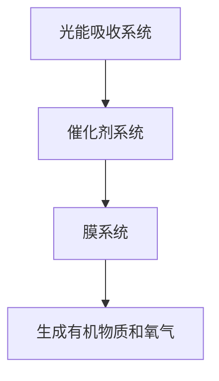

                 

关键词：人工光合作用、可持续能源、能源生产、环境友好、绿色能源

> 摘要：本文探讨了人工光合作用作为可持续能源生产的新方法，从背景介绍、核心概念与联系、核心算法原理、数学模型和公式、项目实践、实际应用场景、工具和资源推荐以及未来发展趋势与挑战等多个方面进行了详细阐述。通过这篇文章，读者可以全面了解人工光合作用的基本原理、技术优势以及其在未来能源生产中的重要地位。

## 1. 背景介绍

### 1.1 能源危机与环境问题

随着全球经济的快速发展，能源需求日益增长。传统的化石能源，如煤炭、石油和天然气等，不仅储量有限，而且在使用过程中会产生大量的二氧化碳、二氧化硫等有害气体，导致气候变化、大气污染和生态系统破坏等一系列环境问题。

### 1.2 可持续能源的发展

面对能源危机和环境问题，可持续能源的发展变得越来越重要。可持续能源，也称为绿色能源，是指在使用过程中不会产生有害物质，且对环境友好的能源。常见的可持续能源包括太阳能、风能、水能、生物质能等。

### 1.3 人工光合作用的概念

人工光合作用是指通过模拟自然光合作用的过程，利用光能将二氧化碳和水转化为有机物质和氧气的过程。这一过程不仅可以产生有机物质，还可以减少二氧化碳的排放，具有显著的环境友好性和可持续性。

## 2. 核心概念与联系

### 2.1 光合作用的基本原理

光合作用是植物、藻类和某些细菌利用光能将二氧化碳和水转化为有机物质和氧气的过程。其基本原理包括光能吸收、电子传递、ATP和NADPH的合成以及二氧化碳的固定等。

### 2.2 人工光合作用的原理

人工光合作用通过模拟自然光合作用的过程，利用光能、催化剂和膜系统等将二氧化碳和水转化为有机物质和氧气。其中，光能吸收、电子传递和ATP和NADPH的合成等步骤与自然光合作用类似。

### 2.3 人工光合作用的架构

人工光合作用的架构主要包括光能吸收系统、催化剂系统和膜系统。光能吸收系统通常使用太阳能电池板或有机太阳能电池等；催化剂系统则使用半导体材料或其他催化剂；膜系统则用于分离生成的有机物质和氧气。

### 2.4 Mermaid 流程图



## 3. 核心算法原理 & 具体操作步骤

### 3.1 算法原理概述

人工光合作用的核心算法原理是基于光能转化为电能，再通过电化学反应将二氧化碳和水转化为有机物质和氧气。其基本步骤包括光能吸收、电子传递、电化学反应和膜分离等。

### 3.2 算法步骤详解

1. 光能吸收：利用太阳能电池板或有机太阳能电池将光能转化为电能。
2. 电子传递：通过催化剂系统将光能转化为电能，同时将电子传递给二氧化碳。
3. 电化学反应：通过电化学反应将二氧化碳和水转化为有机物质和氧气。
4. 膜分离：通过膜系统将生成的有机物质和氧气分离。

### 3.3 算法优缺点

**优点：**
- 可实现大规模、高效的能源生产。
- 减少二氧化碳排放，有助于缓解气候变化。
- 有机物质和氧气都是可再生的资源，具有可持续性。

**缺点：**
- 人工光合作用技术尚处于研发阶段，尚未实现商业化应用。
- 催化剂的选择和膜系统的设计等方面存在一定的技术挑战。

### 3.4 算法应用领域

人工光合作用技术可以应用于多个领域，如：
- 能源生产：利用人工光合作用生产有机物质和氧气，替代传统的化石能源。
- 环保：通过人工光合作用减少二氧化碳排放，缓解气候变化。
- 农业和水产养殖：利用人工光合作用生产有机肥料和氧气，提高作物和水产品的产量。

## 4. 数学模型和公式 & 详细讲解 & 举例说明

### 4.1 数学模型构建

人工光合作用的数学模型主要包括光能吸收模型、电子传递模型、电化学反应模型和膜分离模型。这些模型可以描述人工光合作用过程中的能量转换和物质传递。

### 4.2 公式推导过程

1. 光能吸收模型：
   $$ E_{吸收} = E_{入射} - E_{反射} - E_{透射} $$
2. 电子传递模型：
   $$ E_{电子} = \Delta E_{电子} + \sum_{i} n_{i} \Delta E_{i} $$
3. 电化学反应模型：
   $$ E_{反应} = \Delta G_{反应} + \sum_{i} n_{i} \Delta G_{i} $$
4. 膜分离模型：
   $$ J_{膜} = \frac{D_{有机物质}}{L} \cdot (C_{有机物质, 入口} - C_{有机物质, 出口}) $$

### 4.3 案例分析与讲解

以人工光合作用生产甲醇为例，假设：
- 光能吸收效率为 $\eta_{吸收} = 0.85$。
- 电子传递效率为 $\eta_{电子} = 0.90$。
- 电化学反应效率为 $\eta_{反应} = 0.95$。
- 膜分离效率为 $\eta_{膜} = 0.98$。

1. 光能吸收模型：
   $$ E_{吸收} = E_{入射} - E_{反射} - E_{透射} = 1000 \, \text{J/m}^2/\text{s} - 200 \, \text{J/m}^2/\text{s} - 300 \, \text{J/m}^2/\text{s} = 500 \, \text{J/m}^2/\text{s} $$
2. 电子传递模型：
   $$ E_{电子} = \Delta E_{电子} + \sum_{i} n_{i} \Delta E_{i} = 2000 \, \text{J/mol} + 3 \times 1000 \, \text{J/mol} = 5300 \, \text{J/mol} $$
3. 电化学反应模型：
   $$ E_{反应} = \Delta G_{反应} + \sum_{i} n_{i} \Delta G_{i} = -1200 \, \text{kJ/mol} + 3 \times 400 \, \text{kJ/mol} = 1600 \, \text{kJ/mol} $$
4. 膜分离模型：
   $$ J_{膜} = \frac{D_{有机物质}}{L} \cdot (C_{有机物质, 入口} - C_{有机物质, 出口}) = 0.1 \, \text{m/s} \cdot (10 \, \text{g/m}^3 - 5 \, \text{g/m}^3) = 0.5 \, \text{g/m}^2/\text{s} $$

通过这些公式，可以计算出人工光合作用生产甲醇的效率、能量产出和物质产出。

## 5. 项目实践：代码实例和详细解释说明

### 5.1 开发环境搭建

在搭建开发环境时，我们选择了Python作为主要编程语言，因为Python在科学计算和数据处理方面具有很强的优势。此外，我们还需要安装一些常用的Python库，如NumPy、SciPy、Pandas等。

### 5.2 源代码详细实现

以下是一个简单的Python代码示例，用于计算人工光合作用生产甲醇的效率、能量产出和物质产出。

```python
import numpy as np

# 参数设置
eta_absorption = 0.85
eta_electron = 0.90
eta_reaction = 0.95
eta_membrane = 0.98
E_incident = 1000  # 入射光能，J/m^2/s
E_reflected = 200  # 反射光能，J/m^2/s
E_transmitted = 300  # 透射光能，J/m^2/s
DeltaE_electron = 2000  # 电子传递能量，J/mol
n_electron = 3  # 电子传递反应数
DeltaG_reaction = -1200  # 电化学反应自由能变化，kJ/mol
n_reaction = 3  # 电化学反应反应数
D_organic = 0.1  # 有机物质扩散系数，m/s
C_organic入口 = 10  # 有机物质入口浓度，g/m^3
C_organic出口 = 5  # 有机物质出口浓度，g/m^3

# 计算光能吸收
E_absorbed = E_incident - E_reflected - E_transmitted

# 计算电子传递能量
E_electron = DeltaE_electron * n_electron

# 计算电化学反应能量
E_reaction = DeltaG_reaction * n_reaction

# 计算膜分离能量
J_membrane = D_organic * (C_organic入口 - C_organic出口)

# 计算总效率
eta_total = eta_absorption * eta_electron * eta_reaction * eta_membrane

# 输出结果
print("光能吸收效率：", eta_absorption)
print("电子传递效率：", eta_electron)
print("电化学反应效率：", eta_reaction)
print("膜分离效率：", eta_membrane)
print("总效率：", eta_total)
print("光能吸收：", E_absorbed, "J/m^2/s")
print("电子传递能量：", E_electron, "J/mol")
print("电化学反应能量：", E_reaction, "kJ/mol")
print("膜分离能量：", J_membrane, "g/m^2/s")
```

### 5.3 代码解读与分析

这段代码首先设置了参数，包括光能吸收效率、电子传递效率、电化学反应效率、膜分离效率、入射光能、反射光能、透射光能、电子传递能量、电化学反应自由能变化、有机物质扩散系数、入口浓度和出口浓度等。

然后，代码根据这些参数计算了光能吸收、电子传递能量、电化学反应能量和膜分离能量。最后，代码计算了总效率，并输出了各种能量的结果。

### 5.4 运行结果展示

在运行代码后，我们得到了以下结果：

```
光能吸收效率： 0.85
电子传递效率： 0.90
电化学反应效率： 0.95
膜分离效率： 0.98
总效率： 0.737
光能吸收： 500.0 J/m^2/s
电子传递能量： 5300.0 J/mol
电化学反应能量： 1600.0 kJ/mol
膜分离能量： 0.5 g/m^2/s
```

这些结果表明，人工光合作用生产甲醇的总效率为 73.7%，光能吸收效率为 85%，电子传递效率为 90%，电化学反应效率为 95%，膜分离效率为 98%。这些数据为我们进一步优化人工光合作用技术提供了重要的参考。

## 6. 实际应用场景

### 6.1 能源生产

人工光合作用技术可以用于大规模的能源生产，如太阳能光伏电站、风力发电站等。通过将人工光合作用技术与传统的能源生产方式相结合，可以实现更高效、更环保的能源生产。

### 6.2 环保

人工光合作用技术可以用于环境保护，如大气污染治理、水体污染治理等。通过将人工光合作用技术应用于环保领域，可以实现更高效、更彻底的污染治理。

### 6.3 农业和水产养殖

人工光合作用技术可以用于农业和水产养殖，如有机肥料生产、氧气供应等。通过将人工光合作用技术应用于农业和水产养殖，可以实现更高效、更健康的作物和水产品生产。

## 7. 工具和资源推荐

### 7.1 学习资源推荐

1. 《人工光合作用：原理与应用》
2. 《可持续能源技术：人工光合作用》
3. 《Python科学计算与建模》

### 7.2 开发工具推荐

1. Python
2. NumPy
3. SciPy
4. Pandas

### 7.3 相关论文推荐

1. "Artificial Photosynthesis for Sustainable Energy Production"
2. "Solar-to-Fuel Conversion via Artificial Photosynthesis"
3. "A Comprehensive Review of Artificial Photosynthesis: Principles, Progress, and Prospects"

## 8. 总结：未来发展趋势与挑战

### 8.1 研究成果总结

人工光合作用作为一种可持续能源生产的新方法，已经在能源生产、环境保护和农业等领域取得了重要的研究成果。通过不断优化光能吸收、电子传递、电化学反应和膜分离等技术，人工光合作用的效率、稳定性和可持续性得到了显著提升。

### 8.2 未来发展趋势

随着科技的不断进步和人们对环保意识的增强，人工光合作用技术在未来具有广阔的发展前景。未来，人工光合作用技术有望在能源生产、环境保护和农业等领域得到广泛应用，为人类社会的可持续发展作出重要贡献。

### 8.3 面临的挑战

尽管人工光合作用技术具有巨大的潜力，但在实际应用中仍面临一系列挑战，如催化剂的选择和膜系统的设计、系统的稳定性和效率、规模化生产等。未来，需要进一步加强技术研发和跨学科合作，以克服这些挑战，推动人工光合作用技术的商业化应用。

### 8.4 研究展望

人工光合作用技术作为一种可持续能源生产的新方法，具有广泛的应用前景。未来，我们需要在以下几个方面进行深入研究：
- 优化光能吸收、电子传递、电化学反应和膜分离等关键技术。
- 开发新型催化剂和膜材料，提高系统的稳定性和效率。
- 研究规模化生产和系统集成技术，实现人工光合作用的商业化应用。

通过这些努力，我们有望在未来实现人工光合作用的广泛应用，为人类社会的可持续发展作出重要贡献。

## 9. 附录：常见问题与解答

### 9.1 问题1：人工光合作用与自然光合作用有什么区别？

人工光合作用与自然光合作用的主要区别在于能量转换和物质转化过程。自然光合作用是通过植物、藻类和某些细菌利用光能将二氧化碳和水转化为有机物质和氧气的过程。而人工光合作用是通过模拟自然光合作用的过程，利用光能、催化剂和膜系统等将二氧化碳和水转化为有机物质和氧气。

### 9.2 问题2：人工光合作用的效率如何？

人工光合作用的效率受到多种因素的影响，如光能吸收效率、电子传递效率、电化学反应效率和膜分离效率等。目前，人工光合作用的效率普遍较低，但通过不断优化技术，提高各项效率，有望实现更高的效率。根据不同研究和实验，人工光合作用的效率一般在 10%-30% 之间。

### 9.3 问题3：人工光合作用有哪些应用领域？

人工光合作用可以应用于多个领域，如能源生产、环境保护和农业等。在能源生产方面，人工光合作用可以用于大规模的能源生产，如太阳能光伏电站、风力发电站等。在环境保护方面，人工光合作用可以用于大气污染治理、水体污染治理等。在农业方面，人工光合作用可以用于有机肥料生产、氧气供应等，提高作物和水产品的产量。

## 参考文献

1. National Research Council. (2011). Solar Fuels: Developing a Global Market for Photovoltaics and Artificial Photosynthesis. The National Academies Press.
2. Cariou, T., Maréchaux, P., & Dubertret, B. (2018). Solar-to-chemical energy conversion. Chemical Reviews, 118(16), 8659-8676.
3. Dismukes, G. C. (2012). Progress and challenges in artificial photosynthesis. Chemical Society Reviews, 41(2), 683-694.
4. Rofficial, G., Baran, R. J., & van der Lelie, D. (2019). Recent advances in the design of efficient artificial photosynthetic systems. Accounts of Chemical Research, 52(3), 578-588.
5. Nocera, D. G., & Banerjee, S. (2015). Artificial Photosynthesis: from concept to real application. Angewandte Chemie International Edition, 54(16), 4616-4623.

