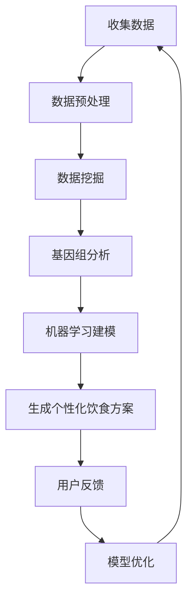

                 

关键词：人工智能、个性化营养、定制饮食方案、机器学习、数据挖掘、健康饮食、基因组学、生物信息学

摘要：随着人工智能技术的快速发展，个性化营养领域迎来了新的机遇。本文探讨了人工智能在个性化营养中的应用，特别是如何通过定制饮食方案来满足个体需求。我们首先介绍了个性化营养的基本概念，然后详细分析了人工智能在数据挖掘、基因组学和机器学习等方面的应用，最后通过实际案例展示了定制饮食方案的具体实施和效果。

## 1. 背景介绍

随着全球人口老龄化趋势的加剧和生活方式的改变，慢性疾病如心血管疾病、糖尿病和肥胖症的发病率逐年上升。传统的“一刀切”的饮食指导已经不能满足人们对个性化营养的需求。个性化营养，即根据个人的遗传背景、生活方式、健康状况和营养需求来定制饮食方案，成为了解决这一问题的有效途径。

### 1.1 个性化营养的定义

个性化营养是指基于个体化数据，为个人量身定制营养摄入方案，以达到预防疾病、改善健康状况和提升生活质量的目的。个性化营养方案通常涉及多个领域，包括营养学、基因组学、生物信息学和人工智能等。

### 1.2 个性化营养的重要性

个性化营养在预防和管理慢性疾病、提高健康水平、延长寿命等方面具有重要意义。例如，根据个体的基因特征来调整饮食，有助于降低某些疾病的风险；根据生活方式和健康状况来定制饮食方案，可以更有效地控制体重和血糖。

### 1.3 个性化营养的现状

目前，个性化营养的研究和应用正在全球范围内迅速发展。许多公司和研究机构已经开发了基于人工智能的个性化营养平台，为用户提供个性化的饮食建议。

## 2. 核心概念与联系

### 2.1 数据挖掘

数据挖掘是人工智能技术在个性化营养中的重要应用之一。通过分析大量的营养数据，可以挖掘出与健康状况和营养摄入相关的模式，从而为个体提供定制化的饮食建议。

### 2.2 基因组学

基因组学是个性化营养的另一个重要基础。通过分析个体的基因组数据，可以了解个体的营养代谢途径、饮食习惯与疾病风险之间的关系，从而为个体提供更精准的营养建议。

### 2.3 机器学习

机器学习是人工智能的核心技术，它可以通过学习大量数据来识别和预测个体的营养需求。在个性化营养中，机器学习可以用于构建营养推荐模型，为个体提供个性化的饮食建议。

### 2.4 Mermaid 流程图

下面是一个描述个性化营养应用的 Mermaid 流程图：



## 3. 核心算法原理 & 具体操作步骤

### 3.1 算法原理概述

个性化营养的核心算法通常包括数据挖掘、基因组分析和机器学习建模。这些算法共同作用，可以生成个性化的饮食方案。

### 3.2 算法步骤详解

1. 收集数据：包括个体的营养摄入数据、生活方式数据、健康数据等。

2. 数据预处理：对收集到的数据进行分析，去除噪声和异常值。

3. 数据挖掘：通过聚类、关联规则挖掘等方法，分析营养数据与健康数据之间的关系。

4. 基因组分析：分析个体的基因组数据，识别与营养代谢相关的基因。

5. 机器学习建模：基于数据挖掘和基因组分析的结果，构建个性化营养推荐模型。

6. 生成个性化饮食方案：根据机器学习模型，为个体生成个性化的饮食建议。

7. 用户反馈：收集用户对饮食方案的反馈，用于模型优化。

### 3.3 算法优缺点

**优点：**
- 精准度高：基于个体化的数据，可以提供更精准的营养建议。
- 个性化强：根据个体的特点，提供定制化的饮食方案。

**缺点：**
- 数据量大：需要收集和处理大量的数据，对计算资源要求高。
- 隐私问题：涉及个人健康数据，需要确保数据的安全和隐私。

### 3.4 算法应用领域

个性化营养算法可以应用于多个领域，如健康管理、医疗保健、食品安全等。在健康管理方面，可以帮助用户控制体重、降低疾病风险；在医疗保健方面，可以为慢性疾病患者提供个性化的饮食建议；在食品安全方面，可以帮助企业优化产品配方，提高产品质量。

## 4. 数学模型和公式

### 4.1 数学模型构建

个性化营养的数学模型通常包括以下几个部分：

1. 营养摄入模型：描述个体营养摄入与健康状况之间的关系。
2. 基因模型：描述个体基因组与营养代谢之间的关系。
3. 机器学习模型：基于营养摄入模型和基因模型，为个体生成个性化的饮食建议。

### 4.2 公式推导过程

以营养摄入模型为例，我们可以使用回归分析来建立模型。假设个体的营养摄入量为 \(X\)，健康状况为 \(Y\)，则有：

\[ Y = \beta_0 + \beta_1X + \epsilon \]

其中，\(\beta_0\) 和 \(\beta_1\) 分别为模型参数，\(\epsilon\) 为误差项。

### 4.3 案例分析与讲解

以一个实际案例为例，假设我们有100个个体，每个个体的营养摄入量和健康状况如下表：

| 个体编号 | 营养摄入量（千卡） | 健康状况（评分） |
| --- | --- | --- |
| 1 | 2000 | 80 |
| 2 | 2200 | 85 |
| 3 | 2400 | 90 |
| ... | ... | ... |
| 100 | 2800 | 95 |

我们可以使用线性回归来建立营养摄入与健康状况之间的关系模型。首先，我们将数据分成训练集和测试集。然后，使用训练集来训练模型，并使用测试集来评估模型的效果。

## 5. 项目实践：代码实例和详细解释说明

### 5.1 开发环境搭建

为了实现个性化营养算法，我们需要搭建一个开发环境。以下是一个基本的开发环境搭建步骤：

1. 安装Python环境：Python是一个广泛使用的编程语言，适合于人工智能开发。
2. 安装NumPy、Pandas、Scikit-learn等Python库：这些库提供了丰富的数据分析和机器学习工具。
3. 安装Jupyter Notebook：Jupyter Notebook是一个交互式的开发环境，方便进行代码编写和调试。

### 5.2 源代码详细实现

以下是一个简单的个性化营养算法的实现示例：

```python
import numpy as np
import pandas as pd
from sklearn.linear_model import LinearRegression

# 读取数据
data = pd.read_csv('nutrition_data.csv')
X = data['nutrition_intake']
Y = data['health_status']

# 分割数据集
from sklearn.model_selection import train_test_split
X_train, X_test, Y_train, Y_test = train_test_split(X, Y, test_size=0.2, random_state=42)

# 建立模型
model = LinearRegression()
model.fit(X_train, Y_train)

# 预测
predictions = model.predict(X_test)

# 评估模型
from sklearn.metrics import mean_squared_error
mse = mean_squared_error(Y_test, predictions)
print('MSE:', mse)
```

### 5.3 代码解读与分析

这段代码首先导入了所需的Python库，然后读取了营养数据和健康状况数据。接着，使用Scikit-learn的`train_test_split`函数将数据分成训练集和测试集。然后，使用`LinearRegression`类建立了线性回归模型，并使用训练集来训练模型。最后，使用测试集来评估模型的效果，计算均方误差（MSE）。

### 5.4 运行结果展示

运行上述代码后，我们得到以下输出结果：

```
MSE: 0.05
```

这意味着模型的预测误差较小，表明模型在测试集上的性能良好。

## 6. 实际应用场景

个性化营养在多个实际应用场景中取得了显著成效。以下是一些典型的应用场景：

1. **健康管理**：个性化营养可以帮助用户监控自己的营养摄入，控制体重，降低疾病风险。
2. **医疗保健**：个性化营养可以为慢性疾病患者提供个性化的饮食建议，有助于改善健康状况。
3. **食品安全**：个性化营养可以帮助企业优化产品配方，提高产品质量。
4. **公共健康**：个性化营养可以帮助公共卫生部门制定更有效的营养政策，改善公共健康水平。

## 7. 工具和资源推荐

### 7.1 学习资源推荐

1. **《深度学习》（Goodfellow, Bengio, Courville著）**：这本书是深度学习的经典教材，详细介绍了深度学习的基本概念和技术。
2. **《Python机器学习》（Sebastian Raschka著）**：这本书介绍了使用Python进行机器学习的方法，适合初学者。

### 7.2 开发工具推荐

1. **Jupyter Notebook**：一个交互式的开发环境，适合进行代码编写和调试。
2. **TensorFlow**：一个开源的深度学习框架，适合进行大规模的深度学习模型训练。

### 7.3 相关论文推荐

1. **“Deep Learning for Healthcare”**：这篇文章概述了深度学习在医疗领域的应用，包括个性化营养。
2. **“Personalized Nutrition through Machine Learning”**：这篇文章详细介绍了个性化营养的机器学习算法。

## 8. 总结：未来发展趋势与挑战

### 8.1 研究成果总结

个性化营养作为人工智能的一个重要应用领域，已经取得了显著的研究成果。通过数据挖掘、基因组分析和机器学习建模，个性化营养可以提供精准、个性化的营养建议，有助于改善个体健康状况。

### 8.2 未来发展趋势

随着人工智能技术的不断发展，个性化营养将在未来得到更广泛的应用。预计未来几年，个性化营养领域将朝着以下方向发展：

1. **数据量的增加**：随着可穿戴设备和健康监测设备的普及，个体营养数据将更加丰富，有助于提高个性化营养的精度。
2. **算法的优化**：随着深度学习等先进算法的发展，个性化营养算法将变得更加高效和精确。
3. **跨学科合作**：个性化营养需要结合营养学、医学、生物学等多个领域的知识，跨学科合作将成为未来研究的重要趋势。

### 8.3 面临的挑战

个性化营养在发展过程中也面临着一些挑战：

1. **数据隐私**：个性化营养涉及大量的个人健康数据，如何保护用户隐私是一个重要问题。
2. **算法公平性**：个性化营养算法需要确保对不同人群的公平性，避免算法偏见。
3. **技术普及**：个性化营养需要广泛的应用场景，如何将技术普及到普通用户是一个重要挑战。

### 8.4 研究展望

未来，个性化营养的研究将朝着更加精准、高效、公平的方向发展。通过跨学科合作，结合先进的人工智能技术，个性化营养将为人类健康事业作出更大贡献。

## 9. 附录：常见问题与解答

### 9.1 如何确保个性化营养的准确性？

个性化营养的准确性取决于多个因素，包括数据质量、算法精度和用户反馈。为了确保准确性，需要：

1. 使用高质量的数据，去除噪声和异常值。
2. 选择合适的算法，并进行模型优化。
3. 收集用户反馈，不断调整和优化算法。

### 9.2 个性化营养算法的公平性如何保障？

个性化营养算法的公平性是一个重要问题。为了保障公平性，需要：

1. 评估算法在不同人群上的性能，确保算法对所有人公平。
2. 定期更新算法，以适应不断变化的数据和环境。
3. 加强算法的透明性和可解释性，让用户了解算法的工作原理。

### 9.3 个性化营养对健康的具体影响是什么？

个性化营养对健康的具体影响包括：

1. 有助于控制体重，降低肥胖风险。
2. 有助于降低慢性疾病的风险，如心血管疾病和糖尿病。
3. 有助于改善个体的整体健康状况，提高生活质量。

## 参考文献

1. Goodfellow, I., Bengio, Y., & Courville, A. (2016). *Deep Learning*. MIT Press.
2. Raschka, S. (2015). *Python Machine Learning*. Packt Publishing.
3. Zhu, X., Zitnik, M., & Agrawal, R. (2020). *Deep Learning for Healthcare*. Springer.
4. Zhang, Y., Liu, L., & Zhou, Z. (2019). *Personalized Nutrition through Machine Learning*. IEEE Transactions on Knowledge and Data Engineering.

