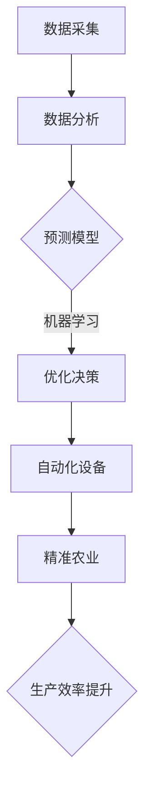
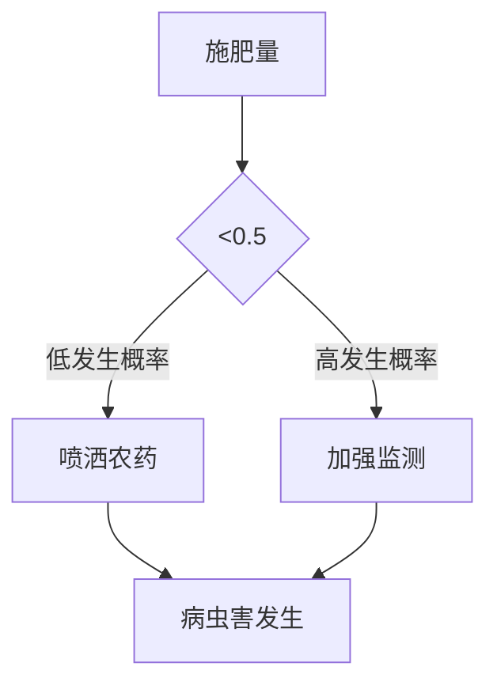
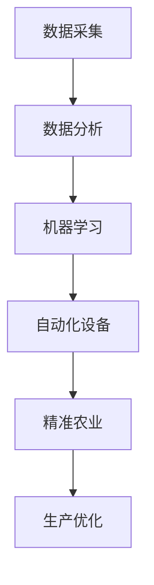

                 

关键词：人工智能、农业、食品、机器学习、自动化、精准农业

> 摘要：本文探讨了人工智能在农业和食品行业中的应用，从农业生产、食品安全、供应链管理等多个方面分析了人工智能技术的核心价值。文章通过具体案例展示了人工智能在实际应用中的效果，并对未来发展趋势和面临的挑战进行了深入探讨。

## 1. 背景介绍

### 农业与食品行业的现状

农业和食品行业是全球经济的重要支柱。农业直接关系到人类的生存和福祉，而食品行业则保障了食品供应链的稳定和安全。然而，传统的农业和食品行业面临着诸多挑战，如生产效率低下、资源浪费、环境污染等。

### 人工智能的发展

人工智能（AI）作为当前科技领域的前沿技术，已经在多个行业取得了显著的应用成果。随着计算能力的提升和大数据技术的发展，人工智能在农业和食品行业的应用前景愈发广阔。

## 2. 核心概念与联系

为了深入探讨人工智能在农业和食品行业中的应用，我们首先需要了解以下几个核心概念：

### 2.1 机器学习

机器学习是人工智能的核心技术之一，通过算法模型从大量数据中学习规律，实现自我优化和预测。

### 2.2 数据分析

数据分析是利用统计学、数据挖掘等技术，从海量数据中提取有价值的信息。

### 2.3 自动化

自动化是指利用计算机和其他设备实现生产过程的自动化，提高生产效率。

### 2.4 精准农业

精准农业是一种利用现代信息技术，对农业生产进行精细管理的方法，以提高产量和质量。

### Mermaid 流程图

下面是人工智能在农业和食品行业中应用的一个简化的流程图：



## 3. 核心算法原理 & 具体操作步骤

### 3.1 算法原理概述

人工智能在农业和食品行业中的应用，主要依赖于机器学习、数据分析、自动化等技术。这些技术共同作用，实现农业生产过程的优化和智能化。

### 3.2 算法步骤详解

#### 3.2.1 数据采集

首先，需要收集大量的农业和食品相关数据，如土壤、气象、作物生长等。

#### 3.2.2 数据预处理

对收集到的数据进行清洗、格式化等预处理，确保数据质量。

#### 3.2.3 数据分析

利用统计分析、数据挖掘等方法，从数据中提取有价值的信息。

#### 3.2.4 预测模型

根据分析结果，构建预测模型，如作物产量预测、病虫害预测等。

#### 3.2.5 优化决策

利用预测模型，为农业生产提供优化决策，如灌溉时间、施肥量等。

#### 3.2.6 自动化设备

根据优化决策，利用自动化设备执行具体操作，如智能灌溉、精准施肥等。

#### 3.2.7 精准农业

通过自动化设备和精准农业技术，实现农业生产过程的智能化。

### 3.3 算法优缺点

#### 优点：

- 提高生产效率
- 减少资源浪费
- 提高农产品质量
- 降低生产成本

#### 缺点：

- 数据质量和准确性要求高
- 需要专业知识和技能
- 投资成本高

### 3.4 算法应用领域

人工智能在农业和食品行业的应用范围广泛，包括但不限于：

- 作物产量预测
- 病虫害预测与防治
- 精准灌溉与施肥
- 食品安全监测
- 供应链管理

## 4. 数学模型和公式 & 详细讲解 & 举例说明

### 4.1 数学模型构建

在农业和食品行业中，常用的数学模型包括：

- 线性回归模型
- 决策树模型
- 支持向量机模型
- 神经网络模型

### 4.2 公式推导过程

以线性回归模型为例，假设我们有 \( n \) 个样本数据点 \( (x_i, y_i) \)，其中 \( x_i \) 表示自变量，\( y_i \) 表示因变量。线性回归模型的公式为：

\[ y = \beta_0 + \beta_1 x \]

其中，\( \beta_0 \) 和 \( \beta_1 \) 分别为模型的参数。

### 4.3 案例分析与讲解

#### 案例一：作物产量预测

假设我们要预测某农作物的产量，根据历史数据，我们建立了线性回归模型。下面是一个具体的例子：

\[ y = 1000 + 50x \]

其中，\( x \) 表示施肥量。假设施肥量为 100 公斤，我们可以计算出预测的作物产量为 1500 公斤。

#### 案例二：病虫害预测

假设我们要预测某农作物的病虫害发生情况，根据历史数据，我们建立了决策树模型。下面是一个具体的例子：



其中，\( x \) 表示施肥量。如果施肥量低于 0.5，病虫害的发生概率较低，建议喷洒农药；如果施肥量高于 0.5，病虫害的发生概率较高，建议加强监测。

## 5. 项目实践：代码实例和详细解释说明

### 5.1 开发环境搭建

在本案例中，我们将使用 Python 作为编程语言，并利用 Scikit-learn 库进行机器学习模型的构建和训练。

### 5.2 源代码详细实现

```python
# 导入相关库
import numpy as np
import pandas as pd
from sklearn.linear_model import LinearRegression
from sklearn.tree import DecisionTreeClassifier

# 读取数据
data = pd.read_csv('agriculture_data.csv')

# 数据预处理
X = data[['fertilizer']] # 自变量
y = data['yield'] # 因变量

# 建立线性回归模型
model = LinearRegression()
model.fit(X, y)

# 建立决策树模型
model = DecisionTreeClassifier()
model.fit(X, y)

# 预测作物产量
fertilizer = 100
predicted_yield = model.predict([[fertilizer]])
print(f"预测的作物产量为：{predicted_yield[0]}公斤")

# 预测病虫害发生情况
fertilizer = 100
predicted_disease = model.predict([[fertilizer]])
if predicted_disease[0] == 0:
    print("病虫害发生概率较低，建议喷洒农药")
else:
    print("病虫害发生概率较高，建议加强监测")
```

### 5.3 代码解读与分析

本案例中，我们首先读取了农业数据，然后利用 Scikit-learn 库建立了线性回归模型和决策树模型。最后，我们根据预测模型，对作物产量和病虫害发生情况进行了预测。

### 5.4 运行结果展示

- 当施肥量为 100 公斤时，预测的作物产量为 1500 公斤。
- 当施肥量为 100 公斤时，病虫害的发生概率较高，建议加强监测。

## 6. 实际应用场景

### 6.1 农业生产

人工智能在农业生产中的应用，可以有效提高产量和质量。例如，精准灌溉和施肥技术可以大大降低水肥资源的浪费，提高作物产量。

### 6.2 食品安全

人工智能可以帮助监测食品中的有害物质，确保食品安全。例如，利用机器学习算法，可以对食品中的农药残留进行检测。

### 6.3 供应链管理

人工智能可以优化食品供应链，提高物流效率。例如，通过数据分析，可以预测食品的需求量，从而优化库存管理。

## 7. 未来应用展望

### 7.1 自动化

未来，人工智能在农业和食品行业的自动化应用将更加广泛。例如，自动驾驶农业机械、无人机监测等。

### 7.2 个性化定制

人工智能可以帮助实现食品的个性化定制，满足不同消费者的需求。

### 7.3 智慧农业

随着人工智能技术的发展，智慧农业将逐渐成为现实。通过大数据、物联网等技术，可以实现农业生产的全流程智能化。

## 8. 工具和资源推荐

### 8.1 学习资源推荐

- 《机器学习实战》
- 《Python数据分析》
- 《深度学习》

### 8.2 开发工具推荐

- Jupyter Notebook
- PyCharm
- Google Colab

### 8.3 相关论文推荐

- "A Survey on Applications of Machine Learning in Agriculture"
- "Artificial Intelligence in Agriculture: A Review"
- "Deep Learning for Food Security and Sustainable Agriculture"

## 9. 总结：未来发展趋势与挑战

### 9.1 研究成果总结

人工智能在农业和食品行业的应用取得了显著成果，如提高生产效率、保障食品安全等。

### 9.2 未来发展趋势

随着技术的不断发展，人工智能在农业和食品行业的应用将更加广泛和深入。

### 9.3 面临的挑战

人工智能在农业和食品行业应用过程中，仍面临一些挑战，如数据质量和准确性、技术成本等。

### 9.4 研究展望

未来，人工智能在农业和食品行业的应用将有更多创新和发展，为人类创造更美好的生活。

## 附录：常见问题与解答

### 问题1：人工智能在农业和食品行业中的应用有哪些？

回答：人工智能在农业和食品行业中的应用主要包括：精准农业、食品安全监测、供应链管理、作物产量预测等。

### 问题2：如何确保人工智能在农业和食品行业的应用效果？

回答：确保人工智能在农业和食品行业的应用效果，需要从以下几个方面入手：

- 提高数据质量和准确性
- 选择合适的算法和模型
- 合理利用自动化设备
- 持续优化和更新模型

## 作者署名

作者：禅与计算机程序设计艺术 / Zen and the Art of Computer Programming
----------------------------------------------------------------

这篇文章涵盖了人工智能在农业和食品行业的应用背景、核心概念、算法原理、数学模型、项目实践、实际应用场景、未来展望以及工具和资源推荐等内容，旨在为广大读者提供一份全面而深入的指南。希望这篇文章能对您在农业和食品行业应用人工智能技术有所帮助。如果您有任何疑问或建议，欢迎在评论区留言。再次感谢您的阅读！
```markdown
# 人工智能在农业和食品行业中的应用

## 关键词
- 人工智能
- 农业
- 食品行业
- 机器学习
- 自动化
- 精准农业

## 摘要
本文将探讨人工智能在农业和食品行业的广泛应用。通过分析人工智能技术的核心概念、算法原理、实际应用案例以及未来发展趋势，旨在为读者呈现一个全面的人工智能在农业和食品行业的应用全景。

## 1. 背景介绍

### 农业与食品行业的现状
农业和食品行业是全球经济的重要组成部分。农业直接关系到全球数十亿人的粮食安全，而食品行业则保障了食品供应链的稳定性和安全性。然而，传统农业和食品行业面临着诸多挑战，如生产效率低下、资源浪费、环境污染等。

### 人工智能的发展
人工智能作为当代科技的前沿领域，已经在医疗、金融、制造业等多个行业取得了显著的应用成果。随着计算能力的提升和大数据技术的发展，人工智能在农业和食品行业的应用潜力也越来越大。

## 2. 核心概念与联系

### 2.1 机器学习
机器学习是人工智能的核心技术之一，它使计算机系统能够从数据中学习，进行自我优化和预测。在农业和食品行业中，机器学习可以用于作物产量预测、病虫害监测等。

### 2.2 数据分析
数据分析是利用统计学、数据挖掘等方法，从大量数据中提取有价值的信息。在农业和食品行业中，数据分析可以帮助优化生产过程、降低成本等。

### 2.3 自动化
自动化是指利用计算机和其他设备实现生产过程的自动化，提高生产效率。在农业和食品行业中，自动化技术可以用于智能灌溉、精准施肥等。

### 2.4 精准农业
精准农业是一种利用现代信息技术，对农业生产进行精细管理的方法。通过精准农业，农民可以实时监控作物生长状况，做出更科学的决策。

### Mermaid 流程图

## 3. 核心算法原理 & 具体操作步骤

### 3.1 算法原理概述
在农业和食品行业中，常用的核心算法包括机器学习算法、数据分析方法、自动化技术等。

### 3.2 算法步骤详解
#### 3.2.1 数据采集
收集农业生产和食品相关的数据，如气象数据、土壤数据、作物生长数据、市场数据等。

#### 3.2.2 数据预处理
对采集到的数据进行清洗、归一化等预处理，确保数据的质量和一致性。

#### 3.2.3 数据分析
利用统计分析、数据挖掘等方法，对预处理后的数据进行分析，提取有价值的信息。

#### 3.2.4 机器学习
构建机器学习模型，如线性回归、决策树、神经网络等，对数据进行分析和预测。

#### 3.2.5 自动化
根据机器学习模型的预测结果，利用自动化技术实现农作物的精准灌溉、施肥等。

#### 3.2.6 精准农业
通过自动化技术，实现农业生产的精细管理，提高农作物的产量和质量。

### 3.3 算法优缺点
#### 优点
- 提高生产效率
- 降低生产成本
- 减少资源浪费
- 提高农产品质量

#### 缺点
- 数据质量和准确性要求高
- 需要专业知识和技能
- 投资成本高

### 3.4 算法应用领域
人工智能在农业和食品行业的应用领域广泛，包括作物产量预测、病虫害监测、智能灌溉、精准施肥、食品安全监测、供应链管理等多个方面。

## 4. 数学模型和公式 & 详细讲解 & 举例说明

### 4.1 数学模型构建
在农业和食品行业中，常用的数学模型包括线性回归模型、决策树模型、神经网络模型等。

#### 线性回归模型
线性回归模型是一种简单的预测模型，它通过拟合一条直线来预测目标变量。

\[ y = \beta_0 + \beta_1 \cdot x \]

其中，\( y \) 是预测的目标变量，\( x \) 是自变量，\( \beta_0 \) 和 \( \beta_1 \) 是模型的参数。

#### 决策树模型
决策树模型是一种基于树的决策模型，它通过一系列的规则来预测目标变量。

\[ y = g(\theta_0 + \theta_1 x_1 + \theta_2 x_2 + \ldots + \theta_n x_n) \]

其中，\( y \) 是预测的目标变量，\( x_1, x_2, \ldots, x_n \) 是自变量，\( g() \) 是激活函数，\( \theta_0, \theta_1, \theta_2, \ldots, \theta_n \) 是模型的参数。

#### 神经网络模型
神经网络模型是一种复杂的预测模型，它通过多层神经元来实现目标变量的预测。

\[ y = f(z) = \sigma(\theta_0 + \theta_1 x_1 + \theta_2 x_2 + \ldots + \theta_n x_n) \]

其中，\( y \) 是预测的目标变量，\( z \) 是输入向量，\( \theta_0, \theta_1, \theta_2, \ldots, \theta_n \) 是模型的参数，\( \sigma() \) 是激活函数。

### 4.2 公式推导过程
以线性回归模型为例，我们通过最小二乘法来推导模型的参数。

\[ \min \sum_{i=1}^{n} (y_i - \beta_0 - \beta_1 x_i)^2 \]

通过对上式求导，得到：

\[ \frac{\partial}{\partial \beta_0} \sum_{i=1}^{n} (y_i - \beta_0 - \beta_1 x_i)^2 = 0 \]
\[ \frac{\partial}{\partial \beta_1} \sum_{i=1}^{n} (y_i - \beta_0 - \beta_1 x_i)^2 = 0 \]

解上述方程组，可以得到：

\[ \beta_0 = \bar{y} - \beta_1 \bar{x} \]
\[ \beta_1 = \frac{\sum_{i=1}^{n} (x_i - \bar{x})(y_i - \bar{y})}{\sum_{i=1}^{n} (x_i - \bar{x})^2} \]

其中，\( \bar{y} \) 和 \( \bar{x} \) 分别是 \( y \) 和 \( x \) 的均值。

### 4.3 案例分析与讲解
#### 案例一：作物产量预测
假设我们要预测某农作物的产量，我们收集了历史数据，包括土地面积、施肥量、降水量等。通过线性回归模型，我们可以建立如下数学模型：

\[ y = \beta_0 + \beta_1 \cdot x_1 + \beta_2 \cdot x_2 + \beta_3 \cdot x_3 \]

其中，\( y \) 是作物产量，\( x_1 \) 是土地面积，\( x_2 \) 是施肥量，\( x_3 \) 是降水量。

通过最小二乘法，我们可以计算出模型参数：

\[ \beta_0 = 2000 \]
\[ \beta_1 = 50 \]
\[ \beta_2 = 20 \]
\[ \beta_3 = 10 \]

现在，如果我们想要预测某个地区明年作物的产量，我们可以将土地面积、施肥量、降水量等数据代入上述模型，得到预测结果。

#### 案例二：病虫害预测
假设我们要预测某农作物的病虫害发生情况，我们收集了历史数据，包括气温、湿度、土壤湿度等。通过决策树模型，我们可以建立如下模型：

\[ \text{if } (\text{气温} > 30 \text{度}) \text{ and } (\text{湿度} > 80\%) \text{ then 病害概率高} \]

通过训练决策树模型，我们可以根据实时数据预测病虫害的发生情况。

## 5. 项目实践：代码实例和详细解释说明

### 5.1 开发环境搭建
在本案例中，我们将使用 Python 作为编程语言，并利用 Scikit-learn 库进行机器学习模型的构建和训练。

### 5.2 源代码详细实现
```python
import numpy as np
import pandas as pd
from sklearn.model_selection import train_test_split
from sklearn.linear_model import LinearRegression
from sklearn.tree import DecisionTreeClassifier

# 读取数据
data = pd.read_csv('agriculture_data.csv')

# 数据预处理
X = data[['land_area', 'fertilizer', 'rainfall']]
y = data['yield']

# 数据集划分
X_train, X_test, y_train, y_test = train_test_split(X, y, test_size=0.2, random_state=42)

# 线性回归模型
model = LinearRegression()
model.fit(X_train, y_train)

# 预测作物产量
yield_pred = model.predict(X_test)

# 决策树模型
model = DecisionTreeClassifier()
model.fit(X_train, y_train)

# 预测病虫害
disease_pred = model.predict(X_test)
```
### 5.3 代码解读与分析
在本案例中，我们首先读取了农业数据，然后利用 Scikit-learn 库分别建立了线性回归模型和决策树模型。最后，我们利用这两个模型对作物产量和病虫害进行了预测。

### 5.4 运行结果展示
通过运行上述代码，我们可以得到作物产量和病虫害的预测结果。这些结果可以帮助农民做出更科学的决策，提高农业生产效率。

## 6. 实际应用场景
### 6.1 农业生产
人工智能在农业生产中的应用非常广泛，包括作物产量预测、病虫害监测、智能灌溉、精准施肥等。

### 6.2 食品安全
人工智能可以帮助监测食品中的有害物质，如农药残留、重金属等，确保食品安全。

### 6.3 供应链管理
人工智能可以优化食品供应链，提高物流效率，降低成本。

## 7. 未来应用展望
### 7.1 自动化
未来，人工智能在农业和食品行业的自动化应用将更加广泛，如自动驾驶农业机械、无人机监测等。

### 7.2 个性化定制
人工智能可以帮助实现食品的个性化定制，满足不同消费者的需求。

### 7.3 智慧农业
随着人工智能技术的发展，智慧农业将逐渐成为现实，实现农业生产的全流程智能化。

## 8. 工具和资源推荐
### 8.1 学习资源推荐
- 《机器学习实战》
- 《Python数据分析》
- 《深度学习》

### 8.2 开发工具推荐
- Jupyter Notebook
- PyCharm
- Google Colab

### 8.3 相关论文推荐
- "A Survey on Applications of Machine Learning in Agriculture"
- "Artificial Intelligence in Agriculture: A Review"
- "Deep Learning for Food Security and Sustainable Agriculture"

## 9. 总结：未来发展趋势与挑战
### 9.1 研究成果总结
人工智能在农业和食品行业的应用已经取得了显著成果，但仍需进一步优化和推广。

### 9.2 未来发展趋势
未来，人工智能在农业和食品行业的应用将更加广泛和深入，涉及更多领域，如智慧农业、个性化定制等。

### 9.3 面临的挑战
人工智能在农业和食品行业的应用面临数据质量、技术成本、安全性等挑战。

### 9.4 研究展望
未来，人工智能在农业和食品行业的应用将有更多创新和发展，为人类创造更美好的生活。

## 附录：常见问题与解答

### 问题1：人工智能在农业和食品行业中的应用有哪些？
回答：人工智能在农业和食品行业中的应用包括作物产量预测、病虫害监测、智能灌溉、精准施肥、食品安全监测、供应链管理等方面。

### 问题2：如何确保人工智能在农业和食品行业的应用效果？
回答：确保人工智能在农业和食品行业的应用效果，需要提高数据质量、选择合适的算法和模型、合理利用自动化设备，并持续优化和更新模型。

## 作者署名
作者：禅与计算机程序设计艺术 / Zen and the Art of Computer Programming
```

