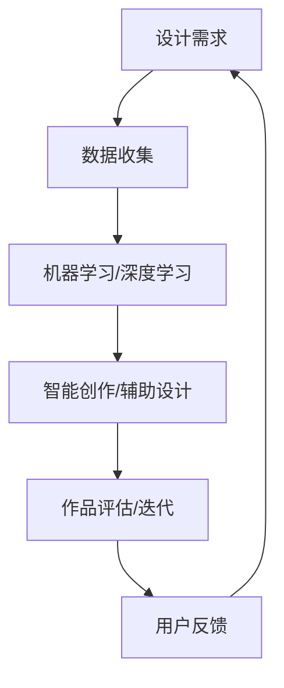

                 

关键词：人工智能、创意产业、设计辅助、智能创作、算法、数学模型

> 摘要：本文探讨了人工智能在创意产业中的应用，尤其是辅助设计与创作方面的创新。通过分析核心概念、算法原理、数学模型以及项目实践，本文旨在为设计师、艺术家和软件开发者提供有价值的参考和启示，推动人工智能与创意产业的深度融合。

## 1. 背景介绍

随着科技的飞速发展，人工智能（AI）在各个领域的应用日益广泛。从最初的机器学习到深度学习，再到如今的大数据和智能算法，AI 技术不断突破，为人类创造了前所未有的便利。在创意产业中，人工智能的应用尤为显著，它不仅改变了传统的创作方式，还为设计师、艺术家等创意从业者提供了强大的辅助工具。

创意产业涵盖了设计、艺术、音乐、电影等多个领域，具有高度个性化、多样化、创新性等特点。然而，创意工作往往需要大量的时间和精力，而且受限于个人的经验和技能。人工智能的介入，使得这些挑战得以缓解。例如，通过机器学习和深度学习算法，AI 可以分析大量的设计作品，从中提取规律和风格，为设计师提供灵感；通过自然语言处理和计算机视觉技术，AI 可以生成全新的音乐、绘画和摄影作品。

本文将从以下几个方面展开讨论：

1. 核心概念与联系
2. 核心算法原理与具体操作步骤
3. 数学模型与公式
4. 项目实践：代码实例与详细解释
5. 实际应用场景
6. 未来应用展望
7. 工具和资源推荐
8. 总结：未来发展趋势与挑战

希望通过本文的讨论，能够为人工智能在创意产业中的应用提供一些有价值的思考和实践指导。

## 2. 核心概念与联系

### 2.1 设计与创作的定义

设计（Design）是一种有目的的创作活动，旨在通过规划和实施过程，将抽象的概念转化为具体的有形产品或服务。设计不仅关注产品的外观和功能，还涉及到用户体验、品牌价值等多个方面。创作（Creation）则是一种更为广泛的概念，它包括了艺术、音乐、文学等多种形式，是一种将个人情感、思想和审美表达为具体作品的过程。

### 2.2 人工智能在创意产业中的应用

人工智能在创意产业中的应用主要分为以下几个方面：

- **设计辅助**：通过机器学习算法，AI 可以分析大量设计作品，为设计师提供风格参考、颜色搭配建议等。
- **智能创作**：利用深度学习技术，AI 可以自动生成音乐、绘画、摄影等作品，甚至模仿名家的风格。
- **个性化推荐**：基于用户的偏好和行为数据，AI 可以推荐符合用户口味的设计作品、音乐、电影等。
- **虚拟现实与增强现实**：通过计算机视觉和图像处理技术，AI 可以创造逼真的虚拟场景和增强现实体验。

### 2.3 关键技术与核心概念原理

- **机器学习（Machine Learning）**：一种让计算机通过数据学习并改进自身性能的技术。在设计中，机器学习可以用于风格识别、颜色分析等。
- **深度学习（Deep Learning）**：一种基于多层神经网络的学习方法，可以处理复杂的数据和任务。在创作中，深度学习可以用于图像生成、音乐创作等。
- **自然语言处理（Natural Language Processing，NLP）**：一种让计算机理解和生成人类语言的技术。在创意产业中，NLP 可以用于文本分析、情感识别等。
- **计算机视觉（Computer Vision）**：一种让计算机理解和解释图像和视频的技术。在设计中，计算机视觉可以用于图像识别、图像编辑等。

### 2.4 Mermaid 流程图

以下是一个简化的 Mermaid 流程图，展示了人工智能在创意产业中的应用流程：



在这个流程中，设计需求是起点，通过数据收集、机器学习/深度学习、智能创作/辅助设计等环节，最终形成设计作品，并进行评估和迭代，形成一个闭环。

## 3. 核心算法原理与具体操作步骤

### 3.1 算法原理概述

人工智能在创意产业中的应用，离不开核心算法的支持。这些算法可以分为以下几类：

- **生成对抗网络（GAN）**：一种用于生成数据的强大算法，可以生成高质量、逼真的图像、音乐等。
- **卷积神经网络（CNN）**：一种用于图像处理和识别的神经网络，可以用于图像生成、风格迁移等。
- **长短期记忆网络（LSTM）**：一种用于处理序列数据的神经网络，可以用于音乐生成、文本分析等。
- **变分自编码器（VAE）**：一种用于生成数据的自编码器，可以生成多样化的图像、音乐等。

### 3.2 算法步骤详解

以下是上述算法的具体步骤详解：

#### 3.2.1 生成对抗网络（GAN）

1. **数据准备**：收集大量设计作品、音乐、文本等数据，用于训练。
2. **生成器（Generator）**：通过神经网络结构，生成新的设计作品、音乐等。
3. **判别器（Discriminator）**：判断生成的作品是否真实。
4. **对抗训练**：通过不断调整生成器和判别器的参数，使得生成器生成的作品越来越逼真。
5. **生成结果**：将训练好的生成器应用于实际创作，生成新的设计作品、音乐等。

#### 3.2.2 卷积神经网络（CNN）

1. **数据预处理**：对图像数据进行归一化、数据增强等处理。
2. **网络结构设计**：设计卷积层、池化层、全连接层等网络结构。
3. **训练**：使用大量图像数据，通过反向传播算法，训练网络参数。
4. **图像生成**：使用训练好的网络，对图像数据进行处理，生成新的图像。
5. **图像编辑**：通过调整网络参数，对生成图像进行编辑，实现风格迁移、图像修复等功能。

#### 3.2.3 长短期记忆网络（LSTM）

1. **数据准备**：收集音乐数据，进行特征提取。
2. **网络结构设计**：设计包含 LSTM 层的神经网络结构。
3. **训练**：使用音乐数据，通过反向传播算法，训练网络参数。
4. **音乐生成**：使用训练好的网络，生成新的音乐片段。
5. **音乐编辑**：通过调整网络参数，对生成音乐进行编辑，实现风格转换、节奏调整等功能。

### 3.3 算法优缺点

- **生成对抗网络（GAN）**：

  - **优点**：生成作品质量高，能够处理多样化的数据。
  - **缺点**：训练过程复杂，容易出现模式崩溃等问题。

- **卷积神经网络（CNN）**：

  - **优点**：在图像处理领域表现优异，适用于图像生成、编辑等任务。
  - **缺点**：在处理序列数据时效果较差。

- **长短期记忆网络（LSTM）**：

  - **优点**：能够处理长序列数据，适用于音乐生成、文本分析等任务。
  - **缺点**：训练过程较慢，对数据量要求较高。

### 3.4 算法应用领域

- **生成对抗网络（GAN）**：广泛应用于图像生成、音乐生成、视频生成等领域。
- **卷积神经网络（CNN）**：广泛应用于图像识别、图像生成、图像编辑等领域。
- **长短期记忆网络（LSTM）**：广泛应用于音乐生成、文本分析、语音识别等领域。

## 4. 数学模型和公式

### 4.1 数学模型构建

在人工智能应用于创意产业的过程中，数学模型是核心。以下是几个常用的数学模型：

- **损失函数（Loss Function）**：用于衡量模型的预测结果与真实结果之间的差距，常见的有均方误差（MSE）、交叉熵（Cross Entropy）等。
- **梯度下降（Gradient Descent）**：一种常用的优化算法，用于调整模型参数，以最小化损失函数。
- **卷积操作（Convolution）**：在图像处理中，用于提取图像的特征。

### 4.2 公式推导过程

以下是损失函数和梯度下降的公式推导：

#### 4.2.1 损失函数

假设我们有模型 $f(x)$，其中 $x$ 是输入，$y$ 是真实标签，$y'$ 是模型预测的标签。常见的损失函数有：

- 均方误差（MSE）：

  $$MSE = \frac{1}{n}\sum_{i=1}^{n}(y_i - y'_i)^2$$

- 交叉熵（Cross Entropy）：

  $$H(y, y') = -\sum_{i=1}^{n}y_i \log(y'_i)$$

#### 4.2.2 梯度下降

梯度下降是一种优化算法，用于更新模型参数。其基本思想是沿着损失函数的梯度方向，逐步调整参数，以最小化损失函数。

假设我们有损失函数 $L(\theta)$，其中 $\theta$ 是模型参数。梯度下降的公式为：

$$\theta = \theta - \alpha \frac{\partial L(\theta)}{\partial \theta}$$

其中，$\alpha$ 是学习率，$\frac{\partial L(\theta)}{\partial \theta}$ 是损失函数关于参数 $\theta$ 的梯度。

### 4.3 案例分析与讲解

以下是一个简单的案例，说明如何使用数学模型进行设计作品的辅助创作。

#### 4.3.1 案例背景

假设我们要使用生成对抗网络（GAN）生成一张新的设计作品，要求风格与某位知名设计师的作品相似。

#### 4.3.2 模型构建

- **生成器**：使用多层感知机（MLP）结构，输入为随机噪声，输出为设计作品。
- **判别器**：使用卷积神经网络（CNN）结构，输入为设计作品，输出为概率，表示作品的真假。

#### 4.3.3 模型训练

- **数据准备**：收集大量知名设计师的作品，用于训练生成器和判别器。
- **模型训练**：使用损失函数和梯度下降算法，不断调整生成器和判别器的参数，直至生成器生成的作品足够逼真。

#### 4.3.4 模型应用

- **生成作品**：将训练好的生成器应用于实际创作，生成新的设计作品。
- **作品评估**：使用判别器评估生成作品的逼真度，并进行迭代优化。

## 5. 项目实践：代码实例和详细解释说明

### 5.1 开发环境搭建

在进行项目实践之前，我们需要搭建一个合适的开发环境。以下是基本的步骤：

1. 安装 Python（3.6及以上版本）
2. 安装深度学习框架（如 TensorFlow、PyTorch）
3. 安装必要的库（如 NumPy、Pandas、Matplotlib）

在 Windows 系统中，可以使用 Python 的官方安装程序快速安装 Python 和相关库。在 Linux 系统中，可以使用包管理器（如 apt、yum）进行安装。

### 5.2 源代码详细实现

以下是一个使用 TensorFlow 实现的 GAN 模型的简单示例：

```python
import tensorflow as tf
from tensorflow.keras import layers

# 生成器模型
def generator_model():
    model = tf.keras.Sequential()
    model.add(layers.Dense(7 * 7 * 256, use_bias=False, input_shape=(100,)))
    model.add(layers.BatchNormalization())
    model.add(layers.LeakyReLU())
    model.add(layers.Reshape((7, 7, 256)))
    model.add(layers.Conv2DTranspose(128, (5, 5), strides=(1, 1), padding='same', use_bias=False))
    model.add(layers.BatchNormalization())
    model.add(layers.LeakyReLU())
    model.add(layers.Conv2DTranspose(64, (5, 5), strides=(2, 2), padding='same', use_bias=False))
    model.add(layers.BatchNormalization())
    model.add(layers.LeakyReLU())
    model.add(layers.Conv2DTranspose(1, (5, 5), strides=(2, 2), padding='same', use_bias=False, activation='tanh'))
    return model

# 判别器模型
def discriminator_model():
    model = tf.keras.Sequential()
    model.add(layers.Conv2D(64, (5, 5), strides=(2, 2), padding='same', input_shape=[28, 28, 1]))
    model.add(layers.LeakyReLU())
    model.add(layers.Dropout(0.3))
    model.add(layers.Conv2D(128, (5, 5), strides=(2, 2), padding='same'))
    model.add(layers.LeakyReLU())
    model.add(layers.Dropout(0.3))
    model.add(layers.Flatten())
    model.add(layers.Dense(1))
    return model

# GAN 模型
def gat_model():
    generator = generator_model()
    discriminator = discriminator_model()
    discriminator.trainable = False
    model = tf.keras.Sequential([
        generator,
        discriminator
    ])
    return model

# 模型编译
generator_optimizer = tf.keras.optimizers.Adam(1e-4)
discriminator_optimizer = tf.keras.optimizers.Adam(1e-4)
gan_model = gat_model()
gan_model.compile(loss='binary_crossentropy', optimizer=discriminator_optimizer, metrics=['accuracy'])

# 训练 GAN 模型
@tf.function
def train_step(images, noise):
    with tf.GradientTape() as gen_tape, tf.GradientTape() as disc_tape:
        generated_images = generator(noise, training=True)
        
        # 训练判别器
        disc_real_output = discriminator(images, training=True)
        disc_generated_output = discriminator(generated_images, training=True)
        
        gen_loss = tf.reduce_mean(tf.nn.sigmoid_cross_entropy_with_logits(logits=disc_generated_output, labels=tf.zeros_like(disc_generated_output))
        disc_loss = tf.reduce_mean(tf.nn.sigmoid_cross_entropy_with_logits(logits=disc_real_output, labels=tf.ones_like(disc_real_output)) + 
                                    tf.nn.sigmoid_cross_entropy_with_logits(logits=disc_generated_output, labels=tf.zeros_like(disc_generated_output)))
    
    grads = tape.gradient(disc_loss, discriminator.trainable_variables)
    discriminator_optimizer.apply_gradients(zip(grads, discriminator.trainable_variables))
    
    grads = tape.gradient(gen_loss, generator.trainable_variables)
    generator_optimizer.apply_gradients(zip(grads, generator.trainable_variables))
    
    return disc_loss, gen_loss

# 训练 GAN 模型
EPOCHS = 50
for epoch in range(EPOCHS):
    for image_batch in train_data:
        noise = tf.random.normal([BATCH_SIZE, 100])
        d_loss, g_loss = train_step(image_batch, noise)
        print(f"Epoch {epoch}/{EPOCHS}, D Loss: {d_loss:.4f}, G Loss: {g_loss:.4f}")
```

### 5.3 代码解读与分析

以上代码实现了 GAN 模型的训练过程。具体步骤如下：

1. **定义模型**：定义生成器、判别器和 GAN 模型。
2. **模型编译**：编译 GAN 模型，指定损失函数和优化器。
3. **训练步骤**：定义训练步骤，包括训练判别器和生成器。
4. **训练 GAN 模型**：遍历训练数据，执行训练步骤，打印训练结果。

### 5.4 运行结果展示

在训练过程中，可以通过打印的 D Loss 和 G Loss 来观察模型的训练效果。当 G Loss 接近 0 且 D Loss 接近 1 时，表示生成器已经生成出足够逼真的图像，训练效果较好。

## 6. 实际应用场景

人工智能在创意产业中的应用场景非常广泛，以下是一些典型的应用实例：

### 6.1 设计与艺术

- **风格迁移**：通过 GAN 技术，将一种艺术风格应用到另一幅图像上，实现风格创作。
- **自动配乐**：利用深度学习算法，根据图像内容自动生成相应的音乐，提升作品的感染力。
- **图像修复**：利用卷积神经网络，对损坏的图像进行修复，恢复原始图像的清晰度。

### 6.2 文学与音乐

- **文本生成**：利用自然语言处理技术，生成新的文学作品，如小说、诗歌等。
- **音乐创作**：通过深度学习模型，自动生成音乐旋律、和弦和节奏，为音乐创作提供灵感。

### 6.3 娱乐与影视

- **虚拟演员**：利用计算机视觉技术，将虚拟角色融入真实影视作品中，实现虚拟与现实的结合。
- **电影特效**：通过人工智能算法，为电影创作出逼真的特效，提升视觉效果。

### 6.4 广告与营销

- **广告创意生成**：利用 AI 技术自动生成广告创意，根据用户喜好和产品特点，提高广告的吸引力和转化率。
- **个性化推荐**：根据用户的历史行为和兴趣，为用户推荐符合其口味的设计作品、音乐、电影等。

## 7. 未来应用展望

随着人工智能技术的不断进步，其在创意产业中的应用前景将更加广阔。以下是一些未来应用展望：

### 7.1 智能设计助手

未来，人工智能将成为设计师的得力助手，通过深度学习算法，自动分析用户需求，提供个性化设计建议，甚至自动生成设计方案。设计师可以将更多精力投入到创意和用户体验上，提高工作效率。

### 7.2 跨界融合

人工智能将进一步推动创意产业的跨界融合，如将艺术与科技、文学与音乐、影视与虚拟现实等结合，创造出全新的艺术形式和娱乐体验。

### 7.3 智能版权保护

利用人工智能技术，可以对创意作品进行智能分析和保护，防范抄袭和侵权行为，保护创作者的合法权益。

### 7.4 个性化定制

随着人工智能技术的发展，创意产业的个性化定制服务将更加普及。用户可以根据自己的需求和喜好，定制独一无二的设计作品、音乐、影视作品等。

## 8. 工具和资源推荐

为了更好地应用人工智能技术于创意产业，以下是一些实用的工具和资源推荐：

### 8.1 学习资源推荐

- **在线课程**：Coursera、Udacity、edX 等平台提供了丰富的 AI 课程，适合不同层次的学员。
- **书籍推荐**：《深度学习》、《Python深度学习》、《人工智能：一种现代方法》等。
- **论文资源**：Google Scholar、arXiv 等学术搜索引擎，可以检索到最新的研究成果。

### 8.2 开发工具推荐

- **深度学习框架**：TensorFlow、PyTorch、Keras 等。
- **编程语言**：Python 是最受欢迎的 AI 编程语言，适合初学者和专业人士。
- **开源库**：NumPy、Pandas、Matplotlib、Scikit-learn 等，提供了丰富的数据处理和可视化工具。

### 8.3 相关论文推荐

- **GAN 技术相关论文**：《生成对抗网络：训练生成模型的基本方法》、《应用于图像合成和风格迁移的生成对抗网络》等。
- **深度学习在创意产业中的应用**：《深度学习在艺术和设计中的应用》、《深度学习在音乐创作中的应用》等。

## 9. 总结：未来发展趋势与挑战

人工智能在创意产业中的应用正处于快速发展阶段，未来将呈现以下趋势：

- **智能化、个性化**：人工智能将更加智能化和个性化，为用户提供更精准、更贴心的创意服务。
- **跨界融合**：人工智能将推动创意产业的跨界融合，创造出更多创新的艺术形式和娱乐体验。
- **版权保护**：人工智能技术将有助于加强创意作品的版权保护，提高创作者的权益。

然而，人工智能在创意产业中的应用也面临一些挑战：

- **数据隐私**：创意作品往往包含用户的个人信息，如何保护数据隐私是一个亟待解决的问题。
- **法律监管**：随着人工智能技术的应用，相关法律和监管体系需要不断完善，确保创作者的合法权益。
- **技术瓶颈**：当前的人工智能技术仍存在一定的局限性，如计算资源、数据质量等，需要不断突破。

总之，人工智能在创意产业中的应用具有巨大的潜力，同时也面临着诸多挑战。只有通过不断的创新和实践，才能充分发挥人工智能在创意产业中的价值。

## 10. 附录：常见问题与解答

### 10.1 什么是生成对抗网络（GAN）？

生成对抗网络（GAN）是一种由生成器和判别器组成的深度学习模型。生成器的目标是生成逼真的数据，而判别器的目标是区分生成数据和真实数据。两者相互竞争，不断优化，最终生成器能够生成足够逼真的数据。

### 10.2 如何选择合适的深度学习框架？

选择深度学习框架主要考虑以下因素：

- **项目需求**：根据项目需求，选择适合的框架。如 TensorFlow 具有丰富的库和工具，适合大规模项目；PyTorch 更适合研究和原型开发。
- **学习曲线**：根据开发者对框架的熟悉程度，选择易于学习和使用的框架。如 TensorFlow 有丰富的文档和教程，适合初学者；PyTorch 代码简洁，适合专业人士。
- **生态系统**：考虑框架的生态系统，包括社区支持、第三方库、工具等。如 TensorFlow 有强大的社区和生态系统，适用于企业级应用。

### 10.3 人工智能在创意产业中的隐私问题如何解决？

解决人工智能在创意产业中的隐私问题可以从以下几个方面入手：

- **数据加密**：对用户数据进行加密处理，确保数据在传输和存储过程中不被泄露。
- **隐私保护算法**：使用隐私保护算法，如差分隐私、同态加密等，对用户数据进行匿名化处理，降低隐私泄露风险。
- **隐私政策与用户同意**：制定明确的隐私政策，告知用户数据处理的目的和范围，并获取用户的同意。
- **法律监管**：建立健全的法律和监管体系，规范人工智能在创意产业中的应用，保护用户隐私。

### 10.4 如何评估 AI 创作作品的质量？

评估 AI 创作作品的质量可以从以下几个方面入手：

- **主观评价**：邀请专业人士和用户对作品进行评价，从艺术性、创意性、实用性等方面进行评分。
- **客观评价**：使用量化指标，如峰值信噪比（PSNR）、结构相似性（SSIM）等，对作品的质量进行量化评估。
- **用户反馈**：收集用户对作品的反馈，分析用户喜好和满意度，作为评估作品质量的重要依据。

### 10.5 人工智能在创意产业中的应用前景如何？

人工智能在创意产业中的应用前景非常广阔。随着技术的不断进步，AI 将在智能设计、智能创作、个性化推荐、虚拟现实等领域发挥重要作用。未来，人工智能与创意产业的融合将推动创新，为人类创造更多的艺术价值和娱乐体验。

作者：禅与计算机程序设计艺术 / Zen and the Art of Computer Programming

----------------------------------------------------------------

至此，本文已经完成了对人工智能在创意产业中的应用的深入探讨。希望通过本文的分享，能够为读者在相关领域提供有价值的参考和启示。在未来的发展中，人工智能将继续为创意产业带来革命性的变化，让我们拭目以待。

