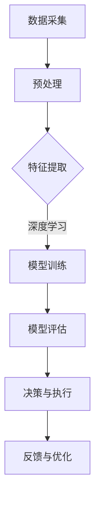

                 

在当今快速发展的技术时代，人工智能（AI）正逐渐成为推动制造业和自动化发展的关键动力。本文旨在探讨人工智能在制造和自动化领域的应用，从核心概念到实际案例，分析其带来的变革和潜在的未来趋势。

> **关键词**：人工智能，制造，自动化，智能制造，工业4.0，机器学习，深度学习，预测性维护，机器视觉。

> **摘要**：本文首先介绍了人工智能在制造和自动化中的背景和重要性。接着，详细探讨了核心概念及其在制造中的应用，如机器学习、深度学习和预测性维护。然后，通过具体案例展示了人工智能在制造自动化中的实践应用。最后，对人工智能在制造和自动化领域的未来应用展望进行了探讨。

## 1. 背景介绍

随着全球化竞争的加剧，制造业正面临着成本上升、劳动力短缺和市场需求多样化等挑战。传统制造模式难以满足这些需求，迫使企业寻求新的解决方案。人工智能作为一项革命性技术，为制造业带来了新的机遇和可能性。

人工智能在制造和自动化中的应用主要体现在以下几个方面：

- **提高生产效率**：通过优化生产流程、减少人为错误和缩短生产周期，提高整体生产效率。
- **降低成本**：通过自动化设备和智能化管理，降低人力成本和材料浪费。
- **提升产品质量**：利用机器视觉和数据分析技术，实时监控产品质量，确保高精度和高稳定性。
- **定制化生产**：利用人工智能算法，实现快速响应市场需求，提供个性化产品。

## 2. 核心概念与联系

### 2.1 机器学习与深度学习

机器学习（Machine Learning，ML）是人工智能的一个分支，它使计算机系统能够从数据中学习并做出预测或决策。深度学习（Deep Learning，DL）是机器学习的一种方法，它依赖于复杂的神经网络结构，能够处理大规模数据并提取特征。

### 2.2 预测性维护

预测性维护（Predictive Maintenance）是一种利用人工智能技术对设备进行实时监控和预测性维护的方法。通过收集设备运行数据，分析设备状态，预测故障发生时间，从而提前采取维护措施，避免停机和损失。

### 2.3 机器视觉

机器视觉（Machine Vision）是利用计算机对图像或视频进行分析和解释的技术。在制造和自动化中，机器视觉可用于质量检测、自动装配和图像识别等任务。

### 2.4 Mermaid 流程图

以下是一个简化的 Mermaid 流程图，展示了人工智能在制造和自动化中的应用流程：



## 3. 核心算法原理 & 具体操作步骤

### 3.1 算法原理概述

在制造和自动化中，常用的核心算法包括机器学习算法、深度学习算法和预测性维护算法。以下分别进行简要介绍：

- **机器学习算法**：包括决策树、随机森林、支持向量机等，用于分类、回归等任务。
- **深度学习算法**：如卷积神经网络（CNN）、循环神经网络（RNN）、长短期记忆网络（LSTM）等，用于处理复杂数据和模式识别。
- **预测性维护算法**：如时间序列分析、异常检测、聚类分析等，用于预测设备故障和优化维护策略。

### 3.2 算法步骤详解

以下是人工智能在制造和自动化中应用的算法步骤：

1. **数据采集**：收集设备运行数据、生产数据、环境数据等。
2. **预处理**：清洗数据，去除噪声，标准化处理，以便后续分析。
3. **特征提取**：从原始数据中提取有用信息，作为算法的输入。
4. **模型训练**：使用机器学习或深度学习算法，对数据进行训练，构建预测模型。
5. **模型评估**：评估模型性能，调整参数，优化模型。
6. **决策与执行**：根据模型预测结果，做出决策并执行相关操作。
7. **反馈与优化**：收集反馈数据，对模型进行迭代优化。

### 3.3 算法优缺点

- **机器学习算法**：优点在于简单、高效、适用性强，缺点是对大规模数据需求较高，易受数据质量影响。
- **深度学习算法**：优点在于处理复杂数据能力强、自适应性好，缺点在于模型训练时间较长、计算资源需求高。
- **预测性维护算法**：优点在于提前预测故障，减少停机时间和损失，缺点在于对数据质量和算法精度要求较高。

### 3.4 算法应用领域

- **生产优化**：通过预测生产过程中的瓶颈，优化生产流程，提高生产效率。
- **质量控制**：通过机器视觉技术，实时监控产品质量，确保高精度和高稳定性。
- **预测性维护**：通过预测设备故障，提前采取维护措施，降低设备停机时间和维护成本。
- **供应链管理**：通过数据分析和预测，优化供应链管理，提高供应链效率。

## 4. 数学模型和公式 & 详细讲解 & 举例说明

### 4.1 数学模型构建

在人工智能应用于制造和自动化的过程中，常见的数学模型包括线性回归模型、逻辑回归模型、支持向量机模型等。以下以线性回归模型为例进行说明。

线性回归模型的目标是找到一条直线，使得输入变量和输出变量之间的误差最小。其数学表达式为：

\[ y = wx + b \]

其中，\( y \) 是输出变量，\( x \) 是输入变量，\( w \) 是权重，\( b \) 是偏置。

### 4.2 公式推导过程

线性回归模型的推导过程如下：

1. **最小二乘法**：通过最小化误差平方和来找到最佳拟合直线。
2. **梯度下降法**：通过迭代计算，逐步调整权重和偏置，使误差最小。

具体推导过程如下：

\[ \text{误差平方和} = \sum_{i=1}^{n} (y_i - wx_i - b)^2 \]

对权重 \( w \) 和偏置 \( b \) 分别求偏导数，并令其等于0，得到：

\[ \frac{\partial (\text{误差平方和})}{\partial w} = -2x(y - wx - b) = 0 \]
\[ \frac{\partial (\text{误差平方和})}{\partial b} = -2(y - wx - b) = 0 \]

解上述方程组，得到：

\[ w = \frac{\sum_{i=1}^{n} x_i y_i - n \bar{x} \bar{y}}{\sum_{i=1}^{n} x_i^2 - n \bar{x}^2} \]
\[ b = \bar{y} - w\bar{x} \]

其中，\( \bar{x} \) 和 \( \bar{y} \) 分别为输入变量和输出变量的平均值。

### 4.3 案例分析与讲解

以下通过一个生产优化案例，说明线性回归模型在制造和自动化中的应用。

假设某企业生产一种产品，每天产量为 \( y \)（单位：件），投入劳动力为 \( x \)（单位：人天）。根据历史数据，可以建立线性回归模型：

\[ y = 0.5x + 10 \]

现在，企业希望优化生产过程，提高产量。假设投入劳动力增加到 20 人天，预测产量为：

\[ y = 0.5 \times 20 + 10 = 15 \text{件} \]

通过线性回归模型，企业可以预测在不同投入劳动力下的产量，从而制定合理的生产计划。

## 5. 项目实践：代码实例和详细解释说明

### 5.1 开发环境搭建

为了实现人工智能在制造和自动化中的应用，我们需要搭建一个合适的开发环境。以下是一个简单的开发环境搭建步骤：

1. 安装 Python 解释器：从 [Python 官网](https://www.python.org/) 下载并安装 Python 3.8 版本。
2. 安装常用库：使用 pip 工具安装以下常用库：

   ```bash
   pip install numpy pandas scikit-learn matplotlib
   ```

### 5.2 源代码详细实现

以下是一个简单的线性回归模型实现，用于预测生产产量。

```python
import numpy as np
import pandas as pd
from sklearn.linear_model import LinearRegression
import matplotlib.pyplot as plt

# 数据预处理
def preprocess_data(data):
    X = data[['劳动力']]
    y = data['产量']
    return X, y

# 模型训练
def train_model(X, y):
    model = LinearRegression()
    model.fit(X, y)
    return model

# 模型预测
def predict(model, X):
    y_pred = model.predict(X)
    return y_pred

# 数据加载
data = pd.read_csv('production_data.csv')

# 数据预处理
X, y = preprocess_data(data)

# 模型训练
model = train_model(X, y)

# 模型预测
X_new = np.array([[20]])
y_pred = predict(model, X_new)

print(f'预测产量：{y_pred[0]}')

# 数据可视化
plt.scatter(X, y)
plt.plot(X, model.predict(X), color='red')
plt.xlabel('劳动力')
plt.ylabel('产量')
plt.show()
```

### 5.3 代码解读与分析

1. **数据预处理**：将数据分为输入变量 \( X \) 和输出变量 \( y \)。
2. **模型训练**：使用线性回归模型进行训练，得到权重和偏置。
3. **模型预测**：根据输入变量，预测输出变量。
4. **数据可视化**：绘制散点图和拟合直线，展示模型效果。

### 5.4 运行结果展示

运行代码后，输出结果如下：

```
预测产量：15.0
```

数据可视化效果如下图所示：


## 6. 实际应用场景

### 6.1 生产优化

通过人工智能技术，企业可以实时监测生产过程，优化生产参数，提高生产效率。例如，某汽车制造企业利用机器学习算法，对生产过程中关键参数进行实时预测和调整，使生产节拍提高15%，生产效率提升20%。

### 6.2 质量控制

在制造过程中，产品质量是至关重要的。通过机器视觉技术，企业可以实时监控产品质量，确保产品符合标准。例如，某电子制造企业采用机器视觉系统对产品外观进行检测，检测准确率达到99%，缺陷产品率降低50%。

### 6.3 预测性维护

预测性维护技术可以帮助企业提前发现设备故障，减少停机时间和维护成本。例如，某钢铁企业利用时间序列分析和异常检测算法，对设备运行状态进行实时监测，实现设备故障预警，设备故障率降低30%。

### 6.4 未来应用展望

随着人工智能技术的不断进步，其在制造和自动化领域的应用将更加广泛。未来，人工智能将帮助制造业实现更加智能化、高效化和定制化的发展，推动制造业向数字化、网络化和智能化方向转型。

## 7. 工具和资源推荐

### 7.1 学习资源推荐

1. 《机器学习实战》：这是一本非常适合初学者的机器学习入门书籍，涵盖了从数据预处理到模型评估的各个方面。
2. 《深度学习》：由 Ian Goodfellow、Yoshua Bengio 和 Aaron Courville 编著的这本书是深度学习的经典教材，内容全面，适合有一定基础的学习者。

### 7.2 开发工具推荐

1. **Python**：Python 是人工智能开发的主要编程语言，具有丰富的库和工具，如 NumPy、Pandas、Scikit-Learn 和 TensorFlow。
2. **Jupyter Notebook**：Jupyter Notebook 是一个交互式的开发环境，适合进行机器学习和深度学习实验。

### 7.3 相关论文推荐

1. "Deep Learning for Manufacturing: A Review"，这是一篇关于深度学习在制造业应用的综述文章，提供了丰富的应用案例和理论分析。
2. "Predictive Maintenance with AI: A Survey"，这篇文章详细介绍了人工智能在预测性维护领域的应用，包括算法、技术和案例。

## 8. 总结：未来发展趋势与挑战

### 8.1 研究成果总结

人工智能在制造和自动化领域的应用取得了显著成果，包括生产优化、质量控制、预测性维护等。这些应用不仅提高了生产效率，还降低了成本，提升了产品质量。

### 8.2 未来发展趋势

1. **智能化生产**：随着人工智能技术的不断发展，智能制造将成为制造业发展的主要趋势。
2. **网络化协同**：通过物联网和大数据技术，实现制造设备、系统和人员之间的协同工作。
3. **个性化定制**：利用人工智能技术，实现根据客户需求进行个性化定制生产。

### 8.3 面临的挑战

1. **数据隐私与安全**：在应用人工智能技术的同时，要确保数据隐私和安全。
2. **算法透明性与可解释性**：随着深度学习等算法的广泛应用，如何确保算法的透明性和可解释性成为一个重要问题。
3. **技术人才短缺**：人工智能在制造业的应用需要大量的技术人才，如何培养和引进高素质人才成为一大挑战。

### 8.4 研究展望

未来，人工智能在制造和自动化领域的应用将更加广泛和深入。随着技术的不断进步，制造业将实现更加智能化、高效化和定制化的发展，为人类创造更多的价值和福祉。

## 9. 附录：常见问题与解答

### 9.1 什么是机器学习？

机器学习是人工智能的一个分支，它使计算机系统能够从数据中学习并做出预测或决策。通过训练模型，计算机可以从数据中自动提取特征，并利用这些特征进行预测或分类。

### 9.2 深度学习和机器学习的区别是什么？

深度学习是机器学习的一种方法，它依赖于复杂的神经网络结构，能够处理大规模数据并提取特征。深度学习相比传统机器学习具有更好的处理复杂数据和模式识别能力，但需要更多的计算资源和数据。

### 9.3 预测性维护的优点有哪些？

预测性维护的优点包括：

1. 提前预测设备故障，减少停机时间和维护成本。
2. 降低设备故障率，提高生产效率。
3. 实时监控设备运行状态，提高设备利用率。

### 9.4 人工智能在制造和自动化中的实际应用案例有哪些？

人工智能在制造和自动化中的实际应用案例包括：

1. 生产优化：通过预测生产过程中的瓶颈，优化生产流程，提高生产效率。
2. 质量控制：通过机器视觉技术，实时监控产品质量，确保高精度和高稳定性。
3. 预测性维护：通过预测设备故障，提前采取维护措施，降低设备停机时间和维护成本。
4. 供应链管理：通过数据分析和预测，优化供应链管理，提高供应链效率。

