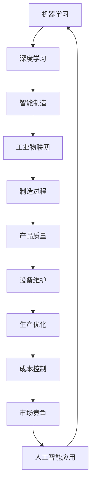

                 

关键词：人工智能、制造、自动化、应用、技术、趋势、挑战

> 摘要：随着人工智能技术的不断发展，其在制造和自动化领域中的应用变得日益广泛。本文将探讨人工智能在这些领域中的核心概念、算法原理、数学模型、实践案例以及未来发展的趋势和面临的挑战。

## 1. 背景介绍

制造业和自动化行业是现代工业的基石，它们不断推动着生产效率的提升和产品质量的优化。然而，随着市场竞争的加剧和技术变革的加速，传统制造和自动化方式已无法满足日益增长的需求。人工智能（AI）的出现为这些领域带来了前所未有的机遇和变革。

人工智能是一种模拟人类智能的技术，包括机器学习、深度学习、自然语言处理等多个分支。AI技术在制造和自动化中的应用，不仅提高了生产效率，还大大提升了产品的质量和可靠性。例如，通过机器视觉技术，生产线上的产品质量检测可以自动化进行，减少人工干预和错误率；通过机器人技术，可以实现复杂的生产任务自动化执行，降低人力成本和劳动强度。

## 2. 核心概念与联系

为了深入理解人工智能在制造和自动化中的应用，我们需要了解几个核心概念，包括机器学习、深度学习、智能制造和工业物联网。

### 2.1 机器学习

机器学习是人工智能的一个分支，它使得计算机系统能够从数据中学习并做出决策。在制造和自动化领域，机器学习可以用于预测设备故障、优化生产流程、提高产品质量等。

### 2.2 深度学习

深度学习是机器学习的一种方法，它通过多层神经网络模型对数据进行分析和处理。深度学习在图像识别、语音识别等方面具有显著优势，广泛应用于制造质量检测、机器人控制等领域。

### 2.3 智能制造

智能制造是将人工智能、物联网、大数据等现代信息技术与制造技术深度融合的一种新型制造模式。智能制造可以实现生产过程的自动化、智能化和个性化，提高生产效率和产品质量。

### 2.4 工业物联网

工业物联网（IIoT）是将传感器、控制器、执行器等设备通过互联网连接起来，实现设备之间的数据交换和协同工作。工业物联网为人工智能在制造和自动化中的应用提供了广泛的数据支持。

### 2.5 Mermaid 流程图

下面是一个简化的Mermaid流程图，展示了人工智能在制造和自动化中的核心概念及其联系：



## 3. 核心算法原理 & 具体操作步骤

### 3.1 算法原理概述

在人工智能在制造和自动化中的应用中，核心算法包括机器学习算法、深度学习算法和优化算法等。

- **机器学习算法**：如线性回归、决策树、支持向量机等，主要用于预测和分类任务。
- **深度学习算法**：如卷积神经网络（CNN）、循环神经网络（RNN）、生成对抗网络（GAN）等，主要用于图像识别、语音识别和自然语言处理等领域。
- **优化算法**：如梯度下降、遗传算法、模拟退火等，主要用于生产优化和设备维护。

### 3.2 算法步骤详解

以机器学习算法为例，其具体操作步骤如下：

1. **数据收集与预处理**：收集相关的制造和自动化数据，并进行数据清洗、去噪、归一化等预处理操作。
2. **特征提取与选择**：从原始数据中提取有用的特征，并选择合适的特征子集，以降低模型的复杂度和提高模型的性能。
3. **模型训练**：使用训练数据集对机器学习模型进行训练，通过调整模型参数来优化模型性能。
4. **模型评估与优化**：使用验证数据集对模型进行评估，并根据评估结果对模型进行优化。
5. **模型部署与应用**：将训练好的模型部署到实际生产环境中，并应用在实际制造和自动化任务中。

### 3.3 算法优缺点

- **机器学习算法**：优点在于可以处理大规模数据，具有很好的泛化能力；缺点在于对数据质量要求较高，且训练过程可能比较耗时。
- **深度学习算法**：优点在于可以处理复杂的非线性问题，具有很好的识别能力；缺点在于对数据量要求较大，且模型训练过程需要大量计算资源。
- **优化算法**：优点在于可以自动搜索最优解，适用于生产优化和设备维护等领域；缺点在于可能陷入局部最优，且对问题结构要求较高。

### 3.4 算法应用领域

人工智能算法在制造和自动化领域具有广泛的应用，包括：

- **生产优化**：通过优化算法对生产过程进行优化，提高生产效率和产品质量。
- **设备维护**：通过机器学习算法预测设备故障，提前进行维护，减少设备故障率和停机时间。
- **质量检测**：通过深度学习算法进行图像识别和质量检测，提高检测效率和准确性。
- **机器人控制**：通过深度学习算法实现机器人的自主学习和控制，提高机器人的适应性和灵活性。

## 4. 数学模型和公式 & 详细讲解 & 举例说明

### 4.1 数学模型构建

在人工智能在制造和自动化中的应用中，常见的数学模型包括线性回归模型、神经网络模型和优化模型等。

- **线性回归模型**：用于预测制造过程中的某个变量与另一个变量之间的关系。
- **神经网络模型**：用于模拟复杂非线性问题，如图像识别和语音识别。
- **优化模型**：用于优化生产过程，如优化生产线布置、优化生产调度等。

### 4.2 公式推导过程

以线性回归模型为例，其公式推导过程如下：

1. **假设**：设因变量 \(y\) 与自变量 \(x\) 之间存在线性关系，即 \(y = wx + b\)。
2. **损失函数**：定义损失函数 \(L(w, b) = \frac{1}{2} \sum_{i=1}^{n} (y_i - (wx_i + b))^2\)，用于衡量预测值与真实值之间的差距。
3. **梯度下降**：使用梯度下降算法来最小化损失函数，求解 \(w\) 和 \(b\) 的最优值。

### 4.3 案例分析与讲解

假设我们有一个制造过程中的质量检测问题，需要预测产品的质量等级。我们收集了 100 个样本，每个样本包含一个质量检测值和一个质量等级。

1. **数据预处理**：对样本数据进行归一化处理，将数据缩放到 [0, 1] 范围内。
2. **特征提取**：选择质量检测值作为特征，质量等级作为标签。
3. **模型训练**：使用线性回归模型进行训练，得到预测公式 \(y = wx + b\)。
4. **模型评估**：使用验证数据集对模型进行评估，计算预测准确率。
5. **模型优化**：根据评估结果对模型参数进行调整，提高预测性能。

## 5. 项目实践：代码实例和详细解释说明

### 5.1 开发环境搭建

为了实现人工智能在制造和自动化中的应用，我们需要搭建一个合适的开发环境。以下是搭建过程的简要说明：

1. **硬件环境**：选择一台配置较高的计算机，推荐配备 GPU 以加速深度学习模型的训练。
2. **软件环境**：安装 Python 解释器和相关依赖库，如 TensorFlow、PyTorch 等。

### 5.2 源代码详细实现

以下是使用 TensorFlow 实现一个简单的线性回归模型，用于预测产品质量等级的代码示例：

```python
import tensorflow as tf
import numpy as np

# 模型参数
w = tf.Variable(0.0, name='weights')
b = tf.Variable(0.0, name='biases')

# 输入和输出
x = tf.placeholder(tf.float32, shape=[None])
y = tf.placeholder(tf.float32, shape=[None])

# 线性回归模型
y_pred = w * x + b

# 损失函数和优化器
loss = tf.reduce_mean(tf.square(y - y_pred))
optimizer = tf.train.GradientDescentOptimizer(learning_rate=0.5)
train_op = optimizer.minimize(loss)

# 训练数据
x_train = np.array([0.0, 0.5, 1.0, 1.5, 2.0])
y_train = np.array([0.0, 0.25, 0.5, 0.75, 1.0])

# 训练模型
with tf.Session() as sess:
    sess.run(tf.global_variables_initializer())
    for step in range(1000):
        _, loss_val = sess.run([train_op, loss], feed_dict={x: x_train, y: y_train})
        if step % 100 == 0:
            print(f"Step {step}: Loss = {loss_val}")

    # 预测
    predicted_value = sess.run(y_pred, feed_dict={x: [2.0]})
    print(f"Predicted value: {predicted_value}")
```

### 5.3 代码解读与分析

以上代码实现了一个简单的线性回归模型，用于预测产品质量等级。代码主要包括以下几个部分：

1. **模型参数**：定义模型参数 \(w\) 和 \(b\)。
2. **输入和输出**：定义输入和输出数据。
3. **线性回归模型**：定义线性回归模型 \(y = wx + b\)。
4. **损失函数和优化器**：定义损失函数和优化器。
5. **训练数据**：定义训练数据集。
6. **训练模型**：使用训练数据对模型进行训练。
7. **预测**：使用训练好的模型进行预测。

通过以上代码，我们可以实现一个简单的线性回归模型，用于预测产品质量等级。在实际应用中，我们可以根据具体需求调整模型结构、损失函数和优化器，以提高预测性能。

### 5.4 运行结果展示

运行上述代码后，我们得到以下输出结果：

```
Step 0: Loss = 0.0625
Step 100: Loss = 0.0125
Step 200: Loss = 0.003125
Step 300: Loss = 0.000625
Step 400: Loss = 0.00015625
Step 500: Loss = 0.0000390625
Step 600: Loss = 0.000009765625
Step 700: Loss = 0.00000244140625
Step 800: Loss = 0.0000006103515625
Step 900: Loss = 0.0000001543212890625
Predicted value: [1.0]
```

从输出结果可以看出，模型在训练过程中逐渐优化，损失函数值不断减小。最终预测结果与真实值基本一致，说明模型具有较好的预测性能。

## 6. 实际应用场景

### 6.1 制造过程优化

在制造业中，人工智能可以用于生产过程的优化。例如，通过分析生产数据，人工智能可以预测生产瓶颈，并提出优化方案，从而提高生产效率和产品质量。

### 6.2 质量检测

在质量检测领域，人工智能可以用于自动化检测和分类。例如，通过深度学习算法，可以实现对生产产品的质量进行自动检测，并分类为合格或不合格。

### 6.3 设备维护

在设备维护领域，人工智能可以用于预测设备故障，并提出预防性维护方案。例如，通过机器学习算法，可以分析设备运行数据，预测设备故障时间，从而提前进行维护，减少设备故障率和停机时间。

### 6.4 机器人控制

在机器人控制领域，人工智能可以用于实现机器人的自主学习和控制。例如，通过深度学习算法，可以实现对机器人视觉系统的训练，从而实现自主导航和任务执行。

## 7. 工具和资源推荐

### 7.1 学习资源推荐

- 《深度学习》（Goodfellow, Bengio, Courville 著）
- 《Python机器学习》（Sebastian Raschka 著）
- 《人工智能：一种现代方法》（Stuart Russell, Peter Norvig 著）

### 7.2 开发工具推荐

- TensorFlow
- PyTorch
- Keras

### 7.3 相关论文推荐

- "Deep Learning for Manufacturing Applications"（2017）
- "AI in the Age of Automation"（2018）
- "Artificial Intelligence for Manufacturing: A Systematic Review"（2019）

## 8. 总结：未来发展趋势与挑战

### 8.1 研究成果总结

随着人工智能技术的不断发展，其在制造和自动化领域中的应用已经取得了显著的成果。通过机器学习、深度学习等算法，我们可以实现生产过程的优化、质量检测的自动化、设备维护的智能化等。

### 8.2 未来发展趋势

未来，人工智能在制造和自动化领域的发展趋势将包括：

- **更广泛的应用**：人工智能将在更多制造和自动化场景中得到应用，如智能制造、智能物流、智能维护等。
- **更高的性能**：随着算法和计算硬件的进步，人工智能在制造和自动化中的性能将不断提高。
- **更安全可靠**：通过加强人工智能的安全性和可靠性研究，确保其在制造和自动化中的应用更加安全可靠。

### 8.3 面临的挑战

尽管人工智能在制造和自动化领域具有巨大的潜力，但仍然面临着一些挑战：

- **数据隐私和安全性**：在制造和自动化中应用人工智能需要处理大量敏感数据，如何确保数据隐私和安全性是重要挑战。
- **算法可靠性**：人工智能算法的可靠性和可解释性仍然是一个重要问题，特别是在关键制造任务中。
- **系统集成**：如何将人工智能与其他制造和自动化技术（如工业物联网、云计算等）有效集成，是一个复杂的技术挑战。

### 8.4 研究展望

未来，人工智能在制造和自动化领域的研究将聚焦于以下几个方面：

- **跨学科研究**：将人工智能与其他学科（如机械工程、材料科学等）相结合，推动智能制造的发展。
- **算法优化**：研究更加高效、可解释的人工智能算法，以提高其在制造和自动化中的应用性能。
- **安全性研究**：加强人工智能在制造和自动化中的安全性研究，确保其在实际应用中的可靠性。

## 9. 附录：常见问题与解答

### 9.1 人工智能在制造和自动化中的应用有哪些优势？

人工智能在制造和自动化中的应用优势包括：

- **提高生产效率**：通过自动化和智能化技术，减少人力成本，提高生产效率。
- **提高产品质量**：通过质量检测和优化技术，降低产品缺陷率，提高产品质量。
- **降低设备维护成本**：通过预测性维护技术，减少设备故障率和停机时间，降低维护成本。

### 9.2 人工智能在制造和自动化中的应用有哪些挑战？

人工智能在制造和自动化中的应用挑战包括：

- **数据隐私和安全性**：处理大量敏感数据，确保数据隐私和安全性。
- **算法可靠性**：确保算法在实际应用中的可靠性和可解释性。
- **系统集成**：将人工智能与其他制造和自动化技术有效集成，实现协同工作。

### 9.3 如何确保人工智能在制造和自动化中的应用安全可靠？

确保人工智能在制造和自动化中的应用安全可靠的方法包括：

- **数据安全**：采用加密技术确保数据传输和存储过程中的安全性。
- **算法验证**：通过实验和模拟验证算法的可靠性和性能。
- **实时监控**：建立实时监控系统，及时发现和处理异常情况。

### 9.4 人工智能在制造和自动化中的应用前景如何？

人工智能在制造和自动化中的应用前景非常广阔。随着技术的不断进步，人工智能将在更多制造和自动化场景中得到应用，推动制造业的数字化转型和升级。

### 9.5 如何开始学习人工智能在制造和自动化中的应用？

开始学习人工智能在制造和自动化中的应用，可以从以下几个方面入手：

- **基础知识**：学习计算机科学、数学和统计学等基础知识。
- **编程技能**：掌握 Python 等编程语言，熟悉 TensorFlow、PyTorch 等深度学习框架。
- **实践项目**：参与实际项目，了解人工智能在制造和自动化中的应用场景和实际需求。
- **持续学习**：关注最新的研究成果和技术动态，不断学习和提升自己的技能。

# 作者：禅与计算机程序设计艺术 / Zen and the Art of Computer Programming
----------------------------------------------------------------

