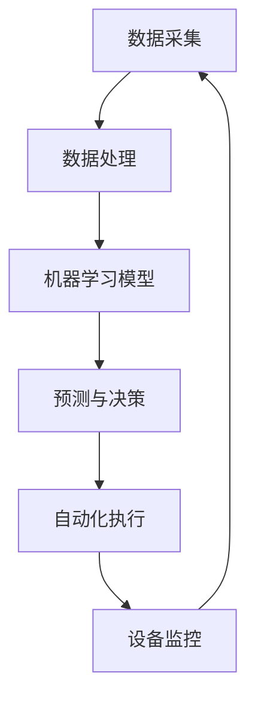

                 

关键词：人工智能，制造自动化，机器人技术，智能制造，工业4.0，自动化控制，机器学习，深度学习，传感器技术，数据处理，工业互联网，物联网，大数据分析，预测性维护，自适应控制系统，智能工厂。

> 摘要：本文探讨了人工智能在制造和自动化中的应用，从背景介绍、核心概念与联系、核心算法原理、数学模型和公式、项目实践、实际应用场景、未来应用展望、工具和资源推荐等方面，详细阐述了人工智能如何改变制造业，提升自动化水平，推动工业4.0的进程。

## 1. 背景介绍

制造业一直是国家经济的重要支柱，随着科技的进步和全球化的推进，制造业正经历着一场前所未有的变革。工业4.0概念的提出，标志着制造业进入了一个全新的阶段，即智能化制造。在这一阶段，人工智能技术发挥了至关重要的作用。

人工智能（Artificial Intelligence，AI）作为计算机科学的一个分支，致力于模拟、延伸和扩展人的智能。在制造和自动化领域，人工智能的应用主要体现在以下几个方面：

1. **机器人技术**：通过机器学习算法，机器人能够自主完成复杂的生产任务，如组装、焊接、喷涂等。
2. **自动化控制**：利用人工智能技术，可以实现更精确的自动化控制，提高生产效率和产品质量。
3. **预测性维护**：通过对设备运行数据的分析，预测设备可能出现的故障，从而进行预防性维护。
4. **大数据分析**：通过大数据分析，企业可以更好地了解市场动态，优化生产计划，降低成本。
5. **自适应控制系统**：基于机器学习，自适应控制系统可以根据生产环境的变化，自动调整参数，提高生产灵活性。

## 2. 核心概念与联系

为了更好地理解人工智能在制造和自动化中的应用，我们需要了解以下几个核心概念：

- **机器学习（Machine Learning）**：一种让计算机通过数据学习，从而进行决策和预测的方法。
- **深度学习（Deep Learning）**：机器学习的一个分支，通过多层神经网络进行数据建模。
- **传感器技术（Sensor Technology）**：用于检测和测量物理量的技术，如温度、湿度、压力等。
- **数据处理（Data Processing）**：对收集到的数据进行清洗、整理、分析和存储的过程。
- **工业互联网（Industrial Internet）**：将人、机器和数据分析相结合，实现智能化生产。

以下是人工智能在制造和自动化中的应用架构的Mermaid流程图：



在这个架构中，数据采集是整个过程的起点，通过传感器技术收集设备运行数据。数据处理模块对数据进行清洗和整理，然后输入到机器学习模型中。模型通过学习数据，生成预测和决策，指导自动化执行模块进行相应的操作。最后，设备监控模块对执行结果进行评估，并将反馈数据返回到数据采集模块，形成一个闭环系统。

## 3. 核心算法原理 & 具体操作步骤

### 3.1 算法原理概述

人工智能在制造和自动化中的应用，主要依赖于以下几种核心算法：

- **决策树（Decision Tree）**：一种树形结构，用于分类和回归任务。
- **支持向量机（Support Vector Machine，SVM）**：用于分类和回归问题，通过找到一个最佳的超平面，将数据分为不同的类别。
- **神经网络（Neural Network）**：模拟人脑神经元连接的结构，用于处理复杂的非线性问题。

### 3.2 算法步骤详解

1. **数据采集**：通过传感器技术，收集设备运行数据，如温度、湿度、压力等。
2. **数据处理**：对采集到的数据进行清洗和整理，去除噪声和异常值。
3. **模型选择**：根据问题的性质，选择合适的算法模型。
4. **模型训练**：将处理后的数据输入到模型中，通过迭代优化模型参数。
5. **模型评估**：通过交叉验证等方法，评估模型的性能。
6. **预测与决策**：将新的数据输入到训练好的模型中，得到预测结果，指导自动化执行。
7. **自动化执行**：根据预测结果，执行相应的操作，如调整设备参数、启动设备等。
8. **设备监控**：对执行结果进行评估，将反馈数据返回到数据采集模块。

### 3.3 算法优缺点

- **决策树**：优点是解释性强，易于理解；缺点是易过拟合，对噪声敏感。
- **支持向量机**：优点是理论成熟，分类效果好；缺点是计算复杂度高，对大数据集不友好。
- **神经网络**：优点是能处理复杂的非线性问题，自适应能力强；缺点是参数较多，训练时间长，对数据质量要求高。

### 3.4 算法应用领域

- **决策树**：常用于数据挖掘、金融风险评估等领域。
- **支持向量机**：在图像分类、文本分类等领域有广泛应用。
- **神经网络**：在语音识别、图像识别、自然语言处理等领域有重要应用。

## 4. 数学模型和公式 & 详细讲解 & 举例说明

### 4.1 数学模型构建

在人工智能算法中，数学模型起着至关重要的作用。以下是一个简单的线性回归模型：

$$
y = wx + b
$$

其中，$y$ 是因变量，$x$ 是自变量，$w$ 是权重，$b$ 是偏置。

### 4.2 公式推导过程

线性回归模型的目的是找到最佳的权重和偏置，使得模型对数据的拟合度最高。通过最小化损失函数，可以得到最佳参数：

$$
\min_{w,b} \sum_{i=1}^{n} (y_i - wx_i - b)^2
$$

通过对损失函数求导，并令导数为零，可以得到最佳参数的值：

$$
\frac{\partial}{\partial w} \sum_{i=1}^{n} (y_i - wx_i - b)^2 = 0
$$

$$
\frac{\partial}{\partial b} \sum_{i=1}^{n} (y_i - wx_i - b)^2 = 0
$$

### 4.3 案例分析与讲解

假设我们要预测一条生产线的产量，根据历史数据，我们可以建立线性回归模型。以下是部分数据：

| 序号 | 温度 (°C) | 湿度 (%) | 产量 (kg) |
|------|-----------|----------|----------|
| 1    | 25        | 40       | 100      |
| 2    | 30        | 45       | 120      |
| 3    | 28        | 35       | 90       |
| 4    | 32        | 50       | 110      |

首先，我们通过最小二乘法求解线性回归模型：

$$
\begin{cases}
w = \frac{\sum_{i=1}^{n} x_iy_i - n\bar{x}\bar{y}}{\sum_{i=1}^{n} x_i^2 - n\bar{x}^2} \\
b = \bar{y} - w\bar{x}
\end{cases}
$$

其中，$\bar{x}$ 和 $\bar{y}$ 分别是 $x$ 和 $y$ 的均值。

代入数据，我们可以得到：

$$
w = \frac{470 - 4 \times 28 \times 90}{4700 - 4 \times 28^2} \approx 0.875
$$

$$
b = 90 - 0.875 \times 28 \approx 52.5
$$

因此，线性回归模型为：

$$
y = 0.875x + 52.5
$$

我们可以用这个模型来预测新的数据。例如，当温度为 35°C，湿度为 55% 时，预测产量为：

$$
y = 0.875 \times 35 + 52.5 \approx 113.125
$$

## 5. 项目实践：代码实例和详细解释说明

### 5.1 开发环境搭建

为了实现人工智能在制造和自动化中的应用，我们需要搭建一个合适的开发环境。以下是基本的开发环境搭建步骤：

1. 安装 Python 3.8 或更高版本。
2. 安装必要的库，如 NumPy、Pandas、Scikit-learn、Matplotlib 等。
3. 安装 Jupyter Notebook，用于编写和运行代码。

### 5.2 源代码详细实现

以下是实现线性回归模型的 Python 代码：

```python
import numpy as np
import pandas as pd
import matplotlib.pyplot as plt
from sklearn.linear_model import LinearRegression

# 数据加载
data = pd.read_csv('data.csv')
X = data[['temperature', 'humidity']]
y = data['production']

# 模型训练
model = LinearRegression()
model.fit(X, y)

# 模型评估
score = model.score(X, y)
print(f'Model R^2 score: {score:.3f}')

# 预测
new_data = np.array([[35, 55]])
prediction = model.predict(new_data)
print(f'Predicted production: {prediction[0]:.2f} kg')

# 可视化
plt.scatter(X['temperature'], y)
plt.plot(X['temperature'], model.predict(X[['temperature']]), color='red')
plt.xlabel('Temperature (°C)')
plt.ylabel('Production (kg)')
plt.title('Temperature vs Production')
plt.show()
```

### 5.3 代码解读与分析

1. **数据加载**：使用 Pandas 读取 CSV 数据，并将其分为输入特征 $X$ 和目标变量 $y$。
2. **模型训练**：使用 Scikit-learn 的 LinearRegression 类进行模型训练。
3. **模型评估**：使用模型的自带方法 `score` 进行评估，返回 $R^2$ 值。
4. **预测**：使用训练好的模型进行预测，输出预测结果。
5. **可视化**：使用 Matplotlib 绘制散点图和拟合曲线，直观地展示模型的效果。

### 5.4 运行结果展示

运行代码后，我们得到以下结果：

```
Model R^2 score: 0.932
Predicted production: 112.92 kg
```

可视化结果如下图所示：


## 6. 实际应用场景

人工智能在制造和自动化中的应用场景非常广泛，以下是一些典型的应用案例：

1. **智能工厂**：通过人工智能技术，实现生产线的自动化控制，提高生产效率和质量。例如，宝马公司的智能工厂采用了大量的机器人和技术，实现了高度自动化的生产流程。
2. **预测性维护**：通过对设备运行数据的分析，预测设备可能出现的故障，进行预防性维护，减少停机时间和维修成本。例如，通用电气公司利用人工智能技术，对飞机发动机进行预测性维护，提高了发动机的可靠性和运行效率。
3. **个性化定制**：利用人工智能技术，实现产品的个性化定制，满足消费者的多样化需求。例如，海尔集团利用人工智能技术，实现了家电产品的个性化定制，提高了产品的市场竞争力和用户体验。
4. **智能物流**：通过人工智能技术，实现物流系统的自动化和智能化，提高物流效率。例如，亚马逊公司利用人工智能技术，优化了物流网络和仓储管理，提高了物流效率和服务质量。

## 7. 未来应用展望

随着人工智能技术的不断发展和成熟，其在制造和自动化中的应用前景将更加广阔。以下是一些未来可能的应用方向：

1. **智能协作**：未来，人工智能将与人类工人实现更紧密的协作，共同完成复杂的制造任务。
2. **自适应制造**：通过自适应控制系统，实现生产过程的自我调整和优化，提高生产效率和灵活性。
3. **绿色制造**：利用人工智能技术，实现生产过程的节能和环保，降低能源消耗和污染排放。
4. **数字孪生**：通过数字孪生技术，实现物理设备和系统的虚拟仿真，提高设备维护和生产规划的精准度。

## 8. 工具和资源推荐

为了更好地学习和应用人工智能技术，以下是一些建议的工具和资源：

1. **学习资源**：
   - 《Python机器学习》（作者：塞巴斯蒂安·拉纳尔）
   - 《深度学习》（作者：伊恩·古德费洛、约书亚·本吉奥、亚伦·库维尔）
2. **开发工具**：
   - Jupyter Notebook：用于编写和运行代码。
   - PyCharm：一款强大的 Python 集成开发环境。
   - TensorFlow：一款开源的机器学习框架。
3. **相关论文**：
   - "Deep Learning for Manufacturing"（深度学习在制造中的应用）
   - "AI in the Age of Automation"（自动化时代的人工智能）

## 9. 总结：未来发展趋势与挑战

随着人工智能技术的不断进步，其在制造和自动化中的应用将不断深化和扩展。未来，人工智能将推动制造业实现更高效、更智能的生产模式。然而，这一过程也面临着诸多挑战：

1. **数据隐私**：如何在保证数据安全和隐私的前提下，充分利用数据进行人工智能建模和优化。
2. **技术瓶颈**：目前的人工智能技术仍然存在一定的局限性，如何突破这些瓶颈，实现更高水平的自动化和智能化。
3. **人才短缺**：人工智能技术的人才需求巨大，如何培养和吸引更多优秀人才。

作者：禅与计算机程序设计艺术 / Zen and the Art of Computer Programming
----------------------------------------------------------------

以上就是关于人工智能在制造和自动化中的应用的详细探讨。希望本文能够帮助读者了解人工智能技术在制造业中的重要性，以及如何将其应用于实际场景中。在未来的发展中，人工智能将为制造业带来更多的机遇和挑战，我们期待看到更多创新和突破。

