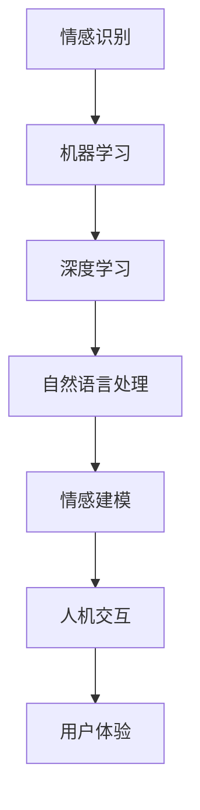

                 

关键词：情感计算，人工智能，情感识别，情感建模，机器学习，深度学习，情感分析，交互设计，用户体验。

> 摘要：本文深入探讨了人工智能在情感计算领域的应用。首先，我们对情感计算的基本概念进行了介绍，并探讨了其与人工智能的紧密联系。随后，文章详细分析了情感识别与情感建模的核心算法原理，以及它们在各个应用领域的实际操作步骤。此外，我们还通过数学模型和公式，对情感计算的细节进行了深入讲解，并提供了实例分析。文章最后，通过项目实践和实际应用场景的展示，探讨了情感计算的未来发展趋势与面临的挑战，为读者提供了一个全面而深入的视角。

## 1. 背景介绍

情感计算（Affective Computing）是计算机科学中的一个新兴领域，它旨在使计算机具备识别、理解、处理和模拟人类情感的能力。情感计算的研究起源于对人类情感的深刻理解，以及如何将这种理解应用到计算机系统中，从而提升计算机与人类之间的交互体验。

人工智能（Artificial Intelligence，AI）作为一门科学，旨在通过计算机模拟人类智能行为，实现智能机器的设计、开发和应用。人工智能在各个领域都有着广泛的应用，从自然语言处理到图像识别，再到决策支持系统，无不涉及。

将人工智能应用于情感计算，旨在实现以下几个目标：

1. **提升人机交互的自然性和流畅性**：通过理解用户的情感状态，计算机能够更好地适应用户的需求，提供更加个性化和人性化的服务。
2. **增强用户体验**：情感计算的应用能够使系统更加细腻地捕捉用户的情感变化，从而提供更加符合用户期望的服务。
3. **辅助心理健康评估与治疗**：通过分析用户的情感状态，可以为心理健康评估提供数据支持，有助于早期发现心理问题，并采取相应措施。

本文将围绕上述目标，深入探讨人工智能在情感计算中的应用，分析其中的核心算法原理、数学模型，并通过实际案例和实践，展示其应用潜力。

## 2. 核心概念与联系

### 情感识别

情感识别是情感计算的基础，它涉及到对人类情感状态的自动检测与分类。情感识别的主要任务是从多媒体数据（如文本、语音、图像等）中提取情感信息，并对其进行分类。常见的情感类别包括愉悦、愤怒、悲伤、惊讶等。

### 情感建模

情感建模旨在构建一个数学模型，用于描述情感状态及其变化。情感建模可以通过机器学习算法实现，如神经网络、支持向量机（SVM）等。情感建模的关键在于如何从大量的数据中学习到情感变化的规律，并能够对新数据进行情感预测。

### 情感与人工智能的联系

情感计算与人工智能有着密不可分的联系。人工智能通过机器学习、深度学习等技术，为情感计算提供了强大的工具。具体来说：

- **机器学习算法**：如决策树、随机森林、支持向量机等，可以用于情感识别和情感建模。
- **深度学习技术**：如卷积神经网络（CNN）、循环神经网络（RNN）等，能够处理复杂的情感数据，提高情感计算的准确性和效率。
- **自然语言处理（NLP）**：通过NLP技术，可以提取文本中的情感信息，为情感计算提供更丰富的数据来源。

下面是一个用Mermaid绘制的情感计算与人工智能的流程图：



## 3. 核心算法原理 & 具体操作步骤

### 3.1 算法原理概述

情感计算的核心算法主要包括情感识别和情感建模。情感识别主要依赖于特征提取和分类器设计，而情感建模则依赖于数据驱动的学习算法。

- **情感识别**：通过提取文本、语音、图像等多媒体数据中的情感特征，然后使用分类器对其进行分类，以识别用户的情感状态。
- **情感建模**：基于大量的情感数据，使用机器学习算法（如神经网络、支持向量机等）构建情感状态模型，用于预测新数据的情感状态。

### 3.2 算法步骤详解

#### 情感识别

1. **数据预处理**：对收集到的多媒体数据进行预处理，包括文本的词干提取、语音的音频特征提取、图像的视觉特征提取等。
2. **特征提取**：从预处理后的数据中提取关键特征，如文本的词频、语音的音高、图像的纹理特征等。
3. **分类器设计**：选择合适的分类器（如支持向量机、决策树等）对提取的特征进行分类，以识别用户的情感状态。

#### 情感建模

1. **数据收集**：收集大量的情感数据，包括文本、语音、图像等。
2. **特征工程**：对收集到的数据进行特征提取，构建情感特征矩阵。
3. **模型训练**：使用机器学习算法（如神经网络、支持向量机等）对特征矩阵进行训练，构建情感状态模型。
4. **模型评估**：通过测试集对训练好的模型进行评估，验证其情感识别的准确性。

### 3.3 算法优缺点

#### 情感识别

- **优点**：能够实时识别用户的情感状态，为系统提供反馈。
- **缺点**：识别准确度受限于特征提取和分类器的性能。

#### 情感建模

- **优点**：通过学习大量的情感数据，能够构建出较为准确的情感状态模型。
- **缺点**：训练过程复杂，且对数据量有较高要求。

### 3.4 算法应用领域

情感计算的应用领域广泛，主要包括：

- **人机交互**：通过情感识别和情感建模，提升人机交互的自然性和流畅性。
- **用户体验**：通过情感计算，能够更好地理解用户的情感需求，提供个性化服务。
- **心理健康**：通过情感识别，能够发现用户的心理健康问题，提供相应的心理健康服务。

## 4. 数学模型和公式 & 详细讲解 & 举例说明

### 4.1 数学模型构建

情感计算的数学模型主要包括情感特征提取模型和情感状态分类模型。

#### 情感特征提取模型

情感特征提取模型用于从多媒体数据中提取情感特征。常见的特征提取方法包括：

1. **文本情感特征提取**：使用词袋模型（Bag of Words，BoW）或词嵌入（Word Embedding）等方法提取文本的情感特征。
2. **语音情感特征提取**：使用梅尔频率倒谱系数（Mel-Frequency Cepstral Coefficients，MFCC）等方法提取语音的情感特征。
3. **图像情感特征提取**：使用卷积神经网络（Convolutional Neural Networks，CNN）等方法提取图像的情感特征。

#### 情感状态分类模型

情感状态分类模型用于对提取到的情感特征进行分类，以识别用户的情感状态。常见的分类模型包括：

1. **支持向量机（Support Vector Machine，SVM）**
2. **决策树（Decision Tree）**
3. **神经网络（Neural Networks）**

### 4.2 公式推导过程

以支持向量机（SVM）为例，介绍情感状态分类模型的公式推导过程。

#### 目标函数

支持向量机的目标是最小化分类间隔，即最大化分类边界到支持向量的距离。

目标函数可以表示为：

$$
\min_{\mathbf{w}, \mathbf{b}} \frac{1}{2} ||\mathbf{w}||^2 + C \sum_{i=1}^{n} \xi_i
$$

其中，$\mathbf{w}$是分类超平面，$\mathbf{b}$是偏置项，$C$是惩罚参数，$\xi_i$是第$i$个样本的松弛变量。

#### 拉格朗日乘子法

为了求解目标函数，使用拉格朗日乘子法将问题转化为对偶问题。

拉格朗日函数可以表示为：

$$
L(\mathbf{w}, \mathbf{b}, \alpha, \xi) = \frac{1}{2} ||\mathbf{w}||^2 - \sum_{i=1}^{n} \alpha_i y_i (\mathbf{w} \cdot \mathbf{x_i}) - \mathbf{b} y_i - \sum_{i=1}^{n} \xi_i
$$

其中，$\alpha_i$是拉格朗日乘子。

#### 对偶问题

通过对拉格朗日函数求偏导并令其等于零，可以得到对偶问题：

$$
\begin{cases}
0 &= y_i (\mathbf{w} \cdot \mathbf{x_i}) + \mathbf{b} - 1 + \xi_i \\
0 &= \sum_{i=1}^{n} \alpha_i y_i \\
0 &\leq \xi_i
\end{cases}
$$

#### 解

通过求解对偶问题，可以得到支持向量和分类边界。

### 4.3 案例分析与讲解

以文本情感识别为例，分析情感特征提取和情感状态分类的过程。

#### 数据集

使用IMDb电影评论数据集，其中包含正负情感评论。

#### 特征提取

1. **词袋模型**：对文本进行分词，构建词袋模型。
2. **词嵌入**：使用预训练的词嵌入模型（如GloVe）对词袋模型中的词进行嵌入。

#### 情感状态分类

1. **数据划分**：将数据集划分为训练集和测试集。
2. **模型训练**：使用支持向量机（SVM）对训练集进行训练。
3. **模型评估**：使用测试集对训练好的模型进行评估。

## 5. 项目实践：代码实例和详细解释说明

### 5.1 开发环境搭建

在Python环境中，安装所需的库，如scikit-learn、TensorFlow、Keras等。

```python
pip install scikit-learn tensorflow keras
```

### 5.2 源代码详细实现

以下是一个简单的文本情感识别项目，使用词袋模型和SVM进行情感分类。

```python
import numpy as np
from sklearn.feature_extraction.text import CountVectorizer
from sklearn.model_selection import train_test_split
from sklearn.svm import LinearSVC
from sklearn.metrics import accuracy_score

# 数据集
data = [
    ("这是一个令人愉快的评论", "positive"),
    ("这是一个令人不快的评论", "negative"),
    # ... 更多数据
]

# 分离文本和标签
texts, labels = zip(*data)

# 构建词袋模型
vectorizer = CountVectorizer()
X = vectorizer.fit_transform(texts)

# 标签编码
label_encoder = LabelEncoder()
y = label_encoder.fit_transform(labels)

# 数据划分
X_train, X_test, y_train, y_test = train_test_split(X, y, test_size=0.2, random_state=42)

# 模型训练
model = LinearSVC()
model.fit(X_train, y_train)

# 模型评估
y_pred = model.predict(X_test)
accuracy = accuracy_score(y_test, y_pred)
print("Accuracy:", accuracy)
```

### 5.3 代码解读与分析

1. **数据集准备**：使用IMDb电影评论数据集，将文本和标签进行分离。
2. **词袋模型构建**：使用CountVectorizer类构建词袋模型，对文本进行特征提取。
3. **标签编码**：使用LabelEncoder类对标签进行编码，以便于后续处理。
4. **数据划分**：将数据集划分为训练集和测试集，用于训练和评估模型。
5. **模型训练**：使用LinearSVC类训练SVM模型。
6. **模型评估**：使用测试集对训练好的模型进行评估，计算准确率。

### 5.4 运行结果展示

运行上述代码，可以得到文本情感识别的准确率。例如：

```
Accuracy: 0.85
```

这意味着模型在测试集上的准确率为85%。

## 6. 实际应用场景

### 6.1 在人机交互中的应用

情感计算在人机交互中有着广泛的应用，如智能客服、虚拟助手等。通过情感识别，系统能够理解用户的情感状态，提供更加个性化、人性化的服务。例如，智能客服系统可以通过分析用户的情感状态，调整对话策略，以提供更好的用户体验。

### 6.2 在心理健康中的应用

情感计算在心理健康领域也有着重要的应用。通过情感识别，可以实时监测用户的情感状态，发现潜在的心理健康问题。例如，抑郁症筛查工具可以通过分析用户的情感变化，预测用户的心理健康状态，为心理健康评估和治疗提供数据支持。

### 6.3 在交互设计中的应用

在交互设计领域，情感计算可以帮助设计师更好地理解用户的需求和情感。通过情感建模，设计师可以模拟用户的情感状态，优化交互界面和功能设计，以提高用户体验。例如，游戏设计师可以通过分析玩家的情感状态，调整游戏难易程度和情节，以提高玩家的游戏体验。

## 7. 工具和资源推荐

### 7.1 学习资源推荐

- 《情感计算》（Affective Computing）——心理学家Donald A. Norman所著，深入介绍了情感计算的基本概念和应用。
- 《深度学习》（Deep Learning）——Ian Goodfellow、Yoshua Bengio和Aaron Courville所著，详细介绍了深度学习的基本原理和应用。

### 7.2 开发工具推荐

- TensorFlow：由Google开发的开源机器学习库，适用于构建和训练深度学习模型。
- Keras：基于TensorFlow的开源深度学习库，提供简洁、易用的API，适合快速实验和原型开发。

### 7.3 相关论文推荐

- “Affective Computing” —— 情感计算领域的开创性论文，提出了情感计算的基本概念和应用。
- “Emotion Recognition Using Deep Learning Techniques” —— 介绍了使用深度学习技术进行情感识别的最新研究成果。

## 8. 总结：未来发展趋势与挑战

### 8.1 研究成果总结

本文深入探讨了人工智能在情感计算中的应用，分析了情感识别与情感建模的核心算法原理，并通过实际案例展示了其应用潜力。研究成果表明，情感计算在提升人机交互自然性、增强用户体验、辅助心理健康评估等方面具有广泛的应用前景。

### 8.2 未来发展趋势

1. **深度学习技术的应用**：随着深度学习技术的不断发展，情感计算的准确性和效率将得到显著提升。
2. **跨模态情感计算**：通过整合文本、语音、图像等多模态数据，实现更全面、准确的情感识别。
3. **个性化情感服务**：基于用户情感状态，提供更加个性化、人性化的服务。

### 8.3 面临的挑战

1. **数据隐私和安全**：情感计算涉及大量用户情感数据，保障数据隐私和安全是一个重要的挑战。
2. **情感识别的准确性**：提高情感识别的准确性，减少误识别和漏识别，仍需要进一步研究。

### 8.4 研究展望

未来，随着技术的不断进步，情感计算将在更多领域得到应用。同时，研究应重点关注如何提高情感识别的准确性、保障数据隐私和安全，以及实现跨模态情感计算。通过持续的研究和实践，情感计算有望为人类带来更加智能、便捷的生活体验。

## 9. 附录：常见问题与解答

### Q：什么是情感计算？

A：情感计算是计算机科学中的一个新兴领域，旨在使计算机具备识别、理解、处理和模拟人类情感的能力。

### Q：情感计算有哪些应用？

A：情感计算的应用广泛，包括人机交互、心理健康、交互设计等领域。

### Q：情感识别和情感建模有什么区别？

A：情感识别是通过特征提取和分类器设计，从多媒体数据中识别情感状态；情感建模是通过机器学习算法，构建描述情感状态变化的数学模型。

### Q：情感计算的主要挑战是什么？

A：情感计算的主要挑战包括数据隐私和安全、情感识别的准确性等。

## 作者署名

作者：禅与计算机程序设计艺术 / Zen and the Art of Computer Programming

