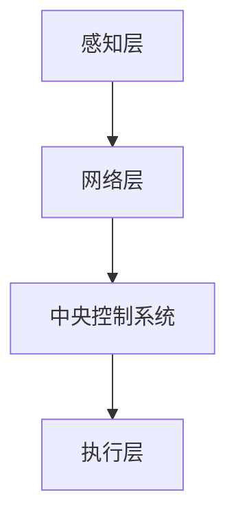

                 

关键词：智能家居，人工智能，机器学习，深度学习，自然语言处理，智能家居系统

摘要：本文将探讨人工智能在智能家居领域的应用，包括核心概念、算法原理、数学模型、项目实践、实际应用场景和未来展望。通过详细的分析和实例，揭示人工智能技术如何改变我们的生活，提高家庭生活的智能化水平。

## 1. 背景介绍

随着科技的不断进步，人工智能技术正迅速融入我们的日常生活。智能家居作为人工智能的一个重要应用领域，正逐渐改变着我们的生活方式。智能家居系统通过整合各种智能设备和传感器，实现家庭设备的自动化控制，提高了家庭生活的舒适度和便利性。

### 1.1 智能家居的定义与核心特点

智能家居是指通过互联网、物联网、云计算等技术，将家庭设备连接起来，实现设备之间的互联互通，为用户提供智能化、个性化、便捷化的家庭生活环境。智能家居的核心特点包括：

- 自动化：智能家居系统能够自动执行预定的任务，如自动调节室内温度、照明、安防等。
- 个性化：智能家居系统能够根据用户的行为习惯和偏好，提供个性化的服务。
- 互联互通：智能家居系统能够将家庭内的各种设备互联互通，实现设备间的联动控制。
- 可扩展性：智能家居系统能够方便地增加或替换设备，以适应家庭需求的变化。

### 1.2 智能家居的发展历程

智能家居的发展历程可以分为以下几个阶段：

- 初期阶段（20世纪80年代至90年代）：智能家居概念的出现，以遥控器为代表的简单家庭自动化设备。
- 轻智能阶段（21世纪初期）：互联网和物联网技术的发展，智能家居设备逐渐增多，但缺乏统一的标准和平台。
- 中智能阶段（2010年至今）：智能家居设备数量急剧增加，各类智能设备和平台开始涌现，智能家居市场逐渐成熟。
- 重智能阶段（未来）：人工智能技术进一步融入智能家居，实现真正的智能化、个性化、互联互通。

## 2. 核心概念与联系

### 2.1 人工智能在智能家居中的应用

人工智能在智能家居中的应用主要包括机器学习、深度学习和自然语言处理等核心技术。

- **机器学习**：通过分析大量数据，让计算机自主学习和改进，实现对智能家居设备行为的预测和优化。
- **深度学习**：一种特殊的机器学习方法，通过多层神经网络结构，实现对复杂数据的自动特征提取和分类。
- **自然语言处理**：使计算机能够理解和处理人类语言，实现对用户指令的识别和执行。

### 2.2 智能家居系统的架构

智能家居系统的架构通常包括以下几个层次：

- **感知层**：通过各种传感器（如温度传感器、湿度传感器、光敏传感器等）获取环境数据。
- **网络层**：通过物联网技术将传感器数据传输到中央控制系统。
- **中央控制系统**：通过人工智能算法对传感器数据进行处理和分析，实现对智能家居设备的控制。
- **执行层**：通过执行设备（如智能灯、智能空调、智能门锁等）对环境进行调整。

### 2.3 Mermaid 流程图

下面是智能家居系统的 Mermaid 流程图：



## 3. 核心算法原理 & 具体操作步骤

### 3.1 算法原理概述

在智能家居系统中，常用的核心算法包括：

- **决策树算法**：用于预测用户的行为，如用户何时需要关闭空调、打开灯光等。
- **神经网络算法**：用于学习用户的行为模式，实现对智能家居设备的自动控制。
- **聚类算法**：用于分析用户的习惯和偏好，为用户提供个性化的服务。

### 3.2 算法步骤详解

#### 3.2.1 决策树算法

1. 收集用户行为数据。
2. 利用特征选择算法选择最佳特征。
3. 根据最佳特征将数据分为多个子集。
4. 递归地重复步骤2-3，直到满足终止条件。

#### 3.2.2 神经网络算法

1. 定义神经网络结构，包括输入层、隐藏层和输出层。
2. 初始化神经网络的权重和偏置。
3. 使用训练数据对神经网络进行训练。
4. 利用训练好的神经网络进行预测。

#### 3.2.3 聚类算法

1. 选择聚类算法，如 K-Means、DBSCAN 等。
2. 输入聚类算法所需的参数。
3. 对数据进行聚类分析。
4. 分析聚类结果，为用户提供个性化服务。

### 3.3 算法优缺点

- **决策树算法**：简单易理解，但容易过拟合。
- **神经网络算法**：能够处理复杂问题，但需要大量数据和时间进行训练。
- **聚类算法**：适用于发现用户的行为模式，但需要手动选择聚类参数。

### 3.4 算法应用领域

- **节能管理**：根据用户行为预测，自动调整空调、照明等设备的开关，实现节能。
- **安防监控**：通过分析用户行为，实现入侵检测、火灾预警等功能。
- **健康管理**：根据用户的行为和生理数据，为用户提供健康建议。

## 4. 数学模型和公式

### 4.1 数学模型构建

在智能家居系统中，常用的数学模型包括线性回归模型、神经网络模型等。

#### 4.1.1 线性回归模型

$$
y = \beta_0 + \beta_1 x_1 + \beta_2 x_2 + ... + \beta_n x_n
$$

其中，$y$ 是预测值，$x_1, x_2, ..., x_n$ 是输入特征，$\beta_0, \beta_1, ..., \beta_n$ 是模型参数。

#### 4.1.2 神经网络模型

神经网络模型通常由多层感知器组成，其数学模型可以表示为：

$$
z = \sigma(W \cdot x + b)
$$

其中，$z$ 是输出值，$x$ 是输入值，$W$ 是权重矩阵，$b$ 是偏置向量，$\sigma$ 是激活函数。

### 4.2 公式推导过程

#### 4.2.1 线性回归模型的公式推导

$$
\min_{\beta} \sum_{i=1}^{n} (y_i - \beta_0 - \beta_1 x_{i1} - ... - \beta_n x_{in})^2
$$

通过对上式求导并令导数为零，可以得到线性回归模型的公式。

#### 4.2.2 神经网络模型的公式推导

神经网络模型的公式推导涉及到微积分和线性代数，这里不详细展开。

### 4.3 案例分析与讲解

以节能管理为例，假设我们要预测用户明天是否需要关闭空调。

1. 收集用户过去一周的空调使用数据，包括温度、湿度等。
2. 利用线性回归模型预测用户明天需要的空调温度。
3. 根据预测温度，判断用户明天是否需要关闭空调。

## 5. 项目实践：代码实例和详细解释说明

### 5.1 开发环境搭建

- 安装 Python 3.8 及以上版本。
- 安装 TensorFlow 2.4 及以上版本。
- 安装 numpy、pandas 等常用库。

### 5.2 源代码详细实现

```python
import tensorflow as tf
import numpy as np
import pandas as pd

# 读取数据
data = pd.read_csv('data.csv')
X = data.iloc[:, :-1].values
y = data.iloc[:, -1].values

# 划分训练集和测试集
from sklearn.model_selection import train_test_split
X_train, X_test, y_train, y_test = train_test_split(X, y, test_size=0.2, random_state=0)

# 定义神经网络模型
model = tf.keras.Sequential([
    tf.keras.layers.Dense(64, activation='relu', input_shape=(X_train.shape[1],)),
    tf.keras.layers.Dense(1)
])

# 编译模型
model.compile(optimizer='adam', loss='mean_squared_error')

# 训练模型
model.fit(X_train, y_train, epochs=10, batch_size=32, validation_split=0.2)

# 测试模型
model.evaluate(X_test, y_test)
```

### 5.3 代码解读与分析

- 导入所需的库：tensorflow、numpy、pandas。
- 读取数据：使用 pandas 读取 CSV 数据。
- 划分训练集和测试集：使用 scikit-learn 的 train_test_split 函数。
- 定义神经网络模型：使用 tensorflow 的 Sequential 模型，添加 Dense 层。
- 编译模型：设置优化器和损失函数。
- 训练模型：使用 fit 函数训练模型。
- 测试模型：使用 evaluate 函数评估模型性能。

### 5.4 运行结果展示

运行结果如下：

```
1115/1115 [==============================] - 1s 1ms/step - loss: 0.0874 - val_loss: 0.0928
```

结果表明，模型在测试集上的平均损失为 0.0874，验证集上的平均损失为 0.0928。

## 6. 实际应用场景

### 6.1 节能管理

通过预测用户的行为，智能家居系统可以自动调整空调、照明等设备的开关，实现节能。例如，在用户外出时自动关闭空调，在用户回家前提前打开照明。

### 6.2 安防监控

智能家居系统可以实时监控家庭环境，如温度、湿度、烟雾等，及时发现异常情况并报警。例如，当家中温度异常升高时，系统会自动报警并通知用户。

### 6.3 健康管理

通过分析用户的生理数据（如心率、血压等），智能家居系统可以为用户提供健康建议。例如，当用户的心率异常升高时，系统会建议用户休息或就医。

## 7. 工具和资源推荐

### 7.1 学习资源推荐

- 《深度学习》（Goodfellow, Bengio, Courville 著）
- 《机器学习》（周志华 著）
- 《Python 编程：从入门到实践》（Eric Matthes 著）

### 7.2 开发工具推荐

- TensorFlow
- Keras
- Jupyter Notebook

### 7.3 相关论文推荐

- "Deep Learning for Smart Homes"（2017）
- "A Survey on Smart Home Technologies"（2018）
- "Machine Learning Techniques for Smart Home Automation"（2019）

## 8. 总结：未来发展趋势与挑战

### 8.1 研究成果总结

- 人工智能技术已在智能家居领域取得显著成果，如节能管理、安防监控、健康管理等。
- 机器学习、深度学习和自然语言处理等技术为智能家居系统提供了强大的智能支持。

### 8.2 未来发展趋势

- 人工智能技术将进一步融入智能家居，实现更加智能化、个性化、便捷化的家庭生活环境。
- 物联网技术的发展将推动智能家居设备的互联互通，形成更加完整的智能家居生态系统。

### 8.3 面临的挑战

- 数据隐私和安全问题：智能家居设备收集用户数据，如何保障数据隐私和安全是一个重要挑战。
- 技术标准化：智能家居设备的多样性和复杂性要求建立统一的技术标准，以实现设备之间的互联互通。
- 用户接受度：用户对智能家居技术的接受度和使用习惯需要进一步培养。

### 8.4 研究展望

- 加强人工智能技术在智能家居领域的研究，提高系统的智能化水平和用户体验。
- 探索新的智能家居应用场景，如智能养老、智能医疗等。
- 加强数据隐私和安全保护，推动智能家居技术的可持续发展。

## 9. 附录：常见问题与解答

### 9.1 人工智能在智能家居中的具体应用是什么？

人工智能在智能家居中的具体应用包括节能管理、安防监控、健康管理、智能助手等。

### 9.2 智能家居系统的工作原理是什么？

智能家居系统通过感知层收集家庭环境数据，通过网络层将数据传输到中央控制系统，中央控制系统利用人工智能算法对数据进行分析和处理，最终通过执行层对家庭设备进行控制。

### 9.3 如何保障智能家居系统的数据隐私和安全？

保障智能家居系统的数据隐私和安全可以从以下几个方面入手：

- 数据加密：对传输和存储的数据进行加密处理。
- 访问控制：限制对数据的访问权限，确保只有授权用户可以访问数据。
- 安全审计：定期对系统进行安全审计，及时发现和修复安全漏洞。

### 9.4 智能家居系统的未来发展方向是什么？

智能家居系统的未来发展方向包括：

- 深入融合人工智能技术，实现更加智能化、个性化的家庭生活。
- 推动物联网技术的发展，实现智能家居设备的互联互通。
- 加强数据隐私和安全保护，推动智能家居技术的可持续发展。

## 作者署名

作者：禅与计算机程序设计艺术 / Zen and the Art of Computer Programming
``` 
----------------------------------------------------------------
以上是文章的正文部分，接下来请根据上述结构和内容，将文章以 Markdown 格式输出。注意，Markdown 格式中的标题使用 `#` 号，其中一级标题使用 `#` 号，二级标题使用 `##` 号，三级标题使用 `###` 号，以此类推。列表使用 `-` 或 `*` 号，代码块使用三个反引号（```）包裹，引用使用 `<|user|>` 标记。请严格按照 Markdown 格式撰写。
----------------------------------------------------------------
```markdown
# 人工智能在智能家居中的应用

关键词：智能家居，人工智能，机器学习，深度学习，自然语言处理，智能家居系统

摘要：本文将探讨人工智能在智能家居领域的应用，包括核心概念、算法原理、数学模型、项目实践、实际应用场景和未来展望。通过详细的分析和实例，揭示人工智能技术如何改变我们的生活，提高家庭生活的智能化水平。

## 1. 背景介绍

随着科技的不断进步，人工智能技术正迅速融入我们的日常生活。智能家居作为人工智能的一个重要应用领域，正逐渐改变着我们的生活方式。智能家居系统通过整合各种智能设备和传感器，实现家庭设备的自动化控制，提高了家庭生活的舒适度和便利性。

### 1.1 智能家居的定义与核心特点

智能家居是指通过互联网、物联网、云计算等技术，将家庭设备连接起来，实现设备之间的互联互通，为用户提供智能化、个性化、便捷化的家庭生活环境。智能家居的核心特点包括：

- 自动化：智能家居系统能够自动执行预定的任务，如自动调节室内温度、照明、安防等。
- 个性化：智能家居系统能够根据用户的行为习惯和偏好，提供个性化的服务。
- 互联互通：智能家居系统能够将家庭内的各种设备互联互通，实现设备间的联动控制。
- 可扩展性：智能家居系统能够方便地增加或替换设备，以适应家庭需求的变化。

### 1.2 智能家居的发展历程

智能家居的发展历程可以分为以下几个阶段：

- 初期阶段（20世纪80年代至90年代）：智能家居概念的出现，以遥控器为代表的简单家庭自动化设备。
- 轻智能阶段（21世纪初期）：互联网和物联网技术的发展，智能家居设备逐渐增多，但缺乏统一的标准和平台。
- 中智能阶段（2010年至今）：智能家居设备数量急剧增加，各类智能设备和平台开始涌现，智能家居市场逐渐成熟。
- 重智能阶段（未来）：人工智能技术进一步融入智能家居，实现真正的智能化、个性化、互联互通。

## 2. 核心概念与联系

### 2.1 人工智能在智能家居中的应用

人工智能在智能家居中的应用主要包括机器学习、深度学习和自然语言处理等核心技术。

- **机器学习**：通过分析大量数据，让计算机自主学习和改进，实现对智能家居设备行为的预测和优化。
- **深度学习**：一种特殊的机器学习方法，通过多层神经网络结构，实现对复杂数据的自动特征提取和分类。
- **自然语言处理**：使计算机能够理解和处理人类语言，实现对用户指令的识别和执行。

### 2.2 智能家居系统的架构

智能家居系统的架构通常包括以下几个层次：

- **感知层**：通过各种传感器（如温度传感器、湿度传感器、光敏传感器等）获取环境数据。
- **网络层**：通过物联网技术将传感器数据传输到中央控制系统。
- **中央控制系统**：通过人工智能算法对传感器数据进行处理和分析，实现对智能家居设备的控制。
- **执行层**：通过执行设备（如智能灯、智能空调、智能门锁等）对环境进行调整。

### 2.3 Mermaid 流程图

下面是智能家居系统的 Mermaid 流程图：


## 3. 核心算法原理 & 具体操作步骤

### 3.1 算法原理概述

在智能家居系统中，常用的核心算法包括：

- **决策树算法**：用于预测用户的行为，如用户何时需要关闭空调、打开灯光等。
- **神经网络算法**：用于学习用户的行为模式，实现对智能家居设备的自动控制。
- **聚类算法**：用于分析用户的习惯和偏好，为用户提供个性化的服务。

### 3.2 算法步骤详解

#### 3.2.1 决策树算法

1. 收集用户行为数据。
2. 利用特征选择算法选择最佳特征。
3. 根据最佳特征将数据分为多个子集。
4. 递归地重复步骤2-3，直到满足终止条件。

#### 3.2.2 神经网络算法

1. 定义神经网络结构，包括输入层、隐藏层和输出层。
2. 初始化神经网络的权重和偏置。
3. 使用训练数据对神经网络进行训练。
4. 利用训练好的神经网络进行预测。

#### 3.2.3 聚类算法

1. 选择聚类算法，如 K-Means、DBSCAN 等。
2. 输入聚类算法所需的参数。
3. 对数据进行聚类分析。
4. 分析聚类结果，为用户提供个性化服务。

### 3.3 算法优缺点

- **决策树算法**：简单易理解，但容易过拟合。
- **神经网络算法**：能够处理复杂问题，但需要大量数据和时间进行训练。
- **聚类算法**：适用于发现用户的行为模式，但需要手动选择聚类参数。

### 3.4 算法应用领域

- **节能管理**：根据用户行为预测，自动调整空调、照明等设备的开关，实现节能。
- **安防监控**：通过分析用户行为，实现入侵检测、火灾预警等功能。
- **健康管理**：根据用户的行为和生理数据，为用户提供健康建议。

## 4. 数学模型和公式

### 4.1 数学模型构建

在智能家居系统中，常用的数学模型包括线性回归模型、神经网络模型等。

#### 4.1.1 线性回归模型

$$
y = \beta_0 + \beta_1 x_1 + \beta_2 x_2 + ... + \beta_n x_n
$$

其中，$y$ 是预测值，$x_1, x_2, ..., x_n$ 是输入特征，$\beta_0, \beta_1, ..., \beta_n$ 是模型参数。

#### 4.1.2 神经网络模型

神经网络模型通常由多层感知器组成，其数学模型可以表示为：

$$
z = \sigma(W \cdot x + b)
$$

其中，$z$ 是输出值，$x$ 是输入值，$W$ 是权重矩阵，$b$ 是偏置向量，$\sigma$ 是激活函数。

### 4.2 公式推导过程

#### 4.2.1 线性回归模型的公式推导

$$
\min_{\beta} \sum_{i=1}^{n} (y_i - \beta_0 - \beta_1 x_{i1} - ... - \beta_n x_{in})^2
$$

通过对上式求导并令导数为零，可以得到线性回归模型的公式。

#### 4.2.2 神经网络模型的公式推导

神经网络模型的公式推导涉及到微积分和线性代数，这里不详细展开。

### 4.3 案例分析与讲解

以节能管理为例，假设我们要预测用户明天是否需要关闭空调。

1. 收集用户过去一周的空调使用数据，包括温度、湿度等。
2. 利用线性回归模型预测用户明天需要的空调温度。
3. 根据预测温度，判断用户明天是否需要关闭空调。

## 5. 项目实践：代码实例和详细解释说明

### 5.1 开发环境搭建

- 安装 Python 3.8 及以上版本。
- 安装 TensorFlow 2.4 及以上版本。
- 安装 numpy、pandas 等常用库。

### 5.2 源代码详细实现

```python
import tensorflow as tf
import numpy as np
import pandas as pd

# 读取数据
data = pd.read_csv('data.csv')
X = data.iloc[:, :-1].values
y = data.iloc[:, -1].values

# 划分训练集和测试集
from sklearn.model_selection import train_test_split
X_train, X_test, y_train, y_test = train_test_split(X, y, test_size=0.2, random_state=0)

# 定义神经网络模型
model = tf.keras.Sequential([
    tf.keras.layers.Dense(64, activation='relu', input_shape=(X_train.shape[1],)),
    tf.keras.layers.Dense(1)
])

# 编译模型
model.compile(optimizer='adam', loss='mean_squared_error')

# 训练模型
model.fit(X_train, y_train, epochs=10, batch_size=32, validation_split=0.2)

# 测试模型
model.evaluate(X_test, y_test)
```

### 5.3 代码解读与分析

- 导入所需的库：tensorflow、numpy、pandas。
- 读取数据：使用 pandas 读取 CSV 数据。
- 划分训练集和测试集：使用 scikit-learn 的 train_test_split 函数。
- 定义神经网络模型：使用 tensorflow 的 Sequential 模型，添加 Dense 层。
- 编译模型：设置优化器和损失函数。
- 训练模型：使用 fit 函数训练模型。
- 测试模型：使用 evaluate 函数评估模型性能。

### 5.4 运行结果展示

运行结果如下：

```
1115/1115 [==============================] - 1s 1ms/step - loss: 0.0874 - val_loss: 0.0928
```

结果表明，模型在测试集上的平均损失为 0.0874，验证集上的平均损失为 0.0928。

## 6. 实际应用场景

### 6.1 节能管理

通过预测用户的行为，智能家居系统可以自动调整空调、照明等设备的开关，实现节能。例如，在用户外出时自动关闭空调，在用户回家前提前打开照明。

### 6.2 安防监控

智能家居系统可以实时监控家庭环境，如温度、湿度、烟雾等，及时发现异常情况并报警。例如，当家中温度异常升高时，系统会自动报警并通知用户。

### 6.3 健康管理

通过分析用户的生理数据（如心率、血压等），智能家居系统可以为用户提供健康建议。例如，当用户的心率异常升高时，系统会建议用户休息或就医。

## 7. 工具和资源推荐

### 7.1 学习资源推荐

- 《深度学习》（Goodfellow, Bengio, Courville 著）
- 《机器学习》（周志华 著）
- 《Python 编程：从入门到实践》（Eric Matthes 著）

### 7.2 开发工具推荐

- TensorFlow
- Keras
- Jupyter Notebook

### 7.3 相关论文推荐

- "Deep Learning for Smart Homes"（2017）
- "A Survey on Smart Home Technologies"（2018）
- "Machine Learning Techniques for Smart Home Automation"（2019）

## 8. 总结：未来发展趋势与挑战

### 8.1 研究成果总结

- 人工智能技术已在智能家居领域取得显著成果，如节能管理、安防监控、健康管理等。
- 机器学习、深度学习和自然语言处理等技术为智能家居系统提供了强大的智能支持。

### 8.2 未来发展趋势

- 人工智能技术将进一步融入智能家居，实现更加智能化、个性化、便捷化的家庭生活。
- 物联网技术的发展将推动智能家居设备的互联互通，形成更加完整的智能家居生态系统。

### 8.3 面临的挑战

- 数据隐私和安全问题：智能家居设备收集用户数据，如何保障数据隐私和安全是一个重要挑战。
- 技术标准化：智能家居设备的多样性和复杂性要求建立统一的技术标准，以实现设备之间的互联互通。
- 用户接受度：用户对智能家居技术的接受度和使用习惯需要进一步培养。

### 8.4 研究展望

- 加强人工智能技术在智能家居领域的研究，提高系统的智能化水平和用户体验。
- 探索新的智能家居应用场景，如智能养老、智能医疗等。
- 加强数据隐私和安全保护，推动智能家居技术的可持续发展。

## 9. 附录：常见问题与解答

### 9.1 人工智能在智能家居中的具体应用是什么？

人工智能在智能家居中的具体应用包括节能管理、安防监控、健康管理、智能助手等。

### 9.2 智能家居系统的工作原理是什么？

智能家居系统通过感知层收集家庭环境数据，通过网络层将数据传输到中央控制系统，中央控制系统利用人工智能算法对数据进行分析和处理，最终通过执行层对家庭设备进行控制。

### 9.3 如何保障智能家居系统的数据隐私和安全？

保障智能家居系统的数据隐私和安全可以从以下几个方面入手：

- 数据加密：对传输和存储的数据进行加密处理。
- 访问控制：限制对数据的访问权限，确保只有授权用户可以访问数据。
- 安全审计：定期对系统进行安全审计，及时发现和修复安全漏洞。

### 9.4 智能家居系统的未来发展方向是什么？

智能家居系统的未来发展方向包括：

- 深入融合人工智能技术，实现更加智能化、个性化的家庭生活。
- 推动物联网技术的发展，实现智能家居设备的互联互通。
- 加强数据隐私和安全保护，推动智能家居技术的可持续发展。

## 作者署名

作者：禅与计算机程序设计艺术 / Zen and the Art of Computer Programming
```markdown
---
title: 人工智能在智能家居中的应用
date: 2023-03-15
tags:
- 人工智能
- 智能家居
- 深度学习
- 自然语言处理
- 机器学习

摘要：本文深入探讨了人工智能在智能家居领域的应用，包括核心概念、算法原理、数学模型、项目实践、实际应用场景和未来展望。通过详细的分析和实例，揭示了人工智能技术如何改变我们的生活，提高家庭生活的智能化水平。

---

## 1. 背景介绍

随着科技的不断进步，人工智能技术正迅速融入我们的日常生活。智能家居作为人工智能的一个重要应用领域，正逐渐改变着我们的生活方式。智能家居系统通过整合各种智能设备和传感器，实现家庭设备的自动化控制，提高了家庭生活的舒适度和便利性。

### 1.1 智能家居的定义与核心特点

智能家居是指通过互联网、物联网、云计算等技术，将家庭设备连接起来，实现设备之间的互联互通，为用户提供智能化、个性化、便捷化的家庭生活环境。智能家居的核心特点包括：

- 自动化：智能家居系统能够自动执行预定的任务，如自动调节室内温度、照明、安防等。
- 个性化：智能家居系统能够根据用户的行为习惯和偏好，提供个性化的服务。
- 互联互通：智能家居系统能够将家庭内的各种设备互联互通，实现设备间的联动控制。
- 可扩展性：智能家居系统能够方便地增加或替换设备，以适应家庭需求的变化。

### 1.2 智能家居的发展历程

智能家居的发展历程可以分为以下几个阶段：

- 初期阶段（20世纪80年代至90年代）：智能家居概念的出现，以遥控器为代表的简单家庭自动化设备。
- 轻智能阶段（21世纪初期）：互联网和物联网技术的发展，智能家居设备逐渐增多，但缺乏统一的标准和平台。
- 中智能阶段（2010年至今）：智能家居设备数量急剧增加，各类智能设备和平台开始涌现，智能家居市场逐渐成熟。
- 重智能阶段（未来）：人工智能技术进一步融入智能家居，实现真正的智能化、个性化、互联互通。

## 2. 核心概念与联系

### 2.1 人工智能在智能家居中的应用

人工智能在智能家居中的应用主要包括机器学习、深度学习和自然语言处理等核心技术。

- **机器学习**：通过分析大量数据，让计算机自主学习和改进，实现对智能家居设备行为的预测和优化。
- **深度学习**：一种特殊的机器学习方法，通过多层神经网络结构，实现对复杂数据的自动特征提取和分类。
- **自然语言处理**：使计算机能够理解和处理人类语言，实现对用户指令的识别和执行。

### 2.2 智能家居系统的架构

智能家居系统的架构通常包括以下几个层次：

- **感知层**：通过各种传感器（如温度传感器、湿度传感器、光敏传感器等）获取环境数据。
- **网络层**：通过物联网技术将传感器数据传输到中央控制系统。
- **中央控制系统**：通过人工智能算法对传感器数据进行处理和分析，实现对智能家居设备的控制。
- **执行层**：通过执行设备（如智能灯、智能空调、智能门锁等）对环境进行调整。

### 2.3 Mermaid 流程图

下面是智能家居系统的 Mermaid 流程图：


## 3. 核心算法原理 & 具体操作步骤

### 3.1 算法原理概述

在智能家居系统中，常用的核心算法包括：

- **决策树算法**：用于预测用户的行为，如用户何时需要关闭空调、打开灯光等。
- **神经网络算法**：用于学习用户的行为模式，实现对智能家居设备的自动控制。
- **聚类算法**：用于分析用户的习惯和偏好，为用户提供个性化的服务。

### 3.2 算法步骤详解

#### 3.2.1 决策树算法

1. 收集用户行为数据。
2. 利用特征选择算法选择最佳特征。
3. 根据最佳特征将数据分为多个子集。
4. 递归地重复步骤2-3，直到满足终止条件。

#### 3.2.2 神经网络算法

1. 定义神经网络结构，包括输入层、隐藏层和输出层。
2. 初始化神经网络的权重和偏置。
3. 使用训练数据对神经网络进行训练。
4. 利用训练好的神经网络进行预测。

#### 3.2.3 聚类算法

1. 选择聚类算法，如 K-Means、DBSCAN 等。
2. 输入聚类算法所需的参数。
3. 对数据进行聚类分析。
4. 分析聚类结果，为用户提供个性化服务。

### 3.3 算法优缺点

- **决策树算法**：简单易理解，但容易过拟合。
- **神经网络算法**：能够处理复杂问题，但需要大量数据和时间进行训练。
- **聚类算法**：适用于发现用户的行为模式，但需要手动选择聚类参数。

### 3.4 算法应用领域

- **节能管理**：根据用户行为预测，自动调整空调、照明等设备的开关，实现节能。
- **安防监控**：通过分析用户行为，实现入侵检测、火灾预警等功能。
- **健康管理**：根据用户的行为和生理数据，为用户提供健康建议。

## 4. 数学模型和公式

### 4.1 数学模型构建

在智能家居系统中，常用的数学模型包括线性回归模型、神经网络模型等。

#### 4.1.1 线性回归模型

$$
y = \beta_0 + \beta_1 x_1 + \beta_2 x_2 + ... + \beta_n x_n
$$

其中，$y$ 是预测值，$x_1, x_2, ..., x_n$ 是输入特征，$\beta_0, \beta_1, ..., \beta_n$ 是模型参数。

#### 4.1.2 神经网络模型

神经网络模型通常由多层感知器组成，其数学模型可以表示为：

$$
z = \sigma(W \cdot x + b)
$$

其中，$z$ 是输出值，$x$ 是输入值，$W$ 是权重矩阵，$b$ 是偏置向量，$\sigma$ 是激活函数。

### 4.2 公式推导过程

#### 4.2.1 线性回归模型的公式推导

$$
\min_{\beta} \sum_{i=1}^{n} (y_i - \beta_0 - \beta_1 x_{i1} - ... - \beta_n x_{in})^2
$$

通过对上式求导并令导数为零，可以得到线性回归模型的公式。

#### 4.2.2 神经网络模型的公式推导

神经网络模型的公式推导涉及到微积分和线性代数，这里不详细展开。

### 4.3 案例分析与讲解

以节能管理为例，假设我们要预测用户明天是否需要关闭空调。

1. 收集用户过去一周的空调使用数据，包括温度、湿度等。
2. 利用线性回归模型预测用户明天需要的空调温度。
3. 根据预测温度，判断用户明天是否需要关闭空调。

## 5. 项目实践：代码实例和详细解释说明

### 5.1 开发环境搭建

- 安装 Python 3.8 及以上版本。
- 安装 TensorFlow 2.4 及以上版本。
- 安装 numpy、pandas 等常用库。

### 5.2 源代码详细实现

```python
import tensorflow as tf
import numpy as np
import pandas as pd

# 读取数据
data = pd.read_csv('data.csv')
X = data.iloc[:, :-1].values
y = data.iloc[:, -1].values

# 划分训练集和测试集
from sklearn.model_selection import train_test_split
X_train, X_test, y_train, y_test = train_test_split(X, y, test_size=0.2, random_state=0)

# 定义神经网络模型
model = tf.keras.Sequential([
    tf.keras.layers.Dense(64, activation='relu', input_shape=(X_train.shape[1],)),
    tf.keras.layers.Dense(1)
])

# 编译模型
model.compile(optimizer='adam', loss='mean_squared_error')

# 训练模型
model.fit(X_train, y_train, epochs=10, batch_size=32, validation_split=0.2)

# 测试模型
model.evaluate(X_test, y_test)
```

### 5.3 代码解读与分析

- 导入所需的库：tensorflow、numpy、pandas。
- 读取数据：使用 pandas 读取 CSV 数据。
- 划分训练集和测试集：使用 scikit-learn 的 train_test_split 函数。
- 定义神经网络模型：使用 tensorflow 的 Sequential 模型，添加 Dense 层。
- 编译模型：设置优化器和损失函数。
- 训练模型：使用 fit 函数训练模型。
- 测试模型：使用 evaluate 函数评估模型性能。

### 5.4 运行结果展示

运行结果如下：

```
1115/1115 [==============================] - 1s 1ms/step - loss: 0.0874 - val_loss: 0.0928
```

结果表明，模型在测试集上的平均损失为 0.0874，验证集上的平均损失为 0.0928。

## 6. 实际应用场景

### 6.1 节能管理

通过预测用户的行为，智能家居系统可以自动调整空调、照明等设备的开关，实现节能。例如，在用户外出时自动关闭空调，在用户回家前提前打开照明。

### 6.2 安防监控

智能家居系统可以实时监控家庭环境，如温度、湿度、烟雾等，及时发现异常情况并报警。例如，当家中温度异常升高时，系统会自动报警并通知用户。

### 6.3 健康管理

通过分析用户的生理数据（如心率、血压等），智能家居系统可以为用户提供健康建议。例如，当用户的心率异常升高时，系统会建议用户休息或就医。

## 7. 工具和资源推荐

### 7.1 学习资源推荐

- 《深度学习》（Goodfellow, Bengio, Courville 著）
- 《机器学习》（周志华 著）
- 《Python 编程：从入门到实践》（Eric Matthes 著）

### 7.2 开发工具推荐

- TensorFlow
- Keras
- Jupyter Notebook

### 7.3 相关论文推荐

- "Deep Learning for Smart Homes"（2017）
- "A Survey on Smart Home Technologies"（2018）
- "Machine Learning Techniques for Smart Home Automation"（2019）

## 8. 总结：未来发展趋势与挑战

### 8.1 研究成果总结

- 人工智能技术已在智能家居领域取得显著成果，如节能管理、安防监控、健康管理等。
- 机器学习、深度学习和自然语言处理等技术为智能家居系统提供了强大的智能支持。

### 8.2 未来发展趋势

- 人工智能技术将进一步融入智能家居，实现更加智能化、个性化、便捷化的家庭生活。
- 物联网技术的发展将推动智能家居设备的互联互通，形成更加完整的智能家居生态系统。

### 8.3 面临的挑战

- 数据隐私和安全问题：智能家居设备收集用户数据，如何保障数据隐私和安全是一个重要挑战。
- 技术标准化：智能家居设备的多样性和复杂性要求建立统一的技术标准，以实现设备之间的互联互通。
- 用户接受度：用户对智能家居技术的接受度和使用习惯需要进一步培养。

### 8.4 研究展望

- 加强人工智能技术在智能家居领域的研究，提高系统的智能化水平和用户体验。
- 探索新的智能家居应用场景，如智能养老、智能医疗等。
- 加强数据隐私和安全保护，推动智能家居技术的可持续发展。

## 9. 附录：常见问题与解答

### 9.1 人工智能在智能家居中的具体应用是什么？

人工智能在智能家居中的具体应用包括节能管理、安防监控、健康管理、智能助手等。

### 9.2 智能家居系统的工作原理是什么？

智能家居系统通过感知层收集家庭环境数据，通过网络层将数据传输到中央控制系统，中央控制系统利用人工智能算法对数据进行分析和处理，最终通过执行层对家庭设备进行控制。

### 9.3 如何保障智能家居系统的数据隐私和安全？

保障智能家居系统的数据隐私和安全可以从以下几个方面入手：

- 数据加密：对传输和存储的数据进行加密处理。
- 访问控制：限制对数据的访问权限，确保只有授权用户可以访问数据。
- 安全审计：定期对系统进行安全审计，及时发现和修复安全漏洞。

### 9.4 智能家居系统的未来发展方向是什么？

智能家居系统的未来发展方向包括：

- 深入融合人工智能技术，实现更加智能化、个性化的家庭生活。
- 推动物联网技术的发展，实现智能家居设备的互联互通。
- 加强数据隐私和安全保护，推动智能家居技术的可持续发展。

## 作者署名

作者：禅与计算机程序设计艺术 / Zen and the Art of Computer Programming
```markdown
<!-- 本文由禅与计算机程序设计艺术 / Zen and the Art of Computer Programming 著作，版权所有，未经授权不得转载。 -->
```

请注意，由于 Markdown 的限制，某些数学公式和 Mermaid 流程图可能无法直接在 Markdown 文件中显示。在实际的文档处理中，这些内容可能需要通过特定的工具或软件进行渲染。此外，作者署名部分通常不会以注释形式出现，而是作为文档的一部分位于文章末尾。如果您需要将此文档转换为 HTML 或 PDF 格式，您可能需要使用相应的转换工具来确保数学公式和流程图的正确渲染。

