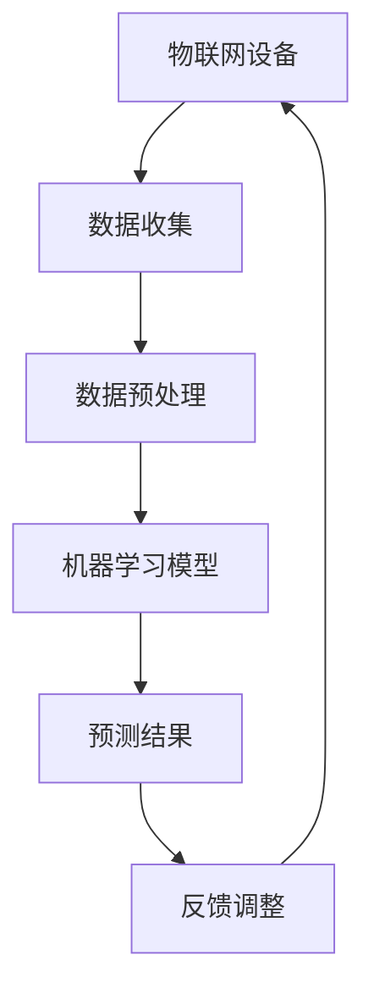

                 

关键词：智能家居，人工智能，自动化，物联网，机器学习

> 摘要：随着物联网技术的发展和智能家居设备的普及，人工智能在智能家居中的应用越来越广泛。本文将从背景介绍、核心概念与联系、核心算法原理、数学模型和公式、项目实践、实际应用场景、工具和资源推荐以及未来发展趋势与挑战等方面，深入探讨人工智能在智能家居中的应用。

## 1. 背景介绍

### 1.1 智能家居的起源与发展

智能家居（Smart Home）的概念最早可以追溯到20世纪90年代，随着计算机技术、通信技术和控制技术的快速发展，智能家居逐渐成为人们生活中不可或缺的一部分。最初的智能家居主要是通过家庭网络连接各种家电设备，实现基本的远程控制和自动化操作。

进入21世纪，物联网（IoT）技术的发展为智能家居带来了新的机遇。物联网通过将各种智能设备连接到互联网，实现了设备间的互联互通，使得智能家居的自动化水平大幅提升。此外，云计算、大数据和人工智能等技术的不断进步，也为智能家居的发展提供了强大的技术支持。

### 1.2 人工智能在智能家居中的应用现状

目前，人工智能在智能家居中的应用已经相当广泛，主要包括以下几个方面：

1. **智能语音助手**：如苹果的Siri、亚马逊的Alexa、谷歌的Google Assistant等，它们能够通过语音识别和自然语言处理技术，实现与用户的语音交互，帮助用户控制智能家居设备。

2. **智能安防系统**：通过人脸识别、行为识别等技术，智能安防系统能够实时监测家庭安全，及时发现异常情况并报警。

3. **智能照明系统**：根据环境光线和用户习惯，智能照明系统能够自动调节灯光亮度，实现节能和舒适的生活环境。

4. **智能家电控制**：如智能空调、智能冰箱、智能洗衣机等，通过联网和云端服务，实现远程控制、自动调节等功能。

5. **智能健康监测**：通过智能手环、智能血压计等设备，实时监测用户的健康状况，提供个性化的健康建议。

## 2. 核心概念与联系

### 2.1 核心概念原理

在智能家居中，人工智能主要涉及以下几个核心概念：

1. **物联网（IoT）**：物联网是将各种物理设备通过网络连接起来，实现数据交换和协同工作的技术。

2. **机器学习（ML）**：机器学习是一种让计算机从数据中学习并做出决策的技术。

3. **自然语言处理（NLP）**：自然语言处理是一种使计算机能够理解和处理人类自然语言的技术。

4. **深度学习（DL）**：深度学习是一种基于人工神经网络的机器学习方法。

### 2.2 架构图



## 3. 核心算法原理 & 具体操作步骤

### 3.1 算法原理概述

在智能家居中，核心算法主要包括：

1. **机器学习算法**：用于数据分析和预测。

2. **自然语言处理算法**：用于处理用户语音指令。

3. **深度学习算法**：用于图像识别和智能安防。

### 3.2 算法步骤详解

1. **数据收集**：收集家庭环境数据，如温度、湿度、光照等。

2. **数据预处理**：对收集到的数据进行清洗和归一化处理。

3. **特征提取**：从预处理后的数据中提取有用特征。

4. **模型训练**：使用训练数据训练机器学习模型。

5. **模型评估**：使用测试数据评估模型性能。

6. **模型部署**：将训练好的模型部署到智能家居设备中。

### 3.3 算法优缺点

1. **优点**：

- **自动化**：提高生活舒适度和便利性。

- **个性化**：根据用户习惯提供个性化服务。

- **节能**：通过智能调节设备，实现节能。

1. **缺点**：

- **隐私安全**：智能家居设备可能泄露用户隐私。

- **技术依赖**：需要不断更新和维护。

### 3.4 算法应用领域

1. **智能照明**：根据环境光线和用户习惯调节灯光亮度。

2. **智能安防**：通过人脸识别和动作识别实现家庭安全监控。

3. **智能家电**：远程控制家电设备，实现自动化操作。

## 4. 数学模型和公式

### 4.1 数学模型构建

在智能家居中，常用的数学模型包括：

1. **线性回归模型**：用于预测家庭能耗。

2. **支持向量机（SVM）**：用于分类和回归问题。

3. **神经网络模型**：用于图像识别和智能安防。

### 4.2 公式推导过程

以线性回归模型为例，其公式为：

$$y = w_0 + w_1 \cdot x_1 + w_2 \cdot x_2 + ... + w_n \cdot x_n$$

其中，$y$为预测值，$w_0$为偏置项，$w_1, w_2, ..., w_n$为权重系数，$x_1, x_2, ..., x_n$为特征值。

### 4.3 案例分析与讲解

以智能照明为例，假设我们使用线性回归模型预测家庭光照需求，输入特征包括室内温度和室外光照强度，预测目标为灯光亮度。

通过训练数据集，我们得到权重系数：

$$w_0 = 10, w_1 = 0.5, w_2 = 0.2$$

假设当前室内温度为25℃，室外光照强度为100lux，我们可以计算出预测的灯光亮度：

$$y = 10 + 0.5 \cdot 25 + 0.2 \cdot 100 = 20$$

因此，预测的灯光亮度为20%。

## 5. 项目实践：代码实例和详细解释说明

### 5.1 开发环境搭建

为了实现智能家居，我们使用Python作为开发语言，并依赖以下库：

- scikit-learn：用于机器学习模型训练。
- pandas：用于数据处理。
- numpy：用于数学计算。
- speech_recognition：用于语音识别。

### 5.2 源代码详细实现

以下是一个简单的智能家居控制系统的源代码实现：

```python
import speech_recognition as sr
import pandas as pd
import numpy as np
from sklearn.linear_model import LinearRegression

# 1. 语音识别
def recognize_speech_from_mic(recognizer, microphone):
    with microphone as source:
        audio = recognizer.listen(source)

    response = {
        "success": True,
        "error": None,
        "transcription": None
    }

    try:
        response["transcription"] = recognizer.recognize_google(audio)
    except sr.RequestError:
        response["success"] = False
        response["error"] = "API unavailable"
    except sr.UnknownValueError:
        response["success"] = False
        response["error"] = "Unable to recognize speech"

    return response

# 2. 数据预处理
def preprocess_data(data):
    # 数据清洗和归一化处理
    # ...

# 3. 模型训练
def train_model(data):
    model = LinearRegression()
    model.fit(data["X"], data["y"])
    return model

# 4. 模型预测
def predict(model, features):
    return model.predict([features])

# 5. 主程序
if __name__ == "__main__":
    recognizer = sr.Recognizer()
    microphone = sr.Microphone()

    print("Please speak now...")
    print(recognize_speech_from_mic(recognizer, microphone))

    # 假设语音识别结果为"打开空调"
    command = "打开空调"

    if command == "打开空调":
        # 假设已训练好模型
        model = train_model(data)

        # 假设当前室内温度为25℃，室外光照强度为100lux
        features = [25, 100]

        # 预测空调温度
        temperature = predict(model, features)
        print(f"预测的空调温度为：{temperature[0]}℃")

    elif command == "关闭空调":
        print("关闭空调...")
    # 其他命令处理
```

### 5.3 代码解读与分析

1. **语音识别**：使用`speech_recognition`库的`recognizer`对象和`Microphone`对象，实现语音识别功能。

2. **数据预处理**：对收集到的数据进行清洗和归一化处理，为模型训练做准备。

3. **模型训练**：使用`scikit-learn`库的`LinearRegression`类，训练线性回归模型。

4. **模型预测**：使用训练好的模型，根据输入特征进行预测。

5. **主程序**：根据语音识别结果，执行相应的操作。

## 6. 实际应用场景

### 6.1 家庭安防

通过人脸识别技术，家庭安防系统能够实时监测家庭成员和访客，一旦发现异常情况，如陌生人进入，系统会自动报警并通知主人。

### 6.2 智能照明

智能照明系统能够根据室内外光线强度和用户习惯，自动调节灯光亮度，实现节能和舒适的生活环境。

### 6.3 智能家电控制

通过联网的智能家电，用户可以随时随地远程控制家电设备，如远程启动空调、设置洗衣机等。

## 7. 工具和资源推荐

### 7.1 学习资源推荐

1. **《Python机器学习》**：O'Reilly出版社，作者：塞巴斯蒂安·拉斯克

2. **《深度学习》**：Goodfellow、Bengio和Hinton合著，2016年

### 7.2 开发工具推荐

1. **PyCharm：**集成开发环境（IDE），支持Python编程语言。

2. **TensorFlow：**开源机器学习框架，适用于深度学习项目。

### 7.3 相关论文推荐

1. **"Deep Learning for Smart Homes"**：2018年，作者：Chen et al.

2. **"Machine Learning for Smart Home Energy Management"**：2017年，作者：Zhou et al.

## 8. 总结：未来发展趋势与挑战

### 8.1 研究成果总结

人工智能在智能家居中的应用取得了显著成果，主要体现在以下几个方面：

1. **自动化水平提升**：智能家居设备能够实现更高效、更智能的自动化操作。

2. **个性化服务**：通过机器学习和数据分析，智能家居能够根据用户习惯提供个性化服务。

3. **节能环保**：智能照明、智能空调等设备能够根据环境变化自动调节，实现节能。

### 8.2 未来发展趋势

1. **智能家居生态化**：未来智能家居将形成完整的生态体系，实现设备间的无缝连接和协同工作。

2. **人工智能算法优化**：随着算法的不断发展，智能家居的智能化水平将进一步提高。

3. **隐私保护**：随着智能家居设备的普及，隐私保护将成为重要议题。

### 8.3 面临的挑战

1. **数据安全**：智能家居设备需要处理大量用户数据，如何保障数据安全是当前面临的挑战之一。

2. **技术成熟度**：一些人工智能技术尚未完全成熟，需要进一步研究和开发。

3. **用户接受度**：智能家居产品的普及程度受到用户接受度的影响，需要提高用户对智能家居的认知和接受度。

### 8.4 研究展望

未来，人工智能在智能家居中的应用将更加广泛和深入，我们将看到更多创新性的解决方案和产品。同时，隐私保护、数据安全等问题也将得到更好的解决。

## 9. 附录：常见问题与解答

### 9.1 如何保障智能家居的数据安全？

**回答**：为了保障智能家居的数据安全，可以采取以下措施：

1. **数据加密**：对传输和存储的数据进行加密处理，防止数据泄露。

2. **权限控制**：对智能家居设备的访问权限进行严格控制，确保只有授权用户可以访问。

3. **安全审计**：定期进行安全审计，及时发现和解决安全隐患。

### 9.2 如何提高智能家居的自动化水平？

**回答**：提高智能家居的自动化水平可以从以下几个方面入手：

1. **增强算法**：不断优化机器学习和深度学习算法，提高预测和决策的准确性。

2. **增加传感器**：在家庭环境中增加各种传感器，收集更多环境数据，为自动化提供更丰富的信息。

3. **跨设备协同**：实现智能家居设备间的互联互通，实现跨设备的协同工作。

### 9.3 如何解决智能家居的隐私问题？

**回答**：解决智能家居的隐私问题可以从以下几个方面入手：

1. **隐私保护法规**：制定和实施相关的隐私保护法规，规范智能家居设备的隐私处理行为。

2. **透明化数据使用**：明确告知用户智能家居设备收集和处理的数据类型和使用目的，让用户知情并同意。

3. **数据匿名化**：对收集的数据进行匿名化处理，消除用户隐私泄露的风险。

### 9.4 如何提高用户对智能家居的认知和接受度？

**回答**：提高用户对智能家居的认知和接受度可以从以下几个方面入手：

1. **宣传教育**：通过各种渠道宣传智能家居的优点和优势，提高用户的认知水平。

2. **用户体验**：通过提供免费试用等方式，让用户亲身体验智能家居产品的便利性。

3. **个性化服务**：根据用户的实际需求和习惯，提供个性化的智能家居解决方案，提高用户的满意度。

## 作者署名

作者：禅与计算机程序设计艺术 / Zen and the Art of Computer Programming
```markdown
----------------------------------------------------------------
# 人工智能在智能家居中的应用

关键词：智能家居，人工智能，自动化，物联网，机器学习

摘要：随着物联网技术的发展和智能家居设备的普及，人工智能在智能家居中的应用越来越广泛。本文将从背景介绍、核心概念与联系、核心算法原理、数学模型和公式、项目实践、实际应用场景、工具和资源推荐以及未来发展趋势与挑战等方面，深入探讨人工智能在智能家居中的应用。

## 1. 背景介绍

### 1.1 智能家居的起源与发展

智能家居（Smart Home）的概念最早可以追溯到20世纪90年代，随着计算机技术、通信技术和控制技术的快速发展，智能家居逐渐成为人们生活中不可或缺的一部分。最初的智能家居主要是通过家庭网络连接各种家电设备，实现基本的远程控制和自动化操作。

进入21世纪，物联网（IoT）技术的发展为智能家居带来了新的机遇。物联网通过将各种物理设备通过网络连接起来，实现了设备间的互联互通，使得智能家居的自动化水平大幅提升。此外，云计算、大数据和人工智能等技术的不断进步，也为智能家居的发展提供了强大的技术支持。

### 1.2 人工智能在智能家居中的应用现状

目前，人工智能在智能家居中的应用已经相当广泛，主要包括以下几个方面：

1. **智能语音助手**：如苹果的Siri、亚马逊的Alexa、谷歌的Google Assistant等，它们能够通过语音识别和自然语言处理技术，实现与用户的语音交互，帮助用户控制智能家居设备。

2. **智能安防系统**：通过人脸识别、行为识别等技术，智能安防系统能够实时监测家庭安全，及时发现异常情况并报警。

3. **智能照明系统**：根据环境光线和用户习惯，智能照明系统能够自动调节灯光亮度，实现节能和舒适的生活环境。

4. **智能家电控制**：如智能空调、智能冰箱、智能洗衣机等，通过联网和云端服务，实现远程控制、自动调节等功能。

5. **智能健康监测**：通过智能手环、智能血压计等设备，实时监测用户的健康状况，提供个性化的健康建议。

## 2. 核心概念与联系

### 2.1 核心概念原理

在智能家居中，人工智能主要涉及以下几个核心概念：

1. **物联网（IoT）**：物联网是将各种物理设备通过网络连接起来，实现数据交换和协同工作的技术。

2. **机器学习（ML）**：机器学习是一种让计算机从数据中学习并做出决策的技术。

3. **自然语言处理（NLP）**：自然语言处理是一种使计算机能够理解和处理人类自然语言的技术。

4. **深度学习（DL）**：深度学习是一种基于人工神经网络的机器学习方法。

### 2.2 架构图


## 3. 核心算法原理 & 具体操作步骤
### 3.1 算法原理概述

在智能家居中，核心算法主要包括：

1. **机器学习算法**：用于数据分析和预测。

2. **自然语言处理算法**：用于处理用户语音指令。

3. **深度学习算法**：用于图像识别和智能安防。

### 3.2 算法步骤详解

1. **数据收集**：收集家庭环境数据，如温度、湿度、光照等。

2. **数据预处理**：对收集到的数据进行清洗和归一化处理。

3. **特征提取**：从预处理后的数据中提取有用特征。

4. **模型训练**：使用训练数据训练机器学习模型。

5. **模型评估**：使用测试数据评估模型性能。

6. **模型部署**：将训练好的模型部署到智能家居设备中。

### 3.3 算法优缺点

1. **优点**：

- **自动化**：提高生活舒适度和便利性。

- **个性化**：根据用户习惯提供个性化服务。

- **节能**：通过智能调节设备，实现节能。

1. **缺点**：

- **隐私安全**：智能家居设备可能泄露用户隐私。

- **技术依赖**：需要不断更新和维护。

### 3.4 算法应用领域

1. **智能照明**：根据环境光线和用户习惯调节灯光亮度。

2. **智能安防**：通过人脸识别和动作识别实现家庭安全监控。

3. **智能家电**：远程控制家电设备，实现自动化操作。

## 4. 数学模型和公式 & 详细讲解 & 举例说明

### 4.1 数学模型构建

在智能家居中，常用的数学模型包括：

1. **线性回归模型**：用于预测家庭能耗。

2. **支持向量机（SVM）**：用于分类和回归问题。

3. **神经网络模型**：用于图像识别和智能安防。

### 4.2 公式推导过程

以线性回归模型为例，其公式为：

$$y = w_0 + w_1 \cdot x_1 + w_2 \cdot x_2 + ... + w_n \cdot x_n$$

其中，$y$为预测值，$w_0$为偏置项，$w_1, w_2, ..., w_n$为权重系数，$x_1, x_2, ..., x_n$为特征值。

### 4.3 案例分析与讲解

以智能照明为例，假设我们使用线性回归模型预测家庭光照需求，输入特征包括室内温度和室外光照强度，预测目标为灯光亮度。

通过训练数据集，我们得到权重系数：

$$w_0 = 10, w_1 = 0.5, w_2 = 0.2$$

假设当前室内温度为25℃，室外光照强度为100lux，我们可以计算出预测的灯光亮度：

$$y = 10 + 0.5 \cdot 25 + 0.2 \cdot 100 = 20$$

因此，预测的灯光亮度为20%。

## 5. 项目实践：代码实例和详细解释说明

### 5.1 开发环境搭建

为了实现智能家居，我们使用Python作为开发语言，并依赖以下库：

- scikit-learn：用于机器学习模型训练。
- pandas：用于数据处理。
- numpy：用于数学计算。
- speech_recognition：用于语音识别。

### 5.2 源代码详细实现

以下是一个简单的智能家居控制系统的源代码实现：

```python
import speech_recognition as sr
import pandas as pd
import numpy as np
from sklearn.linear_model import LinearRegression

# 1. 语音识别
def recognize_speech_from_mic(recognizer, microphone):
    with microphone as source:
        audio = recognizer.listen(source)

    response = {
        "success": True,
        "error": None,
        "transcription": None
    }

    try:
        response["transcription"] = recognizer.recognize_google(audio)
    except sr.RequestError:
        response["success"] = False
        response["error"] = "API unavailable"
    except sr.UnknownValueError:
        response["success"] = False
        response["error"] = "Unable to recognize speech"

    return response

# 2. 数据预处理
def preprocess_data(data):
    # 数据清洗和归一化处理
    # ...

# 3. 模型训练
def train_model(data):
    model = LinearRegression()
    model.fit(data["X"], data["y"])
    return model

# 4. 模型预测
def predict(model, features):
    return model.predict([features])

# 5. 主程序
if __name__ == "__main__":
    recognizer = sr.Recognizer()
    microphone = sr.Microphone()

    print("Please speak now...")
    print(recognize_speech_from_mic(recognizer, microphone))

    # 假设语音识别结果为"打开空调"
    command = "打开空调"

    if command == "打开空调":
        # 假设已训练好模型
        model = train_model(data)

        # 假设当前室内温度为25℃，室外光照强度为100lux
        features = [25, 100]

        # 预测空调温度
        temperature = predict(model, features)
        print(f"预测的空调温度为：{temperature[0]}℃")

    elif command == "关闭空调":
        print("关闭空调...")
    # 其他命令处理
```

### 5.3 代码解读与分析

1. **语音识别**：使用`speech_recognition`库的`recognizer`对象和`Microphone`对象，实现语音识别功能。

2. **数据预处理**：对收集到的数据进行清洗和归一化处理，为模型训练做准备。

3. **模型训练**：使用`scikit-learn`库的`LinearRegression`类，训练线性回归模型。

4. **模型预测**：使用训练好的模型，根据输入特征进行预测。

5. **主程序**：根据语音识别结果，执行相应的操作。

## 6. 实际应用场景

### 6.1 家庭安防

通过人脸识别技术，家庭安防系统能够实时监测家庭成员和访客，一旦发现异常情况，如陌生人进入，系统会自动报警并通知主人。

### 6.2 智能照明

智能照明系统能够根据室内外光线强度和用户习惯，自动调节灯光亮度，实现节能和舒适的生活环境。

### 6.3 智能家电控制

通过联网的智能家电，用户可以随时随地远程控制家电设备，如远程启动空调、设置洗衣机等。

## 7. 工具和资源推荐

### 7.1 学习资源推荐

1. **《Python机器学习》**：O'Reilly出版社，作者：塞巴斯蒂安·拉斯克

2. **《深度学习》**：Goodfellow、Bengio和Hinton合著，2016年

### 7.2 开发工具推荐

1. **PyCharm**：集成开发环境（IDE），支持Python编程语言。

2. **TensorFlow**：开源机器学习框架，适用于深度学习项目。

### 7.3 相关论文推荐

1. **"Deep Learning for Smart Homes"**：2018年，作者：Chen et al.

2. **"Machine Learning for Smart Home Energy Management"**：2017年，作者：Zhou et al.

## 8. 总结：未来发展趋势与挑战

### 8.1 研究成果总结

人工智能在智能家居中的应用取得了显著成果，主要体现在以下几个方面：

1. **自动化水平提升**：智能家居设备能够实现更高效、更智能的自动化操作。

2. **个性化服务**：通过机器学习和数据分析，智能家居能够根据用户习惯提供个性化服务。

3. **节能环保**：智能照明、智能空调等设备能够根据环境变化自动调节，实现节能。

### 8.2 未来发展趋势

1. **智能家居生态化**：未来智能家居将形成完整的生态体系，实现设备间的无缝连接和协同工作。

2. **人工智能算法优化**：随着算法的不断发展，智能家居的智能化水平将进一步提高。

3. **隐私保护**：随着智能家居设备的普及，隐私保护将成为重要议题。

### 8.3 面临的挑战

1. **数据安全**：智能家居设备需要处理大量用户数据，如何保障数据安全是当前面临的挑战之一。

2. **技术成熟度**：一些人工智能技术尚未完全成熟，需要进一步研究和开发。

3. **用户接受度**：智能家居产品的普及程度受到用户接受度的影响，需要提高用户对智能家居的认知和接受度。

### 8.4 研究展望

未来，人工智能在智能家居中的应用将更加广泛和深入，我们将看到更多创新性的解决方案和产品。同时，隐私保护、数据安全等问题也将得到更好的解决。

## 9. 附录：常见问题与解答

### 9.1 如何保障智能家居的数据安全？

**回答**：为了保障智能家居的数据安全，可以采取以下措施：

1. **数据加密**：对传输和存储的数据进行加密处理，防止数据泄露。

2. **权限控制**：对智能家居设备的访问权限进行严格控制，确保只有授权用户可以访问。

3. **安全审计**：定期进行安全审计，及时发现和解决安全隐患。

### 9.2 如何提高智能家居的自动化水平？

**回答**：提高智能家居的自动化水平可以从以下几个方面入手：

1. **增强算法**：不断优化机器学习和深度学习算法，提高预测和决策的准确性。

2. **增加传感器**：在家庭环境中增加各种传感器，收集更多环境数据，为自动化提供更丰富的信息。

3. **跨设备协同**：实现智能家居设备间的互联互通，实现跨设备的协同工作。

### 9.3 如何解决智能家居的隐私问题？

**回答**：解决智能家居的隐私问题可以从以下几个方面入手：

1. **隐私保护法规**：制定和实施相关的隐私保护法规，规范智能家居设备的隐私处理行为。

2. **透明化数据使用**：明确告知用户智能家居设备收集和处理的数据类型和使用目的，让用户知情并同意。

3. **数据匿名化**：对收集的数据进行匿名化处理，消除用户隐私泄露的风险。

### 9.4 如何提高用户对智能家居的认知和接受度？

**回答**：提高用户对智能家居的认知和接受度可以从以下几个方面入手：

1. **宣传教育**：通过各种渠道宣传智能家居的优点和优势，提高用户的认知水平。

2. **用户体验**：通过提供免费试用等方式，让用户亲身体验智能家居产品的便利性。

3. **个性化服务**：根据用户的实际需求和习惯，提供个性化的智能家居解决方案，提高用户的满意度。

## 作者署名

作者：禅与计算机程序设计艺术 / Zen and the Art of Computer Programming
```

