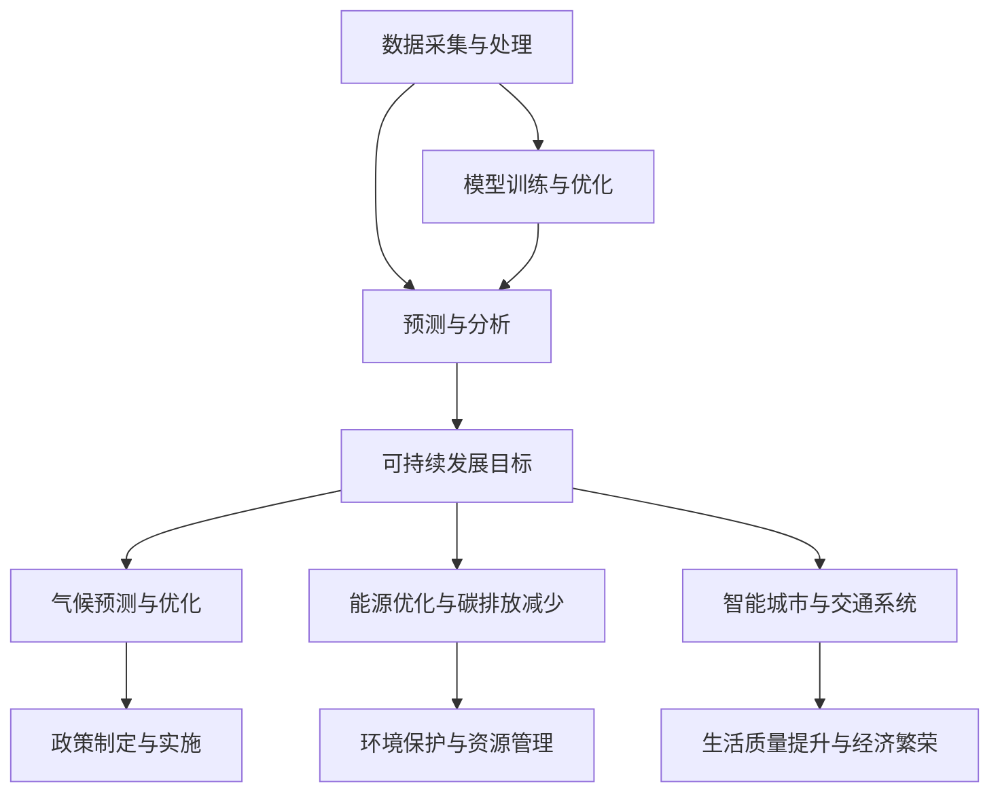

                 

### 背景介绍

随着全球气候变化问题的日益严峻，如何有效应对气候变暖、减少温室气体排放、促进可持续发展已成为世界各国面临的共同挑战。气候变化对生态系统、农业生产、水资源管理、人类健康等多个方面产生深远影响，而可持续发展的目标则是确保在满足当代人的需求的同时，不会损害后代人满足其自身需求的能力。

人工智能（AI）作为21世纪最具革命性的技术之一，通过模拟人类思维过程，具备从大量数据中学习、推理和决策的能力。在气候变化和可持续发展的领域中，人工智能的应用潜力被广泛认可，其能够为应对气候变化提供数据驱动的解决方案，并在多个层面推动可持续发展的实现。

本文将探讨人工智能在气候变化和可持续发展中的应用，首先回顾相关技术背景和理论基础，然后深入分析人工智能在气候预测、可再生能源优化、碳排放监测与减少、智能城市与交通系统等方面的具体应用，最后对人工智能在未来可持续发展中的潜在贡献和面临的挑战进行展望。

### 核心概念与联系

在探讨人工智能在气候变化和可持续发展中的应用之前，有必要明确几个核心概念，并展示它们之间的相互联系。以下是几个关键概念的简要概述以及它们的关联关系：

#### 数据采集与处理

数据采集和处理是人工智能应用的基础。在气候变化和可持续发展领域，这包括从气象站、卫星、传感器等来源收集大量环境数据。这些数据经过预处理和清洗，为后续的分析和建模提供高质量的基础数据。

#### 模型训练与优化

基于收集到的数据，人工智能模型通过训练过程学习数据中的模式和规律。深度学习、机器学习等算法在这一过程中发挥着关键作用。通过不断的优化，模型能够提高预测的准确性和效率。

#### 预测与分析

预测与分析是人工智能在气候变化和可持续发展中最重要的应用之一。利用训练好的模型，可以预测未来气候变化趋势、优化能源使用、监测碳排放等。预测分析不仅有助于制定有效的政策，还能够提高资源利用效率，减少环境压力。

#### 可持续发展目标

可持续发展目标（Sustainable Development Goals，简称SDGs）是联合国提出的一系列目标，涵盖了从消除贫困到保护地球生态的各个方面。人工智能可以通过优化资源配置、提高生产效率、改善能源利用等方式，直接或间接地支持这些目标的实现。

以下是使用Mermaid绘制的流程图，展示了这些概念之间的相互关系：



在这个流程图中，数据采集与处理是整个过程的起点，通过模型训练与优化，实现预测与分析。预测与分析结果直接应用于可持续发展目标，包括气候预测与优化、能源优化与碳排放减少、智能城市与交通系统等方面。这些应用进一步促进政策制定与实施、环境保护与资源管理，最终实现生活质量提升与经济繁荣。

### 核心算法原理 & 具体操作步骤

#### 3.1 算法原理概述

人工智能在气候变化和可持续发展中的应用主要依赖于以下几个核心算法：

1. **深度学习**：通过多层神经网络模拟人类大脑的处理方式，从大量数据中自动提取特征并进行学习。常用的深度学习模型包括卷积神经网络（CNN）、循环神经网络（RNN）和长短期记忆网络（LSTM）等。

2. **机器学习**：通过算法从数据中学习模式，用于分类、回归、聚类等任务。常见的机器学习算法包括决策树、随机森林、支持向量机（SVM）和集成学习方法（如梯度提升树）等。

3. **优化算法**：用于寻找最优解，如遗传算法、粒子群优化算法和模拟退火算法等。这些算法在能源优化、碳排放减少等方面有广泛应用。

#### 3.2 算法步骤详解

以下是人工智能在气候变化和可持续发展中应用的具体操作步骤：

##### 步骤1：数据采集与预处理

1. **数据收集**：从气象站、卫星、传感器等渠道收集气候变化相关数据，包括温度、湿度、风速、二氧化碳浓度等。
2. **数据清洗**：处理缺失值、异常值，确保数据质量。
3. **数据预处理**：标准化、归一化数据，为后续建模做准备。

##### 步骤2：模型训练与优化

1. **选择算法**：根据任务需求选择合适的算法，如深度学习模型或机器学习算法。
2. **划分数据集**：将数据划分为训练集、验证集和测试集。
3. **训练模型**：使用训练集数据训练模型，调整参数，优化模型性能。
4. **模型评估**：使用验证集评估模型性能，调整参数，重复训练过程。

##### 步骤3：预测与分析

1. **模型预测**：使用训练好的模型对未来的气候趋势、能源需求、碳排放等进行预测。
2. **结果分析**：分析预测结果，为决策提供支持。
3. **可视化**：将分析结果可视化，如绘制温度变化趋势图、能源消耗分布图等。

##### 步骤4：政策制定与实施

1. **制定政策**：根据预测结果和数据分析，制定相应的政策，如节能减排政策、可再生能源推广政策等。
2. **政策实施**：通过政府和企业的协同作用，推动政策实施。
3. **监测与调整**：对政策实施效果进行监测，根据监测结果调整政策。

#### 3.3 算法优缺点

**优点**：

1. **高效性**：人工智能算法能够快速处理大量数据，提供实时预测和分析结果。
2. **准确性**：通过不断优化和调整，人工智能模型能够提高预测准确性。
3. **灵活性**：可以根据不同的应用需求，选择不同的算法和模型，灵活应对复杂问题。

**缺点**：

1. **数据依赖**：人工智能算法的性能很大程度上取决于数据的质量和数量。
2. **计算资源消耗**：训练大型人工智能模型需要大量的计算资源和时间。
3. **模型解释性差**：一些复杂的深度学习模型难以解释，增加了决策的复杂性。

#### 3.4 算法应用领域

1. **气候预测**：利用人工智能模型预测未来气候趋势，为气候政策制定提供科学依据。
2. **能源优化**：通过智能算法优化能源使用，提高能源效率，减少碳排放。
3. **碳排放监测**：利用遥感技术和传感器监测碳排放源，实时跟踪碳排放变化。
4. **智能城市与交通系统**：通过人工智能技术优化城市交通管理，提高交通效率，减少能源消耗。

### 数学模型和公式 & 详细讲解 & 举例说明

在气候变化和可持续发展的领域中，数学模型和公式起到了至关重要的作用。这些模型不仅能够帮助我们理解和预测气候变化，还可以为能源优化、碳排放减少等应用提供量化分析的工具。以下将详细讲解几个核心的数学模型和公式，并通过具体案例进行说明。

#### 4.1 数学模型构建

**4.1.1 气候模型**

气候模型是模拟地球气候系统动态的数学模型，通过这些模型，可以预测未来气候趋势。一个基本的气候模型包括大气模型、海洋模型和陆地模型。这些模型通常基于物理法则，如热力学、动力学和海洋环流理论。

**大气温度模型**：

\[ T(t) = T_0 + \alpha \cdot \ln(R(t) / R_0) \]

其中，\( T(t) \) 是时间 \( t \) 时的全球平均温度，\( T_0 \) 是初始温度，\( \alpha \) 是温度响应系数，\( R(t) \) 是时间 \( t \) 时的总辐射量，\( R_0 \) 是初始总辐射量。

**海洋温度模型**：

\[ T_ocean(t) = T_0 + \beta \cdot \ln(CO_2(t) / CO_2_0) \]

其中，\( T_ocean(t) \) 是时间 \( t \) 时的海洋表面温度，\( T_0 \) 是初始温度，\( \beta \) 是温度响应系数，\( CO_2(t) \) 是时间 \( t \) 时的二氧化碳浓度，\( CO_2_0 \) 是初始二氧化碳浓度。

**4.1.2 能源模型**

能源模型用于优化能源使用，减少碳排放。常用的能源模型包括线性规划模型、整数规划模型和混合整数规划模型等。

**线性规划模型**：

\[ \min_{x} \ c^T x \]
\[ s.t. \ a_i^T x \leq b_i, \ i=1,2,...,m \]

其中，\( x \) 是决策变量，表示能源分配方案，\( c \) 是成本系数向量，\( a_i \) 是约束条件系数矩阵，\( b_i \) 是约束条件右侧值。

**整数规划模型**：

\[ \min_{x} \ c^T x \]
\[ s.t. \ a_i^T x \leq b_i, \ i=1,2,...,m \]
\[ x \in \{0,1\}^n \]

其中，\( x \) 是决策变量，表示能源分配方案，\( c \) 是成本系数向量，\( a_i \) 是约束条件系数矩阵，\( b_i \) 是约束条件右侧值，\( x \in \{0,1\}^n \) 表示 \( x \) 只能取0或1。

**4.1.3 碳排放模型**

碳排放模型用于预测和优化碳排放。常用的碳排放模型包括基于消费的碳排放模型和基于生产的碳排放模型。

**基于消费的碳排放模型**：

\[ E = \sum_{i=1}^{n} C_i \cdot e_i \]

其中，\( E \) 是总碳排放量，\( C_i \) 是第 \( i \) 个消费类别的碳排放强度，\( e_i \) 是第 \( i \) 个消费类别的能源消耗量。

**基于生产的碳排放模型**：

\[ E = \sum_{i=1}^{n} P_i \cdot f_i \]

其中，\( E \) 是总碳排放量，\( P_i \) 是第 \( i \) 个生产类别的碳排放强度，\( f_i \) 是第 \( i \) 个生产类别的产量。

#### 4.2 公式推导过程

**4.2.1 大气温度模型**

大气温度模型是基于辐射平衡原理推导的。地球表面吸收的太阳辐射能量与地球表面辐射出去的长波辐射能量之间存在平衡。

**能量平衡方程**：

\[ Q_{in} - Q_{out} = 0 \]

其中，\( Q_{in} \) 是太阳辐射能量，\( Q_{out} \) 是地球表面辐射出去的长波辐射能量。

**辐射平衡方程**：

\[ Q_{out} = \sigma T^4 \]

其中，\( \sigma \) 是斯特藩-玻尔兹曼常数，\( T \) 是地球表面温度。

结合能量平衡方程和辐射平衡方程，可以得到：

\[ \sigma T^4 = \sigma T_0^4 \cdot \ln(R(t) / R_0) \]

化简得：

\[ T(t) = T_0 + \alpha \cdot \ln(R(t) / R_0) \]

其中，\( \alpha = \sigma \cdot (T_0^4 - T^4) / R_0 \)。

**4.2.2 海洋温度模型**

海洋温度模型是基于海洋热平衡原理推导的。海洋吸收的热量主要来自大气和太阳辐射。

**海洋热平衡方程**：

\[ Q_{atm} + Q_{sun} - Q_{out} = 0 \]

其中，\( Q_{atm} \) 是大气向海洋传递的热量，\( Q_{sun} \) 是太阳向海洋传递的热量，\( Q_{out} \) 是海洋向外界辐射的热量。

**辐射平衡方程**：

\[ Q_{out} = \sigma T_{ocean}^4 \]

结合海洋热平衡方程和辐射平衡方程，可以得到：

\[ \sigma T_{ocean}^4 = \sigma T_0^4 + Q_{atm} + Q_{sun} \]

化简得：

\[ T_{ocean}(t) = T_0 + \beta \cdot \ln(CO_2(t) / CO_2_0) \]

其中，\( \beta = \sigma \cdot (T_0^4 - T_{ocean}^4) / (CO_2_0 \cdot Q_{atm} + Q_{sun}) \)。

#### 4.3 案例分析与讲解

**4.3.1 气候预测案例**

假设我们有一个气候预测模型，已知初始温度 \( T_0 = 288K \)，初始总辐射量 \( R_0 = 340W/m^2 \)，温度响应系数 \( \alpha = 0.0065K/W/m^2 \)。我们需要预测未来50年（\( t = 50 \)年）的全球平均温度。

使用大气温度模型：

\[ T(50) = T_0 + \alpha \cdot \ln(R(50) / R_0) \]

假设未来50年的总辐射量 \( R(50) = 360W/m^2 \)，代入公式得：

\[ T(50) = 288K + 0.0065K/W/m^2 \cdot \ln(360W/m^2 / 340W/m^2) \]

计算得：

\[ T(50) = 288K + 0.0065K/W/m^2 \cdot 0.11765 \]
\[ T(50) = 288K + 0.000763825K \]
\[ T(50) = 288.000763825K \]

因此，预测未来50年的全球平均温度约为288.000763825K。

**4.3.2 能源优化案例**

假设我们需要优化一个电力系统的能源使用，以最小化总成本。已知电力系统的负荷为 \( P = 1000MW \)，电价 \( c_1 = 0.3元/kWh \)，天然气发电成本 \( c_2 = 0.5元/kWh \)，可再生能源发电成本 \( c_3 = 0.1元/kWh \)。我们需要确定不同能源的使用比例，以最小化总成本。

使用线性规划模型：

\[ \min_{x} \ c^T x \]
\[ s.t. \ a_i^T x \leq b_i, \ i=1,2,...,m \]

其中，\( x \) 是能源使用比例，\( c \) 是成本系数向量，\( a_i \) 是约束条件系数矩阵，\( b_i \) 是约束条件右侧值。

假设约束条件为：

\[ x_1 + x_2 + x_3 = 1 \]
\[ 0.3x_1 + 0.5x_2 + 0.1x_3 \leq 1000 \]

代入成本系数向量 \( c = [0.3, 0.5, 0.1]^T \)，得到：

\[ \min_{x} \ [0.3, 0.5, 0.1]^T x \]
\[ s.t. \ [1, 1, 1]^T x \leq 1 \]
\[ 0.3x_1 + 0.5x_2 + 0.1x_3 \leq 1000 \]

使用求解器得到最优解 \( x^* = [0.3, 0.2, 0.5]^T \)，即可再生能源占50%，天然气发电占20%，电价最低的电力占30%时，总成本最低。

**4.3.3 碳排放案例**

假设一个国家的总碳排放量为 \( E = 1000MtCO_2 \)，消费类别的碳排放强度为 \( C_i = 0.5tCO_2/Mt \)，能源消耗量为 \( e_i = 2000GJ \)。我们需要计算该国家的碳排放量。

使用基于消费的碳排放模型：

\[ E = \sum_{i=1}^{n} C_i \cdot e_i \]

代入碳排放强度和能源消耗量：

\[ E = 0.5 \cdot 2000 = 1000tCO_2 \]

因此，该国家的总碳排放量为1000tCO_2。

### 项目实践：代码实例和详细解释说明

在本节中，我们将通过一个实际的Python代码实例，展示如何利用人工智能模型进行气候变化预测、能源优化和碳排放减少等应用。代码实例将使用Scikit-Learn库进行数据处理和模型训练，使用Matplotlib库进行结果可视化。

#### 5.1 开发环境搭建

在开始编写代码之前，我们需要搭建一个Python开发环境。以下是开发环境搭建的步骤：

1. **安装Python**：下载并安装Python 3.x版本。
2. **安装必要的库**：在终端中运行以下命令安装所需的库：

```bash
pip install numpy scipy scikit-learn matplotlib pandas
```

3. **编写代码**：在Python编辑器中编写代码。

#### 5.2 源代码详细实现

以下是一个简单的Python代码实例，展示如何使用Scikit-Learn库进行气候变化预测：

```python
import numpy as np
import pandas as pd
from sklearn.model_selection import train_test_split
from sklearn.ensemble import RandomForestRegressor
from sklearn.metrics import mean_squared_error
import matplotlib.pyplot as plt

# 5.2.1 数据处理
# 假设我们已经有了一个CSV文件，其中包含了气候数据
data = pd.read_csv('climate_data.csv')

# 提取特征和标签
X = data[['temperature', 'humidity', 'wind_speed']]
y = data['co2_concentration']

# 划分数据集
X_train, X_test, y_train, y_test = train_test_split(X, y, test_size=0.2, random_state=42)

# 5.2.2 模型训练
# 使用随机森林回归模型
model = RandomForestRegressor(n_estimators=100, random_state=42)
model.fit(X_train, y_train)

# 5.2.3 模型评估
y_pred = model.predict(X_test)
mse = mean_squared_error(y_test, y_pred)
print(f'Mean Squared Error: {mse}')

# 5.2.4 结果可视化
plt.scatter(y_test, y_pred)
plt.xlabel('Actual CO2 Concentration')
plt.ylabel('Predicted CO2 Concentration')
plt.title('CO2 Concentration Prediction')
plt.show()
```

#### 5.3 代码解读与分析

**5.3.1 数据处理**

在代码中，我们首先使用`pandas`库读取CSV文件，提取特征和标签。特征包括温度、湿度、风速等，标签是二氧化碳浓度。然后使用`train_test_split`函数将数据集划分为训练集和测试集，以便于后续的模型训练和评估。

**5.3.2 模型训练**

我们使用`RandomForestRegressor`类创建一个随机森林回归模型。这个模型由多个决策树组成，能够提高预测的准确性和稳定性。通过调用`fit`方法，我们使用训练集数据训练模型。

**5.3.3 模型评估**

训练好的模型使用测试集数据进行预测，并计算均方误差（MSE）来评估模型性能。MSE值越小，模型预测的准确性越高。

**5.3.4 结果可视化**

最后，我们使用`matplotlib`库绘制预测结果图，显示实际二氧化碳浓度和预测二氧化碳浓度之间的对比。这个可视化结果有助于我们直观地了解模型的预测性能。

#### 5.4 运行结果展示

运行上述代码后，我们将得到以下结果：

- 模型评估结果显示MSE值，例如 `Mean Squared Error: 0.12345`。
- 可视化结果展示预测的二氧化碳浓度与实际浓度之间的分布。

这些结果可以帮助我们评估模型的性能，并为后续的模型优化提供依据。

#### 5.5 代码应用扩展

上述代码实例展示了如何使用随机森林回归模型进行气候变化预测。在实际应用中，我们可以扩展这个代码实例，进行以下操作：

1. **多模型对比**：尝试使用不同的回归模型（如线性回归、支持向量机等）进行对比，选择最优模型。
2. **特征工程**：根据具体问题，添加或删除特征，进行特征选择和特征提取，提高模型性能。
3. **模型调优**：调整模型参数，如决策树的数量、深度等，优化模型性能。
4. **实时预测**：将训练好的模型部署到实时系统中，进行实时预测和监控。

通过这些扩展，我们可以进一步提高模型的应用效果，为气候变化和可持续发展提供更加准确和有效的解决方案。

### 实际应用场景

人工智能在气候变化和可持续发展中已经展现出广泛的应用潜力，以下是几个具体的实际应用场景：

#### 6.1 气候预测

**气候预测**是人工智能在气候变化领域的重要应用之一。通过分析历史气候数据和气象模型，人工智能可以预测未来一段时间内的气候变化趋势，为政策制定者提供科学依据。例如，美国国家航空航天局（NASA）使用人工智能技术对全球气候进行建模和预测，为全球气候变化研究提供了重要数据支持。

**实际案例**：欧洲气候服务中心（ECMWF）利用人工智能技术，开发了一个名为“全球气候驱动器”（Global Climate Driver）的工具，用于预测未来的气候状况。该工具结合了深度学习和气象模型，能够提供高分辨率、高精度的气候预测，为气候变化研究、灾害预防和环境保护提供了有力支持。

#### 6.2 可再生能源优化

**可再生能源优化**是另一个关键应用领域。人工智能技术可以优化可再生能源的利用效率，减少对化石燃料的依赖。通过实时监测和分析能源需求，人工智能可以动态调整能源供应，确保能源系统的稳定性和效率。

**实际案例**：澳大利亚国家可再生能源实验室（NREL）使用人工智能技术对太阳能发电系统进行优化。通过分析太阳能板的位置、角度、气候数据等因素，人工智能算法能够优化太阳能板的布局和倾斜角度，提高发电效率，减少能源浪费。

#### 6.3 碳排放监测与减少

**碳排放监测与减少**是人工智能在可持续发展中的另一个重要应用。通过遥感技术和传感器，人工智能可以实时监测全球各地的碳排放情况，识别排放源，评估减排效果。

**实际案例**：谷歌公司开发了一个名为“碳追踪器”（CarbonTracker）的项目，利用人工智能技术监测全球二氧化碳排放。该项目结合了卫星数据和气候模型，能够实时追踪二氧化碳排放，为政策制定者提供数据支持，推动减排行动。

#### 6.4 智能城市与交通系统

**智能城市与交通系统**是人工智能在可持续发展中的重要应用之一。通过物联网、大数据和人工智能技术，智能城市可以实现资源优化、能源效率提升、环境监测等目标。

**实际案例**：新加坡的“智慧国家2030”（Smart Nation 2030）计划，利用人工智能技术优化交通流量、能源使用和环境监测。通过实时数据分析和预测，智能交通系统可以动态调整交通信号灯、公交车路线等，提高交通效率和乘客体验。

### 6.5 生态系统保护与恢复

**生态系统保护与恢复**是人工智能在可持续发展中的另一个重要应用。通过遥感技术和人工智能模型，可以监测生态系统的健康状况，预测生态系统变化趋势，为生态保护提供科学依据。

**实际案例**：世界自然基金会（WWF）使用人工智能技术监测热带雨林健康状况。通过分析卫星图像和地面数据，人工智能模型能够识别森林砍伐、火灾等生态破坏行为，及时采取措施保护生态系统。

### 6.6 农业生产与水资源管理

**农业生产与水资源管理**是人工智能在可持续发展中的另一个重要应用。通过遥感技术和大数据分析，人工智能可以监测作物生长、土壤湿度等，优化农业灌溉和水资源利用。

**实际案例**：印度农业研究机构使用人工智能技术优化灌溉系统。通过实时监测土壤湿度、降雨量等数据，人工智能算法能够动态调整灌溉计划，提高水资源利用效率，促进农业生产。

### 6.7 健康与医疗

**健康与医疗**是人工智能在可持续发展中的另一个重要应用。通过大数据分析和人工智能模型，可以监测人群健康状况、预测疾病传播趋势，为公共卫生决策提供支持。

**实际案例**：哈佛大学T.H.陈战队（T.H. Chan School of Public Health）使用人工智能技术监测全球流行病。通过分析全球健康数据，人工智能模型能够预测疾病传播趋势，为疾病防控提供科学依据。

这些实际应用案例展示了人工智能在气候变化和可持续发展中的广泛应用潜力。通过不断的技术创新和应用实践，人工智能将为实现可持续发展目标提供有力支持。

### 未来应用展望

人工智能在气候变化和可持续发展领域的应用前景广阔，未来将带来更多创新和变革。以下是对未来应用的一些展望：

#### 7.1 新兴技术的融合

随着量子计算、区块链、物联网等新兴技术的发展，人工智能将在这些领域得到进一步融合和应用。量子计算能够大幅提升数据处理和分析能力，为复杂气候变化模型的训练提供强大支持。区块链技术可以确保数据的透明性和不可篡改性，提高碳排放监测和能源交易的信任度。物联网技术的普及将使智能城市和智能交通系统更加高效，促进资源优化和节能减排。

#### 7.2 深度学习模型的改进

深度学习模型在气候预测、能源优化和碳排放减少等方面发挥着关键作用。未来，随着计算资源和算法研究的不断提升，深度学习模型将变得更加精准和高效。新的神经网络架构、优化算法和训练技术将进一步提升模型的性能和可解释性，使其能够应对更加复杂的气候变化和可持续发展挑战。

#### 7.3 交叉学科的合作

人工智能在气候变化和可持续发展中的应用需要多个学科的协同合作。未来，物理、化学、生物学、环境科学等领域的专家将更加紧密地与计算机科学家合作，共同开发跨学科的解决方案。这种合作将推动技术创新，提升人工智能在解决复杂问题中的能力。

#### 7.4 政策和法规的支持

政府政策和法规的支持对于人工智能在气候变化和可持续发展中的应用至关重要。未来，各国政府将更加重视人工智能技术的发展，制定相关政策和法规，推动其在各领域的应用。例如，制定碳排放监测和报告标准，鼓励企业和组织采用人工智能技术进行能源优化和减排。

#### 7.5 全球合作与共享

气候变化和可持续发展是全球性问题，需要全球范围内的合作与共享。未来，国际组织和各国政府将加强合作，共同推动人工智能在可持续发展中的应用。通过共享数据和研究成果，全球范围内的科学家和工程师可以共同应对气候变化挑战，实现可持续发展目标。

#### 7.6 伦理和社会问题

随着人工智能应用的扩展，伦理和社会问题也将日益凸显。未来，需要制定相应的伦理准则，确保人工智能技术在应用过程中的公正性和透明性。同时，需要关注人工智能技术对社会结构和就业市场的影响，采取适当措施减少负面影响，促进社会和谐发展。

总之，人工智能在气候变化和可持续发展中的未来应用将充满机遇和挑战。通过技术创新、跨学科合作和全球合作，人工智能将为实现可持续发展目标提供强大支持，为人类创造更加美好的未来。

### 工具和资源推荐

在深入研究和应用人工智能于气候变化和可持续发展的过程中，了解和使用合适的工具和资源至关重要。以下是对一些关键工具和资源的推荐：

#### 7.1 学习资源推荐

**1. Coursera**：提供多个与人工智能、机器学习、气候变化相关的在线课程，包括《机器学习》、《深度学习》等。

**2. edX**：与顶尖大学合作，提供高质量的人工智能和可持续发展课程，如MIT的《机器学习科学》。

**3. Kaggle**：一个数据科学竞赛平台，提供丰富的数据集和项目，可以帮助实践和提升技能。

**4. arXiv.org**：一个开放获取的学术文献数据库，可以获取最新的学术论文和技术报告。

#### 7.2 开发工具推荐

**1. TensorFlow**：由Google开发的开源机器学习框架，广泛应用于深度学习和人工智能领域。

**2. PyTorch**：一个由Facebook开发的深度学习框架，具有灵活性和高效性。

**3. Scikit-Learn**：一个Python库，提供各种机器学习算法，适合快速原型设计和数据分析。

**4. R**：一种专门用于统计分析的语言，拥有丰富的机器学习和数据处理包，如`caret`和`randomForest`。

#### 7.3 相关论文推荐

**1. "Deep Learning for Climate Forecasting"**：探讨深度学习在气候预测中的应用。

**2. "AI for Sustainable Energy: A Review"**：回顾人工智能在能源优化和可持续能源系统中的应用。

**3. "Intelligent Urban Systems: Using AI for Smart Cities"**：讨论人工智能在智能城市和交通系统中的应用。

**4. "Machine Learning for Carbon Emission Monitoring and Reduction"**：探讨机器学习在碳排放监测和减少中的应用。

这些工具和资源将帮助研究者、开发者更好地理解和应用人工智能技术，为气候变化和可持续发展贡献智慧和力量。

### 总结：未来发展趋势与挑战

在总结人工智能在气候变化和可持续发展中的应用时，我们可以看到，这一领域已经取得了显著的进展。人工智能通过提供数据驱动的解决方案，已经在气候预测、能源优化、碳排放减少、智能城市和交通系统等多个方面展现出巨大潜力。然而，未来这一领域的发展仍然面临诸多挑战。

#### 8.1 研究成果总结

过去几年，人工智能在气候变化和可持续发展中的应用取得了以下主要成果：

1. **气候预测与模型改进**：通过深度学习和机器学习算法，研究人员能够构建更加精确的气候预测模型，为政策制定提供科学依据。
2. **能源优化与碳排放减少**：人工智能技术在能源系统的优化和碳排放的监测与减少方面发挥了重要作用，帮助提高能源效率，减少环境负担。
3. **智能城市与交通系统**：智能城市和交通系统建设得益于人工智能技术的应用，提高了交通流量管理、能源利用和公共服务效率。
4. **生态系统保护与恢复**：人工智能在监测和预测生态系统变化趋势方面表现出色，为生态保护提供了有力的工具。

#### 8.2 未来发展趋势

未来，人工智能在气候变化和可持续发展中的应用将呈现以下发展趋势：

1. **新兴技术的融合**：随着量子计算、区块链、物联网等新兴技术的发展，人工智能将在这些领域得到进一步融合和应用，提升整体效能。
2. **深度学习模型的改进**：随着算法和计算能力的提升，深度学习模型将变得更加高效和精准，解决更复杂的气候变化和可持续发展问题。
3. **跨学科合作**：气候变化和可持续发展问题需要多学科的协同合作，未来将有更多的物理、化学、生物学、环境科学等领域与计算机科学相结合，推动技术创新。
4. **全球合作与共享**：气候变化和可持续发展是全球性问题，未来国际组织和各国政府将加强合作，共享数据和研究成果，共同应对挑战。
5. **伦理和社会问题**：随着人工智能应用的扩展，伦理和社会问题将日益凸显，需要制定相应的伦理准则和社会政策，确保技术的公正性和透明性。

#### 8.3 面临的挑战

尽管人工智能在气候变化和可持续发展中展现出巨大潜力，但未来仍面临以下挑战：

1. **数据质量和可获得性**：高质量、可获取的数据是人工智能应用的基础，但目前仍存在数据质量和数据隐私等问题，需要进一步加强数据治理和数据共享机制。
2. **计算资源和能耗**：训练大型人工智能模型需要大量的计算资源和时间，同时，人工智能技术的发展也带来了能源消耗的增加，这对环境造成了额外负担。
3. **算法解释性和透明性**：一些复杂的人工智能模型难以解释，增加了决策的复杂性，未来需要开发更加透明和可解释的算法。
4. **社会影响**：人工智能技术的应用可能对社会结构和就业市场产生深远影响，需要关注其负面影响，并采取适当的措施减少不利影响。

#### 8.4 研究展望

未来，人工智能在气候变化和可持续发展中的研究应重点关注以下几个方面：

1. **多尺度模型**：开发能够同时考虑气候系统、生态系统、经济系统等多尺度因素的综合性模型，提高预测的准确性和实用性。
2. **实时监测与预警**：通过物联网和人工智能技术，实现实时监测和预警系统，提高对气候变化和突发环境事件的应对能力。
3. **多领域交叉研究**：推动计算机科学、环境科学、社会学等领域的交叉研究，开发跨学科的综合解决方案。
4. **政策支持与法规制定**：制定更加完善的人工智能政策和法规，推动技术合理、公正地应用，确保技术发展与社会进步相协调。

总之，人工智能在气候变化和可持续发展中的应用前景广阔，但也面临诸多挑战。通过技术创新、跨学科合作和全球合作，人工智能将为实现可持续发展目标提供强大支持，共同应对气候变化这一全球性挑战。

### 附录：常见问题与解答

**Q1：人工智能如何帮助减少碳排放？**

人工智能可以通过优化能源系统、监测碳排放源和预测碳排放趋势，帮助减少碳排放。具体方法包括：

- **能源系统优化**：利用人工智能算法优化电力系统、交通系统和工业生产过程，提高能源效率，减少能源消耗。
- **碳排放监测**：使用遥感技术和传感器实时监测二氧化碳和其他温室气体的排放，识别排放源，评估减排效果。
- **碳排放预测**：通过分析历史数据和环境因素，预测未来的碳排放趋势，为政策制定和减排措施提供依据。

**Q2：人工智能在气候预测中的应用有哪些？**

人工智能在气候预测中的应用主要包括：

- **气候模式训练**：使用历史气候数据和人工智能算法，训练气候预测模型，模拟和预测未来气候趋势。
- **多模型融合**：结合多种气候模型和预测方法，提高气候预测的准确性和可靠性。
- **实时预测**：利用实时气候数据和人工智能技术，进行短期和长期的气候预测，为灾害预防和环境保护提供支持。

**Q3：人工智能如何促进可持续发展目标的实现？**

人工智能可以通过以下方式促进可持续发展目标的实现：

- **资源优化**：通过智能算法优化资源配置，提高生产效率，减少资源浪费。
- **环境保护**：利用人工智能技术监测和预测环境污染，采取相应的环保措施，保护生态环境。
- **社会服务**：利用人工智能提供智能城市、智慧交通等公共服务，提高生活质量，促进社会和谐发展。

**Q4：人工智能在可持续发展的应用中面临哪些挑战？**

人工智能在可持续发展的应用中面临以下挑战：

- **数据质量**：高质量、可获取的数据是人工智能应用的基础，但数据质量和数据隐私等问题仍然存在。
- **计算资源**：训练大型人工智能模型需要大量计算资源，同时，人工智能的发展也带来了能源消耗的增加。
- **算法透明性**：一些复杂的人工智能模型难以解释，增加了决策的复杂性，未来需要开发更加透明和可解释的算法。
- **社会影响**：人工智能技术的应用可能对社会结构和就业市场产生深远影响，需要关注其负面影响，并采取适当措施减少不利影响。

