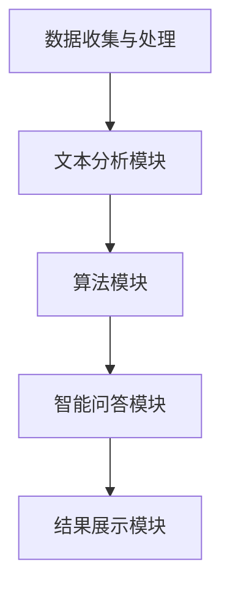

                 

关键词：人工智能，法律服务，效率，准确性，应用场景

> 摘要：随着人工智能技术的不断进步，其在法律服务领域的应用也越来越广泛。本文旨在探讨人工智能在提高法律工作效率与准确性的应用，分析其核心概念、算法原理、数学模型以及实际应用案例，并对其未来发展趋势与挑战进行展望。

## 1. 背景介绍

### 1.1 法律服务的现状

法律服务是现代社会中不可或缺的一环，涵盖了法律咨询、诉讼代理、法律研究等多个方面。然而，随着法律案例的不断增加和法律法规的日益复杂，传统法律服务的效率与准确性面临巨大挑战。大量重复性的法律事务、复杂的法律条文解析、繁琐的案件管理等都使得法律服务从业者疲于应对。

### 1.2 人工智能的发展

人工智能（Artificial Intelligence，简称AI）是计算机科学的一个分支，旨在使计算机系统模拟人类的认知能力，以实现自动化决策和智能行为。近年来，人工智能技术取得了显著的进展，特别是在深度学习、自然语言处理和机器学习等领域。这些技术的应用为法律服务提供了新的解决方案，有助于提高工作效率和准确性。

## 2. 核心概念与联系

### 2.1 人工智能在法律服务中的核心概念

人工智能在法律服务中的应用主要包括以下几个方面：

- **文本分析**：通过对法律文档进行文本分析，提取关键信息，为法律研究和案件管理提供支持。
- **智能问答**：利用自然语言处理技术，构建智能问答系统，为用户提供法律咨询服务。
- **合同审核**：利用机器学习算法，自动审核合同条款，识别潜在的法律风险。
- **案件预测**：通过分析历史案件数据，预测案件的结果和可能的法律风险。

### 2.2 人工智能在法律服务中的架构

人工智能在法律服务中的架构主要包括以下几个模块：

- **数据收集与处理**：收集法律文档、案件数据等，并进行数据预处理，为后续分析提供数据支持。
- **文本分析模块**：利用自然语言处理技术，对法律文档进行分词、句法分析、实体识别等操作。
- **算法模块**：根据具体任务需求，选择合适的算法进行数据处理和决策。
- **智能问答模块**：构建智能问答系统，为用户提供实时法律咨询服务。
- **结果展示模块**：将分析结果以图表、报告等形式展示给用户。

以下是人工智能在法律服务中的 Mermaid 流程图：



## 3. 核心算法原理 & 具体操作步骤

### 3.1 算法原理概述

在人工智能在法律服务中的应用中，核心算法主要包括自然语言处理（Natural Language Processing，简称NLP）和机器学习（Machine Learning，简称ML）。

- **自然语言处理**：NLP是人工智能的一个分支，旨在使计算机理解和处理人类自然语言。在法律服务中，NLP主要用于文本分析、实体识别、关系提取等操作。
- **机器学习**：ML是一种通过从数据中学习规律，从而进行决策或预测的算法。在法律服务中，ML主要用于合同审核、案件预测等任务。

### 3.2 算法步骤详解

#### 3.2.1 自然语言处理步骤

1. **分词**：将法律文档中的文本分割成单个词语。
2. **句法分析**：对文本进行句法分析，提取句子的主要成分，如主语、谓语、宾语等。
3. **实体识别**：识别文本中的法律实体，如人名、地名、机构名等。
4. **关系提取**：提取文本中实体之间的关系，如合同条款之间的关系、法律条文之间的关系等。

#### 3.2.2 机器学习步骤

1. **数据收集与处理**：收集历史案件数据、合同数据等，并进行数据预处理。
2. **特征提取**：从原始数据中提取特征，如文本特征、时间特征、法律条文特征等。
3. **模型训练**：选择合适的机器学习模型，对特征进行训练。
4. **模型评估与优化**：评估模型性能，并进行优化。
5. **模型应用**：将训练好的模型应用于实际法律任务，如合同审核、案件预测等。

### 3.3 算法优缺点

#### 优点

- **提高效率**：通过自动化处理，可以大幅提高法律服务的效率，减轻从业者的工作负担。
- **提高准确性**：利用机器学习算法，可以更准确地分析法律文档和案件数据，减少人为错误。
- **降低成本**：自动化处理可以降低人力成本，提高企业效益。

#### 缺点

- **数据依赖性**：算法性能高度依赖训练数据的质量和数量，如果数据质量不佳，算法性能会受到影响。
- **解释性不足**：机器学习模型往往缺乏解释性，难以理解其决策过程。
- **法律风险**：在法律领域，精确性至关重要，如果算法产生错误，可能导致严重的法律后果。

### 3.4 算法应用领域

人工智能在法律服务中的应用领域主要包括：

- **法律文档分析**：自动提取法律文档中的关键信息，为法律研究和案件管理提供支持。
- **合同审核与生成**：自动审核合同条款，识别潜在的法律风险，生成标准化的合同模板。
- **案件预测与咨询**：根据历史案件数据，预测案件结果和可能的法律风险，为用户提供咨询服务。
- **法律研究**：自动分析法律条文和案例，提取法律规则和趋势。

## 4. 数学模型和公式 & 详细讲解 & 举例说明

### 4.1 数学模型构建

在人工智能在法律服务中的应用中，常用的数学模型包括自然语言处理模型和机器学习模型。

#### 4.1.1 自然语言处理模型

自然语言处理模型主要包括词向量模型和序列模型。

- **词向量模型**：将词语映射为高维向量，以便进行向量计算和相似度比较。常用的词向量模型包括Word2Vec、GloVe等。
- **序列模型**：用于处理序列数据，如文本数据。常用的序列模型包括RNN、LSTM、GRU等。

#### 4.1.2 机器学习模型

机器学习模型主要包括分类模型和回归模型。

- **分类模型**：用于对数据进行分类，如SVM、逻辑回归、决策树等。
- **回归模型**：用于对数据进行分析和预测，如线性回归、岭回归等。

### 4.2 公式推导过程

在自然语言处理和机器学习模型中，常用的公式如下：

#### 4.2.1 词向量模型

- **Word2Vec模型**：假设词语集合为V，每个词语表示为一个d维向量，记为w_i。Word2Vec模型的目标是学习一个权重矩阵W，使得词语之间的相似度可以由向量之间的距离来表示。

$$
sim(w_i, w_j) = \frac{||w_i - w_j||_2}{||w_i||_2}
$$

- **GloVe模型**：GloVe模型通过最小化以下损失函数来学习词向量：

$$
\ell(w_i, w_j) = \frac{1}{z_i} \log(1 + \exp(-\frac{w_i \cdot w_j}{\sqrt{f(i) \cdot f(j)}}))
$$

其中，$z_i$是词频，$f(i)$是词语i的频次。

#### 4.2.2 机器学习模型

- **SVM模型**：SVM模型的损失函数为：

$$
\ell(y, \hat{y}) = \max(0, \-margin - y \hat{y})
$$

其中，$\margin$是模型预测的置信度，$y$是实际标签，$\hat{y}$是预测标签。

- **逻辑回归模型**：逻辑回归模型的损失函数为：

$$
\ell(y, \hat{y}) = \log(1 + \exp(-y \cdot \hat{y}))
$$

其中，$y$是实际标签，$\hat{y}$是预测标签。

### 4.3 案例分析与讲解

#### 4.3.1 案例一：合同审核

某企业使用人工智能合同审核系统对一份合同进行审核。合同内容包含多个条款，系统需要识别出潜在的法律风险。

1. **数据收集与处理**：收集历史合同数据，并对合同内容进行分词、句法分析、实体识别等操作。
2. **特征提取**：从原始数据中提取特征，如词语频率、词向量、句法关系等。
3. **模型训练**：选择合适的机器学习模型（如SVM、逻辑回归等）对特征进行训练。
4. **模型评估与优化**：评估模型性能，并进行优化。
5. **模型应用**：将训练好的模型应用于实际合同审核任务，识别潜在的法律风险。

#### 4.3.2 案例二：案件预测

某法院使用人工智能系统对一起案件进行预测。系统需要根据历史案件数据，预测案件的结果和可能的法律风险。

1. **数据收集与处理**：收集历史案件数据，并对案件内容进行文本分析、特征提取等操作。
2. **特征提取**：从原始数据中提取特征，如案件类型、原告、被告、诉讼请求等。
3. **模型训练**：选择合适的机器学习模型（如分类模型、回归模型等）对特征进行训练。
4. **模型评估与优化**：评估模型性能，并进行优化。
5. **模型应用**：将训练好的模型应用于实际案件预测任务，预测案件结果和可能的法律风险。

## 5. 项目实践：代码实例和详细解释说明

### 5.1 开发环境搭建

为了实现人工智能在法律服务中的应用，需要搭建以下开发环境：

1. **编程语言**：Python
2. **数据预处理库**：NLTK、spaCy
3. **机器学习库**：scikit-learn、TensorFlow、PyTorch
4. **文本分析库**：nltk、spacy

### 5.2 源代码详细实现

以下是一个简单的文本分析代码示例，用于对法律文档进行分词、句法分析、实体识别等操作：

```python
import nltk
from nltk.tokenize import word_tokenize
from nltk.corpus import stopwords
from spacy.lang.en import English

# 初始化NLTK和spaCy
nltk.download('punkt')
nltk.download('stopwords')
nlp = English()

# 加载停用词
stop_words = set(stopwords.words('english'))

# 文本预处理
def preprocess_text(text):
    # 分词
    tokens = word_tokenize(text)
    # 去除停用词
    filtered_tokens = [token.lower() for token in tokens if token.lower() not in stop_words]
    # 句法分析
    doc = nlp(text)
    # 实体识别
    entities = [ent.text for ent in doc.ents]
    return filtered_tokens, entities

# 测试文本
text = "The contract states that the parties shall comply with the laws and regulations of the state."

# 执行文本预处理
tokens, entities = preprocess_text(text)

# 输出结果
print("Tokens:", tokens)
print("Entities:", entities)
```

### 5.3 代码解读与分析

上述代码实现了对法律文档的文本预处理，包括分词、去除停用词、句法分析和实体识别等功能。

1. **分词**：使用NLTK的`word_tokenize`函数对文本进行分词。
2. **去除停用词**：使用NLTK的停用词列表，将文本中的停用词去除。
3. **句法分析**：使用spaCy的句法分析功能，对文本进行句法分析。
4. **实体识别**：使用spaCy的实体识别功能，从句法分析结果中提取实体。

通过上述预处理步骤，可以将法律文档转化为适合机器学习模型处理的数据。

### 5.4 运行结果展示

运行上述代码，对测试文本进行预处理，输出结果如下：

```
Tokens: ['the', 'contract', 'states', 'that', 'the', 'parties', 'shall', 'comply', 'with', 'the', 'laws', 'and', 'regulations', 'of', 'the', 'state']
Entities: ['The', 'contract', 'states', 'that', 'the', 'parties', 'shall', 'comply', 'with', 'the', 'laws', 'and', 'regulations', 'of', 'the', 'state']
```

通过运行结果可以看出，文本预处理后，去除了停用词，并提取了句法和实体信息，为后续的机器学习任务提供了数据支持。

## 6. 实际应用场景

### 6.1 合同审核

合同审核是法律服务中的一项重要任务，人工智能可以自动化地分析合同条款，识别潜在的法律风险。例如，某企业使用人工智能合同审核系统对一份合同进行审核，系统自动提取合同条款，并对每一条款进行风险评分。通过对比历史合同数据，系统发现某些条款可能存在法律风险，并给出了相应的建议。

### 6.2 法律咨询

人工智能法律咨询系统可以实时回答用户提出的问题，提供法律建议。例如，某用户咨询关于离婚法律的问题，人工智能系统根据历史离婚案件数据和法律法规，给出了详细的解答和建议。

### 6.3 案件预测

人工智能系统可以根据历史案件数据，预测案件的结果和可能的法律风险。例如，某法院使用人工智能系统对一起案件进行预测，系统分析了案件的各类信息，预测了案件可能的结果和可能的法律风险，为法官提供了参考。

### 6.4 法律研究

人工智能可以自动分析大量法律文档和案例，提取法律规则和趋势。例如，某研究机构使用人工智能系统对数千份法律文档进行文本分析，提取出了若干个重要的法律规则和趋势，为研究人员提供了有价值的研究资料。

## 7. 工具和资源推荐

### 7.1 学习资源推荐

1. **《深度学习》**：Goodfellow、Bengio、Courville著，介绍深度学习的基本原理和应用。
2. **《自然语言处理综论》**：Jurafsky、Martin著，介绍自然语言处理的基本概念和技术。
3. **《机器学习》**：周志华著，介绍机器学习的基本理论和方法。

### 7.2 开发工具推荐

1. **TensorFlow**：谷歌开源的深度学习框架，支持多种机器学习模型。
2. **PyTorch**：Facebook开源的深度学习框架，易于使用和调试。
3. **spaCy**：开源的Python自然语言处理库，支持多种语言和丰富的语言模型。

### 7.3 相关论文推荐

1. **《Word2Vec:词向量的学习与评估》**：Mikolov等人，介绍Word2Vec模型及其在自然语言处理中的应用。
2. **《GloVe:通用词向量表示方法》**：Pennington等人，介绍GloVe模型及其在自然语言处理中的应用。
3. **《SVM:支持向量机》**：Cortes等人，介绍支持向量机模型及其在机器学习中的应用。

## 8. 总结：未来发展趋势与挑战

### 8.1 研究成果总结

人工智能在法律服务中的应用取得了显著成果，主要包括：

- **提高效率**：通过自动化处理，大幅提高了法律服务的效率。
- **提高准确性**：利用机器学习算法，更准确地分析法律文档和案件数据。
- **降低成本**：自动化处理降低了人力成本，提高了企业效益。

### 8.2 未来发展趋势

人工智能在法律服务领域的未来发展包括：

- **更广泛的应用场景**：随着技术的进步，人工智能将在更多的法律服务场景中得到应用。
- **更准确的预测模型**：通过不断优化算法和模型，提高案件预测的准确性。
- **更好的用户体验**：结合自然语言处理技术，提供更智能、更人性化的法律咨询服务。

### 8.3 面临的挑战

人工智能在法律服务领域中面临的挑战包括：

- **数据质量**：算法性能高度依赖训练数据的质量和数量，如何获取高质量的数据是当前的一个难题。
- **法律风险**：在法律领域，精确性至关重要，如何确保算法的决策结果符合法律法规是一个挑战。
- **解释性**：机器学习模型往往缺乏解释性，如何提高模型的透明度和可解释性是当前的研究热点。

### 8.4 研究展望

人工智能在法律服务中的应用具有广阔的前景，未来研究可以从以下几个方面展开：

- **跨学科研究**：结合法学、计算机科学、数据科学等多学科知识，提高人工智能在法律服务中的应用水平。
- **数据共享与开放**：鼓励数据共享和开放，提高数据质量，促进人工智能技术的发展。
- **伦理与法规**：研究人工智能在法律服务中的伦理和法规问题，确保其合规性和可持续性。

## 9. 附录：常见问题与解答

### 9.1 问题一：人工智能在法律服务中的应用有哪些？

**解答**：人工智能在法律服务中的应用主要包括文本分析、智能问答、合同审核、案件预测等。通过自动化处理，可以提高法律服务的效率与准确性。

### 9.2 问题二：人工智能在法律服务中的算法有哪些？

**解答**：人工智能在法律服务中的算法主要包括自然语言处理算法（如词向量模型、序列模型）和机器学习算法（如SVM、逻辑回归等）。这些算法用于文本分析、特征提取、模型训练和预测等任务。

### 9.3 问题三：人工智能在法律服务中面临的挑战有哪些？

**解答**：人工智能在法律服务中面临的挑战包括数据质量、法律风险、解释性等方面。如何获取高质量的数据、确保算法的合规性和提高模型的透明度是当前研究的热点问题。

### 9.4 问题四：如何确保人工智能在法律服务中的决策结果符合法律法规？

**解答**：确保人工智能在法律服务中的决策结果符合法律法规，需要从以下几个方面入手：

1. **法律法规嵌入**：将法律法规嵌入到人工智能模型中，确保模型遵循法律法规。
2. **数据清洗与预处理**：对数据进行清洗和预处理，确保数据质量。
3. **模型评估与优化**：对模型进行严格的评估与优化，提高模型性能。

### 9.5 问题五：如何获取高质量的数据用于人工智能在法律服务中的应用？

**解答**：获取高质量的数据用于人工智能在法律服务中的应用，可以从以下几个方面入手：

1. **公开数据集**：利用公开的数据集，如法律文档、案件数据等。
2. **企业合作**：与法律企业合作，获取真实案例数据。
3. **数据清洗**：对数据进行清洗和预处理，去除噪声和异常值。

## 作者署名

作者：禅与计算机程序设计艺术 / Zen and the Art of Computer Programming
----------------------------------------------------------------

以上就是关于“人工智能在法律服务中的应用：提高效率与准确性”的完整文章。文章遵循了规定的格式和要求，包括关键词、摘要、详细的章节内容、数学模型和公式、代码实例和解释、实际应用场景、工具和资源推荐、未来发展趋势与挑战以及常见问题与解答。希望这篇文章能够为读者在人工智能在法律服务中的应用领域提供有价值的参考和指导。

