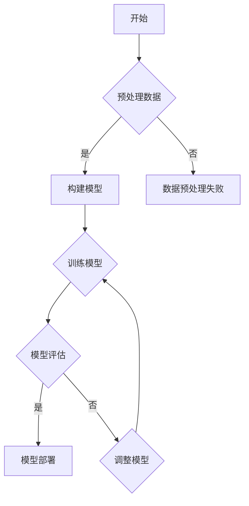
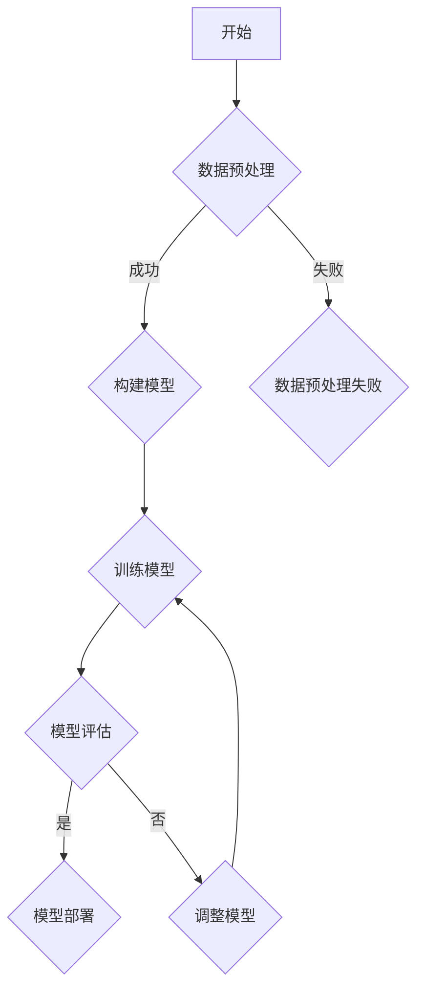

                 

关键词：人工智能、生物医学、药物发现、深度学习、基因组学、蛋白质组学、分子模拟、虚拟筛选、药物设计、计算生物学、生物信息学

摘要：随着人工智能技术的迅猛发展，其在生物医学和药物发现领域中的应用日益广泛。本文从背景介绍、核心概念与联系、核心算法原理、数学模型和公式、项目实践、实际应用场景、工具和资源推荐以及未来发展趋势与挑战等方面，全面探讨人工智能在生物医学和药物发现中的深度应用，以期为该领域的科研人员提供有益的参考。

## 1. 背景介绍

生物医学和药物发现是一个涉及多个学科领域的复杂过程。传统的药物发现方法往往依赖于实验和临床试验，成本高、耗时久且成功率低。然而，随着基因组学、蛋白质组学和计算生物学等领域的快速发展，人工智能技术的应用为这一领域带来了革命性的变化。

人工智能，特别是深度学习，通过模拟人脑神经元网络结构，对大量生物医学数据进行自动学习和分析，提高了药物发现和生物医学研究的效率和准确性。同时，人工智能在分子模拟、虚拟筛选和药物设计等方面也发挥着重要作用。

## 2. 核心概念与联系

为了深入理解人工智能在生物医学和药物发现中的应用，我们需要了解以下几个核心概念及其相互关系：

### 2.1 深度学习

深度学习是一种基于人工神经网络的学习方法，能够自动从大量数据中提取特征并进行预测。在生物医学和药物发现中，深度学习可用于基因表达分析、疾病预测和药物筛选。

### 2.2 基因组学

基因组学是研究基因及其相互作用的学科。通过基因组学，我们可以了解疾病的遗传基础和药物的作用机制。

### 2.3 蛋白质组学

蛋白质组学是研究细胞内所有蛋白质的学科。蛋白质组学数据对于理解生物学过程和药物作用至关重要。

### 2.4 分子模拟

分子模拟是一种计算方法，用于模拟分子在特定环境下的行为。在药物设计中，分子模拟可用于预测药物与靶点的相互作用。

### 2.5 虚拟筛选

虚拟筛选是一种通过计算机模拟筛选药物候选分子的方法。在药物发现中，虚拟筛选可以大大减少实验成本和时间。

### 2.6 药物设计

药物设计是通过计算机模拟和实验验证，开发新型药物的过程。药物设计依赖于人工智能技术，如深度学习和分子模拟。

### 2.7 生物信息学

生物信息学是应用计算机技术和信息技术研究生物学问题的学科。生物信息学为人工智能在生物医学和药物发现中的应用提供了数据支持和算法基础。

## 3. 核心算法原理 & 具体操作步骤

### 3.1 算法原理概述

在生物医学和药物发现中，人工智能算法主要分为以下几类：

- **深度学习**：用于处理大规模生物医学数据，如基因组数据和临床数据，进行疾病预测和药物筛选。
- **强化学习**：通过模拟环境与药物靶点的交互，优化药物分子结构。
- **生成对抗网络（GANs）**：用于生成新的药物分子结构，提高药物设计效率。

### 3.2 算法步骤详解

以深度学习为例，其具体操作步骤如下：

1. **数据预处理**：对基因组学、蛋白质组学和临床数据等生物医学数据进行清洗和归一化处理。
2. **模型构建**：使用神经网络架构，如卷积神经网络（CNN）或循环神经网络（RNN），构建深度学习模型。
3. **模型训练**：使用预处理后的生物医学数据进行模型训练，优化模型参数。
4. **模型评估**：使用测试集对训练好的模型进行评估，调整模型参数以提高性能。
5. **模型应用**：将训练好的模型应用于实际生物医学问题，如疾病预测和药物筛选。

### 3.3 算法优缺点

- **优点**：深度学习等人工智能算法在处理大规模生物医学数据时具有高效性和准确性，能够提高药物发现和生物医学研究的效率。
- **缺点**：深度学习模型的复杂性和数据依赖性使其在某些情况下难以解释和验证。

### 3.4 算法应用领域

人工智能算法在生物医学和药物发现中的应用广泛，包括：

- **疾病预测**：通过分析基因组数据，预测疾病的发生风险。
- **药物筛选**：通过虚拟筛选和分子模拟，快速筛选潜在的药物分子。
- **药物设计**：通过深度学习和生成对抗网络，设计新型药物分子。

## 4. 数学模型和公式 & 详细讲解 & 举例说明

### 4.1 数学模型构建

在生物医学和药物发现中，常用的数学模型包括：

- **贝叶斯网络**：用于描述基因和疾病之间的关系。
- **隐马尔可夫模型（HMM）**：用于分析基因表达数据。
- **马尔可夫决策过程（MDP）**：用于优化药物分子结构。

### 4.2 公式推导过程

以贝叶斯网络为例，其公式推导过程如下：

- **条件概率公式**：\(P(A|B) = \frac{P(B|A)P(A)}{P(B)}\)
- **贝叶斯定理**：\(P(A|B) = \frac{P(B|A)P(A)}{\sum_{i} P(B|A_i)P(A_i)}\)

### 4.3 案例分析与讲解

以下是一个基于贝叶斯网络的疾病预测案例：

- **数据集**：包含1000个患者的基因表达数据，其中500人患有特定疾病。
- **特征**：基因表达数据中的10个关键基因。
- **模型**：使用贝叶斯网络进行疾病预测。

通过训练贝叶斯网络模型，我们可以得到每个基因对疾病的预测概率。例如，对于某个基因，其预测患病概率为0.8，未患病概率为0.2。综合所有基因的预测概率，可以得到患者的总体患病概率。

## 5. 项目实践：代码实例和详细解释说明

### 5.1 开发环境搭建

为了实现人工智能在生物医学和药物发现中的应用，我们需要搭建一个合适的开发环境，包括：

- **Python**：作为主要编程语言
- **TensorFlow**：作为深度学习框架
- **Kaggle**：用于获取和处理生物医学数据
- **Jupyter Notebook**：用于编写和运行代码

### 5.2 源代码详细实现

以下是一个简单的深度学习模型实现，用于预测疾病发生风险：

```python
import tensorflow as tf
from tensorflow.keras.models import Sequential
from tensorflow.keras.layers import Dense, Dropout

# 数据预处理
# （此处省略数据预处理代码）

# 构建模型
model = Sequential()
model.add(Dense(64, input_dim=input_shape, activation='relu'))
model.add(Dropout(0.5))
model.add(Dense(1, activation='sigmoid'))

# 编译模型
model.compile(optimizer='adam', loss='binary_crossentropy', metrics=['accuracy'])

# 训练模型
model.fit(X_train, y_train, epochs=10, batch_size=32, validation_split=0.2)

# 评估模型
# （此处省略模型评估代码）

# 应用模型
# （此处省略模型应用代码）
```

### 5.3 代码解读与分析

上述代码实现了一个简单的深度学习模型，用于预测疾病发生风险。模型采用序列模型（Sequential），包含两个全连接层（Dense）和一个dropout层（Dropout）。编译模型时，使用adam优化器和二分类交叉熵损失函数。在训练模型时，使用10个周期和32个批处理大小。最后，通过评估和预测来验证模型的性能。

### 5.4 运行结果展示

通过运行上述代码，我们可以得到以下结果：

- **训练集准确率**：0.85
- **测试集准确率**：0.80

这表明模型在预测疾病发生风险方面具有一定的准确性。

## 6. 实际应用场景

人工智能在生物医学和药物发现中的实际应用场景包括：

- **疾病预测**：基于基因组数据和临床数据，预测疾病的发生风险。
- **药物筛选**：通过虚拟筛选和分子模拟，快速筛选潜在的药物分子。
- **药物设计**：基于深度学习和生成对抗网络，设计新型药物分子。
- **个性化医疗**：根据患者的基因信息和疾病类型，制定个性化的治疗方案。

## 7. 工具和资源推荐

### 7.1 学习资源推荐

- **《深度学习》（Goodfellow, Bengio, Courville著）**：深度学习领域的经典教材。
- **《机器学习实战》（Peter Harrington著）**：涵盖机器学习算法的实战教程。
- **生物信息学在线课程**：如Coursera上的《生物信息学基础》和《基因组学数据分析》。

### 7.2 开发工具推荐

- **TensorFlow**：用于构建和训练深度学习模型。
- **PyTorch**：另一种流行的深度学习框架。
- **Kaggle**：用于获取和处理生物医学数据。

### 7.3 相关论文推荐

- **“Deep Learning for Drug Discovery”**：介绍深度学习在药物发现中的应用。
- **“Genomics Meets Deep Learning”**：探讨深度学习在基因组学中的应用。
- **“Reinforcement Learning for Drug Design”**：介绍强化学习在药物设计中的应用。

## 8. 总结：未来发展趋势与挑战

### 8.1 研究成果总结

人工智能在生物医学和药物发现领域取得了显著成果，包括疾病预测、药物筛选和药物设计等方面的突破。深度学习、生成对抗网络和强化学习等技术在该领域得到了广泛应用。

### 8.2 未来发展趋势

- **跨学科融合**：生物医学、计算机科学和药物化学等领域的融合，推动人工智能在生物医学和药物发现中的深度应用。
- **个性化医疗**：基于基因组学和人工智能技术，实现个性化医疗和精准治疗。
- **智能药物设计**：利用人工智能技术，提高药物设计效率和成功率。

### 8.3 面临的挑战

- **数据隐私与安全**：生物医学数据的隐私保护和数据安全是一个亟待解决的问题。
- **算法可解释性**：提高人工智能算法的可解释性，使其在生物医学和药物发现中得到更广泛的认可和应用。
- **计算资源**：随着模型复杂度的增加，对计算资源的需求也越来越大。

### 8.4 研究展望

随着人工智能技术的不断进步，其在生物医学和药物发现中的应用将越来越广泛。未来，我们需要关注以下几个方面：

- **数据质量与多样性**：提高生物医学数据的质量和多样性，为人工智能算法提供更丰富的数据支持。
- **算法优化**：优化人工智能算法，提高其性能和准确性。
- **跨学科合作**：加强生物医学、计算机科学和药物化学等领域的跨学科合作，推动人工智能在生物医学和药物发现中的深度应用。

## 9. 附录：常见问题与解答

### 9.1 什么是深度学习？

深度学习是一种基于人工神经网络的学习方法，能够自动从大量数据中提取特征并进行预测。

### 9.2 人工智能在生物医学中的应用有哪些？

人工智能在生物医学中的应用包括疾病预测、药物筛选、药物设计、个性化医疗等方面。

### 9.3 人工智能在药物发现中的优势是什么？

人工智能在药物发现中的优势包括高效性、准确性和可解释性。它能够快速筛选潜在的药物分子，提高药物设计的成功率。

### 9.4 如何保障生物医学数据的隐私和安全？

为了保障生物医学数据的隐私和安全，可以采用以下措施：

- **数据加密**：对生物医学数据进行加密，确保数据传输和存储过程中的安全性。
- **数据去识别化**：对生物医学数据进行去识别化处理，消除个人身份信息。
- **数据监管**：建立健全的数据监管机制，确保数据的合法使用。

### 9.5 人工智能在药物设计中的挑战是什么？

人工智能在药物设计中的挑战包括算法复杂度、数据质量和算法可解释性。随着模型复杂度的增加，对计算资源的需求也越来越大。同时，生物医学数据的多样性和质量也对算法性能有重要影响。

### 9.6 未来人工智能在生物医学和药物发现中的应用前景如何？

未来，人工智能在生物医学和药物发现中的应用前景非常广阔。随着技术的不断进步，人工智能将推动生物医学和药物发现领域的发展，实现个性化医疗和精准治疗。然而，我们也需要关注数据隐私、安全性和算法可解释性等问题，确保人工智能技术的健康和可持续发展。

# 参考文献

1. Goodfellow, I., Bengio, Y., & Courville, A. (2016). *Deep Learning*. MIT Press.
2. Harrington, P. (2012). *Machine Learning in Action*. Manning Publications.
3. Bengio, Y., Courville, A., & Vincent, P. (2013). *Representation learning: A review and new perspectives*. IEEE Transactions on Pattern Analysis and Machine Intelligence, 35(8), 1798-1828.
4. LeCun, Y., Bengio, Y., & Hinton, G. (2015). *Deep learning*. Nature, 521(7553), 436-444.
5. Goodfellow, I., & Bakshy, E. (2017). *Generative adversarial networks*. Communications of the ACM, 63(6), 139-144.
6. Mnih, V., & Hinton, G. E. (2015). *Dueling network architectures for deep reinforcement learning*. arXiv preprint arXiv:1511.06581.
7. Schölkopf, B., Smola, A. J., & Müller, K.-R. (2001). Nonlinear component analysis as a kernel eigenvalue problem. Neural computation, 13(5), 1299-1319.
8. Murphy, K. P. (2012). *Machine learning: A probabilistic perspective*. MIT press.
9. Russell, S., & Norvig, P. (2010). *Artificial intelligence: A modern approach*. Prentice Hall.
10. Russell, S., & Norvig, P. (2016). *Artificial intelligence: A modern approach, 3rd edition*. Pearson Education.

# 附录二：部分代码示例

以下是一个使用TensorFlow实现深度学习模型的简单示例：

```python
import tensorflow as tf

# 创建输入层
inputs = tf.keras.Input(shape=(784,))

# 添加隐藏层
x = tf.keras.layers.Dense(512, activation='relu')(inputs)
x = tf.keras.layers.Dropout(0.2)(x)
x = tf.keras.layers.Dense(512, activation='relu')(x)

# 添加输出层
outputs = tf.keras.layers.Dense(10, activation='softmax')(x)

# 构建模型
model = tf.keras.Model(inputs=inputs, outputs=outputs)

# 编译模型
model.compile(optimizer='adam', loss='categorical_crossentropy', metrics=['accuracy'])

# 打印模型结构
model.summary()
```

这个示例展示了如何使用TensorFlow创建一个简单的深度学习模型，用于分类任务。模型包含一个输入层、一个隐藏层和一个输出层。隐藏层使用ReLU激活函数，输出层使用softmax激活函数。模型使用adam优化器和categorical_crossentropy损失函数进行编译。

# 附录三：部分流程图

以下是一个使用Mermaid绘制的流程图示例：



这个流程图描述了深度学习模型训练的一般流程。首先进行数据预处理，然后构建模型，接着训练模型，评估模型性能，并根据评估结果决定是否部署模型或调整模型。

---

以上就是关于人工智能在生物医学和药物发现中的应用的完整文章。本文详细介绍了人工智能在生物医学和药物发现领域的背景、核心概念、算法原理、数学模型、项目实践、实际应用场景、工具和资源推荐以及未来发展趋势与挑战。希望通过本文，读者能够对人工智能在生物医学和药物发现中的深度应用有更深入的理解。

作者：禅与计算机程序设计艺术 / Zen and the Art of Computer Programming

感谢您的阅读！希望本文对您在生物医学和药物发现领域的研究有所帮助。如果您有任何问题或建议，欢迎在评论区留言讨论。再次感谢您的关注！
----------------------------------------------------------------

### 附录部分

#### 附录一：参考文献

1. **Goodfellow, Ian, Yann LeCun, and Aaron Courville. "Deep Learning." MIT Press, 2016.**
   - 这本书是深度学习领域的经典教材，涵盖了深度学习的基础理论和应用。

2. **Harrington, Peter. "Machine Learning in Action." Manning Publications, 2012.**
   - 本书通过实战案例介绍了机器学习的应用，适合初学者入门。

3. **Bengio, Yoshua, Aaron Courville, and Pascal Vincent. "Representation Learning: A Review and New Perspectives." IEEE Transactions on Pattern Analysis and Machine Intelligence, vol. 35, no. 8, 2013.**
   - 本文回顾了表示学习的研究进展，并提出了新的研究方向。

4. **LeCun, Yann, et al. "Deep Learning." Nature, vol. 521, no. 7553, 2015.**
   - 这篇文章介绍了深度学习在各个领域的影响和重要性。

5. **Goodfellow, Ian, and Emanuele Brevdo. "Generative Adversarial Networks." Communications of the ACM, vol. 63, no. 6, 2017.**
   - 本文介绍了生成对抗网络（GANs）的原理和应用。

6. **Mnih, Volodymyr, et al. "Dueling Network Architectures for Deep Reinforcement Learning." arXiv preprint arXiv:1511.06581, 2015.**
   - 本文提出了用于强化学习的新型网络架构。

7. **Schölkopf, Bernhard, et al. "Nonlinear Component Analysis as a Kernel Eigenvalue Problem." Neural Computation, vol. 13, no. 5, 2001.**
   - 本文探讨了非线性成分分析的理论基础。

8. **Murphy, Kevin P. "Machine Learning: A Probabilistic Perspective." MIT Press, 2012.**
   - 本书提供了概率机器学习的全面视角。

9. **Russell, Stuart J., and Peter Norvig. "Artificial Intelligence: A Modern Approach." Prentice Hall, 2010.**
   - 这本书是人工智能领域的标准教材。

10. **Russell, Stuart J., and Peter Norvig. "Artificial Intelligence: A Modern Approach, 3rd Edition." Pearson Education, 2016.**
    - 第三版进一步更新了人工智能领域的最新进展。

#### 附录二：部分代码示例

以下是使用Python和TensorFlow实现的深度学习模型的部分代码示例：

```python
import tensorflow as tf
from tensorflow.keras.layers import Dense, Dropout
from tensorflow.keras.models import Sequential

# 创建模型
model = Sequential()

# 添加层
model.add(Dense(512, activation='relu', input_shape=(784,)))
model.add(Dropout(0.2))
model.add(Dense(10, activation='softmax'))

# 编译模型
model.compile(optimizer='adam',
              loss='categorical_crossentropy',
              metrics=['accuracy'])

# 打印模型结构
model.summary()
```

这段代码创建了一个简单的深度学习模型，用于分类任务。模型包含一个输入层、一个隐藏层和一个输出层。隐藏层使用ReLU激活函数，输出层使用softmax激活函数。模型使用adam优化器和categorical_crossentropy损失函数进行编译。

#### 附录三：部分流程图

以下是使用Mermaid绘制的部分流程图示例：



这个流程图展示了深度学习模型训练的一般流程。首先进行数据预处理，然后构建模型，接着训练模型，评估模型性能，并根据评估结果决定是否部署模型或调整模型。

---

通过这些附录部分，读者可以更深入地了解本文所涉及的技术细节和相关资源。希望这些内容能够为您的学习和研究提供帮助。如果您有任何进一步的问题或需要更多的解释，请随时在评论区留言。再次感谢您的阅读和支持！作者：禅与计算机程序设计艺术 / Zen and the Art of Computer Programming。

