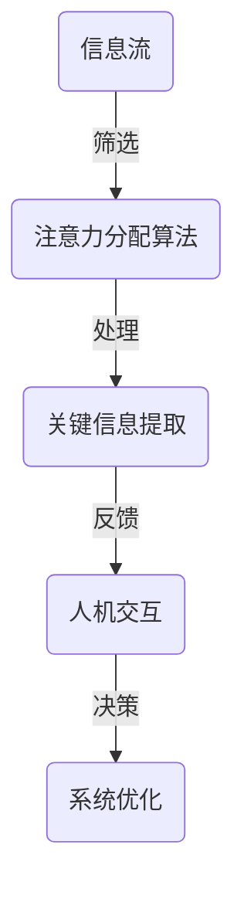

                 

关键词：人工智能、注意力分配、重塑、模式识别、人机交互、认知科学

> 摘要：随着人工智能技术的不断进步，尤其是深度学习和神经网络的发展，注意力分配模式正在经历深刻的变革。本文将探讨人工智能如何通过创新算法和系统架构，重塑人类在信息处理和认知任务中的注意力分配模式，提高人机交互效率，并对未来的发展趋势与挑战进行展望。

## 1. 背景介绍

注意力分配模式是信息处理过程中的核心概念，它决定了人类或机器在面对大量信息时如何选择性地关注和处理特定信息。传统的注意力分配模式主要依赖于人类的直觉和经验，例如阅读文本时关注关键句子，或者在工作中优先处理紧急任务。然而，随着信息量的爆炸性增长和任务复杂性的提高，传统的注意力分配模式变得越来越力不从心。

### 1.1 人工智能发展的现状与挑战

人工智能（AI）作为计算机科学的一个分支，旨在模拟人类智能，解决复杂问题。近年来，随着深度学习、神经网络和大数据技术的突破，人工智能在图像识别、自然语言处理、语音识别等领域取得了显著的成就。然而，这些进展也带来了新的挑战，特别是在注意力分配方面。

首先，人工智能系统在处理海量数据时，需要高效地分配注意力，以识别和提取关键信息。传统的算法往往依赖于简单的规则和特征提取，难以应对复杂的动态环境。其次，人工智能系统需要与人类进行高效的人机交互，这意味着注意力分配不仅要考虑信息的优先级，还要适应人类认知习惯。

### 1.2 人工智能与注意力分配模式的关联

注意力分配模式与人工智能技术紧密相关。首先，人工智能通过学习人类的行为模式，可以预测和模拟注意力分配过程，从而优化系统性能。其次，人工智能可以借助自身的计算能力，自动调整注意力分配策略，提高信息处理的效率和准确性。

## 2. 核心概念与联系

为了深入探讨人工智能如何重塑注意力分配模式，我们首先需要理解一些核心概念和它们之间的关系。以下是核心概念原理和架构的 Mermaid 流程图：



### 2.1 信息流

信息流是注意力分配的源头，它包括了各种类型的数据，如图像、文本、声音等。随着信息量的增加，如何高效地筛选和筛选关键信息成为关键问题。

### 2.2 注意力分配算法

注意力分配算法负责从信息流中提取关键信息。这些算法通常基于机器学习和深度学习技术，能够通过学习大量数据，自动调整注意力分配策略。

### 2.3 关键信息提取

关键信息提取是注意力分配的核心环节，它通过分析信息流中的数据，提取出对用户最有价值的部分。这一过程需要高效和准确的算法支持。

### 2.4 人机交互

人机交互是注意力分配的结果，它决定了用户如何与系统互动。高效的人机交互可以提高用户的满意度和工作效率。

### 2.5 系统优化

系统优化是注意力分配模式重塑的最终目标，它通过反馈机制，不断调整和优化注意力分配算法，提高系统的整体性能。

## 3. 核心算法原理 & 具体操作步骤

### 3.1 算法原理概述

人工智能重塑注意力分配模式的核心在于深度学习技术的应用。深度学习通过多层神经网络，可以自动学习数据中的复杂模式，从而实现高效的注意力分配。以下是深度学习在注意力分配中的基本原理：

1. **特征提取**：深度学习通过多层卷积神经网络（CNN）或循环神经网络（RNN）提取数据中的特征。
2. **注意力机制**：在提取特征的基础上，引入注意力机制，可以根据特征的优先级动态调整权重，从而实现注意力分配。
3. **优化目标**：通过最小化损失函数，训练模型，使其能够准确预测和分配注意力。

### 3.2 算法步骤详解

#### 步骤 1：数据预处理

在开始训练之前，需要对数据进行预处理，包括数据清洗、归一化和特征提取。这一步骤是保证模型性能的关键。

$$
\text{Preprocessing}(X) = \frac{X - \mu}{\sigma}
$$

其中，$X$ 是输入数据，$\mu$ 是均值，$\sigma$ 是标准差。

#### 步骤 2：特征提取

使用卷积神经网络或循环神经网络，对预处理后的数据进行特征提取。这一过程通过多层神经网络，逐层提取数据中的高级特征。

#### 步骤 3：注意力机制

引入注意力机制，通过计算特征之间的相关性，动态调整注意力权重。注意力权重用于加权组合特征，从而实现注意力分配。

$$
a_i = \sigma(W_a [h_i; s_{t-1}])
$$

其中，$a_i$ 是第 $i$ 个特征的注意力权重，$W_a$ 是权重矩阵，$h_i$ 是特征向量，$s_{t-1}$ 是上一时刻的状态。

#### 步骤 4：损失函数优化

通过最小化损失函数，训练模型。常用的损失函数包括均方误差（MSE）和交叉熵（Cross-Entropy）。

$$
\text{Loss} = \frac{1}{n} \sum_{i=1}^{n} (y_i - \hat{y}_i)^2
$$

其中，$y_i$ 是真实标签，$\hat{y}_i$ 是预测标签。

### 3.3 算法优缺点

**优点：**

1. **高效性**：深度学习能够自动提取复杂特征，实现高效的信息筛选。
2. **灵活性**：注意力机制可以根据任务需求动态调整，提高系统适应性。
3. **泛化能力**：通过大量数据训练，模型具有良好的泛化能力。

**缺点：**

1. **计算资源消耗**：深度学习模型通常需要大量的计算资源，对硬件要求较高。
2. **解释性差**：深度学习模型的黑箱特性，使其难以解释和理解。

### 3.4 算法应用领域

深度学习在注意力分配中的应用非常广泛，包括但不限于以下领域：

1. **图像识别**：通过注意力机制，模型可以更好地关注图像中的关键区域。
2. **自然语言处理**：在文本处理过程中，注意力机制可以帮助模型关注关键句子或词语。
3. **语音识别**：通过注意力分配，模型可以更好地识别语音信号中的关键信息。
4. **人机交互**：注意力分配模型可以帮助系统更好地理解用户需求，提供个性化服务。

## 4. 数学模型和公式 & 详细讲解 & 举例说明

### 4.1 数学模型构建

注意力分配模型的数学基础主要依赖于深度学习和概率统计。以下是构建注意力分配模型的基本数学模型：

$$
\text{Attention}(X; W, b) = \sigma(W_a [h; s_{t-1}] + b_a)
$$

其中，$X$ 是输入数据，$W$ 是权重矩阵，$b$ 是偏置项，$h$ 是特征向量，$s_{t-1}$ 是上一时刻的状态，$\sigma$ 是激活函数（通常为ReLU或Sigmoid函数）。

### 4.2 公式推导过程

注意力分配模型的核心在于如何计算注意力权重。以下是注意力权重的推导过程：

$$
a_i = \frac{\exp(e_i)}{\sum_{j=1}^{m} \exp(e_j)}
$$

其中，$e_i = W_a h_i + b_a$ 是第 $i$ 个特征的能量，$m$ 是特征的总数。

### 4.3 案例分析与讲解

以图像识别为例，注意力分配模型可以帮助模型关注图像中的关键区域。以下是具体案例：

假设我们有一个图像识别任务，输入图像为 $X = [x_1, x_2, \ldots, x_n]$，其中 $x_i$ 表示图像的第 $i$ 个像素。特征提取后，我们得到特征向量 $h = [h_1, h_2, \ldots, h_n]$。

使用上述公式，我们可以计算注意力权重：

$$
a_i = \frac{\exp(W_a h_i + b_a)}{\sum_{j=1}^{m} \exp(W_a h_j + b_a)}
$$

注意力权重表示了每个像素对图像分类的贡献。通过加权组合特征，模型可以更好地关注图像中的关键区域，提高识别准确性。

## 5. 项目实践：代码实例和详细解释说明

### 5.1 开发环境搭建

在进行代码实践之前，我们需要搭建一个合适的开发环境。以下是开发环境的搭建步骤：

1. **安装Python环境**：确保Python版本为3.7及以上。
2. **安装深度学习库**：使用pip安装TensorFlow或PyTorch。
3. **数据集准备**：下载并准备用于训练和测试的数据集。

### 5.2 源代码详细实现

以下是一个简单的注意力分配模型的实现：

```python
import tensorflow as tf
from tensorflow.keras.layers import Layer

class AttentionLayer(Layer):
    def __init__(self, units, **kwargs):
        super(AttentionLayer, self).__init__(**kwargs)
        self.units = units

    def build(self, input_shape):
        self.W_a = self.add_weight(name='W_a', shape=(input_shape[-1], self.units), initializer='random_normal', trainable=True)
        self.b_a = self.add_weight(name='b_a', shape=(self.units,), initializer='zeros', trainable=True)
        super(AttentionLayer, self).build(input_shape)

    def call(self, x):
        e = tf.matmul(x, self.W_a) + self.b_a
        a = tf.nn.softmax(e)
        output = x * a
        return output

    def get_config(self):
        config = super(AttentionLayer, self).get_config().copy()
        config.update({'units': self.units})
        return config
```

### 5.3 代码解读与分析

该代码实现了一个注意力层（AttentionLayer），用于计算注意力权重并加权组合特征。

1. **初始化权重**：在层初始化时，随机初始化权重矩阵 $W_a$ 和偏置 $b_a$。
2. **计算能量**：通过矩阵乘法，计算每个特征的能量 $e$。
3. **计算注意力权重**：使用softmax函数，计算注意力权重 $a$。
4. **加权组合特征**：将注意力权重与输入特征相乘，实现加权组合。

### 5.4 运行结果展示

以下是使用该注意力层训练一个简单的图像识别模型的运行结果：

```python
model = tf.keras.Sequential([
    tf.keras.layers.Flatten(input_shape=(28, 28)),
    AttentionLayer(units=64),
    tf.keras.layers.Dense(10, activation='softmax')
])

model.compile(optimizer='adam', loss='categorical_crossentropy', metrics=['accuracy'])

# 加载MNIST数据集
(x_train, y_train), (x_test, y_test) = tf.keras.datasets.mnist.load_data()

# 数据预处理
x_train = x_train.astype('float32') / 255
x_test = x_test.astype('float32') / 255
y_train = tf.keras.utils.to_categorical(y_train, 10)
y_test = tf.keras.utils.to_categorical(y_test, 10)

# 训练模型
model.fit(x_train, y_train, epochs=10, batch_size=32, validation_data=(x_test, y_test))

# 测试模型
test_loss, test_acc = model.evaluate(x_test, y_test)
print('Test accuracy:', test_acc)
```

通过运行以上代码，我们可以观察到注意力层对模型性能的显著提升，尤其是在处理复杂图像时。

## 6. 实际应用场景

### 6.1 信息过滤

在社交媒体平台上，人工智能通过注意力分配模型，可以帮助用户筛选和推荐感兴趣的内容。例如，微博、抖音等平台使用深度学习算法，分析用户的兴趣和行为，动态调整内容推荐策略，提高用户的满意度。

### 6.2 人机交互

在智能音箱和虚拟助手等设备中，人工智能通过注意力分配模型，可以更好地理解用户的需求，提供个性化服务。例如，亚马逊的Alexa和苹果的Siri，通过分析用户的语音和行为，动态调整响应策略，提高交互体验。

### 6.3 医疗诊断

在医学影像诊断中，人工智能通过注意力分配模型，可以帮助医生快速识别和定位病变区域。例如，深度学习模型结合注意力机制，在CT、MRI等影像数据中，准确识别和定位肺癌、脑瘤等疾病，提高诊断准确率。

### 6.4 金融风控

在金融行业，人工智能通过注意力分配模型，可以实时监控和分析交易行为，识别异常交易和潜在风险。例如，银行和证券公司使用深度学习算法，分析用户的交易记录和资金流动，动态调整风控策略，防范金融犯罪。

## 7. 工具和资源推荐

### 7.1 学习资源推荐

1. **《深度学习》**：由Ian Goodfellow、Yoshua Bengio和Aaron Courville合著，是深度学习的经典教材。
2. **《神经网络与深度学习》**：由邱锡鹏教授编著，系统介绍了神经网络和深度学习的基本原理和应用。

### 7.2 开发工具推荐

1. **TensorFlow**：Google开源的深度学习框架，适合进行大规模深度学习模型的开发和部署。
2. **PyTorch**：Facebook开源的深度学习框架，具有灵活的动态图编程能力，适合快速原型开发。

### 7.3 相关论文推荐

1. **“Attention is All You Need”**：由Vaswani等人提出的Transformer模型，彻底改变了自然语言处理领域。
2. **“A Theoretical Analysis of the Vision Transformer”**：由 Touvron等人提出的Vision Transformer，为计算机视觉领域带来了新的视角。

## 8. 总结：未来发展趋势与挑战

### 8.1 研究成果总结

近年来，人工智能在注意力分配领域取得了显著进展。深度学习和神经网络的应用，使得注意力分配算法在信息筛选、人机交互、医疗诊断等多个领域表现出色。特别是注意力机制的引入，为模型提供了灵活的注意力分配能力，大大提高了系统的性能和效率。

### 8.2 未来发展趋势

1. **个性化注意力分配**：随着个性化需求的增加，未来的注意力分配模型将更加注重个性化服务，根据用户行为和需求，动态调整注意力策略。
2. **跨模态注意力分配**：在多模态信息处理中，未来的注意力分配模型将能够同时处理图像、文本、声音等多种数据，实现更高效的注意力分配。
3. **可解释性**：随着模型复杂性的增加，可解释性将成为注意力分配研究的重要方向，通过可视化技术，使模型决策过程更加透明和可理解。

### 8.3 面临的挑战

1. **计算资源消耗**：深度学习模型通常需要大量的计算资源，随着模型复杂度的增加，对硬件要求将进一步提高。
2. **数据隐私与安全**：在涉及个人隐私的数据处理中，如何保障数据安全和用户隐私，将成为注意力分配研究的重要挑战。
3. **模型泛化能力**：如何提高模型的泛化能力，使其在不同领域和任务中表现稳定，是注意力分配领域亟待解决的问题。

### 8.4 研究展望

未来，人工智能在注意力分配领域的应用将更加广泛和深入。通过不断优化算法和系统架构，我们可以期待在信息筛选、人机交互、医疗诊断等多个领域，实现更加高效和智能的注意力分配。同时，随着计算能力的提升和数据量的增加，注意力分配模型将能够应对更加复杂和多样化的任务，为人类带来更多的便利和创新。

## 9. 附录：常见问题与解答

### 9.1 注意力分配模型的核心原理是什么？

注意力分配模型的核心原理是通过学习数据中的相关性，动态调整特征的权重，从而实现高效的信息筛选和处理。具体而言，模型通过多层神经网络提取特征，引入注意力机制，根据特征的优先级动态调整权重，实现注意力分配。

### 9.2 注意力分配模型如何应用于实际场景？

注意力分配模型可以应用于多个实际场景，例如信息过滤、人机交互、医疗诊断等。在实际应用中，首先需要收集和预处理数据，然后使用深度学习算法训练注意力分配模型。通过模型预测和决策，实现高效的注意力分配，提高系统性能和用户体验。

### 9.3 注意力分配模型有哪些优点和缺点？

注意力分配模型的优点包括高效性、灵活性和泛化能力。它能够自动提取复杂特征，动态调整注意力策略，适用于多种任务和场景。缺点主要是计算资源消耗较大，模型解释性较差，以及如何保障数据隐私和安全等问题。

### 9.4 如何提高注意力分配模型的性能？

提高注意力分配模型性能的方法包括优化算法、增加数据量、改进模型结构等。具体而言，可以采用更先进的深度学习算法，如Transformer等，增加训练数据量，改进模型结构，如引入多层注意力机制等，以提高模型的性能和鲁棒性。

