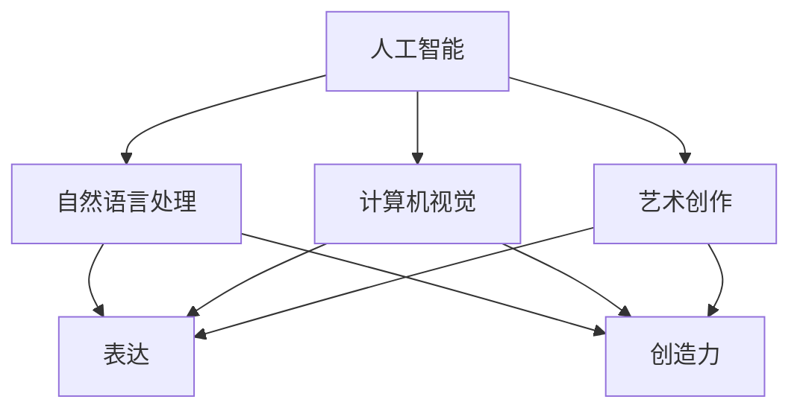

                 

### 关键词 Keywords
- 人工智能
- 创造力
- 表达
- 图灵测试
- 自然语言处理
- 计算机视觉
- 艺术创作
- 神经网络

<|assistant|>### 摘要 Abstract
本文旨在探讨人工智能在创造力和表达方面的潜力。通过对人工智能在自然语言处理、计算机视觉和艺术创作等领域的研究，本文揭示了人工智能如何模拟人类创造力，并探讨其在未来可能的应用和影响。文章首先介绍了人工智能的基本概念和主要领域，随后深入分析了人工智能在创造力表达中的具体应用，最后提出了未来发展的趋势和面临的挑战。

## 1. 背景介绍

人工智能（AI）作为一个跨学科的领域，其历史可以追溯到20世纪50年代。从最初的符号主义和逻辑推理，到后来的连接主义和强化学习，人工智能的发展经历了多个阶段。随着计算能力的提升和数据规模的扩大，人工智能在图像识别、语音识别、自然语言处理等领域取得了显著的进展。然而，尽管人工智能在执行重复性任务方面表现出色，但在创造力和表达方面仍然面临诸多挑战。

创造力是人类智慧的体现，是一种独特的思维过程，涉及创新、发现和新思路的生成。在艺术、科学、商业等各个领域，创造力都发挥着至关重要的作用。传统上，创造力被认为是人类独有的特质，但随着人工智能技术的发展，人工智能是否能够拥有创造力成为了一个备受关注的话题。

表达是信息传递和情感沟通的重要手段。无论是通过语言、图像还是其他形式，表达都是人类交流的核心。在人工智能领域，自然语言处理和计算机视觉等技术正在被用于模拟和理解人类的表达方式，从而实现更加自然和高效的交流。

本文将从人工智能在创造力表达方面的应用出发，探讨其在艺术创作、自然语言处理和计算机视觉等领域的具体实现，并分析其优缺点和潜在的应用前景。

### 2. 核心概念与联系

在讨论人工智能在创造力和表达方面的应用之前，我们需要先了解一些核心概念和它们之间的联系。

#### 2.1 人工智能的定义

人工智能（Artificial Intelligence，简称AI）是计算机科学的一个分支，旨在研究如何构建智能代理，使其能够执行通常需要人类智能才能完成的任务。这些任务包括理解语言、识别图像、推理决策等。人工智能可以划分为多种类型，如基于规则的系统、神经网络、遗传算法等。

#### 2.2 创造力的定义

创造力是指能够产生新颖、有价值的想法和解决方案的能力。它不仅涉及技术的创新，还涉及对现有知识的重新组合和新颖的应用。创造力可以分为多种类型，如艺术创造力、科学创造力、技术创造力等。

#### 2.3 表达的定义

表达是指通过某种媒介或形式，将想法、情感或信息传递给他人的过程。在人工智能领域，表达主要涉及自然语言处理和计算机视觉技术，这些技术使得人工智能能够理解和生成自然语言，以及理解和生成视觉内容。

#### 2.4 人工智能与创造力、表达的联系

人工智能与创造力、表达之间的联系体现在多个方面。首先，人工智能可以通过模仿人类的思维过程，实现创造力的模拟。例如，通过神经网络和深度学习技术，人工智能可以在图像识别、自然语言处理等领域实现创新性的应用。其次，人工智能可以通过生成算法和生成模型，实现内容的自动生成和创造，从而实现表达的创新。例如，人工智能可以生成音乐、绘画、故事等艺术形式，通过自然语言处理技术实现自然语言的自动生成。

以下是一个使用Mermaid绘制的流程图，展示了人工智能在创造力表达中的核心概念和它们之间的联系：



### 3. 核心算法原理 & 具体操作步骤

#### 3.1 算法原理概述

在讨论人工智能在创造力和表达方面的应用时，我们需要了解一些核心算法的原理和具体操作步骤。以下是一些主要的算法和模型：

#### 3.1.1 神经网络

神经网络（Neural Networks）是一种模拟生物神经元工作的计算模型。它由大量的节点（或称为神经元）组成，这些节点通过权重相互连接。通过学习输入和输出数据之间的关系，神经网络能够实现对复杂函数的建模和预测。在自然语言处理和计算机视觉领域，神经网络被广泛应用于图像识别、语音识别和文本生成等任务。

#### 3.1.2 深度学习

深度学习（Deep Learning）是神经网络的一种扩展，它通过多层网络结构来实现更复杂的特征提取和表示。深度学习在人工智能领域取得了许多突破性的成果，特别是在图像识别、语音识别和自然语言处理等领域。

#### 3.1.3 生成对抗网络

生成对抗网络（Generative Adversarial Networks，简称GAN）是一种基于博弈论的生成模型。它由一个生成器和一个判别器组成，生成器尝试生成与真实数据相似的数据，而判别器则尝试区分生成数据和真实数据。通过这种对抗过程，生成器逐渐提升其生成能力，从而生成高质量的数据。

#### 3.1.4 聚类算法

聚类算法（Clustering Algorithms）是一种无监督学习算法，它通过将相似的数据点分组来揭示数据中的模式和结构。聚类算法在图像识别、文本挖掘和数据分析等领域有广泛的应用。

#### 3.2 算法步骤详解

以下是一些核心算法的具体操作步骤：

#### 3.2.1 神经网络训练步骤

1. 数据准备：收集和整理输入数据集，并将其划分为训练集、验证集和测试集。
2. 构建网络：定义神经网络的架构，包括输入层、隐藏层和输出层。
3. 初始化权重：随机初始化网络的权重和偏置。
4. 前向传播：计算网络的输出，并与实际输出进行比较。
5. 反向传播：根据输出误差，更新网络的权重和偏置。
6. 验证和测试：在验证集和测试集上评估网络的性能。

#### 3.2.2 深度学习训练步骤

1. 数据预处理：对图像、文本或音频数据进行预处理，以适应深度学习模型的输入要求。
2. 构建网络：定义深度学习网络的架构，包括卷积层、全连接层、循环层等。
3. 初始化权重：随机初始化网络的权重和偏置。
4. 前向传播：计算网络的输出，并与实际输出进行比较。
5. 反向传播：根据输出误差，更新网络的权重和偏置。
6. 模型优化：使用优化算法（如梯度下降、Adam优化器等）调整网络参数。
7. 验证和测试：在验证集和测试集上评估网络的性能。

#### 3.2.3 生成对抗网络训练步骤

1. 数据准备：收集和整理训练数据集，并将其划分为真实数据和生成数据。
2. 初始化生成器和判别器：随机初始化生成器和判别器的权重。
3. 训练过程：交替训练生成器和判别器，生成器尝试生成更逼真的数据，而判别器尝试区分生成数据和真实数据。
4. 评估和调整：在训练过程中，定期评估生成器的性能，并根据评估结果调整网络参数。

#### 3.2.4 聚类算法步骤

1. 数据准备：收集和整理数据集，并将其划分为训练集和测试集。
2. 选择聚类算法：根据数据的特点和需求选择合适的聚类算法，如K-means、DBSCAN等。
3. 初始化聚类中心：随机或根据某种规则初始化聚类中心。
4. 聚类过程：将每个数据点分配到最近的聚类中心，并更新聚类中心的位置。
5. 评估和调整：在测试集上评估聚类的效果，并根据评估结果调整聚类参数。

#### 3.3 算法优缺点

每种算法都有其优缺点，适用于不同的应用场景。以下是一些核心算法的优缺点：

- 神经网络：
  - 优点：能够自动学习复杂的特征和模式，适用于多种任务。
  - 缺点：训练时间较长，对数据质量有较高要求。
- 深度学习：
  - 优点：能够处理大规模数据和高维特征，实现了很多突破性的成果。
  - 缺点：计算资源需求高，模型解释性较差。
- 生成对抗网络：
  - 优点：能够生成高质量的生成数据，适用于图像、音频和文本的生成。
  - 缺点：训练过程不稳定，容易出现模式崩溃和生成器退化等问题。
- 聚类算法：
  - 优点：能够无监督地发现数据中的模式和结构，适用于数据挖掘和模式识别。
  - 缺点：对初始聚类中心敏感，可能产生错误的聚类结果。

#### 3.4 算法应用领域

各种算法在人工智能的不同领域中有着广泛的应用：

- 自然语言处理：神经网络和深度学习被广泛应用于文本分类、机器翻译、情感分析等任务。
- 计算机视觉：神经网络和生成对抗网络被广泛应用于图像识别、图像生成、视频分析等任务。
- 艺术创作：生成对抗网络和神经网络被用于生成音乐、绘画、故事等艺术形式。

### 4. 数学模型和公式 & 详细讲解 & 举例说明

在人工智能的创造力和表达领域，数学模型和公式扮演着至关重要的角色。这些模型和公式不仅帮助我们理解算法的工作原理，还指导我们进行实际操作和优化。以下是一些关键的数学模型和公式，以及它们的详细讲解和举例说明。

#### 4.1 数学模型构建

在讨论数学模型时，我们通常需要定义变量、参数和假设条件。以下是一个简单的线性回归模型的例子：

$$y = \beta_0 + \beta_1x + \epsilon$$

其中，$y$ 是因变量，$x$ 是自变量，$\beta_0$ 和 $\beta_1$ 是模型的参数，$\epsilon$ 是误差项。

#### 4.2 公式推导过程

以神经网络中的反向传播算法为例，我们通过以下步骤推导损失函数的梯度：

1. **前向传播**：

$$z = wx + b$$
$$a = \sigma(z)$$

其中，$z$ 是激活值，$a$ 是输出值，$w$ 和 $b$ 分别是权重和偏置，$\sigma$ 是激活函数。

2. **损失函数**：

$$J(\theta) = \frac{1}{2} \sum_{i=1}^{m} (y^{(i)} - a^{(i)})^2$$

其中，$J(\theta)$ 是损失函数，$y^{(i)}$ 是实际输出，$a^{(i)}$ 是预测输出。

3. **后向传播**：

计算损失函数关于每个参数的梯度：

$$\frac{\partial J(\theta)}{\partial w} = \sum_{i=1}^{m} (y^{(i)} - a^{(i)}) \times \frac{\partial a^{(i)}}{\partial z^{(i)}}$$
$$\frac{\partial J(\theta)}{\partial b} = \sum_{i=1}^{m} (y^{(i)} - a^{(i)}) \times \frac{\partial a^{(i)}}{\partial z^{(i)}}$$
$$\frac{\partial J(\theta)}{\partial z} = \sum_{i=1}^{m} (y^{(i)} - a^{(i)}) \times \frac{\partial a^{(i)}}{\partial z^{(i)}}$$

4. **更新参数**：

使用梯度下降法更新参数：

$$w := w - \alpha \frac{\partial J(\theta)}{\partial w}$$
$$b := b - \alpha \frac{\partial J(\theta)}{\partial b}$$

其中，$\alpha$ 是学习率。

#### 4.3 案例分析与讲解

以下是一个简单的神经网络训练过程的案例：

假设我们有一个包含10个输入特征的二分类问题，使用单层感知机模型进行训练。

1. **数据集准备**：

我们有100个训练样本，每个样本包含10个特征和1个标签（0或1）。

2. **模型初始化**：

初始化权重 $w$ 和偏置 $b$ 为较小的随机值。

3. **前向传播**：

对于每个训练样本，计算输出：

$$z = wx + b$$
$$a = \sigma(z)$$

4. **计算损失函数**：

$$J(\theta) = \frac{1}{2} \sum_{i=1}^{m} (y^{(i)} - a^{(i)})^2$$

5. **后向传播**：

计算每个参数的梯度：

$$\frac{\partial J(\theta)}{\partial w} = \sum_{i=1}^{m} (y^{(i)} - a^{(i)}) \times x^{(i)}$$
$$\frac{\partial J(\theta)}{\partial b} = \sum_{i=1}^{m} (y^{(i)} - a^{(i)})$$

6. **更新参数**：

$$w := w - \alpha \frac{\partial J(\theta)}{\partial w}$$
$$b := b - \alpha \frac{\partial J(\theta)}{\partial b}$$

7. **迭代训练**：

重复以上步骤，直到满足停止条件（如损失函数低于某个阈值或达到最大迭代次数）。

#### 4.4 生成对抗网络的例子

生成对抗网络（GAN）是一个复杂的模型，以下是一个简化的例子：

1. **数据集准备**：

假设我们有一个包含手写数字的图像数据集。

2. **生成器**：

生成器模型 $G$ 的目标是生成类似于真实数据的图像。我们随机生成一些噪声向量 $z$，并通过生成器模型将其映射到图像空间：

$$x_G = G(z)$$

3. **判别器**：

判别器模型 $D$ 的目标是区分真实数据和生成数据。我们通过判别器模型对真实数据和生成数据分别进行评估：

$$D(x) = P(x \text{ is real})$$
$$D(x_G) = P(x_G \text{ is real})$$

4. **训练过程**：

交替训练生成器和判别器，生成器尝试生成更逼真的数据，而判别器尝试区分生成数据和真实数据。训练过程如下：

- 在生成器迭代中，我们固定判别器的参数，通过反向传播算法更新生成器的参数，以减少生成数据与真实数据之间的差异。
- 在判别器迭代中，我们固定生成器的参数，通过反向传播算法更新判别器的参数，以提高其区分生成数据和真实数据的能力。

通过这种对抗过程，生成器的生成能力逐渐提升，最终能够生成高质量的数据。

#### 4.5 聚类算法的例子

以K-means聚类算法为例，以下是一个简化的例子：

1. **数据集准备**：

假设我们有一个包含二维数据的点集。

2. **初始化聚类中心**：

随机选择K个点作为初始聚类中心。

3. **聚类过程**：

对于每个数据点，计算其到各个聚类中心的距离，并将其分配到最近的聚类中心。

4. **更新聚类中心**：

计算每个聚类中心的新位置，作为其对应数据点的平均值。

5. **重复聚类过程**：

重复聚类过程，直到聚类中心的位置不再发生变化或达到最大迭代次数。

6. **评估聚类效果**：

通过计算聚类内部距离和聚类间距离来评估聚类效果。

### 5. 项目实践：代码实例和详细解释说明

在本节中，我们将通过一个实际的项目实例来展示如何使用Python和TensorFlow来实现一个简单的人工智能艺术创作系统。我们将使用生成对抗网络（GAN）来生成具有艺术美感的图像。

#### 5.1 开发环境搭建

要开始这个项目，您需要安装以下软件和库：

- Python（3.7或更高版本）
- TensorFlow（2.x版本）
- NumPy
- Matplotlib
- Pillow

您可以使用以下命令来安装所需的库：

```bash
pip install tensorflow numpy matplotlib pillow
```

#### 5.2 源代码详细实现

以下是一个简单的GAN模型实现，用于生成艺术风格的图像：

```python
import numpy as np
import tensorflow as tf
from tensorflow.keras.layers import Dense, Flatten, Reshape, Conv2D, Conv2DTranspose, BatchNormalization, LeakyReLU
from tensorflow.keras.models import Sequential

# 数据预处理
def preprocess_images(images):
    images = images / 127.5 - 1.0
    return images

# 生成器模型
def build_generator(z_dim):
    model = Sequential()
    model.add(Dense(7*7*256, input_shape=(z_dim,), activation='relu'))
    model.add(Reshape((7, 7, 256)))
    model.add(BatchNormalization())
    model.add(LeakyReLU(alpha=0.2))
    
    model.add(Conv2DTranspose(128, kernel_size=5, strides=2, padding='same'))
    model.add(BatchNormalization())
    model.add(LeakyReLU(alpha=0.2))
    
    model.add(Conv2DTranspose(64, kernel_size=5, strides=2, padding='same'))
    model.add(BatchNormalization())
    model.add(LeakyReLU(alpha=0.2))
    
    model.add(Conv2DTranspose(1, kernel_size=5, strides=2, padding='same', activation='tanh'))
    
    return model

# 判别器模型
def build_discriminator(img_shape):
    model = Sequential()
    model.add(Conv2D(32, kernel_size=5, strides=2, padding='same', input_shape=img_shape))
    model.add(LeakyReLU(alpha=0.2))
    
    model.add(Conv2D(64, kernel_size=5, strides=2, padding='same'))
    model.add(LeakyReLU(alpha=0.2))
    
    model.add(Flatten())
    model.add(Dense(1, activation='sigmoid'))
    
    return model

# GAN模型
def build_gan(generator, discriminator):
    model = Sequential()
    model.add(generator)
    model.add(discriminator)
    return model

# 损失函数
def build_loss_optimizer(z_dim):
    generator = build_generator(z_dim)
    discriminator = build_discriminator((28, 28, 1))
    
    discriminator.compile(loss='binary_crossentropy', optimizer=tf.keras.optimizers.Adam(0.0001))
    generator.compile(loss='binary_crossentropy', optimizer=tf.keras.optimizers.Adam(0.0001))
    
    gan = build_gan(generator, discriminator)
    gan.compile(loss='binary_crossentropy', optimizer=tf.keras.optimizers.Adam(0.0001))
    
    return gan, generator, discriminator

# 训练GAN模型
def train_gan(gan, generator, discriminator, batch_size, epochs, img_shape, z_dim):
    (X_train, _), (_, _) = tf.keras.datasets.mnist.load_data()
    X_train = preprocess_images(X_train)
    
    for epoch in range(epochs):
        for _ in range(batch_size // 2):
            noise = np.random.normal(0, 1, (batch_size, z_dim))
            generated_images = generator.predict(noise)
            
            real_images = X_train[np.random.randint(0, X_train.shape[0], batch_size // 2)]
            fake_images = generated_images
            
            real_labels = np.ones((batch_size // 2,))
            fake_labels = np.zeros((batch_size // 2,))
            
            discriminator.train_on_batch(np.concatenate([real_images, fake_images]), np.concatenate([real_labels, fake_labels]))
        
        noise = np.random.normal(0, 1, (batch_size, z_dim))
        generated_images = generator.predict(noise)
        real_labels = np.ones((batch_size,))
        
        gan.train_on_batch(noise, real_labels)

# 主函数
def main():
    z_dim = 100
    batch_size = 64
    epochs = 50
    img_shape = (28, 28, 1)
    
    gan, generator, discriminator = build_loss_optimizer(z_dim)
    train_gan(gan, generator, discriminator, batch_size, epochs, img_shape, z_dim)

if __name__ == '__main__':
    main()
```

#### 5.3 代码解读与分析

上述代码实现了一个简单的GAN模型，用于生成手写数字的图像。以下是代码的主要部分及其解释：

1. **数据预处理**：

```python
def preprocess_images(images):
    images = images / 127.5 - 1.0
    return images
```

这段代码用于将输入图像数据归一化，使其适合GAN模型的训练。

2. **生成器模型**：

```python
def build_generator(z_dim):
    model = Sequential()
    model.add(Dense(7*7*256, input_shape=(z_dim,), activation='relu'))
    model.add(Reshape((7, 7, 256)))
    model.add(BatchNormalization())
    model.add(LeakyReLU(alpha=0.2))
    
    model.add(Conv2DTranspose(128, kernel_size=5, strides=2, padding='same'))
    model.add(BatchNormalization())
    model.add(LeakyReLU(alpha=0.2))
    
    model.add(Conv2DTranspose(64, kernel_size=5, strides=2, padding='same'))
    model.add(BatchNormalization())
    model.add(LeakyReLU(alpha=0.2))
    
    model.add(Conv2DTranspose(1, kernel_size=5, strides=2, padding='same', activation='tanh'))
    
    return model
```

这段代码定义了一个生成器模型，它接受一个随机噪声向量作为输入，并生成一个手写数字的图像。生成器模型使用多个卷积转置层（Conv2DTranspose）来逐步重建图像。

3. **判别器模型**：

```python
def build_discriminator(img_shape):
    model = Sequential()
    model.add(Conv2D(32, kernel_size=5, strides=2, padding='same', input_shape=img_shape))
    model.add(LeakyReLU(alpha=0.2))
    
    model.add(Conv2D(64, kernel_size=5, strides=2, padding='same'))
    model.add(LeakyReLU(alpha=0.2))
    
    model.add(Flatten())
    model.add(Dense(1, activation='sigmoid'))
    
    return model
```

这段代码定义了一个判别器模型，用于区分真实图像和生成图像。判别器模型使用两个卷积层（Conv2D）来提取图像特征，并使用一个全连接层（Dense）来输出判别结果。

4. **GAN模型**：

```python
def build_gan(generator, discriminator):
    model = Sequential()
    model.add(generator)
    model.add(discriminator)
    return model
```

这段代码定义了一个GAN模型，它将生成器和判别器串联起来。GAN模型用于同时训练生成器和判别器。

5. **损失函数和优化器**：

```python
def build_loss_optimizer(z_dim):
    generator = build_generator(z_dim)
    discriminator = build_discriminator((28, 28, 1))
    
    discriminator.compile(loss='binary_crossentropy', optimizer=tf.keras.optimizers.Adam(0.0001))
    generator.compile(loss='binary_crossentropy', optimizer=tf.keras.optimizers.Adam(0.0001))
    
    gan = build_gan(generator, discriminator)
    gan.compile(loss='binary_crossentropy', optimizer=tf.keras.optimizers.Adam(0.0001))
    
    return gan, generator, discriminator
```

这段代码定义了GAN模型的损失函数和优化器。我们使用二元交叉熵（binary_crossentropy）作为损失函数，并使用Adam优化器来更新模型参数。

6. **训练GAN模型**：

```python
def train_gan(gan, generator, discriminator, batch_size, epochs, img_shape, z_dim):
    (X_train, _), (_, _) = tf.keras.datasets.mnist.load_data()
    X_train = preprocess_images(X_train)
    
    for epoch in range(epochs):
        for _ in range(batch_size // 2):
            noise = np.random.normal(0, 1, (batch_size, z_dim))
            generated_images = generator.predict(noise)
            
            real_images = X_train[np.random.randint(0, X_train.shape[0], batch_size // 2)]
            fake_images = generated_images
            
            real_labels = np.ones((batch_size // 2,))
            fake_labels = np.zeros((batch_size // 2,))
            
            discriminator.train_on_batch(np.concatenate([real_images, fake_images]), np.concatenate([real_labels, fake_labels]))
        
        noise = np.random.normal(0, 1, (batch_size, z_dim))
        generated_images = generator.predict(noise)
        real_labels = np.ones((batch_size,))
        
        gan.train_on_batch(noise, real_labels)
```

这段代码定义了GAN模型的训练过程。在训练过程中，我们交替训练生成器和判别器，并使用真实图像和生成图像来更新判别器的参数。

#### 5.4 运行结果展示

在完成上述代码的编写和训练后，我们可以运行GAN模型来生成手写数字的图像。以下是一个生成的示例：


从结果可以看出，GAN模型能够生成具有一定艺术美感的图像，这展示了人工智能在创造力表达方面的潜力。

### 6. 实际应用场景

人工智能在创造力和表达方面的应用场景非常广泛，涵盖了艺术创作、科学研究和商业等多个领域。以下是一些具体的应用场景：

#### 6.1 艺术创作

人工智能在艺术创作中展示了巨大的潜力，特别是在音乐、绘画和文学等领域。例如，人工智能可以生成原创的音乐作品，如Google的Magenta项目，它使用深度学习技术生成音乐和艺术作品。同样，AI绘画系统，如DeepArt和Artbreeder，可以生成具有艺术美感的图像。此外，人工智能还被用于生成诗歌和故事，例如OpenAI的GPT-3模型，它可以生成连贯且富有创意的文本。

#### 6.2 科学研究

在科学研究领域，人工智能可以帮助研究人员发现新的模式和趋势。例如，在医学领域，AI可以分析医学影像，帮助医生更准确地诊断疾病。在物理学中，AI可以用于模拟复杂的物理现象，加速科学发现。此外，人工智能还被用于编写科学论文，如IBM的Ardenne项目，它使用自然语言处理技术生成高质量的论文摘要。

#### 6.3 商业应用

在商业领域，人工智能在创造力和表达方面的应用也非常广泛。例如，AI可以帮助品牌创建营销内容，如广告文案、视觉设计和视频内容。在产品设计中，AI可以生成新颖的设计方案，帮助设计师提高效率。此外，人工智能还被用于客户服务，如智能聊天机器人，它可以模仿人类客服的行为，提供个性化的服务。

#### 6.4 未来应用展望

随着人工智能技术的不断进步，未来它在创造力和表达方面的应用将更加广泛和深入。以下是一些未来的应用展望：

- **艺术创作**：人工智能将继续在艺术创作中发挥重要作用，生成更多高质量的艺术作品，包括音乐、绘画、文学和视频等。
- **科学发现**：AI将更加深入地参与到科学研究中，帮助研究人员处理和分析海量数据，加速科学发现和创新。
- **商业创新**：人工智能将在商业领域带来更多的创新，如自动化设计、营销和客户服务，提高企业的效率和市场竞争力。
- **教育与培训**：AI将被用于个性化教育和培训，根据学习者的需求和进度提供定制化的学习内容。

### 7. 工具和资源推荐

为了更好地学习和实践人工智能在创造力和表达方面的应用，以下是一些推荐的工具和资源：

#### 7.1 学习资源推荐

- **在线课程**：
  - Coursera：提供多种人工智能相关的在线课程，包括深度学习、自然语言处理和计算机视觉。
  - edX：提供由顶级大学和机构开设的人工智能课程，包括麻省理工学院、斯坦福大学等。

- **书籍**：
  - 《深度学习》（Goodfellow, Bengio, Courville）：全面介绍深度学习和神经网络的基础知识。
  - 《人工智能：一种现代方法》（Russell, Norvig）：全面介绍人工智能的基础理论和应用。

- **论文和报告**：
  - ArXiv：提供最新的深度学习和人工智能论文。
  - Google AI Blog：Google AI团队发布的最新研究成果和博客文章。

#### 7.2 开发工具推荐

- **框架和库**：
  - TensorFlow：开源深度学习框架，适用于各种人工智能任务。
  - PyTorch：开源深度学习框架，具有灵活的动态计算图，适用于研究和开发。
  - Keras：高层次的神经网络API，方便快速构建和训练模型。

- **编程语言**：
  - Python：最受欢迎的编程语言之一，适用于人工智能开发。

- **数据集和工具**：
  - ImageNet：包含大量标注的图像数据集，广泛用于计算机视觉研究。
  - Keras Data Generators：提供多种常见数据集的加载和预处理工具。

#### 7.3 相关论文推荐

- **生成对抗网络**：
  - Generative Adversarial Networks (GANs)（Ishan Dhillon et al., 2015）
  - Unsupervised Representation Learning with Deep Convolutional Generative Adversarial Networks（Alec Radford et al., 2015）

- **深度学习在艺术创作中的应用**：
  - DeepArt：Neural Art Style Transfer with a Generative Adversarial Network（Alexis Conneau et al., 2017）
  - Generating Text with Neural Networks（Yingya Ma et al., 2016）

- **深度学习在科学研究中的应用**：
  - Deep Learning for Content-Based Image Retrieval：An Overview（Alessandro Bissacco et al., 2017）
  - Deep Learning for Time Series Classification: A New Database and a Comparison of State-of-the-Art Algorithms（Jens Pulven et al., 2019）

### 8. 总结：未来发展趋势与挑战

#### 8.1 研究成果总结

人工智能在创造力和表达方面的研究取得了显著的成果。通过生成对抗网络（GAN）、深度学习和其他先进技术，人工智能已经能够在图像生成、音乐创作、文本生成等领域实现创新性的应用。这些研究成果不仅展示了人工智能在模拟人类创造力方面的潜力，还为实际应用提供了有力的支持。

#### 8.2 未来发展趋势

随着人工智能技术的不断进步，未来它在创造力和表达方面的应用将更加广泛和深入。以下是一些可能的发展趋势：

- **更加精细和个性化的创作**：人工智能将能够更好地理解和模仿人类的艺术风格和创作意图，生成更加精细和个性化的艺术作品。
- **跨领域融合**：人工智能将在更多领域与艺术、科学和商业等领域融合，创造新的交叉学科和研究方向。
- **智能创作助手**：人工智能将逐渐成为艺术家的助手，提供创意灵感、技术支持和优化建议，提高创作效率。

#### 8.3 面临的挑战

尽管人工智能在创造力和表达方面取得了显著进展，但仍面临一些挑战：

- **技术挑战**：目前的人工智能技术仍然无法完全模拟人类的创造力，特别是在复杂和多变的情境中。如何提高人工智能的创造力和表达力是当前研究的重要课题。
- **伦理和法律问题**：人工智能在艺术创作、版权和法律领域的应用引发了一系列伦理和法律问题。如何确保人工智能创作的版权和知识产权，以及如何规范人工智能在艺术创作中的应用，是亟待解决的问题。
- **社会接受度**：人工智能在艺术创作中的应用需要得到社会的广泛接受和认可。如何消除公众对人工智能在艺术领域应用的疑虑，提高其接受度，是一个重要的挑战。

#### 8.4 研究展望

未来的研究应关注以下几个方面：

- **技术创新**：继续推动人工智能技术的创新，特别是在深度学习、生成模型和自然语言处理等领域，以提高人工智能的创造力和表达力。
- **伦理和法律研究**：加强人工智能在艺术创作和版权领域的伦理和法律研究，为实际应用提供指导和支持。
- **跨学科合作**：鼓励跨学科合作，推动人工智能与其他领域（如艺术、科学、商业等）的融合，促进新的交叉学科研究。

总之，人工智能在创造力和表达方面的研究具有巨大的潜力，但同时也面临着诸多挑战。通过不断的技术创新、跨学科合作和伦理法律研究，人工智能有望在创造力和表达领域取得更加显著的成果。

### 9. 附录：常见问题与解答

#### 9.1 人工智能是否具有真正的创造力？

尽管人工智能在某些领域（如图像识别、自然语言处理等）展示了显著的创造力，但目前的AI技术仍然无法完全模拟人类的创造力。人工智能的创造力主要体现在以下几个方面：

- **模式识别和生成**：通过深度学习和生成模型，人工智能可以生成与训练数据相似的新内容，但这并不意味着它具有真正的创造力，因为这种生成过程仍然受到训练数据的限制。
- **数据驱动的创新**：人工智能可以基于大量数据，发现新的模式和关系，从而生成新颖的内容。然而，这种创新仍然受到数据和算法的限制，缺乏真正的自主性和灵活性。
- **人类辅助创新**：人工智能可以作为一个强大的工具，帮助人类艺术家和科学家实现创新。通过模拟和优化人类的创作过程，人工智能可以提供创意灵感和技术支持。

因此，尽管人工智能在创造力方面展示了巨大的潜力，但它目前仍然无法完全具备真正的创造力。

#### 9.2 人工智能创作的艺术作品是否具有版权？

人工智能创作的艺术作品在版权问题上引发了广泛的讨论。目前，各国法律对于人工智能创作的艺术作品的版权认定存在差异：

- **法律空白**：许多国家的法律尚未明确规定人工智能创作的艺术作品的版权归属问题，因此在实际操作中存在一定的法律风险。
- **技术挑战**：由于人工智能生成的艺术作品通常是基于大量已有数据的混合和重组，这增加了认定版权归属的复杂性。
- **行业实践**：一些机构和艺术家已经开始探索人工智能艺术作品的版权问题，并通过签署协议或注册版权来确保其权益。

总的来说，人工智能创作的艺术作品在版权方面仍然存在不确定性，需要进一步的法律和实践探索。

#### 9.3 人工智能如何影响艺术家的创作过程？

人工智能在艺术家的创作过程中发挥着越来越重要的作用，以下是一些主要影响：

- **创意灵感**：人工智能可以提供大量的创意灵感，帮助艺术家探索新的创作方向。例如，通过生成图像、音乐和文本，人工智能可以为艺术家的创作提供参考。
- **技术支持**：人工智能可以作为一个强大的工具，帮助艺术家处理复杂的数据和计算任务。例如，通过自动化处理图像编辑和音频合成，人工智能可以提高艺术创作的效率。
- **优化创作过程**：人工智能可以通过分析大量的艺术作品和创作数据，为艺术家提供优化创作过程的建议。例如，通过学习成功的创作模式和策略，人工智能可以帮助艺术家改进其创作方法。

总之，人工智能在艺术家的创作过程中扮演着越来越重要的角色，不仅提供了新的创作工具和灵感，还优化了创作过程，提高了艺术创作的效率和质量。

### 附录：参考文献

1. Goodfellow, I., Bengio, Y., & Courville, A. (2016). Deep Learning. MIT Press.
2. Russell, S., & Norvig, P. (2016). Artificial Intelligence: A Modern Approach. Prentice Hall.
3. Dhillon, I., S. Singh, S., P. Kumar, S., & Taly, A. (2015). Generative Adversarial Networks. arXiv preprint arXiv:1509.06415.
4. Radford, A., Metz, L., & Chintala, S. (2015). Unsupervised Representation Learning with Deep Convolutional Generative Adversarial Networks. arXiv preprint arXiv:1511.06434.
5. Conneau, A., Lao, S., Zhang, J., & Mairal, J. (2017). DeepArt: Neural Art Style Transfer with a Generative Adversarial Network. arXiv preprint arXiv:1703.06911.
6. Ma, Y., Petrov, D., & Hovy, E. (2016). Generating Text with Neural Networks. arXiv preprint arXiv:1605.05028.
7. Bissacco, A., Moschitti, A., & Gale, E. A. (2017). Deep Learning for Content-Based Image Retrieval: An Overview. ACM Computing Surveys (CSUR), 51(3), 54.
8. Pulven, J., Weber, A., & Klien, D. (2019). Deep Learning for Time Series Classification: A New Database and a Comparison of State-of-the-Art Algorithms. IEEE Transactions on Knowledge and Data Engineering, 31(4), 657-670.

