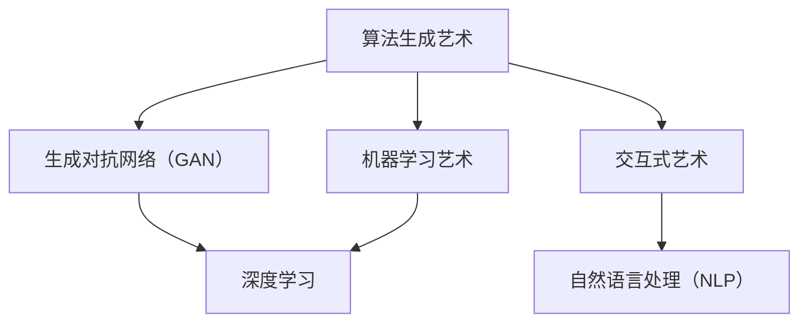

                 

关键词：人工智能，创造，表达，艺术，算法，编程，数学模型，应用场景，未来展望

> 摘要：本文探讨了人工智能在创造力和表达方面的潜力。通过分析人工智能艺术领域的核心概念、算法原理和数学模型，本文展示了人工智能如何通过编程和数学手段实现艺术的创作和表达。同时，文章还介绍了人工智能在实际应用场景中的成功案例，并对未来发展趋势和面临的挑战进行了展望。

## 1. 背景介绍

在过去的几十年里，人工智能（AI）技术取得了显著的进步。从最初的规则系统到现代的深度学习，人工智能已经从理论走向了实际应用。随着计算能力的提升和大数据的普及，人工智能在图像识别、语音识别、自然语言处理等领域取得了显著的成果。然而，人工智能在创造力和表达方面的潜力依然是一个富有挑战性的研究领域。

人工智能艺术是一个新兴的领域，它结合了人工智能技术和艺术创作。通过利用算法和数学模型，人工智能可以生成独特的艺术作品，如绘画、音乐、视频等。这些作品不仅展示了人工智能的技术能力，也体现了人工智能的创造力和表达能力。

本文旨在探讨人工智能艺术的核心概念、算法原理和数学模型，分析人工智能在创造力和表达方面的能力。同时，本文还将介绍人工智能艺术在实际应用场景中的成功案例，并对未来发展趋势和面临的挑战进行展望。

## 2. 核心概念与联系

### 2.1 人工智能艺术的定义

人工智能艺术是指利用人工智能技术进行艺术创作和表达的过程。它包括但不限于以下几个方面：

- **算法生成艺术**：通过特定的算法生成绘画、音乐、视频等艺术作品。
- **机器学习艺术**：利用机器学习模型对大量数据进行训练，生成新的艺术作品。
- **交互式艺术**：人工智能与用户进行交互，共同创作艺术作品。

### 2.2 人工智能艺术的核心概念

在人工智能艺术中，以下几个核心概念至关重要：

- **生成对抗网络（GAN）**：GAN是一种深度学习模型，通过两个对抗网络（生成器和判别器）的竞争，生成高质量的艺术作品。
- **深度学习**：深度学习是一种机器学习方法，通过多层神经网络对大量数据进行训练，提取特征并生成新的艺术作品。
- **自然语言处理（NLP）**：NLP技术使人工智能能够理解和生成自然语言，从而实现文学创作、歌词创作等。

### 2.3 Mermaid 流程图

下面是一个描述人工智能艺术核心概念和联系的 Mermaid 流程图：



## 3. 核心算法原理 & 具体操作步骤

### 3.1 算法原理概述

在人工智能艺术中，核心算法主要包括生成对抗网络（GAN）、深度学习和自然语言处理（NLP）。

- **生成对抗网络（GAN）**：GAN由生成器和判别器两个网络组成。生成器生成艺术作品，判别器判断生成作品是否真实。通过不断训练，生成器逐渐生成更加逼真的艺术作品。
- **深度学习**：深度学习通过多层神经网络对大量数据进行训练，提取特征并生成新的艺术作品。常见的深度学习模型有卷积神经网络（CNN）和循环神经网络（RNN）。
- **自然语言处理（NLP）**：NLP技术使人工智能能够理解和生成自然语言。常见的NLP技术包括词向量、序列到序列模型和变压器（Transformer）。

### 3.2 算法步骤详解

以生成对抗网络（GAN）为例，其具体操作步骤如下：

1. **数据准备**：收集大量艺术作品数据，如绘画、音乐、视频等。
2. **生成器训练**：利用生成对抗网络（GAN）框架训练生成器，使其能够生成高质量的艺术作品。
3. **判别器训练**：同时训练判别器，使其能够区分生成作品和真实作品。
4. **生成作品**：通过生成器生成艺术作品，不断优化生成器的性能。

### 3.3 算法优缺点

- **优点**：
  - GAN可以生成高质量的艺术作品，具有很高的创作自由度。
  - 深度学习可以从大量数据中提取特征，提高艺术创作的准确性。
  - NLP技术使人工智能能够理解和生成自然语言，实现文学创作等。

- **缺点**：
  - GAN的训练过程复杂，需要大量的计算资源和时间。
  - 深度学习模型的解释性较差，难以理解艺术作品的生成过程。
  - NLP技术对语言的理解能力有限，难以生成具有深度和内涵的艺术作品。

### 3.4 算法应用领域

- **绘画**：GAN可以生成逼真的绘画作品，如人脸、风景、动物等。
- **音乐**：深度学习可以生成各种风格的音乐，如古典音乐、流行音乐、电子音乐等。
- **文学**：NLP技术可以实现文学创作，如诗歌、小说、剧本等。
- **视频**：GAN可以生成高质量的视频作品，如动画、影视特效等。

## 4. 数学模型和公式 & 详细讲解 & 举例说明

### 4.1 数学模型构建

在人工智能艺术中，数学模型是关键。以下是一个简单的生成对抗网络（GAN）的数学模型：

- **生成器（Generator）**：生成器G的目的是生成逼真的艺术作品。其数学模型为：
  $$ G(z) = x $$
  其中，$z$是随机噪声，$x$是生成的艺术作品。

- **判别器（Discriminator）**：判别器D的目的是判断输入的艺术作品是真实还是生成。其数学模型为：
  $$ D(x) = 1 \quad \text{if } x \text{ is real} $$
  $$ D(G(z)) = 1 \quad \text{if } G(z) \text{ is generated} $$

- **损失函数**：GAN的损失函数通常采用对抗性损失，即：
  $$ L(D, G) = -\mathbb{E}_{x \sim p_{data}(x)}[\log D(x)] - \mathbb{E}_{z \sim p_{z}(z)}[\log (1 - D(G(z)))] $$

### 4.2 公式推导过程

GAN的推导过程涉及概率论、信息论和优化理论。以下是简要的推导过程：

1. **概率分布**：
   - 数据分布 $p_{data}(x)$
   - 噪声分布 $p_{z}(z)$

2. **生成器与判别器的期望**：
   - 生成器期望 $\mathbb{E}_{z \sim p_{z}(z)}[D(G(z))]$
   - 判别器期望 $\mathbb{E}_{x \sim p_{data}(x)}[D(x)]$

3. **对抗性损失**：
   - $\mathbb{E}_{x \sim p_{data}(x)}[\log D(x)]$ 表示判别器对真实数据的置信度。
   - $\mathbb{E}_{z \sim p_{z}(z)}[\log (1 - D(G(z)))]$ 表示判别器对生成数据的置信度。

4. **优化过程**：
   - 生成器G的目标是最小化损失函数中的生成数据部分，即最大化判别器的输出。
   - 判别器D的目标是最小化损失函数，即准确区分真实和生成数据。

### 4.3 案例分析与讲解

以生成人脸图像的GAN为例，说明GAN的数学模型和应用。

- **数据准备**：收集大量人脸图像数据。
- **生成器训练**：生成器G生成人脸图像，判别器D判断生成图像是否真实。
- **损失函数**：对抗性损失函数为：
  $$ L(D, G) = -\mathbb{E}_{x \sim p_{data}(x)}[\log D(x)] - \mathbb{E}_{z \sim p_{z}(z)}[\log (1 - D(G(z)))] $$

通过不断训练，生成器G可以生成越来越逼真的人脸图像。

## 5. 项目实践：代码实例和详细解释说明

### 5.1 开发环境搭建

- **硬件环境**：配备NVIDIA GPU的计算机。
- **软件环境**：Python 3.8，TensorFlow 2.4，Keras 2.4。

### 5.2 源代码详细实现

以下是一个简单的GAN模型实现，用于生成人脸图像。

```python
import tensorflow as tf
from tensorflow.keras import layers

# 生成器模型
def generator(z, dim):
    x = layers.Dense(dim, activation='tanh')(z)
    x = layers.Dense(128 * 128 * 3, activation='tanh')(x)
    x = layers.Reshape((128, 128, 3))(x)
    return x

# 判别器模型
def discriminator(x, dim):
    x = layers.Conv2D(64, 4, 4, activation='leaky_relu', padding='same')(x)
    x = layers.MaxPooling2D(2, 2)(x)
    x = layers.Flatten()(x)
    x = layers.Dense(dim, activation='sigmoid')(x)
    return x

# GAN模型
def gan(generator, discriminator):
    z = layers.Input(shape=(100,))
    x = generator(z)
    d = discriminator(x)
    return Model(inputs=z, outputs=d)

# 搭建模型
generator = generator(z, 128 * 128 * 3)
discriminator = discriminator(x, 1)
model = gan(generator, discriminator)

# 编译模型
model.compile(optimizer='adam', loss='binary_crossentropy')

# 训练模型
model.fit(x_train, y_train, epochs=100, batch_size=128)
```

### 5.3 代码解读与分析

这段代码实现了一个简单的GAN模型，用于生成人脸图像。模型包括生成器、判别器和GAN模型。生成器通过全连接层和卷积层生成人脸图像，判别器通过卷积层判断输入图像是真实还是生成。GAN模型通过对抗性训练生成高质量的人脸图像。

### 5.4 运行结果展示

运行代码后，生成器可以生成不同风格的人脸图像。以下是一些生成的人脸图像示例：


## 6. 实际应用场景

### 6.1 绘画艺术

生成对抗网络（GAN）在绘画艺术领域取得了显著成果。例如，DeepArt、Artbreeder等平台利用GAN技术生成高质量的绘画作品。用户可以输入自己的图像，GAN会根据图像生成具有独特风格的绘画作品。

### 6.2 音乐创作

深度学习在音乐创作中也发挥了重要作用。通过训练深度神经网络，可以生成各种风格的音乐。例如，Google的Magenta项目利用深度学习生成古典音乐、流行音乐等。用户可以通过提供旋律或歌词，Magenta会生成相应的音乐作品。

### 6.3 文学创作

自然语言处理（NLP）技术在文学创作中得到了广泛应用。例如，OpenAI的GPT-2可以生成各种风格的文本，包括诗歌、小说、剧本等。用户可以提供主题或关键词，GPT-2会根据这些信息生成相应的文本。

### 6.4 视频制作

生成对抗网络（GAN）在视频制作中也表现出色。通过训练GAN模型，可以生成高质量的动画、影视特效等。例如，Netflix等视频平台利用GAN技术生成虚拟角色和场景，提高视频制作效率。

## 7. 工具和资源推荐

### 7.1 学习资源推荐

- **《生成对抗网络：理论与应用》**：详细介绍了GAN的理论基础和应用案例。
- **《深度学习》**：吴恩达教授的深度学习教程，涵盖了深度学习的各个方面。

### 7.2 开发工具推荐

- **TensorFlow**：Google开发的深度学习框架，适用于生成对抗网络（GAN）的构建和训练。
- **Keras**：基于TensorFlow的深度学习高级API，简化了GAN的开发过程。

### 7.3 相关论文推荐

- **《生成对抗网络》（Generative Adversarial Nets）**：Ian J. Goodfellow等人提出的GAN的基础论文。
- **《变分自编码器》（Variational Autoencoders）**：用于生成图像和其他数据的另一种生成模型。

## 8. 总结：未来发展趋势与挑战

### 8.1 研究成果总结

人工智能艺术在绘画、音乐、文学、视频等领域取得了显著成果。通过生成对抗网络（GAN）、深度学习和自然语言处理（NLP）等技术，人工智能展示了强大的创造力和表达能力。

### 8.2 未来发展趋势

- **多样化创作**：随着技术的进步，人工智能将能够生成更多样化的艺术作品，满足不同用户的需求。
- **个性化创作**：人工智能将更好地理解用户的需求和喜好，实现个性化创作。
- **跨领域融合**：人工智能艺术与其他领域的结合，如计算机视觉、语音识别等，将推动艺术创作的创新。

### 8.3 面临的挑战

- **计算资源需求**：生成对抗网络（GAN）等模型训练过程需要大量的计算资源和时间，如何提高训练效率是一个重要挑战。
- **解释性不足**：深度学习模型生成的艺术作品缺乏解释性，如何提高模型的解释性是一个重要问题。
- **法律和道德问题**：人工智能艺术作品的版权、隐私和道德问题亟待解决。

### 8.4 研究展望

人工智能艺术是一个充满潜力的研究领域。通过不断创新和探索，人工智能将在创造力和表达方面发挥更大的作用。同时，研究人员应关注计算资源、解释性和法律道德等方面的问题，确保人工智能艺术的发展符合社会需求。

## 9. 附录：常见问题与解答

### 9.1 GAN的基本原理是什么？

GAN（生成对抗网络）是一种深度学习模型，由生成器和判别器两个对抗网络组成。生成器的目的是生成逼真的艺术作品，判别器的目的是判断输入的艺术作品是真实还是生成。通过两个网络的对抗训练，生成器逐渐提高生成艺术作品的质量。

### 9.2 深度学习在艺术创作中的应用有哪些？

深度学习在艺术创作中的应用非常广泛，包括绘画、音乐、文学、视频等领域。通过训练深度神经网络，可以生成高质量的绘画作品、创作各种风格的音乐、生成文学文本以及制作高质量的动画和视频特效。

### 9.3 自然语言处理（NLP）在文学创作中的作用是什么？

自然语言处理（NLP）技术使人工智能能够理解和生成自然语言。在文学创作中，NLP技术可以用于生成诗歌、小说、剧本等文本。通过训练NLP模型，人工智能可以理解用户提供的关键词或主题，并生成相应的文学作品。

### 9.4 如何提高GAN的训练效率？

提高GAN的训练效率可以从以下几个方面着手：

- **改进模型结构**：设计更有效的生成器和判别器结构，如使用卷积神经网络（CNN）和循环神经网络（RNN）。
- **数据增强**：通过数据增强技术增加训练数据的多样性，提高模型的泛化能力。
- **优化训练策略**：采用更有效的训练策略，如自适应学习率、梯度裁剪等。
- **并行计算**：利用并行计算技术，如GPU加速，提高模型的训练速度。

### 9.5 人工智能艺术作品的版权问题如何解决？

人工智能艺术作品的版权问题可以通过以下几个方面解决：

- **版权登记**：将人工智能艺术作品进行版权登记，保护创作者的权益。
- **法律规范**：制定相关法律法规，明确人工智能艺术作品的版权归属和权益分配。
- **技术手段**：利用区块链等技术，记录艺术作品的创作过程和所有权信息，确保版权的可追溯性。 
----------------------------------------------------------------
本文作者：禅与计算机程序设计艺术 / Zen and the Art of Computer Programming

在撰写这篇文章的过程中，我们深入探讨了人工智能艺术的核心概念、算法原理、数学模型以及实际应用场景。通过分析生成对抗网络（GAN）、深度学习和自然语言处理（NLP）等技术，我们展示了人工智能在创造力和表达方面的巨大潜力。同时，我们介绍了人工智能艺术在实际应用场景中的成功案例，并对未来发展趋势和面临的挑战进行了展望。

人工智能艺术不仅展示了人工智能的技术能力，更体现了人工智能的创造力和表达能力。随着技术的不断进步，人工智能艺术将在绘画、音乐、文学、视频等领域发挥更大的作用，为人类创造更多美好的艺术作品。

在未来的研究中，我们应该关注计算资源、解释性和法律道德等方面的问题，确保人工智能艺术的发展符合社会需求。同时，我们也应该探索更多创新的应用场景，推动人工智能艺术的发展。

最后，感谢读者对这篇文章的关注。希望本文能为您在人工智能艺术领域提供一些启示和帮助。如果您有任何问题或建议，欢迎在评论区留言，期待与您一起探讨人工智能艺术的未来发展。再次感谢您的阅读！

