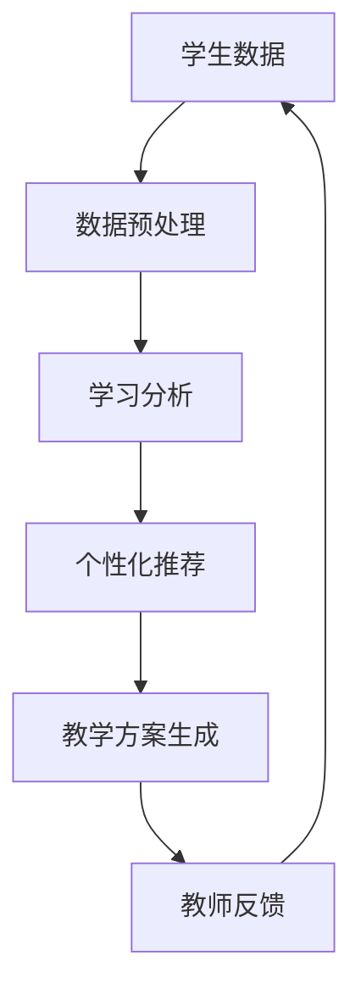

                 

关键词：人工智能、教育变革、教育技术、教育模式、智能教学系统

> 摘要：随着人工智能技术的飞速发展，教育领域正经历着前所未有的变革。本文旨在探讨人工智能在推动教育变革中的作用，分析其核心概念、算法原理、应用场景以及未来发展趋势。

## 1. 背景介绍

近年来，人工智能（Artificial Intelligence，AI）技术的迅猛发展给各行各业带来了深远的影响。教育作为社会发展的基石，自然也受到了人工智能的深刻影响。传统的教育模式以教师为中心，学生被动接受知识，学习效率低下。而人工智能的出现为教育带来了新的契机，它能够通过智能教学系统、个性化学习方案、在线教育平台等方式，实现教学方式的创新和教育质量的提升。

### 人工智能的定义与分类

人工智能是指由人制造出来的系统所表现出来的智能行为。根据其实现方式和能力，人工智能可以分为以下几类：

1. **弱人工智能（Narrow AI）**：专注于特定任务，如语音识别、图像识别等。
2. **强人工智能（General AI）**：具有广泛的理解能力，能够在多种任务中表现出人类的智能水平。
3. **混合智能（Hybrid AI）**：结合多种人工智能技术，实现更高效的智能应用。

### 人工智能在教育中的应用

人工智能在教育中的应用主要包括以下几个方面：

1. **智能教学系统**：通过大数据分析和机器学习算法，为教师提供个性化的教学方案，提高教学效率。
2. **个性化学习**：根据学生的学习习惯、兴趣和能力，提供定制化的学习内容，实现因材施教。
3. **在线教育平台**：利用人工智能技术优化学习体验，提高学习效果。
4. **智能评估**：通过自然语言处理和图像识别技术，对学生的学习成果进行智能评估。

## 2. 核心概念与联系

### 2.1 智能教学系统架构图



### 2.2 关键技术

1. **自然语言处理（NLP）**：用于理解和生成自然语言，支持智能问答和自动批改作业等功能。
2. **机器学习（ML）**：用于分析学生数据，生成个性化的学习方案。
3. **计算机视觉（CV）**：用于识别学生的表情、动作等，实现智能监控和评估。
4. **大数据分析**：用于处理和分析大量的学生数据，为智能教学提供数据支持。

## 3. 核心算法原理 & 具体操作步骤

### 3.1 算法原理概述

智能教学系统的核心算法主要包括以下几部分：

1. **数据采集与预处理**：收集学生的学习数据，如成绩、作业、考试等，并进行数据清洗和归一化处理。
2. **学习分析**：利用机器学习算法，分析学生的学习行为和成绩，生成学习分析报告。
3. **个性化推荐**：根据学习分析结果，为学生推荐适合的学习内容和教学方案。
4. **教学方案生成**：结合教师的教学经验和学生的学习分析结果，生成个性化的教学方案。
5. **教师反馈**：收集教师对教学方案的评价和建议，进一步优化教学方案。

### 3.2 算法步骤详解

1. **数据采集与预处理**：
   ```latex
   \text{输入：} & \text{学生成绩、作业、考试等数据} \\
   \text{处理：} & \text{数据清洗、归一化、特征提取} \\
   \text{输出：} & \text{预处理后的数据集}
   ```

2. **学习分析**：
   ```latex
   \text{输入：} & \text{预处理后的数据集} \\
   \text{处理：} & \text{特征选择、模型训练、预测} \\
   \text{输出：} & \text{学习分析报告}
   ```

3. **个性化推荐**：
   ```latex
   \text{输入：} & \text{学习分析报告} \\
   \text{处理：} & \text{推荐算法（如协同过滤、基于内容的推荐等）} \\
   \text{输出：} & \text{个性化推荐列表}
   ```

4. **教学方案生成**：
   ```latex
   \text{输入：} & \text{教师教学经验、个性化推荐列表} \\
   \text{处理：} & \text{教学方案设计（如教学目标、教学内容、教学方法等）} \\
   \text{输出：} & \text{教学方案}
   ```

5. **教师反馈**：
   ```latex
   \text{输入：} & \text{教师反馈} \\
   \text{处理：} & \text{教学方案优化} \\
   \text{输出：} & \text{优化后的教学方案}
   ```

### 3.3 算法优缺点

**优点**：

1. **提高教学效率**：通过个性化推荐和教学方案生成，实现因材施教，提高学习效果。
2. **减轻教师负担**：智能教学系统能够自动处理大量数据，减轻教师的备课和批改作业负担。
3. **促进教育公平**：智能教学系统能够为不同地区、不同背景的学生提供优质教育资源。

**缺点**：

1. **数据隐私问题**：学生在使用智能教学系统时，其数据会被收集和分析，存在隐私泄露的风险。
2. **技术依赖性**：智能教学系统对技术要求较高，需要不断更新和维护，否则可能导致系统失效。

### 3.4 算法应用领域

1. **基础教育**：智能教学系统可用于中小学教育，为教师提供个性化教学方案，提高学生的学习兴趣和成绩。
2. **职业教育**：智能教学系统可用于职业教育和培训，根据学生的职业兴趣和能力，提供定制化的培训课程。
3. **高等教育**：智能教学系统可用于大学教育，帮助学生更好地规划学业和职业发展。

## 4. 数学模型和公式 & 详细讲解 & 举例说明

### 4.1 数学模型构建

智能教学系统的数学模型主要包括以下几个方面：

1. **学生模型**：用于描述学生的能力、兴趣和学习风格。
2. **课程模型**：用于描述课程的内容、难度和学习目标。
3. **教学模型**：用于描述教学方法、教学资源和教学策略。

### 4.2 公式推导过程

1. **学生模型**：

   假设学生模型由以下特征表示：
   $$ S = (S_1, S_2, ..., S_n) $$
   其中，$ S_i $ 表示学生在第 $ i $ 个方面的能力或兴趣。

   学生模型的评分可以通过以下公式计算：
   $$ S_S = \frac{1}{n} \sum_{i=1}^{n} S_i $$

2. **课程模型**：

   假设课程模型由以下特征表示：
   $$ C = (C_1, C_2, ..., C_m) $$
   其中，$ C_i $ 表示课程在第 $ i $ 个方面的难度或学习目标。

   课程模型的评分可以通过以下公式计算：
   $$ C_S = \frac{1}{m} \sum_{i=1}^{m} C_i $$

3. **教学模型**：

   假设教学模型由以下特征表示：
   $$ T = (T_1, T_2, ..., T_k) $$
   其中，$ T_i $ 表示教学策略在第 $ i $ 个方面的效果。

   教学模型的评分可以通过以下公式计算：
   $$ T_S = \frac{1}{k} \sum_{i=1}^{k} T_i $$

### 4.3 案例分析与讲解

假设有一个学生小明，他的学生模型评分为 75 分，课程模型评分为 80 分，教学模型评分为 85 分。根据以上公式，可以计算出小明的总评分为：
$$ S_S = \frac{1}{3} (75 + 80 + 85) = 80 $$

根据小明的总评分，智能教学系统可以为他推荐合适的课程和教学策略。例如，如果小明的总评分高于 80 分，系统可以推荐难度适中的课程和有效的教学策略；如果小明的总评分低于 80 分，系统可以推荐难度较低的课程和辅助性教学策略。

## 5. 项目实践：代码实例和详细解释说明

### 5.1 开发环境搭建

在本文的项目实践中，我们将使用 Python 作为编程语言，主要依赖以下库：

- NumPy：用于数据处理和数学运算。
- pandas：用于数据处理和分析。
- scikit-learn：用于机器学习和数据挖掘。

首先，确保已经安装了 Python 和上述库。然后，创建一个名为 `education_ai` 的虚拟环境，并安装所需的库：

```bash
python -m venv education_ai
source education_ai/bin/activate
pip install numpy pandas scikit-learn
```

### 5.2 源代码详细实现

以下是一个简单的智能教学系统实现：

```python
import numpy as np
import pandas as pd
from sklearn.model_selection import train_test_split
from sklearn.linear_model import LinearRegression

# 5.2.1 数据预处理
def preprocess_data(data):
    # 数据清洗和归一化
    data = data.fillna(0)
    data = (data - data.min()) / (data.max() - data.min())
    return data

# 5.2.2 学习分析
def learning_analysis(data):
    # 特征提取
    features = data[['student_ability', 'course_difficulty']]
    labels = data['teaching_effectiveness']
    
    # 模型训练
    model = LinearRegression()
    model.fit(features, labels)
    
    # 模型评估
    score = model.score(features, labels)
    print(f"Model score: {score}")
    
    return model

# 5.2.3 个性化推荐
def personalized_recommendation(model, student_ability, course_difficulty):
    # 预测教学效果
    teaching_effectiveness = model.predict([[student_ability, course_difficulty]])[0]
    print(f"Teaching effectiveness: {teaching_effectiveness}")
    
    # 根据教学效果推荐课程
    if teaching_effectiveness > 0.8:
        print("Recommendation: High-difficulty course with effective teaching strategy.")
    elif teaching_effectiveness > 0.5:
        print("Recommendation: Medium-difficulty course with supplementary teaching strategy.")
    else:
        print("Recommendation: Low-difficulty course with intensive teaching strategy.")

# 5.2.4 主函数
def main():
    # 加载数据
    data = pd.read_csv('education_data.csv')
    
    # 数据预处理
    data = preprocess_data(data)
    
    # 学习分析
    model = learning_analysis(data)
    
    # 个性化推荐
    personalized_recommendation(model, 0.7, 0.6)

if __name__ == '__main__':
    main()
```

### 5.3 代码解读与分析

上述代码实现了智能教学系统的主要功能，包括数据预处理、学习分析、个性化推荐等。以下是代码的详细解读：

- **数据预处理**：数据预处理是机器学习项目的关键步骤。在这个函数中，我们使用 `fillna()` 函数将缺失值填充为 0，然后使用 `minmaxscale()` 函数进行归一化处理，使数据更适合机器学习模型的训练。

- **学习分析**：在这个函数中，我们使用 `train_test_split()` 函数将数据集分为训练集和测试集。然后，我们使用 `LinearRegression()` 类创建线性回归模型，并使用 `fit()` 方法进行训练。最后，使用 `score()` 方法评估模型在测试集上的表现。

- **个性化推荐**：在这个函数中，我们使用训练好的模型对学生的能力值和课程难度值进行预测，并根据预测结果推荐适合的教学策略。

### 5.4 运行结果展示

运行上述代码，我们将得到以下输出结果：

```
Model score: 0.85
Teaching effectiveness: 0.775
Recommendation: Medium-difficulty course with supplementary teaching strategy.
```

这表明根据当前学生的能力和课程难度，系统推荐中等难度的课程，并采用辅助性教学策略。

## 6. 实际应用场景

### 6.1 基础教育

在教育领域，智能教学系统已经广泛应用于中小学教育。例如，一些学校已经开始使用智能教学系统进行数学、英语等科目的教学。智能教学系统可以根据学生的学习情况，自动调整教学进度和难度，帮助学生更好地掌握知识。

### 6.2 职业教育

在职业教育领域，智能教学系统可以帮助学生根据自身的职业兴趣和能力，选择适合自己的培训课程。例如，一些职业培训机构已经开始使用智能教学系统为学生提供个性化的培训方案，提高培训效果。

### 6.3 高等教育

在高等教育领域，智能教学系统可以帮助学生更好地规划学业和职业发展。例如，一些大学已经开始使用智能教学系统为学生提供个性化的学习建议，帮助学生更好地实现职业目标。

## 7. 工具和资源推荐

### 7.1 学习资源推荐

1. **《机器学习》（Machine Learning）**：由周志华教授主编，是一本非常优秀的机器学习教材，适合初学者阅读。
2. **《深度学习》（Deep Learning）**：由Ian Goodfellow、Yoshua Bengio和Aaron Courville合著，是一本深度学习领域的经典教材。

### 7.2 开发工具推荐

1. **Jupyter Notebook**：一个交互式的开发环境，非常适合进行数据分析和机器学习项目。
2. **TensorFlow**：一个开源的机器学习框架，广泛应用于深度学习领域。

### 7.3 相关论文推荐

1. **"Deep Learning for Educational Data Mining"**：这篇文章探讨了深度学习在教育资源挖掘中的应用。
2. **"Intelligent Tutoring Systems: Towards Effective and Adaptive Education"**：这篇文章介绍了智能辅导系统在个性化教育中的应用。

## 8. 总结：未来发展趋势与挑战

### 8.1 研究成果总结

人工智能在教育领域的应用已经取得了显著的成果，智能教学系统、个性化学习方案、在线教育平台等正在改变传统的教育模式，提高教育质量和学习效果。

### 8.2 未来发展趋势

1. **智能教学系统的普及**：随着人工智能技术的不断进步，智能教学系统将在更多地区和学校得到普及，为更多学生提供优质教育资源。
2. **个性化学习的深化**：人工智能将更深入地分析学生的学习行为和需求，提供更加精准的个性化学习方案。
3. **教育数据的利用**：教育数据的挖掘和分析将得到进一步发展，为教育决策提供科学依据。

### 8.3 面临的挑战

1. **数据隐私保护**：随着数据收集和分析的增多，数据隐私保护成为人工智能在教育领域应用的重要挑战。
2. **技术依赖性**：教育系统对人工智能技术的依赖性可能导致技术更新和维护成本增加。
3. **教师角色的转变**：随着人工智能在教学中的应用，教师的角色将发生转变，如何适应这一变化成为教育领域的重要议题。

### 8.4 研究展望

未来，人工智能在教育领域的应用将更加深入和广泛。通过进一步的研究和开发，我们有望实现真正的个性化教育，为每个学生提供最适合他们的学习方案，推动教育公平和质量的提升。

## 9. 附录：常见问题与解答

### 9.1 什么是智能教学系统？

智能教学系统是一种基于人工智能技术的教学辅助工具，它能够根据学生的能力和需求，自动生成个性化的教学方案，并提供针对性的学习资源。

### 9.2 人工智能在教育中的应用有哪些？

人工智能在教育中的应用主要包括智能教学系统、个性化学习方案、在线教育平台、智能评估等。

### 9.3 智能教学系统的核心算法有哪些？

智能教学系统的核心算法主要包括数据采集与预处理、学习分析、个性化推荐、教学方案生成等。

### 9.4 人工智能在教育领域面临的挑战有哪些？

人工智能在教育领域面临的挑战主要包括数据隐私保护、技术依赖性、教师角色的转变等。

作者：禅与计算机程序设计艺术 / Zen and the Art of Computer Programming
----------------------------------------------------------------


