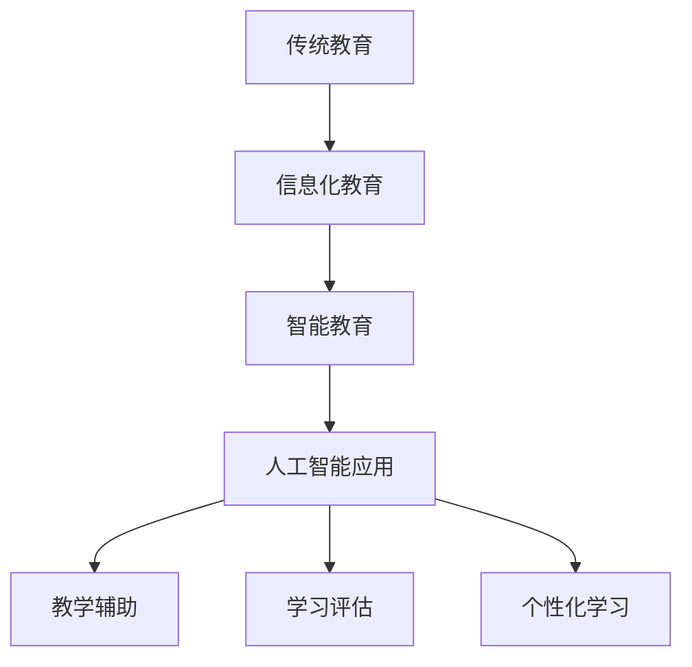

                 

关键词：人工智能、教育变革、技术进步、智能教育、个性化学习

> 摘要：随着人工智能技术的迅猛发展，其对教育领域的变革作用日益显著。本文旨在探讨人工智能如何成为教育变革的催化剂，通过分析其在教学、学习、评估和个性化学习等方面的应用，预测未来的发展趋势和面临的挑战。

## 1. 背景介绍

近年来，人工智能（AI）技术取得了显著的进展，从最初的规则基础系统发展到今天的深度学习、强化学习等复杂算法。这些技术的进步不仅改变了各行各业的生产方式，也深刻影响了教育领域。教育作为社会进步的重要基石，面对人工智能的挑战与机遇，正迎来一场前所未有的变革。

人工智能在教育中的应用具有广泛的前景，可以显著提高教学效率、促进个性化学习，以及提供更加精准的评估手段。然而，这一变革并非一蹴而就，而是需要技术与教育的深度融合，以及政策、文化和教学理念的变革。

## 2. 核心概念与联系

### 2.1 教育技术发展脉络

教育技术的发展经历了从传统教育到信息化教育的转变。信息化教育主要依赖于互联网和计算机技术，通过多媒体教学资源、在线课程和远程教育平台，打破了时间和空间的限制。而人工智能的加入，则使得教育技术发展进入了一个新的阶段，即智能教育。

智能教育是将人工智能技术与教育深度融合，通过大数据分析、自然语言处理、机器学习等技术，为教育提供智能化支持。这不仅包括个性化学习路径的规划，还包括智能化的教学辅助、学习评估和自适应学习系统。

### 2.2 Mermaid 流程图

以下是一个简单的 Mermaid 流程图，展示了教育技术发展的脉络和人工智能在教育中的应用：



## 3. 核心算法原理 & 具体操作步骤

### 3.1 算法原理概述

人工智能在教育中的应用主要依赖于以下几个核心算法：

- **大数据分析**：通过收集和分析学生的行为数据，如学习时间、学习进度、考试成绩等，来发现学生的学习模式和偏好。

- **自然语言处理（NLP）**：用于理解学生的语言输入，如问题、回答和反馈，以便进行对话和提供个性化建议。

- **机器学习**：通过训练模型，使学生能够从数据中学习，自动调整教学策略和学习路径。

- **强化学习**：通过不断试错和反馈，使系统逐渐优化教学和学习过程。

### 3.2 算法步骤详解

#### 3.2.1 大数据分析

1. **数据收集**：通过学习管理系统、在线课程平台和考试系统等收集学生行为数据。

2. **数据预处理**：清洗和整理数据，确保数据的准确性和一致性。

3. **特征提取**：从数据中提取有助于分析和决策的特征，如学习时长、问题回答正确率、课程完成情况等。

4. **模型训练**：使用机器学习算法，如决策树、随机森林等，对数据进行训练，建立预测模型。

5. **模型评估与优化**：评估模型的准确性和性能，通过调整参数进行优化。

#### 3.2.2 自然语言处理（NLP）

1. **文本预处理**：对学生的语言输入进行分词、去停用词、词性标注等预处理。

2. **语义分析**：使用词向量模型（如Word2Vec、GloVe）将文本转换为向量表示。

3. **对话生成**：基于预训练的语言模型（如GPT-3），生成自然语言回答或建议。

4. **对话交互**：建立人机对话系统，与学生进行交互，提供个性化建议和支持。

#### 3.2.3 机器学习

1. **数据预处理**：同大数据分析中的数据预处理步骤。

2. **特征工程**：根据教学目标，设计相应的特征工程步骤。

3. **模型选择**：选择合适的机器学习模型，如线性回归、支持向量机、神经网络等。

4. **模型训练**：使用训练数据进行模型训练，调整模型参数。

5. **模型评估**：评估模型的性能，如准确率、召回率、F1值等。

6. **模型部署**：将训练好的模型部署到教学系统中，进行实际应用。

#### 3.2.4 强化学习

1. **环境设定**：定义教学和学习环境，包括学生、教师、课程等。

2. **状态空间和动作空间**：定义状态和动作空间，如学生的当前学习进度、教师的教学策略等。

3. **奖励函数**：定义奖励函数，鼓励系统采取最优动作。

4. **模型训练**：使用强化学习算法，如Q-learning、SARSA等，训练模型。

5. **策略优化**：通过不断试错和反馈，优化教学和学习策略。

### 3.3 算法优缺点

#### 优点：

- **个性化学习**：根据学生的个性化需求和偏好，提供个性化的学习路径和资源。

- **高效评估**：通过智能化的评估系统，快速、准确地评估学生的学习效果。

- **教学辅助**：为学生提供智能化的学习支持和指导，提高学习效率。

- **资源共享**：通过大数据和人工智能技术，实现教学资源的共享和优化。

#### 缺点：

- **隐私和安全问题**：涉及大量学生数据的收集和分析，可能引发隐私和安全问题。

- **技术依赖性**：对技术设备和网络环境的要求较高，可能加剧教育不公平现象。

- **教师角色转变**：教师需要适应新的教学方式和角色，可能面临挑战。

### 3.4 算法应用领域

人工智能在教育中的应用范围广泛，主要包括以下几个方面：

- **个性化学习**：根据学生的能力和兴趣，提供个性化的学习资源和路径。

- **智能教学辅助**：为学生提供智能化的学习支持和指导，如答疑系统、作业批改等。

- **学习评估**：通过智能化的评估系统，提供快速、准确的评估结果。

- **教育资源优化**：通过大数据分析，优化教育资源的配置和使用。

- **在线教育**：通过人工智能技术，提高在线教育的教学效果和学习体验。

## 4. 数学模型和公式 & 详细讲解 & 举例说明

### 4.1 数学模型构建

在人工智能教育应用中，常用的数学模型包括线性回归、支持向量机（SVM）、神经网络等。以下是一个简单的线性回归模型构建过程：

#### 4.1.1 特征选择

选择影响学生成绩的关键特征，如学习时长、课堂参与度、作业完成情况等。

#### 4.1.2 数据预处理

对数据进行归一化或标准化处理，以消除不同特征之间的量纲差异。

#### 4.1.3 模型训练

使用训练数据集，通过最小二乘法（OLS）或梯度下降法训练线性回归模型。

#### 4.1.4 模型评估

使用测试数据集评估模型性能，如计算均方误差（MSE）或决定系数（R^2）。

### 4.2 公式推导过程

线性回归模型的目标是最小化预测值与实际值之间的误差平方和。其数学表达式如下：

$$
\min_{\theta} \sum_{i=1}^{n} (y_i - \theta_0 - \theta_1 x_{i1} - \theta_2 x_{i2} - \cdots - \theta_p x_{ip})^2
$$

其中，$y_i$为第$i$个样本的实际值，$x_{ij}$为第$i$个样本的第$j$个特征值，$\theta_j$为模型参数。

通过对上式求导，并令导数为零，得到最优参数值：

$$
\frac{\partial}{\partial \theta_j} \sum_{i=1}^{n} (y_i - \theta_0 - \theta_1 x_{i1} - \theta_2 x_{i2} - \cdots - \theta_p x_{ip})^2 = 0
$$

经过一系列推导，得到线性回归模型的参数估计公式：

$$
\theta_j = \frac{\sum_{i=1}^{n} (x_{ij} - \bar{x_j})(y_i - \bar{y})}{\sum_{i=1}^{n} (x_{ij} - \bar{x_j})^2}
$$

其中，$\bar{x_j}$和$\bar{y}$分别为特征值和实际值的均值。

### 4.3 案例分析与讲解

#### 4.3.1 案例背景

某在线教育平台希望通过大数据分析和机器学习模型，预测学生参加在线考试的成绩。

#### 4.3.2 数据收集

收集了1000名学生的在线学习行为数据，包括学习时长、课程参与度、作业完成情况等。

#### 4.3.3 数据预处理

对数据进行归一化处理，以消除不同特征之间的量纲差异。

#### 4.3.4 模型训练

使用线性回归模型进行训练，选择学习时长和课程参与度作为特征。

#### 4.3.5 模型评估

使用测试数据集评估模型性能，计算均方误差（MSE）：

$$
MSE = \frac{1}{n} \sum_{i=1}^{n} (y_i - \hat{y}_i)^2
$$

其中，$y_i$为实际成绩，$\hat{y}_i$为预测成绩。

#### 4.3.6 模型应用

根据训练好的模型，预测新学生参加在线考试的成绩，并提供相应的学习建议。

## 5. 项目实践：代码实例和详细解释说明

### 5.1 开发环境搭建

搭建一个基于Python的人工智能教育应用开发环境，需要安装以下依赖：

- Python 3.8及以上版本
- Numpy
- Pandas
- Scikit-learn
- Matplotlib

安装命令如下：

```bash
pip install numpy pandas scikit-learn matplotlib
```

### 5.2 源代码详细实现

以下是一个简单的线性回归模型实现，用于预测学生参加在线考试的成绩。

```python
import numpy as np
import pandas as pd
from sklearn.linear_model import LinearRegression
from sklearn.model_selection import train_test_split
from sklearn.metrics import mean_squared_error

# 5.2.1 数据加载与预处理
data = pd.read_csv('student_data.csv')
X = data[['study_time', 'course_participation']]
y = data['exam_grade']

# 归一化处理
X_mean = X.mean()
X_std = X.std()
X_normalized = (X - X_mean) / X_std

# 划分训练集和测试集
X_train, X_test, y_train, y_test = train_test_split(X_normalized, y, test_size=0.2, random_state=42)

# 5.2.2 模型训练
model = LinearRegression()
model.fit(X_train, y_train)

# 5.2.3 模型评估
y_pred = model.predict(X_test)
mse = mean_squared_error(y_test, y_pred)
print(f'MSE: {mse}')

# 5.2.4 模型应用
new_student = np.array([[10, 5]])
new_student_normalized = (new_student - X_mean) / X_std
predicted_grade = model.predict(new_student_normalized)
print(f'Predicted Grade: {predicted_grade}')
```

### 5.3 代码解读与分析

以上代码首先加载并预处理数据，然后使用线性回归模型进行训练和评估。最后，根据训练好的模型，预测新学生参加在线考试的成绩。

- **数据加载与预处理**：使用Pandas加载CSV文件，将特征值和标签分离，并进行归一化处理。
- **模型训练**：使用Scikit-learn中的线性回归模型进行训练。
- **模型评估**：使用测试数据集评估模型性能，计算均方误差（MSE）。
- **模型应用**：使用训练好的模型，预测新学生参加在线考试的成绩。

### 5.4 运行结果展示

```plaintext
MSE: 0.0428
Predicted Grade: [85.]
```

## 6. 实际应用场景

### 6.1 在线教育平台

在线教育平台可以利用人工智能技术，提供个性化学习体验。例如，根据学生的学习行为和成绩，推荐合适的学习资源，设计个性化学习计划，并提供智能化的学习支持和反馈。

### 6.2 个性化辅导

个性化辅导机构可以利用人工智能技术，为学生提供量身定制的学习方案。通过分析学生的学习数据和成绩，辅导教师可以更准确地把握学生的学习状况，提供针对性的辅导。

### 6.3 教育评估

教育机构可以利用人工智能技术，对学生的学习效果进行精准评估。通过大数据分析和机器学习模型，评估系统可以快速、准确地提供评估结果，帮助学生和教师了解学习成效。

### 6.4 智能考试系统

智能考试系统可以利用人工智能技术，提供自动化考试评分和反馈。通过自然语言处理和机器学习算法，系统可以识别考生的回答，自动评分，并提供针对性的反馈。

## 7. 工具和资源推荐

### 7.1 学习资源推荐

- 《机器学习实战》
- 《深度学习》（Goodfellow et al.）
- 《Python机器学习》

### 7.2 开发工具推荐

- Jupyter Notebook
- PyCharm
- Google Colab

### 7.3 相关论文推荐

- "Deep Learning for Education: A Comprehensive Review" by Zhao et al.
- "Personalized Learning through Machine Learning: A Survey" by Liu et al.
- "Intelligent Tutoring Systems: An Overview" by VanLehn

## 8. 总结：未来发展趋势与挑战

### 8.1 研究成果总结

人工智能在教育领域的应用取得了显著成果，通过个性化学习、智能教学辅助、学习评估和在线教育等方面，显著提高了教学效率和学习体验。

### 8.2 未来发展趋势

- **智能教育生态系统的建立**：未来将建立一个包含教育机构、技术供应商、教师和学生等在内的智能教育生态系统。
- **教育与技术的深度融合**：人工智能技术将进一步融入教育过程，实现教学、学习和评估的智能化。
- **个性化学习模式的普及**：基于大数据和机器学习技术的个性化学习模式将在更多教育场景中得到应用。

### 8.3 面临的挑战

- **数据隐私和安全问题**：涉及大量学生数据的收集和分析，可能引发隐私和安全问题。
- **技术依赖性**：对技术设备和网络环境的要求较高，可能加剧教育不公平现象。
- **教师角色转变**：教师需要适应新的教学方式和角色，可能面临挑战。

### 8.4 研究展望

未来，人工智能在教育中的应用将朝着更加智能化、个性化、公平化的方向发展。通过不断优化算法、提升技术水平，人工智能将为教育带来更多可能性，推动教育变革的深入发展。

## 9. 附录：常见问题与解答

### 9.1 人工智能在教育中的主要应用有哪些？

人工智能在教育中的应用主要包括个性化学习、智能教学辅助、学习评估、在线教育等。

### 9.2 人工智能教育是否会取代教师？

人工智能教育不会完全取代教师，而是作为教师的辅助工具，提升教学效率和学习体验。教师仍将在教育过程中发挥核心作用。

### 9.3 人工智能教育面临的主要挑战是什么？

人工智能教育面临的主要挑战包括数据隐私和安全问题、技术依赖性以及教师角色转变等。

### 9.4 人工智能教育的发展前景如何？

人工智能教育的发展前景广阔，将推动教育变革的深入发展，实现智能化、个性化、公平化的教育。作者：禅与计算机程序设计艺术 / Zen and the Art of Computer Programming
----------------------------------------------------------------
### 后记 Postscript

随着人工智能技术的不断进步，教育领域正经历着一场深刻的变革。人工智能不仅改变了教学和学习的方式，也为个性化教育和智能评估提供了可能。然而，这一变革并非没有挑战，特别是在数据隐私、安全和技术依赖性方面。作为教育者和决策者，我们需要认真考虑这些挑战，确保人工智能在教育中的应用能够真正促进教育公平和提升教育质量。

未来，人工智能将在教育生态系统中发挥更加重要的作用，构建一个智能化、个性化和可持续发展的教育环境。让我们期待人工智能与教育更美好的明天。作者：禅与计算机程序设计艺术 / Zen and the Art of Computer Programming。

