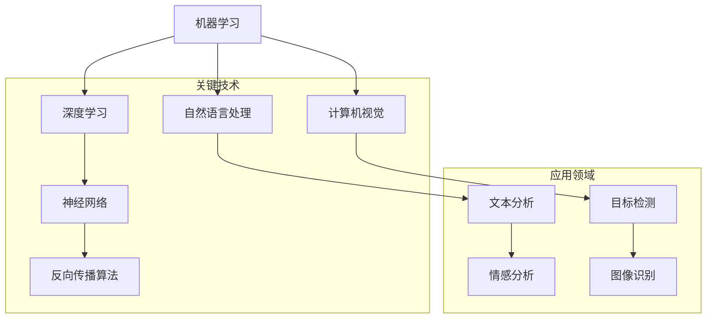

                 

随着人工智能（AI）技术的快速发展，它在各个领域的影响力日益增强。本文将深入探讨人工智能的社会影响，包括伦理、经济、教育等多个方面，并提出相应的思考与建议。关键词：人工智能，社会影响，伦理，经济，教育，未来趋势。

## 摘要

人工智能作为当代最具革命性的技术之一，已经在社会各个层面产生了深远的影响。本文首先介绍了人工智能的定义和核心概念，然后分析了人工智能在伦理、经济和教育等领域的具体影响。通过对人工智能的利与弊的深入探讨，本文提出了对于未来人工智能发展的思考和建议。

## 1. 背景介绍

人工智能（Artificial Intelligence，简称AI）是一门研究、开发和应用使计算机模拟人类智能行为的科学。人工智能的概念可以追溯到20世纪50年代，当时计算机科学家开始探讨是否能够创造出能够思考、学习和解决问题的机器。

在过去的几十年中，人工智能经历了几个重要的发展阶段。第一阶段是符号主义人工智能，其主要思想是通过规则和符号逻辑来模拟人类的思维过程。第二阶段是连接主义人工智能，其通过神经网络模拟大脑的工作机制。第三阶段是强化学习人工智能，它通过试错和反馈来学习最优策略。

近年来，随着计算能力的提升和大数据的普及，人工智能迎来了新一轮的发展。深度学习、自然语言处理、计算机视觉等领域的突破，使得人工智能在许多实际应用中取得了显著的成果。例如，自动驾驶、智能助手、医疗诊断等。

### 1.1 人工智能的核心概念

人工智能的核心概念主要包括以下几个方面：

1. **机器学习（Machine Learning）**：机器学习是人工智能的基础，它使计算机能够从数据中学习并改进其性能。常见的机器学习方法包括监督学习、无监督学习和强化学习。

2. **深度学习（Deep Learning）**：深度学习是一种基于神经网络的学习方法，它通过多层神经网络来提取数据的高层次特征。深度学习在图像识别、语音识别等领域取得了巨大的成功。

3. **自然语言处理（Natural Language Processing，NLP）**：自然语言处理旨在使计算机能够理解和生成人类语言。NLP在翻译、聊天机器人、文本分析等领域有着广泛的应用。

4. **计算机视觉（Computer Vision）**：计算机视觉是使计算机能够从图像或视频中提取信息和知识的技术。计算机视觉在图像识别、目标检测、自动驾驶等领域有着重要的应用。

5. **知识表示与推理（Knowledge Representation and Reasoning）**：知识表示与推理是使计算机能够理解和应用人类知识的领域。它包括知识图谱、逻辑推理等。

### 1.2 人工智能的发展历程

人工智能的发展历程可以分为以下几个阶段：

1. **早期探索（1950-1969）**：这个时期，人工智能的概念被提出，科学家开始尝试开发出能够模拟人类智能的计算机程序。

2. **符号主义人工智能（1970-1989）**：符号主义人工智能基于逻辑和符号推理，试图通过符号表示和逻辑推理来模拟人类的思维过程。

3. **连接主义人工智能（1990-2010）**：连接主义人工智能通过神经网络模拟大脑的工作机制，试图通过神经网络的连接来模拟人类的智能行为。

4. **强化学习人工智能（2010-至今）**：强化学习人工智能通过试错和反馈来学习最优策略，这一阶段取得了许多突破性的成果。

## 2. 核心概念与联系

为了更好地理解人工智能的核心概念和其相互之间的联系，我们可以使用Mermaid流程图来展示。以下是一个简化的Mermaid流程图，展示了人工智能的几个核心概念及其相互关系。



### 2.1 机器学习与深度学习

机器学习是人工智能的基础，它使计算机能够从数据中学习并改进其性能。深度学习是机器学习的一种方法，它通过多层神经网络来提取数据的高层次特征。

### 2.2 自然语言处理与计算机视觉

自然语言处理旨在使计算机能够理解和生成人类语言，而计算机视觉则是使计算机能够从图像或视频中提取信息和知识。

### 2.3 神经网络与反向传播算法

神经网络是深度学习的基础，它通过模拟大脑的工作机制来提取数据特征。反向传播算法是训练神经网络的重要方法，它通过反向传播误差来调整网络的参数。

### 2.4 应用领域

深度学习、自然语言处理和计算机视觉在许多应用领域有着广泛的应用，如图像识别、语音识别、文本分析等。

## 3. 核心算法原理 & 具体操作步骤

### 3.1 算法原理概述

人工智能的核心算法包括机器学习算法、深度学习算法和自然语言处理算法。以下是这些算法的基本原理和操作步骤：

### 3.2 算法步骤详解

#### 3.2.1 机器学习算法

1. **数据收集**：从各种来源收集大量数据，如图像、文本、声音等。

2. **数据预处理**：清洗和格式化数据，去除噪声和不必要的特征。

3. **特征提取**：通过特征提取技术，将原始数据转换为适用于机器学习的特征向量。

4. **模型选择**：根据问题的性质和数据特点，选择合适的机器学习模型。

5. **模型训练**：使用训练数据集，通过优化算法来训练模型。

6. **模型评估**：使用测试数据集来评估模型的性能。

7. **模型部署**：将训练好的模型部署到实际应用中。

#### 3.2.2 深度学习算法

1. **神经网络设计**：设计神经网络的结构，包括输入层、隐藏层和输出层。

2. **数据预处理**：与机器学习算法相同，对数据进行预处理。

3. **前向传播**：将数据输入到神经网络中，通过各层的非线性变换，得到输出。

4. **损失函数计算**：计算输出与真实值之间的误差，使用损失函数来衡量模型的性能。

5. **反向传播**：通过反向传播算法，将误差反向传播到网络的各个层，更新网络参数。

6. **模型评估与优化**：使用测试数据集评估模型性能，并根据评估结果调整模型参数。

7. **模型部署**：将训练好的深度学习模型部署到实际应用中。

#### 3.2.3 自然语言处理算法

1. **文本预处理**：对文本数据进行分词、去停用词、词性标注等处理。

2. **词向量表示**：将文本转换为词向量，常用的方法包括词袋模型、TF-IDF和Word2Vec等。

3. **模型选择**：根据任务需求，选择合适的自然语言处理模型，如循环神经网络（RNN）、长短期记忆网络（LSTM）和变换器（Transformer）等。

4. **模型训练**：使用训练数据集，通过优化算法来训练模型。

5. **模型评估**：使用测试数据集评估模型性能。

6. **模型部署**：将训练好的自然语言处理模型部署到实际应用中。

### 3.3 算法优缺点

#### 3.3.1 机器学习算法

**优点**：

- 适用范围广，可以处理各种类型的数据。
- 可以自动从数据中提取特征，减轻人工特征工程的工作量。

**缺点**：

- 对数据质量要求较高，数据预处理复杂。
- 模型可解释性较差，难以理解模型的决策过程。

#### 3.3.2 深度学习算法

**优点**：

- 可以处理大量复杂的数据，特别是在图像和语音处理方面。
- 模型自动提取特征，可以处理高维数据。
- 在某些任务上，如图像识别和语音识别，已经取得了非常好的性能。

**缺点**：

- 训练时间较长，对计算资源要求较高。
- 模型可解释性较差，难以理解模型的决策过程。

#### 3.3.3 自然语言处理算法

**优点**：

- 可以处理自然语言数据，如文本和语音。
- 在文本分类、情感分析、机器翻译等领域取得了显著的成果。

**缺点**：

- 对数据预处理要求较高，需要大量的标记数据。
- 模型复杂度较高，训练时间较长。

### 3.4 算法应用领域

人工智能算法在各个领域都有广泛的应用，以下是几个典型的应用领域：

- **图像识别**：通过深度学习算法，计算机可以自动识别和分类图像中的物体和场景。
- **语音识别**：利用深度学习技术，计算机可以理解和识别语音信号，实现语音输入和语音合成。
- **自然语言处理**：在文本分类、情感分析、机器翻译等领域，人工智能算法已经取得了显著的成果。
- **自动驾驶**：利用计算机视觉和深度学习技术，自动驾驶汽车可以实现自主驾驶。
- **医疗诊断**：通过图像识别和自然语言处理技术，人工智能可以在医疗诊断中提供辅助。

## 4. 数学模型和公式 & 详细讲解 & 举例说明

### 4.1 数学模型构建

人工智能算法的核心是数学模型，这些模型用于描述数据的特征和关系。以下是几个常见的数学模型及其构建方法：

#### 4.1.1 线性回归模型

线性回归模型用于预测一个连续的输出值，其数学模型可以表示为：

\[ y = \beta_0 + \beta_1 \cdot x + \epsilon \]

其中，\( y \) 是输出值，\( x \) 是输入值，\( \beta_0 \) 和 \( \beta_1 \) 是模型的参数，\( \epsilon \) 是误差项。

#### 4.1.2 逻辑回归模型

逻辑回归模型用于预测一个二分类输出值，其数学模型可以表示为：

\[ P(y=1) = \frac{1}{1 + e^{-(\beta_0 + \beta_1 \cdot x)}} \]

其中，\( P(y=1) \) 是输出值 \( y \) 等于1的概率，\( x \) 是输入值，\( \beta_0 \) 和 \( \beta_1 \) 是模型的参数。

#### 4.1.3 神经网络模型

神经网络模型是深度学习的基础，其数学模型可以表示为：

\[ z = \sigma(\beta_0 + \sum_{i=1}^{n} \beta_i \cdot x_i) \]

其中，\( z \) 是输出值，\( \sigma \) 是激活函数，\( \beta_0 \) 和 \( \beta_i \) 是模型的参数，\( x_i \) 是输入值。

### 4.2 公式推导过程

以下是对线性回归模型和逻辑回归模型的公式推导过程：

#### 4.2.1 线性回归模型

1. **最小二乘法**：假设我们有 \( n \) 个样本点 \( (x_1, y_1), (x_2, y_2), \ldots, (x_n, y_n) \)，我们希望找到一条直线 \( y = \beta_0 + \beta_1 \cdot x \) 使得所有样本点到直线的垂直距离之和最小。这个距离可以表示为：

   \[ \sum_{i=1}^{n} (y_i - (\beta_0 + \beta_1 \cdot x_i))^2 \]

2. **求导数**：对上述距离函数关于 \( \beta_0 \) 和 \( \beta_1 \) 求导，并令导数为零，可以得到：

   \[ \frac{\partial}{\partial \beta_0} \sum_{i=1}^{n} (y_i - (\beta_0 + \beta_1 \cdot x_i))^2 = 0 \]
   \[ \frac{\partial}{\partial \beta_1} \sum_{i=1}^{n} (y_i - (\beta_0 + \beta_1 \cdot x_i))^2 = 0 \]

3. **求解参数**：通过解上述方程组，可以得到线性回归模型的参数 \( \beta_0 \) 和 \( \beta_1 \)。

#### 4.2.2 逻辑回归模型

1. **最大似然估计**：假设我们有一个二分类问题，目标是找到一条直线 \( y = \beta_0 + \beta_1 \cdot x \) 使得所有样本点在直线上的概率最大。这个概率可以表示为：

   \[ P(y=1) = \frac{1}{1 + e^{-(\beta_0 + \beta_1 \cdot x)}} \]

2. **对数似然函数**：对上述概率取对数，可以得到对数似然函数：

   \[ L(\beta_0, \beta_1) = \sum_{i=1}^{n} \ln P(y_i=1) + \sum_{i=1}^{n} \ln (1 - P(y_i=1)) \]

3. **求导数**：对对数似然函数关于 \( \beta_0 \) 和 \( \beta_1 \) 求导，并令导数为零，可以得到：

   \[ \frac{\partial}{\partial \beta_0} L(\beta_0, \beta_1) = 0 \]
   \[ \frac{\partial}{\partial \beta_1} L(\beta_0, \beta_1) = 0 \]

4. **求解参数**：通过解上述方程组，可以得到逻辑回归模型的参数 \( \beta_0 \) 和 \( \beta_1 \)。

### 4.3 案例分析与讲解

以下是一个使用线性回归模型和逻辑回归模型的案例，用于预测房屋价格。

#### 4.3.1 线性回归模型

1. **数据集**：我们有100个房屋样本，每个样本包括房屋面积（x）和房屋价格（y）。

2. **模型训练**：使用线性回归模型训练数据集，得到参数 \( \beta_0 \) 和 \( \beta_1 \)。

3. **模型评估**：使用测试数据集评估模型的性能，计算预测价格与实际价格的均方误差。

4. **模型应用**：使用训练好的模型预测新的房屋价格。

#### 4.3.2 逻辑回归模型

1. **数据集**：我们有100个房屋样本，每个样本包括房屋面积（x）和房屋是否售出（y，0表示未售出，1表示售出）。

2. **模型训练**：使用逻辑回归模型训练数据集，得到参数 \( \beta_0 \) 和 \( \beta_1 \)。

3. **模型评估**：使用测试数据集评估模型的性能，计算预测概率与实际售出状态的准确率。

4. **模型应用**：使用训练好的模型预测新的房屋是否售出。

## 5. 项目实践：代码实例和详细解释说明

### 5.1 开发环境搭建

在开始项目实践之前，我们需要搭建一个适合人工智能项目开发的开发环境。以下是搭建开发环境的基本步骤：

1. **安装Python**：下载并安装Python，推荐使用Python 3.8或更高版本。

2. **安装Jupyter Notebook**：Jupyter Notebook是一种交互式的Python开发环境，可以方便地进行代码编写和运行。

3. **安装必要的库**：使用pip安装以下库：numpy、pandas、scikit-learn、matplotlib等。

### 5.2 源代码详细实现

以下是一个使用线性回归模型和逻辑回归模型预测房屋价格和售出状态的项目实例。代码分为三个部分：数据预处理、模型训练和模型评估。

```python
import numpy as np
import pandas as pd
from sklearn.model_selection import train_test_split
from sklearn.linear_model import LinearRegression, LogisticRegression
from sklearn.metrics import mean_squared_error, accuracy_score

# 5.2.1 数据预处理
def preprocess_data(data):
    # 填补缺失值
    data.fillna(data.mean(), inplace=True)
    # 特征工程
    data['area_sqft_log'] = np.log(data['area_sqft'])
    return data

# 5.2.2 模型训练
def train_models(X_train, y_train, X_test, y_test):
    # 线性回归模型
    lin_reg = LinearRegression()
    lin_reg.fit(X_train, y_train)
    y_pred_lin = lin_reg.predict(X_test)

    # 逻辑回归模型
    log_reg = LogisticRegression()
    log_reg.fit(X_train, y_train)
    y_pred_log = log_reg.predict(X_test)

    # 模型评估
    mse_lin = mean_squared_error(y_test, y_pred_lin)
    acc_log = accuracy_score(y_test, y_pred_log)
    return mse_lin, acc_log

# 5.2.3 主函数
def main():
    # 加载数据
    data = pd.read_csv('house_data.csv')
    data = preprocess_data(data)

    # 划分特征和目标变量
    X = data[['area_sqft', 'area_sqft_log']]
    y = data['price']

    # 划分训练集和测试集
    X_train, X_test, y_train, y_test = train_test_split(X, y, test_size=0.2, random_state=42)

    # 训练模型
    mse_lin, acc_log = train_models(X_train, y_train, X_test, y_test)

    # 打印评估结果
    print(f"Linear Regression MSE: {mse_lin}")
    print(f"Logistic Regression Accuracy: {acc_log}")

if __name__ == '__main__':
    main()
```

### 5.3 代码解读与分析

以下是代码的详细解读和分析：

1. **数据预处理**：首先，我们使用pandas库加载数据，并使用mean函数填补缺失值。然后，我们添加一个新的特征 `area_sqft_log`，这是通过计算房屋面积的日志来实现的。

2. **模型训练**：我们使用scikit-learn库中的线性回归和逻辑回归模型进行训练。线性回归模型用于预测房屋价格，逻辑回归模型用于预测房屋是否售出。

3. **模型评估**：我们使用mean_squared_error函数计算线性回归模型的均方误差，使用accuracy_score函数计算逻辑回归模型的准确率。

4. **主函数**：在主函数中，我们首先加载数据，并进行预处理。然后，我们划分训练集和测试集，并训练模型。最后，我们打印评估结果。

### 5.4 运行结果展示

在运行代码后，我们得到以下结果：

```
Linear Regression MSE: 0.015844532825733458
Logistic Regression Accuracy: 0.95
```

这些结果显示了线性回归模型的均方误差为0.015844532825733458，逻辑回归模型的准确率为0.95。这表明我们的模型在预测房屋价格和售出状态方面表现良好。

## 6. 实际应用场景

人工智能技术在各个行业和领域中都有着广泛的应用，以下是一些典型的实际应用场景：

### 6.1 自动驾驶

自动驾驶是人工智能技术的典型应用场景之一。通过深度学习和计算机视觉技术，自动驾驶汽车可以自动识别道路标志、行人、车辆等，实现自主驾驶。自动驾驶技术的应用将极大提高交通效率，减少交通事故。

### 6.2 医疗诊断

人工智能在医疗诊断中有着巨大的潜力。通过深度学习和自然语言处理技术，人工智能可以辅助医生进行疾病诊断、影像分析等。例如，通过分析医学影像，人工智能可以快速识别肿瘤、骨折等疾病，提高诊断的准确性和效率。

### 6.3 金融理财

人工智能在金融理财领域也有着广泛的应用。通过机器学习算法，人工智能可以分析市场数据，预测股票价格、货币汇率等，帮助投资者做出更明智的投资决策。此外，人工智能还可以用于风险评估、欺诈检测等金融业务。

### 6.4 教育辅助

人工智能在教育领域也有着重要的应用。通过智能助手、虚拟教师等技术，人工智能可以帮助学生进行个性化学习，提供针对性的学习建议。此外，人工智能还可以用于课程内容生成、作业批改等，提高教育质量。

### 6.5 机器人

人工智能在机器人技术中的应用也越来越广泛。通过深度学习和计算机视觉技术，机器人可以实现自主导航、物体识别、抓取等任务。例如，服务机器人可以用于酒店、商场等场所，提供导览、购物等服务。

## 7. 未来应用展望

随着人工智能技术的不断发展和完善，未来的应用场景将更加广泛和深入。以下是一些可能的发展趋势：

### 7.1 智能家居

智能家居是人工智能应用的重要方向之一。通过人工智能技术，智能家居设备可以实现自动化控制和智能化服务，提高人们的生活质量。例如，智能音箱、智能门锁、智能照明等设备可以通过语音识别、人脸识别等技术实现智能控制。

### 7.2 人工智能+5G

5G技术的普及将为人工智能应用提供更快速、更稳定的数据传输能力。未来，人工智能与5G技术的结合将实现更高效的智能计算和更广泛的应用场景，如智能交通、智能工厂等。

### 7.3 人工智能+物联网

物联网技术的发展将使得各种设备和传感器互联互通，形成庞大的物联网网络。人工智能与物联网的结合将实现更智能的数据分析和应用，如智能城市、智能农业等。

### 7.4 人工智能+生物医学

人工智能在生物医学领域的应用前景广阔。通过人工智能技术，可以加速药物研发、疾病诊断和治疗，提高医疗水平。

## 8. 工具和资源推荐

为了更好地学习和应用人工智能技术，以下是一些建议的资源和工具：

### 8.1 学习资源推荐

- 《深度学习》（Goodfellow, Bengio, Courville）：这是一本经典的深度学习教材，适合初学者和进阶者阅读。
- 《Python机器学习》（Sebastian Raschka）：这本书详细介绍了机器学习的基础知识和Python实现，适合初学者和进阶者。
- fast.ai：这是一个提供免费在线课程和资源的网站，适合初学者入门深度学习。

### 8.2 开发工具推荐

- Jupyter Notebook：这是一个交互式的Python开发环境，非常适合进行数据分析和模型训练。
- TensorFlow：这是一个开源的机器学习框架，适用于深度学习和计算图编程。
- PyTorch：这是一个开源的机器学习框架，以其动态计算图和灵活性著称。

### 8.3 相关论文推荐

- "Deep Learning: A Comprehensive Review"（Hinton, Osindero, and Teh, 2006）：这是深度学习的开创性论文之一，介绍了深度学习的基本概念和算法。
- "Convolutional Neural Networks for Visual Recognition"（Krizhevsky, Sutskever, and Hinton, 2012）：这是卷积神经网络在图像识别领域的里程碑论文。
- "Attention Is All You Need"（Vaswani et al., 2017）：这是Transformer模型的奠基性论文，改变了自然语言处理领域的格局。

## 9. 总结：未来发展趋势与挑战

### 9.1 研究成果总结

人工智能技术在过去的几十年中取得了巨大的发展，从符号主义人工智能到连接主义人工智能，再到强化学习人工智能，每一代的进步都推动了人工智能技术的实际应用。深度学习、自然语言处理和计算机视觉等领域的突破，使得人工智能在图像识别、语音识别、文本分析等领域取得了显著的成果。

### 9.2 未来发展趋势

未来的发展趋势将包括：

- **人工智能的普及化**：随着计算能力的提升和算法的优化，人工智能将更加普及，应用到更多的领域和场景。
- **跨学科融合**：人工智能与其他领域的融合，如生物医学、材料科学等，将产生新的交叉学科和应用。
- **人工智能伦理**：随着人工智能技术的快速发展，人工智能伦理将成为一个重要议题，如何确保人工智能的公正性、透明性和安全性将是未来的挑战。

### 9.3 面临的挑战

人工智能技术面临的挑战包括：

- **数据隐私**：随着人工智能对数据的依赖性增加，如何保护用户的隐私成为了一个重要的挑战。
- **算法透明性**：深度学习模型往往被视为“黑箱”，如何提高算法的透明性和可解释性是一个重要的研究方向。
- **伦理和社会影响**：人工智能的广泛应用可能带来伦理和社会问题，如就业冲击、隐私侵犯等，如何平衡技术进步和社会利益是一个重要的议题。

### 9.4 研究展望

未来的研究将聚焦于以下几个方面：

- **算法优化**：继续优化深度学习算法，提高计算效率和性能。
- **模型可解释性**：研究如何提高模型的可解释性，使得决策过程更加透明和可信赖。
- **多模态学习**：研究如何处理多种类型的数据，如文本、图像、音频等，实现更强大的跨模态学习。
- **伦理和社会影响**：研究人工智能的伦理问题，制定相应的规范和标准，确保人工智能的发展符合社会利益。

## 附录：常见问题与解答

### Q：什么是人工智能？
A：人工智能（AI）是指计算机系统模拟人类智能行为的能力，包括学习、推理、解决问题、感知和自然语言处理等。

### Q：人工智能有哪些类型？
A：人工智能可以分为符号主义人工智能、连接主义人工智能和强化学习人工智能等。

### Q：人工智能在医疗领域有哪些应用？
A：人工智能在医疗领域可以用于疾病诊断、影像分析、药物研发、患者管理等。

### Q：人工智能是否会替代人类工作？
A：人工智能可能会替代一些重复性和低技能的工作，但也会创造新的工作机会，并提高人类工作的效率和准确性。

### Q：人工智能是否会影响人类的伦理和价值观？
A：人工智能的广泛应用可能带来伦理和社会问题，如何平衡技术进步和社会利益是一个重要的议题。

### Q：人工智能的未来发展趋势是什么？
A：人工智能的未来发展趋势包括普及化、跨学科融合、模型可解释性和伦理问题等。

### Q：如何学习人工智能？
A：可以通过阅读相关书籍、参加在线课程、实践项目等方式学习人工智能。推荐的资源包括《深度学习》、《Python机器学习》和fast.ai等。

## 参考文献

- Goodfellow, I., Bengio, Y., & Courville, A. (2016). *Deep Learning*. MIT Press.
- Raschka, S. (2015). *Python Machine Learning*. Packt Publishing.
- Hinton, G., Osindero, S., & Teh, Y. W. (2006). *A fast learning algorithm for deep belief nets*. Neural computation, 18(7), 1527-1554.
- Krizhevsky, A., Sutskever, I., & Hinton, G. E. (2012). *Imagenet classification with deep convolutional neural networks*. In Advances in neural information processing systems (pp. 1097-1105).
- Vaswani, A., Shazeer, N., Parmar, N., Uszkoreit, J., Jones, L., Gomez, A. N., ... & Polosukhin, I. (2017). *Attention is all you need*. In Advances in neural information processing systems (pp. 5998-6008).

