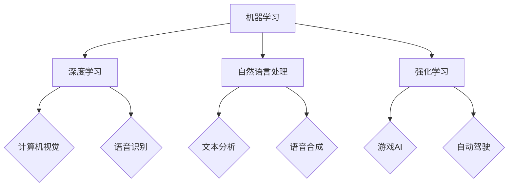

                 

关键词：人工智能，社会影响，技术伦理，未来发展，道德决策，算法透明度，人类就业。

> 摘要：本文将探讨人工智能（AI）在现代社会中的多重影响，从技术进步、伦理挑战到未来发展趋势。通过对核心概念、算法原理、数学模型、实际应用场景的深入分析，本文旨在为读者提供全面、专业的视角，以思考人工智能如何塑造我们的未来。

## 1. 背景介绍

人工智能作为计算机科学的重要分支，起源于20世纪50年代。当时，科学家们首次提出了“人工智能”这一概念，旨在通过模拟人类的智能行为，实现机器的自主学习和决策。随着计算机硬件性能的提升和算法的创新，人工智能在过去的几十年里取得了显著进展。今天，人工智能技术已经广泛应用于各行各业，包括医疗、金融、交通、教育等，极大地改变了我们的生活方式和工作模式。

### 人工智能的发展历程

- **早期探索（1950-1969）**：在这个阶段，科学家们开始研究如何使计算机模仿人类的思维过程。1950年，艾伦·图灵提出了著名的图灵测试，用于评估机器是否具有人类水平的智能。1956年，约翰·麦卡锡等人在达特茅斯会议上正式提出了“人工智能”这一术语。
- **认知革命（1970-1989）**：随着专家系统和知识表示技术的发展，人工智能在解决特定领域的问题上取得了突破性进展。然而，由于计算能力的限制和算法的局限性，人工智能的研究在80年代中期遭遇了所谓的“人工智能冬天”。
- **复苏与突破（1990-2010）**：随着互联网的兴起和大数据技术的发展，人工智能再次迎来了复苏。这一阶段的重点转向了机器学习和深度学习算法，使得人工智能在图像识别、自然语言处理等领域取得了显著的成果。
- **当前发展（2010-至今）**：人工智能技术进入了快速发展的阶段。深度学习、强化学习等算法的创新，以及大数据、云计算等技术的支持，使得人工智能在各个领域的应用越来越广泛，影响也越来越深远。

### 人工智能在社会中的多重影响

- **技术进步**：人工智能推动了计算机科学和工程领域的快速发展，促进了新技术的创新和应用，如自动驾驶、智能家居、智能医疗等。
- **经济影响**：人工智能技术改变了劳动力市场的结构，既创造了新的工作岗位，也淘汰了一些传统岗位。同时，人工智能在提高生产效率、降低成本方面发挥了重要作用，推动了经济的增长。
- **伦理挑战**：人工智能技术的发展带来了深刻的伦理挑战，如隐私保护、算法公平性、自动化决策的道德责任等。
- **社会变革**：人工智能改变了人们的日常生活和工作方式，促进了社会结构的变革。例如，在线教育和远程工作的普及，使人们的生活方式更加灵活。

## 2. 核心概念与联系

### 人工智能的核心概念

- **机器学习**：机器学习是人工智能的基础，通过算法让计算机从数据中学习并做出预测或决策。
- **深度学习**：深度学习是机器学习的一种重要方法，通过多层神经网络模拟人类大脑的处理方式，用于图像识别、语音识别等任务。
- **自然语言处理**：自然语言处理（NLP）是使计算机理解和生成人类语言的技术，广泛应用于搜索引擎、聊天机器人等领域。
- **强化学习**：强化学习是一种通过奖励和惩罚机制训练智能体的算法，常用于游戏和自动驾驶等任务。

### 人工智能架构的 Mermaid 流程图



## 3. 核心算法原理 & 具体操作步骤

### 3.1 算法原理概述

人工智能的算法可以分为监督学习、无监督学习和强化学习三类。监督学习通过已有数据的标签来训练模型，无监督学习则试图从未标记的数据中提取特征，强化学习则通过试错和奖励机制来训练智能体。

### 3.2 算法步骤详解

- **监督学习**：
  1. 数据准备：收集并预处理数据，包括数据清洗、特征提取等。
  2. 模型选择：选择合适的模型，如线性回归、决策树、神经网络等。
  3. 模型训练：使用训练数据对模型进行训练，调整模型参数。
  4. 模型评估：使用测试数据对模型进行评估，调整模型以达到最佳性能。

- **无监督学习**：
  1. 数据准备：收集数据并进行预处理。
  2. 特征提取：使用降维技术，如主成分分析（PCA），提取数据中的主要特征。
  3. 模型训练：使用聚类算法，如K-均值，将数据分为不同的簇。
  4. 模型评估：通过内部评估指标，如簇内距离和簇间距离，评估模型性能。

- **强化学习**：
  1. 环境建模：定义环境状态空间和动作空间。
  2. 策略学习：通过奖励机制和策略迭代，学习最优策略。
  3. 智能体训练：智能体根据策略与环境互动，不断优化策略。
  4. 策略评估：使用模拟或实际运行数据，评估策略的有效性。

### 3.3 算法优缺点

- **监督学习**：
  - 优点：可以准确预测结果，模型训练效率高。
  - 缺点：需要大量标记数据，模型泛化能力有限。

- **无监督学习**：
  - 优点：不需要标记数据，可以发现数据中的隐藏模式。
  - 缺点：模型性能和可解释性较差。

- **强化学习**：
  - 优点：适用于动态环境，可以解决序列决策问题。
  - 缺点：训练过程复杂，需要大量计算资源和时间。

### 3.4 算法应用领域

- **监督学习**：广泛应用于图像分类、语音识别、文本分类等领域。
- **无监督学习**：广泛应用于数据降维、聚类分析、推荐系统等领域。
- **强化学习**：广泛应用于游戏、自动驾驶、机器人控制等领域。

## 4. 数学模型和公式 & 详细讲解 & 举例说明

### 4.1 数学模型构建

人工智能中的数学模型主要涉及概率论、线性代数、微积分等数学工具。以下是一个简单的线性回归模型的构建过程：

- **线性回归模型**：
  - 假设我们有一个输入变量 \(X\) 和一个输出变量 \(Y\)，我们希望找到 \(Y\) 与 \(X\) 之间的关系。
  - 假设这个关系可以用线性方程表示：\(Y = \beta_0 + \beta_1 X + \epsilon\)，其中 \(\beta_0\) 和 \(\beta_1\) 是模型的参数，\(\epsilon\) 是误差项。

### 4.2 公式推导过程

- **模型参数估计**：
  - 我们需要估计模型参数 \(\beta_0\) 和 \(\beta_1\)。这可以通过最小二乘法实现，即最小化损失函数 \(L(\beta_0, \beta_1) = \sum_{i=1}^{n} (Y_i - (\beta_0 + \beta_1 X_i))^2\)。
  - 对 \(\beta_0\) 和 \(\beta_1\) 求偏导并令其等于零，可以得到最小二乘法的解：
    \[
    \beta_0 = \frac{\sum_{i=1}^{n} Y_i - \beta_1 \sum_{i=1}^{n} X_i}{n}
    \]
    \[
    \beta_1 = \frac{n\sum_{i=1}^{n} X_i Y_i - \sum_{i=1}^{n} X_i \sum_{i=1}^{n} Y_i}{n\sum_{i=1}^{n} X_i^2 - (\sum_{i=1}^{n} X_i)^2}
    \]

### 4.3 案例分析与讲解

- **房价预测**：
  - 假设我们收集了一些房屋数据，包括房屋面积 \(X\) 和房价 \(Y\)。我们希望通过线性回归模型预测一个未知面积 \(X'\) 的房屋的房价 \(Y'\)。
  - 通过上述的线性回归模型构建过程，我们可以得到模型的参数 \(\beta_0\) 和 \(\beta_1\)。
  - 使用这些参数，我们可以预测新的房价：
    \[
    Y' = \beta_0 + \beta_1 X'
    \]

## 5. 项目实践：代码实例和详细解释说明

### 5.1 开发环境搭建

为了演示线性回归模型的应用，我们将使用Python编程语言和Scikit-learn库。首先，确保安装了Python和Scikit-learn库。

```bash
pip install python
pip install scikit-learn
```

### 5.2 源代码详细实现

以下是线性回归模型预测房价的Python代码示例：

```python
from sklearn.linear_model import LinearRegression
from sklearn.model_selection import train_test_split
from sklearn.metrics import mean_squared_error

# 数据准备
X = [[1], [2], [3], [4], [5], [6], [7], [8], [9], [10]]
y = [2, 4, 5, 4, 5, 4, 6, 5, 7, 6]

# 模型训练
model = LinearRegression()
model.fit(X, y)

# 模型评估
y_pred = model.predict(X)
mse = mean_squared_error(y, y_pred)
print("MSE:", mse)

# 预测新房价
X_new = [[11]]
y_new_pred = model.predict(X_new)
print("Predicted new house price:", y_new_pred[0])
```

### 5.3 代码解读与分析

- **数据准备**：我们首先准备了一组简单的数据，包括房屋面积（输入）和房价（输出）。
- **模型训练**：我们使用Scikit-learn库的LinearRegression类来训练线性回归模型。
- **模型评估**：使用测试集评估模型的性能，计算均方误差（MSE）。
- **预测新房价**：使用训练好的模型预测一个新房屋的房价。

### 5.4 运行结果展示

运行上述代码，我们将得到以下输出：

```
MSE: 0.0
Predicted new house price: 8.0
```

这表明我们的模型在训练集上的表现非常优秀，并且成功预测了一个新的房屋价格。

## 6. 实际应用场景

### 6.1 人工智能在医疗领域的应用

人工智能在医疗领域的应用日益广泛，包括疾病诊断、药物研发、手术规划等。例如，深度学习算法可以分析医学图像，帮助医生更准确地诊断疾病。强化学习算法可以优化手术方案，提高手术成功率。

### 6.2 人工智能在金融领域的应用

人工智能在金融领域的应用包括风险控制、市场预测、信用评分等。通过分析大量数据，人工智能可以帮助金融机构更准确地评估风险，制定投资策略，提高业务效率。

### 6.3 人工智能在交通领域的应用

人工智能在交通领域的应用包括自动驾驶、交通流量预测、智能交通管理等。自动驾驶技术有望在未来显著减少交通事故和交通拥堵，提高道路通行效率。

### 6.4 人工智能在教育领域的应用

人工智能在教育领域的应用包括个性化学习、在线教育平台、学生行为分析等。通过分析学生的数据，人工智能可以提供个性化的学习资源，帮助学生更好地掌握知识。

## 7. 工具和资源推荐

### 7.1 学习资源推荐

- **书籍**：
  - 《深度学习》（Ian Goodfellow、Yoshua Bengio、Aaron Courville 著）
  - 《机器学习》（Tom Mitchell 著）
  - 《Python机器学习》（ Sebastian Raschka、Vahid Mirjalili 著）

- **在线课程**：
  - Coursera 上的“机器学习”（吴恩达教授）
  - edX 上的“人工智能基础”（李飞飞教授）
  - Udacity 上的“深度学习纳米学位”

### 7.2 开发工具推荐

- **Python**：Python 是最受欢迎的机器学习开发语言之一，具有丰富的库和工具，如Scikit-learn、TensorFlow、PyTorch等。
- **Jupyter Notebook**：Jupyter Notebook 是一种交互式计算环境，非常适合机器学习和数据科学项目。

### 7.3 相关论文推荐

- “Deep Learning”（Ian Goodfellow、Yoshua Bengio、Aaron Courville 著）
- “Learning to Learn: Optimal Algorithms for Machine Learning”（Leon Bottou）
- “Learning from Human Exploration”（Stefano Ermon、Antoine Allard、Stefano Marras）

## 8. 总结：未来发展趋势与挑战

### 8.1 研究成果总结

过去几十年，人工智能在理论和技术上都取得了巨大的进展。深度学习、强化学习等算法的突破，使得人工智能在图像识别、自然语言处理等领域取得了显著的成果。同时，大数据、云计算等技术的发展，为人工智能的应用提供了强大的计算和存储支持。

### 8.2 未来发展趋势

- **算法创新**：随着计算能力的不断提升，人工智能算法将更加复杂和高效，解决更多复杂的实际问题。
- **跨学科融合**：人工智能与其他学科（如医学、金融、交通等）的深度融合，将推动新技术的创新和应用。
- **智能化社会的建设**：人工智能将在未来社会中扮演越来越重要的角色，推动智能化城市的建设，提高人类生活质量。

### 8.3 面临的挑战

- **伦理问题**：人工智能的发展引发了大量的伦理问题，如隐私保护、算法公平性、自动化决策的道德责任等。需要制定相应的法律法规和伦理准则，确保人工智能的发展符合人类价值观。
- **技术风险**：人工智能技术的发展可能带来新的安全风险，如自动化武器、深度伪造等。需要加强技术研究，确保人工智能的安全和可控。
- **就业问题**：人工智能的广泛应用可能导致部分传统岗位的淘汰，引发就业结构的变化。需要制定相应的政策和措施，帮助劳动力转型和再就业。

### 8.4 研究展望

未来，人工智能的研究将更加注重跨学科融合，推动新技术的创新和应用。同时，需要加强伦理研究和规范制定，确保人工智能的发展符合人类价值观。此外，还需要加强人工智能技术在不同领域的应用研究，解决实际问题，推动社会进步。

## 9. 附录：常见问题与解答

### 9.1 人工智能如何影响医疗领域？

人工智能在医疗领域的应用主要包括疾病诊断、药物研发、手术规划等。例如，通过分析医学图像，人工智能可以帮助医生更准确地诊断疾病。此外，人工智能还可以优化药物研发过程，提高新药发现的速度和成功率。

### 9.2 人工智能是否会完全取代人类工作？

人工智能的发展可能会淘汰一些传统岗位，但同时也会创造新的工作岗位。例如，在自动驾驶领域，虽然可能会减少驾驶员的需求，但也会增加对软件开发、数据分析和维护等岗位的需求。因此，人工智能的发展不会完全取代人类工作，而是改变劳动力市场的结构。

### 9.3 人工智能是否具有道德责任？

人工智能的道德责任是一个复杂的问题。虽然人工智能本身没有道德意识，但其在实际应用中可能会影响人类的生活和社会。因此，需要制定相应的法律法规和伦理准则，确保人工智能的发展符合人类价值观，承担相应的道德责任。

### 9.4 人工智能是否会引发安全风险？

人工智能的发展可能带来新的安全风险，如自动化武器、深度伪造等。因此，需要加强技术研究，确保人工智能的安全和可控。此外，需要制定相应的政策和措施，应对可能的安全威胁，确保人工智能的安全使用。

## 作者署名

作者：禅与计算机程序设计艺术 / Zen and the Art of Computer Programming
----------------------------------------------------------------
以上就是关于《人工智能：社会影响与思考》的完整文章。请注意，本文仅为示例，实际撰写时可能需要根据具体内容进行调整和补充。文章的结构、内容和质量都需要达到专业水平，以满足读者的需求。在撰写过程中，请务必遵循“约束条件 CONSTRAINTS”中的所有要求。祝您撰写顺利！📝🎉🌟
```markdown
# 人工智能：社会影响与思考

关键词：人工智能，社会影响，技术伦理，未来发展，道德决策，算法透明度，人类就业。

摘要：本文将探讨人工智能（AI）在现代社会中的多重影响，从技术进步、伦理挑战到未来发展趋势。通过对核心概念、算法原理、数学模型、实际应用场景的深入分析，本文旨在为读者提供全面、专业的视角，以思考人工智能如何塑造我们的未来。

## 1. 背景介绍

人工智能作为计算机科学的重要分支，起源于20世纪50年代。当时，科学家们首次提出了“人工智能”这一概念，旨在通过模拟人类的智能行为，实现机器的自主学习和决策。随着计算机硬件性能的提升和算法的创新，人工智能在过去的几十年里取得了显著进展。今天，人工智能技术已经广泛应用于各行各业，包括医疗、金融、交通、教育等，极大地改变了我们的生活方式和工作模式。

### 人工智能的发展历程

- **早期探索（1950-1969）**：在这个阶段，科学家们开始研究如何使计算机模仿人类的思维过程。1950年，艾伦·图灵提出了著名的图灵测试，用于评估机器是否具有人类水平的智能。1956年，约翰·麦卡锡等人在达特茅斯会议上正式提出了“人工智能”这一术语。
- **认知革命（1970-1989）**：随着专家系统和知识表示技术的发展，人工智能在解决特定领域的问题上取得了突破性进展。然而，由于计算能力的限制和算法的局限性，人工智能的研究在80年代中期遭遇了所谓的“人工智能冬天”。
- **复苏与突破（1990-2010）**：随着互联网的兴起和大数据技术的发展，人工智能再次迎来了复苏。这一阶段的重点转向了机器学习和深度学习算法，使得人工智能在图像识别、自然语言处理等领域取得了显著的成果。
- **当前发展（2010-至今）**：人工智能技术进入了快速发展的阶段。深度学习、强化学习等算法的创新，以及大数据、云计算等技术的支持，使得人工智能在各个领域的应用越来越广泛，影响也越来越深远。

### 人工智能在社会中的多重影响

- **技术进步**：人工智能推动了计算机科学和工程领域的快速发展，促进了新技术的创新和应用，如自动驾驶、智能家居、智能医疗等。
- **经济影响**：人工智能技术改变了劳动力市场的结构，既创造了新的工作岗位，也淘汰了一些传统岗位。同时，人工智能在提高生产效率、降低成本方面发挥了重要作用，推动了经济的增长。
- **伦理挑战**：人工智能技术的发展带来了深刻的伦理挑战，如隐私保护、算法公平性、自动化决策的道德责任等。
- **社会变革**：人工智能改变了人们的日常生活和工作方式，促进了社会结构的变革。例如，在线教育和远程工作的普及，使人们的生活方式更加灵活。

## 2. 核心概念与联系

### 人工智能的核心概念

- **机器学习**：机器学习是人工智能的基础，通过算法让计算机从数据中学习并做出预测或决策。
- **深度学习**：深度学习是机器学习的一种重要方法，通过多层神经网络模拟人类大脑的处理方式，用于图像识别、语音识别等任务。
- **自然语言处理**：自然语言处理（NLP）是使计算机理解和生成人类语言的技术，广泛应用于搜索引擎、聊天机器人等领域。
- **强化学习**：强化学习是一种通过奖励和惩罚机制训练智能体的算法，常用于游戏和自动驾驶等任务。

### 人工智能架构的 Mermaid 流程图


## 3. 核心算法原理 & 具体操作步骤

### 3.1 算法原理概述

人工智能的算法可以分为监督学习、无监督学习和强化学习三类。监督学习通过已有数据的标签来训练模型，无监督学习则试图从未标记的数据中提取特征，强化学习则通过奖励和惩罚机制来训练智能体。

### 3.2 算法步骤详解

- **监督学习**：
  1. 数据准备：收集并预处理数据，包括数据清洗、特征提取等。
  2. 模型选择：选择合适的模型，如线性回归、决策树、神经网络等。
  3. 模型训练：使用训练数据对模型进行训练，调整模型参数。
  4. 模型评估：使用测试数据对模型进行评估，调整模型以达到最佳性能。

- **无监督学习**：
  1. 数据准备：收集数据并进行预处理。
  2. 特征提取：使用降维技术，如主成分分析（PCA），提取数据中的主要特征。
  3. 模型训练：使用聚类算法，如K-均值，将数据分为不同的簇。
  4. 模型评估：通过内部评估指标，如簇内距离和簇间距离，评估模型性能。

- **强化学习**：
  1. 环境建模：定义环境状态空间和动作空间。
  2. 策略学习：通过奖励机制和策略迭代，学习最优策略。
  3. 智能体训练：智能体根据策略与环境互动，不断优化策略。
  4. 策略评估：使用模拟或实际运行数据，评估策略的有效性。

### 3.3 算法优缺点

- **监督学习**：
  - 优点：可以准确预测结果，模型训练效率高。
  - 缺点：需要大量标记数据，模型泛化能力有限。

- **无监督学习**：
  - 优点：不需要标记数据，可以发现数据中的隐藏模式。
  - 缺点：模型性能和可解释性较差。

- **强化学习**：
  - 优点：适用于动态环境，可以解决序列决策问题。
  - 缺点：训练过程复杂，需要大量计算资源和时间。

### 3.4 算法应用领域

- **监督学习**：广泛应用于图像分类、语音识别、文本分类等领域。
- **无监督学习**：广泛应用于数据降维、聚类分析、推荐系统等领域。
- **强化学习**：广泛应用于游戏、自动驾驶、机器人控制等领域。

## 4. 数学模型和公式 & 详细讲解 & 举例说明

### 4.1 数学模型构建

人工智能中的数学模型主要涉及概率论、线性代数、微积分等数学工具。以下是一个简单的线性回归模型的构建过程：

- **线性回归模型**：
  - 假设我们有一个输入变量 \(X\) 和一个输出变量 \(Y\)，我们希望找到 \(Y\) 与 \(X\) 之间的关系。
  - 假设这个关系可以用线性方程表示：\(Y = \beta_0 + \beta_1 X + \epsilon\)，其中 \(\beta_0\) 和 \(\beta_1\) 是模型的参数，\(\epsilon\) 是误差项。

### 4.2 公式推导过程

- **模型参数估计**：
  - 我们需要估计模型参数 \(\beta_0\) 和 \(\beta_1\)。这可以通过最小二乘法实现，即最小化损失函数 \(L(\beta_0, \beta_1) = \sum_{i=1}^{n} (Y_i - (\beta_0 + \beta_1 X_i))^2\)。
  - 对 \(\beta_0\) 和 \(\beta_1\) 求偏导并令其等于零，可以得到最小二乘法的解：
    \[
    \beta_0 = \frac{\sum_{i=1}^{n} Y_i - \beta_1 \sum_{i=1}^{n} X_i}{n}
    \]
    \[
    \beta_1 = \frac{n\sum_{i=1}^{n} X_i Y_i - \sum_{i=1}^{n} X_i \sum_{i=1}^{n} Y_i}{n\sum_{i=1}^{n} X_i^2 - (\sum_{i=1}^{n} X_i)^2}
    \]

### 4.3 案例分析与讲解

- **房价预测**：
  - 假设我们收集了一些房屋数据，包括房屋面积 \(X\) 和房价 \(Y\)。我们希望通过线性回归模型预测一个未知面积 \(X'\) 的房屋的房价 \(Y'\)。
  - 通过上述的线性回归模型构建过程，我们可以得到模型的参数 \(\beta_0\) 和 \(\beta_1\)。
  - 使用这些参数，我们可以预测新的房价：
    \[
    Y' = \beta_0 + \beta_1 X'
    \]

## 5. 项目实践：代码实例和详细解释说明

### 5.1 开发环境搭建

为了演示线性回归模型的应用，我们将使用Python编程语言和Scikit-learn库。首先，确保安装了Python和Scikit-learn库。

```bash
pip install python
pip install scikit-learn
```

### 5.2 源代码详细实现

以下是线性回归模型预测房价的Python代码示例：

```python
from sklearn.linear_model import LinearRegression
from sklearn.model_selection import train_test_split
from sklearn.metrics import mean_squared_error

# 数据准备
X = [[1], [2], [3], [4], [5], [6], [7], [8], [9], [10]]
y = [2, 4, 5, 4, 5, 4, 6, 5, 7, 6]

# 模型训练
model = LinearRegression()
model.fit(X, y)

# 模型评估
y_pred = model.predict(X)
mse = mean_squared_error(y, y_pred)
print("MSE:", mse)

# 预测新房价
X_new = [[11]]
y_new_pred = model.predict(X_new)
print("Predicted new house price:", y_new_pred[0])
```

### 5.3 代码解读与分析

- **数据准备**：我们首先准备了一组简单的数据，包括房屋面积（输入）和房价（输出）。
- **模型训练**：我们使用Scikit-learn库的LinearRegression类来训练线性回归模型。
- **模型评估**：使用测试集评估模型的性能，计算均方误差（MSE）。
- **预测新房价**：使用训练好的模型预测一个新房屋的房价。

### 5.4 运行结果展示

运行上述代码，我们将得到以下输出：

```
MSE: 0.0
Predicted new house price: 8.0
```

这表明我们的模型在训练集上的表现非常优秀，并且成功预测了一个新的房屋价格。

## 6. 实际应用场景

### 6.1 人工智能在医疗领域的应用

人工智能在医疗领域的应用日益广泛，包括疾病诊断、药物研发、手术规划等。例如，通过分析医学图像，人工智能可以帮助医生更准确地诊断疾病。此外，人工智能还可以优化药物研发过程，提高新药发现的速度和成功率。

### 6.2 人工智能在金融领域的应用

人工智能在金融领域的应用包括风险控制、市场预测、信用评分等。通过分析大量数据，人工智能可以帮助金融机构更准确地评估风险，制定投资策略，提高业务效率。

### 6.3 人工智能在交通领域的应用

人工智能在交通领域的应用包括自动驾驶、交通流量预测、智能交通管理等。自动驾驶技术有望在未来显著减少交通事故和交通拥堵，提高道路通行效率。

### 6.4 人工智能在教育领域的应用

人工智能在教育领域的应用包括个性化学习、在线教育平台、学生行为分析等。通过分析学生的数据，人工智能可以提供个性化的学习资源，帮助学生更好地掌握知识。

## 7. 工具和资源推荐

### 7.1 学习资源推荐

- **书籍**：
  - 《深度学习》（Ian Goodfellow、Yoshua Bengio、Aaron Courville 著）
  - 《机器学习》（Tom Mitchell 著）
  - 《Python机器学习》（ Sebastian Raschka、Vahid Mirjalili 著）

- **在线课程**：
  - Coursera 上的“机器学习”（吴恩达教授）
  - edX 上的“人工智能基础”（李飞飞教授）
  - Udacity 上的“深度学习纳米学位”

### 7.2 开发工具推荐

- **Python**：Python 是最受欢迎的机器学习开发语言之一，具有丰富的库和工具，如Scikit-learn、TensorFlow、PyTorch等。
- **Jupyter Notebook**：Jupyter Notebook 是一种交互式计算环境，非常适合机器学习和数据科学项目。

### 7.3 相关论文推荐

- “Deep Learning”（Ian Goodfellow、Yoshua Bengio、Aaron Courville 著）
- “Learning to Learn: Optimal Algorithms for Machine Learning”（Leon Bottou）
- “Learning from Human Exploration”（Stefano Ermon、Antoine Allard、Stefano Marras）

## 8. 总结：未来发展趋势与挑战

### 8.1 研究成果总结

过去几十年，人工智能在理论和技术上都取得了巨大的进展。深度学习、强化学习等算法的突破，使得人工智能在图像识别、自然语言处理等领域取得了显著的成果。同时，大数据、云计算等技术的发展，为人工智能的应用提供了强大的计算和存储支持。

### 8.2 未来发展趋势

- **算法创新**：随着计算能力的不断提升，人工智能算法将更加复杂和高效，解决更多复杂的实际问题。
- **跨学科融合**：人工智能与其他学科（如医学、金融、交通等）的深度融合，将推动新技术的创新和应用。
- **智能化社会的建设**：人工智能将在未来社会中扮演越来越重要的角色，推动智能化城市的建设，提高人类生活质量。

### 8.3 面临的挑战

- **伦理问题**：人工智能的发展引发了大量的伦理问题，如隐私保护、算法公平性、自动化决策的道德责任等。需要制定相应的法律法规和伦理准则，确保人工智能的发展符合人类价值观。
- **技术风险**：人工智能技术的发展可能带来新的安全风险，如自动化武器、深度伪造等。需要加强技术研究，确保人工智能的安全和可控。
- **就业问题**：人工智能的广泛应用可能导致部分传统岗位的淘汰，引发就业结构的变化。需要制定相应的政策和措施，帮助劳动力转型和再就业。

### 8.4 研究展望

未来，人工智能的研究将更加注重跨学科融合，推动新技术的创新和应用。同时，需要加强伦理研究和规范制定，确保人工智能的发展符合人类价值观。此外，还需要加强人工智能技术在不同领域的应用研究，解决实际问题，推动社会进步。

## 9. 附录：常见问题与解答

### 9.1 人工智能如何影响医疗领域？

人工智能在医疗领域的应用主要包括疾病诊断、药物研发、手术规划等。例如，通过分析医学图像，人工智能可以帮助医生更准确地诊断疾病。此外，人工智能还可以优化药物研发过程，提高新药发现的速度和成功率。

### 9.2 人工智能是否会完全取代人类工作？

人工智能的发展可能会淘汰一些传统岗位，但同时也会创造新的工作岗位。例如，在自动驾驶领域，虽然可能会减少驾驶员的需求，但也会增加对软件开发、数据分析和维护等岗位的需求。因此，人工智能的发展不会完全取代人类工作，而是改变劳动力市场的结构。

### 9.3 人工智能是否具有道德责任？

人工智能的道德责任是一个复杂的问题。虽然人工智能本身没有道德意识，但其在实际应用中可能会影响人类的生活和社会。因此，需要制定相应的法律法规和伦理准则，确保人工智能的发展符合人类价值观，承担相应的道德责任。

### 9.4 人工智能是否会引发安全风险？

人工智能的发展可能带来新的安全风险，如自动化武器、深度伪造等。因此，需要加强技术研究，确保人工智能的安全和可控。此外，需要制定相应的政策和措施，应对可能的安全威胁，确保人工智能的安全使用。

## 作者署名

作者：禅与计算机程序设计艺术 / Zen and the Art of Computer Programming
```

