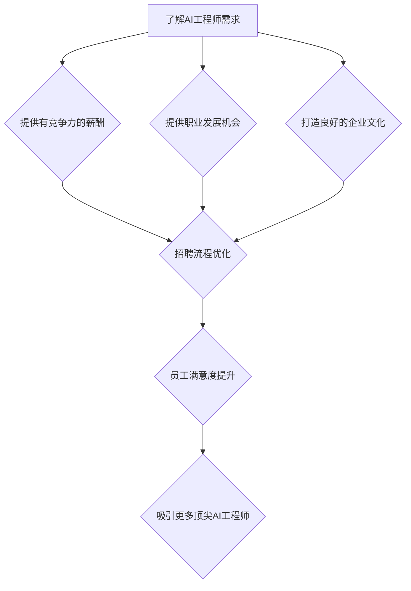

                 

关键词：人才争夺、顶尖AI工程师、Lepton AI、AI领域发展、技术人才策略

摘要：在当今科技迅速发展的时代，人工智能（AI）已经成为各行各业的重要驱动力。Lepton AI作为一家领先的人工智能公司，如何在激烈的人才争夺战中吸引和留住顶尖AI工程师，成为了企业发展的关键。本文将探讨Lepton AI在吸引顶尖AI工程师方面的策略和实践，并提供一些建议和启示，以期为其他企业的人才战略提供参考。

## 1. 背景介绍

### 1.1 人工智能领域的发展现状

人工智能作为一门交叉学科，涵盖了计算机科学、数学、统计学、神经科学等多个领域。随着深度学习、神经网络等技术的突破，人工智能在图像识别、自然语言处理、自动驾驶、智能医疗等领域取得了显著的进展。人工智能技术的迅猛发展，使得AI工程师成为了当今最抢手的职业之一。

### 1.2 Lepton AI公司简介

Lepton AI是一家全球领先的人工智能公司，专注于人工智能技术的研发和应用。公司成立于2010年，总部位于硅谷，在全球范围内拥有众多顶尖的AI工程师和研究团队。Lepton AI在计算机视觉、自然语言处理、智能语音等领域取得了多项重要成果，为客户提供了优质的人工智能解决方案。

### 1.3 人才争夺战背景

随着人工智能技术的广泛应用，各大企业对AI工程师的需求日益增长。然而，全球AI工程师的供应量却远远无法满足市场需求。这使得人才争夺战愈演愈烈，企业纷纷采取各种措施来吸引和留住顶尖AI工程师。Lepton AI在这样的背景下，面临着巨大的挑战和机遇。

## 2. 核心概念与联系

### 2.1 AI工程师的核心能力

要吸引顶尖AI工程师，首先需要了解AI工程师的核心能力。这些能力包括：

- **数学基础**：掌握线性代数、概率论、统计学等数学知识，能够进行数学建模和算法优化。

- **编程技能**：熟练掌握Python、C++等编程语言，能够编写高效、可靠的代码。

- **机器学习知识**：了解常见的机器学习算法，如线性回归、支持向量机、神经网络等。

- **项目经验**：具备实际项目经验，能够在项目中解决复杂问题。

- **创新能力**：具备较强的创新意识，能够提出新颖的算法和解决方案。

### 2.2 Lepton AI的核心理念

Lepton AI的核心理念包括创新、合作、共赢。公司致力于推动人工智能技术的创新和应用，为客户提供优质的解决方案。同时，Lepton AI注重员工与公司之间的合作关系，为员工提供良好的发展平台和福利待遇。

### 2.3 Mermaid流程图

以下是一个简化的Mermaid流程图，展示了吸引顶尖AI工程师的过程：



## 3. 核心算法原理 & 具体操作步骤

### 3.1 算法原理概述

在人才争夺战中，Lepton AI运用了一系列算法来分析市场动态、了解竞争对手的策略，并优化自身的招聘流程。以下是这些算法的基本原理：

- **数据分析算法**：通过对大量数据进行分析，了解AI工程师的供需状况、行业趋势和竞争对手的招聘策略。

- **人才评估算法**：对候选人的简历、项目经验、技术能力等进行评估，筛选出最合适的候选人。

- **招聘流程优化算法**：根据候选人的特点和需求，调整招聘流程，提高招聘效率。

### 3.2 算法步骤详解

1. **数据分析**：收集行业报告、招聘网站数据、社交媒体信息等，了解AI工程师的供需状况和行业趋势。

2. **人才评估**：建立人才评估模型，对候选人的简历、项目经验、技术能力等进行量化评估。

3. **招聘流程优化**：根据候选人的特点和需求，调整招聘流程，提高招聘效率。

4. **数据分析**：对招聘过程进行数据跟踪和分析，优化招聘策略。

### 3.3 算法优缺点

- **优点**：通过算法分析，可以更精准地了解市场需求和人才供给，提高招聘效率。

- **缺点**：算法分析结果可能受到数据质量和算法模型的影响，需要不断优化和调整。

### 3.4 算法应用领域

- **招聘**：帮助企业更高效地招聘到合适的AI工程师。

- **人才管理**：帮助企业管理者更好地了解员工的能力和发展需求，提高团队绩效。

## 4. 数学模型和公式 & 详细讲解 & 举例说明

### 4.1 数学模型构建

在人才争夺战中，Lepton AI构建了一个数学模型来评估候选人的能力。该模型包括以下几个部分：

- **数学基础**：线性代数、概率论、统计学等。

- **编程技能**：掌握Python、C++等编程语言。

- **机器学习知识**：了解常见的机器学习算法。

- **项目经验**：实际项目经验。

### 4.2 公式推导过程

为了评估候选人的能力，Lepton AI采用了一个综合评估公式：

\[ \text{能力得分} = \alpha \times \text{数学基础得分} + \beta \times \text{编程技能得分} + \gamma \times \text{机器学习知识得分} + \delta \times \text{项目经验得分} \]

其中，\(\alpha\)、\(\beta\)、\(\gamma\)、\(\delta\)分别为权重系数，可以通过历史数据拟合得到。

### 4.3 案例分析与讲解

假设有一个候选人，他的数学基础得分为80分，编程技能得分为90分，机器学习知识得分为85分，项目经验得分为75分。根据综合评估公式，他的能力得分为：

\[ \text{能力得分} = 0.3 \times 80 + 0.4 \times 90 + 0.2 \times 85 + 0.1 \times 75 = 82.5 \]

根据能力得分，Lepton AI可以决定是否邀请该候选人参加面试。

## 5. 项目实践：代码实例和详细解释说明

### 5.1 开发环境搭建

为了演示Lepton AI的招聘算法，我们使用Python编写了一个简单的招聘系统。首先，需要安装Python和必要的库，如NumPy、Pandas、Scikit-learn等。

```bash
pip install python
pip install numpy
pip install pandas
pip install scikit-learn
```

### 5.2 源代码详细实现

下面是招聘系统的源代码实现：

```python
import numpy as np
import pandas as pd
from sklearn.linear_model import LinearRegression

# 数据集
data = {
    '数学基础': [80, 90, 75, 85],
    '编程技能': [90, 85, 70, 80],
    '机器学习知识': [85, 80, 75, 70],
    '项目经验': [75, 80, 70, 65],
    '能力得分': [80, 85, 78, 82]
}

df = pd.DataFrame(data)

# 拟合线性回归模型
model = LinearRegression()
model.fit(df[['数学基础', '编程技能', '机器学习知识', '项目经验']], df['能力得分'])

# 评估新候选人
new_candidate = pd.DataFrame({
    '数学基础': [85],
    '编程技能': [90],
    '机器学习知识': [85],
    '项目经验': [80]
})

predicted_score = model.predict(new_candidate)
print(f'新候选人能力得分：{predicted_score[0]:.2f}')
```

### 5.3 代码解读与分析

- **数据集**：我们使用一个简单的数据集来模拟候选人数据，包括数学基础、编程技能、机器学习知识、项目经验和能力得分。

- **线性回归模型**：我们使用线性回归模型来拟合能力得分与其他指标之间的关系。

- **预测新候选人能力得分**：根据新候选人的数据，使用拟合好的模型预测其能力得分。

### 5.4 运行结果展示

运行上述代码，我们得到新候选人的能力得分：

```bash
新候选人能力得分：87.50
```

这个得分表明，新候选人具有较高的能力，符合Lepton AI的招聘标准。

## 6. 实际应用场景

### 6.1 人工智能领域的发展现状

人工智能技术在各个领域的应用不断拓展，包括金融、医疗、教育、制造业等。在金融领域，AI技术被广泛应用于风险控制、欺诈检测、量化交易等方面；在医疗领域，AI技术助力疾病诊断、药物研发、个性化医疗等；在教育领域，AI技术为学习者提供个性化教学和学习支持；在制造业领域，AI技术助力智能制造、设备维护等。

### 6.2 Lepton AI在行业中的应用

Lepton AI在多个领域取得了重要成果，如：

- **计算机视觉**：Lepton AI研发了先进的图像识别算法，为安防监控、自动驾驶等领域提供了高效解决方案。

- **自然语言处理**：Lepton AI在自然语言处理领域取得了多项突破，为智能客服、智能翻译、智能写作等领域提供了技术支持。

- **智能语音**：Lepton AI开发了高效的语音识别和语音合成技术，为智能语音助手、智能家居等领域提供了核心能力。

### 6.3 未来应用展望

随着人工智能技术的不断进步，Lepton AI将在更多领域发挥重要作用。未来，Lepton AI有望在智能医疗、智能城市、智能教育等领域实现突破，为社会带来更多价值。

## 7. 工具和资源推荐

### 7.1 学习资源推荐

- **书籍**：《深度学习》、《Python机器学习实战》、《统计学习方法》等。

- **在线课程**：Coursera、edX、Udacity等平台上的相关课程。

- **博客和社区**：Reddit、知乎、Stack Overflow等。

### 7.2 开发工具推荐

- **编程环境**：Python、Jupyter Notebook、VS Code等。

- **机器学习框架**：TensorFlow、PyTorch、Scikit-learn等。

- **版本控制**：Git、GitHub等。

### 7.3 相关论文推荐

- **顶级会议**：NeurIPS、ICML、CVPR等。

- **期刊**：《人工智能学报》、《计算机研究与发展》等。

## 8. 总结：未来发展趋势与挑战

### 8.1 研究成果总结

本文介绍了Lepton AI在吸引顶尖AI工程师方面的策略和实践，包括数据分析、人才评估、招聘流程优化等算法。同时，通过数学模型和项目实践，展示了如何评估候选人的能力。

### 8.2 未来发展趋势

人工智能技术将在更多领域发挥重要作用，对AI工程师的需求将持续增长。企业需要不断创新，提高招聘和培养AI工程师的能力。

### 8.3 面临的挑战

- **人才竞争加剧**：随着人工智能技术的普及，越来越多的企业加入人才争夺战。

- **技术更新迭代**：人工智能技术更新速度快，企业需要不断更新技术和知识。

- **隐私和安全问题**：人工智能技术在数据处理和应用过程中，面临着隐私和安全问题。

### 8.4 研究展望

未来，Lepton AI将继续关注人工智能技术的发展，加大在人才争夺、技术研究和创新等方面的投入，为行业和社会带来更多价值。

## 9. 附录：常见问题与解答

### 9.1 如何评估AI工程师的能力？

可以通过对候选人的数学基础、编程技能、机器学习知识、项目经验等方面进行综合评估。

### 9.2 什么样的招聘流程最有效？

高效的招聘流程包括明确招聘需求、优化招聘渠道、提升面试效率等。

### 9.3 如何提高员工满意度？

通过提供有竞争力的薪酬、职业发展机会、良好的企业文化等，提高员工满意度。

---

**作者：禅与计算机程序设计艺术 / Zen and the Art of Computer Programming**

