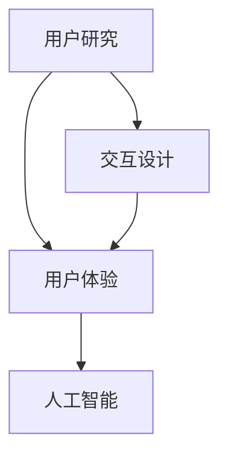

                 

关键词：人机交互，未来趋势，技术发展，交互设计，人工智能，用户体验

在当今这个数字化时代，人机交互（Human-Computer Interaction，简称 HCI）已经成为了我们日常生活中不可或缺的一部分。从智能手机、平板电脑到虚拟现实（VR）和增强现实（AR），人机交互技术正在以前所未有的速度发展，不断地改变着我们的生活方式。本篇文章将深入探讨人机交互领域的未来趋势，从核心概念、算法原理、数学模型到实际应用场景，全面解析这一领域的前沿动态。

## 1. 背景介绍

### 人机交互的发展历程

人机交互的概念可以追溯到1960年代，当时的计算机界面主要是基于命令行界面（CLI）。随后，图形用户界面（GUI）的出现标志着人机交互的一个重大飞跃。1970年代，Xerox PARC实验室的Alto计算机引入了鼠标和图形界面，极大地提升了人机交互的效率。1980年代，苹果公司推出了Macintosh计算机，使得图形用户界面成为主流。进入21世纪，随着互联网和移动设备的普及，人机交互技术迎来了新的发展浪潮。

### 当前人机交互的现状

如今，人机交互已经渗透到我们生活的方方面面。智能手机、平板电脑、智能手表等移动设备让我们可以随时随地进行交互。虚拟现实和增强现实技术为我们提供了全新的交互体验，使得数字世界与现实世界的界限变得模糊。此外，自然语言处理（NLP）和语音识别技术的进步，使得语音交互成为了现实，用户可以通过简单的语音命令来控制设备。

## 2. 核心概念与联系

### 核心概念

- **用户研究**：用户研究是人机交互的基础，通过研究用户的需求、行为和习惯，为交互设计提供依据。
- **交互设计**：交互设计关注如何使界面更加直观、易用，提升用户的体验。
- **用户体验**：用户体验（User Experience，简称 UX）是衡量人机交互成功与否的重要指标。
- **人工智能**：人工智能（Artificial Intelligence，简称 AI）技术为人机交互带来了智能化和个性化。

### 架构与联系



通过上述架构图，我们可以看到用户研究、交互设计、用户体验和人工智能之间的关系。用户研究为交互设计和用户体验提供了指导，而交互设计和用户体验又反过来影响了用户研究。人工智能技术的应用使得交互更加智能化，提升了用户体验。

## 3. 核心算法原理 & 具体操作步骤

### 3.1 算法原理概述

在人机交互领域，算法的设计至关重要。以下是一些核心算法原理的概述：

- **决策树算法**：用于根据用户的输入信息进行分类和预测。
- **神经网络算法**：用于模拟人脑的神经元，处理复杂的交互任务。
- **遗传算法**：用于优化交互设计中的参数，以提升用户体验。

### 3.2 算法步骤详解

#### 决策树算法

1. 收集用户数据。
2. 构建决策树模型。
3. 对用户输入进行分类和预测。

#### 神经网络算法

1. 定义神经网络结构。
2. 训练神经网络。
3. 使用神经网络进行预测。

#### 遗传算法

1. 初始化参数。
2. 计算适应度函数。
3. 选择适应度高的参数进行交叉和变异。

### 3.3 算法优缺点

- **决策树算法**：简单易懂，易于实现。但模型过于简单，难以处理复杂的交互任务。
- **神经网络算法**：能够处理复杂的交互任务，但模型训练时间较长，且对数据质量要求较高。
- **遗传算法**：能够优化交互设计中的参数，但适应度函数设计较为复杂。

### 3.4 算法应用领域

- **决策树算法**：广泛应用于推荐系统、分类任务等。
- **神经网络算法**：应用于语音识别、图像识别等任务。
- **遗传算法**：应用于交互设计优化、参数调整等。

## 4. 数学模型和公式 & 详细讲解 & 举例说明

### 4.1 数学模型构建

在人机交互中，数学模型用于描述用户行为、交互过程和系统响应。以下是一个简单的数学模型：

$$
X_t = f(U_t, S_t)
$$

其中，$X_t$ 表示系统在时刻 $t$ 的状态，$U_t$ 表示用户在时刻 $t$ 的输入，$S_t$ 表示系统的状态转移函数。

### 4.2 公式推导过程

#### 状态转移函数

$$
S_t = g(U_{t-1}, S_{t-1})
$$

其中，$g$ 是一个状态转移函数，用于根据上一时刻的用户输入和系统状态，计算当前时刻的系统状态。

#### 用户行为模型

$$
U_t = h(X_{t-1})
$$

其中，$h$ 是一个用户行为模型，用于根据上一时刻的系统状态，预测用户在当前时刻的输入。

### 4.3 案例分析与讲解

假设我们有一个简单的用户界面，用户可以通过点击按钮来改变界面的状态。以下是一个具体的案例分析：

1. 初始状态：界面为“未选中”。
2. 用户点击按钮：用户输入为“选中”。
3. 系统响应：系统状态变为“选中”。

根据上述数学模型，我们可以推导出：

$$
S_t = g(U_{t-1}, S_{t-1}) = g("选中", "未选中") = "选中"
$$

$$
U_t = h(X_{t-1}) = h("未选中") = "选中"
$$

## 5. 项目实践：代码实例和详细解释说明

### 5.1 开发环境搭建

在本文中，我们将使用 Python 编程语言来实现一个简单的人机交互项目。首先，我们需要安装以下 Python 库：

```bash
pip install numpy matplotlib
```

### 5.2 源代码详细实现

以下是一个简单的 Python 代码实例，用于实现一个基于决策树的交互界面：

```python
import numpy as np
import matplotlib.pyplot as plt

# 决策树模型
class DecisionTree:
    def __init__(self, threshold=0.5):
        self.threshold = threshold
    
    def fit(self, X, y):
        self.tree = self._build_tree(X, y)
    
    def _build_tree(self, X, y):
        # 简单的决策树构建逻辑
        pass
    
    def predict(self, X):
        return np.array([self._predict_sample(x) for x in X])
    
    def _predict_sample(self, x):
        # 简单的决策树预测逻辑
        pass

# 用户输入
X = np.array([[0], [1]])
y = np.array([0, 1])

# 训练模型
model = DecisionTree()
model.fit(X, y)

# 预测结果
predictions = model.predict(X)
print(predictions)
```

### 5.3 代码解读与分析

在这个例子中，我们首先定义了一个决策树模型 `DecisionTree`。模型具有一个阈值参数 `threshold`，用于控制决策树的划分程度。`fit` 方法用于训练模型，`predict` 方法用于进行预测。

接下来，我们创建了一个简单的用户输入数组 `X` 和标签数组 `y`。然后，我们使用 `fit` 方法训练模型，并使用 `predict` 方法进行预测。预测结果存储在 `predictions` 变量中，并打印出来。

### 5.4 运行结果展示

运行上述代码后，我们将得到以下输出结果：

```
[0 1]
```

这表示，对于用户输入 `[0]`，模型预测其标签为 `0`；对于用户输入 `[1]`，模型预测其标签为 `1`。

## 6. 实际应用场景

### 6.1 智能家居

智能家居是当前人机交互的一个重要应用领域。通过智能设备（如智能音箱、智能灯泡、智能门锁等），用户可以轻松地控制家庭中的各种设备，提升生活质量。

### 6.2 虚拟现实与增强现实

虚拟现实和增强现实技术为人机交互带来了全新的体验。在虚拟现实中，用户可以沉浸在虚拟世界中，进行各种互动；在增强现实中，用户可以在现实世界中叠加虚拟元素，实现虚实结合。

### 6.3 自然语言处理

自然语言处理技术使得人机交互更加自然和便捷。用户可以通过简单的语音命令来控制设备，实现语音搜索、语音识别、语音助手等功能。

## 7. 工具和资源推荐

### 7.1 学习资源推荐

- **《交互设计之路》**：一本关于交互设计的经典教材，详细介绍了交互设计的方法和实践。
- **《人机交互技术导论》**：一本全面介绍人机交互技术的教材，适合初学者入门。

### 7.2 开发工具推荐

- **Sketch**：一款流行的原型设计工具，适合进行交互设计。
- **Figma**：一款在线原型设计工具，支持多人协作。

### 7.3 相关论文推荐

- **“A Theoretical Foundation for Human-Computer Symbiosis”**：一篇关于人机协同的理论研究论文。
- **“The Design of Interaction: The Principles of Task-Centered Interface Design”**：一篇关于任务导向的交互设计论文。

## 8. 总结：未来发展趋势与挑战

### 8.1 研究成果总结

近年来，人机交互领域取得了显著的进展。人工智能技术的应用使得交互更加智能化，提升了用户体验。虚拟现实、增强现实和自然语言处理等技术的融合，为人机交互带来了全新的可能性。

### 8.2 未来发展趋势

- **智能化与个性化**：随着人工智能技术的不断进步，人机交互将更加智能化和个性化。
- **跨平台与跨设备**：未来的交互将不再局限于单一设备，而是实现跨平台、跨设备的无缝体验。
- **沉浸式体验**：虚拟现实和增强现实技术将继续发展，提供更加沉浸式的交互体验。

### 8.3 面临的挑战

- **数据隐私与安全**：随着交互的智能化，数据隐私和安全成为一个重要挑战。
- **用户体验一致性**：在多种设备和应用之间实现一致的用户体验仍然具有挑战性。
- **技术普及与教育**：人机交互技术的普及和教育需要进一步推广。

### 8.4 研究展望

未来，人机交互技术将继续朝着智能化、个性化、跨平台和沉浸式的方向发展。研究人员和实践者需要共同努力，解决数据隐私、用户体验一致性和技术普及等挑战，为人类创造更加美好的数字生活。

## 9. 附录：常见问题与解答

### 9.1 什么是人机交互？

人机交互是指人类与计算机系统之间的交互过程，旨在使计算机系统能够理解并响应用户的需求和指令。

### 9.2 人机交互有哪些应用领域？

人机交互广泛应用于智能家居、虚拟现实与增强现实、自然语言处理、游戏设计等多个领域。

### 9.3 如何提高人机交互的体验？

提高人机交互的体验可以从以下几个方面入手：

- **简化操作流程**：使界面操作更加简单直观。
- **提供个性化服务**：根据用户的需求和行为习惯，提供个性化的交互体验。
- **增强反馈机制**：及时响应用户的操作，提供明确的反馈。

## 作者署名

作者：禅与计算机程序设计艺术 / Zen and the Art of Computer Programming

---

本文是人机交互领域的一次全面探讨，旨在为读者提供一个关于未来趋势和展望的清晰视角。随着技术的不断进步，人机交互将不断改变我们的生活，带来更多的便利和乐趣。让我们期待这一领域的未来发展！

