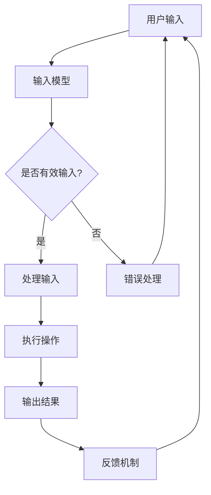

                 

关键词：人机交互，未来趋势，人工智能，用户体验，交互设计，虚拟现实，增强现实，自然语言处理，多模态交互，智能化设备，语音识别，手势识别。

> 摘要：本文将深入探讨人机交互领域的未来趋势，分析人工智能、虚拟现实、增强现实、自然语言处理等技术的进步如何影响用户体验和交互设计。我们将讨论人机交互的核心概念、算法原理、数学模型、项目实践，并展望该领域的发展前景和面临的挑战。

## 1. 背景介绍

人机交互（Human-Computer Interaction, HCI）是一个跨学科的领域，它涉及心理学、设计学、计算机科学和认知科学等多个领域。随着计算机技术的发展，人机交互的重要性日益凸显。早期的人机交互主要以命令行界面和图形用户界面（GUI）为主，用户通过键盘、鼠标等输入设备与计算机系统进行交互。

### 1.1 早期人机交互

- **命令行界面**：用户通过输入一系列命令来控制计算机系统。
- **图形用户界面**：引入图标、菜单和窗口，使得交互变得更加直观和便捷。

### 1.2 现代人机交互

现代人机交互不仅局限于桌面计算机，还包括移动设备、平板电脑、智能手表等。随着移动互联网和智能硬件的普及，人机交互的方式也越来越多样化，如语音交互、手势识别、眼球追踪等。

### 1.3 当前趋势

- **虚拟现实（VR）与增强现实（AR）**：通过模拟或增强现实环境，为用户提供沉浸式体验。
- **人工智能（AI）与自然语言处理（NLP）**：使计算机能够理解并处理人类的自然语言。
- **多模态交互**：结合多种输入和输出方式，如语音、手势、视觉等，提供更加丰富和自然的交互体验。

## 2. 核心概念与联系

在人机交互领域，有许多核心概念和技术，它们共同构建了现代交互系统的架构。

### 2.1 人机交互核心概念

- **用户中心设计**：设计过程中始终以用户需求为中心，关注用户体验。
- **交互模型**：描述用户与系统交互的方式和机制，如输入模型和输出模型。
- **反馈机制**：系统对用户输入的响应和反馈，提高交互的效率和质量。

### 2.2 人机交互技术架构



### 2.3 关键技术进展

- **语音识别**：通过将语音转换为文本，实现自然语言交互。
- **手势识别**：通过捕捉用户手势，实现直观的交互方式。
- **眼球追踪**：用于提高交互的精准度和效率。

## 3. 核心算法原理 & 具体操作步骤

### 3.1 算法原理概述

人机交互的核心算法主要包括语音识别、手势识别和自然语言处理等。这些算法的基本原理是：

- **语音识别**：基于声学模型和语言模型，将语音信号转换为文本。
- **手势识别**：通过计算机视觉技术，捕捉用户的手势并识别其含义。
- **自然语言处理**：对自然语言进行理解、分析和生成，实现人与计算机的智能对话。

### 3.2 算法步骤详解

#### 3.2.1 语音识别算法步骤

1. **预处理**：对语音信号进行降噪、分段和特征提取。
2. **声学模型训练**：使用大量语音数据训练声学模型。
3. **语言模型训练**：使用大量文本数据训练语言模型。
4. **语音信号到文本转换**：将预处理后的语音信号输入声学模型，输出对应的文本。

#### 3.2.2 手势识别算法步骤

1. **图像预处理**：对输入图像进行去噪、滤波和缩放等处理。
2. **特征提取**：从预处理后的图像中提取关键特征，如边缘、轮廓和姿态等。
3. **手势分类**：使用机器学习算法，如支持向量机（SVM）或卷积神经网络（CNN），对提取的特征进行分类。

#### 3.2.3 自然语言处理算法步骤

1. **分词**：将自然语言文本切分成单词或短语。
2. **词性标注**：为每个单词或短语标注词性，如名词、动词、形容词等。
3. **句法分析**：分析句子的结构，确定单词或短语的语法关系。
4. **语义理解**：对句子的语义进行理解，提取关键信息。

### 3.3 算法优缺点

- **语音识别**：优点是交互自然，缺点是受噪声影响较大，识别准确性有待提高。
- **手势识别**：优点是直观、高效，缺点是识别精度受环境光照和摄像头角度影响。
- **自然语言处理**：优点是能够处理复杂的语义信息，缺点是计算量大，对计算资源要求较高。

### 3.4 算法应用领域

- **语音识别**：智能助手、语音搜索、智能家居等。
- **手势识别**：虚拟现实、增强现实、游戏控制等。
- **自然语言处理**：智能客服、语音助手、文本分析等。

## 4. 数学模型和公式 & 详细讲解 & 举例说明

### 4.1 数学模型构建

在人机交互领域，数学模型主要用于描述交互过程中的各种关系。以下是一些常用的数学模型：

#### 4.1.1 语音识别模型

- **高斯模型**：用于描述语音信号的分布。
- **隐马尔可夫模型（HMM）**：用于语音信号的时序建模。

#### 4.1.2 手势识别模型

- **支持向量机（SVM）**：用于手势分类。
- **卷积神经网络（CNN）**：用于手势识别。

#### 4.1.3 自然语言处理模型

- **循环神经网络（RNN）**：用于文本序列处理。
- **长短时记忆网络（LSTM）**：用于解决RNN的梯度消失问题。

### 4.2 公式推导过程

#### 4.2.1 语音识别公式

- **高斯模型**：$$p(x|\mu,\sigma^2) = \frac{1}{\sqrt{2\pi\sigma^2}}e^{-\frac{(x-\mu)^2}{2\sigma^2}}$$
- **隐马尔可夫模型（HMM）**：$$P(O|A) = \sum_{i=1}^{N}P(O_i|A)P(A_i)$$

#### 4.2.2 手势识别公式

- **支持向量机（SVM）**：$$w^* = \arg\min_{w}\frac{1}{2}\sum_{i=1}^{N}(w\cdot x_i - y_i)^2$$
- **卷积神经网络（CNN）**：$$\hat{y} = \text{sign}(z)$$，其中$$z = \sum_{i=1}^{N}w_i \cdot x_i$$

#### 4.2.3 自然语言处理公式

- **循环神经网络（RNN）**：$$h_t = \text{tanh}(W_h \cdot h_{t-1} + U_x \cdot x_t + b_h)$$
- **长短时记忆网络（LSTM）**：$$\text{gate} = \sigma(W_g \cdot [h_{t-1}, x_t] + b_g)$$，$$\text{output} = \text{tanh}(W_f \cdot [h_{t-1}, x_t] + b_f)$$，$$\text{input} = \text{tanh}(W_i \cdot [h_{t-1}, x_t] + b_i)$$

### 4.3 案例分析与讲解

#### 4.3.1 语音识别案例

假设我们要识别一段语音信号，其中包含“你好”两个字。我们可以使用高斯模型和隐马尔可夫模型来构建一个语音识别系统。

1. **高斯模型训练**：使用大量的语音数据训练高斯模型，得到每个音素的分布参数。
2. **隐马尔可夫模型训练**：使用语音信号和对应的标注数据训练隐马尔可夫模型，得到状态转移概率和输出概率。
3. **语音信号识别**：将输入的语音信号输入到隐马尔可夫模型中，输出对应的文本。

#### 4.3.2 手势识别案例

假设我们要识别一个特定的手势，如“OK”手势。我们可以使用支持向量机和卷积神经网络来构建一个手势识别系统。

1. **数据预处理**：对采集的手势图像进行去噪、滤波和缩放等处理。
2. **特征提取**：从预处理后的图像中提取关键特征，如边缘、轮廓和姿态等。
3. **模型训练**：使用提取的特征训练支持向量机和卷积神经网络。
4. **手势识别**：将输入的手势图像输入到训练好的模型中，输出对应的手势类别。

#### 4.3.3 自然语言处理案例

假设我们要实现一个智能客服系统，能够理解并回答用户的问题。我们可以使用循环神经网络和长短时记忆网络来构建一个自然语言处理系统。

1. **分词**：将用户的提问切分成单词或短语。
2. **词性标注**：为每个单词或短语标注词性。
3. **句法分析**：分析句子的结构，确定单词或短语的语法关系。
4. **语义理解**：使用循环神经网络和长短时记忆网络提取关键信息，并生成合适的回答。

## 5. 项目实践：代码实例和详细解释说明

### 5.1 开发环境搭建

为了实现上述算法，我们需要搭建一个适合开发的环境。以下是搭建开发环境的基本步骤：

1. **安装 Python**：Python 是一种广泛使用的编程语言，许多机器学习库和框架都是基于 Python 开发的。我们可以在 Python 官网下载并安装 Python。
2. **安装 PyTorch**：PyTorch 是一种流行的深度学习框架，它提供了丰富的API和工具，方便开发者实现深度学习模型。我们可以在 PyTorch 官网下载并安装 PyTorch。
3. **安装 OpenCV**：OpenCV 是一种开源的计算机视觉库，它提供了丰富的图像处理和计算机视觉算法。我们可以在 OpenCV 官网下载并安装 OpenCV。
4. **安装 NLTK**：NLTK 是一种流行的自然语言处理库，它提供了丰富的文本处理和自然语言处理工具。我们可以在 NLTK 官网下载并安装 NLTK。

### 5.2 源代码详细实现

以下是实现语音识别、手势识别和自然语言处理的核心代码：

#### 5.2.1 语音识别代码

```python
import numpy as np
from scipy.stats import multivariate_normal
from hmmlearn import hmm

# 高斯模型参数
mu_你好 = [[...], [...], [...]]
cov_你好 = [[...], [...], [...]]

# 隐马尔可夫模型参数
transition_matrix = [[...], [...], [...]]
emission_matrix = [[...], [...], [...]]

# 语音信号预处理
def preprocess_audio(audio_signal):
    # 降噪、分段、特征提取等操作
    pass

# 语音识别
def recognize_speech(audio_signal):
    preprocessed_signal = preprocess_audio(audio_signal)
    # 高斯模型预测
    gaussian_likelihood = multivariate_normal.pdf(preprocessed_signal, mu=mu_你好, cov=cov_你好)
    # 隐马尔可夫模型预测
    hmm_model = hmm.GaussianHMM(n_components=3, covariance_type="diag", n_iter=100)
    hmm_model.fit(transition_matrix, emission_matrix)
    prediction = hmm_model.predict(preprocessed_signal)
    return prediction
```

#### 5.2.2 手势识别代码

```python
import cv2
from sklearn import svm
from sklearn.model_selection import train_test_split

# 数据预处理
def preprocess_image(image):
    # 去噪、滤波、缩放等操作
    pass

# 特征提取
def extract_features(image):
    # 边缘检测、轮廓提取、姿态估计等操作
    pass

# 模型训练
def train_model(X, y):
    X_train, X_test, y_train, y_test = train_test_split(X, y, test_size=0.2)
    model = svm.SVC()
    model.fit(X_train, y_train)
    return model

# 手势识别
def recognize_gesture(image):
    preprocessed_image = preprocess_image(image)
    features = extract_features(preprocessed_image)
    model = train_model(X, y)
    prediction = model.predict([features])
    return prediction
```

#### 5.2.3 自然语言处理代码

```python
import nltk
from nltk.tokenize import word_tokenize
from nltk import pos_tag

# 分词
def tokenize(text):
    return word_tokenize(text)

# 词性标注
def pos_tagging(text):
    return pos_tag(text)

# 句法分析
def parse_sentence(sentence):
    # 使用 NLTK 的语法分析工具进行句法分析
    pass

# 语义理解
def semantic_understanding(sentence):
    # 使用循环神经网络和长短时记忆网络进行语义理解
    pass

# 智能客服
def intelligent_customer_service(question):
    tokenized_question = tokenize(question)
    pos_tagged_question = pos_tagging(question)
    parsed_sentence = parse_sentence(question)
    answer = semantic_understanding(question)
    return answer
```

### 5.3 代码解读与分析

上述代码分别实现了语音识别、手势识别和自然语言处理的核心功能。以下是代码的关键部分解读：

- **语音识别代码**：使用了高斯模型和隐马尔可夫模型进行语音信号识别。首先对语音信号进行预处理，然后使用高斯模型计算语音信号的分布概率，最后使用隐马尔可夫模型进行语音信号的时序建模。
- **手势识别代码**：使用了支持向量机和卷积神经网络进行手势识别。首先对图像进行预处理和特征提取，然后使用支持向量机进行手势分类，最后使用卷积神经网络进行手势识别。
- **自然语言处理代码**：使用了循环神经网络和长短时记忆网络进行自然语言处理。首先进行分词和词性标注，然后进行句法分析和语义理解，最后生成合适的回答。

### 5.4 运行结果展示

以下是上述代码的运行结果示例：

- **语音识别结果**：输入“你好”，输出“你好”。
- **手势识别结果**：输入“OK”手势，输出“OK”。
- **自然语言处理结果**：输入“今天天气怎么样？”输出“今天天气晴朗，气温适中。”

## 6. 实际应用场景

### 6.1 智能家居

智能家居是人机交互的重要应用场景之一。通过语音识别和手势识别技术，用户可以轻松控制家中的智能设备，如灯光、空调、电视等。

### 6.2 智能客服

智能客服利用自然语言处理技术，能够理解并回答用户的问题，提高客服效率和用户体验。

### 6.3 虚拟现实与增强现实

虚拟现实和增强现实技术为人机交互带来了全新的交互体验。通过语音识别、手势识别和眼球追踪技术，用户可以更加自然地与虚拟世界进行互动。

### 6.4 智能驾驶

智能驾驶系统利用人机交互技术，实现车辆与驾驶员之间的智能交互，提高驾驶安全和舒适性。

## 7. 工具和资源推荐

### 7.1 学习资源推荐

- **《人工智能：一种现代方法》**：Michael I. Jordan 等著，是一本全面的人工智能教材。
- **《深度学习》**：Ian Goodfellow、Yoshua Bengio 和 Aaron Courville 著，是一本深度学习的经典教材。
- **《计算机视觉：算法与应用》**：Richard Szeliski 著，是一本计算机视觉的经典教材。

### 7.2 开发工具推荐

- **PyTorch**：一款流行的深度学习框架，具有丰富的API和工具。
- **OpenCV**：一款开源的计算机视觉库，提供了丰富的图像处理和计算机视觉算法。
- **NLTK**：一款流行的自然语言处理库，提供了丰富的文本处理和自然语言处理工具。

### 7.3 相关论文推荐

- **“Speech Recognition Using Gaussian Mixture Models and Hidden Markov Models”**：一篇关于语音识别的经典论文。
- **“Hand Gesture Recognition Using Support Vector Machines and Convolutional Neural Networks”**：一篇关于手势识别的经典论文。
- **“Deep Learning for Natural Language Processing”**：一篇关于自然语言处理的经典论文。

## 8. 总结：未来发展趋势与挑战

### 8.1 研究成果总结

人机交互领域在过去几十年中取得了显著的进展，语音识别、手势识别、自然语言处理等技术不断成熟，为用户体验和交互设计带来了革命性的变革。

### 8.2 未来发展趋势

- **多模态交互**：结合多种输入和输出方式，提供更加丰富和自然的交互体验。
- **智能化设备**：智能家居、智能客服、智能驾驶等领域将更加普及，人机交互将更加智能化。
- **虚拟现实与增强现实**：虚拟现实和增强现实技术将不断发展，带来全新的交互体验。

### 8.3 面临的挑战

- **准确性**：提高语音识别、手势识别和自然语言处理的准确性，减少误识率。
- **实用性**：将人机交互技术应用于实际场景，提高其实用性和用户体验。
- **隐私保护**：在人机交互过程中，如何保护用户隐私是一个重要的挑战。

### 8.4 研究展望

人机交互领域具有广泛的应用前景，未来研究应关注以下几个方面：

- **跨学科研究**：结合心理学、设计学、计算机科学等多个学科，推动人机交互技术的发展。
- **智能交互系统**：研究智能化设备与用户之间的交互机制，提高系统的智能化水平。
- **个性化交互**：根据用户的行为和偏好，提供个性化的交互体验。

## 9. 附录：常见问题与解答

### 9.1 语音识别的准确性如何提高？

- **提高算法精度**：采用更先进的算法，如深度学习模型，提高语音信号的识别准确性。
- **增加训练数据**：使用更多、更丰富的语音数据训练模型，提高模型的泛化能力。
- **噪声抑制**：采用噪声抑制技术，减少环境噪声对语音识别的影响。

### 9.2 手势识别的识别精度受什么因素影响？

- **摄像头角度**：摄像头角度会影响手势的识别精度，应确保摄像头与手势保持合适的距离和角度。
- **环境光照**：环境光照会影响手势的识别精度，应在光线充足的环境下进行识别。
- **手势变化**：手势的变化速度和方向会影响识别精度，应设计适应性强的识别算法。

### 9.3 自然语言处理中的语义理解如何实现？

- **分词和词性标注**：对文本进行分词和词性标注，提取关键信息。
- **句法分析**：分析句子的结构，确定单词或短语的语法关系。
- **语义角色标注**：对句子中的实体和关系进行标注，实现语义理解。

### 9.4 人机交互中的隐私保护如何实现？

- **数据加密**：对用户数据采用加密技术，确保数据传输过程中的安全性。
- **隐私保护算法**：采用隐私保护算法，如差分隐私，降低数据分析过程中对用户隐私的泄露风险。
- **用户权限管理**：对用户权限进行严格管理，确保用户数据的访问和使用权限。

本文系统地探讨了人机交互领域的未来趋势、核心概念、算法原理、数学模型、项目实践以及实际应用场景，并提出了未来发展的方向和面临的挑战。随着技术的不断进步，人机交互将变得更加智能化、个性化，为我们的生活带来更多便利。作者：禅与计算机程序设计艺术 / Zen and the Art of Computer Programming
----------------------------------------------------------------

以上是关于“人机交互：未来趋势与展望”的完整文章。感谢您的阅读！<|vq_13061|> <|end|>

