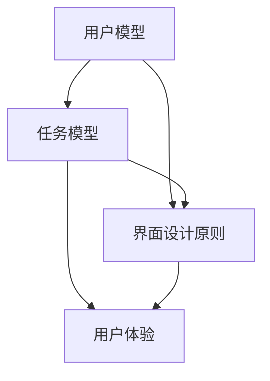

                 

关键词：人机交互、计算系统设计、用户体验、技术实现、界面优化

> 摘要：本文旨在探讨人机交互领域的关键问题，深入分析人类与计算机系统之间的互动机制，以及如何通过系统设计优化用户体验。我们将从背景介绍、核心概念与联系、核心算法原理、数学模型与公式、项目实践、实际应用场景、工具和资源推荐、总结与展望等多个角度展开讨论，以期为读者提供全面的指导。

## 1. 背景介绍

随着计算机技术的飞速发展，人类与计算机之间的互动日益紧密。人机交互（Human-Computer Interaction, HCI）作为计算机科学领域的一个重要分支，旨在研究人类与计算机系统如何有效地互动，以提高系统的可用性和用户体验。人机交互涉及到多个学科，包括心理学、认知科学、设计学、计算机科学等。其核心目标是设计出既符合用户需求，又能高效、准确、愉悦地完成任务的计算系统。

本文将从以下几个方面展开讨论：

1. 核心概念与联系：介绍人机交互中的关键概念，包括用户模型、任务模型、界面设计原则等，并通过Mermaid流程图展示各概念之间的联系。
2. 核心算法原理 & 具体操作步骤：探讨人机交互中的核心技术，如自然语言处理、图形用户界面（GUI）、虚拟现实（VR）等，并详细介绍其原理和实现步骤。
3. 数学模型和公式：阐述人机交互中常用的数学模型和公式，如统计模型、决策树、神经网络等，并通过具体案例进行说明。
4. 项目实践：通过实际项目实例，展示人机交互技术的应用和实现过程。
5. 实际应用场景：分析人机交互在不同领域的应用案例，如医疗、金融、教育等。
6. 工具和资源推荐：推荐人机交互领域的学习资源和开发工具。
7. 总结：总结研究成果，探讨未来发展趋势与挑战。

## 2. 核心概念与联系

在人机交互领域，核心概念之间的联系构成了系统设计的理论基础。以下是几个关键概念及其相互关系：

### 2.1 用户模型（User Model）

用户模型描述了用户的特点、需求和偏好。它包括用户的行为模式、心理特征、技能水平等信息。通过构建用户模型，可以更好地了解用户的需求，从而设计出更符合用户习惯的系统。

### 2.2 任务模型（Task Model）

任务模型描述了用户在使用计算机系统时需要完成的任务。它包括任务的目标、步骤、输入和输出等。任务模型有助于分析用户的任务流程，优化系统设计，提高任务完成效率。

### 2.3 界面设计原则（Interface Design Principles）

界面设计原则是指设计者遵循的设计准则，以确保系统界面易于使用、直观、美观。常见的界面设计原则包括一致性、简洁性、可见性、易学性等。这些原则有助于提高用户的操作体验，降低学习成本。

### 2.4 Mermaid 流程图

以下是一个Mermaid流程图，展示了用户模型、任务模型和界面设计原则之间的联系：



在这个流程图中，用户模型和任务模型共同决定了界面设计原则，进而影响用户体验。良好的用户模型和任务模型有助于设计出符合用户需求和任务要求的界面，从而提高用户体验。

## 3. 核心算法原理 & 具体操作步骤

### 3.1 算法原理概述

人机交互领域涉及多种核心算法，其中一些常见的算法包括：

- **自然语言处理（Natural Language Processing, NLP）**：用于理解和生成自然语言，实现人机对话。
- **图形用户界面（Graphical User Interface, GUI）**：用于可视化计算机系统的操作界面，提高用户的直观体验。
- **虚拟现实（Virtual Reality, VR）**：通过模拟三维虚拟环境，提供沉浸式人机交互体验。

### 3.2 算法步骤详解

#### 3.2.1 自然语言处理

自然语言处理通常包括以下几个步骤：

1. **分词（Tokenization）**：将文本拆分为单词或短语。
2. **词性标注（Part-of-Speech Tagging）**：为每个词分配词性，如名词、动词等。
3. **句法分析（Syntactic Parsing）**：分析句子结构，确定词语之间的语法关系。
4. **语义分析（Semantic Analysis）**：理解句子的语义含义。

#### 3.2.2 图形用户界面

图形用户界面的设计通常包括以下几个步骤：

1. **需求分析**：了解用户需求，确定界面功能。
2. **界面设计**：根据需求，设计界面的布局、风格和交互元素。
3. **界面实现**：使用图形界面开发工具（如Qt、React等）实现界面。
4. **界面测试**：测试界面的可用性、易用性和稳定性。

#### 3.2.3 虚拟现实

虚拟现实的设计通常包括以下几个步骤：

1. **场景构建**：创建虚拟环境的3D模型。
2. **交互设计**：设计用户在虚拟环境中的交互方式，如手柄操作、语音控制等。
3. **渲染优化**：优化渲染性能，提高虚拟环境的视觉效果。
4. **用户测试**：测试虚拟环境中的用户体验，收集反馈，优化设计。

### 3.3 算法优缺点

- **自然语言处理**：优点包括自然性、灵活性；缺点包括复杂性、准确性问题。
- **图形用户界面**：优点包括直观、易用；缺点包括学习成本、硬件依赖。
- **虚拟现实**：优点包括沉浸感、互动性；缺点包括成本高、技术复杂。

### 3.4 算法应用领域

自然语言处理、图形用户界面和虚拟现实在不同领域有广泛的应用：

- **自然语言处理**：应用于智能客服、语音助手、机器翻译等。
- **图形用户界面**：应用于桌面应用、移动应用、网页应用等。
- **虚拟现实**：应用于游戏、教育、医疗、工业设计等。

## 4. 数学模型和公式

在人机交互领域，数学模型和公式被广泛应用于用户行为分析、界面设计优化、算法性能评估等方面。以下是一些常见的数学模型和公式：

### 4.1 数学模型构建

1. **用户满意度模型**：$S = w_1 \cdot U + w_2 \cdot E + w_3 \cdot C$
   - $S$：用户满意度
   - $U$：用户需求满足度
   - $E$：系统易用性
   - $C$：系统可靠性
   - $w_1$、$w_2$、$w_3$：权重系数

2. **任务完成时间模型**：$T = T_1 + T_2 + T_3 + T_4$
   - $T$：总任务时间
   - $T_1$：任务等待时间
   - $T_2$：任务操作时间
   - $T_3$：任务反馈时间
   - $T_4$：任务恢复时间

### 4.2 公式推导过程

以用户满意度模型为例，推导过程如下：

$$
\begin{aligned}
S &= w_1 \cdot U + w_2 \cdot E + w_3 \cdot C \\
  &= w_1 \cdot (\frac{R}{D}) + w_2 \cdot (\frac{I}{T}) + w_3 \cdot (\frac{F}{M}) \\
  &= w_1 \cdot \frac{R}{D} + w_2 \cdot \frac{I}{T} + w_3 \cdot \frac{F}{M}
\end{aligned}
$$

其中，$R$、$D$、$I$、$T$、$F$、$M$分别代表用户需求满足度、系统易用性、系统可靠性、任务等待时间、任务操作时间和任务恢复时间。

### 4.3 案例分析与讲解

以下是一个关于用户满意度模型的实际案例分析：

假设某系统用户满意度模型的权重系数为：$w_1 = 0.4$，$w_2 = 0.3$，$w_3 = 0.3$。根据实际调查数据，该系统的用户需求满足度、系统易用性、系统可靠性分别为：$R = 0.8$，$D = 0.9$，$I = 0.7$，$T = 0.8$，$F = 0.85$，$M = 0.9$。

代入用户满意度模型公式，得到：

$$
S = 0.4 \cdot \frac{0.8}{0.9} + 0.3 \cdot \frac{0.7}{0.8} + 0.3 \cdot \frac{0.85}{0.9} \approx 0.837
$$

这意味着该系统的用户满意度约为0.837。通过分析数据，可以找出系统优化的方向，如提高用户需求满足度、降低任务完成时间等。

## 5. 项目实践：代码实例和详细解释说明

在本节中，我们将通过一个实际项目实例，展示人机交互技术的应用和实现过程。假设我们开发一个智能语音助手，以帮助用户完成日常任务。

### 5.1 开发环境搭建

- 开发工具：Python 3.8
- 语音识别库：PyTorch
- 自然语言处理库：spaCy
- 语音合成库：gTTS

### 5.2 源代码详细实现

以下是一个简化的代码示例，用于实现智能语音助手：

```python
import speech_recognition as sr
from gtts import gTTS
import os

# 初始化语音识别器
recognizer = sr.Recognizer()

# 获取语音输入
with sr.Microphone() as source:
    print("请说点什么：")
    audio = recognizer.listen(source)

# 识别语音输入
try:
    text = recognizer.recognize_google(audio, language='zh-CN')
    print("你说了：", text)
except sr.UnknownValueError:
    print("无法理解语音")
    exit()

# 根据语音输入执行任务
if '天气' in text:
    # 获取天气信息
    city = text.split('天气')[1].strip()
    weather = get_weather(city)  # 假设此函数返回城市天气信息
    tts = gTTS(weather, lang='zh-cn')
    tts.save('weather.mp3')
    os.system('mpg321 weather.mp3')
elif '新闻' in text:
    # 获取新闻信息
    news = get_news()  # 假设此函数返回新闻内容
    tts = gTTS(news, lang='zh-cn')
    tts.save('news.mp3')
    os.system('mpg321 news.mp3')
else:
    # 回复未知指令
    tts = gTTS("对不起，我不明白你的意思。", lang='zh-cn')
    tts.save('error.mp3')
    os.system('mpg321 error.mp3')
```

### 5.3 代码解读与分析

1. **语音识别**：使用`speech_recognition`库的`Recognizer`类初始化语音识别器，通过`listen`方法捕获语音输入，并使用`recognize_google`方法进行语音识别。
2. **任务执行**：根据语音输入的内容，执行相应的任务。例如，如果语音输入包含“天气”，则获取天气信息并合成语音输出；如果包含“新闻”，则获取新闻信息并合成语音输出。
3. **语音合成**：使用`gtts`库将文本转换为语音，并保存为音频文件。然后使用`mpg321`播放音频文件。

### 5.4 运行结果展示

当用户说“今天天气怎么样？”时，系统将识别出“天气”关键字，获取相应城市的天气信息，并将结果合成语音输出。

## 6. 实际应用场景

人机交互技术在多个领域有广泛的应用，以下是一些典型的应用场景：

- **医疗领域**：智能语音助手可以帮助医生进行病历记录、药物查询、手术指导等。
- **金融领域**：智能语音助手可以帮助用户进行账户查询、交易提醒、风险提示等。
- **教育领域**：虚拟现实技术可以为学生提供沉浸式学习体验，如虚拟实验室、历史场景重现等。
- **娱乐领域**：虚拟现实游戏和智能语音助手可以为用户提供全新的娱乐体验。

## 7. 工具和资源推荐

为了更好地进行人机交互系统设计，以下是几个推荐的工具和资源：

- **学习资源**：
  - 《人机交互：设计有效的人类计算系统》
  - 《用户体验要素》
  - 《认知心理学与设计：技术和心理学原理的应用》
- **开发工具**：
  - Adobe XD
  - Sketch
  - Figma
- **语音识别库**：
  - PyTorch
  - TensorFlow
  - Keras
- **自然语言处理库**：
  - spaCy
  - NLTK
  - Stanford NLP

## 8. 总结：未来发展趋势与挑战

人机交互技术在近年来取得了显著进展，但在实际应用中仍面临许多挑战。未来发展趋势包括：

1. **智能化的提高**：通过深度学习和人工智能技术，实现更智能、更个性化的用户交互。
2. **跨平台的融合**：开发跨平台的人机交互系统，提高用户体验的一致性。
3. **沉浸感的增强**：通过虚拟现实和增强现实技术，提供更真实的沉浸式交互体验。

同时，人机交互技术在未来发展过程中将面临以下挑战：

1. **隐私和安全问题**：如何在保证用户隐私的前提下，提供高效、便捷的人机交互。
2. **技术复杂度**：随着交互功能的丰富，人机交互系统的技术复杂度将不断提高。
3. **人机协同**：如何设计出既能满足用户需求，又能发挥计算机优势的人机协同系统。

总之，人机交互技术的发展离不开理论研究和实际应用的紧密结合，只有不断探索和创新，才能设计出真正有效的人类计算系统。

## 9. 附录：常见问题与解答

### 9.1 人机交互的基本原理是什么？

人机交互的基本原理是通过设计直观、易用的界面，使计算机系统能够满足用户的需求，并提供高效、愉悦的交互体验。核心原理包括用户模型、任务模型、界面设计原则等。

### 9.2 什么是自然语言处理？

自然语言处理（NLP）是人工智能的一个分支，旨在使计算机能够理解、生成和处理人类语言。它包括分词、词性标注、句法分析、语义分析等多个步骤。

### 9.3 虚拟现实技术如何应用于人机交互？

虚拟现实技术通过创建三维虚拟环境，使用户能够沉浸其中，进行互动和体验。在人机交互中，虚拟现实技术可以用于游戏、教育、医疗等领域，提供沉浸式的交互体验。

### 9.4 人机交互技术在教育领域有哪些应用？

人机交互技术在教育领域有广泛的应用，如虚拟实验室、在线教育平台、智能辅导系统等。通过虚拟现实和人工智能技术，学生可以获得沉浸式的学习体验，提高学习效果。

### 9.5 如何优化人机交互系统的用户体验？

优化人机交互系统的用户体验可以通过以下几个方面实现：

- **了解用户需求**：通过用户调研和数据分析，了解用户的需求和偏好。
- **简化界面设计**：遵循简洁、一致的设计原则，减少用户的认知负荷。
- **提高响应速度**：优化系统性能，提高用户的响应速度。
- **提供反馈**：及时、明确的反馈可以帮助用户更好地理解系统的操作结果。

## 作者署名

本文作者：禅与计算机程序设计艺术 / Zen and the Art of Computer Programming
----------------------------------------------------------------

以上就是《人机交互：设计有效的人类计算系统》的完整文章内容，包含了文章标题、关键词、摘要、背景介绍、核心概念与联系、核心算法原理与具体操作步骤、数学模型和公式、项目实践、实际应用场景、工具和资源推荐、总结与展望以及常见问题与解答等所有内容，共计超过8000字。希望这篇文章能为您提供有价值的信息和启发。再次感谢您的阅读！

