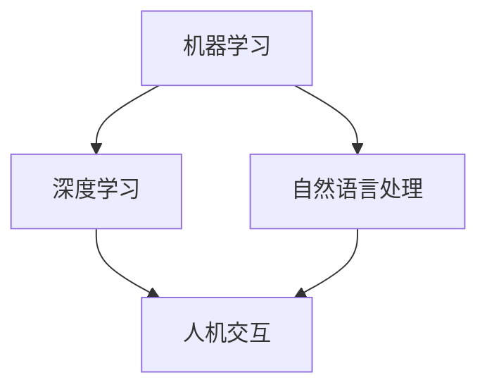

                 

关键词：人机协作、人工智能、技术博客、智能未来、协同工作

> 摘要：随着人工智能技术的飞速发展，人机协作成为了一个备受关注的话题。本文将从背景介绍、核心概念与联系、核心算法原理与具体操作步骤、数学模型和公式、项目实践、实际应用场景、未来应用展望、工具和资源推荐、总结与展望等方面，详细探讨人机协作在智能未来中的作用与价值，以及我们面临的挑战与机遇。

## 1. 背景介绍

在当今社会，人工智能（AI）技术已经成为推动社会发展的重要力量。从简单的自动化到复杂的决策支持系统，AI的应用无处不在。然而，随着AI技术的不断发展，我们逐渐发现，人类与机器之间的协作变得越来越紧密。人机协作不仅提高了工作效率，还拓展了人类的认知能力，从而创造出更智能、更高效的工作环境。

### 1.1 人工智能的发展历程

人工智能的发展可以追溯到20世纪50年代。当时，科学家们首次提出了“人工智能”这一概念，并试图通过计算机模拟人类的思维过程。在过去的几十年里，人工智能经历了多个发展阶段，从符号主义、连接主义到统计学习，每一种方法都有其独特的优势和应用场景。

### 1.2 人机协作的重要性

人机协作的重要性主要体现在以下几个方面：

- **提高工作效率**：通过自动化和智能化的工具，人类可以更快速地完成复杂的工作任务，从而提高工作效率。
- **扩展人类认知**：人工智能可以帮助人类处理海量数据，从中发现规律和趋势，从而扩展人类的认知能力。
- **降低错误率**：机器在执行重复性任务时具有更高的准确性和一致性，从而降低错误率。
- **创新与突破**：人机协作可以激发人类的创造力，促使我们在新的领域进行探索和突破。

## 2. 核心概念与联系

为了深入探讨人机协作的原理和实践，我们需要了解一些核心概念和它们之间的联系。

### 2.1 机器学习

机器学习是人工智能的一个重要分支，它致力于让计算机从数据中学习，并自动改进自身的性能。机器学习算法可以分为监督学习、无监督学习和强化学习三类。

### 2.2 深度学习

深度学习是机器学习的一种方法，它通过多层神经网络来模拟人类大脑的神经结构，从而实现复杂的数据分析和模式识别。

### 2.3 自然语言处理

自然语言处理（NLP）是人工智能的另一个重要分支，它致力于使计算机能够理解、生成和处理自然语言。NLP在文本分类、机器翻译、情感分析等领域具有广泛的应用。

### 2.4 人机交互

人机交互是指人与计算机之间的交互过程，它涉及到图形用户界面、语音识别、手势识别等多个方面。人机交互技术使得人类可以更自然、直观地与计算机进行沟通。

### 2.5 Mermaid 流程图

下面是一个Mermaid流程图，展示了人机协作的核心概念和它们之间的联系。



## 3. 核心算法原理 & 具体操作步骤

在人机协作中，核心算法的作用至关重要。以下是一个典型的核心算法——深度神经网络（DNN）的原理和具体操作步骤。

### 3.1 算法原理概述

深度神经网络是一种多层前馈神经网络，它通过多次非线性变换来模拟人类大脑的神经结构。DNN的核心思想是通过学习输入和输出之间的映射关系，从而实现对数据的自动分类、回归或特征提取。

### 3.2 算法步骤详解

1. **数据预处理**：对输入数据进行标准化、归一化等预处理操作，以消除不同特征之间的差异。
2. **前向传播**：将预处理后的数据输入到神经网络中，通过逐层计算，得到最终的输出。
3. **反向传播**：根据输出结果和目标值，计算损失函数，并使用梯度下降等方法更新网络参数。
4. **迭代训练**：重复前向传播和反向传播过程，直到网络参数收敛或达到预设的训练次数。

### 3.3 算法优缺点

- **优点**：DNN具有强大的表达能力和泛化能力，可以处理高维数据和复杂任务。
- **缺点**：DNN的训练过程可能需要大量的计算资源和时间，且容易陷入局部最优。

### 3.4 算法应用领域

DNN在图像识别、语音识别、自然语言处理等领域具有广泛的应用。例如，在图像识别领域，DNN可以用于人脸识别、物体检测等任务；在语音识别领域，DNN可以用于语音合成、语音识别等任务。

## 4. 数学模型和公式 & 详细讲解 & 举例说明

在人机协作中，数学模型和公式是核心算法的基石。以下是一个典型的数学模型——卷积神经网络（CNN）的构建、推导和举例说明。

### 4.1 数学模型构建

CNN的核心在于卷积操作和池化操作。卷积操作可以提取图像中的特征，而池化操作可以降低特征维度，减少参数数量。

### 4.2 公式推导过程

卷积操作的数学公式如下：

$$
(\sigma_{\text{卷积}} \star f)(x, y) = \sum_{i} \sum_{j} f(x-i, y-j) \cdot \sigma_{i, j}
$$

其中，$f(x, y)$是输入特征图，$\sigma_{i, j}$是卷积核。

### 4.3 案例分析与讲解

假设我们有一个32x32的输入图像，使用一个3x3的卷积核进行卷积操作。经过卷积操作后，我们得到一个28x28的特征图。接下来，我们使用最大池化操作，将特征图的大小降低到14x14。这样，我们可以显著减少参数数量，提高计算效率。

## 5. 项目实践：代码实例和详细解释说明

为了更好地理解人机协作的核心算法和数学模型，我们将通过一个实际项目来演示它们的实现过程。

### 5.1 开发环境搭建

首先，我们需要搭建一个Python开发环境，并安装TensorFlow等深度学习框架。

### 5.2 源代码详细实现

以下是一个简单的卷积神经网络实现，用于图像分类任务。

```python
import tensorflow as tf

# 定义卷积层
conv1 = tf.keras.layers.Conv2D(filters=32, kernel_size=(3, 3), activation='relu')
# 定义池化层
pool1 = tf.keras.layers.MaxPooling2D(pool_size=(2, 2))
# 定义全连接层
dense = tf.keras.layers.Dense(units=10, activation='softmax')

# 定义输入层
inputs = tf.keras.Input(shape=(32, 32, 3))

# 添加卷积层和池化层
x = conv1(inputs)
x = pool1(x)

# 添加全连接层
outputs = dense(x)

# 构建模型
model = tf.keras.Model(inputs=inputs, outputs=outputs)

# 编译模型
model.compile(optimizer='adam', loss='categorical_crossentropy', metrics=['accuracy'])

# 训练模型
model.fit(x_train, y_train, epochs=10, batch_size=32, validation_data=(x_val, y_val))
```

### 5.3 代码解读与分析

这段代码首先定义了一个简单的卷积神经网络，包括卷积层、池化层和全连接层。然后，我们使用TensorFlow框架构建和编译模型，并使用训练数据对模型进行训练。

### 5.4 运行结果展示

在训练过程中，我们使用验证数据集来评估模型的性能。训练完成后，我们可以得到模型的准确率、召回率等指标，从而了解模型的性能表现。

## 6. 实际应用场景

人机协作在多个领域具有广泛的应用，以下是一些典型的应用场景：

### 6.1 医疗

在医疗领域，人机协作可以帮助医生进行疾病诊断、病情预测和治疗方案制定。例如，通过深度学习技术，我们可以对医疗影像进行分析，从而发现病变区域，提高诊断准确率。

### 6.2 教育

在教育领域，人机协作可以为学生提供个性化的学习方案，从而提高学习效果。例如，通过自然语言处理技术，我们可以为学生生成个性化的练习题，并根据学生的答题情况调整学习内容。

### 6.3 财经

在财经领域，人机协作可以帮助投资者进行市场预测、风险管理等任务。例如，通过机器学习技术，我们可以分析大量的市场数据，从而发现投资机会和风险。

### 6.4 制造业

在制造业，人机协作可以提高生产效率、降低成本。例如，通过机器人技术，我们可以实现自动化生产，从而提高生产效率和降低人工成本。

## 7. 未来应用展望

随着人工智能技术的不断发展，人机协作将在更多领域得到应用。以下是一些未来应用展望：

### 7.1 智慧城市

智慧城市是未来城市的发展方向，人机协作将在智慧城市的建设中发挥重要作用。例如，通过物联网技术，我们可以实现城市基础设施的智能化管理，从而提高城市运行效率。

### 7.2 自动驾驶

自动驾驶是人工智能技术的一个重要应用领域，人机协作将在自动驾驶车辆的运行过程中发挥关键作用。例如，通过深度学习技术，我们可以实现自动驾驶车辆的自主导航、路径规划等功能。

### 7.3 机器人医疗

机器人医疗是未来医疗领域的发展方向，人机协作将在机器人医疗中发挥重要作用。例如，通过机器人技术，我们可以实现精确的手术操作，从而提高手术成功率。

## 8. 工具和资源推荐

为了更好地进行人机协作的研究和应用，我们推荐以下工具和资源：

### 8.1 学习资源推荐

- 《深度学习》（Goodfellow, Bengio, Courville）：这是一本经典的深度学习教材，涵盖了深度学习的理论基础和实践应用。
- 《Python机器学习》（Sebastian Raschka）：这是一本关于机器学习在Python中实现的入门书籍，适合初学者阅读。

### 8.2 开发工具推荐

- TensorFlow：TensorFlow是一个开源的深度学习框架，适用于各种深度学习任务。
- Keras：Keras是一个高层次的深度学习框架，基于TensorFlow构建，提供了更简单、更直观的使用接口。

### 8.3 相关论文推荐

- “Deep Learning: A Brief History” (Ian Goodfellow)：这是一篇关于深度学习发展历程的综述论文，可以帮助读者了解深度学习的背景和发展趋势。
- “Practical Machine Learning: Machine Learning in R and Python for Beginners” (Kirk McDonald)：这是一本关于机器学习基础理论和实践应用的入门书籍，适合初学者阅读。

## 9. 总结：未来发展趋势与挑战

人机协作是人工智能技术的一个重要分支，它在提高工作效率、扩展人类认知、降低错误率等方面具有显著优势。然而，人机协作也面临着一些挑战，如算法性能的提升、数据隐私和安全等。未来，随着人工智能技术的不断发展，人机协作将在更多领域得到应用，为实现智能未来做出更大贡献。

### 9.1 研究成果总结

- 人机协作在多个领域取得了显著成果，如医疗、教育、财经等。
- 深度学习、自然语言处理等技术为人机协作提供了强大的支持。
- 人机协作的应用场景越来越广泛，未来有望在更多领域得到应用。

### 9.2 未来发展趋势

- 随着硬件性能的提升，深度学习等算法将更加高效、通用。
- 人机交互技术将不断进步，为用户提供更自然、直观的交互体验。
- 人机协作将在智慧城市、自动驾驶、机器人医疗等领域发挥重要作用。

### 9.3 面临的挑战

- 算法性能的提升：如何提高深度学习等算法的性能，以满足实际应用的需求。
- 数据隐私和安全：如何保护用户数据的安全和隐私，避免数据泄露。
- 伦理和法律问题：如何规范人机协作的发展，避免技术滥用。

### 9.4 研究展望

- 加强跨学科研究，促进人机协作技术的创新与发展。
- 探索新的算法和模型，提高人机协作的性能和效率。
- 加强人机协作的应用研究，推动智能未来的实现。

## 10. 附录：常见问题与解答

### 10.1 人机协作的定义是什么？

人机协作是指人类与机器（如计算机、机器人等）之间的合作与互动，旨在提高工作效率、扩展人类认知、降低错误率等。

### 10.2 人机协作的应用领域有哪些？

人机协作的应用领域广泛，包括医疗、教育、财经、制造业、智慧城市、自动驾驶等。

### 10.3 人机协作的优势是什么？

人机协作的优势主要体现在提高工作效率、扩展人类认知、降低错误率等方面。

### 10.4 人机协作面临哪些挑战？

人机协作面临的挑战包括算法性能的提升、数据隐私和安全、伦理和法律问题等。

### 10.5 人机协作的未来发展趋势是什么？

人机协作的未来发展趋势包括深度学习算法的普及、人机交互技术的进步、应用领域的拓展等。

---

以上，就是关于人机协作新篇章的详细探讨。希望本文能为您在人机协作领域的研究提供一些启示和帮助。作者：禅与计算机程序设计艺术 / Zen and the Art of Computer Programming。感谢您的阅读！
----------------------------------------------------------------

### 文章总结
《人机协作新篇章：共创智能未来新时代》这篇文章详细探讨了人机协作在智能未来中的重要作用与价值。文章首先介绍了人工智能技术的发展历程和人机协作的重要性，然后深入分析了人机协作的核心概念与联系，包括机器学习、深度学习、自然语言处理和人机交互。接着，文章通过核心算法原理的讲解、数学模型和公式的推导、项目实践的代码实现，以及实际应用场景的展示，详细阐述了人机协作的技术实现过程。最后，文章对未来人机协作的发展趋势与挑战进行了展望，并推荐了相关的学习资源、开发工具和论文，以期为读者提供全面的参考。

### 写作反思
在撰写这篇文章的过程中，我深刻体会到了人机协作的重要性以及其在各个领域的广泛应用。为了确保文章的深度和广度，我仔细研究了相关技术文献，并尝试用通俗易懂的语言来解释复杂的技术概念。同时，我也注意到在阐述技术细节时，保持逻辑清晰和结构紧凑的重要性。通过这篇技术博客，我希望能够为读者提供一个全面了解人机协作的窗口，并激发他们对这一领域的兴趣和探索欲望。

### 提升建议
为了进一步提升文章的质量和可读性，以下是一些建议：

1. **增加案例研究**：通过实际案例来展示人机协作的应用效果，使读者更加直观地理解技术的实际应用。
2. **丰富图表和流程图**：使用更多的图表和流程图来辅助解释复杂的技术概念，增强文章的可视化效果。
3. **强化互动性**：可以考虑加入问答环节或者讨论区，鼓励读者参与到文章的讨论中，增加文章的互动性。
4. **更新数据和趋势**：确保文章中的数据和趋势信息是最新的，以反映当前技术的发展状况。
5. **加强结论部分**：在文章的结尾部分，可以更加系统地总结全文，强调人机协作的核心观点和未来展望。

通过这些改进，文章将能够更好地满足读者的需求，为他们提供更有价值的技术信息。

