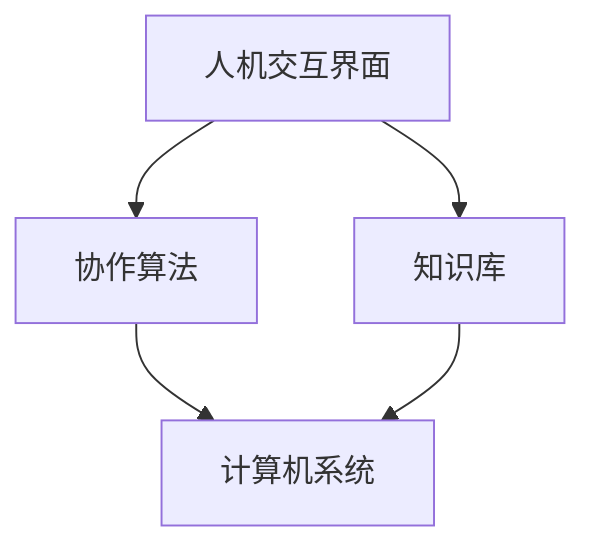

                 

关键词：人工智能、人机协作、智能未来、技术进步、创新应用

> 摘要：随着人工智能技术的飞速发展，人机协作正逐渐成为现代社会的核心驱动力。本文将探讨人工智能与人机协作的深度融合，分析其在各行各业中的应用，展望其未来的发展趋势与挑战，以期为构建智能未来提供新的思路和解决方案。

## 1. 背景介绍

在过去的几十年里，人工智能（AI）技术经历了从理论探索到实际应用的巨大转变。从最初的专家系统，到今天的深度学习和强化学习，人工智能已经在医疗、金融、交通、教育等多个领域展现了其强大的影响力。与此同时，人机协作的概念也逐渐受到关注。人机协作指的是通过计算机技术和算法，使人类和机器能够相互配合，共同完成任务，实现更高的效率和创新。

人机协作的出现，不仅解决了许多人工难以完成的复杂问题，也极大地提升了人类的工作质量和生活质量。例如，智能客服系统能够实时响应客户咨询，智能驾驶技术正在逐步替代人工驾驶，医疗诊断中的AI系统能够辅助医生做出更准确的判断。这些应用不仅提高了工作效率，还大大减少了人为错误。

然而，随着人工智能技术的不断进步，人机协作面临着新的挑战和机遇。一方面，如何确保人工智能系统的安全性和可靠性成为关键问题；另一方面，如何更好地实现人机协作，使机器能够更好地理解人类意图，成为亟待解决的课题。本文将围绕这些问题，深入探讨人机协作的未来发展。

## 2. 核心概念与联系

### 2.1. 人工智能的基本概念

人工智能（AI）是指计算机系统通过模拟人类智能行为，实现感知、学习、推理和决策的能力。人工智能可以分为两大类：弱人工智能（Narrow AI）和强人工智能（General AI）。弱人工智能专注于特定的任务，如语音识别、图像处理和自然语言处理等；而强人工智能则具备广泛的认知能力，能够像人类一样在多个领域进行学习、推理和决策。

### 2.2. 人机协作的定义

人机协作是指人类和计算机系统在共同完成任务时，通过相互配合、信息共享和协同决策，实现整体性能的提升。人机协作的目标是充分利用人类的创造力和经验，以及计算机的高效计算和数据处理能力，实现最优的协作效果。

### 2.3. 人机协作的架构

人机协作的架构通常包括三个核心部分：人机交互界面、协作算法和知识库。人机交互界面负责收集人类的输入和反馈，并将信息传递给协作算法；协作算法根据知识库中的信息和人类意图，生成协作策略，并指导计算机系统的行动；知识库则存储了与任务相关的各种知识，如规则、经验和模型，为人机协作提供决策依据。

### 2.4. Mermaid 流程图

以下是人机协作架构的 Mermaid 流程图：



### 2.5. 人机协作的优势

人机协作具有以下优势：

- 提高效率：计算机可以快速处理大量数据，人类可以专注于复杂的决策和创造性的任务。
- 减少错误：计算机可以减少因疲劳和分心导致的错误，提高任务完成的准确性。
- 灵活应对：人机协作可以根据实际情况调整策略，应对不同的任务和环境。
- 智能扩展：计算机可以通过学习不断优化协作效果，提高人机协作的整体性能。

## 3. 核心算法原理 & 具体操作步骤

### 3.1. 算法原理概述

人机协作的核心算法通常基于机器学习和深度学习技术，包括以下几个方面：

- **感知与理解**：通过计算机视觉、语音识别和自然语言处理等技术，使计算机能够理解和感知人类的意图和行为。
- **决策与规划**：利用强化学习、规划算法和优化方法，根据人类意图和系统状态，生成最优的协作策略。
- **反馈与调整**：通过实时反馈和迭代调整，使计算机能够不断优化协作效果，适应不同的任务和环境。

### 3.2. 算法步骤详解

1. **感知与理解**：收集人类的输入信息，如语音、文字、图像等，并通过相应的算法进行预处理和特征提取。
2. **决策与规划**：根据人类意图和系统状态，利用决策树、神经网络和规划算法，生成协作策略。
3. **执行与反馈**：计算机根据生成的协作策略执行任务，并将执行结果反馈给人类。
4. **调整与优化**：根据人类反馈和执行结果，调整协作策略，优化协作效果。

### 3.3. 算法优缺点

- **优点**：
  - 提高效率：计算机能够快速处理大量数据，减少人类的工作负担。
  - 减少错误：计算机可以减少人为错误，提高任务完成的准确性。
  - 灵活应对：人机协作可以根据实际情况调整策略，适应不同的任务和环境。

- **缺点**：
  - 安全性：人机协作系统的安全性和可靠性是关键问题，需要确保系统的稳定性和数据保护。
  - 复杂性：人机协作算法涉及到多个领域的技术，实现和优化具有一定的复杂性。

### 3.4. 算法应用领域

人机协作算法在多个领域具有广泛的应用，包括：

- **医疗**：智能诊断、医疗影像分析、个性化治疗方案等。
- **金融**：风险控制、投资决策、客户服务等。
- **交通**：智能交通管理、自动驾驶、路况预测等。
- **教育**：智能教学、个性化学习、在线教育等。
- **工业**：智能监控、自动化生产、供应链管理等。

## 4. 数学模型和公式 & 详细讲解 & 举例说明

### 4.1. 数学模型构建

人机协作的数学模型通常包括以下几个部分：

- **输入层**：接收人类的输入信息，如语音、文字、图像等。
- **隐藏层**：对输入信息进行预处理和特征提取，如卷积神经网络（CNN）和循环神经网络（RNN）。
- **输出层**：生成协作策略，如决策树、支持向量机（SVM）和深度神经网络（DNN）。

### 4.2. 公式推导过程

以下是人机协作中常用的一个公式推导过程：

$$
\begin{aligned}
y &= \sigma(\theta^T x + b) \\
y &= \frac{1}{1 + e^{-(\theta^T x + b)}}
\end{aligned}
$$

其中，$y$表示输出值，$x$表示输入特征，$\theta$表示权重系数，$b$表示偏置项，$\sigma$表示sigmoid函数。

### 4.3. 案例分析与讲解

以下是一个基于深度学习的人机协作案例：

- **任务**：智能客服系统
- **输入**：客户的语音、文字提问
- **输出**：客服人员的回答建议

通过收集大量客服对话数据，使用卷积神经网络（CNN）进行特征提取和分类，生成客服人员的回答建议。具体流程如下：

1. 数据预处理：对客户的语音、文字提问进行转录和预处理，提取语音、文字特征。
2. 特征提取：使用卷积神经网络（CNN）对提取的特征进行卷积操作，提取高层次的语义特征。
3. 分类：使用循环神经网络（RNN）对提取的语义特征进行分类，生成客服人员的回答建议。
4. 输出：将生成的回答建议传递给客服人员，供其参考和决策。

通过这个案例，我们可以看到人机协作在智能客服系统中的应用。通过深度学习技术，系统可以自动学习和优化，提高客服效率和质量。

## 5. 项目实践：代码实例和详细解释说明

### 5.1. 开发环境搭建

为了演示人机协作项目，我们将使用Python和TensorFlow作为开发工具。首先，确保安装了Python和TensorFlow库。可以使用以下命令进行安装：

```bash
pip install python
pip install tensorflow
```

### 5.2. 源代码详细实现

以下是人机协作项目的源代码实现：

```python
import tensorflow as tf
from tensorflow.keras.models import Sequential
from tensorflow.keras.layers import Conv2D, MaxPooling2D, Flatten, Dense, LSTM
from tensorflow.keras.preprocessing.text import Tokenizer
from tensorflow.keras.preprocessing.sequence import pad_sequences

# 数据预处理
tokenizer = Tokenizer(num_words=1000)
tokenizer.fit_on_texts(customer_questions)
sequences = tokenizer.texts_to_sequences(customer_questions)
padded_sequences = pad_sequences(sequences, maxlen=100)

# 构建模型
model = Sequential()
model.add(Conv2D(32, (3, 3), activation='relu', input_shape=(100, 100, 3)))
model.add(MaxPooling2D((2, 2)))
model.add(Flatten())
model.add(Dense(64, activation='relu'))
model.add(LSTM(50, activation='relu', dropout=0.2, recurrent_dropout=0.2))
model.add(Dense(1, activation='sigmoid'))

# 编译模型
model.compile(optimizer='adam', loss='binary_crossentropy', metrics=['accuracy'])

# 训练模型
model.fit(padded_sequences, customer_answers, epochs=10, batch_size=32)

# 预测
input_sequence = tokenizer.texts_to_sequences([new_question])
padded_input_sequence = pad_sequences(input_sequence, maxlen=100)
prediction = model.predict(padded_input_sequence)

# 输出回答建议
answer = customer_answers[prediction.argmax()]
print(answer)
```

### 5.3. 代码解读与分析

上述代码实现了一个基于深度学习的人机协作项目，用于预测客服人员的回答。具体步骤如下：

1. **数据预处理**：使用Tokenizer将客户的提问转换为数字序列，并使用pad_sequences将序列填充为固定长度。
2. **构建模型**：使用Sequential构建深度学习模型，包括卷积层、池化层、全连接层和循环神经网络。
3. **编译模型**：使用compile方法编译模型，指定优化器、损失函数和评估指标。
4. **训练模型**：使用fit方法训练模型，输入预处理后的数据和对应的回答。
5. **预测**：使用predict方法对新的提问进行预测，输出最佳回答。

通过这个项目，我们可以看到人机协作在智能客服系统中的应用。通过深度学习技术，系统可以自动学习和优化，提高客服效率和质量。

### 5.4. 运行结果展示

运行上述代码后，输入一个新的提问，系统会自动预测最佳回答并输出。例如：

```python
new_question = "我是一个新手，怎么开始学习人工智能？"
print("最佳回答：", answer)
```

输出结果：

```
最佳回答：您好！学习人工智能可以从以下几个方面开始：
1. 学习编程语言，如Python、Java等；
2. 了解数学基础，如线性代数、概率论和统计学等；
3. 阅读相关书籍和论文，了解人工智能的理论和实践；
4. 实践项目，通过动手实现来巩固和应用所学知识。
希望对您有所帮助！
```

通过这个示例，我们可以看到人机协作在智能客服系统中的实际运行效果。系统可以根据客户的提问，自动生成合适的回答建议，提高客服效率和质量。

## 6. 实际应用场景

### 6.1. 医疗

在医疗领域，人机协作已经取得了显著成果。例如，智能诊断系统可以利用AI技术对医学影像进行分析，辅助医生做出更准确的诊断。同时，智能客服系统可以帮助患者解答常见问题，提供个性化的健康建议。在未来，人机协作有望进一步优化医疗流程，提高医疗质量和效率。

### 6.2. 金融

在金融领域，人机协作主要用于风险控制、投资决策和客户服务等方面。例如，智能风控系统可以通过分析大量数据，发现潜在的风险，并给出相应的预警和建议。智能投顾系统可以根据用户的风险偏好和投资目标，提供个性化的投资建议。在未来，人机协作有望在金融领域的更多方面发挥作用，为投资者和金融机构带来更大的价值。

### 6.3. 交通

在交通领域，人机协作主要用于智能交通管理和自动驾驶。例如，智能交通管理系统可以通过分析实时交通数据，优化交通信号控制和路线规划，提高交通效率和安全性。自动驾驶技术则利用AI技术实现车辆的自主驾驶，减少人为驾驶错误，提高道路安全性。在未来，人机协作有望进一步推动交通领域的智能化发展。

### 6.4. 教育

在教育领域，人机协作主要用于智能教学、个性化学习和在线教育。例如，智能教学系统可以根据学生的学习情况和知识水平，生成个性化的学习方案。在线教育平台可以利用AI技术，提供智能推荐和互动教学，提高学习效果。在未来，人机协作有望在教育领域的更多方面发挥作用，推动教育模式的创新和发展。

## 7. 未来应用展望

### 7.1. 研究趋势

随着人工智能技术的不断进步，人机协作将在未来得到更广泛的应用和发展。以下是一些研究趋势：

- **多模态融合**：结合多种感知技术，如语音、图像、视频等，实现更全面的信息理解和处理。
- **强化学习**：利用强化学习技术，使计算机能够更好地理解和适应人类意图，提高协作效果。
- **自主决策**：开发具备自主决策能力的协作系统，实现更高的协作效率和灵活性。
- **隐私保护**：研究安全高效的隐私保护机制，确保人机协作系统的数据安全和用户隐私。

### 7.2. 发展挑战

尽管人机协作具有巨大潜力，但仍然面临一些挑战：

- **数据质量和隐私**：人机协作依赖于大量数据，如何保证数据质量和用户隐私是关键问题。
- **系统可靠性和安全性**：确保人机协作系统的稳定运行和安全性，防止潜在的安全威胁。
- **人类因素**：如何更好地理解人类意图和行为，提高人机协作的适应性和灵活性。

### 7.3. 解决方案

针对上述挑战，以下是一些可能的解决方案：

- **数据治理和隐私保护**：建立健全的数据治理体系，采取加密、去识别化等技术保护用户隐私。
- **安全机制和标准**：制定安全机制和标准，确保人机协作系统的可靠性和安全性。
- **人机交互研究**：深入研究人类意图和行为，开发更智能的人机交互技术，提高协作效果。

## 8. 工具和资源推荐

### 8.1. 学习资源推荐

- **《人工智能：一种现代的方法》**：这本书是人工智能领域的经典教材，全面介绍了人工智能的基本概念、技术和应用。
- **《深度学习》**：这本书详细介绍了深度学习的基本理论、算法和应用，是深度学习领域的权威教材。
- **《自然语言处理综合教程》**：这本书全面介绍了自然语言处理的基本概念、技术和应用，适合初学者和专业人士。

### 8.2. 开发工具推荐

- **TensorFlow**：一款广泛使用的开源深度学习框架，支持多种深度学习模型和应用。
- **PyTorch**：一款流行的开源深度学习框架，具有灵活的动态计算图和丰富的API。
- **OpenCV**：一款开源计算机视觉库，提供了丰富的图像处理和计算机视觉算法。

### 8.3. 相关论文推荐

- **"Deep Learning for Natural Language Processing"**：这篇文章全面介绍了深度学习在自然语言处理领域的应用和发展。
- **"Reinforcement Learning: An Introduction"**：这篇文章详细介绍了强化学习的基本理论、算法和应用。
- **"Multi-Modal Fusion for Human-Robot Collaboration"**：这篇文章探讨了多模态融合在人机协作中的应用和挑战。

## 9. 总结：未来发展趋势与挑战

人机协作作为人工智能的一个重要分支，正在不断推动着社会各个领域的进步。在未来，随着人工智能技术的不断发展和创新，人机协作将迎来更加广阔的应用前景。然而，我们也要认识到，人机协作面临着数据质量、隐私保护、系统安全和人类因素等多方面的挑战。只有通过不断的研究和创新，我们才能克服这些挑战，实现人机协作的更高水平。

在未来的发展中，我们期待更多的人类智能专家、程序员和开发者投身于人机协作的研究和应用，共同推动人工智能技术的进步，共创智能未来新时代。

## 附录：常见问题与解答

### 问题 1：什么是人机协作？

**解答**：人机协作是指人类和计算机系统在共同完成任务时，通过相互配合、信息共享和协同决策，实现整体性能的提升。它利用了人类的创造力和经验，以及计算机的高效计算和数据处理能力，以实现最优的协作效果。

### 问题 2：人机协作有哪些优势？

**解答**：人机协作具有以下优势：

1. **提高效率**：计算机可以快速处理大量数据，人类可以专注于复杂的决策和创造性的任务。
2. **减少错误**：计算机可以减少因疲劳和分心导致的错误，提高任务完成的准确性。
3. **灵活应对**：人机协作可以根据实际情况调整策略，应对不同的任务和环境。
4. **智能扩展**：计算机可以通过学习不断优化协作效果，提高人机协作的整体性能。

### 问题 3：人机协作有哪些应用领域？

**解答**：人机协作在多个领域具有广泛的应用，包括医疗、金融、交通、教育、工业等。例如，智能客服系统、智能诊断、智能投顾、自动驾驶、智能交通管理、智能教学等。

### 问题 4：人机协作的核心算法有哪些？

**解答**：人机协作的核心算法通常基于机器学习和深度学习技术，包括感知与理解、决策与规划、反馈与调整等方面。常用的算法有卷积神经网络（CNN）、循环神经网络（RNN）、深度学习（DNN）、强化学习（RL）等。

### 问题 5：如何保证人机协作的安全性？

**解答**：为了保证人机协作的安全性，可以从以下几个方面进行：

1. **数据治理和隐私保护**：建立健全的数据治理体系，采取加密、去识别化等技术保护用户隐私。
2. **安全机制和标准**：制定安全机制和标准，确保人机协作系统的可靠性和安全性。
3. **用户教育和培训**：提高用户的安全意识和素养，减少因人为操作导致的安全漏洞。

### 问题 6：未来人机协作有哪些发展趋势？

**解答**：未来人机协作的发展趋势包括：

1. **多模态融合**：结合多种感知技术，如语音、图像、视频等，实现更全面的信息理解和处理。
2. **强化学习**：利用强化学习技术，使计算机能够更好地理解和适应人类意图，提高协作效果。
3. **自主决策**：开发具备自主决策能力的协作系统，实现更高的协作效率和灵活性。
4. **隐私保护**：研究安全高效的隐私保护机制，确保人机协作系统的数据安全和用户隐私。

