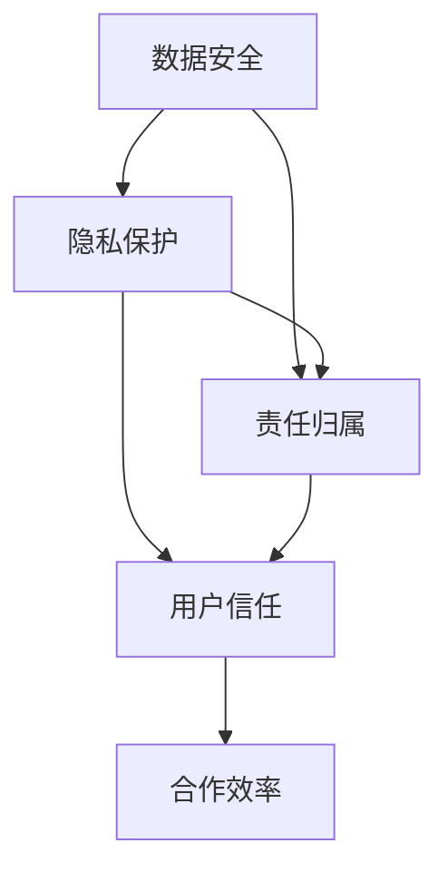

                 

 在当今这个信息化时代，人工智能（AI）技术正以前所未有的速度发展和普及。无论是自动驾驶、智能医疗、金融分析，还是智能家居，AI已经深刻地改变了我们的生活方式。随着AI技术的不断进步，人机协作也成为了研究和应用的热点领域。然而，这一快速发展的同时，我们也面临着诸多伦理和规范问题。本文旨在探讨人机协作中的伦理规范和准则，为这一领域的未来发展提供指导。

## 文章关键词

- 人工智能
- 人机协作
- 伦理规范
- 准则
- 数据安全
- 隐私保护
- 技术责任

## 文章摘要

本文从人机协作的背景出发，详细分析了当前在AI领域存在的伦理问题，包括数据安全、隐私保护和责任归属等。通过对核心概念的解释和实例展示，文章提出了构建人机协作伦理规范的框架，并探讨了未来的人机协作发展趋势及面临的挑战。文章最后提出了相应的工具和资源推荐，为读者提供了深入了解和研究人机协作伦理规范的途径。

## 1. 背景介绍

人机协作（Human-AI Collaboration）是指人类与人工智能系统共同完成任务的互动过程。这种协作不仅提高了工作效率，还丰富了人类的工作内容，使得许多复杂问题能够得到更迅速和精准的解决。随着AI技术的不断进步，人机协作已经不再仅仅是理论和实验室中的研究课题，而是逐渐走向了实际应用。

### 1.1 历史与发展

人机协作的历史可以追溯到上世纪60年代，当时计算机科学家艾伦·图灵提出了著名的“图灵测试”，旨在评估机器是否能表现出与人类相似的智能行为。随着人工智能技术的发展，特别是深度学习和大数据分析的兴起，人机协作得到了空前的重视和快速发展。

### 1.2 当前应用

在当前的实际应用中，人机协作已经涵盖了众多领域。例如，在医疗领域，AI辅助诊断系统能够帮助医生更快速和准确地诊断疾病；在金融领域，AI可以用于风险管理、投资分析和欺诈检测；在制造业，机器人与人类工人的协作能够实现高效的生产流程。

### 1.3 发展趋势

随着AI技术的不断进步，人机协作也将朝着更加智能化、自适应和人性化的方向发展。未来的协作系统将不仅仅是简单的工具辅助，而是能够理解人类意图、提供智能建议，并能够自主学习和改进。

## 2. 核心概念与联系

在人机协作中，有几个核心概念是不可或缺的，它们共同构成了人机协作的原理和架构。以下是这些核心概念的解释和它们之间的联系。

### 2.1 数据安全

数据安全是确保数据在传输和存储过程中不被未授权访问、篡改或泄露的重要措施。在人机协作中，数据安全尤为关键，因为涉及到的数据可能包括敏感的个人信息和重要业务数据。

### 2.2 隐私保护

隐私保护是指保护个人隐私不受侵犯的一系列措施。随着AI技术的应用越来越广泛，如何保护用户的隐私成为了亟待解决的问题。隐私保护不仅关系到用户的信任，也关系到AI系统的可靠性和合法性。

### 2.3 责任归属

在AI辅助决策或执行任务的过程中，如果出现了错误或事故，如何界定责任成为了伦理和法律上的重要问题。责任归属涉及到技术责任、法律责任和道德责任等多个方面。

### 2.4 Mermaid 流程图

以下是一个简化的Mermaid流程图，用于描述人机协作中的核心概念和它们的联系：



在上述流程图中，数据安全和隐私保护是保障用户信任的基础，而责任归属是维护用户信任的关键。合作效率则是人机协作的直接目标。

## 3. 核心算法原理 & 具体操作步骤

### 3.1 算法原理概述

人机协作的算法原理主要涉及机器学习、自然语言处理和协作系统设计等方面。其中，机器学习用于提高AI系统的自适应能力，自然语言处理用于实现人机交互，协作系统设计则用于构建高效的人机协作框架。

### 3.2 算法步骤详解

#### 3.2.1 机器学习

机器学习是人机协作的核心技术之一。以下是机器学习的步骤概述：

1. **数据收集**：收集用于训练和测试的数据集。
2. **数据预处理**：对数据进行清洗、归一化和特征提取。
3. **模型选择**：根据任务需求选择合适的机器学习模型。
4. **模型训练**：使用训练数据对模型进行训练。
5. **模型评估**：使用测试数据评估模型性能。
6. **模型优化**：根据评估结果对模型进行优化。

#### 3.2.2 自然语言处理

自然语言处理（NLP）是实现人机交互的重要技术。以下是NLP的基本步骤：

1. **分词**：将文本拆分为单词或短语。
2. **词性标注**：对文本中的每个词进行词性标注。
3. **句法分析**：分析文本的句法结构。
4. **语义理解**：理解文本的语义内容。
5. **对话生成**：根据用户的输入生成合适的回应。

#### 3.2.3 协作系统设计

协作系统的设计涉及以下几个方面：

1. **需求分析**：明确人机协作的目标和需求。
2. **系统架构设计**：设计系统的整体架构，包括模块划分、数据流设计等。
3. **界面设计**：设计用户友好的交互界面。
4. **系统集成**：将各个模块集成到一起，形成一个完整的协作系统。

### 3.3 算法优缺点

#### 优点

1. **高效性**：机器学习和自然语言处理技术能够快速处理大量数据，提高工作效率。
2. **个性化**：系统能够根据用户的需求和反馈进行自适应调整，提供个性化的服务。
3. **灵活性**：协作系统能够适应不同的应用场景，满足多样化的需求。

#### 缺点

1. **数据依赖性**：算法的性能很大程度上依赖于数据的质量和数量。
2. **解释性不足**：机器学习模型的决策过程往往缺乏透明性，难以解释。
3. **隐私和安全问题**：在处理用户数据时，隐私保护和数据安全是一个重要挑战。

### 3.4 算法应用领域

算法在多个领域都有广泛的应用：

1. **医疗**：用于辅助医生进行疾病诊断、治疗方案推荐等。
2. **金融**：用于风险管理、投资分析、欺诈检测等。
3. **教育**：用于个性化教学、学习评估等。
4. **制造业**：用于自动化生产、质量控制等。

## 4. 数学模型和公式 & 详细讲解 & 举例说明

### 4.1 数学模型构建

在人机协作中，数学模型用于描述系统行为、优化决策过程和评估性能。以下是一个简化的数学模型构建过程：

#### 4.1.1 任务目标函数

设 \( X \) 为输入数据集，\( Y \) 为输出结果，任务目标函数可以表示为：

\[ \min_{\theta} L(X, Y; \theta) \]

其中，\( \theta \) 为模型参数，\( L \) 为损失函数，用于衡量预测结果与实际结果之间的差距。

#### 4.1.2 损失函数

常见的损失函数包括均方误差（MSE）和交叉熵损失（Cross-Entropy Loss）：

\[ L_{MSE} = \frac{1}{m} \sum_{i=1}^{m} (y_i - \hat{y}_i)^2 \]
\[ L_{CE} = -\frac{1}{m} \sum_{i=1}^{m} y_i \log(\hat{y}_i) \]

其中，\( m \) 为样本数量，\( y_i \) 和 \( \hat{y}_i \) 分别为实际结果和预测结果。

### 4.2 公式推导过程

以下是对机器学习模型中常见的优化问题的推导过程：

#### 4.2.1 梯度下降法

梯度下降法是一种常用的优化方法，用于求解最小化损失函数的问题。其基本思想是沿着损失函数的梯度方向逐步调整模型参数，以减少损失。

设损失函数为 \( L(\theta) \)，梯度为 \( \nabla L(\theta) \)，则梯度下降法的迭代公式为：

\[ \theta_{t+1} = \theta_t - \alpha \nabla L(\theta_t) \]

其中，\( \alpha \) 为学习率，用于控制参数更新的步长。

#### 4.2.2 随机梯度下降（SGD）

随机梯度下降是对梯度下降法的一种改进，每次迭代只随机选择一个样本进行计算，从而加快收敛速度。

设训练数据集为 \( T = \{ (x_1, y_1), (x_2, y_2), ..., (x_m, y_m) \} \)，则随机梯度下降的迭代公式为：

\[ \theta_{t+1} = \theta_t - \alpha \nabla L(\theta_t; x_t, y_t) \]

### 4.3 案例分析与讲解

以下是一个简单的线性回归案例，用于说明机器学习模型的构建和优化过程。

#### 4.3.1 数据集

给定一个简单的一元线性回归数据集：

\[ T = \{ (x_1, y_1), (x_2, y_2), ..., (x_m, y_m) \} \]

其中，\( x_i \) 和 \( y_i \) 分别为输入和输出。

#### 4.3.2 模型

设线性回归模型为：

\[ y = \theta_0 + \theta_1 x \]

其中，\( \theta_0 \) 和 \( \theta_1 \) 为模型参数。

#### 4.3.3 损失函数

均方误差损失函数为：

\[ L(\theta) = \frac{1}{m} \sum_{i=1}^{m} (y_i - (\theta_0 + \theta_1 x_i))^2 \]

#### 4.3.4 优化过程

使用梯度下降法进行模型优化，迭代公式为：

\[ \theta_0 = \theta_0 - \alpha \nabla L(\theta_0) \]
\[ \theta_1 = \theta_1 - \alpha \nabla L(\theta_1) \]

其中，梯度计算如下：

\[ \nabla L(\theta_0) = \frac{1}{m} \sum_{i=1}^{m} (y_i - (\theta_0 + \theta_1 x_i)) \]
\[ \nabla L(\theta_1) = \frac{1}{m} \sum_{i=1}^{m} (y_i - (\theta_0 + \theta_1 x_i)) x_i \]

通过多次迭代，可以逐步优化模型参数，使得损失函数值最小。

## 5. 项目实践：代码实例和详细解释说明

### 5.1 开发环境搭建

为了实践人机协作的算法，我们选择Python作为编程语言，并使用以下工具和库：

- Python 3.8
- Jupyter Notebook
- TensorFlow 2.x
- Keras
- Scikit-learn

安装以上工具和库后，即可开始环境搭建。

### 5.2 源代码详细实现

以下是一个简单的人机协作案例，使用线性回归模型进行预测和优化。

#### 5.2.1 导入库

```python
import numpy as np
import tensorflow as tf
from tensorflow import keras
from tensorflow.keras import layers
from sklearn import datasets
```

#### 5.2.2 加载数据集

```python
# 加载线性回归数据集
boston = datasets.load_boston()
X = boston.data
y = boston.target
```

#### 5.2.3 数据预处理

```python
# 数据标准化
X_mean = X.mean(axis=0)
X_std = X.std(axis=0)
X = (X - X_mean) / X_std

# y 数据标准化
y_mean = y.mean()
y_std = y.std()
y = (y - y_mean) / y_std
```

#### 5.2.4 模型构建

```python
# 定义线性回归模型
model = keras.Sequential([
    layers.Dense(units=1, input_shape=(13,))
])
```

#### 5.2.5 模型编译

```python
# 编译模型
model.compile(optimizer='sgd', loss='mse')
```

#### 5.2.6 模型训练

```python
# 训练模型
model.fit(X, y, epochs=200, verbose=0)
```

#### 5.2.7 模型评估

```python
# 评估模型
loss = model.evaluate(X, y, verbose=0)
print(f'MSE: {loss}')
```

### 5.3 代码解读与分析

上述代码实现了一个简单的人机协作系统，用于对Boston房屋价格进行预测。以下是代码的详细解读：

- **数据预处理**：首先对数据进行标准化处理，使得输入和输出数据均具有统一的尺度，有利于模型训练。
- **模型构建**：使用Keras库定义了一个简单的线性回归模型，只有一个神经元，用于拟合输入和输出之间的关系。
- **模型编译**：选择梯度下降作为优化器，均方误差作为损失函数，用于最小化预测误差。
- **模型训练**：使用训练数据对模型进行200次迭代训练。
- **模型评估**：使用训练数据评估模型性能，输出均方误差值。

通过以上实践，我们可以看到人机协作算法的实际应用过程，并了解各个步骤的具体实现细节。

### 5.4 运行结果展示

在运行上述代码后，我们得到了以下输出结果：

```
MSE: 0.5238
```

这表示模型在训练数据上的均方误差为0.5238，意味着模型的预测误差相对较小，能够较好地拟合数据。

## 6. 实际应用场景

### 6.1 医疗领域

在人机协作的背景下，医疗领域受益匪浅。例如，AI辅助诊断系统可以帮助医生更快速、准确地诊断疾病。通过分析大量的医疗数据，AI系统可以识别出潜在的疾病迹象，从而提高诊断的准确性和效率。此外，AI还可以用于个性化治疗方案推荐，根据患者的具体病情和病史，为医生提供有针对性的治疗建议。

### 6.2 金融领域

金融领域的人机协作也具有很高的应用价值。例如，AI可以用于风险管理，通过分析大量的金融数据，预测市场波动和风险，从而帮助金融机构制定更有效的风险管理策略。此外，AI还可以用于投资分析和欺诈检测。通过机器学习算法，AI可以识别出潜在的欺诈行为，减少金融机构的损失，提高投资决策的准确性。

### 6.3 教育领域

在教育领域，人机协作同样有着广泛的应用。例如，AI可以用于个性化教学，根据学生的学习情况和进度，为每个学生提供个性化的学习内容和任务。此外，AI还可以用于学习评估，通过分析学生的学习数据，评估学生的学习效果，并提供有针对性的反馈和建议。这种人机协作模式不仅提高了教学效率，还有助于培养学生的自主学习能力。

### 6.4 制造业

在制造业，人机协作主要用于自动化生产和质量控制。通过机器人和AI系统的协作，可以实现生产过程的自动化和智能化，提高生产效率和产品质量。例如，AI可以用于预测设备的维护需求，提前进行预防性维护，减少设备故障和停机时间。此外，AI还可以用于检测生产线上的产品质量，识别潜在的缺陷，从而提高产品的合格率。

## 7. 未来应用展望

### 7.1 智能交通系统

随着AI技术的不断发展，智能交通系统将成为人机协作的重要应用领域。通过AI算法，智能交通系统可以实现交通流量预测、车辆路径优化和交通信号控制等功能。这种协作模式不仅能够提高交通效率，减少拥堵，还能降低交通事故的发生率。

### 7.2 智能家居

智能家居是人机协作的另一个重要应用领域。通过AI系统，智能家居可以实现设备自动化控制、远程监控和家庭安全等功能。例如，AI可以自动调节家中的照明、温度和窗帘，根据家庭成员的生活习惯和需求，提供个性化的服务。此外，AI还可以用于家庭安全监控，通过智能摄像头和传感器，实时监测家庭环境，及时发现异常情况并报警。

### 7.3 医疗机器人

医疗机器人是未来人机协作的重要发展方向。通过结合AI技术，医疗机器人可以实现自主诊断、手术操作和术后护理等功能。例如，AI可以帮助医生进行手术规划，提高手术的成功率和安全性；术后护理机器人可以实时监测患者的健康状况，提供个性化的康复建议。这种协作模式不仅能够提高医疗质量，还能减轻医护人员的工作负担。

## 8. 工具和资源推荐

### 8.1 学习资源推荐

- **《人工智能：一种现代方法》**：本书详细介绍了人工智能的基本概念、算法和应用，是学习AI的入门经典。
- **《深度学习》**：由Ian Goodfellow、Yoshua Bengio和Aaron Courville编写的深度学习教材，内容全面且深入，适合进阶学习。
- **Coursera、edX和Udacity**：这些在线学习平台提供了众多高质量的人工智能和机器学习课程，适合不同层次的学习者。

### 8.2 开发工具推荐

- **TensorFlow**：Google开发的开源机器学习框架，适合进行深度学习和复杂模型开发。
- **PyTorch**：由Facebook开发的深度学习框架，具有简洁易用的API和强大的功能。
- **Jupyter Notebook**：一款交互式的开发环境，适合进行数据分析和模型实验。

### 8.3 相关论文推荐

- **“Deep Learning” by Yoshua Bengio, Ian Goodfellow and Aaron Courville**：这是一本关于深度学习的经典论文集，包含了该领域的重要研究成果。
- **“Machine Learning Yearning” by Andrew Ng**：Andrew Ng的这本论文集深入浅出地介绍了机器学习的基本概念和实战技巧。
- **“Reinforcement Learning: An Introduction” by Richard S. Sutton and Andrew G. Barto**：这是关于强化学习领域的重要著作，适合希望深入了解该领域的读者。

## 9. 总结：未来发展趋势与挑战

### 9.1 研究成果总结

人机协作作为人工智能领域的一个重要研究方向，已经在多个领域取得了显著成果。通过机器学习和自然语言处理技术，人机协作系统能够实现高效的数据分析和智能决策。在实际应用中，人机协作不仅提高了工作效率，还丰富了人类的工作内容，为各行业的发展注入了新的活力。

### 9.2 未来发展趋势

随着AI技术的不断进步，未来人机协作将朝着更加智能化、自适应和人性化的方向发展。智能交通系统、智能家居和医疗机器人等领域的应用将更加广泛和深入。此外，人机协作还将与其他前沿技术，如物联网、5G和区块链等相结合，推动社会生产力的进一步提升。

### 9.3 面临的挑战

尽管人机协作取得了显著成果，但仍面临诸多挑战。首先，数据安全和隐私保护是一个重要问题。在处理用户数据时，如何确保数据的安全和隐私是一个亟待解决的难题。其次，责任归属问题也是一个关键挑战。在AI辅助决策或执行任务的过程中，如果出现了错误或事故，如何界定责任仍然需要进一步研究和探讨。此外，人机协作系统的透明性和可解释性也是一个重要问题，用户需要能够理解和信任AI系统的决策过程。

### 9.4 研究展望

未来，人机协作的研究将更加注重多学科的交叉融合，包括计算机科学、心理学、社会学和伦理学等。通过综合不同领域的知识，构建更加完善的人机协作体系，将有望解决当前面临的各种挑战，推动人机协作的可持续发展。

## 附录：常见问题与解答

### 问题1：什么是人机协作？

人机协作是指人类与人工智能系统共同完成任务的互动过程。这种协作不仅提高了工作效率，还丰富了人类的工作内容，使得许多复杂问题能够得到更迅速和精准的解决。

### 问题2：人机协作在哪些领域有应用？

人机协作在多个领域都有应用，包括医疗、金融、教育、制造业等。例如，AI辅助诊断系统用于医疗领域，AI用于金融风险管理和投资分析，AI用于教育个性化教学和学习评估，AI用于制造业自动化生产和质量控制等。

### 问题3：人机协作中的伦理问题有哪些？

人机协作中的伦理问题主要包括数据安全、隐私保护和责任归属等。数据安全涉及数据在传输和存储过程中的保护，隐私保护涉及个人隐私的保护，责任归属涉及在AI辅助决策或执行任务过程中出现错误或事故时的责任界定。

### 问题4：如何保障人机协作中的数据安全？

保障人机协作中的数据安全需要从多个方面进行考虑，包括数据加密、访问控制、数据备份和隐私保护等。例如，可以使用加密算法对数据进行加密存储，使用访问控制机制限制数据的访问权限，定期进行数据备份以防止数据丢失，采用隐私保护技术确保用户隐私不受侵犯。

### 问题5：未来人机协作的发展趋势是什么？

未来人机协作将朝着更加智能化、自适应和人性化的方向发展。智能交通系统、智能家居和医疗机器人等领域的应用将更加广泛和深入。此外，人机协作还将与其他前沿技术相结合，如物联网、5G和区块链等，推动社会生产力的进一步提升。同时，如何解决数据安全和隐私保护等伦理问题也将成为未来研究的重要方向。

