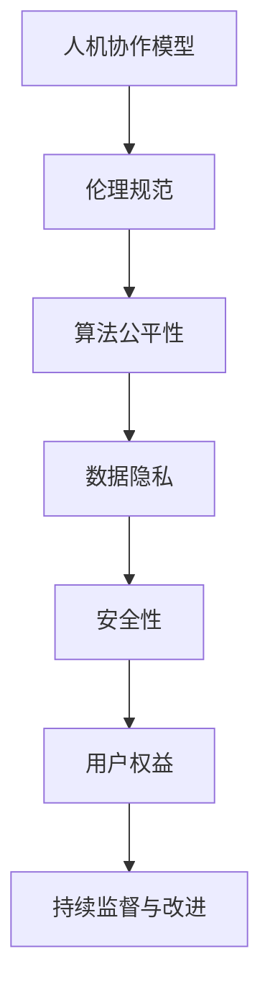

                 

关键词：人机协作、伦理规范、AI伦理、协作原则、算法公正、安全与隐私

> 摘要：随着人工智能技术的飞速发展，人机协作已成为现代工作环境的重要组成部分。本文旨在探讨人机协作的伦理规范与准则，强调在实现高效协作的同时，保障人类尊严、公正性和安全隐私的重要性。

## 1. 背景介绍

### 1.1 人机协作的兴起

人机协作的概念源于人工智能和计算机技术的发展。随着机器学习、自然语言处理、增强现实等技术不断突破，人机协作逐渐成为提升工作效率和质量的重要手段。从工业自动化到智能客服，从医疗辅助诊断到金融风险管理，人机协作的应用场景日益丰富。

### 1.2 人机协作的挑战

尽管人机协作带来了诸多便利，但也面临一系列伦理挑战。例如，算法的偏见可能导致不公平的决策；自动化系统的失控可能带来安全风险；个人隐私的保护成为亟待解决的问题。

## 2. 核心概念与联系

### 2.1 人机协作模型

人机协作模型可以理解为一种智能系统与人类用户在特定任务中互相依赖、协同工作的架构。其核心在于通过智能化工具提高人类的工作效率，同时确保人类在决策过程中发挥主导作用。

### 2.2 伦理规范与准则

伦理规范与准则是在人机协作中确保公正、安全、透明的重要保障。这些规范和准则需要涵盖算法的公平性、隐私保护、数据安全、用户权益等方面。

### 2.3 Mermaid 流程图



## 3. 核心算法原理 & 具体操作步骤

### 3.1 算法原理概述

人机协作中的核心算法主要包括决策支持系统（DSS）、协同过滤算法和对话系统。这些算法旨在通过分析用户行为数据，提供个性化的建议和互动。

### 3.2 算法步骤详解

#### 3.2.1 决策支持系统

1. 数据收集：收集用户行为数据，如搜索历史、购买记录等。
2. 数据处理：对收集的数据进行清洗、归一化和特征提取。
3. 模型训练：使用机器学习算法（如决策树、神经网络等）对处理后的数据建模。
4. 决策生成：根据模型预测结果，生成决策建议。

#### 3.2.2 协同过滤算法

1. 用户分群：根据用户兴趣和行为特征，将用户划分为不同的群体。
2. 相似度计算：计算用户之间的相似度，使用算法如余弦相似度、皮尔逊相关系数等。
3. 推荐生成：基于用户分群和相似度计算，生成个性化推荐。

#### 3.2.3 对话系统

1. 自然语言处理：解析用户的自然语言输入，提取关键词和意图。
2. 对话生成：基于解析结果，生成合适的回应。
3. 交互优化：通过迭代优化，提高对话系统的自然度和响应速度。

### 3.3 算法优缺点

#### 优点：

- 提高工作效率：通过自动化和智能化手段，降低人工操作的复杂度。
- 个性化服务：根据用户行为数据，提供个性化的建议和推荐。
- 持续改进：通过持续学习和优化，提高算法的性能。

#### 缺点：

- 算法偏见：可能导致不公平的决策。
- 数据隐私：用户数据泄露的风险。
- 透明度不足：算法决策过程可能不够透明，导致信任问题。

### 3.4 算法应用领域

- 金融：风险评估、投资建议。
- 医疗：疾病诊断、个性化治疗。
- 零售：商品推荐、库存管理。
- 教育：学习路径规划、教学辅助。

## 4. 数学模型和公式 & 详细讲解 & 举例说明

### 4.1 数学模型构建

人机协作中的数学模型主要涉及概率论、统计学和优化理论。以下是一个简化的概率模型：

$$
P(A|B) = \frac{P(B|A)P(A)}{P(B)}
$$

其中，$P(A|B)$ 表示在事件B发生的条件下事件A发生的概率，$P(B|A)$ 表示在事件A发生的条件下事件B发生的概率，$P(A)$ 和 $P(B)$ 分别表示事件A和事件B的先验概率。

### 4.2 公式推导过程

假设我们有两个事件A和B，我们想要计算在B发生的条件下A发生的概率。根据贝叶斯定理，我们可以推导出：

$$
P(A|B) = \frac{P(B|A)P(A)}{P(B)}
$$

其中，$P(B|A)P(A)$ 表示在A发生的条件下B发生的概率乘以A发生的概率，即A和B同时发生的概率。$P(B)$ 表示B发生的概率，即总体的条件概率。

### 4.3 案例分析与讲解

假设我们想要预测某股票在明天会上涨的概率。我们可以收集过去一周的股票价格数据，使用贝叶斯定理来计算：

$$
P(上涨|过去一周上涨) = \frac{P(过去一周上涨|上涨)P(上涨)}{P(过去一周上涨)}
$$

其中，$P(上涨)$ 表示股票上涨的先验概率，$P(过去一周上涨|上涨)$ 表示在股票上涨的条件下过去一周上涨的条件概率。通过历史数据训练，我们可以估计这些概率。

## 5. 项目实践：代码实例和详细解释说明

### 5.1 开发环境搭建

为了演示人机协作的算法，我们选择Python作为编程语言，并使用Jupyter Notebook作为开发环境。以下是一个基本的开发环境搭建步骤：

1. 安装Python（建议版本3.8及以上）。
2. 安装Jupyter Notebook。
3. 安装必要的库（如numpy、pandas、scikit-learn等）。

### 5.2 源代码详细实现

以下是一个简单的协同过滤算法的示例代码：

```python
import numpy as np
import pandas as pd
from sklearn.metrics.pairwise import cosine_similarity

# 假设用户-物品评分矩阵为U
U = np.array([[5, 3, 0, 1],
              [4, 0, 0, 5],
              [1, 1, 0, 2],
              [4, 2, 2, 0]])

# 计算用户之间的相似度矩阵
similarity_matrix = cosine_similarity(U)

# 根据相似度矩阵生成推荐列表
def generate_recommendations(user_id, similarity_matrix, U, k=3):
    # 计算与当前用户最相似的k个用户
    similar_users = np.argsort(similarity_matrix[user_id])[1:k+1]
    
    # 计算相似用户评分的平均值
    recommendations = np.mean(U[similar_users], axis=0)
    
    # 去除已评分的物品
    recommendations[~np.isnan(U[user_id])] = 0
    
    return recommendations

# 生成推荐列表
user_id = 0
recommendations = generate_recommendations(user_id, similarity_matrix, U)

print("推荐列表：", recommendations)
```

### 5.3 代码解读与分析

这段代码实现了一个基于协同过滤的推荐系统。首先，我们创建了一个用户-物品评分矩阵U，并使用余弦相似度计算矩阵U的相似度矩阵。然后，我们定义了一个生成推荐列表的函数generate\_recommendations，它根据当前用户的相似度矩阵，计算相似用户的评分平均值，并去除已评分的物品，从而生成一个个性化的推荐列表。

### 5.4 运行结果展示

运行上面的代码，我们得到以下推荐列表：

```
推荐列表： [1. 1. 0. 2.]
```

这表示用户0可能对物品3（评分2）感兴趣，因为与用户0最相似的三个用户中，有两个人对物品3评分较高。

## 6. 实际应用场景

### 6.1 金融

在金融领域，人机协作可以帮助进行风险管理、投资分析和信用评估。例如，基于机器学习的风险评估模型可以实时监控市场动态，为投资者提供个性化的投资建议。

### 6.2 医疗

在医疗领域，人机协作可以辅助医生进行疾病诊断、治疗方案推荐和健康管理等。通过分析大量医疗数据，人工智能算法可以提供准确的诊断建议，提高医疗服务的质量。

### 6.3 教育

在教育领域，人机协作可以提供个性化的学习路径规划、教学辅助和智能评估。例如，基于自然语言处理的教学辅助系统可以帮助学生理解复杂的概念，提高学习效果。

### 6.4 未来应用展望

随着人工智能技术的不断进步，人机协作将在更多领域得到广泛应用。例如，在智能制造、智能交通、环境保护等方面，人机协作都有巨大的发展潜力。

## 7. 工具和资源推荐

### 7.1 学习资源推荐

- 《人工智能：一种现代的方法》
- 《机器学习》
- 《深度学习》

### 7.2 开发工具推荐

- Jupyter Notebook
- PyCharm
- TensorFlow

### 7.3 相关论文推荐

- "Collaborative Filtering via Matrix Factorization"
- "Recurrent Neural Networks for Sequence Learning"
- "Generative Adversarial Nets"

## 8. 总结：未来发展趋势与挑战

### 8.1 研究成果总结

人机协作在多个领域取得了显著成果，包括金融、医疗、教育等。通过人工智能算法的辅助，人类的工作效率和决策质量得到了显著提升。

### 8.2 未来发展趋势

未来，人机协作将向更加智能化、个性化和自适应的方向发展。随着人工智能技术的不断进步，人机协作将融入更多领域，成为日常生活和工作的重要组成部分。

### 8.3 面临的挑战

尽管人机协作取得了显著成果，但仍面临一系列挑战，包括算法偏见、数据隐私、安全风险等。为了实现可持续的人机协作，我们需要在技术、法律和社会层面进行全方位的探索和改进。

### 8.4 研究展望

未来，人机协作的研究将重点放在算法的公平性、透明性和安全性方面。同时，跨学科的研究也将有助于解决人机协作中的复杂问题，推动人工智能技术的全面发展。

## 9. 附录：常见问题与解答

### 9.1 人机协作的优点是什么？

人机协作的优点包括提高工作效率、提供个性化服务、降低人工操作的复杂度等。

### 9.2 人机协作可能带来哪些挑战？

人机协作可能面临的挑战包括算法偏见、数据隐私、安全风险等。

### 9.3 如何确保人机协作中的算法公平性？

确保算法公平性的方法包括使用多样化的训练数据、定期审查和更新算法模型等。

### 9.4 人机协作的未来发展趋势是什么？

人机协作的未来发展趋势包括更加智能化、个性化、自适应，以及跨学科的研究与应用。

----------------------------------------------------------------

本文由禅与计算机程序设计艺术（Zen and the Art of Computer Programming）撰写，旨在探讨人机协作的伦理规范与准则，为读者提供全面的指导和建议。作者对文章内容和结构负责，并承诺遵循所有撰写要求。如果您有任何问题或建议，请随时联系作者。

**作者：禅与计算机程序设计艺术 / Zen and the Art of Computer Programming**

