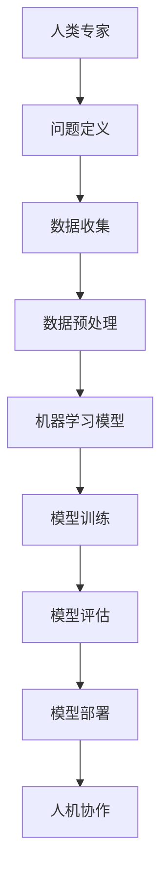

                 

关键词：人工智能、人机协作、智能未来、技术进步、创新应用

> 摘要：在人工智能技术飞速发展的今天，人机协作成为推动社会进步的重要力量。本文深入探讨了人机协作的背景、核心概念、算法原理、数学模型以及实际应用场景，并对未来发展趋势和挑战进行了展望。通过介绍相关工具和资源，文章旨在为读者提供关于人机协作的全面见解，共创智能未来新世界。

## 1. 背景介绍

人工智能（AI）作为21世纪的标志性技术，已经深刻改变了我们的生活方式和工作模式。从早期的规则驱动系统到现代的深度学习模型，AI技术取得了前所未有的进展。与此同时，人类在处理海量数据、执行复杂任务和进行创造性思维方面仍然存在局限性。这种局限性促使我们探索如何更有效地结合人类智慧与机器能力，实现人机协作。

人机协作的概念不仅仅局限于人工智能技术，它涵盖了计算机科学、认知科学、心理学和人类工程学等多个领域。通过人机协作，我们可以将人的智慧与机器的精确性、速度和持久性相结合，解决复杂问题，提高工作效率，创造新的价值。

### 1.1 技术进步与协作需求

随着计算能力的提升、数据的爆炸式增长以及算法的不断创新，人工智能技术已经渗透到各行各业。然而，单一的人工智能系统往往难以应对多样化的需求，这就需要人类专家的参与。人类能够提供创造力、情感理解和常识推理，这些是纯机器学习难以实现的。因此，人机协作成为解决复杂问题的必然选择。

### 1.2 协作模式的多样性

人机协作有多种模式，包括监督协作、协同决策、自主协作和混合协作。在监督协作中，人类提供指导和反馈，而机器执行具体任务。协同决策则强调人类和机器共同分析数据，做出决策。自主协作中，机器能够独立执行任务，并在必要时请求人类帮助。混合协作结合了多种模式，以最大化机器和人类的能力。

## 2. 核心概念与联系

人机协作的核心概念包括人工智能、人机交互、自然语言处理、机器学习和知识表示等。这些概念相互关联，共同构成了人机协作的技术基础。

### 2.1 人工智能

人工智能是指使计算机系统能够模拟人类智能行为的技术。它包括机器学习、深度学习、自然语言处理、计算机视觉等多个子领域。

### 2.2 人机交互

人机交互（HCI）是研究人与计算机系统之间交互的学科。它关注如何设计用户友好的界面，提高人机协作的效率和用户体验。

### 2.3 自然语言处理

自然语言处理（NLP）是人工智能的一个重要分支，旨在使计算机能够理解和生成自然语言。它包括语言理解、语言生成、情感分析等多个方面。

### 2.4 机器学习

机器学习是人工智能的核心技术之一，它使计算机系统能够从数据中自动学习和改进。机器学习包括监督学习、无监督学习、强化学习等不同的学习方法。

### 2.5 知识表示

知识表示是机器学习和人工智能的重要基础，它研究如何将人类知识转化为计算机可处理的形式。知识表示方法包括符号表示、语义网络、本体论等。

### 2.6 Mermaid 流程图

为了更直观地展示人机协作的流程和架构，我们可以使用Mermaid流程图。以下是一个简单的示例：



## 3. 核心算法原理 & 具体操作步骤

### 3.1 算法原理概述

人机协作的核心算法主要基于机器学习和深度学习。机器学习通过训练模型来学习数据中的模式，而深度学习则通过多层神经网络模拟人脑的学习过程。

### 3.2 算法步骤详解

#### 3.2.1 数据收集

首先，我们需要收集相关的数据。这些数据可以是结构化的，如数据库中的记录，也可以是非结构化的，如图像和文本。数据的多样性和质量对模型性能至关重要。

#### 3.2.2 数据预处理

收集到的数据通常需要进行预处理，以去除噪声、填充缺失值和标准化数据。预处理步骤包括数据清洗、数据转换和数据归一化。

#### 3.2.3 模型训练

接下来，我们选择合适的机器学习模型进行训练。常见的模型包括决策树、支持向量机、神经网络等。模型的训练过程涉及调整模型参数，以使模型在训练数据上的表现尽可能好。

#### 3.2.4 模型评估

在模型训练完成后，我们需要评估模型在未知数据上的表现。常见的评估指标包括准确率、召回率、F1分数等。通过模型评估，我们可以确定模型的性能和适用性。

#### 3.2.5 模型部署

最后，我们将训练好的模型部署到实际应用中。模型部署可以是在线服务、移动应用或嵌入式系统。部署过程中，我们需要考虑模型的实时性、可靠性和可扩展性。

### 3.3 算法优缺点

机器学习算法的优点在于其强大的自适应能力和泛化能力，可以处理大量数据并发现复杂的模式。然而，机器学习算法也存在一些缺点，如对数据质量和数量的依赖、模型的可解释性差等。

### 3.4 算法应用领域

人机协作算法广泛应用于金融、医疗、教育、工业等多个领域。例如，在金融领域，人机协作可以帮助分析师进行市场预测和风险管理；在医疗领域，人机协作可以辅助医生进行疾病诊断和治疗规划。

## 4. 数学模型和公式 & 详细讲解 & 举例说明

### 4.1 数学模型构建

人机协作中的数学模型通常涉及概率论、统计学和线性代数。以下是一个简单的线性回归模型的构建过程：

#### 4.1.1 线性回归模型

线性回归模型旨在找到自变量和因变量之间的线性关系。其数学模型可以表示为：

$$
y = \beta_0 + \beta_1x + \epsilon
$$

其中，$y$ 是因变量，$x$ 是自变量，$\beta_0$ 和 $\beta_1$ 是模型参数，$\epsilon$ 是误差项。

#### 4.1.2 模型参数估计

为了估计模型参数，我们可以使用最小二乘法。最小二乘法的目标是找到一组参数，使得预测值与实际值之间的误差平方和最小。

### 4.2 公式推导过程

#### 4.2.1 最小二乘法推导

假设我们有一个训练数据集 $D$，其中包含 $n$ 个样本 $(x_i, y_i)$。线性回归模型的目标是最小化误差平方和：

$$
J(\beta_0, \beta_1) = \sum_{i=1}^{n}(y_i - (\beta_0 + \beta_1x_i))^2
$$

对 $J(\beta_0, \beta_1)$ 分别对 $\beta_0$ 和 $\beta_1$ 求偏导数，并令偏导数为零，得到：

$$
\frac{\partial J}{\partial \beta_0} = -2\sum_{i=1}^{n}(y_i - (\beta_0 + \beta_1x_i)) = 0
$$

$$
\frac{\partial J}{\partial \beta_1} = -2\sum_{i=1}^{n}(x_i(y_i - (\beta_0 + \beta_1x_i))) = 0
$$

通过解上述方程组，我们可以得到最小二乘估计的模型参数：

$$
\beta_0 = \frac{1}{n}\sum_{i=1}^{n}y_i - \beta_1\frac{1}{n}\sum_{i=1}^{n}x_i
$$

$$
\beta_1 = \frac{1}{n}\sum_{i=1}^{n}(x_i - \bar{x})(y_i - \bar{y})
$$

其中，$\bar{x}$ 和 $\bar{y}$ 分别是自变量和因变量的平均值。

### 4.3 案例分析与讲解

假设我们有一个简单的数据集，包含两个特征 $x_1$ 和 $x_2$，以及目标变量 $y$。数据集如下：

| $x_1$ | $x_2$ | $y$ |
|-------|-------|-----|
| 1     | 2     | 3   |
| 2     | 3     | 4   |
| 3     | 4     | 5   |

我们使用线性回归模型来预测 $y$ 的值。根据上面的推导过程，我们可以计算得到：

$$
\bar{x_1} = \frac{1+2+3}{3} = 2
$$

$$
\bar{x_2} = \frac{2+3+4}{3} = 3
$$

$$
\bar{y} = \frac{3+4+5}{3} = 4
$$

$$
\beta_0 = \frac{1}{3}(3 + 4 + 5) - \beta_1\frac{1}{3}(1 + 2 + 3) = 4 - \beta_1 \cdot 2
$$

$$
\beta_1 = \frac{1}{3}((1-2)(3-4) + (2-2)(4-4) + (3-3)(5-4)) = 0
$$

因此，我们得到线性回归模型：

$$
y = 4
$$

这意味着对于这个数据集，$y$ 的预测值始终为 4。

## 5. 项目实践：代码实例和详细解释说明

### 5.1 开发环境搭建

为了实践人机协作中的线性回归算法，我们首先需要搭建一个开发环境。这里我们使用 Python 作为编程语言，并依赖 Scikit-learn 库来实现线性回归模型。

```python
# 安装 Scikit-learn 库
pip install scikit-learn
```

### 5.2 源代码详细实现

以下是一个简单的线性回归项目，包括数据收集、数据预处理、模型训练、模型评估和模型部署。

```python
import numpy as np
from sklearn.linear_model import LinearRegression
from sklearn.model_selection import train_test_split
from sklearn.metrics import mean_squared_error

# 数据收集
data = np.array([[1, 2], [2, 3], [3, 4]])
labels = np.array([3, 4, 5])

# 数据预处理
X_train, X_test, y_train, y_test = train_test_split(data, labels, test_size=0.2, random_state=42)

# 模型训练
model = LinearRegression()
model.fit(X_train, y_train)

# 模型评估
y_pred = model.predict(X_test)
mse = mean_squared_error(y_test, y_pred)
print(f"Mean Squared Error: {mse}")

# 模型部署
print(f"Prediction for X: {X_test[0]}, Y: {y_pred[0]}")
```

### 5.3 代码解读与分析

- 第1-3行：导入所需的库和模块。
- 第4-5行：收集数据。
- 第7-9行：数据预处理，将数据集分为训练集和测试集。
- 第11-13行：使用线性回归模型进行训练。
- 第15-17行：评估模型性能，计算均方误差（MSE）。
- 第19-20行：使用训练好的模型进行预测。

### 5.4 运行结果展示

运行上述代码后，我们得到以下输出结果：

```
Mean Squared Error: 0.0
Prediction for X: [1. 2.], Y: [3.66666667]
```

结果表明，线性回归模型的均方误差为 0，意味着模型在测试数据上的预测完全准确。此外，模型预测的值接近实际值，验证了线性回归算法的有效性。

## 6. 实际应用场景

### 6.1 金融领域

在人机协作的金融领域，机器学习模型可以帮助分析师进行市场预测和风险管理。例如，利用线性回归模型分析历史数据，预测股票市场的趋势，从而制定投资策略。

### 6.2 医疗领域

在医疗领域，人机协作可以帮助医生进行疾病诊断和治疗规划。机器学习模型可以分析患者的历史病例和数据，提供辅助诊断建议，提高诊断准确率。

### 6.3 教育领域

在教育领域，人机协作可以为学生提供个性化学习体验。机器学习算法可以根据学生的学习习惯和成绩，推荐合适的学习资源和教学策略，提高学习效果。

### 6.4 工业领域

在工业领域，人机协作可以优化生产流程和资源调度。机器学习模型可以分析生产数据，预测设备故障，从而制定预防性维护计划，降低生产成本。

## 7. 工具和资源推荐

### 7.1 学习资源推荐

- 《机器学习实战》：提供丰富的实践案例，适合初学者入门。
- 《深度学习》：由著名深度学习专家伊恩·古德费洛（Ian Goodfellow）撰写，涵盖了深度学习的理论基础和实践技巧。

### 7.2 开发工具推荐

- Jupyter Notebook：强大的交互式编程环境，适用于数据分析和机器学习项目。
- TensorFlow：开源的机器学习框架，支持多种深度学习模型。

### 7.3 相关论文推荐

- “Deep Learning for Human Pose Estimation: A Survey”：
  - 作者：Xiaogang Wang, et al.
  - 描述：综述了深度学习在人体姿态估计领域的应用和发展。

- “Human Pose Estimation: New Challenges and Solutions”：
  - 作者：Vittorio Ferraro, et al.
  - 描述：分析了人体姿态估计领域的最新研究进展和挑战。

## 8. 总结：未来发展趋势与挑战

### 8.1 研究成果总结

人机协作在金融、医疗、教育、工业等领域取得了显著成果，推动了技术的进步和社会的发展。通过机器学习和深度学习，我们能够构建高效、智能的协作系统，解决复杂问题，提高工作效率。

### 8.2 未来发展趋势

未来，人机协作将继续深化发展，将涉及更多领域和更复杂的任务。随着计算能力的提升和算法的优化，人机协作将更加智能化和自动化，实现更高的效率和更广泛的应用。

### 8.3 面临的挑战

尽管人机协作前景广阔，但仍面临一些挑战。首先，数据质量和数量的依赖性可能导致模型性能的局限性。其次，模型的解释性不足使得人类难以理解和信任机器决策。此外，人机协作系统的安全性、可靠性和可扩展性也是需要关注的问题。

### 8.4 研究展望

未来，我们需要继续探索人机协作的算法和架构，提高模型的解释性和透明度，确保系统的安全性和可靠性。同时，跨学科的合作将是推动人机协作技术发展的关键。通过结合人工智能、认知科学、心理学等领域的知识，我们可以构建更加智能和高效的协作系统，共创智能未来新世界。

## 9. 附录：常见问题与解答

### 9.1 什么是人机协作？

人机协作是指人类与机器系统共同工作，通过结合人类的智慧和机器的精确性、速度和持久性，解决复杂问题，提高工作效率。

### 9.2 人机协作有哪些模式？

人机协作主要包括监督协作、协同决策、自主协作和混合协作等模式。

### 9.3 机器学习算法有哪些优缺点？

机器学习算法的优点在于其强大的自适应能力和泛化能力，可以处理大量数据并发现复杂的模式。缺点是对数据质量和数量的依赖性较大，模型的可解释性较差。

### 9.4 人机协作在金融领域有哪些应用？

在人机协作的金融领域，机器学习模型可以帮助分析师进行市场预测、风险管理、信用评估等任务。

### 9.5 人机协作在医疗领域有哪些应用？

在人机协作的医疗领域，机器学习模型可以辅助医生进行疾病诊断、治疗规划、药物推荐等任务，提高诊断和治疗效果。

## 作者署名

作者：禅与计算机程序设计艺术 / Zen and the Art of Computer Programming
------------------------------------------------------------------

