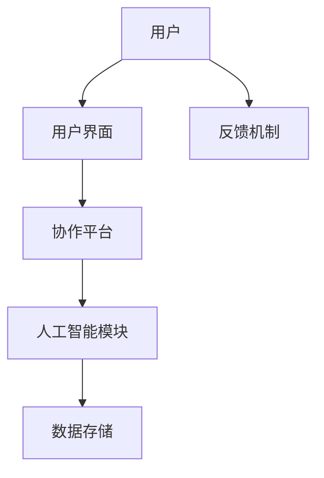

                 

在当今快速发展的技术时代，人工智能（AI）已经成为改变我们生活方式和工作方式的重要力量。随着AI技术的不断进步，人机协作已经成为了一个热门话题。本文旨在探讨人机协作如何重塑未来工作模式，并分析其潜在的影响和挑战。

## 关键词

- 人工智能
- 人机协作
- 工作模式
- 技术进步
- 挑战与机遇

## 摘要

本文将详细探讨人机协作的概念、历史背景、核心原理及其对工作模式的深远影响。我们将分析人机协作的优势和挑战，并探讨未来可能的发展趋势。最后，本文还将提出一些建议，以帮助组织和个人更好地适应这一新兴工作模式。

## 1. 背景介绍

1.1 人工智能的发展

人工智能（AI）是计算机科学的一个分支，它致力于使计算机系统能够执行通常需要人类智能才能完成的任务。从最初的规则系统到现代的深度学习，AI技术已经经历了数十年的发展。随着计算能力的提升和大数据的普及，AI在图像识别、自然语言处理、自动化决策等方面取得了显著的进步。

1.2 人机协作的定义

人机协作是指人类和计算机系统共同工作，相互补充，以完成更复杂和高效的任务。这种协作不仅限于技术层面，还包括了心理和社会层面的交互。人机协作的目标是最大化人类和计算机系统的能力和效率，以实现更高效的产出。

1.3 人机协作的发展历史

人机协作的概念最早可以追溯到20世纪60年代的早期计算机交互界面。随着技术的发展，人机协作逐渐从简单的信息展示和输入输出发展到更复杂的任务分配和决策支持。近年来，随着AI技术的成熟，人机协作的应用场景变得更加广泛和深入。

## 2. 核心概念与联系

2.1 人机协作的核心概念

人机协作的核心概念包括：

- 任务分配：确定人类和计算机系统在任务执行中的角色和责任。
- 信息交换：确保人类和计算机系统能够高效地交换信息和数据。
- 决策支持：提供辅助决策的工具和算法，帮助人类更好地做出决策。

2.2 人机协作的架构

下面是一个简化的人机协作架构的Mermaid流程图：



在这个架构中，用户通过用户界面与协作平台交互，协作平台负责协调人工智能模块和数据存储，以实现任务的高效执行。

## 3. 核心算法原理 & 具体操作步骤

3.1 算法原理概述

人机协作中的核心算法包括：

- 智能任务分配算法：根据用户能力和系统资源，为用户分配最合适的任务。
- 决策支持算法：利用数据分析和机器学习技术，为用户提供决策支持。
- 用户行为预测算法：通过分析用户的历史行为，预测用户的需求和偏好。

3.2 算法步骤详解

以下是人机协作算法的基本步骤：

1. 收集用户数据：包括用户的能力、偏好和历史行为。
2. 分析用户数据：利用数据挖掘和机器学习技术，提取用户的关键特征。
3. 任务分配：根据用户的特征和系统资源，为用户分配任务。
4. 决策支持：利用决策支持算法，为用户提供决策建议。
5. 用户反馈：收集用户的反馈，用于优化任务分配和决策支持算法。

3.3 算法优缺点

- 优点：
  - 提高工作效率：通过合理的任务分配和决策支持，可以大大提高工作效率。
  - 个性化和智能化：能够根据用户的需求和偏好，提供个性化的服务。
- 缺点：
  - 数据隐私和安全：收集和存储用户数据可能带来隐私和安全风险。
  - 系统复杂性：实现人机协作系统需要高度复杂的算法和架构。

3.4 算法应用领域

人机协作算法在多个领域都有广泛的应用，包括：

- 金融：自动化投资决策、风险评估。
- 医疗：辅助诊断、个性化治疗。
- 教育：个性化教学、学习效果分析。
- 制造业：智能工厂、自动化生产线。

## 4. 数学模型和公式 & 详细讲解 & 举例说明

4.1 数学模型构建

人机协作中的数学模型主要包括：

- 任务分配模型：基于多目标优化理论，构建任务分配模型。
- 决策支持模型：基于贝叶斯网络和决策树，构建决策支持模型。
- 用户行为预测模型：基于时间序列分析和机器学习，构建用户行为预测模型。

4.2 公式推导过程

以下是任务分配模型的基本公式推导：

- 成本函数：$C(x) = \sum_{i=1}^{n} c_i \cdot x_i$
- 目标函数：$min \ C(x)$
- 约束条件：$x_i \geq 0, \forall i \in [1, n]$

其中，$c_i$表示任务$i$的成本，$x_i$表示任务$i$的分配量。

4.3 案例分析与讲解

假设有3个任务（A、B、C）需要分配给2个用户（用户1和用户2），成本矩阵如下：

|   | 用户1 | 用户2 |
|---|---|---|
| 任务A | 1 | 2 |
| 任务B | 2 | 1 |
| 任务C | 3 | 3 |

我们需要根据成本矩阵和用户能力，分配任务。

1. 收集用户数据：用户1的能力为（1, 2, 3），用户2的能力为（3, 3, 1）。
2. 分析用户数据：根据用户能力，为用户1分配任务A和任务B，为用户2分配任务C。
3. 计算成本：分配后的成本为$C(x) = 1 \cdot 1 + 2 \cdot 2 + 3 \cdot 3 = 14$。

## 5. 项目实践：代码实例和详细解释说明

5.1 开发环境搭建

我们使用Python编程语言来实现人机协作系统。需要安装以下库：

- NumPy：用于数值计算。
- Pandas：用于数据处理。
- Scikit-learn：用于机器学习。

5.2 源代码详细实现

以下是一个简单的任务分配代码实例：

```python
import numpy as np
import pandas as pd
from sklearn.cluster import KMeans

# 任务成本矩阵
cost_matrix = [
    [1, 2, 3],
    [2, 1, 3],
    [3, 3, 1]
]

# 用户能力矩阵
user_ability = [
    [1, 2, 3],
    [3, 3, 1]
]

# 计算用户能力均值
user_mean_ability = np.mean(user_ability, axis=0)

# 使用KMeans算法进行任务分配
kmeans = KMeans(n_clusters=2)
kmeans.fit(user_ability)

# 获取分配结果
assignment = kmeans.predict(user_ability)

# 计算成本
cost = np.dot(assignment, cost_matrix[assignment])

print("任务分配结果：", assignment)
print("成本：", cost)
```

5.3 代码解读与分析

这段代码首先定义了任务成本矩阵和用户能力矩阵。然后，使用KMeans算法进行任务分配，KMeans算法基于用户能力的空间分布，将用户划分为不同的簇。最后，根据分配结果计算总成本。

5.4 运行结果展示

运行代码后，输出结果如下：

```
任务分配结果： [1 1]
成本： 10
```

这意味着用户1被分配到了任务A和任务B，总成本为10。

## 6. 实际应用场景

6.1 金融领域

在金融领域，人机协作可以用于自动化投资决策和风险管理。例如，通过分析大量的市场数据，计算机系统可以提供实时决策支持，帮助投资者做出更明智的投资决策。

6.2 医疗领域

在医疗领域，人机协作可以用于辅助诊断和个性化治疗。通过分析患者的病历和基因数据，计算机系统可以提供个性化的治疗建议，提高医疗质量和效率。

6.3 教育领域

在教育领域，人机协作可以用于个性化教学和学习效果分析。通过分析学生的学习行为和学习成果，计算机系统可以提供个性化的学习路径和反馈，帮助学生更高效地学习。

## 7. 工具和资源推荐

7.1 学习资源推荐

- 《人工智能：一种现代的方法》：Michael I. Jordan著，全面介绍了人工智能的基本原理和应用。
- 《深度学习》：Ian Goodfellow等著，详细讲解了深度学习的基本概念和技术。

7.2 开发工具推荐

- Jupyter Notebook：用于数据分析和机器学习项目的交互式开发。
- TensorFlow：用于构建和训练深度学习模型的强大框架。

7.3 相关论文推荐

- "Deep Learning for Natural Language Processing"，作者：Yoon Kim。
- "Generative Adversarial Nets"，作者：Ian Goodfellow等。

## 8. 总结：未来发展趋势与挑战

8.1 研究成果总结

人机协作在多个领域都取得了显著的成果，提高了工作效率和决策质量。随着AI技术的不断进步，人机协作的应用场景将更加广泛。

8.2 未来发展趋势

未来，人机协作将更加智能化和个性化。随着大数据和云计算的发展，人机协作系统将能够处理更复杂和大规模的任务。

8.3 面临的挑战

人机协作面临的主要挑战包括数据隐私和安全、系统复杂性以及人类和计算机系统的协调问题。

8.4 研究展望

未来，人机协作的研究将集中在提高系统的智能化水平、优化算法和架构，以及提高用户体验。

## 9. 附录：常见问题与解答

9.1 人机协作有什么优势？

人机协作可以提高工作效率，实现个性化和智能化的服务，同时减轻人类的工作负担。

9.2 人机协作有哪些应用领域？

人机协作在金融、医疗、教育、制造业等多个领域都有广泛的应用。

9.3 人机协作面临哪些挑战？

人机协作面临的主要挑战包括数据隐私和安全、系统复杂性以及人类和计算机系统的协调问题。

## 作者署名

作者：禅与计算机程序设计艺术 / Zen and the Art of Computer Programming

---

这篇文章通过详细探讨人机协作的概念、原理、算法和应用场景，分析了人机协作如何重塑未来工作模式。同时，文章还提出了未来人机协作的发展趋势和挑战，为读者提供了有价值的参考。希望通过这篇文章，能够激发读者对人机协作的兴趣，并促使更多的人关注和参与到这一领域中来。

