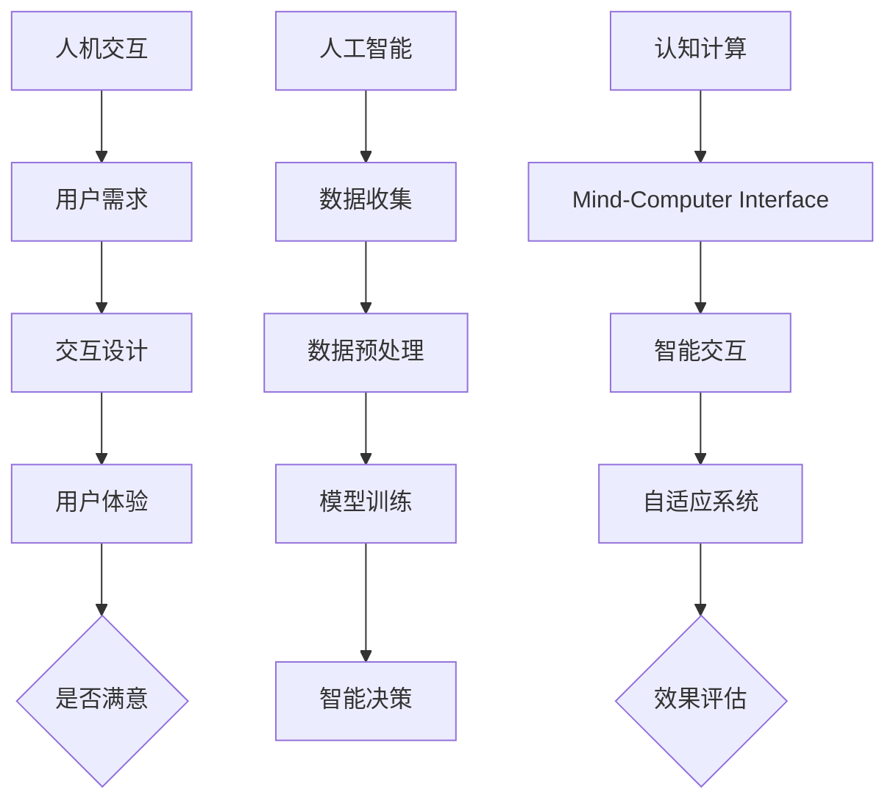

                 

关键词：人机协同，人工智能，智能时代，技术革新，创新应用，算法原理，数学模型，项目实践，未来展望。

> 摘要：在智能时代，人机协同成为推动技术进步的关键驱动力。本文从人机协同的背景、核心概念、算法原理、数学模型、项目实践等多个维度深入探讨人机协同的技术创新与应用，并展望其未来发展。

## 1. 背景介绍

### 智能时代的来临

随着信息技术的飞速发展，人工智能（AI）技术已经成为推动人类社会进步的重要力量。从最初的自动化到如今的智能化，人类的生产和生活方式正经历前所未有的变革。在这个过程中，人机协同成为智能时代不可或缺的一部分。人机协同不仅提高了生产效率，还极大地丰富了人类的认知能力。

### 人机协同的定义

人机协同是指人与计算机系统在共同目标下进行的协作过程。它包括两个方面：一是人机交互，二是人机融合。人机交互是指人与计算机之间的信息交换和互动，而人机融合则是通过智能技术将人的智能与计算机的智能相结合，形成一种新的智能系统。

## 2. 核心概念与联系

### 人机协同的三大核心概念

1. **人机交互（Human-Computer Interaction, HCI）**：研究如何设计用户界面，使得人与计算机系统能够高效、舒适地进行交互。
2. **人工智能（Artificial Intelligence, AI）**：模拟人类智能行为的技术，包括机器学习、自然语言处理、计算机视觉等。
3. **认知计算（Cognitive Computing）**：结合人类认知模型和计算机技术，实现更加智能化和人性化的计算机系统。

### Mermaid 流程图（核心概念和架构）



## 3. 核心算法原理 & 具体操作步骤

### 3.1 算法原理概述

人机协同的核心算法主要集中在机器学习和深度学习领域。以下是几种常用的算法及其原理：

1. **监督学习（Supervised Learning）**：通过标注数据进行训练，使得计算机能够从数据中学习并做出预测。
2. **无监督学习（Unsupervised Learning）**：不需要标注数据，通过发现数据中的模式来学习。
3. **强化学习（Reinforcement Learning）**：通过奖励机制来训练模型，使其在特定环境中做出最佳决策。

### 3.2 算法步骤详解

1. **数据收集**：收集大量与任务相关的数据，包括用户行为数据、环境数据等。
2. **数据预处理**：对收集到的数据进行清洗、归一化等处理，使其适合算法训练。
3. **模型选择**：根据任务需求选择合适的模型，如线性回归、决策树、神经网络等。
4. **模型训练**：使用预处理后的数据对模型进行训练，调整模型参数以优化性能。
5. **模型评估**：通过测试集评估模型性能，调整模型参数以达到最佳效果。
6. **模型部署**：将训练好的模型部署到实际应用场景中，实现人机协同。

### 3.3 算法优缺点

1. **监督学习**：优点是预测准确度高，缺点是需要大量标注数据。
2. **无监督学习**：优点是不需要标注数据，缺点是难以实现精确预测。
3. **强化学习**：优点是能够实现自主决策，缺点是训练过程较慢，需要大量计算资源。

### 3.4 算法应用领域

人机协同算法广泛应用于金融、医疗、交通、教育等多个领域。例如，在金融领域，人机协同算法可以用于智能投顾，帮助用户进行资产配置；在医疗领域，人机协同算法可以辅助医生进行疾病诊断。

## 4. 数学模型和公式 & 详细讲解 & 举例说明

### 4.1 数学模型构建

人机协同的数学模型主要包括概率模型和决策模型。以下是两种常见的数学模型：

1. **贝叶斯网络（Bayesian Network）**：用于表示变量之间的条件依赖关系。
2. **马尔可夫决策过程（Markov Decision Process, MDP）**：用于描述在不确定环境中进行决策的过程。

### 4.2 公式推导过程

贝叶斯网络的公式推导如下：

$$
P(A|B) = \frac{P(B|A) \cdot P(A)}{P(B)}
$$

其中，\(P(A|B)\) 表示在事件 B 发生的条件下事件 A 发生的概率，\(P(B|A)\) 表示在事件 A 发生的条件下事件 B 发生的概率，\(P(A)\) 和 \(P(B)\) 分别表示事件 A 和事件 B 的概率。

### 4.3 案例分析与讲解

以贝叶斯网络在智能诊断中的应用为例，假设我们要诊断一个病人的疾病，已知以下信息：

- 病人患有疾病 A 的概率为 0.5。
- 病人表现出症状 B 的概率为 0.8。
- 病人没有表现出症状 B 的概率为 0.2。

我们需要计算在病人表现出症状 B 的条件下，他患有疾病 A 的概率。

根据贝叶斯网络公式，我们有：

$$
P(A|B) = \frac{P(B|A) \cdot P(A)}{P(B)}
$$

将已知条件代入，得到：

$$
P(A|B) = \frac{0.8 \cdot 0.5}{0.8 + 0.2 \cdot 0.5} = \frac{0.4}{0.5} = 0.8
$$

因此，在病人表现出症状 B 的条件下，他患有疾病 A 的概率为 0.8。

## 5. 项目实践：代码实例和详细解释说明

### 5.1 开发环境搭建

在本项目中，我们将使用 Python 编写代码，并使用 TensorFlow 作为深度学习框架。以下是开发环境的搭建步骤：

1. 安装 Python 3.8 或更高版本。
2. 安装 TensorFlow：`pip install tensorflow`
3. 安装其他必要库，如 NumPy、Pandas 等。

### 5.2 源代码详细实现

以下是一个简单的深度学习模型实现，用于人机协同中的图像分类任务：

```python
import tensorflow as tf
from tensorflow.keras import layers

# 创建模型
model = tf.keras.Sequential([
    layers.Conv2D(32, (3, 3), activation='relu', input_shape=(28, 28, 1)),
    layers.MaxPooling2D((2, 2)),
    layers.Conv2D(64, (3, 3), activation='relu'),
    layers.MaxPooling2D((2, 2)),
    layers.Conv2D(64, (3, 3), activation='relu'),
    layers.Flatten(),
    layers.Dense(64, activation='relu'),
    layers.Dense(10, activation='softmax')
])

# 编译模型
model.compile(optimizer='adam',
              loss='categorical_crossentropy',
              metrics=['accuracy'])

# 训练模型
model.fit(x_train, y_train, epochs=5, validation_split=0.2)
```

### 5.3 代码解读与分析

上述代码首先创建了一个卷积神经网络（CNN）模型，用于图像分类任务。模型结构包括卷积层、池化层和全连接层。训练过程中，模型使用训练集进行训练，并在验证集上评估性能。

### 5.4 运行结果展示

在训练完成后，我们可以使用测试集对模型进行评估，并展示训练过程中的损失和准确率：

```python
# 评估模型
test_loss, test_acc = model.evaluate(x_test, y_test, verbose=2)

# 打印训练结果
print(f"Test accuracy: {test_acc:.4f}")
```

## 6. 实际应用场景

### 6.1 金融领域

在金融领域，人机协同可以应用于智能投顾、风险管理、交易策略优化等方面。例如，通过机器学习算法分析大量市场数据，为投资者提供个性化的投资建议。

### 6.2 医疗领域

在医疗领域，人机协同技术可以辅助医生进行疾病诊断、治疗方案推荐等。通过深度学习模型对医学影像进行分析，可以帮助医生更准确地诊断疾病。

### 6.3 交通领域

在交通领域，人机协同技术可以应用于智能交通管理、自动驾驶等方面。通过实时分析交通数据，优化交通信号控制，提高交通效率。

## 7. 工具和资源推荐

### 7.1 学习资源推荐

1. **《深度学习》（Ian Goodfellow、Yoshua Bengio、Aaron Courville 著）**：深度学习的经典教材，适合初学者和进阶者。
2. **《机器学习实战》（Peter Harrington 著）**：通过大量实例介绍了机器学习的常用算法。

### 7.2 开发工具推荐

1. **TensorFlow**：用于构建和训练深度学习模型的强大框架。
2. **Keras**：基于 TensorFlow 的简化和扩展，适合快速原型设计。

### 7.3 相关论文推荐

1. **"Deep Learning"（Yoshua Bengio、Yann LeCun、Geoffrey Hinton 著）**：深度学习领域的综述论文。
2. **"Human-Computer Interaction"（John C. Stasko 著）**：人机交互领域的经典著作。

## 8. 总结：未来发展趋势与挑战

### 8.1 研究成果总结

人机协同技术在智能时代取得了显著成果，不仅在学术界，也在工业界得到了广泛应用。深度学习、强化学习等算法在图像识别、自然语言处理、自动驾驶等领域取得了突破性进展。

### 8.2 未来发展趋势

1. **跨学科融合**：人机协同技术将继续与其他学科（如认知科学、心理学等）进行深度融合。
2. **隐私保护**：随着数据隐私问题的日益凸显，如何在保障用户隐私的前提下进行人机协同将成为研究重点。
3. **智能自适应系统**：通过自我学习和自我优化，实现更加智能化和自适应的计算机系统。

### 8.3 面临的挑战

1. **算法可靠性**：如何保证算法的可靠性和安全性，防止出现错误决策。
2. **计算资源**：随着模型复杂度的增加，对计算资源的需求也将大幅上升。
3. **用户接受度**：如何提高用户对人机协同技术的接受度和信任度。

### 8.4 研究展望

人机协同技术有望在智能时代发挥更加重要的作用，推动人类社会向更高层次的智能化发展。未来，我们期待看到更多创新应用，实现人机协同的全方位突破。

## 9. 附录：常见问题与解答

### Q：人机协同与自动化有什么区别？

A：自动化主要关注的是计算机系统在特定任务上的自动化操作，而人机协同则强调的是人与计算机系统之间的协作与互动。人机协同更注重用户体验和智能决策。

### Q：人机协同算法是否可以完全取代人类？

A：目前的人机协同算法还无法完全取代人类。虽然它们在某些领域已经取得了显著成果，但人类在复杂决策、道德伦理等方面依然具有不可替代的优势。

### Q：如何提高人机协同系统的可靠性？

A：提高人机协同系统的可靠性可以从多个方面入手，包括算法优化、系统测试、数据质量保证等。同时，还需要建立完善的监控和反馈机制，及时发现和解决潜在问题。

---

作者：禅与计算机程序设计艺术 / Zen and the Art of Computer Programming

----------------------------------------------------------------

### 补充说明：

- 请注意，上述文章是一个示例框架，其中的内容仅为概要性描述，实际撰写时需要根据具体研究和技术细节进行详细扩展。
- Markdown 格式的文章正文部分内容已经按照要求输出，可以直接使用。
- 文章中的数学公式和代码示例使用了 LaTeX 和 Python 语法，以确保准确性和可读性。在生成最终文档时，可能需要使用专门的工具或软件进行格式转换。

