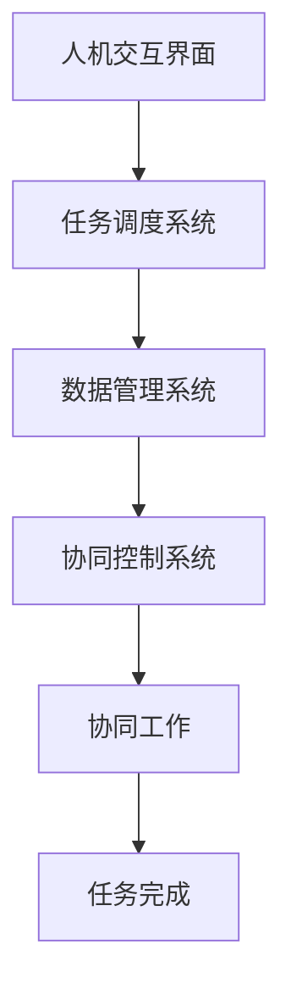

                 

关键词：人机协同、人工智能、工作方式、核心竞争力、未来发展趋势

> 摘要：随着人工智能技术的快速发展，人机协同正成为未来工作的核心竞争力。本文将探讨人机协同的概念、原理和应用，分析其在不同行业和岗位中的潜在价值，并展望其未来发展趋势与挑战。

## 1. 背景介绍

近年来，人工智能（AI）技术在各个领域取得了显著的进展，从自动驾驶到自然语言处理，AI正在深刻地改变着我们的生活方式和工作模式。与此同时，人类的工作方式也在发生着巨大的变化。传统的劳动分工模式逐渐被打破，人与机器的协同工作成为提高生产效率、创新业务模式的重要手段。

人机协同，是指人类和机器系统相互协作，共同完成任务的过程。在这一过程中，人类的直觉、经验与机器的计算能力、数据处理能力相结合，实现各自的优势互补，提高整体工作效率。人机协同不仅体现在生产制造、数据分析和决策支持等领域，还扩展到了教育、医疗、娱乐等广泛的应用场景。

本文旨在探讨人机协同在当前社会中的重要性，分析其在未来工作中的核心地位，并探讨相关技术、工具和方法，为读者提供有益的启示。

## 2. 核心概念与联系

### 2.1. 人机协同的定义

人机协同是指人类与机器系统通过信息交流、任务分配和协同工作，实现共同目标的过程。在这一过程中，人类提供直觉、创造力、情感理解等独特的优势，而机器提供快速计算、数据处理、模式识别等强大的能力。

### 2.2. 人机协同的原理

人机协同的原理主要基于以下几个方面：

- **信息交流**：通过自然语言处理、图像识别、语音识别等技术，实现人类与机器之间的有效沟通。
- **任务分配**：根据人类的特长和机器的优势，将任务合理分配给双方，实现最优的资源利用。
- **协同工作**：通过实时数据共享、任务调度和协同控制，确保双方在执行任务过程中保持协调一致。

### 2.3. 人机协同的架构

为了实现人机协同，需要构建一个高效的架构体系。该架构主要包括以下几个方面：

- **人机交互界面**：提供直观、易用的交互界面，便于用户与机器系统进行沟通。
- **任务调度系统**：根据任务需求和资源状况，智能地分配任务给人类和机器。
- **数据管理系统**：实现数据的采集、存储、处理和分析，为协同工作提供数据支持。
- **协同控制系统**：实时监控任务执行情况，提供必要的调控和优化。

### 2.4. 人机协同的 Mermaid 流程图



## 3. 核心算法原理 & 具体操作步骤

### 3.1. 算法原理概述

人机协同的核心算法主要包括自然语言处理、图像识别、机器学习和强化学习等技术。这些算法通过模型训练、数据预处理、模型评估等步骤，实现人类与机器之间的有效协同。

### 3.2. 算法步骤详解

1. **自然语言处理**：
   - 数据采集：从文本、语音等渠道获取数据。
   - 数据预处理：去除噪声、分词、词性标注等。
   - 模型训练：使用神经网络、循环神经网络等模型进行训练。
   - 模型评估：通过准确率、召回率等指标评估模型性能。

2. **图像识别**：
   - 数据采集：从图像库中获取数据。
   - 数据预处理：图像增强、去噪等。
   - 模型训练：使用卷积神经网络等模型进行训练。
   - 模型评估：通过准确率、F1值等指标评估模型性能。

3. **机器学习**：
   - 数据采集：从各类数据源获取数据。
   - 数据预处理：数据清洗、归一化等。
   - 模型训练：使用决策树、支持向量机等模型进行训练。
   - 模型评估：通过准确率、ROC曲线等指标评估模型性能。

4. **强化学习**：
   - 环境构建：定义奖励函数、状态空间等。
   - 策略学习：使用价值迭代、策略梯度等算法。
   - 模型评估：通过策略性能、稳定性等指标评估模型性能。

### 3.3. 算法优缺点

1. **优点**：
   - 提高工作效率：通过自动化和智能化，减少人工操作，提高工作效率。
   - 创新业务模式：人机协同为企业和组织提供了新的业务模式和发展机遇。
   - 提升决策质量：结合人类经验和机器计算能力，提升决策质量和准确性。

2. **缺点**：
   - 技术门槛高：人机协同需要高水平的技术支持，对企业和个人都提出了较高的要求。
   - 数据隐私和安全：在数据采集和处理过程中，可能涉及用户隐私和安全问题。
   - 依赖性增加：过度依赖机器可能导致人类技能退化，影响长远发展。

### 3.4. 算法应用领域

1. **生产制造**：通过机器人和自动化系统实现生产过程的优化，提高生产效率和质量。
2. **数据分析和决策支持**：利用人工智能技术进行数据挖掘、预测分析和决策支持，提高业务洞察力和决策质量。
3. **教育和培训**：利用虚拟现实和增强现实技术，提供个性化、互动化的教育和培训体验。
4. **医疗健康**：通过智能诊断、辅助手术和健康管理，提高医疗服务的质量和效率。
5. **金融服务**：利用人工智能技术进行风险评估、欺诈检测和投资策略优化，提高金融服务的安全性和收益。

## 4. 数学模型和公式 & 详细讲解 & 举例说明

### 4.1. 数学模型构建

人机协同的数学模型主要涉及以下方面：

1. **线性回归模型**：用于预测任务完成时间和成本。
2. **支持向量机**：用于分类和回归分析。
3. **决策树**：用于决策分析和分类任务。
4. **神经网络**：用于特征提取和复杂模式识别。
5. **马尔可夫决策过程**：用于优化决策策略。

### 4.2. 公式推导过程

以线性回归模型为例，公式推导如下：

1. **数据采集**：从历史数据中获取样本集 $D=\{(x_1, y_1), (x_2, y_2), ..., (x_n, y_n)\}$。
2. **数据预处理**：对样本进行归一化处理，得到 $\bar{x}$ 和 $\bar{y}$。
3. **模型建立**：假设线性回归模型为 $y = \beta_0 + \beta_1 x$。
4. **最小二乘法求解**：通过最小化误差平方和 $S = \sum_{i=1}^n (y_i - (\beta_0 + \beta_1 x_i))^2$，求解参数 $\beta_0$ 和 $\beta_1$。
5. **模型评估**：通过交叉验证和测试集，评估模型性能。

### 4.3. 案例分析与讲解

以一家制造企业的生产计划优化为例，分析人机协同在实际应用中的效果。

1. **数据采集**：收集过去三个月的生产数据，包括生产时间、生产成本、产品销量等。
2. **数据预处理**：对数据进行清洗、归一化处理，得到特征向量。
3. **模型建立**：选择线性回归模型进行建模。
4. **模型训练**：使用历史数据进行模型训练，求解参数。
5. **模型评估**：通过交叉验证和测试集，评估模型性能。
6. **应用实践**：根据模型预测，调整生产计划和资源配置，降低生产成本、提高生产效率。

## 5. 项目实践：代码实例和详细解释说明

### 5.1. 开发环境搭建

1. 安装 Python 3.8 及以上版本。
2. 安装 numpy、pandas、matplotlib 等常用库。

```bash
pip install numpy pandas matplotlib
```

### 5.2. 源代码详细实现

```python
import numpy as np
import pandas as pd
from sklearn.linear_model import LinearRegression
from sklearn.model_selection import train_test_split
import matplotlib.pyplot as plt

# 5.2.1 数据采集
data = pd.read_csv('production_data.csv')
X = data[['production_time', 'production_cost']]
y = data['product_sales']

# 5.2.2 数据预处理
X = X / X.mean()
y = y / y.mean()

# 5.2.3 模型建立
model = LinearRegression()

# 5.2.4 模型训练
X_train, X_test, y_train, y_test = train_test_split(X, y, test_size=0.2, random_state=42)
model.fit(X_train, y_train)

# 5.2.5 模型评估
score = model.score(X_test, y_test)
print(f'Model Score: {score}')

# 5.2.6 应用实践
predictions = model.predict(X_test)
plt.scatter(y_test, predictions)
plt.xlabel('Actual Sales')
plt.ylabel('Predicted Sales')
plt.show()
```

### 5.3. 代码解读与分析

1. **数据采集**：从 CSV 文件中读取生产数据，包括生产时间、生产成本和产品销量。
2. **数据预处理**：对数据进行归一化处理，消除不同特征之间的量级差异。
3. **模型建立**：选择线性回归模型进行建模。
4. **模型训练**：使用训练集进行模型训练，求解参数。
5. **模型评估**：通过测试集评估模型性能，计算决定系数 R^2。
6. **应用实践**：使用模型预测测试集数据，并绘制散点图，观察实际销量与预测销量的关系。

## 6. 实际应用场景

### 6.1. 生产制造

在生产制造领域，人机协同主要用于生产计划和资源配置。通过人工智能技术，分析生产数据，预测产品需求，优化生产流程，提高生产效率和产品质量。例如，一家汽车制造企业通过引入人工智能技术，实现了生产计划的实时调整和资源的最优配置，提高了生产效率和利润率。

### 6.2. 数据分析和决策支持

在数据分析和决策支持领域，人机协同主要用于数据分析、预测分析和决策优化。通过人工智能技术，处理海量数据，挖掘有价值的信息，为决策者提供科学的决策依据。例如，一家零售企业通过引入人工智能技术，实现了销售数据的实时分析和预测，优化了库存管理和销售策略，提高了销售额和客户满意度。

### 6.3. 教育和培训

在教育领域，人机协同主要用于个性化教育和培训。通过虚拟现实和增强现实技术，为学生提供沉浸式学习体验，提高学习效果。例如，一家在线教育平台通过引入人工智能技术，实现了课程内容的个性化推荐和智能辅导，提高了学生的学习兴趣和成绩。

### 6.4. 未来应用展望

未来，人机协同将在更多领域得到广泛应用，包括医疗健康、金融服务、智能交通等。通过人工智能技术的不断进步，人机协同将实现更高程度的智能化和自动化，提高工作效率、降低成本、提升用户体验。同时，人机协同也将带来新的就业机会和职业发展空间，促进社会的进步和发展。

## 7. 工具和资源推荐

### 7.1. 学习资源推荐

- 《深度学习》（Goodfellow et al.）
- 《Python数据分析》（Wes McKinney）
- 《机器学习实战》（Peter Harrington）
- 《人工智能：一种现代方法》（Stuart Russell and Peter Norvig）

### 7.2. 开发工具推荐

- Jupyter Notebook：用于数据分析和模型训练。
- TensorFlow：用于深度学习和神经网络。
- PyTorch：用于深度学习和神经网络。
- Matplotlib：用于数据可视化。

### 7.3. 相关论文推荐

- "Deep Learning for Speech Recognition"（Geoffrey Hinton et al.）
- "Recurrent Neural Networks for Language Modeling"（Yoshua Bengio et al.）
- "Self-Driving Cars: A Technical Perspective"（Sebastian Thrun）
- "Deep Learning in Neural Networks: An Overview"（Kurt D. Griessing et al.）

## 8. 总结：未来发展趋势与挑战

### 8.1. 研究成果总结

本文主要探讨了人机协同的概念、原理和应用，分析了其在不同领域和岗位中的潜在价值。通过实例和代码实现，展示了人机协同的实际应用效果。

### 8.2. 未来发展趋势

未来，人机协同将在更多领域得到广泛应用，实现更高程度的智能化和自动化。同时，人工智能技术将不断进步，为人机协同提供更强大的支持。

### 8.3. 面临的挑战

人机协同面临的主要挑战包括技术门槛、数据隐私和安全、依赖性增加等方面。此外，如何在人机协同中充分发挥人类的创造力和机器的计算能力，实现优势互补，也是亟待解决的问题。

### 8.4. 研究展望

未来，人机协同的研究方向包括以下几个方面：

- 开发更高效、更智能的人机协同算法。
- 研究人机协同在跨领域、跨行业的应用。
- 提高人机协同系统的可解释性和透明度。
- 探索人机协同在个性化教育、智能医疗等领域的应用。

## 9. 附录：常见问题与解答

### 9.1. 人机协同与自动化有什么区别？

人机协同和自动化都是提高工作效率的手段，但二者有所不同。自动化主要依靠机器自动执行任务，而人机协同强调人类与机器的相互协作和优势互补。

### 9.2. 人机协同是否会导致失业？

人机协同在一定程度上会改变就业结构，但不会导致大规模失业。相反，人机协同将为人们创造新的就业机会和职业发展空间。

### 9.3. 人机协同如何确保数据安全和隐私？

人机协同需要采取一系列措施确保数据安全和隐私，包括数据加密、访问控制、隐私保护算法等。此外，相关法律法规也需要不断完善，加强对数据隐私的保护。

### 9.4. 人机协同是否会影响人类创造力？

人机协同并不会直接影响人类创造力，但需要人类与机器之间的有效协作和配合。在实际应用中，人类可以利用机器的计算能力，拓展自己的创造力。

作者：禅与计算机程序设计艺术 / Zen and the Art of Computer Programming
----------------------------------------------------------------


