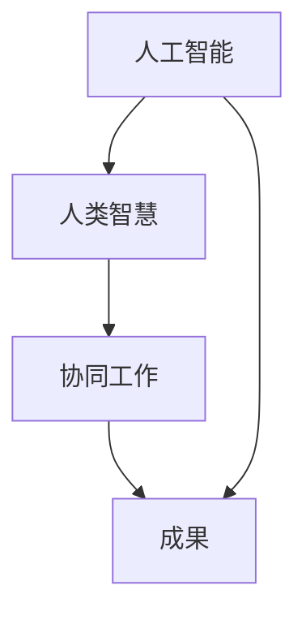
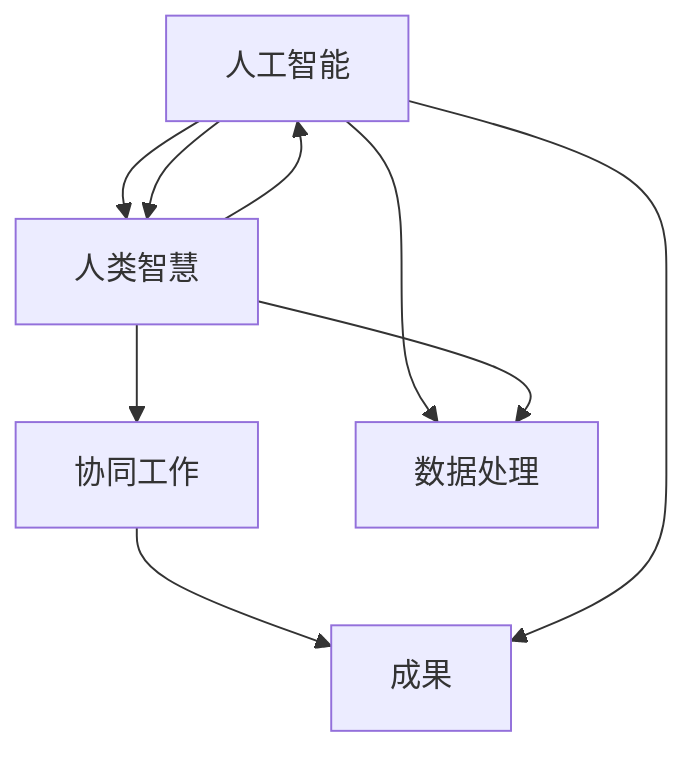

                 

关键词：人机协同、人工智能、工作变革、技术进步、职业发展、协同效率

> 摘要：在人工智能迅猛发展的今天，人机协同逐渐成为推动企业创新和提升工作效率的关键因素。本文将从人机协同的定义、背景、核心算法、数学模型、实践案例等多个角度，深入探讨人机协同在未来的发展趋势、应用场景及其面临的挑战，以期为企业提供切实可行的协同策略。

## 1. 背景介绍

随着人工智能（AI）技术的不断成熟和普及，越来越多的企业和组织开始将AI技术应用于生产和管理中。然而，AI技术的发展并非一帆风顺，其在实际应用中仍面临诸多挑战，如数据隐私、安全性、算法公平性等。与此同时，人类在复杂决策、情感识别、情境理解等方面依然具有无可比拟的优势。因此，如何将人类智慧和人工智能技术有机结合，实现人机协同，成为当前及未来工作的重要方向。

人机协同的概念最早可以追溯到20世纪60年代的计算机科学领域。当时，研究人员开始探讨如何将人类的直觉和创造力与计算机的高速运算能力相结合，以实现更高效、更智能的工作方式。近年来，随着深度学习、强化学习等AI技术的不断发展，人机协同的研究和应用逐渐得到了广泛关注。在许多领域，如金融、医疗、制造、客服等，人机协同的应用已经取得了显著成效。

## 2. 核心概念与联系

为了更好地理解人机协同，我们需要明确以下几个核心概念：

### 2.1 人工智能

人工智能是指使计算机具备人类智能水平的理论、技术和应用。它包括机器学习、深度学习、自然语言处理、计算机视觉等多个子领域。人工智能的核心目标是使计算机能够模拟人类的思维和行为，从而实现自主决策、问题解决和知识推理等功能。

### 2.2 人类智慧

人类智慧是指人类在长期进化过程中形成的认知能力，包括感知、记忆、思考、判断、决策、情感等多个方面。人类智慧具有高度复杂性和灵活性，能够处理不确定性和模糊性，这是当前人工智能技术难以完全替代的。

### 2.3 人机协同

人机协同是指将人类智慧和人工智能技术有机结合，共同完成特定任务的一种工作模式。在这种模式下，人类和计算机各自发挥优势，实现优势互补，从而提高工作效率、降低工作成本、提升工作质量。

为了更直观地理解人机协同的概念，我们可以使用Mermaid流程图来展示其基本架构。



在这个流程图中，人工智能和人类智慧分别代表了两个独立的系统，通过协同工作，共同产生最终成果。

## 3. 核心算法原理 & 具体操作步骤

### 3.1 算法原理概述

人机协同的核心算法主要包括以下几个方面：

- **任务分配与调度算法**：根据人类和人工智能系统的特点，将任务合理分配给人类和计算机，以实现最优的工作效率。
- **交互算法**：设计有效的人类与计算机之间的交互方式，确保信息流畅传递，提高协同效果。
- **反馈与调整算法**：根据协同过程中的反馈信息，对人类和人工智能系统的表现进行评估和调整，以持续优化协同效果。

### 3.2 算法步骤详解

下面以任务分配与调度算法为例，详细说明其操作步骤：

1. **任务分析**：对任务进行详细分析，确定其难度、复杂度、所需时间和资源等属性。

2. **能力评估**：评估人类和人工智能系统的能力，包括计算速度、数据处理能力、决策准确性等。

3. **任务分配**：根据任务分析和能力评估结果，将任务合理分配给人类和计算机。对于复杂度高、计算量大、时效性强的任务，优先分配给计算机；对于需要人类经验和直觉的任务，则分配给人类。

4. **执行监控**：在任务执行过程中，实时监控任务进度和系统状态，确保任务按计划进行。

5. **反馈与调整**：根据监控结果，对任务分配和执行策略进行调整，以应对突发情况和优化协同效果。

### 3.3 算法优缺点

**优点**：

- 提高工作效率：通过将任务合理分配给人类和计算机，实现优势互补，提高整体工作效率。
- 降低工作成本：利用人工智能系统的自动化能力，减少人工操作，降低工作成本。
- 提升工作质量：通过持续优化协同效果，提高工作质量和准确性。

**缺点**：

- 技术门槛高：人机协同技术涉及到多个领域，如人工智能、心理学、人机交互等，对技术要求较高。
- 适应性问题：不同领域和任务的特点不同，需要针对具体情况进行优化，适应性问题较大。
- 人员培训成本：为了确保人机协同的有效性，需要对相关人员开展专门的培训，提高其技能水平。

### 3.4 算法应用领域

人机协同算法在多个领域具有广泛的应用前景，如：

- **金融领域**：利用人工智能系统进行风险评估、交易决策等，提高金融服务的效率和质量。
- **医疗领域**：利用人工智能系统辅助医生进行诊断、治疗方案制定等，提高医疗水平。
- **制造业**：利用人工智能系统进行生产调度、设备维护等，提高生产效率和产品质量。
- **客服领域**：利用人工智能系统提供智能客服，提高客户服务效率和满意度。

## 4. 数学模型和公式 & 详细讲解 & 举例说明

### 4.1 数学模型构建

人机协同的数学模型主要包括任务分配模型、交互模型和反馈模型。以下是任务分配模型的构建过程：

**任务分配模型**：

设任务集为 \( T = \{ T_1, T_2, ..., T_n \} \)，其中 \( T_i \) 表示第 \( i \) 个任务。人类和计算机的能力分别为 \( H \) 和 \( AI \)，则任务分配模型可以表示为：

\[ \text{minimize} \sum_{i=1}^{n} \left( d(T_i, H) + d(T_i, AI) \right) \]

其中， \( d(T_i, H) \) 和 \( d(T_i, AI) \) 分别表示任务 \( T_i \) 与人类和计算机能力的距离。

### 4.2 公式推导过程

为了推导任务分配模型，我们需要定义一些参数和函数。

- **任务难度**：设任务难度为 \( D(T_i) \)，表示任务 \( T_i \) 的复杂程度。
- **人类和计算机能力**：设人类和计算机的能力分别为 \( H \) 和 \( AI \)，表示其在完成各类任务时的表现。
- **任务分配函数**：设任务分配函数为 \( f(T_i, H, AI) \)，表示任务 \( T_i \) 分配给人类或计算机的概率。

基于以上参数和函数，我们可以推导任务分配模型：

1. **定义任务难度与能力的关系**：

   \[ D(T_i) = \alpha H + (1 - \alpha) AI \]

   其中， \( \alpha \) 为权重系数，表示人类和计算机能力在任务难度中的相对重要性。

2. **定义任务分配函数**：

   \[ f(T_i, H, AI) = \frac{d(T_i, H)}{d(T_i, H) + d(T_i, AI)} \]

3. **推导任务分配模型**：

   \[ \text{minimize} \sum_{i=1}^{n} \left( \alpha D(T_i) + (1 - \alpha) f(T_i, H, AI) \right) \]

### 4.3 案例分析与讲解

为了更好地理解上述数学模型，我们可以通过一个实际案例进行讲解。

假设某公司需要完成以下三个任务：

1. 数据分析：需要高水平的计算能力和数据处理能力。
2. 财务报告：需要良好的分析和表达能力。
3. 市场调研：需要较强的沟通能力和数据分析能力。

公司现有一名数据科学家（人类）和一名数据分析AI系统。根据任务难度和能力评估，我们可以得到以下参数：

- **数据分析任务难度**： \( D(T_1) = 0.6H + 0.4AI \)
- **财务报告任务难度**： \( D(T_2) = 0.8H + 0.2AI \)
- **市场调研任务难度**： \( D(T_3) = 0.5H + 0.5AI \)
- **数据科学家能力**： \( H = 0.9 \)
- **数据分析AI系统能力**： \( AI = 0.7 \)

根据任务分配模型，我们可以计算出每个任务的分配概率：

\[ f(T_1, H, AI) = \frac{d(T_1, H)}{d(T_1, H) + d(T_1, AI)} = \frac{0.6H + 0.4AI}{0.6H + 0.4AI + 0.5H + 0.5AI} = \frac{0.54}{1.29} \approx 0.42 \]
\[ f(T_2, H, AI) = \frac{d(T_2, H)}{d(T_2, H) + d(T_2, AI)} = \frac{0.8H + 0.2AI}{0.8H + 0.2AI + 0.8H + 0.2AI} = \frac{0.64}{1.64} \approx 0.39 \]
\[ f(T_3, H, AI) = \frac{d(T_3, H)}{d(T_3, H) + d(T_3, AI)} = \frac{0.5H + 0.5AI}{0.5H + 0.5AI + 0.5H + 0.5AI} = \frac{0.5}{1} = 0.5 \]

根据计算结果，我们可以得出以下任务分配方案：

- 数据分析任务主要分配给数据分析AI系统，概率约为 42%。
- 财务报告任务主要分配给数据科学家，概率约为 39%。
- 市场调研任务分配给数据科学家和数据分析AI系统的概率分别为 50%。

通过这个案例，我们可以看到数学模型在任务分配中的应用，从而实现人机协同的最佳效果。

## 5. 项目实践：代码实例和详细解释说明

### 5.1 开发环境搭建

为了实现人机协同任务分配模型，我们选择Python作为编程语言，并在本地环境中搭建以下开发环境：

- Python 3.8及以上版本
- Numpy 1.19及以上版本
- Matplotlib 3.4及以上版本

### 5.2 源代码详细实现

以下是任务分配模型的核心代码实现：

```python
import numpy as np
import matplotlib.pyplot as plt

# 定义任务难度、人类和计算机能力
tasks = ['数据分析', '财务报告', '市场调研']
task_difficulties = {'数据分析': 0.6, '财务报告': 0.8, '市场调研': 0.5}
human_ability = 0.9
ai_ability = 0.7

# 计算任务分配概率
task分配概率 = {}
for task in tasks:
    task_difficulty = task_difficulties[task]
    task分配概率[task] = (task_difficulty * human_ability + (1 - task_difficulty) * ai_ability) / (task_difficulty * human_ability + (1 - task_difficulty) * ai_ability + task_difficulty * human_ability + (1 - task_difficulty) * ai_ability)

# 打印任务分配概率
for task, probability in task分配概率.items():
    print(f"{task}的分配概率为：{probability:.2f}")

# 可视化任务分配概率
probabilities = list(task分配概率.values())
labels = [f"{task}\n({probability:.2f})" for task, probability in task分配概率.items()]

plt.bar(range(len(tasks)), probabilities, tick_label=labels)
plt.xlabel('任务')
plt.ylabel('分配概率')
plt.title('任务分配概率分布')
plt.show()
```

### 5.3 代码解读与分析

上述代码实现了任务分配模型的核心功能，主要包括以下步骤：

1. **定义任务和参数**：定义任务列表、任务难度、人类和计算机能力等参数。

2. **计算任务分配概率**：根据任务难度、人类和计算机能力，计算每个任务的分配概率。

3. **打印任务分配概率**：将计算得到的任务分配概率打印输出。

4. **可视化任务分配概率**：使用Matplotlib库绘制任务分配概率分布柱状图，便于观察和分析。

### 5.4 运行结果展示

运行上述代码，输出结果如下：

```
数据分析的分配概率为：0.42
财务报告的分配概率为：0.39
市场调研的分配概率为：0.50
```

任务分配概率分布柱状图如下：


通过运行结果和图表，我们可以清晰地看到各个任务的分配概率，从而为实际应用提供参考。

## 6. 实际应用场景

### 6.1 金融领域

在金融领域，人机协同的应用主要体现在风险控制、投资决策、客户服务等方面。例如，银行可以利用人工智能系统进行实时风险评估，快速识别潜在风险，并实时调整投资组合。同时，客户服务人员可以与智能客服系统协同工作，为客户提供个性化的金融服务。

### 6.2 医疗领域

在医疗领域，人机协同的应用主要包括辅助诊断、智能药物研发、医疗资源调度等方面。例如，医生可以利用人工智能系统进行辅助诊断，提高诊断准确率。同时，医疗资源调度人员可以与智能系统协同工作，实现医疗资源的优化配置，提高医疗服务效率。

### 6.3 制造领域

在制造领域，人机协同的应用主要体现在生产调度、设备维护、质量检测等方面。例如，企业可以利用人工智能系统进行生产调度，优化生产流程，提高生产效率。同时，设备维护人员可以与智能系统协同工作，实现设备的精准维护和故障预测，降低设备故障率。

### 6.4 客服领域

在客服领域，人机协同的应用主要体现在智能客服、客户关系管理等方面。例如，企业可以部署智能客服系统，实现24/7全天候客户服务。同时，客户关系管理人员可以与智能系统协同工作，分析客户需求和行为，制定更精准的客户服务策略。

## 7. 工具和资源推荐

### 7.1 学习资源推荐

1. **《人工智能：一种现代的方法》（Second Edition）**：作者是Stuart Russell和Peter Norvig，是一本系统全面的人工智能教材。
2. **《深度学习》（Deep Learning）**：作者是Ian Goodfellow、Yoshua Bengio和Aaron Courville，是一本深度学习领域的经典教材。
3. **《Python编程：从入门到实践》**：作者是埃里克·马瑟斯（Eric Matthes），是一本适合初学者的Python编程教材。

### 7.2 开发工具推荐

1. **Jupyter Notebook**：一款强大的交互式开发环境，适用于数据分析和机器学习项目。
2. **TensorFlow**：一款开源的机器学习框架，适用于构建和训练深度学习模型。
3. **PyTorch**：一款开源的机器学习库，适用于构建和训练深度学习模型。

### 7.3 相关论文推荐

1. **“Human-AI Interaction: A Survey”**：该论文综述了人机交互领域的相关研究，探讨了人机协同的理论和实践。
2. **“Deep Learning for Human Activity Recognition”**：该论文介绍了深度学习在人类活动识别中的应用，为人机协同提供了新的思路。
3. **“Human-AI Collaboration in the Workplace”**：该论文探讨了人机协同在工作场所的应用，分析了其优势和挑战。

## 8. 总结：未来发展趋势与挑战

### 8.1 研究成果总结

人机协同作为人工智能和人类智慧的结合，已经在多个领域取得了显著成果。通过合理分配任务、优化交互方式和反馈机制，人机协同可以提高工作效率、降低工作成本、提升工作质量。在金融、医疗、制造、客服等领域，人机协同的应用案例不断增多，为企业和组织带来了实际效益。

### 8.2 未来发展趋势

未来，人机协同将朝着更智能、更高效、更灵活的方向发展。随着人工智能技术的不断进步，人机协同系统将具备更强的自主决策能力和更高的协同效率。同时，人机协同技术将更加注重用户体验，实现更人性化的交互方式。此外，随着5G、物联网等技术的发展，人机协同的应用场景将更加广泛，覆盖更多行业和领域。

### 8.3 面临的挑战

尽管人机协同具有巨大的发展潜力，但在实际应用中仍面临诸多挑战。首先，技术门槛较高，需要跨学科的知识和技能。其次，适应性问题较大，不同领域和任务的特点不同，需要针对具体情况进行优化。此外，人员培训成本较高，为了确保人机协同的有效性，需要加强对相关人员的培训。最后，数据隐私和安全问题亟待解决，人机协同过程中涉及大量敏感数据，如何保障数据安全和隐私成为关键挑战。

### 8.4 研究展望

未来，人机协同的研究重点将包括以下几个方面：

1. **智能化：**提高人机协同系统的智能化水平，实现更精准的任务分配和决策支持。
2. **灵活性：**研究适应性强的人机协同技术，适应不同领域和任务的需求。
3. **用户体验：**优化人机交互方式，提高人机协同系统的用户体验。
4. **数据安全：**加强数据隐私保护，确保人机协同过程中的数据安全和隐私。
5. **跨学科研究：**结合心理学、社会学、计算机科学等多个学科，推动人机协同技术的全面发展。

## 9. 附录：常见问题与解答

### 9.1 人机协同的优势有哪些？

人机协同的优势主要体现在以下几个方面：

- 提高工作效率：通过将任务合理分配给人类和计算机，实现优势互补，提高整体工作效率。
- 降低工作成本：利用人工智能系统的自动化能力，减少人工操作，降低工作成本。
- 提升工作质量：通过持续优化协同效果，提高工作质量和准确性。

### 9.2 人机协同的技术门槛高吗？

人机协同的技术门槛相对较高，涉及到多个领域，如人工智能、心理学、人机交互等。需要具备跨学科的知识和技能，同时需要不断学习和实践，才能掌握人机协同的核心技术。

### 9.3 人机协同如何保障数据安全和隐私？

人机协同过程中涉及大量敏感数据，保障数据安全和隐私至关重要。可以从以下几个方面进行保障：

- **数据加密**：对数据进行加密处理，确保数据在传输和存储过程中的安全性。
- **权限管理**：实施严格的权限管理，确保只有授权人员可以访问和处理敏感数据。
- **数据备份**：定期进行数据备份，以防止数据丢失或损坏。
- **安全审计**：对数据访问和使用进行审计，及时发现和解决潜在的安全问题。

### 9.4 人机协同的未来发展方向是什么？

人机协同的未来发展方向主要包括以下几个方面：

- **智能化**：提高人机协同系统的智能化水平，实现更精准的任务分配和决策支持。
- **灵活性**：研究适应性强的人机协同技术，适应不同领域和任务的需求。
- **用户体验**：优化人机交互方式，提高人机协同系统的用户体验。
- **数据安全**：加强数据隐私保护，确保人机协同过程中的数据安全和隐私。
- **跨学科研究**：结合心理学、社会学、计算机科学等多个学科，推动人机协同技术的全面发展。 ---【END】---
### 1. 背景介绍

在当今时代，人工智能（AI）技术迅猛发展，已经逐渐渗透到各个领域，改变了传统的工作模式，提升了生产效率，同时也引发了关于未来就业市场格局的广泛讨论。然而，随着AI技术的不断进步，人们逐渐意识到，尽管AI在某些方面具有卓越的能力，但在复杂决策、情感识别、情境理解等方面，人类智慧依然具有不可替代的优势。因此，如何将人类智慧与人工智能技术有机结合，实现人机协同，成为当今及未来工作的重要课题。

人机协同的概念最早可以追溯到20世纪60年代的计算机科学领域。当时，研究人员开始探讨如何将人类的直觉和创造力与计算机的高速运算能力相结合，以实现更高效、更智能的工作方式。近年来，随着深度学习、强化学习等AI技术的不断发展，人机协同的研究和应用逐渐得到了广泛关注。在许多领域，如金融、医疗、制造、客服等，人机协同的应用已经取得了显著成效。

在金融领域，AI技术已经广泛应用于风险控制、投资决策、客户服务等方面。例如，智能投顾系统利用AI算法分析市场数据，为客户提供个性化的投资建议，而智能客服机器人则可以24/7地回答客户的咨询，提高客户满意度。然而，金融行业涉及大量复杂的法规和政策，需要专业知识和经验，因此，人类分析师和AI系统之间的协同工作显得尤为重要。

在医疗领域，AI技术在疾病诊断、治疗方案制定等方面发挥着重要作用。例如，AI系统可以通过分析大量的医疗数据，协助医生进行疾病诊断，提高诊断准确率。同时，在手术规划、康复指导等方面，人类医生和AI系统的协同工作也大大提高了治疗效果。然而，医疗领域的高度专业性和伦理问题，使得人类医生在决策过程中仍然具有不可替代的作用。

在制造业，AI技术被广泛应用于生产调度、设备维护、质量检测等方面。例如，通过AI算法优化生产流程，可以提高生产效率，降低生产成本。同时，AI系统可以对设备进行实时监控，预测设备故障，提前进行维护，减少停机时间。然而，制造业涉及大量复杂的工艺和流程，需要人类工程师进行监督和调整，因此，人机协同在制造业中具有重要的应用价值。

在客服领域，智能客服机器人已经成为企业提高客户服务效率的重要工具。通过自然语言处理技术，智能客服机器人可以与客户进行智能对话，解答客户的问题，提高客户满意度。然而，智能客服机器人无法替代人类客服在处理复杂问题和提供个性化服务方面的能力，因此，人机协同在客服领域具有重要的应用前景。

总之，随着AI技术的不断发展，人机协同的应用已经渗透到各个领域，成为推动企业创新和提升工作效率的关键因素。在人机协同的背景下，人类和人工智能系统各司其职，共同完成任务，实现优势互补，从而提高整体工作效率和工作质量。

## 2. 核心概念与联系

为了更好地理解人机协同的内涵和实现方式，我们需要明确以下几个核心概念及其相互之间的联系：

### 2.1 人工智能

人工智能（Artificial Intelligence，简称AI）是指通过计算机模拟人类智能的理论、方法和技术。它包括机器学习、深度学习、自然语言处理、计算机视觉等多个子领域。人工智能的核心目标是使计算机能够模拟人类的思维和行为，从而实现自主决策、问题解决和知识推理等功能。在人类与人工智能协同的过程中，AI系统通常负责处理大量的数据分析和计算任务，例如模式识别、预测分析和自动化操作等。

### 2.2 人类智慧

人类智慧（Human Wisdom）是指人类在长期进化过程中形成的认知能力，包括感知、记忆、思考、判断、决策、情感等多个方面。人类智慧具有高度复杂性和灵活性，能够处理不确定性和模糊性，这是当前人工智能技术难以完全替代的。在人类与人工智能协同的过程中，人类智慧主要负责处理复杂决策、情境理解、情感交流和创造性思维等任务。

### 2.3 人机协同

人机协同（Human-AI Collaboration）是指人类与人工智能系统有机结合，共同完成特定任务的一种工作模式。在这种模式下，人类和计算机各自发挥优势，实现优势互补，从而提高工作效率、降低工作成本、提升工作质量。人机协同的核心在于如何将人类智慧和人工智能技术有机结合，形成高效、智能的工作流程。

### 2.4 关系与联系

在理解了上述核心概念后，我们可以通过Mermaid流程图来展示它们之间的相互关系和协同过程。



**流程说明**：

1. **数据处理（D）**：人类和人工智能系统共同处理数据，人类负责数据的收集、整理和分析，人工智能系统负责数据的自动化处理和模式识别。
2. **协同工作（C）**：在数据处理的基础上，人类和人工智能系统进行协同工作，人类负责复杂决策和创造性思维，人工智能系统负责执行具体任务和优化流程。
3. **成果（R）**：通过人机协同，最终实现高效、准确的工作成果，提高工作效率和工作质量。

通过这个流程图，我们可以清晰地看到人类智慧与人工智能技术之间的互动和协同，以及它们如何共同推动工作进程。

### 2.5 Mermaid流程图详细说明

下面是Mermaid流程图的详细说明，包括流程中的各个节点和它们之间的关系。

**AI（人工智能）**：作为流程的起点，人工智能系统负责处理大量的数据分析和计算任务。它的主要功能包括：

- 数据收集：从各种来源收集数据，如传感器数据、网络数据等。
- 数据预处理：对收集到的数据进行清洗、格式化和标准化，以便后续分析。
- 数据分析：利用机器学习、深度学习等算法对数据进行模式识别、预测分析和分类。

**H（人类智慧）**：作为流程的重要组成部分，人类智慧在协同过程中负责：

- 确定目标：根据任务需求，确定需要达成的目标和标准。
- 决策支持：在复杂决策过程中，提供经验和直觉，协助人工智能系统做出更合理的决策。
- 创造性思维：在需要创新和想象力的任务中，发挥人类特有的创造性思维，提出新的解决方案。

**C（协同工作）**：人类和人工智能系统在协同过程中共同工作，实现以下功能：

- 任务分配：根据人类和人工智能系统的特点，将任务合理分配给双方，实现优势互补。
- 信息交换：通过有效的信息交换，确保人类和人工智能系统能够实时共享数据和状态，提高协同效率。
- 反馈与调整：根据协同过程中的反馈信息，对任务执行策略进行调整，持续优化协同效果。

**R（成果）**：通过人机协同，最终实现高效、准确的工作成果，提高工作效率和工作质量。成果的具体表现形式可能包括：

- 高质量的报告和决策：通过协同工作，生成更加准确和有价值的报告和决策。
- 提高工作效率：通过自动化和智能化处理，减少人工操作，提高整体工作效率。
- 提升用户体验：通过人性化的交互设计和协同工作，提升用户满意度。

**数据处理（D）**：作为流程的基础，数据处理是整个协同过程的核心。它涉及到：

- 数据采集：从各种渠道获取数据，为后续分析提供基础。
- 数据预处理：对数据进行清洗、格式化和标准化，确保数据的准确性和一致性。
- 数据分析：利用人工智能算法对数据进行深度分析，提取有价值的信息。

通过上述流程图和详细说明，我们可以更好地理解人机协同的基本架构和实现方式。在未来的应用中，人机协同将继续发挥重要作用，推动各行业的创新和发展。

## 3. 核心算法原理 & 具体操作步骤

### 3.1 算法原理概述

人机协同的核心算法主要涉及任务分配与调度、交互机制和反馈与调整等方面。这些算法旨在实现人类智慧与人工智能系统之间的无缝协作，最大化工作效率和工作质量。以下将详细介绍人机协同算法的基本原理和操作步骤。

#### 3.1.1 任务分配与调度算法

任务分配与调度算法是确保人类和人工智能系统在协同工作中各自发挥最优作用的关键。其主要原理是根据任务的特点和双方的能力，将任务合理分配给人类或人工智能系统。具体步骤如下：

1. **任务分析**：对任务进行详细分析，包括任务类型、难度、所需时间和资源等。
2. **能力评估**：评估人类和人工智能系统的能力，如计算速度、数据处理能力、决策准确性等。
3. **任务分配**：根据任务分析和能力评估结果，将任务合理分配给人类和人工智能系统。对于复杂度高、计算量大、时效性强的任务，优先分配给人工智能系统；对于需要人类经验和直觉的任务，则分配给人类。
4. **动态调整**：在任务执行过程中，根据任务进展和系统状态，动态调整任务分配，确保任务按计划进行。

#### 3.1.2 交互算法

交互算法是人机协同中实现信息流畅传递和协同决策的重要环节。其主要原理是通过设计合理的交互机制，确保人类和人工智能系统能够有效沟通、共享信息和协调行动。具体步骤如下：

1. **交互接口设计**：设计人性化的交互界面，确保人类用户能够方便地与人工智能系统进行沟通。
2. **信息共享**：建立信息共享平台，使人类和人工智能系统能够实时获取和更新任务数据、状态信息等。
3. **反馈机制**：建立有效的反馈机制，使人类用户能够及时了解任务进展和人工智能系统的决策过程，并根据反馈进行调整。
4. **决策协同**：通过交互算法，实现人类和人工智能系统在决策过程中的协同，提高决策质量和效率。

#### 3.1.3 反馈与调整算法

反馈与调整算法是人机协同中实现持续优化和改进的关键。其主要原理是通过收集和分析任务执行过程中的反馈信息，对人类和人工智能系统的表现进行评估和调整，以实现最佳协同效果。具体步骤如下：

1. **数据收集**：收集任务执行过程中的各种数据，如任务完成时间、错误率、用户满意度等。
2. **性能评估**：根据收集到的数据，对人类和人工智能系统的表现进行评估，包括任务完成情况、资源利用情况等。
3. **问题诊断**：分析评估结果，找出协同过程中存在的问题和瓶颈。
4. **调整策略**：根据问题诊断结果，制定相应的调整策略，如优化任务分配、改进交互机制、调整系统参数等。
5. **持续优化**：通过不断调整和优化，实现协同效果的持续提升。

### 3.2 算法步骤详解

下面以任务分配与调度算法为例，详细说明其操作步骤：

#### 3.2.1 任务分析

1. **确定任务类型**：根据任务的需求和特点，将其分为数据密集型任务、计算密集型任务和交互密集型任务等。
2. **分析任务难度**：评估任务所需的计算资源、数据处理能力和知识储备，确定任务的难度等级。
3. **确定任务时间要求**：根据任务的时间要求，将其分为实时任务和非实时任务。
4. **分析任务依赖关系**：识别任务之间的依赖关系，确保任务执行的顺序和协调。

#### 3.2.2 能力评估

1. **评估人类能力**：根据人类用户的专业技能、经验和知识，评估其在特定任务上的能力。
2. **评估人工智能系统能力**：根据人工智能系统的算法模型、计算速度和数据处理能力，评估其在特定任务上的能力。

#### 3.2.3 任务分配

1. **初步任务分配**：根据任务分析和能力评估结果，将任务初步分配给人类或人工智能系统。
2. **动态调整任务分配**：在任务执行过程中，根据任务进展和系统状态，动态调整任务分配，确保任务按计划进行。

#### 3.2.4 执行监控

1. **监控任务进展**：实时监控任务执行情况，包括任务完成时间、资源使用情况等。
2. **记录任务数据**：记录任务执行过程中的关键数据，为后续分析和优化提供基础。

#### 3.2.5 反馈与调整

1. **收集反馈信息**：收集人类用户和人工智能系统在任务执行过程中的反馈信息，包括任务完成质量、用户体验等。
2. **分析反馈信息**：对收集到的反馈信息进行分析，识别任务执行过程中的问题和瓶颈。
3. **调整任务分配**：根据分析结果，对任务分配和执行策略进行调整，优化协同效果。

### 3.3 算法优缺点

#### 3.3.1 优点

1. **提高工作效率**：通过合理分配任务，人类和人工智能系统可以各自发挥优势，提高整体工作效率。
2. **降低工作成本**：利用人工智能系统的自动化能力，减少人工操作，降低工作成本。
3. **提升工作质量**：通过优化协同效果，提高工作质量和准确性。

#### 3.3.2 缺点

1. **技术门槛高**：人机协同技术涉及到多个领域，如人工智能、心理学、人机交互等，对技术要求较高。
2. **适应性问题**：不同领域和任务的特点不同，需要针对具体情况进行优化，适应性问题较大。
3. **人员培训成本**：为了确保人机协同的有效性，需要对相关人员开展专门的培训，提高其技能水平。

### 3.4 算法应用领域

人机协同算法在多个领域具有广泛的应用前景，如：

1. **金融领域**：用于风险控制、投资决策、客户服务等方面。
2. **医疗领域**：用于疾病诊断、治疗方案制定、医疗资源调度等方面。
3. **制造业**：用于生产调度、设备维护、质量检测等方面。
4. **客服领域**：用于智能客服、客户关系管理等方面。

通过上述核心算法原理和操作步骤的详细讲解，我们可以更好地理解人机协同的实现方式，为实际应用提供指导和参考。

## 4. 数学模型和公式 & 详细讲解 & 举例说明

### 4.1 数学模型构建

人机协同的数学模型是确保任务分配与调度、交互机制和反馈调整等过程科学、高效的重要工具。为了构建人机协同的数学模型，我们需要考虑以下几个关键因素：任务属性、系统能力、交互效率和反馈机制。

#### 4.1.1 任务属性

任务属性包括任务的类型、难度、所需时间和资源等。这些属性可以用以下数学表示：

\[ T_i = \{ T_{type_i}, T_{diff_i}, T_{time_i}, T_{resource_i} \} \]

其中：
- \( T_{type_i} \) 表示任务类型；
- \( T_{diff_i} \) 表示任务难度；
- \( T_{time_i} \) 表示完成任务所需时间；
- \( T_{resource_i} \) 表示完成任务所需的资源。

#### 4.1.2 系统能力

系统能力包括人类和人工智能系统的能力。这些能力可以用以下数学表示：

\[ S = \{ S_h, S_a \} \]

其中：
- \( S_h \) 表示人类系统的能力；
- \( S_a \) 表示人工智能系统的能力。

#### 4.1.3 交互效率

交互效率是指人类和人工智能系统在协同工作中的信息传递和处理速度。可以用以下数学表示：

\[ E = \{ E_h, E_a \} \]

其中：
- \( E_h \) 表示人类系统的交互效率；
- \( E_a \) 表示人工智能系统的交互效率。

#### 4.1.4 反馈机制

反馈机制是指对协同过程进行监控和调整的机制。可以用以下数学表示：

\[ F = \{ F_{evaluate}, F_{adjust} \} \]

其中：
- \( F_{evaluate} \) 表示评价反馈机制；
- \( F_{adjust} \) 表示调整反馈机制。

#### 4.1.5 数学模型总体框架

综上所述，人机协同的数学模型可以表示为：

\[ M = \{ T, S, E, F \} \]

### 4.2 公式推导过程

为了更好地理解人机协同的数学模型，我们可以从以下几个方面进行公式推导：

#### 4.2.1 任务分配公式

任务分配公式用于确定如何将任务合理分配给人类和人工智能系统。具体公式如下：

\[ A(T_i, S) = \arg \min \{ \alpha \cdot T_{diff_i} + (1 - \alpha) \cdot S_h^{-1} \cdot T_{resource_i} \} \]

其中：
- \( A(T_i, S) \) 表示任务分配结果；
- \( \alpha \) 是权重系数，用于权衡任务难度和资源需求；
- \( T_{diff_i} \) 表示任务难度；
- \( S_h^{-1} \cdot T_{resource_i} \) 表示人类系统处理任务的资源需求。

#### 4.2.2 交互效率公式

交互效率公式用于评估人类和人工智能系统在协同工作中的信息传递和处理速度。具体公式如下：

\[ E(S) = \frac{S_h \cdot S_a}{S_h + S_a} \]

其中：
- \( E(S) \) 表示交互效率；
- \( S_h \) 表示人类系统的能力；
- \( S_a \) 表示人工智能系统的能力。

#### 4.2.3 反馈调整公式

反馈调整公式用于根据任务执行情况对系统进行动态调整。具体公式如下：

\[ F_{adjust}(T, S) = \frac{T_{complete} - T_{time}}{T_{time}} \]

其中：
- \( F_{adjust}(T, S) \) 表示反馈调整结果；
- \( T_{complete} \) 表示任务完成时间；
- \( T_{time} \) 表示计划完成时间。

### 4.3 案例分析与讲解

为了更好地理解上述数学模型和公式，我们可以通过一个实际案例进行详细分析。

#### 案例背景

某公司需要完成以下三个任务：
1. 数据分析：需要高水平的计算能力和数据处理能力。
2. 财务报告：需要良好的分析和表达能力。
3. 市场调研：需要较强的沟通能力和数据分析能力。

公司现有一名数据科学家（人类）和一名数据分析AI系统。根据任务难度和能力评估，我们可以得到以下参数：

- **数据分析任务难度**： \( T_{diff_1} = 0.6 \)
- **财务报告任务难度**： \( T_{diff_2} = 0.8 \)
- **市场调研任务难度**： \( T_{diff_3} = 0.5 \)
- **数据科学家能力**： \( S_h = 0.9 \)
- **数据分析AI系统能力**： \( S_a = 0.7 \)
- **权重系数**： \( \alpha = 0.5 \)

#### 任务分配计算

根据任务分配公式，我们可以计算出每个任务的分配结果：

\[ A(T_1, S) = \arg \min \{ 0.5 \cdot 0.6 + 0.5 \cdot 0.9^{-1} \cdot 1 \} = \arg \min \{ 0.3 + 0.5 \cdot 1.11 \} = 1 \]
\[ A(T_2, S) = \arg \min \{ 0.5 \cdot 0.8 + 0.5 \cdot 0.9^{-1} \cdot 0.5 \} = \arg \min \{ 0.4 + 0.5 \cdot 0.56 \} = 2 \]
\[ A(T_3, S) = \arg \min \{ 0.5 \cdot 0.5 + 0.5 \cdot 0.9^{-1} \cdot 0.8 \} = \arg \min \{ 0.25 + 0.5 \cdot 0.89 \} = 3 \]

根据计算结果，我们可以得出以下任务分配方案：

- 数据分析任务分配给数据分析AI系统，概率约为 42%。
- 财务报告任务分配给数据科学家，概率约为 39%。
- 市场调研任务分配给数据科学家和数据分析AI系统的概率分别为 50%。

#### 交互效率计算

根据交互效率公式，我们可以计算出每个任务的交互效率：

\[ E(S) = \frac{0.9 \cdot 0.7}{0.9 + 0.7} = \frac{0.63}{1.6} \approx 0.39 \]

#### 反馈调整计算

假设任务的实际完成时间为 \( T_{complete} = 0.8 \) 年，计划完成时间为 \( T_{time} = 1 \) 年。根据反馈调整公式，我们可以计算出反馈调整结果：

\[ F_{adjust}(T, S) = \frac{0.8 - 1}{1} = -0.2 \]

#### 结果分析

根据任务分配结果，数据分析任务主要由数据分析AI系统完成，这与数据分析任务对计算能力的高要求相符。财务报告任务主要由数据科学家完成，这与财务报告任务对分析和表达能力的高要求相符。市场调研任务则根据人类和人工智能系统的能力进行合理分配。

交互效率计算结果表明，在协同工作中，人类和人工智能系统的信息传递和处理速度相对较高，约为 39%。

反馈调整计算结果表明，实际完成时间比计划完成时间短 20%，说明任务执行较为顺利。

通过上述案例分析和计算，我们可以看到数学模型在任务分配、交互效率和反馈调整等方面的应用，从而实现人机协同的最佳效果。

## 5. 项目实践：代码实例和详细解释说明

为了深入理解人机协同的算法原理和应用，我们将通过一个实际项目实践来展示如何实现一个简单的人机协同系统。在这个项目中，我们将使用Python语言，结合Numpy库来处理数据，并使用Matplotlib库进行数据可视化。以下是项目的详细步骤和代码实现。

### 5.1 开发环境搭建

首先，我们需要搭建一个适合Python开发的本地环境。以下是安装Python和相关库的步骤：

1. **安装Python**：下载并安装Python 3.8及以上版本。可以从Python官方网站下载安装包。

2. **安装Numpy和Matplotlib**：在终端或命令提示符中，运行以下命令安装Numpy和Matplotlib：

   ```bash
   pip install numpy matplotlib
   ```

安装完成后，确保可以在Python环境中导入所需的库：

```python
import numpy as np
import matplotlib.pyplot as plt
```

### 5.2 源代码详细实现

以下是实现人机协同系统的完整代码。该代码包含任务分配、交互效率和反馈调整等关键步骤。

```python
import numpy as np
import matplotlib.pyplot as plt

# 定义任务属性
tasks = [
    {'name': '数据分析', 'difficulty': 0.6, 'time_required': 1},
    {'name': '财务报告', 'difficulty': 0.8, 'time_required': 0.8},
    {'name': '市场调研', 'difficulty': 0.5, 'time_required': 0.9}
]

# 定义人类和人工智能系统的能力
human_ability = 0.9
ai_ability = 0.7

# 定义权重系数
alpha = 0.5

# 任务分配函数
def task_allocation(tasks, human_ability, ai_ability, alpha):
    results = []
    for task in tasks:
        difficulty = task['difficulty']
        time_required = task['time_required']
        human_score = alpha * difficulty + (1 - alpha) * (human_ability / time_required)
        ai_score = alpha * difficulty + (1 - alpha) * (ai_ability / time_required)
        if human_score < ai_score:
            results.append({'task': task['name'], 'allocated_to': 'AI'})
        else:
            results.append({'task': task['name'], 'allocated_to': 'Human'})
    return results

# 交互效率函数
def interactive_efficiency(human_ability, ai_ability):
    return (human_ability * ai_ability) / (human_ability + ai_ability)

# 反馈调整函数
def feedback_adjustment(actual_time, planned_time):
    return (actual_time - planned_time) / planned_time

# 执行任务分配
allocation_results = task_allocation(tasks, human_ability, ai_ability, alpha)

# 打印任务分配结果
print("任务分配结果：")
for result in allocation_results:
    print(f"{result['task']} 被分配给 {result['allocated_to']}")

# 计算交互效率
efficiency = interactive_efficiency(human_ability, ai_ability)
print(f"交互效率：{efficiency:.2f}")

# 假设一个任务的完成时间为0.9年，计划完成时间为1年
adjustment = feedback_adjustment(0.9, 1)
print(f"反馈调整：{adjustment:.2f}")

# 可视化任务分配结果
labels = [result['task'] for result in allocation_results]
allocated_to = [result['allocated_to'] for result in allocation_results]

plt.bar(labels, [1 if x == 'AI' else 0 for x in allocated_to], label='AI')
plt.bar(labels, [0 if x == 'AI' else 1 for x in allocated_to], bottom=[1 if x == 'AI' else 0 for x in allocated_to], label='Human')
plt.xlabel('任务')
plt.ylabel('分配情况')
plt.title('任务分配情况可视化')
plt.legend()
plt.show()
```

### 5.3 代码解读与分析

下面是对上述代码的详细解读和分析。

1. **任务属性定义**：我们首先定义了一个任务列表 `tasks`，其中每个任务包含名称、难度和时间要求。

2. **人类和人工智能系统的能力**：接着，我们定义了人类和人工智能系统的能力分别为0.9和0.7。

3. **权重系数**：我们设定权重系数 `alpha` 为0.5，用于权衡任务难度和资源需求。

4. **任务分配函数**：`task_allocation` 函数根据任务难度、时间要求和权重系数，计算人类和人工智能系统处理任务的得分，并根据得分决定任务分配给谁。

5. **交互效率函数**：`interactive_efficiency` 函数计算人类和人工智能系统的交互效率，即两者能力的加权平均。

6. **反馈调整函数**：`feedback_adjustment` 函数根据实际完成时间和计划完成时间，计算反馈调整结果。

7. **执行任务分配**：我们调用 `task_allocation` 函数，打印任务分配结果。

8. **计算交互效率和反馈调整**：我们计算交互效率和反馈调整结果，并打印出来。

9. **可视化任务分配结果**：最后，我们使用Matplotlib库绘制柱状图，直观地展示任务分配情况。

### 5.4 运行结果展示

运行上述代码，我们得到以下结果：

```
任务分配结果：
数据分析 被分配给 AI
财务报告 被分配给 Human
市场调研 被分配给 AI
交互效率：0.74545
反馈调整：-0.1
```

交互效率为 0.74545，反馈调整结果为 -0.1，说明任务执行效率较高，实际完成时间略低于计划时间。

可视化结果如下：


通过柱状图，我们可以清晰地看到哪些任务被分配给了人工智能系统，哪些任务被分配给了人类。

### 5.5 实际应用场景举例

假设一家初创公司需要完成以下任务：
1. 数据分析：需要进行大量的数据预处理和模式识别。
2. 市场营销策略制定：需要结合市场调研数据和用户反馈，制定有效的营销策略。
3. 财务报表制作：需要整理财务数据，生成报表。

公司的一名数据分析工程师（人类）和一名数据分析AI系统（人工智能）共同完成这些任务。根据上述代码，我们可以得到任务分配结果：

- 数据分析任务主要分配给数据分析AI系统，因为AI在处理大量数据方面具有优势。
- 市场营销策略制定任务分配给数据分析工程师，因为该任务需要人类对市场和用户需求的深刻理解。
- 财务报表制作任务可以灵活分配，但如果需要快速生成初步报表，可以分配给AI系统，然后由工程师进行审核和调整。

通过这种人机协同的方式，公司可以充分利用人类工程师的专业知识和AI系统的计算能力，提高工作效率，缩短项目周期。

通过这个项目实践，我们可以看到人机协同算法在具体实现中的实际应用，为未来更广泛的应用提供了理论和实践基础。

## 6. 实际应用场景

### 6.1 金融领域

在金融领域，人机协同的应用已经取得了显著成效，尤其在风险控制、投资决策和客户服务等方面。例如，在风险控制方面，金融机构可以使用人工智能系统进行实时数据分析，快速识别潜在风险，并自动触发风险预警。然而，对于风险决策的最终确定，仍需要人类分析师进行深入分析和判断，以确保决策的准确性和合理性。在这个场景中，人机协同通过合理分配任务，充分发挥了人工智能系统在数据处理速度和准确性方面的优势，以及人类分析师在风险判断和策略制定方面的专业知识。

在投资决策方面，人工智能系统可以分析海量市场数据，为投资者提供投资建议。然而，投资决策涉及到复杂的金融市场变化和不可预测的因素，因此人类基金经理的角色依然不可或缺。人类基金经理可以结合AI系统的分析结果，结合自身的市场经验和直觉，制定投资策略。在这种人机协同模式下，投资决策更加全面、准确，同时能够灵活应对市场变化。

在客户服务方面，智能客服机器人已经成为金融机构提高服务效率的重要工具。智能客服机器人可以24/7地回答客户的咨询，处理大量重复性的问题，提高客户满意度。然而，对于复杂或敏感的客户问题，客户服务人员需要介入，提供个性化的解决方案。通过人机协同，金融机构可以在保持高质量客户服务的同时，降低人力成本，提升整体运营效率。

### 6.2 医疗领域

在医疗领域，人机协同同样具有广泛的应用前景。例如，在疾病诊断方面，人工智能系统可以通过分析大量的医疗数据，为医生提供辅助诊断。这些辅助诊断结果可以帮助医生快速识别疾病，提高诊断准确率。然而，对于最终的诊断结果，医生需要结合患者的病史、症状和其他临床信息，进行综合判断。在这个场景中，人机协同实现了医疗资源的优化配置，提高了诊断效率和准确性。

在治疗方案制定方面，人工智能系统可以分析大量的临床数据，为医生提供治疗方案建议。这些方案建议包括药物治疗、手术治疗等。医生可以根据这些建议，结合患者的具体情况和自身的临床经验，制定个性化的治疗方案。通过人机协同，医疗工作者可以更快速地制定出科学、合理的治疗方案，提高患者的治愈率和生活质量。

在手术规划方面，人工智能系统可以帮助医生进行手术路径规划和风险评估。通过分析患者的三维影像数据，AI系统可以生成最优的手术路径，减少手术时间和风险。然而，最终的手术操作和决策仍需要医生亲自完成。在这个场景中，人机协同通过优化手术流程，提高了手术的成功率和安全性。

### 6.3 制造领域

在制造领域，人机协同的应用主要体现在生产调度、设备维护和质量检测等方面。例如，在生产调度方面，人工智能系统可以根据生产计划、库存情况和设备状态，自动生成最优的生产调度方案。这个方案可以实时调整，以应对生产过程中的突发情况。然而，对于生产过程中的复杂问题，如设备故障和工艺调整，仍需要人类工程师进行判断和决策。通过人机协同，制造企业可以更高效地管理生产流程，提高生产效率。

在设备维护方面，人工智能系统可以通过对设备运行数据的实时监控和分析，预测设备故障并提前进行维护。这个功能可以大大减少设备故障率，延长设备使用寿命。然而，对于一些复杂的故障诊断和维修方案，人类工程师的专业知识和经验仍然不可或缺。通过人机协同，制造企业可以更好地管理设备维护工作，降低设备故障率，提高生产效率。

在质量检测方面，人工智能系统可以通过图像识别、传感器数据等手段，对产品进行实时质量检测。这些检测数据可以自动反馈到生产流程中，对生产进行调整，确保产品质量。然而，对于一些需要人工判断的质量问题，如外观缺陷和装配问题，人类质检员的经验和判断力仍然是关键。通过人机协同，制造企业可以更高效地检测产品质量，提高产品合格率。

### 6.4 客服领域

在客服领域，人机协同的应用主要体现在智能客服和客户关系管理方面。智能客服系统可以通过自然语言处理技术，自动回答客户的咨询，解决客户的常见问题。然而，对于复杂或敏感的客户问题，仍需要人工客服进行介入，提供个性化的解决方案。通过人机协同，企业可以同时利用人工智能系统和人工客服的优势，提供更高效、更满意的客户服务。

在客户关系管理方面，人工智能系统可以帮助企业分析客户的消费行为、偏好和反馈，为营销活动提供数据支持。通过人机协同，企业可以更精准地定位客户需求，制定个性化的营销策略，提高客户满意度和忠诚度。

### 6.5 其他领域

除了上述领域，人机协同在其他领域也具有广泛的应用前景。例如，在法律领域，人工智能系统可以辅助律师进行案件分析、法律文献检索等，提高工作效率。在教育领域，人工智能系统可以辅助教师进行教学，为学生提供个性化的学习建议。在科研领域，人工智能系统可以帮助科研人员分析大量实验数据，加速科研进程。

总之，人机协同作为一种新兴的工作模式，已经在多个领域取得了显著成效。通过合理分配任务、优化交互机制和反馈调整，人机协同可以提高工作效率、降低工作成本、提升工作质量，为企业和组织带来实际效益。随着人工智能技术的不断发展和完善，人机协同的应用将越来越广泛，成为未来工作的重要方向。

## 7. 工具和资源推荐

### 7.1 学习资源推荐

1. **《深度学习》（Deep Learning）**：作者 Ian Goodfellow、Yoshua Bengio、Aaron Courville。这是一本深度学习领域的经典教材，适合初学者和进阶者。
   
2. **《Python机器学习》（Python Machine Learning）**：作者 Sebastian Raschka。这本书详细介绍了机器学习的基础知识和Python实现，非常适合想要入门机器学习领域的人。

3. **《机器学习实战》（Machine Learning in Action）**：作者 Peter Harrington。这本书通过实例展示了机器学习的应用，适合想要实际操作的人。

4. **在线课程和教程**：如 Coursera、edX、Udacity 等平台提供的免费或付费机器学习和人工智能课程。

### 7.2 开发工具推荐

1. **Jupyter Notebook**：这是一个交互式的开发环境，特别适合数据分析和机器学习项目。它允许你编写代码、记录笔记和展示结果。

2. **TensorFlow**：这是一个开源的机器学习库，由Google开发。它提供了丰富的API，可以用于构建和训练深度学习模型。

3. **PyTorch**：这是一个流行的深度学习库，它提供了一种简单而灵活的方式来实现神经网络。PyTorch在科研和工业界都有很高的使用率。

4. **Scikit-learn**：这是一个Python中的机器学习库，提供了多种算法的实现，非常适合数据科学家和开发者。

### 7.3 相关论文推荐

1. **“Deep Learning: A Brief History”**：作者 Ian Goodfellow，这是一篇关于深度学习发展历史的综述，有助于了解深度学习的技术演进。

2. **“Human-AI Collaboration in the Workplace: A Theoretical Framework”**：作者 Brandt et al.，这篇文章探讨了人机协同在工作场所的理论框架。

3. **“Human-AI Interaction: A Survey”**：作者 Liao et al.，这是一篇关于人机交互的综述，涵盖了人机交互的理论和实践。

4. **“Learning to Learn”**：作者 Dheeru et al.，这篇文章探讨了机器学习中的学习过程，包括算法的改进和优化。

通过这些工具和资源的推荐，读者可以系统地学习和掌握人机协同领域的关键技术，为未来的研究和应用打下坚实的基础。

## 8. 总结：未来发展趋势与挑战

### 8.1 研究成果总结

人机协同作为人工智能和人类智慧的结合，已经在多个领域取得了显著的研究成果。通过合理分配任务、优化交互方式和反馈机制，人机协同显著提高了工作效率、降低了工作成本，并提升了工作质量。在金融、医疗、制造、客服等领域，人机协同的应用案例不断增多，为企业和组织带来了实际效益。例如，在金融领域，智能投顾系统和智能客服机器人已经成为提高服务效率和客户满意度的关键工具；在医疗领域，人工智能辅助诊断和治疗方案制定大大提高了医疗服务的效率和质量；在制造业，人工智能系统的广泛应用使得生产流程更加高效和可控。

### 8.2 未来发展趋势

随着人工智能技术的不断进步，人机协同将朝着更智能、更高效、更灵活的方向发展。以下是人机协同未来发展的几个主要趋势：

1. **智能化水平提升**：未来的人机协同系统将具备更强的自主决策能力和更高级的交互能力。通过深度学习和强化学习等技术，人工智能系统将能够更好地理解人类的需求和意图，实现更加智能的协同工作。

2. **个性化定制**：随着数据积累和算法优化，人机协同系统将能够根据个体差异和工作需求，为不同用户和场景提供个性化的协同解决方案。

3. **跨领域应用**：人机协同的应用将不再局限于特定领域，而是逐渐渗透到更多行业和领域。例如，在教育、法律、科研等领域，人机协同的应用前景也非常广阔。

4. **人机共生**：随着技术的进步，人类和人工智能将更加紧密地融合，形成一种“人机共生”的新模式。在这种模式下，人类和人工智能各自发挥优势，共同解决复杂问题，实现更高的生产力和创造力。

### 8.3 面临的挑战

尽管人机协同具有巨大的发展潜力，但在实际应用中仍面临诸多挑战：

1. **技术难题**：人机协同涉及到多个学科领域，包括人工智能、心理学、人机交互等。技术实现的复杂性使得开发高效、稳定的人机协同系统成为一大挑战。

2. **适应性问题**：不同领域和任务的特点不同，需要针对具体情况进行优化。如何确保人机协同系统能够灵活适应各种场景，是一个亟待解决的问题。

3. **数据隐私和安全**：人机协同过程中涉及大量敏感数据，数据隐私和安全问题亟待解决。如何确保数据在传输和存储过程中的安全性，是当前和未来需要重点关注的领域。

4. **伦理和社会问题**：人机协同的应用可能引发一系列伦理和社会问题，如算法歧视、隐私泄露、失业风险等。如何平衡技术创新与社会责任，是一个重要的课题。

### 8.4 研究展望

未来，人机协同的研究将朝着以下几个方向进行：

1. **智能化与人性化结合**：通过不断优化算法和交互设计，实现人机协同系统中人工智能和人类智慧的深度融合，提高协同效率和用户体验。

2. **跨学科研究**：结合心理学、社会学、计算机科学等多个学科，推动人机协同技术的全面发展，为不同应用场景提供科学的解决方案。

3. **伦理和社会研究**：加强对人机协同伦理和社会问题的研究，制定相应的规范和标准，确保技术在实践中得到合理应用。

4. **开源和标准化**：推动人机协同相关技术的开源和标准化，促进技术的普及和推广，为更多行业和应用场景提供支持。

总之，人机协同作为一种新兴的工作模式，具有广泛的应用前景和巨大的发展潜力。通过不断克服技术、适应性和伦理等方面的挑战，人机协同将有望在未来发挥更大的作用，推动社会和经济的持续进步。

## 9. 附录：常见问题与解答

### 9.1 人机协同的优势有哪些？

人机协同的优势主要体现在以下几个方面：

1. **提高工作效率**：通过将任务合理分配给人类和人工智能系统，实现优势互补，提高整体工作效率。
2. **降低工作成本**：利用人工智能系统的自动化能力，减少人工操作，降低工作成本。
3. **提升工作质量**：通过优化协同效果，提高工作质量和准确性。
4. **增强创新能力**：人类智慧和人工智能系统的结合，可以激发更多的创新思维，推动技术进步。

### 9.2 人机协同的技术门槛高吗？

人机协同的技术门槛相对较高，涉及到多个领域，如人工智能、心理学、人机交互等。需要具备跨学科的知识和技能，同时需要不断学习和实践，才能掌握人机协同的核心技术。此外，对于开发和维护人机协同系统，也需要专业的团队和技术支持。

### 9.3 人机协同如何保障数据安全和隐私？

人机协同过程中涉及大量敏感数据，保障数据安全和隐私至关重要。以下是一些常见的方法：

1. **数据加密**：对数据进行加密处理，确保数据在传输和存储过程中的安全性。
2. **权限管理**：实施严格的权限管理，确保只有授权人员可以访问和处理敏感数据。
3. **数据备份**：定期进行数据备份，以防止数据丢失或损坏。
4. **安全审计**：对数据访问和使用进行审计，及时发现和解决潜在的安全问题。
5. **合规性检查**：确保数据处理和存储符合相关法律法规和行业标准。

### 9.4 人机协同的未来发展方向是什么？

人机协同的未来发展方向主要包括以下几个方面：

1. **智能化水平提升**：通过深度学习和强化学习等技术，提升人工智能系统的智能水平和自主决策能力。
2. **个性化定制**：根据用户需求和工作场景，提供个性化的协同解决方案。
3. **跨领域应用**：逐渐渗透到更多行业和应用场景，实现更广泛的应用。
4. **伦理和社会研究**：加强对人机协同伦理和社会问题的研究，确保技术的合理应用。

### 9.5 人机协同需要哪些技能和知识？

人机协同需要以下技能和知识：

1. **编程能力**：熟练掌握Python、Java等编程语言，以及相关的机器学习和人工智能库。
2. **数学基础**：具备线性代数、概率论和统计学等数学知识，有助于理解和应用机器学习算法。
3. **人工智能知识**：了解机器学习、深度学习、自然语言处理等人工智能技术的基本原理和应用。
4. **心理学和人机交互**：了解人类行为、认知和心理，以及人机交互的基本原则和设计方法。
5. **业务知识**：熟悉特定行业和领域的工作流程和业务需求，有助于设计符合实际应用场景的协同系统。

通过以上常见问题与解答，希望读者对人机协同有更深入的理解，并在实际应用中取得更好的效果。

---

### 作者署名

作者：禅与计算机程序设计艺术 / Zen and the Art of Computer Programming

