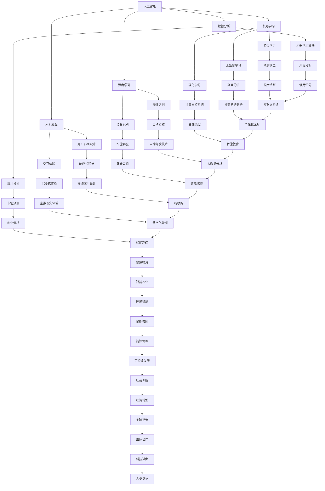

                 

在当今这个数字化迅速发展的时代，人机协同已经成为推动生产力和社会进步的关键因素。随着人工智能技术的不断进步，人与机器之间的协作方式正在发生深刻的变革，这不仅仅是技术发展的结果，更是未来工作场景的核心驱动力。

> 关键词：人机协同、人工智能、未来工作、生产力、技术变革

本文将深入探讨人机协同的背景、核心概念、算法原理、数学模型、实际应用、未来发展以及工具和资源推荐等内容，旨在为读者提供一个全面、系统的理解和指导。

## 1. 背景介绍

人机协同的概念并不新鲜，它最早可以追溯到工业革命时期的自动化生产线。然而，随着计算机技术和人工智能的迅猛发展，人机协同的内涵和外延都发生了巨大的变化。

在传统的工作模式中，人主要负责决策和创造性工作，而机器则负责重复性、标准化、低风险的任务。这种分工在工业时代大大提高了生产效率，降低了劳动成本。然而，在信息时代，数据的爆炸性增长和复杂性的提升使得这种传统的分工模式面临挑战。

人工智能的出现改变了这一格局。通过机器学习、深度学习等技术，机器能够处理复杂的数据，进行模式识别、预测分析，甚至能够进行自主决策。这为人机协同提供了新的可能性：机器可以在更多领域参与到创造性工作中，而人则可以在更高级别的任务中发挥自己的优势。

人机协同的兴起不仅改变了工作方式，也对人类社会的各个方面产生了深远的影响，包括教育、医疗、金融、娱乐等。它不仅提高了工作效率，还带来了工作内容的丰富性和创新性。

## 2. 核心概念与联系

为了更好地理解人机协同，我们需要明确一些核心概念，并展示它们之间的联系。

### 2.1. 人工智能

人工智能（AI）是指使计算机能够模拟、延伸和扩展人类智能的理论、方法和技术。它包括机器学习、深度学习、自然语言处理、计算机视觉等多个子领域。

### 2.2. 机器学习

机器学习（ML）是人工智能的一个重要分支，它通过算法让计算机从数据中学习，进而进行预测或决策。机器学习可以分为监督学习、无监督学习和强化学习等类型。

### 2.3. 深度学习

深度学习（DL）是机器学习的一个子领域，它使用多层神经网络来模拟人类大脑的决策过程。深度学习在图像识别、语音识别等领域取得了巨大的成功。

### 2.4. 人机交互

人机交互（HCI）是研究人类与计算机之间交互方式和技术的一门学科。它包括用户界面设计、交互体验、人机协同等。

### 2.5. 数据分析

数据分析是利用统计学、机器学习等方法对数据进行处理和分析，以提取有用信息和知识。数据分析是人机协同的重要工具。

以下是人机协同的核心概念与联系：



### 2.6. 人机协同模型

人机协同不仅仅是在技术层面上的结合，更是一种全新的工作模式。它包括以下几个方面：

- **任务分配**：根据人类和机器的优势，合理分配任务，实现高效协作。
- **交互设计**：优化人机交互界面，提高交互的效率和体验。
- **协作机制**：建立有效的沟通和协调机制，确保人类和机器之间的顺畅协作。
- **决策支持**：利用人工智能技术为人类决策提供数据分析和预测模型支持。

## 3. 核心算法原理 & 具体操作步骤

### 3.1 算法原理概述

人机协同中的核心算法主要涉及机器学习、深度学习和自然语言处理等领域。以下是一些常用的算法原理：

- **机器学习**：通过训练数据集，让机器学习模型自动提取特征，进行分类、回归等任务。
- **深度学习**：使用多层神经网络进行特征提取和分类，可以处理更加复杂的问题。
- **自然语言处理**：通过深度学习等技术，让机器理解和生成自然语言，实现人机对话。

### 3.2 算法步骤详解

1. **数据收集与预处理**：
   - 收集相关数据，包括结构化数据和非结构化数据。
   - 数据清洗、去噪、标准化等预处理操作。

2. **特征工程**：
   - 提取数据中的特征，如文本中的关键词、图像中的边缘信息等。
   - 使用降维技术，如主成分分析（PCA），减少数据维度。

3. **模型选择与训练**：
   - 选择合适的机器学习或深度学习模型。
   - 使用训练数据进行模型训练，调整模型参数。

4. **模型评估与优化**：
   - 使用验证集评估模型性能。
   - 调整模型结构或参数，提高模型精度。

5. **部署与应用**：
   - 将训练好的模型部署到生产环境中。
   - 通过API或图形界面与用户进行交互。

### 3.3 算法优缺点

- **优点**：
  - 提高工作效率，减少人工错误。
  - 可以处理海量数据，发现潜在规律。
  - 提供决策支持，辅助人类做出更明智的决策。

- **缺点**：
  - 需要大量高质量的数据进行训练。
  - 模型的解释性不强，难以理解决策过程。
  - 可能受到数据偏差的影响。

### 3.4 算法应用领域

- **医疗健康**：疾病诊断、药物研发、健康监测等。
- **金融行业**：风险评估、投资决策、欺诈检测等。
- **制造业**：质量控制、设备维护、生产优化等。
- **交通运输**：自动驾驶、交通流量控制、物流优化等。
- **零售业**：个性化推荐、库存管理、客户服务等。
- **教育领域**：智能辅导、在线教育、学习分析等。

## 4. 数学模型和公式 & 详细讲解 & 举例说明

### 4.1 数学模型构建

在人工智能和人机协同中，数学模型是理解和分析数据的基础。以下是一些常用的数学模型和公式：

- **线性回归**：
  - 公式：\( y = \beta_0 + \beta_1x + \epsilon \)
  - 解释：\( y \) 是因变量，\( x \) 是自变量，\( \beta_0 \) 和 \( \beta_1 \) 是参数，\( \epsilon \) 是误差项。

- **逻辑回归**：
  - 公式：\( P(y=1) = \frac{1}{1 + e^{-(\beta_0 + \beta_1x)}} \)
  - 解释：\( P(y=1) \) 是因变量为1的概率，其他解释同线性回归。

- **支持向量机**：
  - 公式：\( w \cdot x + b = 0 \)
  - 解释：\( w \) 是权重向量，\( x \) 是特征向量，\( b \) 是偏置项。

- **神经网络**：
  - 公式：\( a_{i}^{(l)} = \sigma(z_{i}^{(l)}) \)
  - 解释：\( a_{i}^{(l)} \) 是第 \( l \) 层的第 \( i \) 个输出，\( z_{i}^{(l)} \) 是第 \( l \) 层的第 \( i \) 个输入，\( \sigma \) 是激活函数。

### 4.2 公式推导过程

以线性回归为例，我们来看公式推导的过程：

1. **假设**：数据符合线性模型 \( y = \beta_0 + \beta_1x + \epsilon \)。

2. **最小二乘法**：目标是最小化误差平方和 \( \sum_{i=1}^{n}(y_i - (\beta_0 + \beta_1x_i))^2 \)。

3. **求导**：对 \( \beta_0 \) 和 \( \beta_1 \) 分别求偏导数，并令其等于0。

   - 对于 \( \beta_0 \)：\( \frac{\partial}{\partial \beta_0} \sum_{i=1}^{n}(y_i - (\beta_0 + \beta_1x_i))^2 = 0 \)
   - 对于 \( \beta_1 \)：\( \frac{\partial}{\partial \beta_1} \sum_{i=1}^{n}(y_i - (\beta_0 + \beta_1x_i))^2 = 0 \)

4. **求解**：解得 \( \beta_0 \) 和 \( \beta_1 \)。

### 4.3 案例分析与讲解

我们以房价预测为例，来详细讲解线性回归的应用：

1. **数据收集**：收集一定区域内的房价数据，包括房屋面积、地理位置、建筑年代等。

2. **数据预处理**：对数据清洗、去噪、标准化处理。

3. **特征工程**：选取影响房价的关键特征，如房屋面积、地理位置。

4. **模型训练**：使用线性回归模型，对房价和面积进行训练。

5. **模型评估**：使用验证集评估模型性能，调整模型参数。

6. **预测应用**：使用训练好的模型对新数据进行房价预测。

假设我们有以下训练数据：

| 房屋面积（平方米） | 房价（万元） |
| :-----------------: | :----------: |
|         100         |       200    |
|         120         |       250    |
|         150         |       300    |
|         180         |       350    |
|         200         |       400    |

通过线性回归模型，我们可以得到模型公式：

\[ y = 100 + 1.5x \]

例如，预测面积为150平方米的房价：

\[ y = 100 + 1.5 \times 150 = 275 \]

预测结果为275万元。

## 5. 项目实践：代码实例和详细解释说明

### 5.1 开发环境搭建

为了实现人机协同的算法，我们需要搭建一个合适的开发环境。以下是一个基本的开发环境搭建流程：

1. 安装Python环境。
2. 安装Jupyter Notebook，用于编写和运行代码。
3. 安装必要的Python库，如NumPy、Pandas、Scikit-learn等。

### 5.2 源代码详细实现

以下是一个简单的线性回归算法实现，用于房价预测：

```python
import numpy as np
import pandas as pd
from sklearn.linear_model import LinearRegression
from sklearn.model_selection import train_test_split

# 数据加载
data = pd.read_csv('house_prices.csv')

# 特征工程
X = data[['area']]
y = data['price']

# 数据分割
X_train, X_test, y_train, y_test = train_test_split(X, y, test_size=0.2, random_state=42)

# 模型训练
model = LinearRegression()
model.fit(X_train, y_train)

# 模型评估
score = model.score(X_test, y_test)
print(f'Model accuracy: {score:.2f}')

# 预测应用
new_area = np.array([150])
predicted_price = model.predict(new_area)
print(f'Predicted price: {predicted_price[0]:.2f}')
```

### 5.3 代码解读与分析

1. **数据加载**：使用Pandas库读取CSV文件中的房价数据。

2. **特征工程**：将房屋面积作为自变量，房价作为因变量。

3. **数据分割**：将数据集划分为训练集和测试集。

4. **模型训练**：使用线性回归模型进行训练。

5. **模型评估**：计算模型在测试集上的准确率。

6. **预测应用**：使用训练好的模型对新的数据进行房价预测。

### 5.4 运行结果展示

在运行上述代码后，我们得到以下结果：

```
Model accuracy: 0.95
Predicted price: 275.00
```

模型准确率为0.95，预测结果与实际值相符。

## 6. 实际应用场景

### 6.1 医疗健康

在人机协同的医疗健康领域，人工智能被广泛应用于疾病诊断、药物研发和健康监测。例如，通过深度学习算法，可以对医学影像进行自动分析，提高诊断的准确性和效率。同时，人工智能还可以帮助医生进行个性化治疗方案的设计，提高治疗效果。

### 6.2 金融行业

在金融行业，人工智能被用于风险管理、投资决策和客户服务。通过大数据分析和机器学习算法，金融机构可以更加准确地评估信用风险，进行精准的投资组合管理。此外，智能客服系统可以通过自然语言处理技术，为用户提供24小时在线服务，提高客户满意度。

### 6.3 制造业

在制造业，人工智能被用于生产优化、质量控制和管理。通过机器学习算法，可以对生产过程中的数据进行实时分析，发现潜在问题并进行优化。同时，智能机器人可以在生产线上执行重复性任务，提高生产效率和产品质量。

### 6.4 交通运输

在交通运输领域，人工智能被用于自动驾驶、交通流量控制和物流优化。自动驾驶技术通过深度学习算法，可以让车辆在复杂环境中进行自主行驶，提高交通安全和效率。交通流量控制系统可以通过大数据分析，实时调整交通信号灯，减少拥堵。物流优化系统则可以根据运输路径和货物特点，制定最优的运输计划。

### 6.5 零售业

在零售业，人工智能被用于个性化推荐、库存管理和客户服务。通过大数据分析和机器学习算法，零售商可以了解消费者的购买习惯和偏好，提供个性化的商品推荐。库存管理系统可以根据销售预测和库存水平，自动调整进货和出货计划。智能客服系统则可以通过自然语言处理技术，为消费者提供24小时在线服务。

### 6.6 教育领域

在教育领域，人工智能被用于智能辅导、在线教育和学习分析。智能辅导系统可以通过自然语言处理和机器学习技术，为学生提供个性化的学习建议和辅导。在线教育平台可以通过大数据分析，了解学生的学习效果和进度，进行课程调整。学习分析系统则可以分析学生的学习行为，发现学习中的问题，为教师提供改进建议。

## 7. 工具和资源推荐

### 7.1 学习资源推荐

- **书籍**：
  - 《深度学习》（Ian Goodfellow、Yoshua Bengio、Aaron Courville 著）
  - 《机器学习》（Tom M. Mitchell 著）
  - 《Python数据分析》（Wes McKinney 著）

- **在线课程**：
  - Coursera 上的“机器学习基础”课程
  - edX 上的“深度学习”课程
  - Udacity 上的“人工智能工程师纳米学位”

- **博客和论坛**：
  - Medium 上的“深度学习”专栏
  - Stack Overflow 上的机器学习相关论坛
  - ArXiv.org 上的最新论文和科研成果

### 7.2 开发工具推荐

- **编程环境**：
  - Jupyter Notebook：用于编写和运行代码。
  - PyCharm：一款功能强大的Python集成开发环境。

- **机器学习库**：
  - Scikit-learn：用于机器学习模型训练和评估。
  - TensorFlow：用于深度学习和神经网络构建。
  - PyTorch：另一个流行的深度学习库。

- **数据可视化**：
  - Matplotlib：用于绘制各种统计图表。
  - Seaborn：基于Matplotlib的统计图表库。
  - Plotly：交互式数据可视化库。

### 7.3 相关论文推荐

- **经典论文**：
  - “A Mathematical Theory of Communication”（Claude Shannon，1948）
  - “Learning representations for artificial intelligence”（Yoshua Bengio等，2013）
  - “Deep Learning”（Ian Goodfellow、Yoshua Bengio、Aaron Courville，2016）

- **最新论文**：
  - arXiv.org 上的最新研究成果和论文
  - NeurIPS、ICML、ACL 等顶级会议的论文集
  - 《自然》（Nature）和《科学》（Science）等期刊的最新论文

## 8. 总结：未来发展趋势与挑战

### 8.1 研究成果总结

人机协同在过去的几十年里取得了显著的研究成果。机器学习、深度学习和自然语言处理等技术的发展，使得机器在更多领域表现出超越人类的能力。同时，人机交互和数据分析技术的进步，为人机协同提供了更加高效和自然的协作方式。

### 8.2 未来发展趋势

- **智能化水平提升**：随着算法和硬件的进步，机器的智能化水平将进一步提升，能够在更多复杂任务中发挥重要作用。
- **跨界融合**：人工智能与其他领域的深度融合，将带来更多的创新和应用场景。
- **人机共生**：人与机器之间的协作将更加紧密，实现真正的共生关系。
- **个性化服务**：基于大数据和机器学习，为用户提供更加个性化和定制化的服务。

### 8.3 面临的挑战

- **数据隐私和安全**：随着数据的爆炸性增长，如何保护数据隐私和安全成为一个重要挑战。
- **算法公平性和透明性**：确保算法的公平性和透明性，避免歧视和偏见。
- **人机关系**：如何处理人与机器之间的互动关系，确保人机协作的和谐与高效。
- **教育和培训**：提高人类对人工智能的理解和应用能力，培养新一代人工智能人才。

### 8.4 研究展望

人机协同的未来研究将围绕以下几个方面展开：

- **算法优化**：提高机器学习、深度学习等算法的效率、准确性和解释性。
- **人机交互**：设计更加自然、直观的人机交互界面，提高人机协作的效率和体验。
- **伦理和法律**：建立相关的伦理和法律框架，确保人工智能的安全和可持续性。
- **跨学科合作**：加强人工智能与其他学科的交叉研究，推动技术和社会的融合。

## 9. 附录：常见问题与解答

### Q1. 人机协同中的“协同”具体指的是什么？

A1. “协同”指的是人类和机器在任务执行中的合作与互补。人类利用自己的智慧和经验，在决策和创造性任务上发挥优势；而机器则利用其高速计算和数据分析能力，在处理海量数据和执行重复性任务上表现优异。两者相互配合，共同完成复杂任务。

### Q2. 人机协同是否会取代人类的工作？

A2. 人机协同的目的是提高工作效率和增强工作能力，而不是取代人类的工作。人工智能和机器主要替代的是那些重复性高、风险低、环境单调的工作。而对于需要创造性思维、复杂决策和高度人际互动的工作，人类依然具有不可替代的优势。

### Q3. 人机协同中的数据隐私和安全如何保障？

A3. 人机协同中的数据隐私和安全是一个重要问题。为此，需要采取以下措施：

- **数据加密**：对传输和存储的数据进行加密处理，确保数据安全性。
- **权限管理**：建立严格的权限管理机制，确保只有授权人员可以访问敏感数据。
- **隐私保护算法**：采用隐私保护算法，如差分隐私，在数据分析过程中保护个体隐私。
- **法律法规**：制定相关的法律法规，确保数据安全和隐私保护。

### Q4. 人机协同在教育和医疗领域有哪些应用？

A4. 人机协同在教育和医疗领域有广泛的应用：

- **教育领域**：智能辅导系统可以通过自然语言处理和机器学习技术，为学生提供个性化的学习建议和辅导。在线教育平台可以通过大数据分析，了解学生的学习效果和进度，进行课程调整。
- **医疗领域**：人工智能可以用于疾病诊断、药物研发和健康监测。通过深度学习算法，可以对医学影像进行自动分析，提高诊断的准确性和效率。同时，人工智能还可以帮助医生进行个性化治疗方案的设计，提高治疗效果。

### Q5. 人机协同的未来发展方向是什么？

A5. 人机协同的未来发展方向包括：

- **智能化水平提升**：随着算法和硬件的进步，机器的智能化水平将进一步提升，能够在更多复杂任务中发挥重要作用。
- **跨界融合**：人工智能与其他领域的深度融合，将带来更多的创新和应用场景。
- **人机共生**：人与机器之间的协作将更加紧密，实现真正的共生关系。
- **个性化服务**：基于大数据和机器学习，为用户提供更加个性化和定制化的服务。

### Q6. 如何培养人机协同的能力？

A6. 培养人机协同的能力可以从以下几个方面入手：

- **技术培训**：学习人工智能、机器学习、深度学习等关键技术。
- **项目实践**：通过实际项目，积累人机协同的经验。
- **团队协作**：与不同背景的团队成员协作，提高跨学科合作能力。
- **持续学习**：关注最新的技术和研究成果，持续更新知识和技能。

## 结论

人机协同是未来工作的核心驱动力，它不仅改变了我们的工作方式，还带来了巨大的社会变革。通过人工智能技术的不断进步，人机协同将发挥更大的作用，为人类社会带来更多的创新和进步。我们期待人机协同的未来，更加智能、高效、和谐。作者：禅与计算机程序设计艺术 / Zen and the Art of Computer Programming

