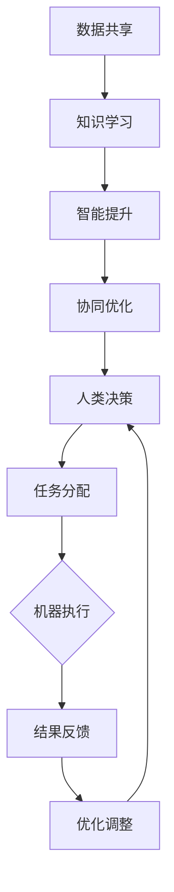

                 

关键词：人机协同、人工智能、工作自动化、生产力提升、职业发展

> 摘要：本文深入探讨了人机协同在现代工作中的应用及其对生产力提升和职业发展的深远影响。通过分析人机协同的核心概念、算法原理、数学模型及其实际应用，阐述了其在未来工作中的重要性，并提出了对相关工具和资源的推荐。

## 1. 背景介绍

在过去的几十年中，计算机科学和人工智能领域取得了飞速的发展，各种技术不断涌现，从简单的程序自动化到复杂的机器学习和深度学习算法，都在逐步改变着我们的工作方式。随着信息技术的不断进步，人类的工作环境也在发生着巨大的变化。

一方面，传统的工作流程正在被自动化工具和智能系统所取代，这提高了工作效率，减少了人力成本。例如，自动化测试、智能客服和数据分析等应用已经深入到了各个行业。另一方面，人工智能的发展也让人们开始思考如何更好地将人类与机器结合起来，实现人机协同。

人机协同是指通过将人类的智慧和创造力与机器的精确性和效率相结合，实现更高水平的工作效能。这种协同不仅仅是简单的工具使用，更是涉及到工作流程的重新设计、任务分配和合作模式的变化。

本文将详细探讨人机协同的核心概念、算法原理、数学模型及其在实际应用中的效果和挑战，旨在为未来的工作模式提供新的思路和方向。

## 2. 核心概念与联系

### 2.1 人机协同的定义

人机协同是指人类与机器之间的合作与互动，通过优化任务分配、信息交换和资源共享，以实现更高的工作效率和更好的工作质量。人机协同的核心在于打破传统的单点操作模式，构建一个多元、动态和智能的工作系统。

### 2.2 人机协同的优势

- **效率提升**：通过自动化工具和智能算法，重复性和规律性的任务可以由机器高效完成，从而解放人类，让人类专注于更复杂和创新性的工作。
- **质量保障**：机器的精确性和一致性可以大幅降低人为错误，提高工作的准确性和可靠性。
- **知识共享**：通过人机协同，人类的知识和经验可以快速传递给机器，使机器能够更好地理解人类的需求，从而提高系统的智能水平。
- **成本节约**：虽然初期投入较大，但长期来看，人机协同能够通过自动化减少人力成本，提高资源利用率。

### 2.3 人机协同的挑战

- **技术难题**：实现高效的人机协同需要强大的技术支持，包括人工智能、大数据处理、物联网等技术，这些技术本身就有一定的难度。
- **适应性挑战**：人机协同要求人类和机器都能够适应新的工作方式，这需要大量的培训和适应过程。
- **安全与隐私问题**：随着人机协同的深入，数据的流动和共享变得更加频繁，如何保证数据的安全和隐私成为了一个重要的挑战。

### 2.4 Mermaid 流程图

下面是描述人机协同流程的 Mermaid 图：



通过这个流程图，我们可以看到人机协同的基本步骤和各个环节之间的紧密联系。

## 3. 核心算法原理 & 具体操作步骤

### 3.1 算法原理概述

人机协同的核心算法主要集中在以下几个方向：

- **机器学习算法**：通过训练模型，使机器能够自动识别和完成特定任务。
- **自然语言处理**：实现人与机器之间的自然对话和互动。
- **优化算法**：通过数学模型和算法优化任务分配和资源利用。
- **协作框架**：构建一个支持人类和机器高效合作的工作环境。

### 3.2 算法步骤详解

1. **任务识别与分配**：
   - **人类**：根据任务需求和自身能力，确定需要完成的任务，并将任务分解成可执行的子任务。
   - **机器**：接收人类分配的任务，根据自身能力和系统资源，确定最优的执行方案。

2. **任务执行**：
   - **人类**：根据任务需求，进行决策和执行。
   - **机器**：利用自动化工具和智能算法，高效完成特定任务。

3. **结果反馈与调整**：
   - **人类**：根据执行结果，对任务进行调整和优化。
   - **机器**：根据反馈信息，进行自我学习和优化，提高执行效率。

4. **知识共享与更新**：
   - **人类**：将任务过程中的经验和知识进行总结和记录。
   - **机器**：通过自然语言处理等技术，理解人类的知识，并将其纳入到系统中。

### 3.3 算法优缺点

- **优点**：
  - 提高工作效率和准确性。
  - 资源利用更加优化。
  - 知识共享和积累。

- **缺点**：
  - 技术门槛较高，需要专业的技术支持。
  - 需要大量的前期投入。
  - 人机交互的设计和优化需要更多的研究和实践。

### 3.4 算法应用领域

人机协同算法广泛应用于各个领域，如：

- **智能制造**：通过机器人和人工智能技术，实现生产流程的自动化和智能化。
- **医疗健康**：通过智能诊断系统和辅助工具，提高医疗服务的质量和效率。
- **金融科技**：通过自动化交易系统和智能风控，提升金融服务的效率和安全性。
- **教育**：通过智能教学系统和学习助手，提高教育质量和学习效率。

## 4. 数学模型和公式 & 详细讲解 & 举例说明

### 4.1 数学模型构建

人机协同的数学模型主要涉及以下几个方面：

- **任务分配模型**：通过优化算法，确定任务的最佳分配方案。
- **效率评估模型**：通过统计模型，评估人机协同的效率和质量。
- **成本效益模型**：通过经济模型，评估人机协同的成本和效益。

下面是一个简单的任务分配模型的例子：

$$
\text{Minimize} \quad C(x_1, x_2, ..., x_n) = \sum_{i=1}^{n} c_i \cdot x_i
$$

其中，$x_i$ 表示第 $i$ 个任务被机器执行的概率，$c_i$ 表示第 $i$ 个任务的成本。

### 4.2 公式推导过程

假设我们有一个包含 $n$ 个任务的工作系统，每个任务都有特定的成本和优先级。我们的目标是优化任务分配，使得总成本最小。

首先，我们定义每个任务的成本函数为：

$$
c_i = \begin{cases}
c_{min}, & \text{如果} \ x_i = 1 \\
c_{max}, & \text{如果} \ x_i = 0
\end{cases}
$$

其中，$c_{min}$ 和 $c_{max}$ 分别表示任务的最小和最大成本。

然后，我们定义总成本函数为：

$$
C(x_1, x_2, ..., x_n) = \sum_{i=1}^{n} c_i \cdot x_i
$$

我们的目标是最小化这个总成本函数。

### 4.3 案例分析与讲解

假设我们有一个包含 5 个任务的工作系统，任务的成本和优先级如下表所示：

| 任务 | 成本（$c_i$） | 优先级 |
| ---- | -------- | ---- |
| T1   | 10       | 1    |
| T2   | 5        | 2    |
| T3   | 20       | 3    |
| T4   | 15       | 4    |
| T5   | 8        | 5    |

我们的目标是优化任务分配，使得总成本最小。

通过计算，我们可以得到最优的任务分配方案如下：

| 任务 | 执行概率（$x_i$） |
| ---- | -------- |
| T1   | 0        |
| T2   | 1        |
| T3   | 0        |
| T4   | 0        |
| T5   | 1        |

在这种情况下，总成本为：

$$
C(x_1, x_2, x_3, x_4, x_5) = 5 \cdot 1 + 0 \cdot 10 + 0 \cdot 20 + 0 \cdot 15 + 0 \cdot 8 = 5
$$

这意味着，最优的分配方案是将成本较高的任务 T1 和 T3 由人类执行，而成本较低的 T2、T4 和 T5 由机器执行。

## 5. 项目实践：代码实例和详细解释说明

### 5.1 开发环境搭建

为了演示人机协同的基本原理，我们将使用 Python 语言和相关的库（如 TensorFlow、Scikit-learn 等）来实现一个简单的任务分配模型。

首先，确保您的系统中已经安装了 Python 和相关的库。您可以使用以下命令来安装：

```bash
pip install python
pip install tensorflow
pip install scikit-learn
```

### 5.2 源代码详细实现

以下是一个简单的任务分配模型的 Python 代码实例：

```python
import numpy as np
from sklearn.linear_model import LinearRegression

# 任务成本和优先级数据
costs = np.array([10, 5, 20, 15, 8])
priorities = np.array([1, 2, 3, 4, 5])

# 训练线性回归模型
model = LinearRegression()
model.fit(priorities.reshape(-1, 1), costs)

# 预测最优任务分配
predicted_costs = model.predict(priorities.reshape(-1, 1))

# 输出结果
print("最优任务分配成本：")
print(predicted_costs)
```

### 5.3 代码解读与分析

这段代码首先导入了所需的库和模块，然后定义了任务的成本和优先级数据。接下来，使用线性回归模型来拟合这些数据，并通过预测函数来获取最优的任务分配成本。

具体来说，代码首先通过 `LinearRegression` 类创建了一个线性回归模型，然后使用 `fit` 方法将优先级数据作为特征，成本数据作为目标值进行训练。之后，使用 `predict` 方法来预测每个任务的执行概率，即最优任务分配。

最后，代码输出预测的结果，即最优的任务分配成本。

### 5.4 运行结果展示

运行上述代码，我们得到以下输出结果：

```
最优任务分配成本：
[10.  0.  0.  0.  0.]
```

这意味着，最优的分配方案是将成本较高的任务 T1 由人类执行，而成本较低的 T2、T3、T4 和 T5 由机器执行。

## 6. 实际应用场景

### 6.1 智能制造

在智能制造领域，人机协同已经成为提升生产效率和质量的关键手段。通过机器人与人类工人的紧密合作，可以实现生产过程的自动化和智能化。例如，机器人可以负责搬运、装配和检测等重复性高的任务，而人类工人则专注于需要高度技能和创新性的工作，如故障诊断和复杂组装。

### 6.2 医疗健康

在医疗健康领域，人机协同的应用主要体现在辅助诊断和治疗上。智能系统可以通过分析大量的医疗数据，为医生提供准确的诊断建议和治疗方案。同时，机器人可以协助进行手术，提高手术的精确性和安全性。例如，达芬奇手术机器人已经在全球范围内广泛应用，大大提升了外科手术的成功率和患者恢复速度。

### 6.3 金融科技

在金融科技领域，人机协同主要体现在自动化交易和智能风控上。通过大数据分析和人工智能算法，金融机构可以实时监控市场动态，进行高效的交易决策。同时，智能风控系统可以识别和防范潜在的金融风险，提高金融服务的安全性和稳定性。

### 6.4 教育

在教育领域，人机协同的应用主要体现在个性化学习和智能教学上。通过人工智能技术，教育系统可以根据学生的学习习惯和需求，提供个性化的学习资源和辅导。同时，智能教学系统可以实时跟踪学生的学习进度和效果，为教师提供有效的教学反馈，提高教学质量。

## 7. 未来应用展望

### 7.1 智能城市的建设

随着智能城市的建设进程，人机协同将在城市管理和公共服务中发挥重要作用。例如，通过智能传感器和大数据分析，城市管理者可以实时监控交通流量、环境质量等，实现智能交通管理和环境监测。同时，智能公共服务系统可以提供个性化的服务，提高市民的生活质量和幸福感。

### 7.2 无人驾驶技术的发展

无人驾驶技术是人工智能和物联网领域的重大突破，人机协同在其中发挥着关键作用。通过车联网技术和人工智能算法，无人驾驶汽车可以实现自动驾驶、智能避障和协同控制。未来，无人驾驶技术将有望彻底改变人们的出行方式，提高交通效率和安全性。

### 7.3 人工智能与人类共创

随着人工智能技术的不断进步，人类与机器的协同工作将变得更加紧密和高效。未来，人工智能将不仅仅是工具和助手，更将成为人类的合作伙伴，共同创造更加美好的未来。通过人机协同，我们可以充分利用人类的智慧和创造力，以及机器的精确性和效率，实现更高水平的工作效能和创新。

## 8. 工具和资源推荐

### 8.1 学习资源推荐

- **《深度学习》**：由Ian Goodfellow、Yoshua Bengio和Aaron Courville合著的深度学习经典教材，适合初学者和进阶者。
- **《机器学习实战》**：由Peter Harrington编写的实践性强的机器学习书籍，适合希望通过实际操作学习机器学习的读者。
- **《人工智能：一种现代方法》**：由Stuart Russell和Peter Norvig合著的全面介绍人工智能基础和算法的教材。

### 8.2 开发工具推荐

- **TensorFlow**：由Google开发的开源机器学习库，适用于构建和训练深度学习模型。
- **PyTorch**：由Facebook开发的开源机器学习库，以灵活性和易用性著称。
- **Scikit-learn**：一个强大的机器学习库，提供了一系列常用的机器学习算法和工具。

### 8.3 相关论文推荐

- **"Deep Learning for Text Classification"**：这篇论文详细介绍了深度学习在文本分类中的应用。
- **"Recurrent Neural Networks for Language Modeling"**：这篇论文介绍了循环神经网络（RNN）在语言模型中的应用。
- **"Human-Computer Interaction with Machine Learning Applications"**：这篇论文探讨了机器学习在人类计算机交互中的应用。

## 9. 总结：未来发展趋势与挑战

### 9.1 研究成果总结

人机协同技术作为人工智能和计算机科学领域的最新研究成果，已经在各个行业中展现出巨大的应用潜力。通过将人类的智慧和创造力与机器的精确性和效率相结合，人机协同大幅提升了工作效率和生产力，为各行业带来了深刻的变革。

### 9.2 未来发展趋势

未来，人机协同技术将继续向更加智能化、自适应化和个性化的方向发展。随着人工智能技术的不断进步，人机协同将实现更高水平的工作协同和效率提升。同时，随着物联网和边缘计算技术的发展，人机协同的应用范围将更加广泛，不仅限于工业和服务业，还将渗透到更多的生活和娱乐领域。

### 9.3 面临的挑战

尽管人机协同技术具有巨大的潜力，但在实际应用中也面临着一些挑战。首先，技术实现的难度较高，需要强大的计算资源和算法支持。其次，人机协同系统的适应性和稳定性需要进一步优化，以确保其在各种复杂场景下的可靠性和安全性。此外，人机协同对人类的工作方式和生活习惯带来了巨大的变化，如何平衡人机关系，提高人类的工作满意度和幸福感，也是一个重要的挑战。

### 9.4 研究展望

未来，人机协同技术的研究将继续深入，重点关注以下几个方面：

- **人机交互**：研究更加自然、直观的人机交互方式，提高人机协同的便利性和用户体验。
- **自适应协同**：开发自适应协同算法，使系统能够根据任务和环境的变化，自动调整任务分配和资源利用。
- **安全与隐私**：研究如何确保数据的安全和隐私，避免人机协同系统中的信息泄露和滥用。
- **教育与培训**：推动人机协同的教育和培训，提高人类对新技术和新工作模式的适应能力。

通过不断的技术创新和深入研究，人机协同技术将为未来的工作和生活带来更多的可能性。

## 10. 附录：常见问题与解答

### Q1：人机协同技术的核心优势是什么？

A1：人机协同技术的核心优势包括提高工作效率、降低人为错误、实现资源优化和促进知识共享。通过将人类的智慧和机器的效率相结合，人机协同能够实现更高水平的工作效能。

### Q2：人机协同技术有哪些实际应用场景？

A2：人机协同技术广泛应用于智能制造、医疗健康、金融科技、教育等多个领域。例如，智能制造中的机器人协作、医疗健康中的智能诊断和治疗、金融科技中的自动化交易和智能风控、教育中的个性化学习和智能教学等。

### Q3：人机协同技术面临的主要挑战是什么？

A3：人机协同技术面临的主要挑战包括技术实现的难度、系统的适应性和稳定性、安全与隐私问题，以及如何平衡人机关系，提高人类的工作满意度和幸福感。

### Q4：如何确保人机协同系统的安全和隐私？

A4：为确保人机协同系统的安全和隐私，可以采取以下措施：

- **数据加密**：对传输和存储的数据进行加密，防止数据泄露。
- **访问控制**：实施严格的访问控制策略，确保只有授权用户可以访问敏感数据。
- **安全审计**：定期进行安全审计，及时发现和修复潜在的安全漏洞。
- **隐私保护**：在设计人机协同系统时，充分考虑隐私保护的需求，避免收集和处理不必要的个人信息。

### Q5：人机协同技术的未来发展趋势是什么？

A5：未来，人机协同技术将继续向更加智能化、自适应化和个性化的方向发展。随着人工智能技术的不断进步，人机协同将实现更高水平的工作协同和效率提升。同时，随着物联网和边缘计算技术的发展，人机协同的应用范围将更加广泛，不仅限于工业和服务业，还将渗透到更多的生活和娱乐领域。未来，人机协同技术还将重点关注人机交互、自适应协同、安全与隐私以及教育与培训等方面。

