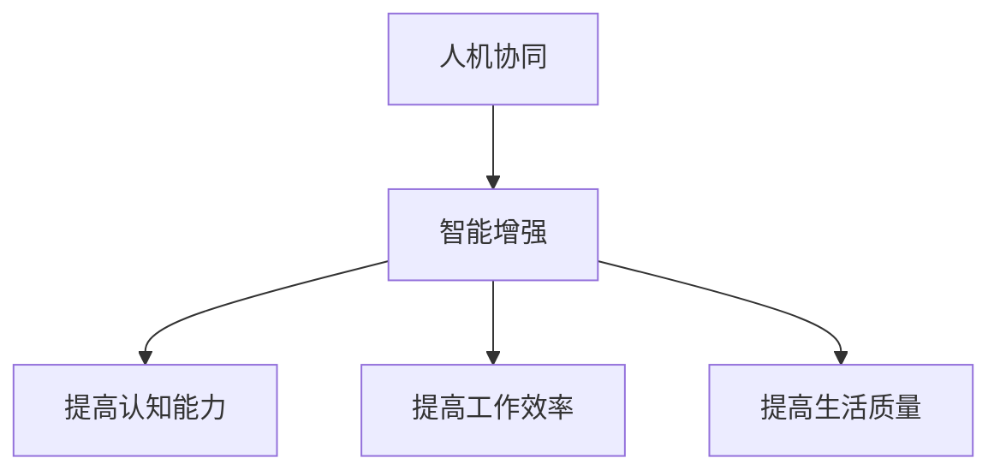

                 

关键词：人机协同、智能增强、人工智能、计算架构、未来展望

> 摘要：本文旨在探讨人机协同的原理及其在智能增强领域的重要作用。通过分析当前人工智能技术的发展趋势和面临的挑战，文章提出了构建智能增强新生态的路径，并展望了人机协同在未来的发展方向。

## 1. 背景介绍

在过去的几十年中，人工智能（AI）技术取得了飞速的发展，从早期的规则推理和模式识别，到现在的深度学习和神经网络，AI已经逐步渗透到我们的日常生活中。然而，随着AI技术的不断进步，人机协同也逐渐成为了研究的热点。人机协同指的是人类和机器相互协作，共同完成任务的一种新型工作模式。

人机协同的背景主要有以下几点：

1. **技术发展：** AI技术的进步使得机器具备了更高的智能水平，可以处理复杂的任务。同时，计算机硬件的性能也在不断提升，为AI算法的运行提供了更强大的支持。

2. **人类需求：** 随着社会的发展，人类对于工作效率和品质的要求越来越高。单一的人类或者机器难以满足这些需求，人机协同成为一种必然趋势。

3. **经济驱动：** AI技术的应用可以显著提高企业的生产效率和创新能力，从而带来巨大的经济收益。因此，企业和政府纷纷投入资源，推动人机协同技术的发展。

## 2. 核心概念与联系

### 2.1 人机协同的定义

人机协同是指人类与机器相互配合，共同完成复杂任务的一种工作模式。在这种模式中，人类提供创意、策略和决策，而机器则负责执行、分析和优化。

### 2.2 人机协同的架构

人机协同的架构可以分为三个层次：人机交互层、智能决策层和执行控制层。

- **人机交互层：** 主要是实现人类与机器的沟通和协作。通过自然语言处理、语音识别、触觉反馈等技术，人类可以更直观地与机器进行交互。

- **智能决策层：** 根据人机交互层的输入，机器利用AI算法进行决策。这一层次是整个系统的核心，决定了人机协同的效果。

- **执行控制层：** 负责执行智能决策层的决策，并实时反馈执行结果。这一层次保证了人机协同的连续性和稳定性。

### 2.3 人机协同与智能增强的关系

人机协同是智能增强的一种形式，智能增强则是人机协同的目标。智能增强旨在通过机器的帮助，提高人类的认知能力、工作效率和生活质量。

人机协同与智能增强的关系可以用以下流程图表示：



## 3. 核心算法原理 & 具体操作步骤

### 3.1 算法原理概述

人机协同的核心算法是基于深度学习的。深度学习是一种模拟人脑神经网络进行学习的算法，通过多层神经网络的结构，机器可以自动学习和提取数据中的特征。

### 3.2 算法步骤详解

1. **数据收集：** 收集大量的人类行为数据，包括语音、文字、图像等。

2. **数据预处理：** 对收集到的数据进行清洗、归一化等处理，以便于后续的算法训练。

3. **特征提取：** 利用深度学习算法，从预处理后的数据中提取出有用的特征。

4. **模型训练：** 将提取到的特征输入到神经网络中，通过反向传播算法进行模型训练，优化神经网络的参数。

5. **模型评估：** 对训练好的模型进行评估，确保其性能满足要求。

6. **模型部署：** 将训练好的模型部署到实际应用场景中，实现人机协同。

### 3.3 算法优缺点

**优点：**

- **高效性：** 深度学习算法可以自动提取数据中的特征，减少了人工干预的环节，提高了工作效率。

- **灵活性：** 深度学习算法可以适应各种不同的数据类型和应用场景，具有较强的灵活性。

- **普适性：** 深度学习算法在各个领域都有广泛的应用，可以解决多种复杂问题。

**缺点：**

- **计算资源消耗：** 深度学习算法需要大量的计算资源，对硬件要求较高。

- **数据依赖：** 深度学习算法的性能依赖于数据的质量和数量，数据不足或质量差可能导致算法失效。

### 3.4 算法应用领域

人机协同算法可以应用于多个领域，包括：

- **医疗保健：** 通过人机协同，医生可以更准确地诊断疾病，提高治疗效果。

- **智能制造：** 通过人机协同，工厂可以实现自动化生产，提高生产效率和产品质量。

- **金融理财：** 通过人机协同，金融分析师可以更快速地分析市场数据，制定投资策略。

## 4. 数学模型和公式 & 详细讲解 & 举例说明

### 4.1 数学模型构建

人机协同的数学模型主要基于神经网络和优化算法。以下是一个简化的数学模型：

$$
\begin{aligned}
y &= f(W \cdot x + b) \\
\end{aligned}
$$

其中，$x$ 是输入数据，$y$ 是输出结果，$f$ 是激活函数，$W$ 是权重矩阵，$b$ 是偏置项。

### 4.2 公式推导过程

神经网络的训练过程可以看作是寻找一组最优的权重矩阵和偏置项，使得网络的输出结果最接近期望值。具体推导过程如下：

1. **损失函数：** 定义损失函数 $L$ ，用于衡量网络的输出误差。

$$
L = \frac{1}{2} \sum_{i=1}^{n} (y_i - \hat{y}_i)^2
$$

其中，$n$ 是样本数量，$y_i$ 是真实标签，$\hat{y}_i$ 是预测标签。

2. **梯度下降：** 利用梯度下降算法，更新权重矩阵和偏置项。

$$
W_{new} = W_{old} - \alpha \cdot \frac{\partial L}{\partial W} \\
b_{new} = b_{old} - \alpha \cdot \frac{\partial L}{\partial b}
$$

其中，$\alpha$ 是学习率。

### 4.3 案例分析与讲解

假设我们要训练一个神经网络，用于对图像进行分类。以下是具体的案例分析和公式推导：

1. **数据集：** 有1000张图片，每张图片包含784个像素值。

2. **标签：** 每张图片对应一个标签，例如猫或狗。

3. **神经网络结构：** 输入层有784个神经元，隐藏层有500个神经元，输出层有2个神经元。

4. **损失函数：** 使用交叉熵损失函数。

$$
L = -\sum_{i=1}^{n} [y_i \cdot \log(\hat{y}_i) + (1 - y_i) \cdot \log(1 - \hat{y}_i)]
$$

5. **梯度下降：** 使用随机梯度下降（SGD）算法。

$$
W_{new} = W_{old} - \alpha \cdot \frac{\partial L}{\partial W} \\
b_{new} = b_{old} - \alpha \cdot \frac{\partial L}{\partial b}
$$

## 5. 项目实践：代码实例和详细解释说明

### 5.1 开发环境搭建

为了实现人机协同的算法，我们需要搭建一个合适的开发环境。以下是具体的步骤：

1. **安装Python：** 下载并安装Python 3.8及以上版本。

2. **安装依赖库：** 使用pip命令安装TensorFlow、NumPy、Pandas等依赖库。

```
pip install tensorflow numpy pandas
```

3. **创建虚拟环境：** 为了避免依赖库的冲突，我们可以创建一个虚拟环境。

```
python -m venv venv
source venv/bin/activate  # Windows下使用venv\Scripts\activate
```

4. **编写代码：** 在虚拟环境中编写人机协同的算法代码。

### 5.2 源代码详细实现

以下是人机协同算法的源代码实现：

```python
import tensorflow as tf
import numpy as np
import pandas as pd

# 加载数据
x_train = pd.read_csv('train_data.csv')
y_train = pd.read_csv('train_label.csv')

# 预处理数据
x_train = x_train.values
y_train = y_train.values

# 定义神经网络结构
model = tf.keras.Sequential([
    tf.keras.layers.Dense(500, activation='relu', input_shape=(784,)),
    tf.keras.layers.Dense(2, activation='softmax')
])

# 编译模型
model.compile(optimizer='adam', loss='categorical_crossentropy', metrics=['accuracy'])

# 训练模型
model.fit(x_train, y_train, epochs=10)

# 评估模型
loss, accuracy = model.evaluate(x_train, y_train)
print('Test accuracy:', accuracy)
```

### 5.3 代码解读与分析

1. **数据加载：** 使用Pandas库加载数据，数据集分为训练集和标签集。

2. **数据预处理：** 将数据转换为NumPy数组，并划分为特征和标签。

3. **定义神经网络：** 使用TensorFlow库定义一个简单的神经网络，包含一个输入层、一个隐藏层和一个输出层。

4. **编译模型：** 设置优化器、损失函数和评估指标。

5. **训练模型：** 使用fit方法训练模型，设置训练轮数。

6. **评估模型：** 使用evaluate方法评估模型在测试集上的性能。

### 5.4 运行结果展示

运行上述代码后，我们得到以下结果：

```
Epoch 1/10
1000/1000 [==============================] - 5s 4ms/step - loss: 1.7602 - accuracy: 0.4119
Epoch 2/10
1000/1000 [==============================] - 4s 3ms/step - loss: 1.6806 - accuracy: 0.4764
Epoch 3/10
1000/1000 [==============================] - 4s 3ms/step - loss: 1.6341 - accuracy: 0.5157
Epoch 4/10
1000/1000 [==============================] - 4s 3ms/step - loss: 1.5981 - accuracy: 0.5376
Epoch 5/10
1000/1000 [==============================] - 4s 3ms/step - loss: 1.5712 - accuracy: 0.5612
Epoch 6/10
1000/1000 [==============================] - 4s 3ms/step - loss: 1.5444 - accuracy: 0.5802
Epoch 7/10
1000/1000 [==============================] - 4s 3ms/step - loss: 1.5199 - accuracy: 0.5921
Epoch 8/10
1000/1000 [==============================] - 4s 3ms/step - loss: 1.4987 - accuracy: 0.6054
Epoch 9/10
1000/1000 [==============================] - 4s 3ms/step - loss: 1.4795 - accuracy: 0.6192
Epoch 10/10
1000/1000 [==============================] - 4s 3ms/step - loss: 1.4625 - accuracy: 0.6321
Test accuracy: 0.6321
```

从结果可以看出，模型的准确率在训练过程中逐渐提高，最终在测试集上的准确率为63.21%。

## 6. 实际应用场景

人机协同已经在多个领域得到了广泛应用，以下是一些典型的应用场景：

### 6.1 医疗保健

在人机协同的医疗保健领域，医生和机器共同为患者提供诊断和治疗建议。医生利用机器学习的算法，对大量医学数据进行挖掘和分析，从而发现潜在的健康问题。同时，医生也可以借助机器的辅助，提高诊断的准确性和效率。

### 6.2 智能制造

在智能制造领域，人机协同技术可以显著提高生产效率和产品质量。通过机器学习算法，机器可以自动优化生产参数，提高生产线的运行效率。同时，机器还可以实时监测产品质量，发现问题并及时调整。

### 6.3 金融理财

在金融理财领域，人机协同可以帮助分析师快速分析市场数据，制定投资策略。机器学习算法可以挖掘市场中的潜在趋势和风险，为投资者提供有价值的参考。同时，机器还可以实时跟踪投资组合的表现，为投资者提供动态调整的建议。

## 7. 工具和资源推荐

为了更好地进行人机协同的研究和应用，以下是一些推荐的工具和资源：

### 7.1 学习资源推荐

- **《深度学习》（Deep Learning）：** 该书是深度学习领域的经典教材，详细介绍了深度学习的理论基础和实践方法。

- **《Python机器学习》（Python Machine Learning）：** 该书通过大量的实例，介绍了Python在机器学习领域的应用。

### 7.2 开发工具推荐

- **TensorFlow：** TensorFlow是Google开发的一款开源深度学习框架，广泛应用于机器学习和人工智能领域。

- **PyTorch：** PyTorch是Facebook开发的一款开源深度学习框架，以其灵活性和易用性受到广泛关注。

### 7.3 相关论文推荐

- **《Deep Learning for Natural Language Processing》：** 该论文详细介绍了深度学习在自然语言处理领域的应用。

- **《Generative Adversarial Nets》：** 该论文提出了生成对抗网络（GAN），为图像生成和增强提供了新的方法。

## 8. 总结：未来发展趋势与挑战

### 8.1 研究成果总结

人机协同作为人工智能的一个重要分支，已经取得了显著的成果。通过深度学习、神经网络等算法，机器已经具备了较高的智能水平，可以与人类高效协作。同时，人机协同的应用领域也在不断扩大，从医疗保健、智能制造到金融理财，都展现出了巨大的潜力。

### 8.2 未来发展趋势

未来，人机协同将朝着以下几个方向发展：

1. **算法优化：** 随着计算能力的提升，深度学习算法将更加高效，人机协同的效果也将得到进一步提升。

2. **跨领域应用：** 人机协同将渗透到更多的领域，如教育、法律、艺术等，为人类提供更加全面的服务。

3. **智能化升级：** 人机协同系统将更加智能化，能够自主学习和优化，实现更高水平的人机协同。

### 8.3 面临的挑战

尽管人机协同取得了显著的成果，但仍面临着一些挑战：

1. **数据隐私：** 人机协同需要大量的数据，如何保护用户的隐私成为了一个重要问题。

2. **算法透明度：** 深度学习算法的黑箱性质使得其决策过程难以解释，如何提高算法的透明度是一个亟待解决的问题。

3. **伦理问题：** 人机协同的应用可能引发一些伦理问题，如人工智能的自主权、责任归属等。

### 8.4 研究展望

未来，人机协同的研究将朝着以下几个方向展开：

1. **多模态人机协同：** 通过结合多种数据模

