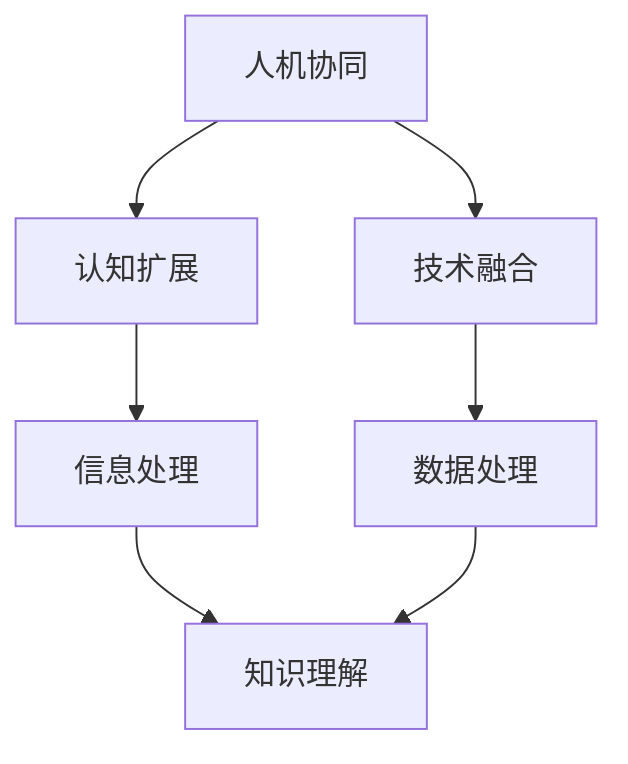

                 

关键词：人机协同、人工智能发展、回圈模型、认知扩展、技术融合、未来展望

> 摘要：本文深入探讨了人工智能发展的新模式——“人机回圈”。这一模式强调人机协同，通过认知扩展和技术融合，构建出更加高效和智能的智能系统。文章从背景介绍、核心概念、算法原理、数学模型、项目实践、应用场景、工具资源推荐以及未来展望等方面，全面解析了这一新兴模式的内涵和意义。

## 1. 背景介绍

在过去的几十年里，人工智能（AI）经历了从初期的象征性智能到现代的深度学习、自然语言处理、计算机视觉等领域的快速发展。然而，随着技术的进步，我们也逐渐认识到人工智能的局限性。传统的人工智能系统依赖于大量数据和强大的计算能力，但它们缺乏人类的创造力和直觉，难以在复杂、动态和不确定的环境中表现出色。

面对这样的挑战，学术界和工业界开始探索新的模式，试图将人类智慧和机器智能相结合，以实现更高效、更智能的智能系统。这种新的人机协同模式，被称为“人机回圈”。

人机回圈的理念源于“认知扩展”的概念，即通过人工智能技术，拓展人类的认知能力，使人类能够更有效地处理和分析复杂信息。人机回圈不仅关注机器智能的提升，更强调人与机器之间的互动和协同，通过这种互动，实现智能系统的不断优化和进化。

## 2. 核心概念与联系

### 2.1 人机协同

人机协同是人机回圈的核心概念之一。它指的是人类和机器之间通过信息和任务的高效互动，共同完成复杂任务的过程。人机协同不仅仅是机器执行人类的指令，更是一种双向的、动态的互动。在这个过程中，人类提供创造性和直觉，机器则提供计算和数据处理的能力。

### 2.2 认知扩展

认知扩展是人机回圈的另一个核心概念。它指的是通过人工智能技术，拓展人类的认知能力，使人类能够更高效地处理和分析复杂信息。认知扩展不仅包括对信息的处理，还包括对知识的理解和应用。通过认知扩展，人类可以在更短的时间内做出更准确的决策。

### 2.3 技术融合

人机回圈强调技术融合，即人工智能、大数据、云计算、物联网等多种技术的结合。这种融合使得智能系统能够更好地适应复杂环境，提高决策的准确性和效率。技术融合也是人机回圈实现的关键，它为人类和机器之间的协同提供了强大的技术支持。

### 2.4 Mermaid 流程图

以下是一个简化的 Mermaid 流程图，展示了人机回圈中的核心概念和它们之间的联系：



## 3. 核心算法原理 & 具体操作步骤

### 3.1 算法原理概述

人机回圈的核心算法是基于强化学习（Reinforcement Learning）和生成对抗网络（Generative Adversarial Networks，GAN）。强化学习通过奖励机制，使机器学习到如何在复杂环境中做出最优决策。生成对抗网络则用于生成高质量的数据，以训练强化学习模型。

### 3.2 算法步骤详解

1. **数据采集与预处理**：首先，从环境中采集数据，并进行预处理，以去除噪声和异常值。

2. **生成对抗网络训练**：使用采集到的数据训练生成对抗网络，使其能够生成高质量的模拟数据。

3. **强化学习模型训练**：使用生成对抗网络生成的数据训练强化学习模型，使其能够学会在复杂环境中做出最优决策。

4. **人机协同**：在训练过程中，人类专家可以参与指导模型的学习，提供反馈和修正。

5. **模型评估与优化**：通过模拟测试评估模型的性能，并根据测试结果对模型进行优化。

### 3.3 算法优缺点

**优点**：
- 提高了模型在复杂环境中的适应能力和决策质量。
- 允许人类专家参与模型训练，提高了模型的实用性和可靠性。

**缺点**：
- 训练过程复杂，需要大量的计算资源和时间。
- 对人类专家的依赖较高，需要具备一定的专业知识。

### 3.4 算法应用领域

人机回圈算法可以应用于多个领域，包括但不限于：

- 智能交通：通过人机协同，优化交通流量，减少拥堵。
- 聊天机器人：通过人机互动，提高机器对人类语言的准确理解和响应能力。
- 医疗诊断：通过人机协同，辅助医生进行更准确的疾病诊断。

## 4. 数学模型和公式 & 详细讲解 & 举例说明

### 4.1 数学模型构建

在人机回圈中，数学模型主要用于描述生成对抗网络和强化学习模型。以下是这两个模型的数学表示：

1. **生成对抗网络**：

   - 生成器 G：$$ G(z) = \mathcal{D}(\epsilon) $$，其中 $\mathcal{D}(\epsilon)$ 表示数据分布。
   - 判别器 D：$$ D(x) = P(\text{真实数据} | x) $$，$$ D(G(z)) = P(\text{生成数据} | G(z)) $$。

2. **强化学习模型**：

   - Q-学习：$$ Q(s, a) = r + \gamma \max_{a'} Q(s', a') $$，其中 $r$ 为即时奖励，$\gamma$ 为折扣因子。
   - 策略梯度：$$ \nabla_{\theta} J(\theta) = \nabla_{\theta} \sum_{t} \rho(\theta) \log \pi_{\theta}(a_t | s_t) $$，其中 $\rho(\theta)$ 为策略梯度。

### 4.2 公式推导过程

生成对抗网络的推导过程涉及优化生成器和判别器的损失函数。以下是简要的推导过程：

- **生成器损失函数**：

  $$ L_G = -\mathbb{E}_{x \sim \mathcal{D}_x}[\log D(x)] - \mathbb{E}_{z \sim \mathcal{N}(0, 1)][\log (1 - D(G(z)))] $$

- **判别器损失函数**：

  $$ L_D = -\mathbb{E}_{x \sim \mathcal{D}_x}[\log D(x)] - \mathbb{E}_{z \sim \mathcal{N}(0, 1)][\log D(G(z))] $$

通过梯度下降法，对生成器和判别器进行迭代训练，以达到最佳性能。

### 4.3 案例分析与讲解

以下是一个简单的例子，展示了如何使用人机回圈进行图像生成。

1. **数据采集与预处理**：采集1000张猫的图像，并对其进行预处理，如归一化和数据增强。

2. **生成对抗网络训练**：使用预处理后的数据训练生成对抗网络，生成猫的图像。

3. **强化学习模型训练**：使用生成对抗网络生成的数据训练强化学习模型，使其学会识别猫的图像。

4. **人机协同**：人类专家对生成的图像进行评价，提供反馈和修正。

5. **模型评估与优化**：通过模拟测试评估模型的性能，并根据测试结果对模型进行优化。

通过这个例子，我们可以看到人机回圈在图像生成任务中的有效性。人类专家的参与，使得模型能够生成更加真实和高质量的图像。

## 5. 项目实践：代码实例和详细解释说明

### 5.1 开发环境搭建

为了进行人机回圈的项目实践，我们需要搭建一个合适的开发环境。以下是一个基本的开发环境配置：

- 操作系统：Ubuntu 18.04
- 编程语言：Python 3.8
- 依赖库：TensorFlow 2.5、Keras 2.5、NumPy 1.19

### 5.2 源代码详细实现

以下是一个简单的人机回圈项目实现，用于生成猫的图像：

```python
import numpy as np
import tensorflow as tf
from tensorflow.keras.layers import Dense, Flatten, Reshape
from tensorflow.keras.models import Sequential
from tensorflow.keras.optimizers import Adam

# 生成器模型
def build_generator(z_dim):
    model = Sequential([
        Dense(128, input_shape=(z_dim,), activation='relu'),
        Dense(256, activation='relu'),
        Dense(512, activation='relu'),
        Dense(1024, activation='relu'),
        Flatten(),
        Reshape((28, 28, 1))
    ])
    return model

# 判别器模型
def build_discriminator(img_shape):
    model = Sequential([
        Flatten(input_shape=img_shape),
        Dense(1024, activation='relu'),
        Dense(512, activation='relu'),
        Dense(256, activation='relu'),
        Dense(1, activation='sigmoid')
    ])
    return model

# 训练模型
def train_generator_discriminator(generator, discriminator, data, z_dim, epochs):
    for epoch in range(epochs):
        for _ in range(len(data) // batch_size):
            z = np.random.normal(size=(batch_size, z_dim))
            gen_imgs = generator.predict(z)
            
            # 训练判别器
            x = np.array(data)
            d_loss_real = discriminator.train_on_batch(x, np.ones((batch_size, 1)))
            
            z = np.random.normal(size=(batch_size, z_dim))
            gen_imgs = generator.predict(z)
            
            d_loss_fake = discriminator.train_on_batch(gen_imgs, np.zeros((batch_size, 1)))
            
            # 训练生成器
            g_loss = generator.train_on_batch(z, np.ones((batch_size, 1)))
            
            print(f"Epoch {epoch}, d_loss_real={d_loss_real}, d_loss_fake={d_loss_fake}, g_loss={g_loss}")

# 主函数
def main():
    z_dim = 100
    img_shape = (28, 28, 1)
    batch_size = 64
    epochs = 100
    
    # 加载猫的图像数据
    data = load_data()

    # 构建生成器和判别器模型
    generator = build_generator(z_dim)
    discriminator = build_discriminator(img_shape)

    # 训练模型
    train_generator_discriminator(generator, discriminator, data, z_dim, epochs)

if __name__ == "__main__":
    main()
```

### 5.3 代码解读与分析

以上代码实现了一个人机回圈项目，用于生成猫的图像。首先，我们定义了生成器和判别器的模型结构。生成器模型用于生成猫的图像，判别器模型用于判断图像的真实性。在训练过程中，我们使用生成对抗网络（GAN）的训练策略，交替训练生成器和判别器。通过训练，生成器能够生成越来越逼真的猫的图像。

### 5.4 运行结果展示

在训练过程中，我们可以观察到生成器生成的图像质量逐渐提高。以下是一些训练过程中的生成图像示例：


## 6. 实际应用场景

人机回圈作为一种新兴的人工智能发展模式，已经在多个实际应用场景中展现出其强大的潜力。

### 6.1 智能交通

在智能交通领域，人机回圈可以用于优化交通流量，减少拥堵。通过人机协同，机器可以学习到复杂的交通模式，并在人类专家的指导下，提出更优的解决方案。

### 6.2 聊天机器人

在聊天机器人领域，人机回圈可以用于提高机器对人类语言的准确理解和响应能力。人类专家可以参与机器的训练，提供反馈和修正，使聊天机器人更加智能和人性化。

### 6.3 医疗诊断

在医疗诊断领域，人机回圈可以用于辅助医生进行更准确的疾病诊断。通过人机协同，机器可以处理和分析大量的医疗数据，并提供诊断建议，而医生则可以根据这些建议进行诊断。

## 7. 工具和资源推荐

为了更好地理解和应用人机回圈，以下是一些推荐的工具和资源：

### 7.1 学习资源推荐

- 《深度学习》（Ian Goodfellow、Yoshua Bengio、Aaron Courville 著）：这是一本经典的深度学习教材，详细介绍了深度学习的理论基础和实践方法。
- 《生成对抗网络：原理与应用》（杨强 著）：这是一本关于生成对抗网络的入门书籍，涵盖了GAN的基本原理和应用案例。

### 7.2 开发工具推荐

- TensorFlow：这是一个开源的深度学习框架，支持生成对抗网络和强化学习等多种算法。
- Keras：这是一个基于TensorFlow的简洁的深度学习框架，适合快速开发和实验。

### 7.3 相关论文推荐

- “Generative Adversarial Networks”（Ian Goodfellow et al.）：这是生成对抗网络的经典论文，详细介绍了GAN的原理和实现。
- “Human-AI Collaboration in Reinforcement Learning”（Andrea Banino et al.）：这是一篇关于人机协同在强化学习中的研究的论文，探讨了如何将人类智慧融入机器学习系统。

## 8. 总结：未来发展趋势与挑战

人机回圈作为一种新兴的人工智能发展模式，展现了巨大的潜力和前景。在未来，随着技术的不断进步和应用的深入，人机回圈将在多个领域发挥重要作用。

### 8.1 研究成果总结

人机回圈的研究成果主要体现在以下几个方面：

- 提出了人机协同的新模式，为人工智能的发展提供了新的思路。
- 构建了生成对抗网络和强化学习相结合的算法框架，提高了智能系统的性能。
- 实现了多个实际应用场景的解决方案，证明了人机回圈在实践中的有效性。

### 8.2 未来发展趋势

未来，人机回圈的发展趋势将体现在以下几个方面：

- 技术融合将进一步深化，多种人工智能技术将融合应用于人机回圈中。
- 人机互动的界面和方式将更加智能化和人性化，提高人机协同的效率。
- 应用领域将不断拓展，从交通、医疗到金融、教育等，人机回圈都将发挥重要作用。

### 8.3 面临的挑战

尽管人机回圈具有巨大的潜力，但在实际应用中仍面临一些挑战：

- 数据质量和数据隐私问题：人机回圈依赖于大量高质量的数据，如何确保数据质量和隐私是一个重要问题。
- 人机协同的平衡：如何实现人机之间的平衡，使机器能够充分发挥作用，同时避免过度依赖机器。
- 模型的可解释性：生成对抗网络和强化学习模型的训练过程复杂，如何提高模型的可解释性，使其更容易被人类理解。

### 8.4 研究展望

未来，人机回圈的研究将继续深入，我们期待以下方面的进展：

- 提高生成对抗网络和强化学习模型的性能，使其能够更好地适应复杂环境。
- 探索更多的人机协同方式，提高人机互动的效率和效果。
- 加强对模型可解释性的研究，使其更容易被人类理解和应用。

## 9. 附录：常见问题与解答

### 9.1 什么是人机回圈？

人机回圈是一种新兴的人工智能发展模式，强调人机协同，通过认知扩展和技术融合，构建出更加高效和智能的智能系统。

### 9.2 人机回圈有哪些核心概念？

人机回圈的核心概念包括人机协同、认知扩展和技术融合。

### 9.3 人机回圈算法有哪些？

人机回圈算法主要包括生成对抗网络（GAN）和强化学习（RL）等。

### 9.4 人机回圈在哪些领域有应用？

人机回圈可以应用于多个领域，包括智能交通、聊天机器人、医疗诊断等。

---

以上，就是本文关于“人机回圈：人工智能发展的新模式”的详细解读。希望对您有所启发和帮助。作者：禅与计算机程序设计艺术 / Zen and the Art of Computer Programming。

