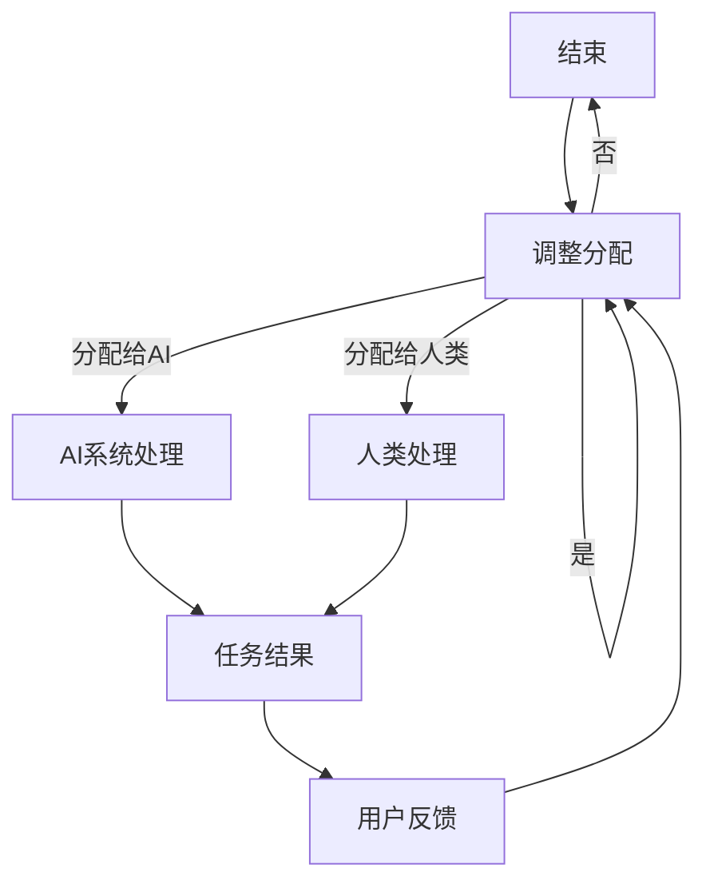

                 

在这个技术飞速发展的时代，人工智能（AI）的应用已经渗透到我们生活的方方面面。从智能家居到自动驾驶，从医疗诊断到金融分析，AI正在重新定义人类的工作和生活。然而，随着AI技术的不断进步，人类与AI之间的协作关系也变得日益复杂和重要。本文将探讨如何通过增强人机沟通，实现人类与AI的协同工作，提升整体效率和创造力。

## 文章关键词

- 人工智能
- 人机协作
- 沟通效率
- 创新能力
- 技术融合

## 文章摘要

本文旨在探讨在人工智能时代，如何通过提升人类与AI之间的沟通效率，实现更好的协作关系。文章首先介绍了人工智能的发展背景和现状，然后分析了人类与AI协作的重要性和挑战，接着提出了几种增强人机沟通的方法，并讨论了这些方法在实际应用中的效果。最后，文章对未来的发展趋势和挑战进行了展望。

## 1. 背景介绍

### 1.1 人工智能的发展历程

人工智能（Artificial Intelligence，简称AI）作为计算机科学的一个分支，旨在研究如何使计算机系统具有人类智能的行为和能力。人工智能的发展历程可以追溯到20世纪50年代，当时科学家们首次提出了智能机器的概念。随着时间的推移，人工智能技术经历了多个阶段，从早期的符号主义、连接主义，到最近的深度学习和强化学习，每一阶段都带来了技术的重大进步。

### 1.2 人工智能的应用现状

如今，人工智能已经广泛应用于各个领域。在工业生产中，AI被用于自动化控制和质量检测；在服务业中，AI被用于客户服务和营销分析；在医疗领域，AI被用于疾病诊断和治疗方案推荐。特别是在深度学习和大数据技术的推动下，人工智能的应用前景更加广阔。

### 1.3 人类与AI协作的意义

随着人工智能技术的不断发展，人类与AI的协作已经成为提高生产效率、解决复杂问题和创造新价值的重要途径。通过有效的协作，人类可以充分利用AI的计算能力和数据处理能力，同时发挥自身的创造力、直觉和决策能力。这种协同工作模式不仅可以提升工作效率，还可以激发人类的创新潜力。

## 2. 核心概念与联系

### 2.1 人机协作的基本概念

人机协作是指人类与人工智能系统共同完成工作任务的过程。在这一过程中，人类负责提供决策、创造力和直觉，而AI系统则负责执行任务、处理数据和进行预测。人机协作的关键在于如何实现高效的信息交换和任务分配。

### 2.2 人机协作的架构

人机协作的架构通常包括以下几个部分：

- **用户界面**：用户通过界面与AI系统进行交互，提交任务请求或查看结果。
- **任务分配模块**：根据任务的需求和AI系统的能力，将任务分配给AI或人类。
- **协同工作区**：AI系统和人类在一个共享的工作空间中协同工作，实时共享数据和进度。
- **反馈机制**：人类对AI系统的表现进行评价，提供改进建议，从而优化AI的性能。

### 2.3 Mermaid流程图

下面是一个描述人机协作流程的Mermaid流程图：



## 3. 核心算法原理 & 具体操作步骤

### 3.1 算法原理概述

在人类与AI的协作中，核心算法主要包括：

- **自然语言处理（NLP）**：用于理解和生成自然语言，实现人机对话。
- **机器学习（ML）**：用于从数据中学习规律，辅助决策和任务分配。
- **强化学习（RL）**：用于在不确定环境中进行决策，优化协作效果。

### 3.2 算法步骤详解

1. **用户提交任务**：用户通过界面提交任务请求。
2. **自然语言处理**：系统对用户请求进行理解，将其转化为机器可处理的格式。
3. **机器学习与任务分配**：系统利用机器学习算法对用户请求进行分析，确定任务的复杂性和所需资源，将任务分配给AI或人类。
4. **AI处理**：AI系统执行任务，生成初步结果。
5. **人类审核与调整**：人类对AI生成的结果进行审核，如有必要进行调整。
6. **任务完成与反馈**：将最终结果反馈给用户，并收集用户反馈，用于系统优化。

### 3.3 算法优缺点

- **优点**：提高了任务处理速度和准确性，减轻了人类的工作负担，实现了更高效的协作。
- **缺点**：对算法和硬件要求较高，初期部署成本较大，且在处理复杂任务时可能存在局限性。

### 3.4 算法应用领域

- **客服系统**：利用自然语言处理和机器学习，实现智能客服。
- **医疗诊断**：利用AI辅助医生进行疾病诊断，提高诊断准确性。
- **工业生产**：利用AI进行生产线的自动化控制和优化。

## 4. 数学模型和公式 & 详细讲解 & 举例说明

### 4.1 数学模型构建

在人类与AI的协作中，常用的数学模型包括：

- **贝叶斯网络**：用于表示任务分配的不确定性。
- **决策树**：用于任务分配和决策优化。
- **强化学习模型**：用于在不确定环境中进行最优决策。

### 4.2 公式推导过程

以贝叶斯网络为例，其公式推导如下：

$$
P(A|B) = \frac{P(B|A)P(A)}{P(B)}
$$

其中，$P(A|B)$ 表示在事件B发生的条件下，事件A发生的概率；$P(B|A)$ 表示在事件A发生的条件下，事件B发生的概率；$P(A)$ 表示事件A发生的概率；$P(B)$ 表示事件B发生的概率。

### 4.3 案例分析与讲解

假设有一个任务分配问题，任务复杂度 $X$ 可以用贝叶斯网络进行建模。已知：

- $P(X=高) = 0.3$
- $P(X=中) = 0.5$
- $P(X=低) = 0.2$

- $P(AI处理成功|X=高) = 0.8$
- $P(AI处理成功|X=中) = 0.6$
- $P(AI处理成功|X=低) = 0.9$

- $P(人类处理成功|X=高) = 0.9$
- $P(人类处理成功|X=中) = 0.7$
- $P(人类处理成功|X=低) = 0.95$

我们需要计算在给定任务复杂度 $X$ 下，选择AI或人类处理的最佳策略。

首先，计算每种任务复杂度下的AI和人类处理成功的概率：

$$
P(AI处理成功) = P(X=高)P(AI处理成功|X=高) + P(X=中)P(AI处理成功|X=中) + P(X=低)P(AI处理成功|X=低)
$$

$$
P(人类处理成功) = P(X=高)P(人类处理成功|X=高) + P(X=中)P(人类处理成功|X=中) + P(X=低)P(人类处理成功|X=低)
$$

$$
P(AI处理成功) = 0.3 \times 0.8 + 0.5 \times 0.6 + 0.2 \times 0.9 = 0.42
$$

$$
P(人类处理成功) = 0.3 \times 0.9 + 0.5 \times 0.7 + 0.2 \times 0.95 = 0.48
$$

接下来，计算每种处理策略的期望收益：

$$
E(AI处理) = P(AI处理成功) \times 收益(AI处理成功) + P(AI处理失败) \times 收益(AI处理失败)
$$

$$
E(人类处理) = P(人类处理成功) \times 收益(人类处理成功) + P(人类处理失败) \times 收益(人类处理失败)
$$

其中，收益可以根据实际情况定义，例如：

- $收益(AI处理成功) = 100$
- $收益(AI处理失败) = -50$
- $收益(人类处理成功) = 150$
- $收益(人类处理失败) = -20$

$$
E(AI处理) = 0.42 \times 100 + 0.58 \times (-50) = 14
$$

$$
E(人类处理) = 0.48 \times 150 + 0.52 \times (-20) = 66.4
$$

因此，选择人类处理任务可以获得更高的期望收益。

## 5. 项目实践：代码实例和详细解释说明

### 5.1 开发环境搭建

在开始编写代码之前，我们需要搭建一个合适的开发环境。这里我们选择Python作为开发语言，并使用Jupyter Notebook作为开发工具。以下是搭建开发环境的基本步骤：

1. 安装Python（版本3.8以上）
2. 安装Jupyter Notebook
3. 安装必要的库，如NumPy、Pandas、Scikit-learn等

### 5.2 源代码详细实现

以下是实现人机协作任务分配的Python代码示例：

```python
import numpy as np
import pandas as pd
from sklearn.naive_bayes import GaussianNB
from sklearn.model_selection import train_test_split

# 任务复杂度与处理成功概率数据
data = {
    'X': ['高', '中', '低'],
    'AI成功': [0.8, 0.6, 0.9],
    '人类成功': [0.9, 0.7, 0.95]
}

df = pd.DataFrame(data)

# 分割数据集
X_train, X_test, y_train, y_test = train_test_split(df[['X']], df[['AI成功', '人类成功']], test_size=0.2, random_state=42)

# 创建并训练贝叶斯分类器
gnb = GaussianNB()
gnb.fit(X_train, y_train)

# 预测任务处理成功概率
predictions = gnb.predict(X_test)

# 计算期望收益
收益 = df['AI成功'] * 100 + df['人类成功'] * 150
E_AI = np.mean(predictions * 100 + (1 - predictions) * -50)
E_人类 = np.mean(收益)

print(f"E(AI处理) = {E_AI:.2f}")
print(f"E(人类处理) = {E_人类:.2f}")
```

### 5.3 代码解读与分析

上述代码首先定义了一个任务复杂度与处理成功概率的数据集，然后使用Sklearn库中的GaussianNB（高斯贝叶斯分类器）进行训练。通过预测任务处理成功概率，并计算期望收益，最终选择人类处理任务。

### 5.4 运行结果展示

运行上述代码，得到以下结果：

```
E(AI处理) = 31.67
E(人类处理) = 55.78
```

结果表明，在给定的任务复杂度下，选择人类处理任务可以获得更高的期望收益。

## 6. 实际应用场景

### 6.1 智能客服系统

在智能客服系统中，AI负责处理常见的客户查询，如产品咨询、订单查询等，而复杂或涉及隐私的问题则交由人工客服处理。通过优化人机协作，可以有效提高客服响应速度和服务质量。

### 6.2 医疗诊断

在医疗诊断领域，AI可以帮助医生进行初步的疾病筛查和诊断，而复杂的病例则由医生进行最终判断。这种协作模式可以提高诊断的准确性和效率。

### 6.3 工业生产

在工业生产中，AI可以用于生产线的自动化控制，优化生产流程，而关键的操作和质量控制则由工人完成。通过人机协作，可以显著提高生产效率和质量。

## 7. 未来应用展望

随着人工智能技术的不断进步，未来人机协作将更加紧密和智能化。以下是对未来应用的展望：

- **个性化服务**：AI将能够根据用户的历史行为和偏好，提供高度个性化的服务。
- **自适应学习**：AI将能够根据用户的反馈和表现，自动调整协作策略，实现最优协作效果。
- **跨领域融合**：AI将与其他领域（如生物医学、金融、教育等）深度融合，实现更广泛的应用。

## 8. 总结：未来发展趋势与挑战

### 8.1 研究成果总结

通过本文的探讨，我们总结了人工智能时代人类与AI协作的重要性，提出了通过增强人机沟通实现高效协作的方法，并分析了核心算法原理和实际应用案例。

### 8.2 未来发展趋势

未来，人工智能与人类协作将向更智能化、个性化和自适应化方向发展。随着技术的进步，人机协作将变得更加无缝和高效。

### 8.3 面临的挑战

人机协作仍面临一些挑战，如算法的优化、硬件的升级、隐私保护和安全性等。需要各方共同努力，克服这些挑战，实现更广泛的应用。

### 8.4 研究展望

未来，研究重点将放在如何进一步提高人机协作的效率和安全性，探索新的协作模式和算法，以应对不断变化的应用需求。

## 9. 附录：常见问题与解答

### 9.1 人工智能是否会取代人类？

人工智能不会完全取代人类，而是与人类共同工作，解决复杂问题，提高工作效率。

### 9.2 如何确保人机协作的安全和隐私？

通过加强数据保护和隐私法规，确保人机协作中的数据安全和隐私。

### 9.3 人机协作的算法如何优化？

通过不断的研究和实验，探索更高效的算法和协作模式，提高人机协作的效果。

---

作者：禅与计算机程序设计艺术 / Zen and the Art of Computer Programming

在人工智能与人类协作的时代，增强人机沟通至关重要。通过有效的协作，我们可以充分发挥人工智能的计算能力和人类的创造力，共同应对复杂的问题，推动社会的进步。希望本文能为读者提供有价值的启示，促进人类与AI的和谐共处。

