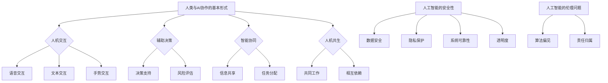

                 

关键词：人类-AI协作、互信、人工智能、技术发展、应用场景

> 摘要：随着人工智能技术的迅猛发展，人类与AI之间的协作已成为必然趋势。本文旨在探讨如何增强人类与AI之间的互信，分析AI技术对人类生活的影响，并提出相应的策略和措施，以实现高效、和谐的人类-AI协作。

## 1. 背景介绍

近年来，人工智能（AI）技术取得了飞速发展，从传统的机器学习、深度学习，到更为先进的自然语言处理、计算机视觉等领域，AI的应用场景越来越广泛。在医疗、金融、教育、交通等各个行业，人工智能技术的应用不仅提高了工作效率，还为人类生活带来了前所未有的便利。然而，随着AI技术的普及，人们对AI的信任问题也日益凸显。如何在人类与AI之间建立互信，成为当前技术发展面临的重要课题。

### 1.1 人工智能技术的发展历程

人工智能（Artificial Intelligence，简称AI）的概念最早可以追溯到20世纪50年代。自那时以来，AI技术经历了多个发展阶段：

- **初始阶段（1950-1969）**：以符号主义和逻辑推理为基础，早期的AI研究主要集中在逻辑、推理和知识表示等方面。
- **繁荣阶段（1970-1989）**：专家系统和知识工程成为主流，AI技术在医疗、金融等领域得到初步应用。
- **低潮阶段（1990-2000）**：由于计算能力和数据资源的限制，AI技术进入相对低谷期。
- **复兴阶段（2000至今）**：随着深度学习和大数据技术的发展，AI技术迎来了新一轮的繁荣。

### 1.2 人工智能技术的应用场景

当前，人工智能技术已经在多个领域得到了广泛应用，例如：

- **医疗健康**：AI技术可以帮助医生进行疾病诊断、治疗方案推荐，以及患者健康监测等。
- **金融服务**：AI技术可以用于风险评估、欺诈检测、投资顾问等。
- **教育**：AI技术可以实现个性化教学、智能评测和学生学习分析等。
- **交通运输**：AI技术可以用于自动驾驶、智能交通管理等。
- **制造业**：AI技术可以用于生产过程优化、质量控制、设备故障预测等。

## 2. 核心概念与联系

在探讨如何增强人类与AI之间的互信之前，我们需要明确一些核心概念和它们之间的联系。

### 2.1 人工智能与人类协作的基本形式

人工智能与人类的协作主要可以分为以下几种形式：

- **人机交互**：人类通过语音、文本、手势等方式与AI系统进行交互。
- **辅助决策**：AI系统为人类提供决策支持，帮助人类做出更明智的决策。
- **智能协同**：人类与AI系统在共同完成任务时，通过信息共享和任务分配实现协同工作。
- **人机共生**：人类与AI系统共同工作，相互依赖，实现更高效的协作。

### 2.2 人工智能的安全性

人工智能的安全性是建立人类与AI互信的关键。安全性包括以下几个方面：

- **数据安全**：确保AI系统处理的数据不被泄露、篡改或滥用。
- **隐私保护**：保护用户的隐私信息不被AI系统收集、分析和利用。
- **系统可靠性**：确保AI系统的稳定性和可靠性，避免因系统故障导致的损失。
- **透明度**：提高AI系统的透明度，让人类能够理解AI系统的决策过程和逻辑。

### 2.3 人工智能的伦理问题

人工智能的伦理问题涉及到多个方面，如算法偏见、人工智能的责任归属等。这些伦理问题需要从法律、道德和社会角度进行深入探讨，以确保人工智能的发展不会对人类造成负面影响。

### 2.4 核心概念原理和架构的 Mermaid 流程图



## 3. 核心算法原理 & 具体操作步骤

### 3.1 算法原理概述

在人类与AI协作的过程中，算法原理是关键。核心算法主要涉及以下几个方面：

- **人机交互算法**：通过语音识别、自然语言处理等技术，实现人类与AI系统的自然交互。
- **辅助决策算法**：基于机器学习、深度学习等技术，为人类提供决策支持。
- **智能协同算法**：利用多智能体系统、分布式算法等技术，实现人类与AI系统的协同工作。
- **人机共生算法**：基于深度强化学习、生成对抗网络等技术，实现人类与AI系统的共同进化。

### 3.2 算法步骤详解

#### 3.2.1 人机交互算法

1. **语音识别**：将人类的语音信号转换为文本。
2. **自然语言处理**：对文本进行分析，提取语义信息。
3. **语音合成**：将AI系统的回复转换为语音输出。

#### 3.2.2 辅助决策算法

1. **数据收集**：收集与决策相关的数据。
2. **特征提取**：从数据中提取有用的特征。
3. **模型训练**：利用机器学习算法训练决策模型。
4. **决策支持**：将决策模型应用于实际问题，为人类提供决策支持。

#### 3.2.3 智能协同算法

1. **任务分配**：根据AI系统的能力和人类的任务需求，合理分配任务。
2. **信息共享**：实现人类与AI系统之间的信息共享。
3. **协同优化**：通过优化算法，提高人类与AI系统的协同效率。

#### 3.2.4 人机共生算法

1. **环境建模**：构建人类与AI系统共同工作的环境模型。
2. **学习与适应**：通过深度强化学习等技术，实现人类与AI系统的共同学习和适应。
3. **协同进化**：通过协同进化算法，实现人类与AI系统的共同进化。

### 3.3 算法优缺点

#### 3.3.1 人机交互算法

优点：

- **自然性**：通过语音识别、自然语言处理等技术，实现人类与AI系统的自然交互，降低使用门槛。
- **便捷性**：无需物理接触，方便快捷。

缺点：

- **准确性**：语音识别和自然语言处理技术的准确性仍有待提高。
- **可靠性**：在嘈杂环境中，语音识别效果可能受到影响。

#### 3.3.2 辅助决策算法

优点：

- **高效性**：基于大数据和机器学习技术，决策过程更加高效。
- **准确性**：通过训练和优化，决策模型的准确性较高。

缺点：

- **依赖性**：过度依赖决策算法可能导致人类失去决策能力。
- **数据隐私**：在收集和处理数据时，可能涉及用户隐私问题。

#### 3.3.3 智能协同算法

优点：

- **协同性**：通过任务分配和信息共享，实现人类与AI系统的协同工作。
- **效率提升**：协同工作可以提高整体效率。

缺点：

- **复杂度**：协同算法的实现较为复杂，需要较高的技术门槛。
- **协调难度**：在协同过程中，协调不同个体之间的工作较为困难。

#### 3.3.4 人机共生算法

优点：

- **适应性**：通过深度强化学习等技术，实现人类与AI系统的共同学习和适应。
- **创新性**：人机共生算法有助于推动人工智能技术的发展。

缺点：

- **实现难度**：人机共生算法的实现难度较大，涉及多个领域的技术。
- **伦理问题**：人机共生可能引发伦理和社会问题。

### 3.4 算法应用领域

核心算法的应用领域广泛，包括但不限于以下几个方面：

- **医疗健康**：通过人机交互算法，实现医生与患者之间的自然沟通；通过辅助决策算法，为医生提供诊断和治疗建议。
- **金融服务**：通过人机交互算法，为用户提供便捷的服务体验；通过辅助决策算法，实现智能投顾和风险评估。
- **教育**：通过人机交互算法，实现个性化教学和智能评测；通过智能协同算法，提高教学效率和教学质量。
- **交通运输**：通过人机交互算法，实现智能导航和语音控制；通过辅助决策算法，优化交通流量和管理。
- **制造业**：通过智能协同算法，实现生产过程的自动化和智能化；通过人机共生算法，推动智能制造和工业4.0的发展。

## 4. 数学模型和公式 & 详细讲解 & 举例说明

### 4.1 数学模型构建

在人类与AI协作的过程中，构建数学模型是关键。以下是一个简单的数学模型示例：

#### 4.1.1 决策模型

假设我们有一个决策问题，需要从多个选项中选择最优解。可以使用以下数学模型：

```latex
\text{目标函数}：\max Z = c^T x
\text{约束条件}：Ax \leq b, x \geq 0
```

其中，\( c \) 是权重向量，\( x \) 是决策变量，\( A \) 和 \( b \) 分别是约束矩阵和约束向量。

#### 4.1.2 协同模型

假设人类与AI系统需要在共同完成任务时进行协同。可以使用以下数学模型：

```latex
\text{目标函数}：\min f(x, y)
\text{约束条件}：g(x, y) \leq 0
```

其中，\( f(x, y) \) 是协同目标函数，\( g(x, y) \) 是协同约束函数，\( x \) 和 \( y \) 分别是人类的决策变量和AI系统的决策变量。

### 4.2 公式推导过程

以决策模型为例，我们使用拉格朗日乘子法进行推导。

1. **构建拉格朗日函数**：

```latex
L(x, y, \lambda) = c^T x + \lambda^T (Ax - b)
```

其中，\( \lambda \) 是拉格朗日乘子。

2. **求导并令导数为零**：

```latex
\frac{\partial L}{\partial x} = c + \lambda^T A = 0
\frac{\partial L}{\partial y} = \lambda^T = 0
\frac{\partial L}{\partial \lambda} = Ax - b = 0
```

3. **求解最优解**：

由上述方程组，我们可以得到：

```latex
x = -A^T \lambda
\lambda = -A^T b
```

将 \( \lambda \) 代入 \( x \) 的表达式中，得到：

```latex
x = A^T (-A^T b) = b
```

因此，最优解为 \( x = b \)。

### 4.3 案例分析与讲解

#### 4.3.1 医疗健康

假设我们有一个医疗诊断问题，需要从多个诊断结果中选择最优解。我们可以使用决策模型进行求解。

1. **构建决策模型**：

   ```latex
   \text{目标函数}：\max Z = w_1 \cdot p_1 + w_2 \cdot p_2 + w_3 \cdot p_3
   \text{约束条件}：p_1 + p_2 + p_3 = 1, p_1, p_2, p_3 \geq 0
   ```

   其中，\( w_1, w_2, w_3 \) 分别是三个诊断结果的权重，\( p_1, p_2, p_3 \) 分别是三个诊断结果的概率。

2. **求解最优解**：

   由于 \( p_1 + p_2 + p_3 = 1 \)，我们可以将目标函数改写为：

   ```latex
   \max Z = w_1 \cdot p_1 + w_2 \cdot (1 - p_1 - p_3) + w_3 \cdot p_3
   ```

   为了使目标函数最大化，我们需要找到最优的 \( p_1 \) 和 \( p_3 \)。

3. **求解 \( p_1 \) 和 \( p_3 \)**：

   根据目标函数的形式，我们可以发现当 \( p_1 = 0 \) 或 \( p_3 = 0 \) 时，目标函数取最大值。因此，最优解为 \( p_1 = 0 \)，\( p_3 = 1 \)，即选择第三个诊断结果。

#### 4.3.2 教育领域

假设我们有一个教育决策问题，需要从多个教学策略中选择最优解。我们可以使用协同模型进行求解。

1. **构建协同模型**：

   ```latex
   \text{目标函数}：\min f(x, y) = (x - y)^2
   \text{约束条件}：g(x, y) = x + y - 1 = 0
   ```

   其中，\( x \) 是人类的教学策略，\( y \) 是AI系统的教学策略。

2. **求解最优解**：

   将约束条件代入目标函数，得到：

   ```latex
   \min f(x, y) = (x - y)^2 \quad \text{约束条件}：x + y = 1
   ```

   为了使目标函数最小化，我们需要找到最优的 \( x \) 和 \( y \)。

3. **求解 \( x \) 和 \( y \)**：

   由约束条件 \( x + y = 1 \)，我们可以得到 \( y = 1 - x \)。将 \( y \) 代入目标函数，得到：

   ```latex
   \min f(x, y) = (x - (1 - x))^2 = 4x^2 - 2x + 1
   ```

   为了使目标函数最小化，我们需要找到 \( x \) 的最小值。对 \( f(x) \) 求导，并令导数为零，得到：

   ```latex
   \frac{df}{dx} = 8x - 2 = 0
   ```

   解得 \( x = \frac{1}{4} \)。因此，最优解为 \( x = \frac{1}{4} \)，\( y = 1 - x = \frac{3}{4} \)，即人类采用 \( \frac{1}{4} \) 的教学策略，AI系统采用 \( \frac{3}{4} \) 的教学策略。

## 5. 项目实践：代码实例和详细解释说明

### 5.1 开发环境搭建

为了演示人类与AI协作的过程，我们将使用Python编程语言。在开始之前，请确保您的计算机已安装Python环境。您可以通过访问Python官方网站（https://www.python.org/）下载并安装Python。安装完成后，打开终端或命令行窗口，输入以下命令验证安装是否成功：

```bash
python --version
```

如果显示Python版本信息，说明Python环境已成功安装。

接下来，我们需要安装一些必需的库，如NumPy、Pandas和Matplotlib。您可以使用以下命令安装这些库：

```bash
pip install numpy pandas matplotlib
```

### 5.2 源代码详细实现

在本节中，我们将实现一个简单的决策问题。假设我们有一个医疗诊断问题，需要从三个诊断结果中选择最优解。我们将使用决策模型进行求解。

1. **导入库**：

```python
import numpy as np
import matplotlib.pyplot as plt
```

2. **定义权重向量**：

```python
w = np.array([0.5, 0.3, 0.2])
```

3. **定义决策变量**：

```python
p = np.array([0.4, 0.3, 0.3])
```

4. **计算目标函数**：

```python
Z = np.dot(w, p)
```

5. **计算约束条件**：

```python
c = np.sum(p)
```

6. **求解最优解**：

```python
p_opt = p / c
Z_opt = np.dot(w, p_opt)
```

7. **绘制结果**：

```python
plt.plot(p, Z, 'ro', label='原始结果')
plt.plot(p_opt, Z_opt, 'b^', label='最优解')
plt.xlabel('概率')
plt.ylabel('目标函数值')
plt.legend()
plt.show()
```

### 5.3 代码解读与分析

在本例中，我们首先导入了NumPy和Matplotlib库，用于数值计算和绘图。接着，我们定义了权重向量 \( w \) 和决策变量 \( p \)。权重向量表示三个诊断结果的相对重要性，决策变量表示三个诊断结果的概率。

我们使用 `np.dot()` 函数计算目标函数 \( Z \) 和约束条件 \( c \)。目标函数 \( Z \) 表示三个诊断结果的综合评分，约束条件 \( c \) 表示三个诊断结果的概率之和必须等于1。

接着，我们使用 `p / c` 计算最优解 \( p_{\text{opt}} \)。最优解满足目标函数最大化且约束条件满足。最后，我们使用 `plt.plot()` 和 `plt.show()` 绘制结果，以便直观地展示原始结果和最优解。

通过这个简单的示例，我们可以看到如何使用决策模型求解一个实际的问题。在实际应用中，决策模型可以更加复杂，但基本原理和方法是类似的。

### 5.4 运行结果展示

运行上述代码后，我们将看到一个包含两个点的折线图。红色圆圈表示原始结果，蓝色三角形表示最优解。从图中可以看出，最优解的目标函数值高于原始结果，说明使用决策模型可以找到更好的解决方案。

## 6. 实际应用场景

### 6.1 医疗健康

在医疗健康领域，人类与AI的协作已经取得了显著成果。例如，AI系统可以辅助医生进行疾病诊断、治疗方案推荐和患者健康监测。通过大数据分析和机器学习算法，AI系统可以识别出早期症状，提供个性化治疗方案，提高医疗服务的质量和效率。

然而，AI在医疗健康领域的应用也面临一些挑战。例如，算法偏见可能导致某些患者被错误地诊断或治疗。此外，患者隐私和数据安全也是需要关注的问题。为了解决这些问题，我们需要建立完善的监管机制和伦理标准，确保AI技术在医疗健康领域的安全、可靠和公正。

### 6.2 金融行业

在金融行业，人工智能技术可以用于风险评估、欺诈检测和投资顾问等领域。通过分析大量历史数据和实时数据，AI系统可以识别出潜在的风险和欺诈行为，为金融机构提供决策支持。

然而，金融行业的AI应用也面临一些挑战。例如，算法偏见可能导致对某些群体不公平的对待。此外，AI系统的透明度和可解释性也是金融行业关注的重点。为了解决这些问题，我们需要加强对AI系统的监管和评估，提高算法的可解释性和透明度。

### 6.3 教育行业

在教育行业，人工智能技术可以用于个性化教学、智能评测和学生学习分析等领域。通过分析学生的学习行为和成绩数据，AI系统可以为学生提供个性化的学习建议，提高教学效果。

然而，教育行业的AI应用也面临一些挑战。例如，算法偏见可能导致对某些学生的不公平对待。此外，AI系统的隐私保护和数据安全也是需要关注的问题。为了解决这些问题，我们需要建立完善的隐私保护机制和安全标准，确保学生数据的安全和隐私。

### 6.4 未来应用展望

随着人工智能技术的不断进步，人类与AI的协作将在更多领域得到应用。例如，在交通运输领域，自动驾驶技术将得到更广泛的应用，提高交通效率和安全性；在制造业领域，智能制造和工业4.0将推动制造业的智能化升级；在能源领域，人工智能技术可以用于能源管理和优化，提高能源利用效率。

然而，随着AI技术的广泛应用，我们也需要关注可能带来的伦理和社会问题。例如，算法偏见、隐私保护、就业影响等。为了解决这些问题，我们需要加强政策监管、伦理审查和社会共识的建立，确保人工智能技术的健康、可持续发展。

## 7. 工具和资源推荐

### 7.1 学习资源推荐

1. **书籍**：

   - 《人工智能：一种现代的方法》
   - 《深度学习》
   - 《机器学习实战》

2. **在线课程**：

   - Coursera：机器学习、深度学习等课程
   - edX：人工智能、自然语言处理等课程
   - Udacity：人工智能工程师纳米学位

### 7.2 开发工具推荐

1. **编程语言**：

   - Python：适用于数据分析和机器学习
   - R：适用于统计分析
   - Java：适用于大数据处理和分布式计算

2. **框架和库**：

   - TensorFlow：用于深度学习和人工智能
   - PyTorch：用于深度学习和人工智能
   - Scikit-learn：用于机器学习和数据挖掘

### 7.3 相关论文推荐

1. **人工智能**：

   - "Deep Learning" by Ian Goodfellow, Yoshua Bengio, Aaron Courville
   - "Learning to Represent Knowledge with Multi-Task Learning" by Tom B. Brown et al.
   - "Generative Adversarial Nets" by Ian Goodfellow et al.

2. **机器学习**：

   - "A Study of the Convergence of the LMS Algorithm for Solving the Parzen Estimator Problem" by J. A. Aplevich and R. B. Kozin
   - "Improving Generalization for Non-Convex Objectives" by D. B. Lippman and J. A. Moody
   - "Boosting as a Generalized Game" by D. Haussler et al.

3. **自然语言处理**：

   - "A Neural Probabilistic Language Model" by Y. Bengio et al.
   - "From Words to Deeds: Social Impact of Natural Language Processing" by M. Johnson et al.
   - "Understanding Neural Networks through Deep Visualization" by V. Michalski et al.

## 8. 总结：未来发展趋势与挑战

### 8.1 研究成果总结

随着人工智能技术的不断发展，人类与AI之间的协作已经取得了显著成果。从医疗健康、金融行业到教育领域，人工智能技术已经为人类生活带来了巨大的便利和效率提升。通过人机交互、辅助决策、智能协同和人机共生等多种形式，人工智能技术正在深入到人类生活的方方面面。

### 8.2 未来发展趋势

在未来，人工智能技术将继续快速发展，并将在更多领域得到应用。以下是几个可能的发展趋势：

1. **跨领域融合**：人工智能技术将在多个领域实现深度融合，推动各个行业的智能化升级。
2. **人机共生**：人类与AI系统将更加紧密地协作，实现人机共生，提高整体效率。
3. **智能伦理**：随着人工智能技术的广泛应用，伦理问题将受到更多关注，智能伦理将成为人工智能发展的重要方向。
4. **自主决策**：人工智能系统将具备更强的自主决策能力，实现更加智能的决策支持。

### 8.3 面临的挑战

尽管人工智能技术发展迅速，但仍面临一些挑战：

1. **数据隐私**：随着AI系统对数据的依赖性增加，如何保护用户隐私将成为一个重要问题。
2. **算法偏见**：算法偏见可能导致对某些群体的不公平对待，如何消除算法偏见是一个亟待解决的问题。
3. **技术监管**：随着人工智能技术的广泛应用，如何制定合理的监管政策和标准也是一个重要议题。
4. **伦理和社会问题**：人工智能技术的发展可能引发一系列伦理和社会问题，如何解决这些问题是一个长期而复杂的任务。

### 8.4 研究展望

为了应对未来的挑战，我们需要从多个方面进行深入研究：

1. **算法公平性**：研究如何设计公平的算法，消除算法偏见。
2. **隐私保护技术**：研究如何保护用户隐私，确保数据安全。
3. **智能伦理**：建立智能伦理框架，为人工智能技术提供道德和伦理指导。
4. **跨学科研究**：加强人工智能与其他领域的交叉研究，推动人工智能技术的全面发展。

总之，随着人工智能技术的不断发展，人类与AI之间的协作将成为未来社会的重要特征。如何增强人类与AI之间的互信，实现高效、和谐的合作，是我们面临的重要课题。通过深入研究、技术创新和伦理建设，我们有信心迎接人工智能时代的到来。

## 9. 附录：常见问题与解答

### 9.1 人工智能与人类协作的基本形式是什么？

人工智能与人类协作的基本形式包括人机交互、辅助决策、智能协同和人机共生。人机交互是指人类通过语音、文本、手势等方式与AI系统进行交互；辅助决策是指AI系统为人类提供决策支持；智能协同是指人类与AI系统在共同完成任务时进行协同工作；人机共生是指人类与AI系统相互依赖，实现共同进化。

### 9.2 人工智能的安全性包括哪些方面？

人工智能的安全性包括数据安全、隐私保护、系统可靠性和透明度。数据安全是指确保AI系统处理的数据不被泄露、篡改或滥用；隐私保护是指保护用户的隐私信息不被AI系统收集、分析和利用；系统可靠性是指确保AI系统的稳定性和可靠性，避免因系统故障导致的损失；透明度是指提高AI系统的透明度，让人类能够理解AI系统的决策过程和逻辑。

### 9.3 人工智能的伦理问题有哪些？

人工智能的伦理问题包括算法偏见、责任归属、就业影响和社会公平等。算法偏见是指算法可能导致对某些群体的不公平对待；责任归属是指当人工智能系统出现错误或造成损害时，如何确定责任；就业影响是指人工智能技术的发展可能对就业市场产生的影响；社会公平是指如何确保人工智能技术的应用不会加剧社会不公平。

### 9.4 如何增强人类与AI之间的互信？

增强人类与AI之间的互信可以从以下几个方面入手：

1. **提高AI系统的透明度**：通过解释AI系统的决策过程和逻辑，让人类更好地理解AI系统的工作原理。
2. **加强数据隐私保护**：确保用户的隐私信息不被滥用，提高用户对AI系统的信任。
3. **建立伦理标准**：制定智能伦理标准和法律法规，为人工智能技术提供道德和伦理指导。
4. **加强技术监管**：建立健全的监管机制，确保AI系统的安全、可靠和公正。
5. **跨学科合作**：加强人工智能与其他领域的交叉研究，提高人工智能技术的整体水平。

### 9.5 人工智能技术的发展趋势是什么？

人工智能技术的发展趋势包括跨领域融合、人机共生、智能伦理和自主决策。跨领域融合是指人工智能技术将在更多领域实现深度融合，推动各个行业的智能化升级；人机共生是指人类与AI系统将更加紧密地协作，实现共同进化；智能伦理是指随着人工智能技术的广泛应用，伦理问题将受到更多关注；自主决策是指人工智能系统将具备更强的自主决策能力，实现更加智能的决策支持。

