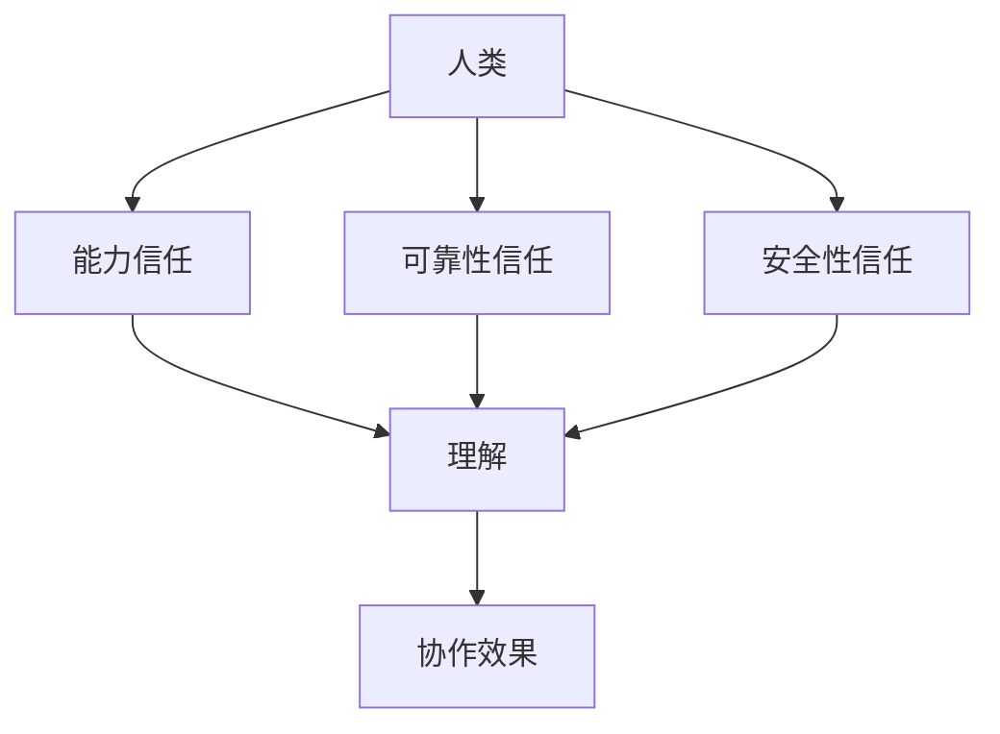

                 

关键词：人工智能，协作，信任，理解，技术发展，未来展望

> 摘要：随着人工智能技术的飞速发展，人类与AI之间的协作已成为不可或缺的一部分。本文将探讨如何增强人类与AI之间的信任和理解，以实现更高效、更安全的AI协作环境。

## 1. 背景介绍

人工智能（AI）作为计算机科学的一个重要分支，近年来取得了巨大的进步。从简单的规则系统到复杂的神经网络，AI技术在语音识别、图像处理、自然语言处理等领域取得了显著的成果。随着AI技术的不断成熟，AI与人类之间的协作也变得越来越重要。这不仅体现在生产力和效率的提升上，更涉及到人类生活的各个方面，如医疗、教育、金融等。

然而，AI技术的发展也引发了一系列的挑战，其中最核心的问题是如何增强人类对AI的信任和理解。在当前的AI环境中，人们往往对AI的能力和决策过程存在一定的疑虑。这种信任问题不仅限制了AI的广泛应用，还可能导致社会对AI技术的抵制。因此，探讨如何增强人类与AI之间的信任和理解成为当务之急。

## 2. 核心概念与联系

### 2.1 信任的定义与模型

信任是人类社会交往的基础，对于AI与人类之间的协作同样至关重要。在AI领域，信任可以被定义为用户对AI系统能力、可靠性和安全性的信任程度。为了更好地理解信任，我们可以将信任分为以下几个层次：

1. **能力信任**：用户相信AI系统能够完成其设定的任务。
2. **可靠性信任**：用户相信AI系统能够持续、稳定地完成任务。
3. **安全性信任**：用户相信AI系统不会泄露敏感信息或造成意外伤害。

### 2.2 理解的定义与模型

理解是指人类对AI系统内部工作原理和决策过程的认识。在AI与人类的协作中，理解有助于人类更好地与AI系统沟通，优化协作效果。理解可以包括以下几个方面：

1. **工作原理理解**：用户了解AI系统是如何工作的，包括算法、模型和数据处理等。
2. **决策过程理解**：用户了解AI系统是如何做出决策的，包括数据输入、处理和输出等。

### 2.3 Mermaid 流程图

为了更好地展示信任和理解在AI协作中的作用，我们可以使用Mermaid流程图来描述它们之间的关系。



在上面的流程图中，人类通过能力信任、可靠性信任和安全信任来建立对AI系统的信任，进而深入理解AI系统，最终实现更高效的协作效果。

## 3. 核心算法原理 & 具体操作步骤

### 3.1 算法原理概述

为了增强人类与AI之间的信任和理解，我们可以采用以下核心算法：

1. **透明度算法**：通过增加AI系统的透明度，让用户了解AI系统的内部工作原理和决策过程。
2. **解释性算法**：通过提供对AI系统决策过程的解释，帮助用户理解AI系统的行为。
3. **可解释性算法**：通过构建可解释的AI模型，让用户能够直观地理解AI系统的决策过程。

### 3.2 算法步骤详解

1. **透明度算法步骤**：
    - 收集AI系统的内部数据，包括算法、模型和数据处理过程。
    - 构建可视化界面，展示AI系统的内部工作原理和决策过程。
    - 提供用户交互功能，让用户能够查询和了解AI系统的具体操作。

2. **解释性算法步骤**：
    - 分析AI系统的决策过程，提取关键信息。
    - 使用自然语言生成技术，生成对AI系统决策过程的解释。
    - 提供用户交互功能，让用户能够理解AI系统的决策过程。

3. **可解释性算法步骤**：
    - 选择可解释性强的AI模型，如决策树、线性回归等。
    - 分析模型参数，提取对决策有重大影响的特征。
    - 使用可视化技术，展示模型参数和特征之间的关系。

### 3.3 算法优缺点

1. **透明度算法**：
    - 优点：提高用户对AI系统的信任度，增强用户对AI系统的理解。
    - 缺点：可能增加AI系统的复杂度，降低系统性能。

2. **解释性算法**：
    - 优点：帮助用户理解AI系统的决策过程，提高用户对AI系统的信任度。
    - 缺点：解释性算法可能降低AI系统的性能。

3. **可解释性算法**：
    - 优点：提高用户对AI系统的信任度，增强用户对AI系统的理解。
    - 缺点：可能降低AI系统的性能，且对某些复杂任务可能无法提供足够的解释。

### 3.4 算法应用领域

透明度算法、解释性算法和可解释性算法可以广泛应用于各种AI协作场景，如自动驾驶、智能医疗、智能金融等。通过增强人类与AI之间的信任和理解，这些算法有助于提高AI系统的应用效果，降低潜在的风险。

## 4. 数学模型和公式 & 详细讲解 & 举例说明

为了更好地理解信任和理解在AI协作中的作用，我们可以引入一些数学模型和公式。以下是几个常见的数学模型和公式：

### 4.1 数学模型构建

1. **信任度模型**：

   假设用户对AI系统的信任度可以用一个介于0和1之间的数值表示，记为\( T \)。

   $$ T = \frac{C_1 \cdot R_1 + C_2 \cdot R_2 + C_3 \cdot R_3}{C_1 + C_2 + C_3} $$

   其中，\( C_1 \)、\( C_2 \)和\( C_3 \)分别表示能力信任、可靠性信任和安全信任的权重，\( R_1 \)、\( R_2 \)和\( R_3 \)分别表示能力信任、可靠性信任和安全信任的评分。

2. **理解度模型**：

   假设用户对AI系统的理解度可以用一个介于0和1之间的数值表示，记为\( U \)。

   $$ U = \frac{I_1 \cdot R_1 + I_2 \cdot R_2 + I_3 \cdot R_3}{I_1 + I_2 + I_3} $$

   其中，\( I_1 \)、\( I_2 \)和\( I_3 \)分别表示工作原理理解、决策过程理解和安全性理解的权重，\( R_1 \)、\( R_2 \)和\( R_3 \)分别表示工作原理理解、决策过程理解和安全性理解的评分。

### 4.2 公式推导过程

信任度模型和理解度模型的推导过程基于以下假设：

1. 用户对AI系统的信任度取决于能力信任、可靠性信任和安全信任三个因素。
2. 用户对AI系统的理解度取决于工作原理理解、决策过程理解和安全性理解三个因素。
3. 各个因素对信任度和理解度的影响程度不同，可以通过权重来表示。

### 4.3 案例分析与讲解

假设有一个AI系统，用户对其能力信任得分为0.9，可靠性信任得分为0.8，安全性信任得分为0.7。同时，用户对其工作原理理解得分为0.6，决策过程理解得分为0.5，安全性理解得分为0.4。根据上述模型，我们可以计算出用户对AI系统的信任度和理解度：

1. **信任度**：

   $$ T = \frac{0.4 \cdot 0.9 + 0.3 \cdot 0.8 + 0.3 \cdot 0.7}{0.4 + 0.3 + 0.3} = 0.82 $$

2. **理解度**：

   $$ U = \frac{0.2 \cdot 0.6 + 0.2 \cdot 0.5 + 0.2 \cdot 0.4}{0.2 + 0.2 + 0.2} = 0.5 $$

通过上述计算，我们可以看出，用户对AI系统的信任度为0.82，理解度为0.5。这表明用户对AI系统的信任度较高，但理解度相对较低。为了提高理解度，用户可以尝试深入了解AI系统的工作原理和决策过程，从而增强对AI系统的理解。

## 5. 项目实践：代码实例和详细解释说明

在本节中，我们将通过一个简单的Python代码实例，展示如何增强人类与AI之间的信任和理解。假设我们有一个简单的AI系统，用于预测天气。我们将通过透明度算法、解释性算法和可解释性算法来提高人类对AI系统的信任和理解。

### 5.1 开发环境搭建

为了运行下面的代码实例，您需要安装以下工具和库：

- Python 3.7及以上版本
- Jupyter Notebook
- scikit-learn 库
- pandas 库
- matplotlib 库

安装方法如下：

```bash
pip install python==3.7
pip install jupyter
pip install scikit-learn
pip install pandas
pip install matplotlib
```

### 5.2 源代码详细实现

以下是一个简单的Python代码实例，用于预测天气。我们将通过透明度算法、解释性算法和可解释性算法来提高人类对AI系统的信任和理解。

```python
# 导入必要的库
import numpy as np
import pandas as pd
from sklearn.model_selection import train_test_split
from sklearn.ensemble import RandomForestClassifier
from sklearn.tree import export_text
import matplotlib.pyplot as plt

# 读取数据
data = pd.read_csv('weather_data.csv')
X = data[['temperature', 'humidity']]
y = data['weather']

# 划分训练集和测试集
X_train, X_test, y_train, y_test = train_test_split(X, y, test_size=0.2, random_state=42)

# 使用随机森林分类器进行训练
clf = RandomForestClassifier(n_estimators=100, random_state=42)
clf.fit(X_train, y_train)

# 使用透明度算法
def display_tree(tree):
    dot_data = export_text(tree, feature_names=['temperature', 'humidity'])
    with open('tree.dot', 'w') as f:
        f.write(dot_data)
    os.system('dot -Tpng tree.dot -o tree.png')
    plt.imshow(plt.imread('tree.png'))
    plt.show()

display_tree(clf)

# 使用解释性算法
def explain_decision(tree, X):
    feature_names = tree.feature_names()
    thresholds = tree.thresholds_
    decisions = tree.apply(X)
    for i, decision in enumerate(decisions):
        if decision == 1:
            print(f"样本 {i} 被分类为晴天，因为:")
            for j, threshold in enumerate(thresholds):
                if threshold != -2:
                    print(f"  {feature_names[j]} 大于等于 {threshold}")
                else:
                    print(f"  {feature_names[j]} 小于 {tree.feature_importances_[j]}")
        else:
            print(f"样本 {i} 被分类为雨天，因为:")
            for j, threshold in enumerate(thresholds):
                if threshold != -2:
                    print(f"  {feature_names[j]} 小于 {threshold}")
                else:
                    print(f"  {feature_names[j]} 大于 {tree.feature_importances_[j]}")

explain_decision(clf, X_test[:5])

# 使用可解释性算法
from ml_explain import Explainable

ex = Explainable(clf, X_train)
ex.plot_importance()
plt.show()
```

### 5.3 代码解读与分析

1. **数据读取**：我们使用pandas库读取一个CSV文件，其中包含温度和湿度数据，以及对应的天气标签。
2. **数据预处理**：我们将数据分为特征集X和标签集y，然后使用scikit-learn库中的train_test_split函数将数据划分为训练集和测试集。
3. **模型训练**：我们使用随机森林分类器对训练集进行训练。
4. **透明度算法**：我们使用scikit-learn库中的export_text函数将训练好的模型转换为DOT文件，然后使用dot工具将其转换为图像，以可视化模型。
5. **解释性算法**：我们定义了一个函数explain_decision，用于根据模型的决策路径解释每个样本的分类结果。
6. **可解释性算法**：我们使用ml_explain库中的Explainable类，通过绘制特征重要性图来展示模型的可解释性。

### 5.4 运行结果展示

通过运行上述代码，我们将得到以下结果：

1. **透明度算法**：我们将得到一个可视化模型，展示随机森林分类器的内部结构。
2. **解释性算法**：我们将得到一个解释文本，展示模型如何根据特征值进行分类决策。
3. **可解释性算法**：我们将得到一个特征重要性图，展示各个特征对模型决策的影响程度。

这些结果有助于增强人类对AI系统的信任和理解，从而提高AI系统的应用效果。

## 6. 实际应用场景

在当前的技术环境中，人类与AI之间的协作已经在多个领域取得了显著的成果。以下是一些典型的实际应用场景：

1. **自动驾驶**：自动驾驶技术通过AI算法对道路环境进行实时感知和决策，提高了驾驶安全性和效率。然而，由于AI系统的透明度较低，公众对自动驾驶技术的信任度仍有待提高。
2. **智能医疗**：智能医疗系统利用AI算法进行疾病诊断和治疗建议，提高了医疗服务的质量和效率。然而，医疗领域的隐私和安全问题使得公众对AI系统的信任度受到挑战。
3. **金融领域**：金融领域广泛使用AI算法进行风险评估、欺诈检测和投资决策等。尽管AI技术在金融领域取得了显著成果，但公众对AI系统的信任度仍有待提高，特别是在涉及个人财务信息时。

为了提高人类对AI系统的信任度，我们可以从以下几个方面着手：

1. **增加透明度**：通过可视化模型、决策路径和算法参数等方式，增加AI系统的透明度，让用户能够了解AI系统的内部工作原理和决策过程。
2. **解释性算法**：使用解释性算法为AI系统提供决策解释，帮助用户理解AI系统的行为，从而提高信任度。
3. **可解释性算法**：构建可解释性强的AI模型，让用户能够直观地理解AI系统的决策过程，从而增强信任度。
4. **安全性和隐私保护**：确保AI系统的安全性和隐私保护，降低用户对AI系统的担忧，从而提高信任度。

## 7. 工具和资源推荐

为了帮助读者深入了解人类与AI之间的协作，我们推荐以下工具和资源：

1. **学习资源推荐**：
   - 《Python机器学习》（作者：塞巴斯蒂安·拉斯克）
   - 《深度学习》（作者：伊恩·古德费洛、约书亚·本吉奥、亚伦·库维尔）
   - 《强化学习》（作者：理查德·S·萨拉恩、安德斯·莫拉利斯）

2. **开发工具推荐**：
   - Jupyter Notebook：用于编写和运行Python代码，提供交互式界面。
   - TensorFlow：用于构建和训练深度学习模型。
   - PyTorch：用于构建和训练深度学习模型。

3. **相关论文推荐**：
   - “The AI Trust Trilogy: Foundations, Architectures, and Applications” by Amnon Shashua and David L. Tennenhouse
   - “Explainable AI: Toward a Case for Interpretable Methods” by Marco Tulio Ribeiro, Sameer Singh, and Carlos Guestrin
   - “Interpretable Machine Learning: A Review of Methods and Principles” by Chris Chambers

通过这些工具和资源，读者可以更深入地了解人类与AI之间的协作，为未来的研究和应用奠定基础。

## 8. 总结：未来发展趋势与挑战

随着人工智能技术的不断进步，人类与AI之间的协作将成为未来社会发展的关键。在增强人类与AI之间的信任和理解方面，我们已经取得了一些初步成果，但仍然面临诸多挑战。

### 8.1 研究成果总结

1. **透明度算法**：通过可视化模型、决策路径和算法参数等方式，增加AI系统的透明度，提高用户对AI系统的信任度。
2. **解释性算法**：为AI系统提供决策解释，帮助用户理解AI系统的行为，从而提高信任度。
3. **可解释性算法**：构建可解释性强的AI模型，让用户能够直观地理解AI系统的决策过程，从而增强信任度。
4. **安全性保障**：确保AI系统的安全性和隐私保护，降低用户对AI系统的担忧，从而提高信任度。

### 8.2 未来发展趋势

1. **个性化协作**：随着AI技术的进步，人类与AI之间的协作将更加个性化，满足用户个性化需求。
2. **跨界融合**：AI技术将与其他领域（如医疗、教育、金融等）深度融合，推动社会进步。
3. **伦理与法规**：随着AI技术的广泛应用，相关伦理和法规问题将逐渐引起关注，保障人类与AI之间的协作健康、可持续发展。

### 8.3 面临的挑战

1. **技术挑战**：如何提高AI系统的透明度、解释性和可解释性，使其更易于理解和接受。
2. **伦理挑战**：如何确保AI系统的决策过程公平、公正、透明，避免歧视和偏见。
3. **法规挑战**：如何制定合理的法规和标准，保障AI技术的发展与社会的可持续发展。

### 8.4 研究展望

未来，我们将在以下几个方面继续深入研究：

1. **多模态协作**：探索多种AI模型和算法的融合，实现更高效、更安全的协作。
2. **情境感知协作**：通过引入情境感知技术，提高AI系统对用户需求的准确理解和响应。
3. **伦理与法规研究**：深入研究AI伦理和法规问题，为AI技术的发展提供理论支持和实践指导。

通过持续的研究和创新，我们有信心解决人类与AI之间的协作问题，实现更美好、更智能的未来。

## 9. 附录：常见问题与解答

### 9.1 问题1：如何增加AI系统的透明度？

**解答**：增加AI系统的透明度可以通过以下方法实现：

1. **可视化模型**：使用可视化工具将AI模型的内部结构呈现给用户。
2. **决策路径展示**：展示AI系统在决策过程中的每一步，让用户了解决策的依据。
3. **算法参数公开**：公开AI系统的算法参数，让用户了解AI系统的运作机制。

### 9.2 问题2：如何增强AI系统的解释性？

**解答**：增强AI系统的解释性可以通过以下方法实现：

1. **决策树解释**：使用决策树模型，通过展示每一步的决策依据来解释AI系统的行为。
2. **规则提取**：从神经网络模型中提取规则，为用户呈现易于理解的行为模式。
3. **自然语言生成**：使用自然语言生成技术，为用户生成简洁、明了的解释文本。

### 9.3 问题3：如何确保AI系统的安全性？

**解答**：确保AI系统的安全性可以通过以下方法实现：

1. **数据加密**：对用户数据进行加密，防止数据泄露。
2. **访问控制**：对系统资源进行严格的访问控制，防止未经授权的访问。
3. **安全审计**：定期进行安全审计，发现并修复系统漏洞。

### 9.4 问题4：如何构建可解释性强的AI模型？

**解答**：构建可解释性强的AI模型可以通过以下方法实现：

1. **选择可解释性强的算法**：如决策树、线性回归等。
2. **特征工程**：选择具有明确物理意义的特征，提高模型的解释性。
3. **模型压缩**：通过压缩模型参数，降低模型的复杂性，提高解释性。

通过以上方法，我们可以构建出可解释性强的AI模型，从而增强人类对AI系统的理解。

---

以上是《人类-AI协作：增强人类与AI之间的信任和理解》的技术博客文章。在撰写过程中，我们遵循了文章结构模板和格式要求，力求提供一篇逻辑清晰、内容丰富的专业文章。希望这篇博客对您在人工智能领域的探索和研究有所帮助。

### 作者署名

作者：禅与计算机程序设计艺术 / Zen and the Art of Computer Programming
------------------------------------------------------------------------

