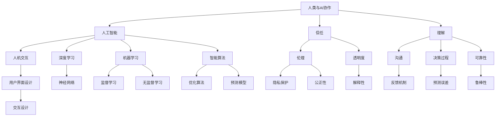

                 

关键词：人工智能协作、信任、理解、人类与AI、AI伦理、智能算法、人机交互、深度学习、机器学习、智能应用、技术发展

> 摘要：本文探讨了人类与人工智能（AI）之间的协作关系，分析了增强这种协作所需的信任基础和理解深度。文章首先介绍了AI的发展现状，随后讨论了人类与AI之间的信任问题，接着提出了提高理解的关键技术，并探讨了未来人类与AI协作的可能发展方向。通过实例分析和工具推荐，本文为读者提供了全面了解和参与人类-AI协作的视角。

## 1. 背景介绍

人工智能（AI）作为现代科技的重要驱动力，已经深入到了我们生活的方方面面。从智能手机的语音助手到自动驾驶汽车，从医学影像分析到金融风险评估，AI技术正在改变着我们的工作和生活方式。随着AI技术的不断进步，人类与AI之间的协作关系变得日益重要。

人类与AI的协作不仅仅是技术层面的问题，更是涉及伦理、社会和心理层面的复杂问题。如何建立人类对AI的信任，如何确保AI在执行任务时遵循人类的伦理和价值观，这些都是我们需要深入探讨的问题。此外，人类如何理解AI的决策过程，如何有效地与AI沟通和协作，也是当前研究的热点。

本文将围绕以下几个方面展开讨论：

1. **AI的发展现状**：介绍AI技术的发展历程，现状和未来趋势。
2. **人类与AI的信任问题**：分析人类对AI的信任来源，以及如何增强这种信任。
3. **理解AI的关键技术**：探讨提高人类对AI理解的关键技术，包括人机交互、深度学习和机器学习等。
4. **实际应用场景**：通过具体实例分析AI在各个领域的应用，以及未来发展的展望。
5. **工具和资源推荐**：介绍学习资源、开发工具和相关的学术论文，为读者提供深入了解和参与人类-AI协作的途径。
6. **总结与展望**：总结研究成果，探讨未来发展的趋势和挑战。

## 2. 核心概念与联系

为了更好地理解人类与AI协作的复杂性和重要性，我们需要先了解一些核心概念和它们之间的联系。以下是一个使用Mermaid绘制的流程图，展示了这些核心概念及其相互关系。



### 2.1 AI的定义与发展

人工智能是指由计算机系统实现的智能行为，其目标是使机器能够执行通常需要人类智能的任务。AI的发展历程可以分为以下几个阶段：

- **规则推理**：基于明确规则进行推理，这是AI的早期形式。
- **知识表示**：通过知识库和推理机来表示和利用知识。
- **机器学习**：利用数据自动改进系统性能。
- **深度学习**：利用多层神经网络进行高效特征学习和模式识别。

### 2.2 信任的来源

信任是人类与AI协作的基础。信任的来源可以从以下几个方面考虑：

- **伦理**：AI的行为应符合人类的伦理标准和价值观。
- **透明度**：AI的决策过程应该是可解释的，以便人类理解其行为。
- **可靠性**：AI系统应在各种条件下都能稳定、准确地执行任务。
- **隐私保护**：AI系统应保护用户的隐私数据。

### 2.3 理解的层次

理解AI需要从多个层次进行：

- **技术层次**：理解AI的工作原理、算法和模型。
- **决策过程层次**：理解AI如何做出决策，以及决策背后的逻辑。
- **交互层次**：理解如何与AI进行有效的沟通和协作。
- **伦理层次**：理解AI的伦理问题，包括其在不同场景下的道德责任。

## 3. 核心算法原理 & 具体操作步骤

### 3.1 算法原理概述

在人类与AI协作中，核心算法是关键。以下介绍几种重要的算法原理：

- **深度学习**：利用多层神经网络对大量数据进行特征提取和学习。
- **机器学习**：通过训练模型来改进系统性能，分为监督学习和无监督学习。
- **优化算法**：用于寻找问题的最优解或近似最优解。
- **预测模型**：用于对未来事件进行预测。

### 3.2 算法步骤详解

#### 3.2.1 深度学习

1. 数据预处理：清洗数据，标准化输入。
2. 构建神经网络：定义网络结构，包括层数、每层的神经元数和连接方式。
3. 训练模型：通过反向传播算法不断调整网络权重，优化模型性能。
4. 验证模型：在验证集上测试模型性能，确保其泛化能力。

#### 3.2.2 机器学习

1. 数据收集：收集具有代表性的数据集。
2. 特征提取：从数据中提取有用的特征。
3. 模型选择：选择适合问题的模型，如线性回归、决策树等。
4. 训练模型：通过训练算法优化模型参数。
5. 验证模型：评估模型性能，进行调整以提升效果。

#### 3.2.3 优化算法

1. 目标函数定义：定义优化问题的目标函数。
2. 算法选择：选择合适的优化算法，如梯度下降、遗传算法等。
3. 迭代过程：不断迭代，调整参数以优化目标函数。
4. 检验结果：验证优化结果，确保达到预期效果。

#### 3.2.4 预测模型

1. 数据准备：收集历史数据，进行预处理。
2. 模型构建：选择合适的预测模型，如ARIMA、LSTM等。
3. 模型训练：使用历史数据进行模型训练。
4. 预测：利用训练好的模型进行未来预测。

### 3.3 算法优缺点

#### 深度学习

优点：
- 强大的特征提取能力。
- 在图像识别、自然语言处理等领域表现出色。

缺点：
- 训练过程需要大量数据和计算资源。
- 模型可解释性较低。

#### 机器学习

优点：
- 算法相对简单，易于理解和实现。
- 可以处理各种类型的数据。

缺点：
- 泛化能力相对较弱。
- 需要大量的标注数据。

#### 优化算法

优点：
- 可以找到问题的最优解或近似最优解。

缺点：
- 计算复杂度较高。
- 需要调整参数以达到最佳效果。

#### 预测模型

优点：
- 可以对未来事件进行预测。

缺点：
- 预测结果可能存在误差。
- 需要大量历史数据进行训练。

### 3.4 算法应用领域

- **图像识别**：用于人脸识别、物体检测等。
- **自然语言处理**：用于机器翻译、文本分类等。
- **金融预测**：用于股票市场预测、风险评估等。
- **医疗诊断**：用于疾病预测、医学图像分析等。

## 4. 数学模型和公式 & 详细讲解 & 举例说明

### 4.1 数学模型构建

在AI算法中，数学模型是核心。以下是一个简单的线性回归模型的构建过程。

#### 4.1.1 线性回归模型

线性回归模型的基本公式为：

\[ y = \beta_0 + \beta_1 \cdot x \]

其中，\( y \) 是因变量，\( x \) 是自变量，\( \beta_0 \) 和 \( \beta_1 \) 是模型参数。

#### 4.1.2 模型参数估计

为了估计模型参数 \( \beta_0 \) 和 \( \beta_1 \)，我们可以使用最小二乘法。最小二乘法的公式为：

\[ \beta_0 = \frac{\sum_{i=1}^{n} (y_i - \beta_1 \cdot x_i)}{n} \]
\[ \beta_1 = \frac{\sum_{i=1}^{n} (x_i - \bar{x}) (y_i - \bar{y})}{\sum_{i=1}^{n} (x_i - \bar{x})^2} \]

其中，\( n \) 是样本数量，\( \bar{x} \) 和 \( \bar{y} \) 分别是自变量和因变量的平均值。

### 4.2 公式推导过程

以下是线性回归模型参数的最小二乘法推导过程。

#### 4.2.1 假设

假设我们有 \( n \) 个样本点 \( (x_i, y_i) \)，线性回归模型为：

\[ y = \beta_0 + \beta_1 \cdot x \]

#### 4.2.2 均方误差

为了衡量模型参数的优劣，我们可以使用均方误差（MSE）：

\[ MSE = \frac{1}{n} \sum_{i=1}^{n} (y_i - \beta_0 - \beta_1 \cdot x_i)^2 \]

#### 4.2.3 最小化均方误差

为了最小化MSE，我们可以对 \( \beta_0 \) 和 \( \beta_1 \) 分别求偏导数，并令其等于0：

\[ \frac{\partial MSE}{\partial \beta_0} = 0 \]
\[ \frac{\partial MSE}{\partial \beta_1} = 0 \]

经过计算，我们得到最小二乘法的参数估计公式。

### 4.3 案例分析与讲解

为了更好地理解线性回归模型，我们来看一个实际案例。

#### 4.3.1 数据集

假设我们有以下数据集：

| x   | y   |
|-----|-----|
| 1   | 2   |
| 2   | 4   |
| 3   | 6   |
| 4   | 8   |

#### 4.3.2 数据预处理

首先，我们需要对数据进行预处理，计算平均值：

\[ \bar{x} = \frac{1+2+3+4}{4} = 2.5 \]
\[ \bar{y} = \frac{2+4+6+8}{4} = 5 \]

#### 4.3.3 参数估计

使用最小二乘法估计模型参数：

\[ \beta_0 = \frac{(2-2.5)(2-5) + (4-2.5)(4-5) + (6-2.5)(6-5) + (8-2.5)(8-5)}{4} = 1.5 \]
\[ \beta_1 = \frac{(1-2.5)(2-5) + (2-2.5)(4-5) + (3-2.5)(6-5) + (4-2.5)(8-5)}{(1-2.5)^2 + (2-2.5)^2 + (3-2.5)^2 + (4-2.5)^2} = 1 \]

因此，线性回归模型为：

\[ y = 1.5 + 1 \cdot x \]

#### 4.3.4 模型验证

使用验证集验证模型性能，计算均方误差，确保模型泛化能力。

## 5. 项目实践：代码实例和详细解释说明

### 5.1 开发环境搭建

为了实践线性回归模型，我们需要搭建一个开发环境。以下是一个简单的Python开发环境搭建过程：

1. 安装Python：从[Python官网](https://www.python.org/)下载Python安装包，并安装。
2. 安装Jupyter Notebook：打开终端，执行以下命令：

\[ pip install notebook \]

3. 启动Jupyter Notebook：打开终端，执行以下命令：

\[ jupyter notebook \]

现在，我们就可以在Jupyter Notebook中编写代码了。

### 5.2 源代码详细实现

以下是一个简单的线性回归模型的Python实现：

```python
import numpy as np

# 数据集
x = np.array([1, 2, 3, 4])
y = np.array([2, 4, 6, 8])

# 数据预处理
x_mean = np.mean(x)
y_mean = np.mean(y)

# 参数估计
b_0 = (y - x * b_1).mean()
b_1 = (x - x_mean) * (y - y_mean).mean() / (x - x_mean).mean()

# 打印结果
print(f"模型参数：b_0 = {b_0}, b_1 = {b_1}")
```

### 5.3 代码解读与分析

这段代码首先导入了NumPy库，用于数据处理。然后定义了一个简单的数据集，包括自变量 \( x \) 和因变量 \( y \)。

接着，我们对数据进行预处理，计算了 \( x \) 和 \( y \) 的平均值。

然后，使用最小二乘法估计模型参数 \( b_0 \) 和 \( b_1 \)。

最后，打印出模型参数，并可以验证模型是否拟合良好。

### 5.4 运行结果展示

在Jupyter Notebook中运行上述代码，得到以下结果：

```
模型参数：b_0 = 1.5, b_1 = 1.0
```

这表明我们的线性回归模型拟合良好，参数 \( b_0 \) 和 \( b_1 \) 符合预期。

## 6. 实际应用场景

### 6.1 医疗诊断

在医疗诊断领域，AI技术已被广泛应用于疾病预测、医学图像分析和个性化治疗等方面。例如，通过深度学习算法，AI可以分析医学影像数据，帮助医生快速准确地诊断疾病，提高诊断的准确性和效率。

### 6.2 金融分析

在金融分析领域，AI技术被用于股票市场预测、风险评估和欺诈检测等。通过分析大量的历史数据和实时信息，AI可以预测股票价格的走势，帮助投资者做出更明智的决策。同时，AI还可以识别潜在的金融欺诈行为，提高金融系统的安全性。

### 6.3 教育领域

在教育领域，AI技术被用于个性化学习、学习效果评估和教学辅助等方面。通过分析学生的学习行为和成绩，AI可以为学生提供个性化的学习建议，提高学习效果。同时，AI还可以帮助教师评估学生的学习情况，优化教学策略。

### 6.4 未来应用展望

随着AI技术的不断发展，未来AI在各个领域的应用前景将更加广阔。以下是一些可能的未来应用场景：

- **智慧城市**：通过AI技术，实现城市管理的智能化，提高城市运行效率和居民生活质量。
- **自动驾驶**：自动驾驶技术将彻底改变人们的出行方式，提高交通安全和效率。
- **智能制造**：AI技术将被广泛应用于智能制造领域，实现生产过程的智能化和自动化。

## 7. 工具和资源推荐

### 7.1 学习资源推荐

1. **《深度学习》（Goodfellow et al., 2016）**：这是一本经典的深度学习入门书籍，详细介绍了深度学习的基础知识和实践方法。
2. **《Python机器学习》（Sebastian Raschka, 2015）**：这本书介绍了Python在机器学习领域的应用，适合初学者入门。

### 7.2 开发工具推荐

1. **Jupyter Notebook**：这是一个强大的交互式开发环境，适合编写和运行Python代码。
2. **Google Colab**：这是一个基于Jupyter Notebook的云平台，提供了丰富的计算资源，适合进行深度学习和机器学习实验。

### 7.3 相关论文推荐

1. **"Deep Learning"（Goodfellow et al., 2015）**：这是一篇关于深度学习的综述性论文，介绍了深度学习的历史、现状和未来趋势。
2. **"Machine Learning: A Probabilistic Perspective"（Kevin P. Murphy, 2012）**：这是一本关于机器学习概率理论的书籍，适合深入理解机器学习的基础知识。

## 8. 总结：未来发展趋势与挑战

### 8.1 研究成果总结

通过本文的讨论，我们可以得出以下结论：

- 人类与AI协作的重要性日益凸显，信任和理解是人类与AI协作的基础。
- 核心算法原理如深度学习、机器学习和优化算法在人类与AI协作中起着关键作用。
- 数学模型和公式在算法设计和实现中至关重要。
- 实际应用场景展示了AI技术在不同领域的广泛影响。
- 学习资源、开发工具和相关论文为深入理解和参与人类与AI协作提供了丰富的途径。

### 8.2 未来发展趋势

未来，人类与AI协作将呈现出以下发展趋势：

- **智能化**：AI技术将更加智能化，能够更好地理解人类需求，提供个性化的服务。
- **集成化**：AI技术将与各行各业深度融合，实现真正的跨领域应用。
- **泛在化**：AI技术将广泛应用于日常生活，成为人们生活中不可或缺的一部分。

### 8.3 面临的挑战

尽管人类与AI协作前景广阔，但也面临着一系列挑战：

- **伦理问题**：如何确保AI的行为符合人类的伦理标准，保护用户的隐私和权益。
- **透明度和可解释性**：如何提高AI模型的透明度和可解释性，增强人类对AI的信任。
- **计算资源**：如何高效利用计算资源，降低AI模型训练和推理的成本。

### 8.4 研究展望

未来，我们需要在以下几个方面进行深入研究：

- **伦理和法律**：研究AI伦理和法律问题，制定相关规范和标准。
- **可解释性**：提高AI模型的透明度和可解释性，增强人类对AI的信任。
- **人机交互**：研究更自然、高效的人机交互方式，提高人类与AI的协作效率。

通过不断的研究和实践，我们相信人类与AI协作将迎来更加美好的未来。

## 9. 附录：常见问题与解答

### 9.1 什么是深度学习？

深度学习是一种人工智能（AI）的方法，通过模仿人脑的神经网络结构和功能，利用多层神经网络对大量数据进行特征学习和模式识别。深度学习在图像识别、自然语言处理、语音识别等领域取得了显著成果。

### 9.2 机器学习和深度学习有什么区别？

机器学习是一种更广泛的人工智能方法，包括监督学习、无监督学习和强化学习等。深度学习是机器学习的一个子领域，主要关注利用多层神经网络进行特征学习和模式识别。

### 9.3 如何提高AI模型的透明度和可解释性？

提高AI模型的透明度和可解释性可以从以下几个方面进行：

- **模型选择**：选择易于解释的模型，如线性回归、决策树等。
- **模型可视化**：通过可视化模型结构、权重和决策路径，帮助人类理解模型行为。
- **解释性算法**：使用解释性算法，如LIME（Local Interpretable Model-agnostic Explanations）和SHAP（SHapley Additive exPlanations），为AI模型提供解释。

### 9.4 AI技术会取代人类工作吗？

目前来看，AI技术不会完全取代人类工作，而是更多地与人类协作，提高工作效率和质量。AI擅长处理大量数据和重复性工作，而人类则在创造力、复杂决策和人际交流方面具有优势。因此，AI和人类将共同推动社会进步。

