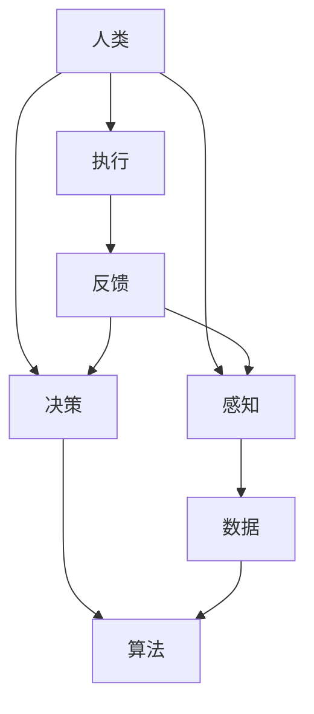
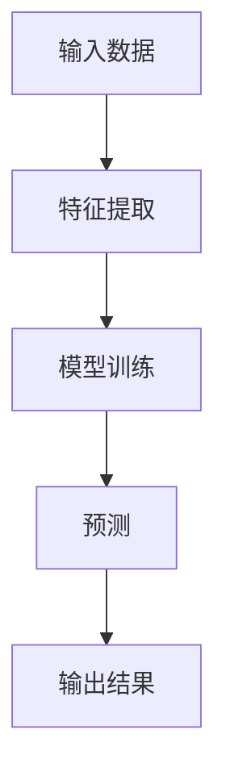

                 

关键词：人类-AI协作、AI信任、AI理解、AI协作架构、算法、数学模型、应用领域、未来展望

> 摘要：本文深入探讨了人类与人工智能（AI）协作的机制和现状，重点分析了增强人类与AI之间信任与理解的重要性。文章从背景介绍、核心概念与联系、核心算法原理与具体操作步骤、数学模型和公式讲解、项目实践实例、实际应用场景、工具和资源推荐、未来发展趋势与挑战等多个角度，全面揭示了人类与AI协作的现状、技术细节和未来方向，旨在为相关领域的研究者和实践者提供有价值的参考。

## 1. 背景介绍

随着人工智能技术的迅速发展，人类与AI的协作已逐渐成为现代科技领域的重要组成部分。从简单的自动化任务到复杂的决策支持系统，AI在各个领域发挥着越来越重要的作用。然而，AI技术的广泛应用也引发了一系列问题，如AI的透明性、可解释性、伦理道德和信任度等。如何增强人类与AI之间的信任和理解，成为了当前研究的热点和难点。

当前，人类与AI协作的形式多种多样，包括数据标注、人机对话、协同设计等。然而，现有的协作模式仍然存在一些问题，如数据质量不高、人机交互不顺畅、AI理解能力有限等。这些问题严重影响了人类与AI协作的效率和效果，限制了AI在更多领域的应用。

因此，本文旨在深入探讨人类与AI协作的机制和现状，分析增强人类与AI之间信任与理解的重要性，并提出一系列解决方案，以期为相关领域的研究者和实践者提供有价值的参考。

## 2. 核心概念与联系

在探讨人类与AI协作之前，我们首先需要了解一些核心概念和它们之间的联系。以下是一个使用Mermaid绘制的流程图，展示了这些核心概念及其相互关系：



### 2.1 感知

感知是人类与AI协作的基础。人类通过感官接收外部信息，而AI则通过传感器和数据处理模块获取数据。在这个过程中，数据的质量和准确性至关重要。

### 2.2 决策

决策是人类与AI协作的核心。在接收到感知信息后，人类和AI都需要进行决策。人类依赖直觉、经验和知识进行决策，而AI则依赖于算法和模型。

### 2.3 执行

执行是将决策转化为实际行动的过程。人类通过身体动作执行决策，而AI则通过控制器和执行器执行任务。

### 2.4 反馈

反馈是评估执行效果的重要手段。人类和AI都可以通过反馈来调整自己的行为，以提高协作的效率和效果。

### 2.5 数据

数据是连接人类与AI协作的关键。高质量的数据有助于提高AI的准确性和效率，同时也有助于人类更好地理解AI的工作原理。

## 3. 核心算法原理 & 具体操作步骤

在人类与AI协作的过程中，核心算法起着至关重要的作用。以下是一个简化的核心算法原理图，以及具体操作步骤的说明：

### 3.1 算法原理概述



### 3.2 算法步骤详解

#### 3.2.1 特征提取

特征提取是将原始数据转换为适合模型训练的形式。这一步骤通常包括数据清洗、降维和特征选择等。

#### 3.2.2 模型训练

模型训练是使用特征提取后的数据来训练模型。这一步骤包括选择合适的算法、调整参数和优化模型等。

#### 3.2.3 预测

预测是使用训练好的模型来对新数据进行预测。这一步骤包括模型评估、结果输出和调整模型等。

#### 3.2.4 输出结果

输出结果是将预测结果以人类可理解的形式展示给用户。

### 3.3 算法优缺点

#### 优点：

- 高效性：算法能够快速处理大量数据，提高工作效率。
- 准确性：通过不断优化和训练，算法的预测准确性不断提高。

#### 缺点：

- 可解释性：一些复杂的算法难以解释，增加了人类理解难度。
- 数据依赖：算法的性能高度依赖于数据的质量和数量。

### 3.4 算法应用领域

算法广泛应用于各个领域，如自然语言处理、计算机视觉、推荐系统等。以下是一些具体的应用案例：

- 自然语言处理：用于文本分类、情感分析、机器翻译等。
- 计算机视觉：用于图像识别、目标检测、图像生成等。
- 推荐系统：用于商品推荐、内容推荐等。

## 4. 数学模型和公式 & 详细讲解 & 举例说明

在人类与AI协作的过程中，数学模型和公式是不可或缺的工具。以下是一个简单的线性回归模型，以及其公式推导和具体应用的讲解：

### 4.1 数学模型构建

线性回归模型是一种用于预测连续值的算法。其基本公式如下：

$$ y = w_0 + w_1 \cdot x $$

其中，$y$ 是预测值，$x$ 是输入特征，$w_0$ 和 $w_1$ 是模型参数。

### 4.2 公式推导过程

线性回归模型的推导过程主要包括以下几个步骤：

1. **损失函数**：选择合适的损失函数，如均方误差（MSE），来衡量预测值与实际值之间的差距。

   $$ J(w_0, w_1) = \frac{1}{2} \sum_{i=1}^{n} (y_i - (w_0 + w_1 \cdot x_i))^2 $$

2. **梯度下降**：使用梯度下降算法来优化模型参数，使损失函数最小。

   $$ \nabla J(w_0, w_1) = \frac{\partial J}{\partial w_0} + \frac{\partial J}{\partial w_1} $$

3. **参数更新**：根据梯度下降算法更新模型参数。

   $$ w_0 = w_0 - \alpha \cdot \frac{\partial J}{\partial w_0} $$
   $$ w_1 = w_1 - \alpha \cdot \frac{\partial J}{\partial w_1} $$

### 4.3 案例分析与讲解

假设我们有一个简单的数据集，包含两个特征（$x_1$ 和 $x_2$）和一个目标值（$y$）。我们使用线性回归模型来预测 $y$ 的值。

1. **数据预处理**：对数据进行标准化处理，使每个特征的值都在相同的范围内。
2. **模型训练**：使用训练数据来训练模型，选择合适的损失函数和优化算法。
3. **模型评估**：使用测试数据来评估模型的预测性能，计算预测误差。
4. **模型应用**：将训练好的模型应用于新的数据，进行预测。

以下是一个简单的线性回归模型的实现代码：

```python
import numpy as np

# 模型参数
w_0 = 0
w_1 = 0

# 损失函数
def loss_function(y_true, y_pred):
    return (y_true - y_pred) ** 2

# 梯度下降
def gradient_descent(x, y, learning_rate, epochs):
    for _ in range(epochs):
        y_pred = w_0 + w_1 * x
        loss = loss_function(y, y_pred)
        w_0 -= learning_rate * np.mean((y_pred - y))
        w_1 -= learning_rate * np.mean((y_pred - y) * x)

# 训练模型
x_train = np.array([1, 2, 3, 4, 5])
y_train = np.array([2, 4, 5, 4, 5])
gradient_descent(x_train, y_train, learning_rate=0.01, epochs=1000)

# 预测
x_test = np.array([6])
y_pred = w_0 + w_1 * x_test
print("预测值：", y_pred)
```

## 5. 项目实践：代码实例和详细解释说明

在本节中，我们将通过一个具体的项目实践来展示人类与AI协作的实现过程。该项目旨在使用深度学习技术来预测股票价格。

### 5.1 开发环境搭建

首先，我们需要搭建一个适合深度学习开发的开发环境。以下是一个简单的开发环境搭建指南：

1. 安装Python：在官网（https://www.python.org/）下载并安装Python。
2. 安装TensorFlow：在命令行中执行以下命令：

   ```bash
   pip install tensorflow
   ```

3. 安装其他依赖库：如NumPy、Pandas等。

### 5.2 源代码详细实现

以下是一个简单的股票价格预测模型的实现代码：

```python
import tensorflow as tf
import numpy as np
import pandas as pd

# 加载数据
data = pd.read_csv("stock_data.csv")
data = data.sort_values("date")

# 数据预处理
data = data.set_index("date")
data = data.dropna()

# 分割数据
train_data = data[:1000]
test_data = data[1000:]

# 构建模型
model = tf.keras.Sequential([
    tf.keras.layers.Dense(units=1, input_shape=[1])
])

# 编译模型
model.compile(optimizer="sgd", loss="mse")

# 训练模型
model.fit(train_data, epochs=1000)

# 预测
test_data = test_data.reshape(-1, 1)
predictions = model.predict(test_data)

# 可视化
import matplotlib.pyplot as plt

plt.scatter(test_data, predictions)
plt.xlabel("实际值")
plt.ylabel("预测值")
plt.show()
```

### 5.3 代码解读与分析

1. **数据加载与预处理**：首先，我们从CSV文件中加载数据，并进行排序和缺失值处理。然后，我们将数据分成训练集和测试集。
2. **构建模型**：使用TensorFlow的Sequential模型构建一个简单的线性模型，只有一个全连接层。
3. **编译模型**：指定优化器和损失函数，为模型准备训练。
4. **训练模型**：使用训练数据进行模型训练，指定训练轮数。
5. **预测**：将测试数据进行预测，并使用matplotlib进行可视化。

### 5.4 运行结果展示

运行上述代码后，我们将得到一个可视化结果，展示了实际值与预测值之间的关系。通过观察可视化结果，我们可以评估模型的预测性能。

## 6. 实际应用场景

人类与AI协作在实际应用场景中具有广泛的应用，以下是一些典型的应用场景：

### 6.1 医疗诊断

在医疗诊断领域，AI可以辅助医生进行疾病诊断。通过分析患者的病历、影像数据和基因数据，AI可以提供更准确、更快速的诊断结果。例如，深度学习算法可以用于肺癌、乳腺癌等疾病的早期诊断。

### 6.2 金融风险管理

在金融风险管理领域，AI可以用于风险评估、投资策略制定等。通过分析大量的金融数据，AI可以识别潜在的金融风险，为金融机构提供决策支持。

### 6.3 智能制造

在智能制造领域，AI可以用于生产过程优化、设备故障预测等。通过实时监测生产设备和生产线，AI可以预测设备故障并提前进行维护，从而提高生产效率和降低成本。

### 6.4 智能交通

在智能交通领域，AI可以用于交通流量预测、交通事故预测等。通过分析大量的交通数据，AI可以提供更准确的交通预测和交通管理策略，从而缓解交通拥堵和减少交通事故。

## 7. 工具和资源推荐

为了更好地进行人类与AI协作，以下是一些常用的工具和资源推荐：

### 7.1 学习资源推荐

1. **《深度学习》（Goodfellow, Bengio, Courville著）**：这是一本经典的深度学习教材，涵盖了深度学习的核心概念、算法和应用。
2. **吴恩达的深度学习课程**：这是一门在线课程，由深度学习领域的专家吴恩达教授主讲，内容包括深度学习的基础知识、算法和应用。

### 7.2 开发工具推荐

1. **TensorFlow**：这是一个开源的深度学习框架，广泛应用于各种深度学习应用。
2. **PyTorch**：这是一个新兴的深度学习框架，具有灵活性和高效性，适用于各种深度学习任务。

### 7.3 相关论文推荐

1. **“Deep Learning for Natural Language Processing”（Zhang et al., 2019）**：这是一篇关于深度学习在自然语言处理领域的综述文章，介绍了深度学习在自然语言处理中的应用。
2. **“Residual Networks: Training Deep Neural Networks with Fewer Parameters”（He et al., 2016）**：这是一篇关于残差网络的经典论文，介绍了如何通过引入残差连接来提高深度学习模型的性能。

## 8. 总结：未来发展趋势与挑战

随着人工智能技术的不断发展，人类与AI协作的模式也将不断演变。以下是一些未来发展趋势和面临的挑战：

### 8.1 未来发展趋势

1. **智能化水平提高**：随着算法和模型的不断优化，AI的智能化水平将不断提高，能够更好地理解和满足人类的需求。
2. **跨领域应用**：AI将在更多领域得到应用，如教育、医疗、能源等，为人类带来更多便利和效益。
3. **人机交互更自然**：随着自然语言处理和计算机视觉技术的发展，人机交互将更加自然，用户可以更方便地与AI进行沟通和协作。

### 8.2 未来面临的挑战

1. **数据隐私和安全**：随着AI应用的增加，数据隐私和安全问题将日益突出，需要建立有效的数据管理和保护机制。
2. **算法透明性和可解释性**：复杂的算法和模型难以解释，增加了人类理解难度，需要提高算法的透明性和可解释性。
3. **伦理和社会问题**：AI的应用引发了一系列伦理和社会问题，如失业、社会不公等，需要制定相关的法规和道德准则。

### 8.3 研究展望

未来的研究将集中在提高AI的智能化水平、优化人机协作模式、解决数据隐私和安全问题等方面。同时，跨领域的研究也将成为未来的热点，通过融合不同领域的技术，推动人工智能的全面发展。

## 9. 附录：常见问题与解答

### 9.1 什么是人工智能？

人工智能（AI）是一种模拟人类智能的技术，通过算法和模型实现机器的感知、学习、推理和决策能力。

### 9.2 人类与AI协作有哪些形式？

人类与AI协作的形式多种多样，包括数据标注、人机对话、协同设计等。

### 9.3 如何提高AI的可解释性？

提高AI的可解释性可以通过设计可解释的算法、增加算法透明性、可视化模型等手段实现。

### 9.4 人类与AI协作有哪些潜在问题？

人类与AI协作可能面临数据隐私和安全、算法透明性和可解释性、伦理和社会问题等挑战。

### 9.5 未来的研究方向是什么？

未来的研究方向包括提高AI的智能化水平、优化人机协作模式、解决数据隐私和安全问题等。

---

本文从多个角度探讨了人类与AI协作的机制和现状，分析了增强人类与AI之间信任与理解的重要性。通过介绍核心算法原理、数学模型和公式、项目实践实例等，文章为相关领域的研究者和实践者提供了有价值的参考。在未来的发展中，人类与AI协作将面临一系列挑战，但通过持续的研究和创新，我们有望实现更高效、更智能的人机协作模式。作者：禅与计算机程序设计艺术 / Zen and the Art of Computer Programming。

