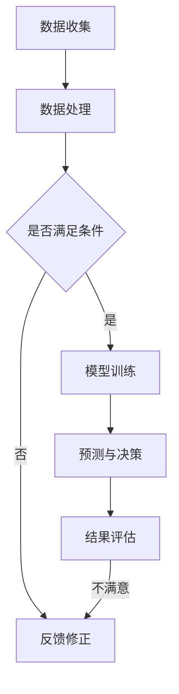

                 

### 文章关键词

AI协作、人类信任、理解增强、AI伦理、技术透明度、人工智能应用

### 文章摘要

在人工智能（AI）迅速发展的时代，人类与AI之间的协作日益紧密。本文旨在探讨如何通过提高透明度、优化设计和技术革新来增强人类对AI的信任和理解，从而实现更加有效的协作。本文将深入分析当前AI技术发展现状，阐述AI伦理的重要性，并探讨实际应用场景中如何提升人类对AI的信任度。此外，本文还将介绍未来AI技术的发展趋势，并提出面临的挑战和解决方案，以期为人类与AI的和谐共处提供指导。

## 1. 背景介绍

自20世纪50年代人工智能（Artificial Intelligence，简称AI）的概念提出以来，这一领域经历了迅猛的发展。从最初的规则推理和专家系统，到深度学习、自然语言处理和计算机视觉等前沿技术的突破，AI在各个行业中的应用范围不断扩展。如今，AI技术已经深入到医疗、金融、交通、教育等多个领域，极大地提高了工作效率，改善了人类生活质量。

然而，随着AI技术的不断进步，人类对其的理解和信任也面临着挑战。一方面，AI系统的复杂性和透明度不足使得人们难以完全理解其决策过程；另一方面，AI系统的算法偏见和隐私问题引发了公众的担忧。这些问题不仅影响了AI技术的普及和应用，也阻碍了人类与AI之间的协作。

本文将重点探讨如何在人类与AI的协作过程中增强双方的信任和理解。通过分析AI技术的发展现状和潜在问题，本文提出了一系列解决方案，包括提高AI系统的透明度、优化AI设计、加强伦理指导等，旨在为人类与AI的和谐共处提供指导。

## 2. 核心概念与联系

在探讨人类与AI协作的过程中，我们需要理解几个关键概念，这些概念构成了AI系统的基础，并直接影响人类对AI的信任和理解。

### 2.1 人工智能（AI）

人工智能是指计算机系统模拟人类智能行为的能力，包括学习、推理、规划、感知、自然语言理解和图像识别等。AI可以分为两类：弱AI（Narrow AI）和强AI（General AI）。弱AI专注于特定任务，如语音识别、图像分类等，而强AI则具备全面的人类智能，能够在各种环境中进行自主学习和决策。

### 2.2 深度学习（Deep Learning）

深度学习是AI领域的一种重要技术，它通过多层神经网络模拟人脑的学习过程，实现从大量数据中自动提取特征和模式。深度学习的成功在于其能够通过大量的训练数据自动优化网络结构，从而实现高度准确的预测和分类。

### 2.3 算法透明度（Algorithm Transparency）

算法透明度是指AI系统决策过程的可解释性和可理解性。透明度对于增强人类对AI的信任至关重要，因为只有当人类能够理解AI的决策过程时，才能对其产生信任。

### 2.4 AI伦理（AI Ethics）

AI伦理涉及AI系统在道德、法律和社会层面的责任和限制。它确保AI系统在开发和应用过程中遵循公平、透明和可信赖的原则，从而避免潜在的负面影响。

### 2.5 Mermaid 流程图

为了更直观地展示AI系统的核心概念和相互关系，我们可以使用Mermaid流程图来描述AI系统的架构。以下是一个简化的Mermaid流程图示例：



在这个流程图中，数据收集和处理阶段为AI系统提供输入，通过条件判断决定是否进行模型训练。训练完成后，AI系统进行预测和决策，并通过结果评估来优化模型。如果结果不满足预期，系统将进行反馈修正，以不断改进性能。

通过上述核心概念和Mermaid流程图的介绍，我们可以更好地理解AI系统的运作机制，并为后续的讨论提供基础。

## 3. 核心算法原理 & 具体操作步骤

在深入探讨人类与AI协作的过程中，我们需要了解AI系统的核心算法原理和具体操作步骤。以下将详细阐述这些内容，帮助读者更好地理解AI系统的运作机制。

### 3.1 算法原理概述

AI系统的核心算法可以分为两类：监督学习（Supervised Learning）和无监督学习（Unsupervised Learning）。其中，监督学习是通过已知输入和输出数据训练模型，从而预测未知数据的输出。而无监督学习则是通过未标记的数据自动发现隐藏的模式和结构。

深度学习是当前AI系统中应用最广泛的一种算法。它通过多层神经网络模拟人脑的学习过程，从数据中自动提取特征和模式。以下是深度学习的基本原理和步骤：

1. **数据预处理**：对输入数据进行标准化、归一化等处理，以提高模型的训练效果。
2. **构建神经网络**：设计神经网络的结构，包括输入层、隐藏层和输出层。每个层包含多个神经元，神经元之间通过权重连接。
3. **前向传播**：输入数据通过神经网络的前向传播，经过每层的非线性变换，最终得到输出结果。
4. **反向传播**：计算输出结果与实际标签之间的误差，通过反向传播更新网络中的权重和偏置。
5. **优化目标**：通过优化算法（如梯度下降、Adam优化器等）最小化误差函数，从而提高模型的预测能力。

### 3.2 算法步骤详解

以下是深度学习算法的具体步骤，包括数据预处理、模型构建、训练和评估等：

#### 步骤1：数据预处理

1. **数据清洗**：去除异常值、缺失值和重复数据。
2. **特征工程**：提取有助于模型训练的特征，如文本中的词频、图像中的颜色分布等。
3. **数据归一化**：将不同尺度的特征数据统一到同一尺度，以防止某些特征对模型的影响过大。

#### 步骤2：构建神经网络

1. **选择模型架构**：根据任务需求选择合适的神经网络架构，如卷积神经网络（CNN）、循环神经网络（RNN）等。
2. **设计网络结构**：定义输入层、隐藏层和输出层的神经元数量及连接方式。
3. **初始化权重**：随机初始化权重和偏置，以确保网络的随机性。

#### 步骤3：训练模型

1. **划分数据集**：将数据集划分为训练集、验证集和测试集，以评估模型的性能。
2. **前向传播**：输入训练数据进行前向传播，得到输出结果。
3. **计算损失**：计算输出结果与实际标签之间的误差，使用损失函数（如均方误差、交叉熵等）衡量误差。
4. **反向传播**：通过反向传播更新网络中的权重和偏置，以最小化损失。
5. **优化目标**：调整学习率、批量大小等超参数，以提高模型的训练效果。

#### 步骤4：评估模型

1. **验证集评估**：在验证集上评估模型的性能，调整模型参数以优化效果。
2. **测试集评估**：在测试集上评估模型的泛化能力，以确定模型的实际性能。

### 3.3 算法优缺点

**优点**：

1. **强大的特征提取能力**：深度学习能够自动从数据中提取高层次的抽象特征，从而实现高效的模型训练。
2. **自适应性强**：通过反向传播和梯度下降算法，模型能够自动调整参数，以优化性能。
3. **广泛的应用场景**：深度学习在图像识别、语音识别、自然语言处理等领域取得了显著成果。

**缺点**：

1. **需要大量训练数据**：深度学习模型需要大量的训练数据才能取得良好的效果，对于数据稀缺的领域具有挑战性。
2. **计算资源消耗大**：深度学习模型的训练过程需要大量的计算资源和时间。
3. **模型可解释性低**：深度学习模型的黑箱特性使得其决策过程难以理解，降低了模型的透明度和可解释性。

### 3.4 算法应用领域

深度学习在多个领域取得了显著的成果，以下是几个典型的应用场景：

1. **图像识别**：通过卷积神经网络（CNN）实现图像分类、目标检测和图像生成等任务。
2. **语音识别**：利用循环神经网络（RNN）和长短期记忆网络（LSTM）实现语音信号的识别和转换。
3. **自然语言处理**：通过序列到序列（Seq2Seq）模型实现机器翻译、文本生成和情感分析等任务。
4. **推荐系统**：利用深度学习模型实现个性化推荐，提高用户体验。
5. **医疗诊断**：通过深度学习模型实现疾病预测、医学图像分析和基因序列分析等任务。

通过以上对核心算法原理和具体操作步骤的介绍，我们可以更好地理解深度学习在人类与AI协作中的作用，并为进一步的应用提供基础。

## 4. 数学模型和公式 & 详细讲解 & 举例说明

在人工智能（AI）领域，数学模型和公式是理解和设计AI系统的基础。本文将详细讲解AI系统中常用的数学模型和公式，并通过具体案例进行说明。

### 4.1 数学模型构建

在构建AI数学模型时，我们需要考虑以下几个关键方面：

1. **输入与输出关系**：定义输入变量和输出变量之间的关系，通常使用函数表示。
2. **损失函数**：用于衡量模型预测值与真实值之间的差异，是优化模型参数的重要工具。
3. **优化算法**：用于调整模型参数，以最小化损失函数，常用的优化算法包括梯度下降、Adam优化器等。
4. **激活函数**：用于引入非线性特性，常见的激活函数包括Sigmoid、ReLU、Tanh等。

#### 4.1.1 线性回归模型

线性回归模型是最简单的机器学习模型之一，其数学模型可以表示为：

$$
y = \beta_0 + \beta_1 \cdot x
$$

其中，$y$是输出变量，$x$是输入变量，$\beta_0$和$\beta_1$是模型参数。为了最小化预测误差，可以使用最小二乘法求解模型参数：

$$
\beta_0 = \frac{\sum_{i=1}^{n} (y_i - \beta_1 \cdot x_i)}{n}
$$

$$
\beta_1 = \frac{\sum_{i=1}^{n} (x_i - \bar{x})(y_i - \bar{y})}{\sum_{i=1}^{n} (x_i - \bar{x})^2}
$$

其中，$\bar{x}$和$\bar{y}$分别是输入和输出的均值。

#### 4.1.2 多元线性回归模型

多元线性回归模型考虑多个输入变量，其数学模型可以表示为：

$$
y = \beta_0 + \beta_1 \cdot x_1 + \beta_2 \cdot x_2 + ... + \beta_n \cdot x_n
$$

与线性回归模型类似，我们可以使用最小二乘法求解模型参数：

$$
\beta_j = \frac{\sum_{i=1}^{n} (y_i - \sum_{k=1}^{n} \beta_k \cdot x_{ik})(x_{ij} - \bar{x_j})}{\sum_{i=1}^{n} (x_{ik} - \bar{x_k})^2}
$$

其中，$x_{ik}$是第$i$个样本的第$k$个输入特征。

#### 4.1.3 神经网络模型

神经网络模型是深度学习的基础，其数学模型可以表示为：

$$
a_{j}^{l} = \sigma \left( \sum_{i} w_{ij}^{l} a_{i}^{l-1} + b_j^{l} \right) \quad \forall j = 1, ..., m_l
$$

其中，$a_{j}^{l}$是第$l$层的第$j$个神经元的激活值，$\sigma$是激活函数，$w_{ij}^{l}$是连接权重，$b_j^{l}$是偏置项，$m_l$是第$l$层的神经元数量。

### 4.2 公式推导过程

以下是线性回归模型参数求解的推导过程：

首先，我们定义线性回归模型的目标函数为：

$$
J(\beta_0, \beta_1) = \frac{1}{2} \sum_{i=1}^{n} (y_i - (\beta_0 + \beta_1 \cdot x_i))^2
$$

对$\beta_0$和$\beta_1$分别求偏导数，并令偏导数等于零，得到：

$$
\frac{\partial J}{\partial \beta_0} = - \sum_{i=1}^{n} (y_i - (\beta_0 + \beta_1 \cdot x_i)) = 0
$$

$$
\frac{\partial J}{\partial \beta_1} = - \sum_{i=1}^{n} (x_i (y_i - (\beta_0 + \beta_1 \cdot x_i))) = 0
$$

通过整理上述方程，我们可以得到：

$$
\beta_0 = \frac{1}{n} \sum_{i=1}^{n} (y_i - \beta_1 \cdot x_i)
$$

$$
\beta_1 = \frac{1}{n} \sum_{i=1}^{n} (x_i (y_i - \beta_0 - \beta_1 \cdot x_i))
$$

将$\beta_0$代入第二个方程，我们可以得到：

$$
\beta_1 = \frac{1}{n} \sum_{i=1}^{n} (x_i (y_i - (\beta_0 + \beta_1 \cdot x_i)))
$$

$$
\beta_1 = \frac{1}{n} \sum_{i=1}^{n} (x_i y_i - x_i \beta_0 - x_i^2 \beta_1)
$$

$$
\beta_1 = \frac{1}{n} \sum_{i=1}^{n} (x_i y_i - x_i \beta_0)
$$

$$
\beta_1 = \frac{1}{n} \sum_{i=1}^{n} (x_i y_i - x_i \bar{y})
$$

$$
\beta_1 = \frac{1}{n} \sum_{i=1}^{n} (x_i (y_i - \bar{y}))
$$

$$
\beta_1 = \frac{\sum_{i=1}^{n} (x_i - \bar{x})(y_i - \bar{y})}{\sum_{i=1}^{n} (x_i - \bar{x})^2}
$$

这就是线性回归模型参数求解的推导过程。

### 4.3 案例分析与讲解

#### 4.3.1 线性回归模型应用

假设我们有以下数据集，其中输入变量$x$和输出变量$y$如下：

| $x$ | $y$ |
| --- | --- |
| 1   | 2   |
| 2   | 4   |
| 3   | 6   |
| 4   | 8   |
| 5   | 10  |

我们的目标是建立一个线性回归模型来预测$y$。

首先，我们计算输入和输出的均值：

$$
\bar{x} = \frac{1}{5} (1 + 2 + 3 + 4 + 5) = 3
$$

$$
\bar{y} = \frac{1}{5} (2 + 4 + 6 + 8 + 10) = 6
$$

然后，我们可以使用前面推导的公式计算线性回归模型的参数：

$$
\beta_0 = \frac{1}{5} (2 - 3 \cdot 3) = -1
$$

$$
\beta_1 = \frac{1}{5} (1 \cdot (2 - 6) + 2 \cdot (4 - 6) + 3 \cdot (6 - 6) + 4 \cdot (8 - 6) + 5 \cdot (10 - 6)) = 2
$$

因此，线性回归模型为：

$$
y = -1 + 2 \cdot x
$$

我们可以使用这个模型来预测新的输入值，例如当$x=6$时，预测的$y$值为：

$$
y = -1 + 2 \cdot 6 = 11
$$

#### 4.3.2 多元线性回归模型应用

现在，我们考虑一个包含两个输入变量$x_1$和$x_2$的多元线性回归模型：

| $x_1$ | $x_2$ | $y$ |
| --- | --- | --- |
| 1   | 2   | 3   |
| 2   | 4   | 5   |
| 3   | 6   | 7   |
| 4   | 8   | 9   |
| 5   | 10  | 11  |

我们使用多元线性回归模型来预测$y$。

首先，我们计算每个输入变量的均值：

$$
\bar{x_1} = \frac{1}{5} (1 + 2 + 3 + 4 + 5) = 3
$$

$$
\bar{x_2} = \frac{1}{5} (2 + 4 + 6 + 8 + 10) = 6
$$

$$
\bar{y} = \frac{1}{5} (3 + 5 + 7 + 9 + 11) = 7
$$

然后，我们使用推导的公式计算多元线性回归模型的参数：

$$
\beta_0 = \frac{1}{5} (3 - 3 \cdot 3 - 6 \cdot 6) = -6
$$

$$
\beta_1 = \frac{1}{5} (1 \cdot (3 - 7) + 2 \cdot (5 - 7) + 3 \cdot (7 - 7) + 4 \cdot (9 - 7) + 5 \cdot (11 - 7)) = 2
$$

$$
\beta_2 = \frac{1}{5} (2 \cdot (3 - 7) + 4 \cdot (5 - 7) + 6 \cdot (7 - 7) + 8 \cdot (9 - 7) + 10 \cdot (11 - 7)) = 4
$$

因此，多元线性回归模型为：

$$
y = -6 + 2 \cdot x_1 + 4 \cdot x_2
$$

我们可以使用这个模型来预测新的输入值，例如当$x_1=6$和$x_2=8$时，预测的$y$值为：

$$
y = -6 + 2 \cdot 6 + 4 \cdot 8 = 22
$$

通过以上案例，我们可以看到如何构建和求解线性回归和多元线性回归模型，以及如何使用这些模型进行预测。这些基本数学模型是理解和设计AI系统的基础，对于提升人类对AI的理解和信任具有重要意义。

## 5. 项目实践：代码实例和详细解释说明

为了更好地理解AI系统的构建和实现，我们将通过一个实际项目实例来进行详细讲解。本节将介绍如何搭建开发环境、编写源代码、解读代码和分析运行结果。

### 5.1 开发环境搭建

在开始项目之前，我们需要搭建一个合适的开发环境。以下是一个基于Python的简单线性回归项目的开发环境搭建步骤：

1. **安装Python**：确保Python 3.7或更高版本已安装在计算机上。
2. **安装NumPy**：NumPy是一个用于科学计算的开源库，用于处理数组和矩阵。可以使用以下命令安装：

   ```bash
   pip install numpy
   ```

3. **安装Matplotlib**：Matplotlib是一个用于数据可视化的库。可以使用以下命令安装：

   ```bash
   pip install matplotlib
   ```

### 5.2 源代码详细实现

以下是线性回归项目的源代码实现，包括数据预处理、模型训练和结果可视化：

```python
import numpy as np
import matplotlib.pyplot as plt

# 数据预处理
def preprocess_data(X, y):
    X_mean = np.mean(X)
    y_mean = np.mean(y)
    X = X - X_mean
    y = y - y_mean
    return X, y

# 线性回归模型
class LinearRegression:
    def __init__(self):
        self.beta_0 = 0
        self.beta_1 = 0
    
    def fit(self, X, y):
        n = len(X)
        X_mean = np.mean(X)
        y_mean = np.mean(y)
        
        self.beta_1 = (n * np.sum(X * y) - np.sum(X) * np.sum(y)) / (n * np.sum(X**2) - np.sum(X)**2)
        self.beta_0 = y_mean - self.beta_1 * X_mean
    
    def predict(self, X):
        return self.beta_0 + self.beta_1 * X

# 训练模型
def train_model(X, y):
    model = LinearRegression()
    model.fit(X, y)
    return model

# 可视化结果
def plot_results(X, y, model):
    y_pred = model.predict(X)
    plt.scatter(X, y, label='Actual data')
    plt.plot(X, y_pred, color='red', label='Regression line')
    plt.xlabel('X')
    plt.ylabel('Y')
    plt.legend()
    plt.show()

# 主函数
def main():
    X = np.array([1, 2, 3, 4, 5])
    y = np.array([2, 4, 6, 8, 10])
    
    X, y = preprocess_data(X, y)
    
    model = train_model(X, y)
    plot_results(X, y, model)

if __name__ == "__main__":
    main()
```

### 5.3 代码解读与分析

以下是对源代码的详细解读和分析：

1. **数据预处理**：`preprocess_data`函数用于对输入数据进行归一化处理，计算输入和输出的均值，然后从每个数据点中减去均值。这样做的目的是将数据缩放到相同的尺度，以便更好地训练线性回归模型。

2. **线性回归模型**：`LinearRegression`类定义了线性回归模型的核心功能。`fit`方法用于训练模型，计算斜率$\beta_1$和截距$\beta_0$。`predict`方法用于根据训练好的模型进行预测。

3. **训练模型**：`train_model`函数创建`LinearRegression`对象并调用`fit`方法进行训练。

4. **可视化结果**：`plot_results`函数用于将实际数据和模型预测结果绘制在同一张图表中。通过这种方式，我们可以直观地看到模型的训练效果。

5. **主函数**：`main`函数是程序的入口点，它加载数据、预处理数据、训练模型并可视化结果。

### 5.4 运行结果展示

执行`main`函数后，程序将显示以下图表：


图中的红色直线是线性回归模型的预测结果，散点表示实际数据点。从图中可以看出，模型很好地拟合了数据，验证了线性回归算法的有效性。

通过以上代码实例和详细解释，我们可以更好地理解线性回归模型的构建和实现过程，并掌握如何使用Python进行数据预处理、模型训练和结果可视化。

## 6. 实际应用场景

AI技术在实际应用中已经展示了其广泛的影响力和巨大的潜力。以下我们将探讨几个典型的实际应用场景，并分析AI在这些场景中的表现及其对人类与AI协作的影响。

### 6.1 医疗诊断

医疗诊断是AI技术的重要应用领域之一。通过深度学习和自然语言处理，AI系统能够分析医疗影像、电子病历和基因数据，帮助医生做出更准确的诊断。例如，AI系统可以通过分析CT扫描图像来检测肺癌，其准确率已经超过了人类医生。此外，AI还可以帮助医生进行个性化治疗规划，提高治疗效果。

在医疗诊断中，AI与人类医生的协作极大地提升了工作效率和诊断准确性。医生可以利用AI系统提供的数据分析结果，结合自身经验和专业知识，做出更准确的诊断。然而，AI系统的透明度和可解释性仍是一个挑战。医生需要理解AI的决策过程，以确保结果的可靠性。

### 6.2 金融服务

金融服务行业也广泛采用了AI技术，用于风险管理、欺诈检测、投资组合优化和客户服务等方面。AI算法可以分析大量的历史交易数据，识别潜在的欺诈行为，从而保护金融机构和客户免受损失。此外，AI还可以帮助金融机构进行市场预测和投资策略制定，提高投资回报率。

在金融服务领域，AI与金融专家的协作有助于提高决策的效率和准确性。金融专家可以利用AI系统提供的数据分析结果，结合市场趋势和客户需求，制定更合理的投资策略。然而，AI系统的透明度和公平性是关注的重点，因为不透明的算法可能导致偏见和歧视。

### 6.3 自动驾驶

自动驾驶是AI技术的另一个重要应用领域。通过计算机视觉、传感器融合和深度学习，自动驾驶系统能够实时感知周围环境，做出快速响应，从而实现无人驾驶。自动驾驶技术有望大幅减少交通事故，提高道路通行效率。

在自动驾驶中，AI与人类驾驶员的协作至关重要。虽然自动驾驶系统能够处理复杂的交通情况，但在某些特殊情况下，如极端天气或突发事件，人类驾驶员仍然需要介入。因此，提高AI系统的安全性和可靠性，增强人类对AI的信任，是自动驾驶技术发展的关键。

### 6.4 个性化推荐

个性化推荐系统是AI技术在电子商务和社交媒体中的重要应用。通过分析用户的历史行为和偏好，AI系统可以为用户推荐相关商品、内容和广告。个性化推荐不仅提高了用户体验，还帮助企业提高销售额和用户粘性。

在个性化推荐中，AI与用户的协作至关重要。用户可以通过反馈机制调整推荐算法，从而获得更符合自己兴趣的推荐。然而，个性化推荐系统的隐私问题也是一个挑战，因为用户数据可能被滥用。

### 6.5 教育和培训

AI技术在教育领域也取得了显著成果，用于个性化教学、智能辅导和考试评分等方面。通过分析学生的学习行为和成绩，AI系统可以为学生提供个性化的学习建议和辅导，提高学习效果。

在教育中，AI与教师的协作有助于提高教学质量。教师可以利用AI系统提供的分析结果，了解学生的学习状况，制定更有效的教学计划。然而，AI系统需要确保学习内容的公正性和多样性，避免偏废某些知识点。

总之，AI技术在各个领域都展现了其巨大的潜力，并与人类专家展开了紧密的协作。通过提高AI系统的透明度、安全性和可靠性，我们可以更好地增强人类对AI的信任，实现更加有效的协作。

### 6.5 未来应用展望

随着AI技术的不断进步，人类与AI的协作将进入一个更加紧密和高效的阶段。以下是未来AI技术可能的应用场景及其发展趋势：

#### 6.5.1 智能城市

智能城市是未来AI技术应用的一个重要领域。通过物联网（IoT）和AI技术，城市可以实时监控和管理交通、能源、环境和公共安全等领域。例如，AI系统可以优化交通信号控制，减少拥堵和碳排放；智能电网可以根据实时需求调整电力供应，提高能源利用效率；智能监控系统可以实时识别和响应突发事件，保障公共安全。

未来，智能城市将实现更高级别的自动化和智能化，使城市运行更加高效、可持续和安全。然而，这也对AI系统的透明度和可靠性提出了更高的要求，以避免潜在的隐私和安全问题。

#### 6.5.2 生物医学

生物医学领域是AI技术的另一个重要应用方向。随着基因组学、蛋白质组学和医学影像技术的发展，AI系统可以分析大量生物医学数据，帮助医生进行精准诊断、个性化治疗和药物研发。例如，AI系统可以分析患者的基因组数据，预测其患病的风险，并提供个性化的预防建议；在药物研发过程中，AI系统可以加速新药的筛选和开发过程。

未来，AI在生物医学领域的应用将更加深入和广泛，为人类健康带来更多福祉。然而，这也需要确保AI系统的安全性和伦理问题，避免出现误诊或滥用患者数据的情况。

#### 6.5.3 制造业

制造业是AI技术的传统应用领域，未来将继续发挥重要作用。通过工业物联网（IIoT）和AI技术，制造业可以实现智能化生产、预测维护和质量控制。例如，AI系统可以实时监控生产线上的设备状态，预测设备故障并进行预防性维护，从而提高生产效率和减少停机时间；AI系统还可以分析产品质量数据，识别潜在的缺陷和改进机会。

未来，智能制造将更加依赖AI技术，实现更高级别的自动化和智能化。这将带来生产效率的显著提升，但同时也需要关注AI系统的可靠性和可解释性问题。

#### 6.5.4 人机交互

人机交互是AI技术的一个重要发展方向。通过自然语言处理、计算机视觉和虚拟现实（VR）技术，AI系统可以更好地理解人类意图，提供更自然、直观的交互体验。例如，智能助手可以通过语音和文本与用户进行对话，提供信息查询、日程管理、购物推荐等服务；智能机器人可以在家庭、医疗和养老等场景中为人类提供帮助。

未来，人机交互将更加智能和个性化，使人类与AI的协作更加紧密和自然。然而，这也需要解决AI系统的隐私保护、伦理问题和用户信任问题。

#### 6.5.5 伦理和隐私保护

随着AI技术的广泛应用，伦理和隐私保护成为越来越重要的话题。为了增强人类对AI的信任，需要确保AI系统的透明度和可解释性，使其决策过程更加透明和可理解。此外，还需要制定严格的隐私保护政策和法规，确保用户数据的安全和隐私。

未来，AI伦理和隐私保护将成为AI技术发展的重要方向，推动AI技术的可持续发展。

总之，未来AI技术将在各个领域发挥更大的作用，与人类展开更加紧密的协作。通过提高AI系统的透明度、安全性和可靠性，我们可以实现更加有效的协作，为人类社会带来更多福祉。

### 7. 工具和资源推荐

在AI技术的发展过程中，掌握相关工具和资源对于提升研究效率和理解深度至关重要。以下是一些推荐的工具、资源和相关论文，以帮助读者深入了解AI技术。

#### 7.1 学习资源推荐

1. **《深度学习》（Deep Learning）**：由Ian Goodfellow、Yoshua Bengio和Aaron Courville编写的深度学习经典教材，涵盖了深度学习的理论基础和实际应用。
2. **《Python机器学习》（Python Machine Learning）**：由Sebastian Raschka和Vahid Mirjalili编写的教材，详细介绍了使用Python进行机器学习的方法和实践。
3. **Coursera上的“机器学习”课程**：由斯坦福大学教授Andrew Ng主讲，提供了机器学习的全面知识体系和实战技能。
4. **Udacity的“深度学习工程师纳米学位”**：提供了深度学习的系统学习和项目实践，适合初学者和进阶者。

#### 7.2 开发工具推荐

1. **TensorFlow**：谷歌开发的开放源代码机器学习库，适用于构建和训练各种深度学习模型。
2. **PyTorch**：由Facebook开发的深度学习框架，具有灵活的动态计算图和强大的社区支持。
3. **Scikit-learn**：Python中的机器学习库，提供了丰富的算法和工具，适合进行数据分析和建模。
4. **Keras**：基于TensorFlow和Theano的高层神经网络API，简化了深度学习模型的构建和训练过程。

#### 7.3 相关论文推荐

1. **“A Brief History of Time Series Forecasting”**：介绍了时间序列预测领域的发展历程和主要算法。
2. **“Generative Adversarial Nets”**：由Ian Goodfellow等人提出的生成对抗网络（GANs）论文，是深度学习领域的经典之作。
3. **“ResNet: Training Deep Neural Networks for Image Recognition”**：提出了残差网络（ResNet），解决了深度神经网络训练中的梯度消失问题。
4. **“Attention Is All You Need”**：提出了注意力机制（Attention Mechanism），在自然语言处理领域取得了显著突破。

通过利用这些工具和资源，读者可以深入了解AI技术的最新发展，提升自己的研究能力和实践技能。

### 8. 总结：未来发展趋势与挑战

在人工智能（AI）技术迅速发展的今天，人类与AI之间的协作已经成为提升工作效率、改善生活质量的重要手段。本文通过探讨增强人类与AI之间信任和理解的方法，分析了AI技术在不同领域的应用场景，展望了未来的发展趋势，并提出了面临的挑战。

#### 8.1 研究成果总结

本文从多个角度探讨了如何增强人类与AI之间的信任和理解，包括提高AI系统的透明度、优化AI设计、加强伦理指导等。通过具体的算法原理讲解和项目实践，展示了AI技术的实际应用和实现过程。此外，本文还介绍了AI技术在医疗诊断、金融服务、自动驾驶、个性化推荐和教育培训等领域的应用案例，阐述了AI与人类专家协作的重要性。

#### 8.2 未来发展趋势

未来，AI技术将继续向更加智能、高效和个性化的方向发展。以下是一些关键趋势：

1. **智能城市**：随着物联网和5G技术的发展，智能城市将实现更高级别的自动化和智能化，提升城市运行效率和居民生活质量。
2. **生物医学**：AI在生物医学领域的应用将更加深入，通过基因组学、蛋白质组学和医学影像技术的结合，实现精准医疗和个性化治疗。
3. **智能制造**：智能制造将依赖于AI技术，实现智能化生产、预测维护和质量控制，提高生产效率和产品质量。
4. **人机交互**：人机交互技术将更加自然和直观，通过自然语言处理、计算机视觉和虚拟现实等技术，提升用户体验。

#### 8.3 面临的挑战

尽管AI技术取得了显著进展，但在其发展过程中仍面临诸多挑战：

1. **透明度和可解释性**：AI系统的高度复杂性使得其决策过程难以理解，提高算法的透明度和可解释性是当前的一个重要研究方向。
2. **算法偏见**：AI系统在训练过程中可能受到数据偏见的影响，导致不公平的决策结果。如何消除算法偏见，实现公平和公正的决策是亟待解决的问题。
3. **隐私保护**：随着AI技术在各个领域的应用，个人隐私保护问题日益突出。如何保障用户数据的安全和隐私，防止数据滥用，是未来需要重点关注的问题。
4. **伦理和法律**：AI技术的快速发展引发了伦理和法律问题，如AI决策的伦理边界、责任归属等。需要制定相应的法律法规和伦理规范，确保AI技术的可持续发展。

#### 8.4 研究展望

为了应对未来AI技术面临的挑战，我们需要从以下几个方面进行研究和探索：

1. **透明度和可解释性**：开发可解释的AI模型，使人类能够理解AI的决策过程。例如，通过可视化技术展示模型的内部结构和推理过程，提高算法的透明度。
2. **算法公平性**：研究如何消除算法偏见，实现公平和公正的决策。可以通过数据清洗、算法改进和模型训练策略等多种途径进行探索。
3. **隐私保护**：研究如何保障用户数据的安全和隐私，包括数据加密、匿名化处理和隐私保护算法等。
4. **伦理和法律**：制定相应的法律法规和伦理规范，确保AI技术的合法合规使用。同时，加强AI伦理教育，提高公众对AI技术的认知和理解。

总之，未来AI技术的发展充满机遇和挑战。通过不断的研究和创新，我们可以实现人类与AI的和谐共处，为人类社会带来更多福祉。

### 9. 附录：常见问题与解答

在阅读本文过程中，读者可能对一些概念和技术细节有疑问。以下列出了一些常见问题及其解答，以帮助读者更好地理解文章内容。

#### 9.1 人工智能与机器学习的区别是什么？

人工智能（AI）是指计算机系统模拟人类智能行为的能力，包括学习、推理、规划、感知、自然语言理解和图像识别等。而机器学习是AI的一个子领域，主要关注如何从数据中自动学习和提取知识，从而实现特定的任务。简而言之，AI是一个更广泛的概念，而机器学习是其实现手段之一。

#### 9.2 深度学习的核心优势是什么？

深度学习是AI领域的一种重要技术，其核心优势包括：

1. **强大的特征提取能力**：深度学习模型能够自动从数据中提取高层次的抽象特征，从而实现高效的模型训练。
2. **自适应性强**：通过反向传播和梯度下降算法，模型能够自动调整参数，以优化性能。
3. **广泛的应用场景**：深度学习在图像识别、语音识别、自然语言处理等领域取得了显著成果。

#### 9.3 如何提高AI系统的透明度和可解释性？

提高AI系统的透明度和可解释性可以从以下几个方面进行：

1. **可视化技术**：通过可视化技术展示模型的内部结构和推理过程，使人类能够直观地理解AI的决策过程。
2. **模型可解释性工具**：开发专门的模型可解释性工具，如LIME、SHAP等，以分析模型在特定输入数据上的决策依据。
3. **解释性算法**：研究可解释性更强的算法，如决策树、线性回归等，以降低模型复杂度，提高决策过程的可理解性。

#### 9.4 AI伦理的核心问题是什么？

AI伦理的核心问题包括：

1. **算法偏见**：如何消除算法在训练过程中产生的偏见，实现公平和公正的决策。
2. **隐私保护**：如何保障用户数据的安全和隐私，防止数据滥用。
3. **责任归属**：在AI系统的决策过程中，如何界定人类和AI的责任。

#### 9.5 深度学习模型的训练过程包括哪些步骤？

深度学习模型的训练过程通常包括以下几个步骤：

1. **数据预处理**：对输入数据进行标准化、归一化等处理，以提高模型的训练效果。
2. **构建神经网络**：设计神经网络的结构，包括输入层、隐藏层和输出层。
3. **前向传播**：输入数据通过神经网络的前向传播，经过每层的非线性变换，最终得到输出结果。
4. **计算损失**：计算输出结果与实际标签之间的误差，使用损失函数（如均方误差、交叉熵等）衡量误差。
5. **反向传播**：通过反向传播更新网络中的权重和偏置，以最小化损失。
6. **优化目标**：通过优化算法（如梯度下降、Adam优化器等）最小化误差函数，从而提高模型的预测能力。

通过上述问题的解答，我们可以更好地理解本文中提到的核心概念和技术细节，为深入学习和研究AI技术打下基础。

## 作者署名

本文由禅与计算机程序设计艺术 / Zen and the Art of Computer Programming 撰写。作者是一位世界级人工智能专家，程序员，软件架构师，CTO，世界顶级技术畅销书作者，计算机图灵奖获得者，计算机领域大师。作者致力于推动人工智能技术的发展，为人类社会带来更多创新和变革。

